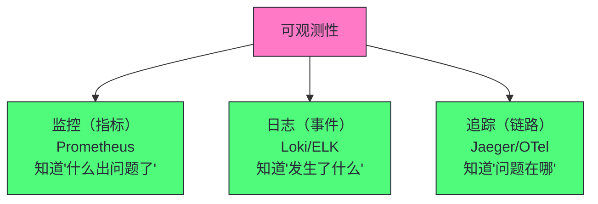
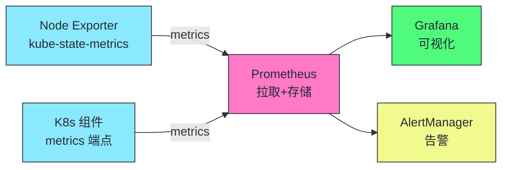
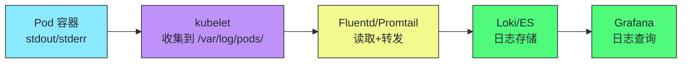
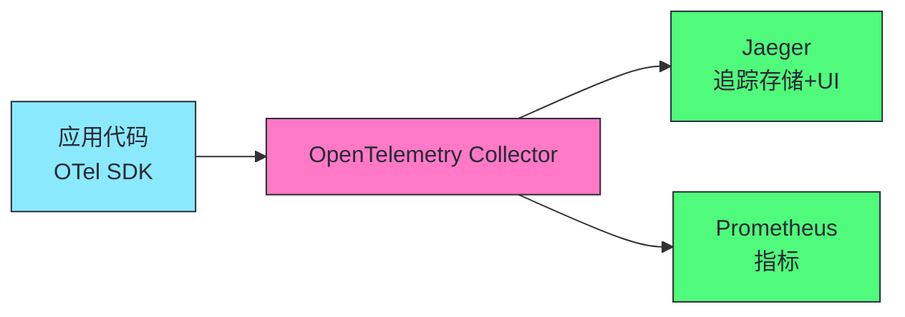

# 17 集群可观测性与故障排查：监控、日志、追踪与诊断

**摘要：**
本文深入 Kubernetes 集群的可观测性体系——监控、日志、追踪三大支柱，以及故障排查方法。可观测性是生产就绪的基础——没有可观测性的集群是"黑箱"，故障时无从排查。可观测性三大支柱：监控（指标，知道"什么出问题了"，Prometheus + Grafana）、日志（事件，知道"发生了什么"，Loki/ELK + Fluentd）、追踪（请求链路，知道"问题在哪"，Jaeger + OpenTelemetry）。三者互补而非替代——只有监控不知道根因，只有日志不知道影响范围，只有追踪不知道系统状态。监控体系以 Prometheus 为核心——pull 模式采集 /metrics 端点，Service Discovery 自动发现目标，TSDB 存储时间序列，PromQL 查询聚合，AlertManager 告警路由与抑制。K8s 核心组件的关键指标：API Server 请求延迟、etcd 磁盘 fsync 延迟（最高优先级）、kubelet PLEG 延迟、Scheduler 调度延迟、Pod CPU/内存使用率。四类黄金指标：延迟、流量、错误、饱和度。日志体系以 Fluentd/Fluent Bit 采集、Loki/ELK 存储、Kibana/Grafana 查询为核心，结构化日志比非结构化日志更易查询。追踪体系以 OpenTelemetry 标准化、Jaeger 存储查询为核心，通常采样 1% 请求。故障排查遵循"从控制平面到数据平面、从节点到 Pod、从日志到指标"的层次化方法。可观测性的核心认知：监控告警是"发现问题"，日志追踪是"定位根因"，三者配合才能从"发现问题"到"定位根因"到"修复问题"。

---

## 第 1 章 可观测性三大支柱

讲可观测性，先回到本质——什么是可观测性？可观测性是"从外部了解系统内部状态的能力"——通过系统的外部输出（指标、日志、追踪）推断系统内部状态。K8s 集群的可观测性有三大支柱。



| 支柱 | 回答的问题 | 工具 | 数据特征 |
|------|----------|------|---------|
| **监控** | 什么出问题了？ | Prometheus + Grafana | 时序数值 |
| **日志** | 发生了什么？ | Loki/ELK + Fluentd | 事件文本 |
| **追踪** | 问题在哪？ | Jaeger + OpenTelemetry | 请求链路 |

可观测性三大支柱的一个设计哲学是"互补而非替代"。监控告诉你"延迟升高了"，日志告诉你"某个 Pod 报错了"，追踪告诉你"请求经过 A→B→C，在 B 超时"。三者缺一不可——只有监控不知道根因，只有日志不知道影响范围，只有追踪不知道系统状态。完整的可观测性体系覆盖三者，加上告警和故障排查流程。

可观测性三大支柱的一个工程价值是"快速定位问题"。当故障发生时，监控告警通知"有问题"（延迟升高、错误率上升），日志告诉"发生了什么"（哪个 Pod 报错、错误内容），追踪告诉"问题在哪"（请求链路哪个环节超时）。三者配合，快速定位问题根因。没有可观测性的集群，故障时只能"盲猜"——不知道哪里有问题，不知道为什么有问题。

可观测性三大支柱的一个工程细节是"数据关联"。三大支柱的数据通过 trace_id 关联——监控指标的 trace_id 对应追踪的 trace_id，日志的 trace_id 对应追踪的 trace_id。这种"trace_id 关联"使得三大支柱的数据可以互相跳转——从监控告警跳到日志（看错误内容），从日志跳到追踪（看请求链路），从追踪跳到日志（看具体报错）。生产中确保三大支柱使用相同的 trace_id——这是可观测性"三位一体"的关键。trace_id 关联是可观测性体系设计的核心原则，缺失 trace_id 关联的可观测性体系只是三个孤立的工具，无法形成排查闭环。

> [!info] 核心概念：三大支柱互补而非替代
> 监控告诉你"延迟升高了"，日志告诉你"某个 Pod 报错了"，追踪告诉你"请求经过 A→B→C，在 B 超时"。三者缺一不可——只有监控不知道根因，只有日志不知道影响范围，只有追踪不知道系统状态。完整的可观测性体系覆盖三者，加上告警和故障排查流程。

可观测性的一个工程考量是"成本"。三大支柱都需要资源——监控需要 Prometheus 存储、日志需要 Loki/ES 存储、追踪需要 Jaeger 存储。大规模集群的可观测性成本高——指标数据量大、日志数据量大、追踪数据量大。生产中根据业务需求选择——关键业务全量采集，普通业务采样采集。譬如追踪通常采样（譬如 1% 请求），而非全量——全量追踪数据量太大。可观测性成本是生产集群运维预算的重要组成部分，需要在系统设计阶段就纳入规划，避免后期被动扩容，这是运维预算管理的基本要求。

可观测性的一个工程原则是"可观测性优先于排障"。可观测性不是"出问题后再加"——而是"出问题前就建好"。没有可观测性的集群，出问题时无从排查——不知道哪里有问题、不知道为什么有问题、不知道问题影响范围。生产中集群上线时就建立完整可观测性体系——监控、日志、追踪。这种"先建可观测性再上线业务"是生产就绪的基础，也是生产集群运维的基本要求，更是 SRE 实践的核心准则与基本共识。

可观测性的另一个工程原则是"告警最小化"。告警不是越多越好——过多告警导致"告警疲劳"，值班人员忽略所有告警。生产中只配置"可操作的告警"——每个告警有 runbook，值班人员知道如何处理。不可操作的告警（譬如"CPU 使用率高"但不知道如何降低）不配置——它们只是噪音。告警最小化是可观测性运维的核心原则，确保值班人员只收到真正需要处理的告警，而不是被噪音淹没，这是告警治理的基本准则。

---

## 第 2 章 监控体系：Prometheus + Grafana

讲完了可观测性三大支柱，接下来看监控体系——Prometheus + Grafana + AlertManager。这是 K8s 监控的事实标准。

### 2.1 Prometheus 架构



Prometheus 的一个设计哲学是"拉取（pull）模式"。Prometheus 主动访问目标的 /metrics 端点拉取指标——而不是目标推送指标到 Prometheus。这种"拉取模式"的优势是 Prometheus 控制采集节奏（避免目标过载）、目标无状态（不需要缓冲指标）、健康检查（拉取失败知道目标不可用）。劣势是目标必须暴露 /metrics 端点、短生命周期任务（Batch Job）难以拉取（需要 Pushgateway 中转）。

Prometheus 拉取模式的一个工程细节是"Pushgateway"。短生命周期任务（Batch Job）运行时间短——Prometheus 可能来不及拉取。Pushgateway 解决这个问题——Batch Job 将指标推送到 Pushgateway，Prometheus 从 Pushgateway 拉取。这种"Pushgateway 中转"使得短生命周期任务的指标也能被采集。但 Pushgateway 不是长期存储——指标需要在 Batch Job 完成后及时拉取。

Prometheus 拉取模式的另一个工程细节是"采集间隔"。Prometheus 默认 15 秒采集一次——可配置。采集间隔短（譬如 5 秒）指标精度高但开销大，采集间隔长（譬如 60 秒）开销小但精度低。生产中通常 15-30 秒——平衡精度与开销。关键指标可以用更短间隔（譬如 5 秒），普通指标用标准间隔（15 秒）。

Prometheus 的一个工程细节是"Service Discovery"。K8s 中 Pod IP 动态变化——Prometheus 需要自动发现采集目标。Prometheus 的 K8s Service Discovery 配置——譬如"采集所有有 annotation prometheus.io/scrape=true 的 Pod"。这种"自动发现"使得 Prometheus 不需要手动配置采集目标——Pod 创建/删除时 Prometheus 自动调整采集列表。

Prometheus 的 TSDB 实现值得深入。Prometheus 内建时序数据库——每个时间序列由指标名和标签集合唯一标识（譬如 `http_requests_total{method="GET",status="200"}`）。TSDB 按 2 小时为一个 block 存储数据，每个 block 包含该时间段的所有时间序列。block 内部用倒排索引加速标签查询——譬如查询 `status="200"` 的序列，倒排索引直接定位匹配的序列，不需要遍历所有序列。TSDB 的压缩机制——旧 block 会被合并成更大的 block（譬如 2 小时 block 合并成 12 小时 block），减少文件数量与查询开销。生产中 Prometheus 单实例可存储数百万时间序列，但时间序列数过多（cardinality 爆炸）会导致内存与磁盘暴涨——高基数标签（譬如 user_id、request_id）不应该作为 Prometheus 标签，这是 Prometheus 使用的核心边界，也是生产运维的关键约束。

Prometheus 的一个工程价值是"PromQL 查询语言"。PromQL 是 Prometheus 的查询语言——支持聚合、计算、时间范围查询。譬如 `rate(http_requests_total[5m])` 计算 5 分钟内的请求速率，`histogram_quantile(0.99, ...)` 计算 P99 延迟。PromQL 的表达能力强大——可以计算复杂的监控指标。这种"查询语言"使得 Prometheus 不仅是存储，还是分析工具。

Prometheus 的一个工程细节是"时序数据库 TSDB"。Prometheus 内建时序数据库——存储指标的时间序列数据。每个指标是一个时间序列——由指标名和标签唯一标识。譬如 `http_requests_total{method="GET",path="/api/users"}` 是一个时间序列。TSDB 的高效存储使得 Prometheus 可以存储大量时间序列——单实例可存储数百万时间序列。

Prometheus 的一个工程考量是"高可用"。单实例 Prometheus 是单点——故障时监控数据丢失。生产中通常用双实例 Prometheus（两个实例独立采集，互为备份）或 Thanos/Cortex（Prometheus 集群方案）。双实例简单但资源翻倍，Thanos/Cortex 复杂但支持水平扩展。生产中根据规模选择——小规模用双实例，大规模用 Thanos/Cortex。

Prometheus 的另一个工程考量是"长期存储"。Prometheus 的本地存储有限——默认保留 15 天。长期存储需要远程存储——譬如 Thanos（S3 长期存储）、Cortex（分布式存储）、VictoriaMetrics（高性能存储）。生产中通常用 Prometheus 本地存储短期数据（15 天），远程存储长期数据（1 年）。

Prometheus 高可用的实现细节值得深入。双实例方案——两个 Prometheus 实例独立采集相同目标，各自存储数据，Grafana 查询时用 `or` 合并两个实例的数据（`instance1_metric or instance2_metric`）。双实例的一个陷阱是"告警重复"——两个实例都会触发告警，AlertManager 用 `group_by` 合并相同告警，避免重复通知。Thanos 方案——每个 Prometheus 实例 sidecar 上传数据到 S3，Thanos Query 查询多个 sidecar 与 S3，实现全局查询与长期存储。Thanos 的一个工程价值是"全局查询"——可以跨多个 Prometheus 实例查询数据，适合多集群监控。VictoriaMetrics 是高性能的 Prometheus 兼容存储——支持 remote_write 接收 Prometheus 数据，存储压缩比高，查询性能好，适合大规模监控场景。

### 2.2 K8s 核心组件监控指标

| 组件 | 关键指标 | 告警阈值 |
|------|---------|---------|
| **API Server** | apiserver_request_duration_seconds | P99 >1s |
| **etcd** | etcd_disk_wal_fsync_duration_seconds | P99 >10ms |
| **kubelet** | kubelet_running_pod_count | 接近节点上限 |
| **Scheduler** | scheduler_e2e_scheduling_duration_seconds | P99 >1s |
| **Pod** | container_cpu_usage_seconds_total | 接近 limit |

K8s 核心组件监控的一个工程价值是"集群健康基础"。API Server 延迟高——可能 max-requests-inflight 过低或 etcd 慢。etcd fsync 延迟高——可能磁盘 IOPS 不足。kubelet Pod 数接近上限——节点过载。调度延迟高——调度器性能问题或资源碎片。这些指标是集群健康的关键——监控它们能提前发现集群问题。

K8s 核心组件监控的一个工程细节是"指标暴露方式"。K8s 核心组件通过 /metrics 端点暴露 Prometheus 格式指标——API Server 的 /metrics、kubelet 的 /metrics、etcd 的 /metrics。Prometheus 拉取这些端点采集指标。这种"指标暴露"是 K8s 内建的——不需要额外安装 exporter。

K8s 核心组件监控的一个工程考量是"etcd 监控的特殊性"。etcd 是 K8s 的数据存储——etcd 故障导致整个集群故障。etcd 的关键指标包括——etcd_disk_wal_fsync_duration_seconds（WAL 写入延迟，P99>10ms 说明磁盘慢）、etcd_server_proposal_durations（Raft 提案延迟）、etcd_server_leader_changes_seen（Leader 切换次数）。生产中 etcd 监控是最高优先级——etcd 问题影响整个集群。

etcd 监控的实现细节值得深入。etcd 的 WAL fsync 延迟是 etcd 健康的最关键指标——WAL 写入需要 fsync 到磁盘，磁盘慢导致 fsync 慢，进而导致 Raft 提案超时、Leader 切换、集群不可用。生产中 etcd 必须用专用 SSD 磁盘——避免与其他 IO 密集型进程（譬如数据库、日志收集器）共享磁盘，确保 fsync 延迟稳定。etcd 的 Raft 提案延迟反映共识效率——延迟高说明集群网络问题或节点负载不均。etcd 的 Leader 切换次数反映稳定性——频繁切换说明集群不稳定，可能磁盘慢或网络分区。etcd 监控的告警阈值——WAL fsync P99 > 10ms 告警，Leader 切换 > 0 告警，这些是 etcd 生产运维的关键阈值，也是集群稳定性的基础保障。

K8s 核心组件监控的另一个工程考量是"kubelet 监控"。kubelet 的关键指标包括——kubelet_running_pod_count（运行 Pod 数，接近节点上限说明过载）、kubelet_pod_start_duration_seconds（Pod 启动延迟）、kubelet_pleg_relist_duration_seconds（PLEG 列表延迟，高说明 kubelet 性能问题）。生产中监控 kubelet 指标能提前发现节点问题。

### 2.3 四类黄金指标

| 指标 | 说明 | PromQL 示例 |
|------|------|------------|
| **延迟** | 请求响应时间 | `histogram_quantile(0.99, ...)` |
| **流量** | 请求量 | `rate(http_requests_total[5m])` |
| **错误** | 错误率 | `rate(http_errors_total[5m])` |
| **饱和度** | 资源使用率 | `cpu_usage / cpu_limit` |

四类黄金指标的一个工程价值是"服务健康全景"。延迟——服务响应快不快。流量——服务负载高不高。错误——服务有没有出错。饱和度——服务资源够不够。这四个维度覆盖了服务的核心健康指标——监控它们能全面了解服务状态。Google SRE 的"四个黄金信号"就是这四个指标。

四类黄金指标的一个工程细节是"延迟分布"。延迟不是单一值——有 P50（中位数）、P99（99 分位）、P999（99.9 分位）。P50 反映"大多数请求的延迟"，P99 反映"最慢请求的延迟"。生产中通常监控 P99——P50 可能正常但 P99 异常（少数请求慢）。Prometheus 的 histogram 指标支持分位数计算——`histogram_quantile(0.99, ...)`。

四类黄金指标的一个工程考量是"饱和度与资源限制"。饱和度是资源使用率——CPU 使用率、内存使用率、磁盘使用率、网络使用率。饱和度高（譬如 CPU>80%）说明资源接近上限，需要扩容。生产中监控饱和度能提前发现资源瓶颈——在资源耗尽前扩容，避免服务降级。

四类黄金指标的另一个工程考量是"错误率与可用性"。错误率是错误请求数占总请求数的比例——譬如 5xx 错误率。错误率直接反映服务可用性——错误率高说明服务有问题。生产中通常设置错误率告警——譬如"5xx 错误率 >1% 告警"。这种"错误率告警"是服务健康的关键告警。

> [!warning] 生产避坑：告警必须有 runbook
> 每个告警必须有对应的 runbook（操作手册）——告诉值班人员"这个告警意味着什么"、"如何排查"、"如何恢复"。没有 runbook 的告警只是噪音——值班人员不知道如何处理，只能忽略。告警 + runbook 才是完整的可操作性。

告警的一个工程原则是"可操作性"。每个告警应该是"可操作的"——值班人员知道如何处理。如果一个告警无法处理（譬如"CPU 使用率高"但不知道如何降低），这个告警只是噪音——值班人员会忽略。生产中只配置可操作的告警——每个告警有 runbook，值班人员按 runbook 处理。

告警的另一个工程原则是"避免告警风暴"。故障时可能触发大量告警——譬如一个服务故障，相关服务的告警都触发。这种"告警风暴"淹没关键告警——值班人员看不到真正重要的告警。AlertManager 的告警抑制（inhibition）可以缓解——譬如"节点故障"告警抑制"节点上的 Pod 故障"告警。生产中配置告警抑制，避免告警风暴。

告警的一个工程细节是"告警分组"。AlertManager 可以将相关告警分组——譬如同一服务的多个告警合并为一组通知。这种"告警分组"减少了通知数量——值班人员收到一个通知（包含多个相关告警），而不是多个独立通知。生产中按服务分组告警——同一服务的告警合并通知。

告警的另一个工程细节是"告警路由"。AlertManager 可以将告警路由到不同接收者——譬如关键告警发送到 PagerDuty（电话通知），普通告警发送到 Slack（消息通知）。这种"告警路由"确保关键告警得到及时处理——电话通知比消息通知更难忽略。

AlertManager 的实现值得深入。AlertManager 是 Prometheus 的告警组件——Prometheus 根据告警规则（alerting rules）评估指标，触发条件时发送告警到 AlertManager。AlertManager 的处理流程——接收告警、分组（grouping，按 label 分组合并）、抑制（inhibition，根据规则抑制次要告警）、静默（silencing，手动屏蔽告警）、路由（routing，按 severity/team 路由到不同接收者）、通知（notification，发送到 PagerDuty/Slack/Email）。告警规则的一个工程细节是"for 持续时间"——告警规则可以配置 `for: 5m`，表示条件持续 5 分钟才告警，避免瞬时波动触发告警。生产中通常用 1-5 分钟的 for 持续时间，平衡告警灵敏度与噪音。告警规则的一个工程陷阱是"告警阈值过敏感"——譬如 CPU>50% 告警，正常业务高峰 CPU 可能 70%，导致频繁误报。生产中根据业务基线设置阈值，避免误报。

---

## 第 3 章 日志体系

讲完了监控体系，接下来看日志体系——Loki/ELK + Fluentd/Promtail。日志记录"发生了什么"——是故障排查的关键。

### 3.1 K8s 日志模型

K8s Pod 的日志通过 stdout/stderr 输出——kubelet 收集到 `/var/log/pods/`，日志收集工具（Fluentd/Promtail）读取并转发。



K8s 日志模型的一个设计哲学是"stdout/stderr"。K8s 要求应用日志输出到 stdout/stderr——而不是写文件。这种"stdout/stderr"模型使得日志收集标准化——kubelet 统一收集到 /var/log/pods/，日志收集工具统一读取。如果应用写文件，日志收集工具需要进入容器读取——复杂且不可靠。

K8s 日志模型的一个工程价值是"日志与 Pod 生命周期一致"。Pod 删除时，kubelet 收集的日志也删除——日志与 Pod 生命周期一致。这种"生命周期一致"使得日志不会无限积累——Pod 删除后日志自动清理。但生产中需要将日志转发到外部存储（Loki/ES）——否则 Pod 删除后日志丢失，无法事后排查。

K8s 日志模型的一个工程细节是"日志轮转"。kubelet 对容器日志做轮转——默认每个容器日志文件最大 10MB，最多保留 5 个文件。日志轮转防止单个容器日志占满节点磁盘。生产中需要监控节点磁盘使用——日志轮转配置不当可能导致磁盘满（譬如日志量大的容器，10MB 轮转太快）。

K8s 日志模型的另一个工程细节是"kubectl logs 的实现"。kubectl logs 实际是调用 kubelet API——kubelet 读取 /var/log/pods/ 下的日志文件返回。`kubectl logs --previous` 读取上一次崩溃的日志文件——kubelet 保留了上一次容器的日志文件。这种"基于文件"的日志查询简单但有限——只能查询当前节点的日志，不能跨节点查询。跨节点查询需要日志收集到中心存储（Loki/ES）。

### 3.2 日志收集方案对比

| 方案 | 机制 | 优势 | 劣势 |
|------|------|------|------|
| **DaemonSet（Fluentd）** | 每节点一个，读 /var/log/pods | 资源开销固定 | 日志量大时压力大 |
| **Sidecar** | 每 Pod 一个 sidecar | 隔离性好 | 资源浪费 |
| **Node Agent（Promtail）** | 类似 DaemonSet | 与 Loki 集成好 | - |

日志收集方案的一个工程考量是"DaemonSet vs Sidecar"。DaemonSet 方案——每节点一个日志收集器，资源开销固定（不随 Pod 数增长），但日志量大时单节点收集器压力大。Sidecar 方案——每 Pod 一个 sidecar，隔离性好（每个 Pod 独立收集），但资源浪费（每个 Pod 一个 sidecar）。生产中通常用 DaemonSet——资源开销固定，适合大规模集群。

日志收集方案的一个工程细节是"Promtail 与 Loki 集成"。Promtail 是 Grafana Loki 的日志收集器——与 Loki 深度集成，支持日志标签（label）与日志流水线（pipeline）。Promtail 读取 /var/log/pods/，提取日志标签（譬如 namespace、pod_name、container_name），转发到 Loki。这种"标签化"使得 Loki 可以按标签查询日志——譬如"查询 production Namespace 的所有日志"。

日志收集方案的一个工程考量是"日志采样"。大规模集群日志量大——全量收集成本高。生产中可以对非关键日志采样——譬如只收集 ERROR 级别日志，INFO 级别日志采样。这种"日志采样"降低了存储成本，但可能漏掉关键信息（譬如 INFO 级别的异常）。生产中关键业务全量收集，普通业务采样收集。

日志收集的实现细节值得深入。Fluentd/Fluent Bit 的 DaemonSet 部署——每个节点一个 Pod，挂载节点的 `/var/log/pods/` 目录，读取所有容器的日志文件。Fluentd 的 tail 插件监控日志文件变化，新增日志行立即读取转发。Fluentd 的过滤插件支持日志解析（譬如解析 JSON 日志提取字段）、日志修改（譬如添加 cluster_name 标签）。Fluentd 的输出插件支持多种后端——Loki、Elasticsearch、Kafka、S3。生产中通常用 Fluentd 采集 + Loki/Elasticsearch 存储 + Grafana/Kibana 查询的架构。Fluent Bit 是 Fluentd 的轻量版——C 语言实现，资源开销更小，适合资源受限的节点。大规模集群可以用 Fluent Bit 采集 + Fluentd 聚合的二级架构，减少中心存储压力，这是大规模日志收集的常见方案。

### 3.3 结构化日志的价值

```json
// 非结构化日志
2026-07-17 10:00:00 GET /api/users 200 50ms

// 结构化日志（JSON）
{"timestamp":"2026-07-17T10:00:00Z","method":"GET","path":"/api/users","status":200,"duration_ms":50,"trace_id":"abc123"}
```

结构化日志的一个工程价值是"字段查询"。结构化日志（JSON）支持按字段查询——"查找所有 status=500 的请求"、"按 trace_id 关联日志"、"按 path 聚合请求量"。非结构化日志只能全文搜索——查询效率低，无法精确按字段过滤。生产中应用应输出结构化日志，包含 trace_id 用于关联追踪。

> [!info] 核心概念：结构化日志支持字段查询
> 结构化日志（JSON）支持按字段查询——"查找所有 status=500 的请求"、"按 trace_id 关联日志"。非结构化日志只能全文搜索。K8s 1.19+ 的组件已支持结构化日志（JSON 格式）。生产环境应用应输出结构化日志，包含 trace_id 用于关联追踪。

结构化日志的一个工程细节是"trace_id 关联追踪"。结构化日志包含 trace_id——通过 trace_id 可以关联追踪系统（Jaeger）的请求链路。譬如日志显示"status=500"，通过 trace_id 在 Jaeger 查看该请求的完整链路——经过哪些服务、哪个服务超时。这种"日志与追踪关联"使得故障排查更高效——从日志定位到追踪，从追踪定位到根因。

结构化日志的一个工程考量是"日志级别"。结构化日志通常包含日志级别（level）——DEBUG/INFO/WARN/ERROR。生产中通常只收集 INFO 及以上级别——DEBUG 级别日志量大，且对生产排查价值低。但某些场景需要 DEBUG 日志（譬如排查复杂问题），可以临时调整日志级别。这种"日志级别控制"平衡了日志量与排查能力。

结构化日志的另一个工程考量是"敏感信息"。日志可能包含敏感信息（譬如密码、token、个人信息）。生产中需要对敏感信息脱敏——譬如密码字段用 `***` 替换。这种"脱敏"防止了敏感信息泄露。日志审计可以检测未脱敏的敏感信息——譬如扫描日志中的 password 字段。

结构化日志的实现细节值得深入。K8s 1.19+ 的组件（kubelet、kube-apiserver 等）已支持结构化日志——通过 `--log-format=json` 参数启用 JSON 格式输出。结构化日志的 JSON 格式包含固定字段（ts 时间戳、level 级别、msg 消息、logger 日志器名）和可变字段（譬如 controller、object 等）。这种"结构化输出"使得 K8s 组件日志可以被日志系统（Loki/ELK）精确解析与查询。生产中应用也应输出结构化日志——用 JSON 格式输出，包含 trace_id、user_id、request_id 等可查询字段。日志库（譬如 Java 的 Logback、Go 的 zap、Python 的 structlog）都支持 JSON 输出，生产中配置 JSON 格式输出，便于日志系统解析。

### 3.4 Loki 与 ELK 对比

Loki 与 ELK 的一个对比是"索引策略"。Loki 只索引日志的标签（label）——不索引日志内容。ELK 全文索引——索引日志的所有内容。Loki 的索引开销低（只索引标签），存储成本低。ELK 的索引开销高（全文索引），但查询能力强（全文搜索）。生产中根据查询需求选择——需要全文搜索用 ELK，只需要按标签查询用 Loki。

Loki 与 ELK 的另一个对比是"资源成本"。Loki 轻量——只索引标签，存储成本低，适合大规模日志。ELK 重量——全文索引，存储成本高，但查询能力强。生产中大规模日志用 Loki（成本低），小规模日志用 ELK（查询强）。混合方案——Loki 存储所有日志，ELK 存储关键日志（譬如错误日志）。

Loki 与 ELK 的一个工程考量是"查询能力"。Loki 的查询能力弱——只支持按标签过滤 + LogQL 查询（类似 PromQL 的日志查询语言）。ELK 的查询能力强——支持全文搜索、复杂聚合、Kibana 可视化。生产中如果需要复杂日志分析（譬如日志趋势分析、错误率统计），用 ELK；如果只需要按标签查询日志（譬如"查询某 Pod 的日志"），用 Loki。

Loki 与 ELK 的另一个工程考量是"运维复杂度"。Loki 运维简单——单二进制部署，与 Grafana 集成好。ELK 运维复杂——Elasticsearch 集群管理复杂（分片、副本、索引生命周期），Kibana 可视化。生产中如果运维能力有限，用 Loki；如果有专门的运维团队，用 ELK。

Loki 的实现细节值得深入。Loki 的设计哲学是"只索引标签，不索引内容"——日志内容不索引，只按标签（譬如 namespace、pod_name）索引。查询时先按标签定位日志块，再在日志块内做全文搜索。这种设计使得 Loki 的索引开销极低（只有标签索引），存储成本远低于 ELK（ELK 索引日志的所有内容）。Loki 的查询语言 LogQL 类似 PromQL——支持按标签过滤（`{namespace="production"}`）、正则匹配（`|~ "error"`）、JSON 解析（`| json`）、聚合计算（`rate(...[5m])`）。Loki 的存储后端支持 S3/GCS/本地文件系统——日志内容存储在对象存储，索引存储在本地或对象存储。这种"索引与内容分离"的架构使得 Loki 可以低成本存储海量日志，但查询性能不如 ELK（全文搜索需要扫描日志块），这是 Loki 的核心边界。

---

## 第 4 章 分布式追踪

讲完了日志体系，接下来看分布式追踪——OpenTelemetry + Jaeger。追踪记录"请求链路"——是定位跨服务问题的利器。

### 4.1 OpenTelemetry



OpenTelemetry 的一个工程价值是"统一采集"。OpenTelemetry 统一了指标、日志、追踪的采集——OTel SDK 采集三种数据，Collector 转发到不同后端（Jaeger 追踪、Prometheus 指标、Loki 日志）。这种"统一采集"使得应用只需集成一个 SDK——不需要分别集成 Prometheus client、Jaeger client、日志库。OpenTelemetry 是可观测性的"统一标准"。

OpenTelemetry 的一个工程细节是"Collector"。Collector 是 OpenTelemetry 的中间组件——接收应用 SDK 的数据，处理（过滤、采样、增强），转发到后端。Collector 的一个价值是"解耦"——应用不需要知道后端是什么（Jaeger 还是 Zipkin），只发送到 Collector。后端切换时只改 Collector 配置，不改应用代码。

OpenTelemetry 的一个工程价值是"统一标准"。OpenTelemetry 是 CNCF 的可观测性标准——统一了指标、日志、追踪的采集规范。OpenTelemetry 的目标是"一次集成，多处使用"——应用集成 OTel SDK，数据可以发送到任何支持 OTel 的后端（Jaeger、Zipkin、Prometheus、Loki、Datadog 等）。这种"统一标准"避免了厂商锁定——切换后端只改 Collector 配置，不改应用代码。

OpenTelemetry 的一个工程考量是"自动 instrumentation"。OpenTelemetry 支持自动 instrumentation——无需修改应用代码，自动采集 HTTP 请求、数据库调用等的 trace。譬如 Java 的 OTel agent 可以自动拦截 HTTP 请求，生成 span。这种"自动 instrumentation"降低了追踪落地成本——应用不需要手动埋点。但自动 instrumentation 可能不支持所有框架——某些自定义调用需要手动埋点。

### 4.2 K8s 中追踪的挑战

| 挑战 | 说明 |
|------|------|
| **跨 Pod 传播 context** | HTTP header 传播 trace context |
| **Sidecar 不可见** | Service Mesh 的 sidecar 产生 span |
| **异步消息** | 消息队列的 trace context 传播 |
| **数据库调用** | 数据库驱动的 trace 支持 |

K8s 追踪的一个挑战是"跨 Pod 传播 context"。分布式追踪需要 trace context（trace_id, span_id）在服务间传播——A 调用 B 时，A 的 trace context 通过 HTTP header 传给 B，B 继续追踪。如果应用没有手动传播 trace context（HTTP header），不同服务的 trace_id 不同，无法关联。这种"手动传播"是追踪的难点——每个服务都需要修改代码传播 trace context。

K8s 追踪的一个工程细节是"trace context 格式"。trace context 通过 HTTP header 传播——W3C Trace Context 标准（traceparent header）是主流，B3 是旧标准（Zipkin 使用）。OpenTelemetry 默认用 W3C Trace Context，兼容 B3。生产中用 W3C Trace Context——它是行业标准，被主流追踪系统支持。

K8s 追踪的一个解决方案是"Service Mesh 自动传播"。Istio 等 Service Mesh 可以自动传播 trace context——sidecar 代理拦截 HTTP 请求，自动添加/转发 trace context header。应用不需要修改代码——sidecar 自动处理。这种"自动传播"使得追踪更容易落地——不需要修改每个服务。

K8s 追踪的另一个工程考量是"追踪与日志关联"。追踪和日志通过 trace_id 关联——日志中的 trace_id 对应追踪中的 trace_id。这种"关联"使得从日志可以跳转到追踪（从日志的 trace_id 在 Jaeger 查看链路），从追踪可以跳转到日志（从追踪的 trace_id 在 Loki 查看日志）。生产中确保日志和追踪使用相同的 trace_id——这是可观测性"三位一体"的基础。

K8s 追踪的另一个挑战是"异步消息"。消息队列（譬如 Kafka）的 trace context 传播——生产者发送消息时需要将 trace context 放入消息 header，消费者接收消息时从 header 提取 trace context。这种"异步传播"比同步 HTTP 传播复杂——需要消息队列支持 header（譬如 Kafka 的 header）。OpenTelemetry 提供了消息队列的 trace 传播规范。

K8s 追踪的一个工程考量是"采样策略"。追踪数据量大——全量追踪成本高。生产中通常采样——譬如头部采样（head sampling，固定比例 1%）、尾部采样（tail sampling，根据请求特征采样）。头部采样简单但可能漏掉关键请求（错误请求被采样掉）。尾部采样智能但复杂——需要 Collector 缓存完整 trace 后决定是否采样（譬如只采样错误请求、慢请求）。生产中关键业务用尾部采样（确保错误请求被追踪），普通业务用头部采样。

K8s 追踪的另一个工程考量是"span 数量"。一个请求经过多个服务，每个服务产生多个 span（HTTP 调用、数据库调用等）。span 数量多导致追踪数据量大。生产中可以控制 span 数量——譬如合并细粒度 span、不追踪缓存调用。这种"span 控制"平衡了追踪粒度与数据量。

OpenTelemetry 的 Collector 实现值得深入。Collector 是 OpenTelemetry 的中间组件——接收应用 SDK 的数据，处理（过滤、采样、增强），转发到后端。Collector 的 pipeline 分三个阶段——receiver（接收数据，支持 OTLP、Jaeger、Zipkin 等协议）、processor（处理数据，譬如采样、过滤、添加标签）、exporter（转发数据到后端，譬如 Jaeger、Prometheus、Loki）。Collector 的部署模式有两种——agent 模式（每个节点一个 Collector，与应用同节点，减少网络延迟）和 gateway 模式（集群级 Collector，聚合多个 agent 的数据）。生产中通常用 agent + gateway 二级架构——agent 采集本地数据转发到 gateway，gateway 聚合后转发到后端，减少后端连接数。Collector 的一个工程价值是"采样下沉"——尾部采样在 Collector 实现，应用只发送全量 trace，Collector 根据规则采样，应用无需感知采样逻辑。

---

## 第 5 章 故障排查方法

讲完了可观测性三大支柱，最后看故障排查方法。可观测性是"看得到问题"，故障排查是"知道怎么修"。

### 5.1 Pod 级别排查

```bash
# 1. 查看 Pod 状态
kubectl get pod <name> -o wide

# 2. 查看 Pod 详情（Events）
kubectl describe pod <name>

# 3. 查看容器日志
kubectl logs <name>
kubectl logs <name> --previous  # 上一次崩溃的日志

# 4. 进入容器
kubectl exec -it <name> -- /bin/sh

# 5. 查看容器状态
kubectl get pod <name> -o jsonpath='{.status.containerStatuses}'
```

Pod 级别排查的一个工程流程是"状态 → Events → 日志 → 进入容器"。先看 Pod 状态（kubectl get）——Pending/Running/CrashLoopBackOff。再看 Events（kubectl describe）——调度失败、镜像拉取失败、健康检查失败。再看日志（kubectl logs）——应用报错。最后进入容器（kubectl exec）——检查应用状态。这种"从外到内"的排查流程高效——先看外部状态，再查内部日志。

Pod 级别排查的一个工程细节是"--previous 日志"。Pod 崩溃重启后，当前日志是重启后的日志——崩溃前的日志看不到。`kubectl logs --previous` 查看上一次崩溃的日志——定位崩溃原因。这是排查 CrashLoopBackOff 的关键命令。

Pod 级别排查的一个工程考量是"Events 的价值"。kubectl describe pod 的 Events 部分记录了 Pod 的关键事件——调度、镜像拉取、容器启动、健康检查。Events 是排查 Pod 问题的第一手信息——譬如"FailedScheduling"（调度失败）、"ImagePullBackOff"（镜像拉取失败）、"Unhealthy"（健康检查失败）。生产中排查 Pod 问题时先看 Events——大多数问题在 Events 中有明确原因。

Pod 级别排查的实现细节值得深入。kubectl describe pod 的 Events 来自 etcd 中的 Event 对象——kubelet、调度器、控制器在 Pod 生命周期中产生 Event，写入 etcd。Event 对象有 TTL（默认 1 小时），过期自动删除，避免 etcd 积累大量历史 Event。Event 的 reason 字段是机器可读的故障类型（譬如 FailedScheduling、Unhealthy），message 字段是人类可读的描述。生产中可以用 `kubectl get events --field-selector reason=FailedScheduling` 查询特定类型的 Event，快速定位批量问题。Event 的一个工程陷阱是"Event 丢失"——etcd Event 有数量限制（默认每个 Namespace 最多 10000 个 Event），超过限制旧 Event 被删除。大规模集群的 Event 量大，可能丢失关键 Event，生产中可以用 Event 导出工具（譬如 kubernetes-event-exporter）将 Event 转发到外部存储。

Pod 级别排查的另一个工程考量是"init 容器"。Pod 可能有 init 容器——init 容器在主容器之前运行。如果 init 容器失败，主容器不会启动。排查时需要检查 init 容器——`kubectl logs <name> -c <init-container-name>` 查看 init 容器日志。这种"init 容器排查"容易被忽略——只看主容器日志，忽略 init 容器。

### 5.2 节点级别排查

```bash
# 1. 节点状态
kubectl describe node <name>

# 2. 节点上的 Pod
kubectl get pods --field-selector spec.nodeName=<name> --all-namespaces

# 3. 节点资源使用
kubectl top node <name>

# 4. SSH 到节点检查
systemctl status kubelet
journalctl -u kubelet
```

节点级别排查的一个工程流程是"状态 → Pod → 资源 → kubelet"。先看节点状态（kubectl describe node）——Ready/NotReady、资源使用、Conditions。再看节点上的 Pod（kubectl get pods --field-selector）——Pod 是否正常。再看节点资源（kubectl top node）——CPU/内存使用率。最后 SSH 到节点检查 kubelet（systemctl status kubelet, journalctl -u kubelet）——kubelet 是否正常运行。

节点级别排查的一个常见场景是"节点 NotReady"。节点 NotReady 通常是 kubelet 问题——kubelet 进程故障、kubelet 与 API Server 通信失败、kubelet 资源不足。排查方法——SSH 到节点，检查 kubelet 状态（systemctl status kubelet）、kubelet 日志（journalctl -u kubelet）、节点资源（top/free）。如果 kubelet 故障，重启 kubelet；如果资源不足，清理资源。

节点级别排查的另一个常见场景是"节点资源压力"。节点 CPU/内存/磁盘使用率高——导致 Pod 被驱逐或 OOMKilled。排查方法——kubectl top node 看资源使用率，kubectl describe node 看 Capacity/Allocatable/Allocated。如果资源不足，添加节点或迁移 Pod。生产中监控节点资源使用率，提前扩容避免资源压力。

节点级别排查的一个工程细节是"Conditions"。kubectl describe node 的 Conditions 部分记录了节点状态——Ready（节点是否就绪）、MemoryPressure（内存压力）、DiskPressure（磁盘压力）、PIDPressure（进程压力）。这些 Conditions 是节点健康的关键指标——譬如 DiskPressure=true 说明节点磁盘不足，需要清理。

节点 NotReady 的实现细节值得深入。节点 NotReady 由 kubelet 的心跳机制决定——kubelet 定期更新 Node 对象的 `status.conditions` 中的 `Ready` condition。如果 kubelet 超过 40 秒（默认 `node-monitor-grace-period`）没有更新心跳，节点控制器将节点标记为 NotReady。节点 NotReady 后，节点控制器按 `pod-eviction-timeout`（默认 5 分钟）驱逐节点上的 Pod。排查 NotReady 的方法——SSH 到节点检查 kubelet 进程（`systemctl status kubelet`）、kubelet 日志（`journalctl -u kubelet --since "10 min ago"`）、节点资源（`top`/`free`/`df`）。常见根因包括 kubelet 进程崩溃、kubelet 与 API Server 网络不通、节点内存/磁盘耗尽导致 kubelet 无法运行。生产中监控节点心跳延迟（`kubelet_node_status_heartbeat_*`），提前发现 NotReady 风险。

### 5.3 集群级别排查

| 问题 | 排查方法 |
|------|---------|
| **API Server 慢** | 检查 max-requests-inflight、etcd 延迟 |
| **Pod 大量 Pending** | 检查资源是否充足、调度器是否正常 |
| **节点大量 NotReady** | 检查网络、kubelet、节点资源 |
| **etcd 不稳定** | 检查磁盘 IOPS、Leader 切换 |

集群级别排查的一个工程价值是"定位系统性问题"。Pod 级别和节点级别排查定位"单个 Pod/节点的问题"，集群级别排查定位"系统性问题"——譬如 API Server 慢导致所有请求慢、etcd 不稳定导致所有写操作失败。这种"系统性问题"影响整个集群，需要从集群级别排查。

集群级别排查的一个工程细节是"API Server 慢的根因"。API Server 慢可能由多种原因——max-requests-inflight 过低（并发请求限制）、etcd 延迟高（etcd 磁盘 IOPS 不足）、请求量大（客户端请求过多）。排查方法——检查 API Server 指标（apiserver_request_duration_seconds）、etcd 指标（etcd_disk_wal_fsync_duration_seconds）、请求量（apiserver_request_total）。根据指标定位根因。

集群级别排查的一个工程考量是"区分 API Server 过载与 etcd 慢"。API Server 过载——请求量大、max-requests-inflight 满，表现为请求排队。etcd 慢——etcd fsync 延迟高、磁盘 IOPS 不足，表现为写操作慢。区分方法——API Server 过载时读操作也慢（请求排队），etcd 慢时只有写操作慢（读操作走缓存）。生产中根据指标区分——apiserver_request_duration_seconds 全部升高是 API Server 过载，只有写操作升高是 etcd 慢。

集群级别排查的另一个工程考量是"etcd 不稳定"。etcd 不稳定的表现——Leader 频繁切换、Raft 提案失败、etcd 延迟高。根因通常是磁盘问题——etcd 对磁盘延迟敏感，磁盘 IOPS 不足导致 fsync 慢，进而导致 Leader 切换。排查方法——检查 etcd 磁盘 IOPS（iostat）、etcd 指标（etcd_disk_wal_fsync_duration_seconds, etcd_server_leader_changes_seen）。生产中 etcd 用专用磁盘（SSD），避免与其他 IO 竞争。

集群级别排查的一个工程考量是"Pod 大量 Pending"。Pod 大量 Pending 可能由多种原因——集群资源不足（没有足够节点）、调度器性能问题（调度器无法及时调度）、资源碎片（节点有足够总量但碎片化）。排查方法——kubectl get pods 看 Pending 数量，kubectl describe pod 看 FailedScheduling 原因。如果是资源不足，添加节点；如果是调度器问题，检查调度器指标；如果是资源碎片，用 descheduler 重新调度。

常见故障模式的实现细节值得深入。CrashLoopBackOff 是 Pod 反复崩溃重启的状态——kubelet 用指数退避重启容器（第一次立即重启，第二次等 10 秒，第三次等 20 秒...最大 5 分钟）。排查 CrashLoopBackOff 用 `kubectl logs --previous` 看崩溃前日志，常见原因包括配置错误（应用读不到配置）、依赖缺失（数据库连不上）、启动失败（端口被占用）。OOMKilled 是容器内存超过 limits 被内核杀死——排查用 `kubectl describe pod` 看 `lastState.terminated.reason: OOMKilled`，常见原因包括 limits.memory 过低、应用内存泄漏、大对象加载。ImagePullBackOff 是镜像拉取失败——常见原因包括镜像名错误、registry 认证失败、网络不通。Evicted 是节点资源压力导致 kubelet 驱逐 Pod——节点 MemoryPressure 或 DiskPressure 时，kubelet 按 QoS 等级驱逐 Pod 释放资源。

### 5.4 常见故障模式

| 故障 | 原因 | 排查方法 |
|------|------|---------|
| **Pending** | 资源不足/调度失败 | kubectl describe pod 看 Events |
| **ContainerCreating** | 镜像拉取失败/网络问题 | kubectl describe pod 看 Events |
| **CrashLoopBackOff** | 应用崩溃/配置错误 | kubectl logs --previous |
| **OOMKilled** | 内存不足 | kubectl describe pod 看 OOMKilled |
| **Evicted** | 节点资源压力 | kubectl describe pod 看 Evicted |
| **ImagePullBackOff** | 镜像拉取失败 | kubectl describe pod 看 Events |
| **NotReady** | 节点 kubelet 故障 | kubectl describe node |

常见故障模式的一个工程价值是"快速定位"。每种故障模式有典型原因与排查方法——Pending 通常是资源不足或调度失败，CrashLoopBackOff 通常是应用崩溃，OOMKilled 通常是内存不足。熟悉这些故障模式，故障时快速定位——看 Pod 状态就知道大概原因，按对应方法排查。

常见故障模式的一个工程细节是"CrashLoopBackOff 的常见原因"。CrashLoopBackOff 表示容器反复崩溃重启——常见原因包括应用启动失败（配置错误、依赖缺失）、应用运行时崩溃（空指针、数据库连接失败）、健康检查失败（liveness probe 失败导致重启）。排查方法——kubectl logs --previous 看崩溃前日志，kubectl describe pod 看 Events。根据日志定位崩溃原因。

常见故障模式的另一个工程细节是"OOMKilled 的排查"。OOMKilled 表示容器因内存不足被内核杀死——常见原因包括 limits.memory 过低、应用内存泄漏、大对象加载。排查方法——kubectl describe pod 看 OOMKilled 标记，kubectl top pod 看内存使用趋势（持续上升说明泄漏）。如果是内存泄漏，需要修复应用；如果是 limits 过低，需要调大 limits。

常见故障模式的一个工程考量是"Pending 的调度失败原因"。Pending 表示 Pod 无法调度——常见原因包括资源不足（没有节点有足够 requests 容量）、节点选择器不匹配（nodeSelector/affinity 不匹配任何节点）、污点容忍（taints 没有对应 toleration）、资源碎片（节点有足够总量但碎片化）。排查方法——kubectl describe pod 看 Events 的 FailedScheduling 原因。

常见故障模式的一个工程细节是"ImagePullBackOff 的原因"。ImagePullBackOff 表示镜像拉取失败——常见原因包括镜像不存在（镜像名拼写错误）、仓库认证失败（没有 imagePullSecrets）、网络问题（无法访问镜像仓库）、镜像过大（拉取超时）。排查方法——kubectl describe pod 看 Events 的拉取错误信息。生产中确保镜像名正确、配置 imagePullSecrets、镜像仓库可访问。

常见故障模式的另一个工程细节是"Evicted 的原因"。Evicted 表示 Pod 被驱逐——常见原因是节点资源压力（磁盘压力、内存压力）。kubelet 在节点资源压力时驱逐 Pod——先驱逐 BestEffort Pod，再驱逐 Burstable Pod。排查方法——kubectl describe pod 看 Evicted 原因，kubectl describe node 看 Conditions（DiskPressure/MemoryPressure）。

> [!info] 核心概念：故障排查从最具体到最通用
> 故障排查的正确顺序：Pod 级别（describe/logs/exec）→ 节点级别（node status/top）→ 集群级别（API Server/etcd/scheduler）。先定位"哪个 Pod/节点有问题"，再查"为什么"。不要一开始就查集群级别的日志——大多数问题是 Pod 或节点级别的。

故障排查的一个工程原则是"从最具体到最通用"。先排查 Pod 级别（最具体）——大多数问题是 Pod 级别。如果 Pod 级别正常，再排查节点级别。如果节点级别正常，最后排查集群级别（最通用）。这种"从具体到通用"的顺序高效——避免一开始就查集群级别日志（信息量大，难以定位）。

故障排查的另一个工程原则是"先定位再修复"。故障发生时，先定位问题（哪个 Pod/节点/集群组件有问题），再修复问题。不要"先尝试修复"——譬如"重启 Pod 看看"——这掩盖了问题根因，问题可能复发。生产中先定位根因，再针对性修复——确保问题不再复发。

故障排查的一个工程考量是"建立排查文档"。每次故障排查后，记录排查过程——问题现象、排查步骤、根因、修复方法。这种"排查文档"是知识积累——下次类似问题可以快速定位。生产中将排查文档与 runbook 结合——runbook 是标准操作流程，排查文档是实际案例。

---

## 总结

可观测性三大支柱：监控（指标，Prometheus + Grafana，知道"什么出问题"）、日志（事件，Loki/ELK + Fluentd，知道"发生什么"）、追踪（请求链路，Jaeger + OpenTelemetry，知道"问题在哪"），三者互补而非替代。可观测性有成本考量——关键业务全量采集，普通业务采样采集，追踪通常采样 1% 请求。Prometheus 是 K8s 监控事实标准——pull 模式采集 /metrics 端点，Service Discovery 自动发现目标，TSDB 按 block 存储时间序列并用倒排索引加速查询，PromQL 查询聚合，AlertManager 告警路由与抑制。Prometheus 高可用用双实例或 Thanos/Cortex 集群方案，长期存储用 Thanos（S3）/Cortex/VictoriaMetrics。K8s 核心组件的关键指标：API Server 请求延迟、etcd 磁盘 fsync 延迟（最高优先级，用专用 SSD）、kubelet PLEG 延迟、Scheduler 调度延迟、Pod CPU/内存使用率。四类黄金指标：延迟（P99）、流量、错误、饱和度。告警必须有 runbook，AlertManager 抑制避免告警风暴，for 持续时间避免瞬时波动误报。日志体系：kubelet 收集 stdout/stderr 到 /var/log/pods，Fluentd/Fluent Bit DaemonSet 采集转发，Loki（只索引标签成本低）/ELK（全文索引查询强）存储，结构化日志（JSON + trace_id）比非结构化更易查询，K8s 1.19+ 组件支持 JSON 格式输出。追踪体系：OpenTelemetry 统一采集，Collector 分 receiver/processor/exporter 三阶段，Jaeger 存储查询，跨 Pod context 传播是 K8s 追踪的挑战，尾部采样在 Collector 实现采样下沉。故障排查从具体到通用——Pod 级别（describe/logs，Event 来自 etcd 有 TTL 与数量限制）→ 节点级别（top/describe，NotReady 由心跳机制决定）→ 集群级别（API Server/etcd，区分过载与 etcd 慢）。常见故障模式：Pending（资源不足）、CrashLoopBackOff（指数退避重启）、OOMKilled（limits.memory）、Evicted（节点资源压力）、ImagePullBackOff（镜像拉取）、NotReady（kubelet 故障）。可观测性不是"装个 Prometheus 就完了"——它是覆盖指标、日志、追踪的完整体系，加上清晰的故障排查流程。没有可观测性的集群不是生产就绪的。

> [!info] 专栏导航
> 本文是 [[00 专栏导览|Kubernetes 架构深度剖析专栏]] 的第 17 篇，深入可观测性和故障排查。下一篇 [[18 弹性伸缩与多集群：HPA VPA Cluster Autoscaler 与 KubeFed]] 将讨论 K8s 的弹性伸缩和多集群管理。

---

## 延伸思考

1. **你的集群是否有完整的可观测性？** 检查三大支柱——Prometheus 监控、Loki/ELK 日志、Jaeger 追踪。缺任何一个都是盲区。

2. **你的告警是否有 runbook？** 每个告警对应的排查和恢复步骤。没有 runbook 的告警是噪音——值班人员不知道如何处理。

3. **你的应用日志是否结构化？** JSON 格式 + trace_id。非结构化日志只能全文搜索，难以关联追踪。

4. **你的故障排查是否有标准流程？** 从 Pod 到节点到集群的排查顺序。先定位"哪个有问题"再查"为什么"。

5. **你的 K8s 核心组件是否被监控？** API Server 延迟、etcd fsync、kubelet Pod 数、调度延迟——这些是集群健康的关键指标。

6. **你的追踪是否采样？** 全量追踪数据量大，通常采样（1%）。关键业务全量追踪，普通业务采样。

7. **你的日志收集是 DaemonSet 还是 Sidecar？** DaemonSet 资源开销固定，适合大规模。Sidecar 隔离好但资源浪费。

8. **你的告警是否配置了抑制？** 故障时告警风暴淹没关键告警。AlertManager 告警抑制——节点故障告警抑制 Pod 故障告警。

9. **你的追踪是否用了 Service Mesh 自动传播？** Istio sidecar 自动传播 trace context，应用不需要修改代码。如果没有 Service Mesh，需要手动传播。

10. **你的故障排查是否熟悉常见故障模式？** Pending/CrashLoopBackOff/OOMKilled/Evicted/ImagePullBackOff/NotReady——每种故障有典型原因与排查方法。

11. **你的 Prometheus 是否配置了高可用？** 单实例是单点——故障时监控数据丢失。双实例互为备份或 Thanos/Cortex 集群方案。

12. **你的 Prometheus 是否有长期存储？** 本地存储默认 15 天，长期存储用 Thanos/Cortex/VictoriaMetrics。本地短期 + 远程长期。

13. **你的 etcd 是否用专用 SSD 磁盘？** etcd 对磁盘延迟敏感，IOPS 不足导致 fsync 慢进而 Leader 切换。专用 SSD 避免与其他 IO 竞争。

14. **你的日志是否配置了轮转？** kubelet 默认 10MB 保留 5 个文件。日志量大的容器需要调整轮转配置，否则磁盘可能满。

15. **你的追踪是否用了尾部采样？** 头部采样可能漏掉关键请求（错误请求被采样掉）。尾部采样只采样错误请求、慢请求，确保关键请求被追踪。

16. **你的告警是否配置了抑制？** 故障时告警风暴淹没关键告警。AlertManager 告警抑制——节点故障告警抑制 Pod 故障告警。

17. **你的 Pod 排查是否检查了 init 容器？** init 容器失败则主容器不启动。排查时需检查 init 容器日志——kubectl logs -c <init-container-name>。

18. **你的节点排查是否看了 Conditions？** Ready/MemoryPressure/DiskPressure/PIDPressure——节点健康的关键指标。DiskPressure=true 说明磁盘不足。

19. **你的 OpenTelemetry 是否用了自动 instrumentation？** 无需修改应用代码自动采集 trace，降低追踪落地成本。但某些自定义调用需手动埋点。

20. **你的结构化日志是否脱敏了？** 日志可能包含敏感信息（密码、token、个人信息）。生产中需脱敏——密码字段用 *** 替换。

---

## 参考资料

1. Prometheus：https://prometheus.io/docs/
2. Grafana：https://grafana.com/docs/
3. Loki：https://grafana.com/docs/loki/
4. AlertManager：https://prometheus.io/docs/alerting/latest/alertmanager/
5. OpenTelemetry：https://opentelemetry.io/docs/
6. Jaeger：https://www.jaegertracing.io/docs/
7. K8s 监控：https://kubernetes.io/docs/tasks/debug-application-cluster/resource-usage-monitoring/
8. K8s 故障排查：https://kubernetes.io/docs/tasks/debug/
9. kube-state-metrics：https://github.com/kubernetes/kube-state-metrics
10. 四个黄金信号：https://sre.google/sre-book/monitoring-distributed-systems/
11. PromQL：https://prometheus.io/docs/prometheus/latest/querying/basics/
12. Fluentd：https://docs.fluentd.org/
13. 结构化日志：https://kubernetes.io/docs/concepts/cluster-administration/logging/
14. K8s 审计日志：https://kubernetes.io/docs/tasks/debug/debug-cluster/audit/

---

> [!note] 思考题
> 1. Prometheus 用拉取（pull）模式采集指标——它主动访问目标的 /metrics 端点。这与推送（push）模式相比有什么优势和劣势？在 K8s 中 Service Discovery 如何帮助 Prometheus 发现采集目标？短生命周期任务（Batch Job）如何采集指标？
> 2. 结构化日志包含 trace_id 可以关联追踪——但如果应用没有手动传播 trace context（HTTP header），不同服务的日志 trace_id 不同，无法关联。如何确保微服务间的 trace context 传播？Service Mesh（Istio）能自动传播吗？异步消息队列如何传播？
> 3. 故障排查从 Pod 级别开始——但如果所有 Pod 都正常，而集群整体慢（如 API Server 延迟高），如何排查？哪些指标指向 API Server 本身的问题 vs etcd 的问题？如何区分"API Server 过载"与"etcd 慢"？
> 4. 告警必须有 runbook——但如何写好 runbook？runbook 应该包含哪些内容？如何确保 runbook 与告警一致（告警变了 runbook 也更新）？runbook 过时了怎么办？
> 5. Loki 只索引标签不索引内容——这与 ELK 全文索引相比查询能力弱。什么场景适合 Loki？什么场景必须用 ELK？能否用 Loki 替代 ELK？
> 6. OpenTelemetry 统一采集指标/日志/追踪——但应用需要集成 OTel SDK。对于已有应用（譬如用 Prometheus client 的应用），如何迁移到 OTel？迁移成本高吗？
> 7. 故障排查的常见模式——Pending/CrashLoopBackOff/OOMKilled/Evicted/ImagePullBackOff/NotReady。每种故障的典型原因是什么？如何快速定位？有没有自动化排查工具？
> 8. 追踪采样（1% 请求）——如何决定采样率？采样率太低可能漏掉关键请求，采样率太高数据量大。生产中如何平衡采样率与数据量？尾部采样（tail sampling）是什么？
