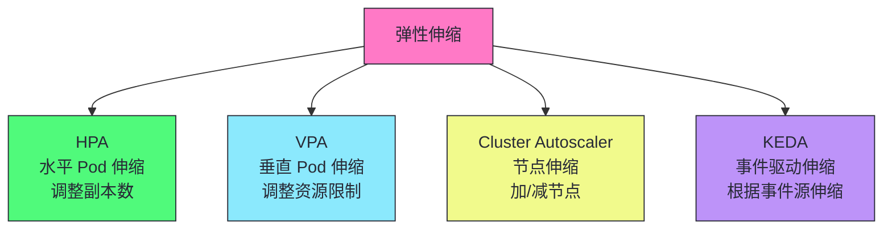
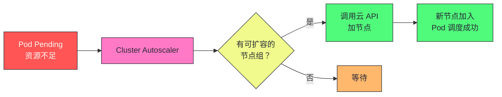
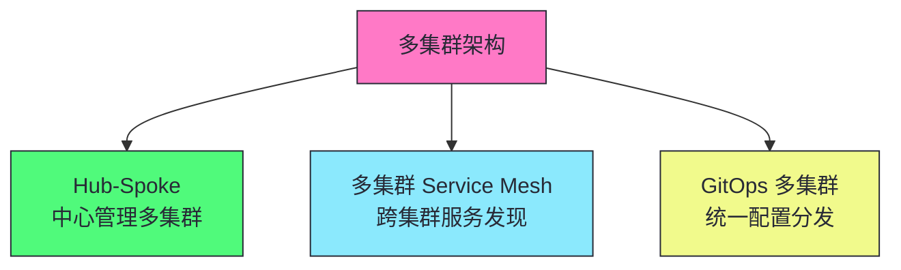
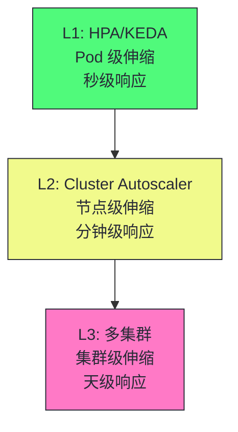

# 18 弹性伸缩与多集群：HPA/VPA/Cluster Autoscaler 与 KubeFed

**摘要：**
本文是 Kubernetes 架构深度剖析专栏的收官之作，深入 K8s 的弹性伸缩和多集群管理。弹性伸缩是 K8s "可扩展性"核心目标的工程实现——根据负载自动调整资源。文章讲透四种弹性伸缩机制：HPA（水平 Pod 伸缩，根据 CPU/内存/自定义指标调整副本数，副本数计算公式 ceil(当前副本数 × 当前指标值/目标指标值)，扩容快缩容慢，自定义指标需 Prometheus Adapter）、VPA（垂直 Pod 伸缩，调整 Pod 资源 requests/limits，Auto 模式需重启 Pod，与 HPA 不能同时用于同资源）、Cluster Autoscaler（节点伸缩，Pod Pending 时自动加节点，缩容标记低利用率节点驱逐，PDB 保护自愿驱逐，Spot 实例成本低但可能被回收）、KEDA（事件驱动伸缩，根据 Kafka/Redis/Prometheus 等事件源伸缩，支持缩到 0）。多集群管理有 KubeFed（联邦集群，统一管理多集群，控制平面同步资源）和 Karmada（多集群调度，跨集群应用分发）。弹性伸缩的核心认知：HPA 适合无状态水平扩展，VPA 适合资源调优，Cluster Autoscaler 适合节点弹性，KEDA 适合事件驱动。多集群的核心挑战是跨集群应用分发、服务发现、流量管理和故障转移。没有弹性伸缩的集群无法应对负载波动，没有多集群管理的组织无法应对规模化与容灾需求。

---

## 第 1 章 四种弹性伸缩机制

讲弹性伸缩，先回到本质——什么是弹性伸缩？弹性伸缩是"根据负载自动调整资源"——负载高时加资源，负载低时减资源。K8s 的弹性伸缩有四种机制，从 Pod 级到节点级到集群级。



### 1.1 四种机制的对比

| 机制 | 伸缩对象 | 触发条件 | 适用场景 |
|------|---------|---------|---------|
| **HPA** | Pod 副本数 | CPU/内存/自定义指标 | Web 服务、流量波动 |
| **VPA** | Pod 资源限制 | 历史资源使用 | 资源配不准的应用 |
| **Cluster Autoscaler** | 节点数 | Pod Pending | 集群容量不足 |
| **KEDA** | Pod 副本数 | 事件源（Kafka/Redis 等） | 事件驱动应用 |

四种机制的一个设计哲学是"分层伸缩"。HPA/KEDA 伸缩 Pod 副本数——秒级响应，应对短期波动。Cluster Autoscaler 伸缩节点数——分钟级响应，应对长期容量增长。多集群伸缩集群数——天级响应，应对地理扩展。这种"分层伸缩"使得不同时间尺度的负载变化有不同机制应对——短期波动用 HPA，长期增长用 Cluster Autoscaler，地理扩展用多集群。

四种机制的一个工程价值是"自动化"。没有弹性伸缩的集群，负载变化时需要手动调整——流量高时手动加 Pod/节点，流量低时手动减 Pod/节点。这种"手动调整"滞后于负载变化——流量高时来不及加资源导致服务降级，流量低时来不及减资源导致浪费。弹性伸缩自动化了这个过程——根据指标自动调整，及时响应负载变化。

四种机制的一个工程考量是"水平伸缩 vs 垂直伸缩"。HPA/KEDA 是水平伸缩——调整 Pod 副本数，适合无状态应用（加副本只需复制 Pod）。VPA 是垂直伸缩——调整 Pod 资源限制，适合"资源配不准"的应用（譬如 Java 应用 JVM 堆内存大，requests 配不准）。水平伸缩的上限是节点资源，垂直伸缩的上限是节点资源上限。生产中优先用水平伸缩（更灵活），垂直伸缩作为补充。

四种机制的另一个工程考量是"Pod 级 vs 节点级"。HPA/VPA/KEDA 是 Pod 级伸缩——调整 Pod 副本数或资源，秒级响应。Cluster Autoscaler 是节点级伸缩——调整节点数，分钟级响应。Pod 级伸缩快但受节点资源限制（Pod 需要调度到节点），节点级伸缩慢但提供底层资源。生产中 Pod 级和节点级配合——HPA 扩容 Pod，Cluster Autoscaler 加节点。

四种机制的一个工程细节是"KEDA 与 HPA 的关系"。KEDA 是 HPA 的超集——KEDA 用 HPA 做实际伸缩（KEDA 创建 HPA），但扩展了触发源（50+ 事件源）和缩到 0 的能力。这种"超集关系"使得 KEDA 兼容 HPA——已有 HPA 的应用可以迁移到 KEDA，获得更多触发源和缩到 0 能力。生产中如果需要事件驱动伸缩或缩到 0，用 KEDA 替代 HPA。

---

## 第 2 章 HPA：水平 Pod 伸缩

讲完了四种机制概览，接下来深入 HPA——水平 Pod 伸缩。HPA 是最常用的弹性伸缩机制，根据 CPU/内存/自定义指标调整 Pod 副本数。

### 2.1 HPA 的工作原理

```yaml
apiVersion: autoscaling/v2
kind: HorizontalPodAutoscaler
metadata:
  name: web-hpa
spec:
  scaleTargetRef:
    apiVersion: apps/v1
    kind: Deployment
    name: web
  minReplicas: 3
  maxReplicas: 50
  metrics:
    - type: Resource
      resource:
        name: cpu
        target:
          type: Utilization
          averageUtilization: 70  # 目标 CPU 使用率 70%
```

HPA 的一个工程价值是"水平伸缩"。HPA 调整 Pod 副本数——负载高时加副本，负载低时减副本。这种"水平伸缩"适合无状态应用（譬如 Web 服务）——加副本只需复制 Pod，不需要修改 Pod 资源。水平伸缩的上限是节点资源——如果节点资源不足，新副本无法调度（Pending），需要 Cluster Autoscaler 加节点。

HPA 的一个工程细节是"autoscaling/v2"。K8s 的 HPA 有两个版本——autoscaling/v1（只支持 CPU 指标）和 autoscaling/v2（支持多指标，包括 CPU/内存/自定义指标/外部指标）。生产中用 autoscaling/v2——支持多指标，更灵活。譬如同时根据 CPU 和内存伸缩，或根据自定义指标（譬如 QPS）伸缩。

### 2.2 HPA 的副本数计算公式

```
期望副本数 = ceil(当前副本数 × (当前指标值 / 目标指标值))
```

例如：当前 5 副本，CPU 使用率 90%，目标 70%：

```
期望副本数 = ceil(5 × (90 / 70)) = ceil(6.43) = 7
```

HPA 副本数计算的一个工程细节是"多指标取最大值"。autoscaling/v2 支持多指标——譬如同时配置 CPU 和内存指标。HPA 分别计算每个指标的期望副本数，取最大值作为最终副本数。譬如 CPU 指标计算得 7，内存指标计算得 5，最终副本数取 7。这种"取最大值"确保了所有指标都满足——不会因为某个指标低而忽略其他指标。

HPA 副本数计算的一个工程考量是"指标类型"。HPA 支持三种指标类型——Resource（CPU/内存，基于 Pod metrics）、Pod（自定义 Pod 指标，譬如 QPS）、External（外部指标，譬如 Kafka 队列长度）。Resource 指标最常用——CPU/内存是 K8s 内建指标。Pod/External 指标需要自定义指标 API（譬如 Prometheus Adapter）——将 Prometheus 指标暴露为 K8s API。

HPA 副本数计算的一个工程细节是"使用率计算"。HPA 的 CPU 使用率 = 实际 CPU 使用 / resources.requests。譬如 Pod 配置 requests=1000m，实际使用 900m，使用率 90%。注意使用率是相对 requests 而非 limits——limits 不影响 HPA 计算。这种"相对 requests"的设计让 HPA 根据"资源申请量"伸缩——而不是"资源上限"。

HPA 副本数计算的另一个工程细节是"Pod 指标聚合"。HPA 计算所有 Pod 的平均指标值——譬如 5 个 Pod 的平均 CPU 使用率。如果某个 Pod 指标缺失（譬如刚启动的 Pod），HPA 保守计算——只计算有指标的 Pod。这种"保守计算"避免了新 Pod 启动时指标缺失导致 HPA 误判。

HPA 的实现细节值得深入。HPA Controller 是 kube-controller-manager 的一部分——它定期（默认 15 秒）从 metrics-server 获取 Pod 的 CPU/内存指标，从自定义指标 API 获取 Pod/External 指标，计算期望副本数，更新 Deployment/StatefulSet 的 replicas。HPA 的一个工程细节是"metrics-server 依赖"——Resource 指标（CPU/内存）需要 metrics-server 采集 Pod 指标，metrics-server 通过 kubelet 的 metrics API 获取 Pod 指标，聚合后通过 Metrics API 暴露给 HPA。如果没有 metrics-server，HPA 无法计算 CPU/内存使用率。自定义指标需要 Prometheus Adapter——它从 Prometheus 查询指标，通过 Custom Metrics API 暴露给 HPA。HPA 的一个工程陷阱是"指标延迟"——metrics-server 采集有延迟（默认 60 秒），HPA 基于延迟指标做决策，可能导致扩缩容滞后。生产中关键业务可以用更短的采集间隔或自定义指标减少延迟，这是 HPA 生产运维的关键考量。

### 2.3 HPA 的冷却期

| 参数 | 默认值 | 说明 |
|------|--------|------|
| `--horizontal-pod-autoscaler-downscale-stabilization` | 5 分钟 | 缩容冷却期，防止震荡 |
| `--horizontal-pod-autoscaler-sync-period` | 15 秒 | HPA 检查间隔 |

HPA 冷却期的一个工程价值是"防止震荡"。没有冷却期时，HPA 可能在流量波动时频繁扩缩容——扩容后流量降低立即缩容，缩容后流量升高又扩容。这种"震荡"导致 Pod 频繁创建/删除——资源浪费，服务不稳定。冷却期（默认 5 分钟）确保缩容后至少 5 分钟不再缩容，防止震荡。

> [!warning] 生产避坑：HPA 缩容冷却期防止震荡
> 没有冷却期时，HPA 可能在流量波动时频繁扩缩容——扩容后流量降低立即缩容，缩容后流量升高又扩容。冷却期（默认 5 分钟）确保缩容后至少 5 分钟不再缩容，防止震荡。但这也意味着流量降低后需要 5 分钟才缩容——对于成本敏感场景可能太慢。根据业务调整冷却期。

HPA 冷却期的一个工程考量是"冷却期与业务匹配"。默认 5 分钟适合大多数 Web 服务——流量波动周期通常超过 5 分钟。但对于流量波动剧烈的服务（譬如秒杀），5 分钟太慢——流量降低后 5 分钟才缩容，资源浪费。生产中根据业务调整冷却期——稳定优先用长冷却期，成本优先用短冷却期。

HPA 的一个工程陷阱是"指标缺失"。如果 Pod 没有设置 resources.requests，HPA 无法计算 CPU 使用率（使用率 = 实际使用 / requests）。这导致 HPA 无法工作——指标缺失。生产中确保 Pod 设置了 resources.requests，否则 HPA 无法根据 CPU 使用率伸缩。

HPA 的一个工程考量是"扩容速度与缩容速度"。HPA 扩容是即时的——指标超阈值立即扩容。HPA 缩容有冷却期——指标低于阈值后等 5 分钟才缩容。这种"扩容快缩容慢"的设计是合理的——扩容慢导致服务降级（影响用户），缩容慢只是资源浪费（不影响用户）。生产中宁可扩容快一点（避免服务降级），缩容慢一点（避免震荡）。

HPA 的另一个工程考量是"minReplicas 与 maxReplicas"。minReplicas 是最小副本数——确保即使流量低也保持最小副本数，避免缩到 0（HPA 不支持缩到 0）。maxReplicas 是最大副本数——限制扩容上限，避免无限扩容。生产中根据业务峰值设置 maxReplicas——譬如业务峰值需要 50 副本，maxReplicas 设 50。minReplicas 根据业务低谷设置——譬如业务低谷需要 3 副本，minReplicas 设 3。

HPA 的一个工程细节是"Pod 启动延迟"。HPA 扩容时创建新 Pod——Pod 启动需要时间（拉镜像、启动容器、就绪检查）。在此期间新 Pod 不处理流量——HPA 可能继续扩容（指标仍高）。这种"Pod 启动延迟"导致 HPA 可能过度扩容——新 Pod 启动后流量已分散，但 HPA 已经创建了过多 Pod。生产中用就绪检查（readiness probe）确保 Pod 就绪后才接收流量，减少过度扩容。

HPA 的行为算法值得深入。HPA 的扩容决策基于"期望副本数 = ceil(当前副本数 × 当前指标值 / 目标指标值)"——这个公式保证了指标值与目标值的比例关系。譬如当前 5 副本，CPU 使用率 90%，目标 70%，期望副本数 = ceil(5 × 90/70) = ceil(6.43) = 7。HPA 的一个工程细节是"容忍度"——HPA 默认有 10% 的容忍度（`--horizontal-pod-autoscaler-tolerance`），指标在目标值的 ±10% 范围内不触发扩缩容，避免频繁调整。譬如目标 CPU 70%，容忍度 10%，CPU 在 63%-77% 之间不触发扩缩容。HPA 的一个工程陷阱是"指标抖动"——指标在阈值附近抖动时，HPA 可能频繁扩缩容。冷却期（downscale-stabilization）只限制缩容，不限制扩容——扩容仍可能频繁。生产中用自定义指标（譬如 QPS）替代 CPU 指标，减少抖动。

---

## 第 3 章 VPA：垂直 Pod 伸缩

讲完了 HPA，接下来看 VPA——垂直 Pod 伸缩。VPA 调整 Pod 的 resources.requests/limits，适合"资源配不准"的应用。

### 3.1 VPA 的三种模式

| 模式 | 说明 |
|------|------|
| **Auto** | 自动调整 requests，需要重启 Pod |
| **Recommender** | 只推荐资源值，不自动调整 |
| **Initial** | 创建 Pod 时设置 requests，不修改已运行的 |

VPA 的一个工程价值是"资源推荐"。VPA Recommender 模式分析 Pod 的历史资源使用，推荐合适的 requests/limits。譬如某应用实际 CPU 使用 200m 但配置了 1000m requests——VPA 推荐调整为 300m requests。这种"资源推荐"帮助开发者准确配置资源——避免资源浪费（requests 过高）或资源不足（requests 过低）。

VPA 的一个工程细节是"Initial 模式"。Initial 模式只在 Pod 创建时设置 requests——不修改已运行的 Pod。这种"创建时设置"避免了重启 Pod——适合不能中断的服务。但 Initial 模式只对新 Pod 生效，已运行的 Pod 不调整——需要等 Pod 重建才生效。

### 3.2 VPA 的局限

> [!warning] 生产避坑：VPA Auto 模式需要重启 Pod
> VPA 调整 Pod 的 resources.requests 需要重建 Pod——K8s 不支持修改运行中容器的资源限制。这意味着 VPA Auto 模式会驱逐并重建 Pod，可能导致服务中断。生产环境慎用 VPA Auto——用 Recommender 模式获取建议，手动调整。HPA 和 VPA 不能同时用于同一资源的 CPU/内存（冲突）。

VPA 的一个工程局限是"需要重启 Pod"。K8s 不支持修改运行中容器的资源限制（CPU/内存 requests/limits）——修改 resources 需要重建 Pod。VPA Auto 模式驱逐并重建 Pod——可能导致服务中断。这种"需要重启"使得 VPA Auto 模式在生产中慎用——用 Recommender 模式获取建议，手动调整。

VPA 的另一个工程局限是"与 HPA 冲突"。HPA 根据 CPU/内存使用率伸缩副本数，VPA 调整 CPU/内存 requests——两者同时作用会冲突。譬如 HPA 根据 CPU 使用率扩容，VPA 同时调大 requests——CPU 使用率变化，HPA 又调整。这种"冲突"导致 HPA 和 VPA 不能同时用于同一资源的 CPU/内存。生产中 HPA 和 VPA 只能选一个——通常用 HPA（水平伸缩），VPA 用 Recommender 模式辅助。

VPA 的一个工程考量是"Recommender 模式的价值"。Recommender 模式不自动调整 requests——只分析历史资源使用，推荐合适的 requests/limits。这种"只推荐不调整"使得 VPA 不影响运行中的 Pod——安全。生产中用 Recommender 模式获取资源建议，手动调整 Deployment 的 resources——既获得了 VPA 的资源推荐能力，又避免了 Auto 模式的重启风险。

VPA 的另一个工程考量是"资源推荐的准确性"。VPA Recommender 基于历史资源使用推荐——但历史使用不代表未来需求。譬如应用在促销期间资源使用高，VPA 推荐高 requests——但促销结束后不需要这么高。生产中需要结合业务周期调整 VPA 推荐——不能盲目接受 VPA 推荐，需要人工判断。

VPA 的一个工程细节是"VPA 与 QoS"。VPA 调整 requests 影响 Pod 的 QoS 等级——Guaranteed（requests=limits）、Burstable（requests<limits）、BestEffort（无 requests/limits）。VPA Auto 模式可能改变 QoS 等级——譬如从 Burstable 变成 Guaranteed。QoS 等级影响 Pod 的驱逐优先级——BestEffort 先被驱逐，Guaranteed 最后被驱逐。生产中需要注意 VPA 调整对 QoS 的影响。

VPA 的实现细节值得深入。VPA 由三个组件组成——Recommender（分析历史资源使用，推荐 requests/limits）、Updater（驱逐 Pod 触发重建，新 Pod 应用推荐值）、Admission Controller（准入控制器，在 Pod 创建时注入推荐值）。VPA Auto 模式的工作流程——Recommender 定期分析 Pod 的历史资源使用（CPU/内存的 P50/P95/P99），计算推荐值；Updater 发现 Pod 的当前资源与推荐值差异过大，驱逐 Pod；Pod 重建时 Admission Controller 注入推荐值。VPA 的一个工程陷阱是"推荐值抖动"——资源使用波动大时，推荐值频繁变化，导致 Pod 频繁重建。生产中用 Recommender 模式避免自动重建，或设置 VPA 的 updatePolicy 控制更新频率，这是 VPA 生产运维的关键配置。

---

## 第 4 章 Cluster Autoscaler：节点伸缩

讲完了 VPA，接下来看 Cluster Autoscaler——节点伸缩。Cluster Autoscaler 在 Pod Pending 时自动加节点，应对集群容量不足。

### 4.1 工作原理



Cluster Autoscaler 的一个工程价值是"自动化节点扩容"。没有 Cluster Autoscaler 的集群，Pod Pending 时需要手动加节点——登录云控制台，创建节点，加入集群。这种"手动加节点"滞后于业务需求——业务等待节点，影响上线。Cluster Autoscaler 自动化了这个过程——Pod Pending 时自动调用云 API 加节点，Pod 调度成功。

Cluster Autoscaler 的一个工程细节是"节点组"。Cluster Autoscaler 按节点组（Node Group）扩容——节点组是一组相同规格的节点（譬如 8 核 16GB）。Cluster Autoscaler 选择合适的节点组扩容——根据 Pending Pod 的资源需求选择节点组。生产中通常配置多个节点组——小 Pod 用小节点组，大 Pod 用大节点组，GPU Pod 用 GPU 节点组。

Cluster Autoscaler 的一个工程考量是"扩容延迟"。加节点需要 1-5 分钟——云厂商启动 EC2/VM 的时间。在此期间 Pod 一直 Pending。这种"扩容延迟"使得 Cluster Autoscaler 不适合应对突发流量——突发流量时 Pod Pending 1-5 分钟才调度。生产中用预留节点（保持一些空闲节点）或 Spot Fleet 减少延迟。

Cluster Autoscaler 的一个工程细节是"节点组与云厂商集成"。Cluster Autoscaler 按节点组扩容——节点组对应云厂商的实例组（譬如 AWS Auto Scaling Group、GCP Instance Group）。Cluster Autoscaler 调用云厂商 API 调整实例组大小——加节点就是增加实例数。这种"云厂商集成"使得 Cluster Autoscaler 依赖云厂商的支持——不同云厂商的 Cluster Autoscaler 实现不同。

Cluster Autoscaler 的另一个工程细节是"扩容上限"。Cluster Autoscaler 有扩容上限——节点组的最大节点数。当节点组达到上限时，Cluster Autoscaler 无法继续扩容——Pod 一直 Pending。生产中需要设置合理的节点组上限——既满足业务需求，又控制成本。如果单节点组上限不够，可以配置多个节点组。

Cluster Autoscaler 的实现细节值得深入。Cluster Autoscaler 定期（默认 10 秒）扫描集群中 Pending 的 Pod，分析 Pending 原因——如果是资源不足（节点没有足够资源调度 Pod），触发扩容。扩容时选择合适的节点组——根据 Pod 的资源需求、nodeSelector、taint/toleration 匹配节点组，调用云厂商 API 增加节点组实例数。新节点启动后加入集群，kubelet 注册到 API Server，Pod 调度到新节点。Cluster Autoscaler 的一个工程细节是"节点启动延迟"——云厂商启动 EC2/VM 需要 1-5 分钟，期间 Pod 一直 Pending。Cluster Autoscaler 的一个工程陷阱是"节点组配置错误"——如果节点组的 instance type 不满足 Pod 需求（譬如 Pod 需要 GPU 但节点组没有 GPU），Pod 永远无法调度，Cluster Autoscaler 不断尝试扩容但失败。生产中确保节点组配置满足 Pod 需求。

### 4.2 缩容机制

Cluster Autoscaler 也会缩容——标记低利用率节点上的 Pod 驱逐，然后终止节点。

| 缩容条件 | 说明 |
|---------|------|
| **节点利用率低** | CPU/内存使用低于阈值 |
| **Pod 可迁移** | 节点上的 Pod 没有强约束（如 local PV） |
| **PDB 允许** | PodDisruptionBudget 不阻止驱逐 |

Cluster Autoscaler 缩容的一个工程价值是"成本优化"。低利用率节点上的 Pod 迁移到其他节点，终止低利用率节点——减少节点数量，降低成本。这种"自动缩容"使得集群资源利用率高——不会因为低利用率节点浪费资源。

Cluster Autoscaler 缩容的一个工程考量是"Pod 可迁移性"。如果节点上的 Pod 有强约束（譬如 local PV、nodeSelector），无法迁移到其他节点——Cluster Autoscaler 不会缩容该节点。生产中需要注意 Pod 的约束——local PV 的 Pod 不能迁移，可能导致节点无法缩容。这种"不可迁移"是 Cluster Autoscaler 缩容的常见障碍。

Cluster Autoscaler 缩容的另一个工程考量是"PDB 保护"。Cluster Autoscaler 缩容时驱逐 Pod——PDB 确保不驱逐太多 Pod。如果 PDB 阻止驱逐，Cluster Autoscaler 不会缩容该节点。生产中需要协调 PDB 与 Cluster Autoscaler——既保证最小可用，又允许缩容。

Cluster Autoscaler 缩容的一个工程细节是"缩容冷却期"。Cluster Autoscaler 缩容也有冷却期——默认 10 分钟。缩容后 10 分钟内不再缩容，防止频繁缩容。这种"缩容冷却期"与 HPA 的缩容冷却期类似——防止震荡。生产中根据业务调整缩容冷却期——稳定优先用长冷却期，成本优先用短冷却期。

Cluster Autoscaler 的一个工程考量是"Spot 实例"。Spot 实例（竞价实例）成本低但可能被回收——云厂商在资源紧张时回收 Spot 实例。Cluster Autoscaler 支持 Spot 实例——但 Spot 实例被回收时 Pod 重新调度，可能导致服务中断。生产中用 Spot 实例跑无状态应用（Pod 可迁移），不用 Spot 实例跑有状态应用（譬如数据库）。

Cluster Autoscaler 缩容的实现细节值得深入。Cluster Autoscaler 定期扫描集群中的节点，标记低利用率节点（节点上的 Pod 资源请求低于节点容量的一定比例，默认 50%）为缩容候选。缩容时，Cluster Autoscaler 优雅驱逐节点上的 Pod——调用 Pod 的 eviction API，Pod 重新调度到其他节点。如果所有 Pod 都成功迁移，Cluster Autoscaler 调用云厂商 API 终止节点。Cluster Autoscaler 缩容的一个工程陷阱是"缩容导致服务降级"——缩容时 Pod 重新调度，如果其他节点资源不足，Pod 可能 Pending，导致服务容量下降。生产中确保缩容前有足够冗余节点承载被驱逐的 Pod，这是缩容安全的基础保障。Cluster Autoscaler 的一个工程细节是"节点平衡器"——Cluster Autoscaler 可以配置节点平衡器，在缩容时优先缩容最空的节点，减少 Pod 迁移数量。

---

## 第 5 章 KEDA：事件驱动伸缩

讲完了 Cluster Autoscaler，接下来看 KEDA——事件驱动伸缩。KEDA 根据 Kafka/Redis/云消息队列等事件源伸缩，支持缩到 0。

### 5.1 KEDA 的优势

```yaml
apiVersion: keda.sh/v1alpha1
kind: ScaledObject
metadata:
  name: kafka-scaler
spec:
  scaleTargetRef:
    name: kafka-consumer
  minReplicaCount: 0  # 可缩到 0
  maxReplicaCount: 100
  triggers:
    - type: kafka
      metadata:
        topic: orders
        consumerGroup: order-processor
        lagThreshold: "100"  # 消费延迟超过 100 时扩容
```

| 特性 | HPA | KEDA |
|------|-----|------|
| **触发源** | CPU/内存/自定义指标 | 50+ 事件源（Kafka/Redis/云消息队列等） |
| **缩到 0** | 不支持 | 支持 |
| **复杂度** | 低 | 中 |

KEDA 的一个工程价值是"事件驱动伸缩"。传统 HPA 根据 CPU/内存伸缩——但事件驱动应用（譬如 Kafka 消费者）的 CPU 使用率不能反映负载。KEDA 根据事件源伸缩——譬如 Kafka 消费延迟（lag）超过 100 时扩容。这种"事件驱动"使得事件驱动应用的伸缩更准确——根据业务指标（消息延迟）而非系统指标（CPU）伸缩。

> [!info] 核心概念：KEDA 可以缩到 0
> HPA 的 minReplicas 最少为 1——不能缩到 0。KEDA 支持缩到 0——当没有事件时完全不运行 Pod，有事件时自动启动。这适合事件驱动的应用——如 Kafka 消费者，无消息时不需运行。KEDA 是 HPA 的超集——它用 HPA 做实际伸缩，但扩展了触发源和缩到 0 的能力。

KEDA 的一个工程细节是"缩到 0"。HPA 的 minReplicas 最少为 1——不能缩到 0。KEDA 支持缩到 0——当没有事件时完全不运行 Pod，有事件时自动启动。这种"缩到 0"适合事件驱动应用——譬如 Kafka 消费者，无消息时不需运行，有消息时自动启动。这种"按需运行"节省了资源——无事件时不浪费资源。

KEDA 的一个工程考量是"KEDA 与 HPA 的关系"。KEDA 是 HPA 的超集——KEDA 用 HPA 做实际伸缩（KEDA 创建 HPA），但扩展了触发源（50+ 事件源）和缩到 0 的能力。这种"超集关系"使得 KEDA 兼容 HPA——已有 HPA 的应用可以迁移到 KEDA，获得更多触发源和缩到 0 能力。

KEDA 的另一个工程考量是"ScaledObject 与 ScaledJob"。KEDA 有两种资源——ScaledObject（伸缩 Deployment/StatefulSet，适合长运行服务）和 ScaledJob（伸缩 Job，适合批处理任务）。ScaledObject 适合 Kafka 消费者（长运行），ScaledJob 适合批处理任务（譬如数据处理 Job）。生产中根据应用类型选择——长运行用 ScaledObject，批处理用 ScaledJob。

KEDA 的一个工程细节是"触发器配置"。KEDA 的触发器（trigger）定义了伸缩条件——譬如 Kafka 触发器配置 topic、consumerGroup、lagThreshold。KEDA 根据触发器查询事件源（譬如 Kafka 的消费延迟），根据 lagThreshold 决定是否扩容。这种"触发器配置"使得 KEDA 可以根据多种事件源伸缩——不同事件源有不同的触发器配置。

KEDA 的一个工程考量是"冷启动延迟"。KEDA 缩到 0 后，有事件时需要启动 Pod——Pod 启动需要时间（拉镜像、启动容器）。这种"冷启动延迟"使得第一个事件处理延迟——Pod 启动期间事件积压。生产中可以用 minReplicaCount=1 保持一个 Pod 运行（避免冷启动），或优化镜像大小减少启动时间。

KEDA 的另一个工程考量是"KEDA 与 Prometheus 触发器"。KEDA 支持 Prometheus 触发器——根据 Prometheus 指标伸缩。譬如根据 HTTP 请求 QPS 伸缩——QPS 超过阈值时扩容。这种"Prometheus 触发器"使得 KEDA 可以根据任意 Prometheus 指标伸缩——比 HPA 的自定义指标更灵活（KEDA 支持更多指标源）。

KEDA 的实现细节值得深入。KEDA 由三个组件组成——Operator（管理 ScaledObject/ScaledJob CRD）、Metrics Adapter（将事件源指标暴露为 K8s Custom Metrics API）、Controller（监听事件源，触发伸缩）。KEDA 的工作流程——ScaledObject 定义触发器（譬如 Kafka lag），Controller 定期查询事件源（Kafka 的消费延迟），通过 Metrics Adapter 暴露为 Custom Metrics，HPA 根据这些指标伸缩 Deployment。KEDA 缩到 0 的实现——当事件源没有事件（譬如 Kafka lag=0）时，KEDA 将 Deployment 的 replicas 设为 0；有事件时，KEDA 将 replicas 设为 minReplicaCount，HPA 接管后续伸缩。KEDA 的一个工程细节是"ScaledJob 的批处理伸缩"——ScaledJob 根据 Job 队列长度创建多个 Job 并行处理，处理完成后 Job 自动完成，不需要手动缩容。生产中批处理任务用 ScaledJob，长运行服务用 ScaledObject，这是 KEDA 使用的核心原则。

---

## 第 6 章 多集群管理

讲完了四种弹性伸缩机制，接下来看多集群管理。单集群规模有上限，大型组织趋向多集群。

### 6.1 多集群的动机

| 动机 | 说明 |
|------|------|
| **地理分布** | 多地域部署降低延迟 |
| **容灾** | 一个集群故障不影响业务 |
| **多租户强隔离** | 独立集群完全隔离 |
| **混合云** | 跨云厂商部署 |
| **规模扩展** | 单集群规模上限 |

多集群的一个工程动机是"地理分布"。全球用户需要就近访问——亚太用户访问亚太集群，欧美用户访问欧美集群。这种"地理分布"降低了延迟——用户访问最近的集群。但多集群带来了跨集群服务发现与数据同步的挑战——不同集群的服务如何互相发现，数据如何同步。

多集群的另一个工程动机是"容灾"。单集群故障时业务中断——譬如控制平面故障、etcd 故障。多集群容灾——一个集群故障时，流量切换到备用集群，业务继续。这种"容灾"提高了可用性——但需要跨集群流量切换机制（DNS/全局 LB）。

多集群的一个工程动机是"多租户强隔离"。单集群的多租户用 Namespace 隔离——但 Namespace 不是强隔离（资源共享、故障影响）。独立集群完全隔离——资源独立、故障不影响。生产中强隔离场景（譬如金融、医疗）用独立集群——每个租户一个集群，完全隔离。

多集群的另一个工程动机是"混合云"。跨云厂商部署——譬如 AWS 跑生产，GCP 跑灾备，本地机房跑敏感数据。这种"混合云"避免厂商锁定——不依赖单一云厂商。但混合云带来了跨云网络互联的挑战——不同云厂商的网络互联需要专线或 VPN。

多集群的一个工程动机是"规模扩展"。单集群规模有上限——etcd 性能（建议单集群不超过 5000 节点）、API Server 吞吐量、网络规模。大型组织（譬如数千节点）需要多集群——按业务/团队分集群，每个集群规模可控。这种"规模扩展"使得 K8s 可以支撑超大规模业务。

### 6.2 多集群管理工具

| 工具 | 定位 | 特点 |
|------|------|------|
| **KubeFed** | 联邦集群 | 已停止维护，不推荐 |
| **Cluster API** | 集群生命周期 | 声明式创建/管理集群 |
| **Karmada** | 多集群调度 | 跨集群应用分发和调度 |
| **Argo CD** | GitOps 多集群 | 通过 kubeconfig 部署到多集群 |
| **Istio Multi-Cluster** | 多集群服务网格 | 跨集群服务发现和通信 |

多集群管理工具的一个工程考量是"定位差异"。Cluster API 管理集群生命周期——创建/升级/删除集群，不管理集群内的应用。Karmada 管理跨集群应用分发——将应用分发到多个集群，不管理集群生命周期。Argo CD 用 GitOps 管理多集群部署——通过 kubeconfig 部署到多集群。Istio Multi-Cluster 管理跨集群服务网格——跨集群服务发现和通信。生产中根据需求选择——集群生命周期用 Cluster API，应用分发用 Karmada/Argo CD，服务网格用 Istio。

多集群管理工具的一个工程细节是"KubeFed 已停止维护"。KubeFed 是 K8s 的联邦集群方案——但已停止维护，不推荐新项目使用。Karmada 是 KubeFed 的精神继承者——由华为开源，CNCF 孵化项目。Karmada 提供跨集群应用分发和调度——将应用分发到多个集群，根据策略调度。生产中用 Karmada 替代 KubeFed。

多集群管理工具的一个工程考量是"Argo CD 的多集群部署"。Argo CD 用 GitOps 管理多集群——通过 kubeconfig 连接多个集群，将 Git 仓库的应用配置部署到多集群。这种"GitOps 多集群"使得应用配置统一管理——Git 仓库作为单一可信源，Argo CD 同步到多集群。但 Argo CD 不提供跨集群调度——每个集群独立部署，不能根据集群负载调度。

多集群管理工具的另一个工程考量是"Istio Multi-Cluster 的服务网格"。Istio Multi-Cluster 提供跨集群服务网格——跨集群服务发现、跨集群 mTLS、跨集群流量管理。这种"多集群服务网格"使得多集群像一个集群——服务跨集群调用透明。但 Istio Multi-Cluster 配置复杂——需要跨集群信任（共享 CA）、跨集群网络互联。

Karmada 的实现细节值得深入。Karmada 由控制平面和多个成员集群组成——控制平面运行 karmada-apiserver、karmada-controller-manager、karmada-scheduler，成员集群通过 cluster 注册到控制平面。Karmada 的工作流程——用户创建 PropagationPolicy 定义应用分发策略（譬如"分发到 cluster-a 和 cluster-b，权重 7:3"），Karmada 将应用资源分发到成员集群，成员集群的控制器实际运行应用。Karmada 的一个工程价值是"跨集群调度"——根据集群的资源、负载、地域调度应用，譬如"优先调度到资源充足的集群"。Karmada 的一个工程细节是"OverridePolicy"——不同集群可能有不同配置（譬如不同集群用不同镜像仓库），OverridePolicy 允许在分发时覆盖特定集群的配置。Karmada 的一个工程陷阱是"跨集群应用一致性"——多集群的应用版本可能不一致（某个集群更新慢），需要监控各集群的应用版本，确保一致性，这是多集群运维的关键挑战。

### 6.3 多集群架构模式



多集群架构模式的一个工程价值是"统一管理"。Hub-Spoke 模式——中心集群（Hub）管理多个边缘集群（Spoke），统一配置分发。GitOps 模式——Git 仓库作为单一可信源，Argo CD 将配置分发到多集群。这种"统一管理"使得多集群的运维成本降低——从一个地方管理所有集群，而不是分别管理每个集群。统一管理是多集群运维的核心价值，降低运维复杂度，提高效率。

多集群架构模式的一个工程细节是"Hub-Spoke 模式"。Hub-Spoke 模式中，Hub 集群是中心——管理多个 Spoke 集群。Hub 集群存储所有集群的配置，分发到 Spoke 集群。这种"中心化管理"简化了多集群管理——只需要管理 Hub，Spoke 自动同步。但 Hub 是单点——Hub 故障影响所有 Spoke。生产中 Hub 集群需要高可用，避免单点故障影响全局，确保稳定性。

多集群架构模式的另一个工程细节是"GitOps 多集群"。GitOps 多集群——Git 仓库作为单一可信源，Argo CD 将配置分发到多集群。每个集群的 Argo CD 实例从 Git 仓库拉取配置，应用到本集群。这种"GitOps 模式"使得配置统一管理——Git 仓库是唯一可信源，所有集群从 Git 同步。GitOps 的优势是审计——Git 提交历史记录了所有配置变更，便于追溯。

多集群 Service Mesh 的实现细节值得深入。Istio Multi-Cluster 提供跨集群服务网格——通过共享服务注册表，不同集群的 Service 可以互相发现。Istio Multi-Cluster 的部署模式有两种——Primary-Remote（一个集群的 Istio 控制平面管理所有集群，简单但控制平面是单点）和 Multi-Primary（每个集群有自己的 Istio 控制平面，控制平面高可用但配置复杂）。跨集群通信需要网络互联——不同集群的 Pod 网络需要互通（譬如通过 VPN 或直接路由），Istio 的 east-west gateway 代理跨集群流量。Istio Multi-Cluster 的一个工程价值是"跨集群 mTLS"——跨集群通信自动加密，无需应用修改。生产中跨集群 Service Mesh 适合需要跨集群服务调用的场景，譬如微服务跨集群部署，这是多集群服务治理的核心方案。

> [!info] 核心概念：多集群是 K8s 的未来方向
> 单集群规模有上限——etcd 性能、API Server 吞吐量、网络规模。大型组织趋向多集群——按地域/业务/团队分集群。多集群管理的挑战：跨集群服务发现、跨集群应用分发、跨集群容灾。Karmada 和 Argo CD 是当前主流的多集群管理方案。KubeFed 已停止维护，不推荐新项目使用。

多集群架构模式的一个工程考量是"跨集群服务发现"。多集群中服务跨集群调用——A 集群的 Pod 调用 B 集群的 Service。这需要跨集群服务发现——A 集群知道 B 集群的 Service IP。Istio Multi-Cluster 提供跨集群服务发现——通过 Istio 的服务注册表，跨集群发现服务。这种"跨集群服务发现"使得多集群像一个集群——服务跨集群调用透明。跨集群服务发现是多集群架构的核心能力，没有跨集群服务发现的多集群只是孤立的单集群，无法实现跨集群调用。

多集群架构模式的另一个工程考量是"跨集群容灾"。多集群容灾——一个集群故障时，流量切换到备用集群。流量切换需要 DNS 更新或全局 LB 切换——将流量从故障集群切到备用集群。但 DNS 更新有 TTL 延迟——客户端缓存 DNS，TTL 内不会重新解析。生产中用短 TTL（譬如 30 秒）或全局 LB（不依赖 DNS）减少切换延迟。跨集群容灾是多集群架构的核心价值，确保业务连续性，提高系统可用性。

多集群容灾的一个工程细节是"容灾演练"。多集群容灾需要定期演练——切换流量到备用集群，验证服务正常。没有演练过的容灾方案可能在真故障时失效——譬如备用集群配置不一致、数据未同步、流量切换不成功。生产中定期演练容灾切换（譬如每月一次），确保容灾方案有效。容灾演练是多集群运维的基本要求，没有演练过的容灾方案在真故障时可能失效，造成业务中断，影响可用性。

多集群容灾的另一个工程细节是"数据同步"。多集群容灾需要数据同步——主集群的数据同步到备用集群，故障切换时备用集群有最新数据。数据同步方式包括异步复制（延迟但性能好）和同步复制（一致但性能差）。生产中根据业务需求选择——强一致用同步复制，最终一致用异步复制。数据同步是多集群容灾的难点，需要在系统设计阶段就纳入规划，确保故障切换时数据不丢失，业务连续。

跨集群容灾的实现细节值得深入。跨集群容灾的核心是"流量切换"——主集群故障时，将流量切到备用集群。流量切换的方式有三种——DNS 切换（修改 DNS 解析，将域名指向备用集群，但 DNS TTL 导致切换延迟）、全局 LB 切换（全局负载均衡器将流量切到备用集群，切换快但依赖 LB 高可用）、客户端切换（客户端配置多集群地址，主集群不可用时自动切到备用集群，切换快但需要客户端支持）。跨集群容灾的一个工程陷阱是"数据不一致"——异步复制有延迟，主集群故障时备用集群数据可能滞后，切换后部分数据丢失。生产中关键业务用同步复制确保数据一致，普通业务用异步复制接受少量数据丢失。跨集群容灾的另一个工程细节是"健康检查"——全局 LB 定期检查集群健康，主集群不可用时自动切换，减少人工干预，这是容灾自动化的基础。

---

## 第 7 章 弹性伸缩的组合使用

讲完了多集群管理，最后看弹性伸缩的组合使用。单一机制不足以应对所有场景——多种机制组合使用。

### 7.1 HPA + Cluster Autoscaler

```
流量增加 → HPA 扩容 Pod → 节点资源不足 → Pod Pending → Cluster Autoscaler 加节点 → Pod 调度成功
```

HPA + Cluster Autoscaler 的一个工程价值是"端到端弹性"。HPA 伸缩 Pod 副本数，Cluster Autoscaler 伸缩节点数——两者配合实现端到端弹性。流量增加时 HPA 扩容 Pod，节点资源不足时 Cluster Autoscaler 加节点。这种"端到端弹性"使得集群自动适应负载变化——从 Pod 到节点全自动。

HPA + Cluster Autoscaler 的一个工程考量是"层级延迟"。HPA 扩容 Pod 是秒级——创建 Pod 只需几秒。Cluster Autoscaler 加节点是分钟级——云厂商启动 EC2/VM 需要 1-5 分钟。这种"层级延迟"意味着端到端弹性有延迟——流量增加后，HPA 秒级扩容 Pod，但如果节点不足，Pod Pending 1-5 分钟才调度。生产中用预留节点减少延迟——保持一些空闲节点，Pod 立即调度。

### 7.2 KEDA + Cluster Autoscaler

```
Kafka 消息积压 → KEDA 扩容消费者 → 节点不足 → Cluster Autoscaler 加节点
```

KEDA + Cluster Autoscaler 的一个工程价值是"事件驱动端到端弹性"。KEDA 根据事件源伸缩 Pod，Cluster Autoscaler 伸缩节点——两者配合实现事件驱动端到端弹性。Kafka 消息积压时 KEDA 扩容消费者，节点不足时 Cluster Autoscaler 加节点。这种"事件驱动端到端弹性"使得事件驱动应用自动适应消息量变化。

KEDA + Cluster Autoscaler 的一个工程考量是"缩到 0 与节点缩容"。KEDA 缩到 0 时，Pod 不运行——节点资源释放。Cluster Autoscaler 检测到节点利用率低，缩容节点。这种"缩到 0 触发节点缩容"使得无事件时完全释放资源——Pod 和节点都缩到 0。但有事件时需要重新启动 Pod 和加节点——冷启动延迟更长（Pod 启动 + 节点启动）。生产中需要平衡——缩到 0 节省成本但增加冷启动延迟。

### 7.3 弹性伸缩的层级



> [!info] 核心概念：弹性伸缩是分层的
> Pod 级伸缩（HPA/KEDA）秒级响应短期波动。节点级伸缩（Cluster Autoscaler）分钟级响应容量增长。集群级伸缩（多集群）天级响应地理扩展和容灾。三层互补——短期波动用 HPA，长期增长用 Cluster Autoscaler，地理扩展用多集群。不要用单一机制应对所有场景——层级化弹性是生产最佳实践。

弹性伸缩层级的一个工程价值是"分层响应"。不同时间尺度的负载变化有不同机制应对——秒级波动用 HPA/KEDA，分钟级容量增长用 Cluster Autoscaler，天级地理扩展用多集群。这种"分层响应"使得每种负载变化都有合适的机制——不会用"加机器"应对所有场景。

弹性伸缩组合的实现细节值得深入。HPA + Cluster Autoscaler 的端到端弹性有层级延迟——HPA 秒级扩容 Pod，但节点不足时 Cluster Autoscaler 分钟级加节点，端到端延迟可能 1-5 分钟。生产中用"预留节点"减少延迟——保持 1-2 个空闲节点，HPA 扩容的 Pod 立即调度到空闲节点，不需要等 Cluster Autoscaler 加节点。预留节点的成本是"空闲资源浪费"，但换来了"快速响应"。KEDA + Cluster Autoscaler 的组合有"冷启动叠加"问题——KEDA 从 0 扩容 Pod 需要 Pod 启动时间，Cluster Autoscaler 加节点需要节点启动时间，两者叠加导致冷启动延迟更长。生产中用 minReplicaCount=1 保持一个 Pod 运行，避免 Pod 冷启动；用预留节点避免节点冷启动。弹性伸缩组合的一个工程原则是"快速响应需要预留资源"——预留越多响应越快但成本越高，生产中根据业务 SLA 平衡响应速度与成本，这是弹性伸缩生产落地的核心权衡。

弹性伸缩层级的一个工程考量是"层级配合"。HPA 扩容 Pod 导致节点资源不足，Cluster Autoscaler 加节点——HPA 与 Cluster Autoscaler 配合。Cluster Autoscaler 加节点达到节点组上限，需要多集群扩展——Cluster Autoscaler 与多集群配合。这种"层级配合"使得弹性伸缩端到端自动化——从 Pod 到节点到集群。

弹性伸缩层级的一个工程细节是"响应时间差异"。HPA/KEDA 秒级响应——创建 Pod 只需几秒（镜像已缓存）。Cluster Autoscaler 分钟级响应——加节点需要 1-5 分钟（云厂商启动 EC2/VM）。多集群天级响应——创建集群需要数十分钟到数小时。这种"响应时间差异"决定了各层级的适用场景——短期波动用 HPA/KEDA，长期增长用 Cluster Autoscaler，地理扩展用多集群。

弹性伸缩层级的另一个工程考量是"成本与响应时间的权衡"。快速响应需要预留资源——HPA 预留 Pod 容量（minReplicas），Cluster Autoscaler 预留节点（空闲节点），多集群预留集群（备用集群）。预留资源增加成本但减少响应时间。生产中根据业务需求平衡——关键业务多预留（快速响应），普通业务少预留（降低成本）。

---

## 总结：专栏的完整知识体系

四种弹性伸缩机制：HPA（水平 Pod 伸缩，根据 CPU/内存/自定义指标调整副本数，公式 ceil(当前副本数 × 当前指标值/目标指标值)，多指标取最大值，扩容快缩容慢，冷却期 5 分钟防止震荡，10% 容忍度避免频繁调整，自定义指标需 Prometheus Adapter，HPA Controller 从 metrics-server 获取 Resource 指标）、VPA（垂直 Pod 伸缩，调整 Pod 资源 requests/limits，由 Recommender/Updater/Admission Controller 三组件实现，Auto 模式需重启 Pod，与 HPA 不能同时用于同资源，Recommender 模式只推荐不调整）、Cluster Autoscaler（节点伸缩，定期扫描 Pending Pod 调用云 API 加节点，缩容标记低利用率节点驱逐并终止，PDB 保护自愿驱逐，扩容延迟 1-5 分钟，Spot 实例成本低但可能被回收，节点平衡器优先缩容最空节点）、KEDA（事件驱动伸缩，由 Operator/Metrics Adapter/Controller 三组件实现，根据 Kafka/Redis/Prometheus 等事件源伸缩，支持缩到 0，是 HPA 的超集，ScaledObject 适合长运行，ScaledJob 适合批处理）。弹性伸缩是分层的——HPA/KEDA 秒级响应波动，Cluster Autoscaler 分钟级响应容量，多集群天级响应地理扩展，三层互补。HPA + Cluster Autoscaler 实现端到端弹性——流量增加 → HPA 扩容 Pod → 节点不足 → Cluster Autoscaler 加节点，预留节点减少层级延迟。多集群动机：地理分布、容灾、强隔离、混合云、规模扩展（单集群上限 5000 节点）。多集群管理工具：Cluster API（集群生命周期）、Karmada（跨集群应用分发，PropagationPolicy 定义分发策略，OverridePolicy 覆盖集群差异）、Argo CD（GitOps 多集群）、Istio Multi-Cluster（跨集群服务网格，Primary-Remote 与 Multi-Primary 两种部署模式）。KubeFed 已停止维护不推荐。多集群架构模式：Hub-Spoke、多集群 Service Mesh、GitOps 多集群。跨集群容灾需要流量切换（DNS TTL 延迟、全局 LB、客户端切换）与数据同步（异步复制 vs 同步复制），定期容灾演练确保方案有效。弹性伸缩不是"加机器"——而是"在正确的时间加正确的资源"：HPA 应对短期波动，Cluster Autoscaler 应对长期容量，多集群应对地理扩展。没有弹性伸缩的集群无法应对负载波动，没有多集群管理的组织无法应对规模化与容灾需求。

> [!info] 专栏结语
> 本专栏从"K8s 的设计哲学"出发，经过声明式 API、架构全景、API Server、认证授权、List-Watch、etcd、ResourceVersion、控制器、StatefulSet、Scheduler、CRD/Operator、kubelet、Service/kube-proxy、CNI、生产化集群管理、可观测性，最终在"弹性伸缩与多集群"画上句号。18 篇文章形成了一个完整的知识体系——从设计哲学到组件深度剖析到生产实战。希望这个专栏能帮助你建立对 Kubernetes 架构的完整认知，并在实践中做出更好的工程决策。K8s 的复杂性来自于"在一个系统内同时解决调度、自愈、服务发现、滚动更新、配置管理、扩展性等多个问题"——理解每个组件的设计原理和交互方式，才能驾驭这种复杂性。

> [!info] 专栏导航
> 本文是 [[00 专栏导览|Kubernetes 架构深度剖析专栏]] 的第 18 篇，也是收官之作。建议从 [[00 专栏导览]] 开始顺序阅读，建立完整的知识体系。

---

## 延伸思考

1. **你的服务是否用了 HPA？** Web 服务用 HPA 根据 CPU/自定义指标自动伸缩。没有 HPA 的服务在流量波动时需手动扩容。

2. **你的集群是否用了 Cluster Autoscaler？** Pod Pending 时自动加节点。没有 CA 的集群在资源不足时需手动加节点。

3. **你的事件驱动应用是否用了 KEDA？** Kafka/Redis 消费者用 KEDA 根据消费延迟伸缩，支持缩到 0。

4. **你的 VPA 是否用了 Auto 模式？** Auto 模式需要重启 Pod，可能导致服务中断。生产环境用 Recommender 模式。

5. **你的多集群是否有统一管理？** Karmada/Argo CD 统一管理多集群的应用分发。没有统一管理的多集群运维成本高。

6. **你的弹性伸缩是否分层？** HPA 应对短期波动，Cluster Autoscaler 应对长期容量，多集群应对地理扩展。单一机制不足以应对所有场景。

7. **你的 HPA 冷却期是否合理？** 默认 5 分钟防止震荡。成本敏感场景可缩短，稳定性优先场景可延长。

8. **你的多集群容灾是否演练过？** 多集群容灾需要定期演练——切换流量到备用集群，验证服务正常。没有演练过的容灾方案可能在真故障时失效。

9. **你的 HPA 是否用了自定义指标？** CPU 使用率不能反映所有业务的负载——譬如 QPS、延迟。用自定义指标（Prometheus Adapter）根据业务指标伸缩。

10. **你的 Cluster Autoscaler 是否配置了多个节点组？** 小 Pod 用小节点组，大 Pod 用大节点组，GPU Pod 用 GPU 节点组。多节点组提高资源利用率。

11. **你的 KEDA 是否用了 ScaledJob？** 批处理任务用 ScaledJob（伸缩 Job），长运行服务用 ScaledObject（伸缩 Deployment）。

12. **你的多集群是否有跨集群服务发现？** Istio Multi-Cluster 提供跨集群服务发现——跨集群调用透明。没有跨集群服务发现的多集群，服务间调用需要手动配置。

13. **你的 HPA 是否用了 autoscaling/v2？** v1 只支持 CPU 指标，v2 支持多指标（CPU/内存/自定义/外部）。生产中用 v2 更灵活。

14. **你的 VPA 是否考虑了 QoS 影响？** VPA 调整 requests 改变 QoS 等级（Guaranteed/Burstable/BestEffort），影响驱逐优先级。注意 VPA 调整对 QoS 的影响。

15. **你的 Cluster Autoscaler 是否用了 Spot 实例？** Spot 成本低但可能被回收。用 Spot 跑无状态应用（Pod 可迁移），不用 Spot 跑有状态应用。

16. **你的多集群容灾是否有数据同步？** 容灾需要数据同步——主集群数据同步到备用集群。异步复制（延迟但性能好）vs 同步复制（一致但性能差）。根据业务需求选择。

17. **你的弹性伸缩是否考虑了响应时间差异？** HPA/KEDA 秒级，Cluster Autoscaler 分钟级，多集群天级。不同时间尺度的负载变化用不同机制应对。

18. **你的弹性伸缩是否平衡了成本与响应时间？** 快速响应需要预留资源（HPA minReplicas/CA 空闲节点/多集群备用集群）。关键业务多预留，普通业务少预留。

19. **你的 KEDA 是否用了 Prometheus 触发器？** KEDA 支持 Prometheus 触发器——根据 Prometheus 指标伸缩。比 HPA 自定义指标更灵活（支持更多指标源）。

20. **你的多集群是否有统一管理？** Karmada/Argo CD 统一管理多集群的应用分发。没有统一管理的多集群运维成本高——每个集群独立管理。

---

## 参考资料

1. HPA：https://kubernetes.io/docs/tasks/run-application/horizontal-pod-autoscale/
2. HPA 算法：https://kubernetes.io/docs/tasks/run-application/horizontal-pod-autoscale/#algorithm-details
3. VPA：https://github.com/kubernetes/autoscaler/tree/master/vertical-pod-autoscaler
4. Cluster Autoscaler：https://github.com/kubernetes/autoscaler/tree/master/cluster-autoscaler
5. Cluster Autoscaler FAQ：https://github.com/kubernetes/autoscaler/blob/master/cluster-autoscaler/FAQ.md
6. KEDA：https://keda.sh/
7. KEDA ScaledObject：https://keda.sh/docs/concepts/scaling-deployments/
8. Karmada：https://karmada.io/
9. Cluster API：https://cluster-api.sigs.k8s.io/
10. Argo CD：https://argo-cd.readthedocs.io/
11. Istio Multi-Cluster：https://istio.io/latest/docs/setup/install/multicluster/
12. KubeFed（已停止维护）：https://github.com/kubernetes-sigs/kubefed
13. Prometheus Adapter：https://github.com/kubernetes-sigs/prometheus-adapter
14. 自定义指标：https://kubernetes.io/docs/tasks/run-application/horizontal-pod-autoscale/#support-for-custom-metrics

---

> [!note] 思考题
> 1. HPA 根据 CPU 使用率伸缩——如果 Pod 的 CPU limit 设得很低（如 100m），HPA 会在 CPU 接近 100m 时扩容。但如果应用实际需要 500m 才能正常运行，扩容更多 Pod 仍然每个都 CPU 不足。HPA 与 CPU limit 的关系如何影响伸缩效果？HPA 应该基于 requests 还是 limits 计算使用率？
> 2. Cluster Autoscaler 在 Pod Pending 时加节点——但加节点需要 1-5 分钟（云厂商启动 EC2/VM 的时间）。在此期间 Pod 一直 Pending。如何减少这种延迟（如预留节点、Spot Fleet）？预留节点的成本如何平衡？
> 3. 多集群容灾——如果一个集群故障，流量切换到备用集群。但 Pod IP 变化，DNS 需要更新。如何确保客户端快速感知集群切换（如使用全局 LB、DNS TTL 调整）？DNS TTL 设多短合适？
> 4. VPA Auto 模式需要重启 Pod——但有些服务不能中断（譬如数据库）。如何对不能中断的服务用 VPA？Initial 模式是否能解决？Initial 模式的局限是什么？
> 5. KEDA 支持缩到 0——但缩到 0 后有事件时启动需要时间（冷启动）。冷启动延迟对业务有什么影响？如何减少冷启动延迟（如预热、保持 minReplicaCount=1）？
> 6. HPA + Cluster Autoscaler 端到端弹性——但 HPA 扩容 Pod 到 Cluster Autoscaler 加节点有延迟（1-5 分钟）。在此期间 Pod 一直 Pending。如何减少端到端延迟？是否可以预扩容（在流量高峰前提前加节点）？
> 7. 多集群服务网格 Istio Multi-Cluster——跨集群服务发现如何实现？跨集群调用如何保证安全（mTLS）？跨集群调用的延迟如何（跨地域网络延迟）？
> 8. 弹性伸缩分层——HPA 秒级、Cluster Autoscaler 分钟级、多集群天级。三层之间如何协调？譬如 HPA 扩容导致 Cluster Autoscaler 加节点，Cluster Autoscaler 达到节点组上限是否触发多集群扩展？
