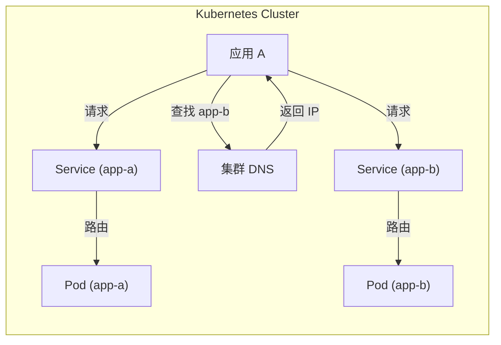
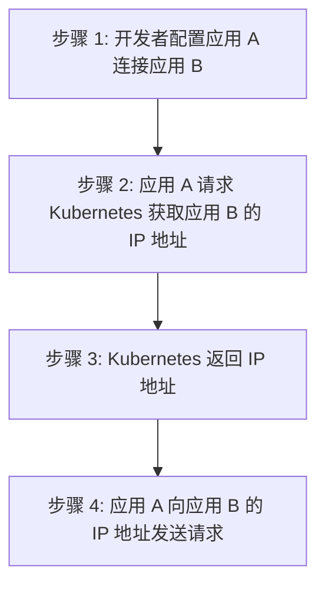
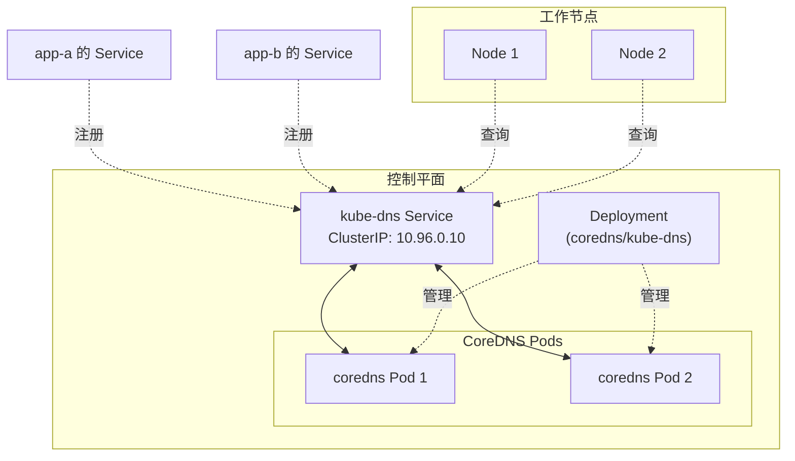
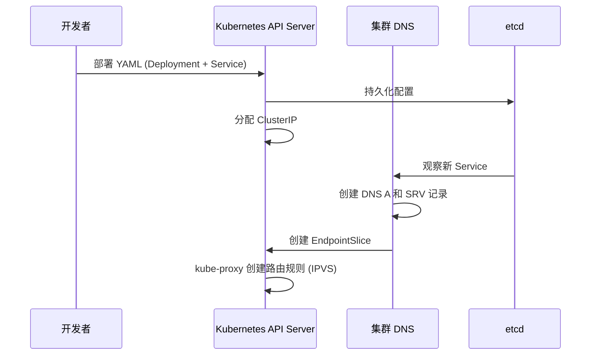
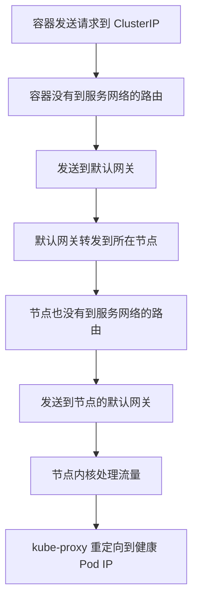
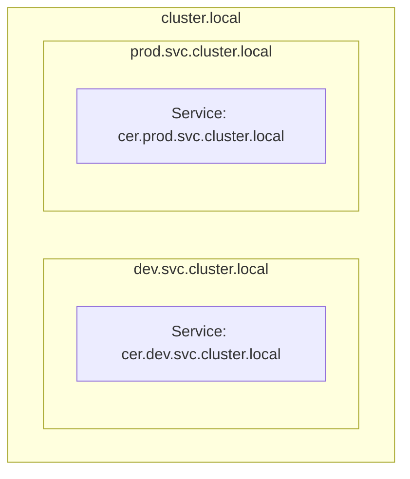

# 服务发现深度剖析

> [!NOTE]+ 本章简介
> 本章将介绍 Kubernetes 中的服务发现机制，包括其重要性及实现方式，同时提供一些故障排除技巧。建议先阅读第7章以了解 [[Kubernetes Service]] 的相关知识。

## 场景设定

在繁忙的 Kubernetes 平台上定位资源并非易事，而[[服务发现]]机制使其变得简单。

大多数 Kubernetes 集群运行着成百上千个微服务应用，它们大多数都位于各自的 [[Service]] 后面，并获得可靠的名字和 IP 地址。当一个应用需要与另一个应用通信时，实际上是通过对方的 [[Service]] 进行通信。

> [!INFO]+ 关键概念
> 本章中，提到应用需要查找或与其他应用通信时，均指通过目标应用前端的 Service 进行交互。



应用需要两样东西才能向其他应用发送请求：

1. **知道目标应用的名称**（其 Service 的名称）
2. **将名称转换为 IP 地址**

> [!TIP]+ 职责划分
> - **开发者**负责第1步 —— 确保应用知道它们所依赖的其他应用和微服务的名称
> - **Kubernetes**负责第2步 —— 将名称转换为 IP 地址

服务发现流程概览（四个主要步骤）：



> [!NOTE]
> 步骤 1 是唯一需要手动操作的步骤。Kubernetes 自动处理步骤 2、3 和 4。

---

## 服务注册表

[[服务注册表]]的主要职责是维护 [[Service]] 名称及其关联 IP 地址的列表。

每个 Kubernetes 集群都有一个内置的**集群 DNS**，用作服务注册表。这是一个运行在每个 Kubernetes 集群控制平面上的 Kubernetes 原生应用，由 Deployment 管理，两个或多个 Pod 组成，并有自己的 Service 作为前端。Deployment 通常命名为 `coredns` 或 `kube-dns`，Service 始终命名为 `kube-dns`。



> [!INFO]+ 架构说明
> Kubernetes 使服务注册和服务发现自动化，后文将详细说明。

### 验证集群 DNS 组件

以下命令可用于查看集群 DNS 的 Pod、Deployment 和 Service：

```bash
# 查看运行集群 DNS 的 Pod
$ kubectl get pods -n kube-system -l k8s-app=kube-dns

NAME                       READY   STATUS    RESTARTS   AGE
coredns-76f75df574-d6nn5   1/1     Running   0          13d
coredns-76f75df574-n7qzk   1/1     Running   0          13d

# 查看管理 Pod 的 Deployment
$ kubectl get deploy -n kube-system -l k8s-app=kube-dns

NAME        READY     UP-TO-DATE     AVAILABLE     AGE
coredns     2/2       2              2             13d

# 查看集群 DNS 前端的 Service
$ kubectl get svc -n kube-system -l k8s-app=kube-dns

NAME       TYPE        CLUSTER-IP     EXTERNAL-IP   PORT(S)       
kube-dns   ClusterIP   10.96.0.10     <none>        53/UDP,53/TCP
```

> [!SUMMARY]+ 小结
> 每个 Kubernetes 集群都运行一个内部集群 DNS 服务作为服务注册表。它将每个 Service 的名称和 IP 进行映射，作为一组由 Deployment 管理的 Pod 运行，并通过 Service 提供前端。

---

## 服务注册

> [!IMPORTANT]+ 核心要点
> Kubernetes 上服务注册最重要的特点是：**它是自动的！**

高层概述：开发应用并将其置于 [[Service]] 后面以获得可靠的名称和 IP。Kubernetes 自动将这些 Service 名称和 IP 注册到服务注册表（集群 DNS）。

服务注册有三个步骤：

1. 为 Service 指定名称
2. 为 Service 分配 IP
3. 将名称和 IP 注册到集群 DNS

> [!TIP]+ 职责划分
> - **开发者**负责第 1 步
> - **Kubernetes** 自动处理第 2 和第 3 步

### 示例

假设开发一个名为 `valkyrie-web` 的新 Web 应用，其他应用将通过此名称连接。部署方式是在名为 `valkyrie-web` 的 [[Kubernetes Service]] 后面运行应用。

Kubernetes 确保 Service 名称唯一，自动分配 ClusterIP，并将名称和 IP 注册到集群 DNS。

> [!INFO]+ 自动注册原理
> 注册过程是自动的，因为集群 DNS 是一个 Kubernetes 原生应用，它监视 API 服务器以获取新的 Service。每当发现新的 Service 时，它会自动注册其名称和 IP。这意味着应用不需要任何服务注册逻辑 —— 只需将应用放在 Service 后面，集群 DNS 会完成其余工作。



### 注册流程详解

1. **部署**：将包含 Deployment 和 Service 定义的 YAML 文件提交给 Kubernetes
2. **认证授权**：Kubernetes 对请求进行身份验证和授权
3. **分配 IP**：Kubernetes 为 Service 分配 ClusterIP，并将其配置持久化到集群存储
4. **DNS 注册**：集群 DNS 观察到新的 Service，注册相应的 DNS A 和 SRV 记录
5. **EndpointSlice**：创建关联的 EndpointSlice 对象，保存匹配 Service 标签选择器的健康 Pod IP 列表
6. **路由规则**：每个集群节点上的 kube-proxy 进程观察新对象，创建本地路由规则（IPVS），将发送到 Service ClusterIP 的请求路由到 Pod

---

## 服务发现

应用通过名称与其他应用通信。然而，它们需要将这些名称转换为 IP 地址，这就是[[服务发现]]的作用。

### 场景示例

假设集群中有两个应用：`enterprise` 和 `cerritos`。`enterprise` 应用位于名为 `ent` 的 ClusterIP Service 后面，`cerritos` 应用位于名为 `cer` 的 Service 后面。

| 应用 | Service 名称 | ClusterIP |
|------|-------------|-----------|
| Enterprise | ent | 192.168.201.240 |
| Cerritos | cer | 192.168.200.217 |

> [!INFO]+ 关键概念
> - 开发者负责在应用中编码它们所消费的应用的名称
> - Kubernetes 提供将名称转换为 IP 的机制

### 服务发现的工作原理

当 `enterprise` 应用需要向 `cerritos` 应用发送请求时：

1. **应用发送请求到名称**：应用向 `cer` 发送请求
2. **DNS 解析**：应用的容器将名称发送到 `/etc/resolv.conf` 中配置的集群 DNS
3. **返回 IP**：集群 DNS 返回 `cer` Service 的 ClusterIP
4. **发送请求**：应用向返回的 IP 地址发送流量

### 容器 DNS 配置

Kubernetes 通过自动配置每个容器的 `/etc/resolv.conf` 文件来使每个容器使用集群 DNS 进行服务发现。配置包括：

- 集群 DNS Service 的 IP 地址
- 追加到非限定名称的搜索域

```bash
$ cat /etc/resolv.conf 
search default.svc.cluster.local svc.cluster.local cluster.local
nameserver 10.96.0.10
options ndots:5
```

> [!INFO]+ 术语解释
> - **非限定名称**：短名称，如 `ent`
> - **完全限定域名 (FQDN)**：如 `ent.default.svc.cluster.local`

### ClusterIP 路由

> [!WARNING]+ 重要概念
> ClusterIP 在一个称为"服务网络"的特殊网络上，**没有到它的路由**！这意味着每个容器将 ClusterIP 流量发送到其默认网关。



> [!NOTE]+ 默认网关
> 默认网关是当系统不知道将流量发送到哪里时发送网络流量的地方。

### kube-proxy 的作用

每个 Kubernetes 节点都运行一个名为 `kube-proxy` 的系统服务，它实现了一个控制器，监视 API 服务器以获取新的 [[Service]] 和 EndpointSlice 对象。每当观察到新对象时，它会在内核中创建规则，拦截 ClusterIP 流量并将其转发到各个 Pod IP。

---

## 服务发现与命名空间

> [!INFO]+ 核心概念
> 每个 Kubernetes 对象在集群地址空间中都有一个名称，你可以使用[[Namespace]]来划分地址空间。

### 集群地址空间

集群地址空间是一个 DNS 域，通常称为**集群域**。在大多数集群上，它是 `cluster.local`，对象名称必须在其中唯一。

> [!TIP]+ FQDN 格式
> 完全限定域名 (FQDN) 格式：`<对象名称>.<命名空间>.svc.cluster.local`

### 使用命名空间划分地址空间



### 命名空间中的唯一性规则

> [!IMPORTANT]+ 唯一性规则
> - 对象名称在命名空间内必须唯一
> - 但跨命名空间可以重复

例如，同一集群中可以有：
- `dev` 命名空间中的 `cer` Service
- `prod` 命名空间中的 `cer` Service

### 服务发现规则

| 连接目标 | 使用方式 | 示例 |
|---------|---------|------|
| 本地命名空间中的 Service | 短名称 | `ent` |
| 远程命名空间中的 Service | FQDN | `ent.prod.svc.cluster.local` |

---

## 服务发现示例

### 部署配置

以下 YAML 定义了：
- 两个命名空间：`dev` 和 `prod`
- 两个 Deployment（同名，不同命名空间）
- 两个 Service（同名，不同命名空间）
- 一个 jump Pod（在 dev 命名空间中）

```yaml
apiVersion: v1
kind: Namespace
metadata:
  name: dev
---
apiVersion: v1
kind: Namespace
metadata:
  name: prod
---
apiVersion: apps/v1
kind: Deployment
metadata:
  name: enterprise
  namespace: dev
spec:
  replicas: 2
  template:
    spec:
      containers:
      - image: nigelpoulton/k8sbook:text-dev
        name: enterprise-ctr
        ports:
        - containerPort: 8080
---
apiVersion: apps/v1
kind: Deployment
metadata:
  name: enterprise
  namespace: prod
spec:
  replicas: 2
  template:
    spec:
      containers:
      - image: nigelpoulton/k8sbook:text-prod
        name: enterprise-ctr
        ports:
        - containerPort: 8080
---
apiVersion: v1
kind: Service
metadata:
  name: ent
  namespace: dev
spec:
  selector:
    app: enterprise
  ports:
    - port: 8080
  type: ClusterIP
---
apiVersion: v1
kind: Service
metadata:
  name: ent
  namespace: prod
spec:
  selector:
    app: enterprise
  ports:
    - port: 8080
  type: ClusterIP
---
apiVersion: v1
kind: Pod
metadata:
  name: jump
  namespace: dev
spec:
  terminationGracePeriodSeconds: 5
  containers:
  - name: jump
    image: ubuntu
    tty: true
    stdin: true
```

### 部署和验证

```bash
# 部署所有资源
$ kubectl apply -f sd-example.yml

# 验证 dev 命名空间
$ kubectl get all --namespace dev

NAME                         READY   UP-TO-DATE   AVAILABLE   AGE
deployment.apps/enterprise   2/2     2            2           51s

NAME          TYPE        CLUSTER-IP      EXTERNAL-IP   PORT(S)   
service/ent   ClusterIP   10.96.138.186   <none>        8080/TCP  

# 验证 prod 命名空间
$ kubectl get all --namespace prod

NAME                         READY   UP-TO-DATE   AVAILABLE   AGE
deployment.apps/enterprise   2/2     2            2           1m24

NAME          TYPE        CLUSTER-IP     EXTERNAL-IP   PORT(S)    
service/ent   ClusterIP   10.96.147.32   <none>        8080/TCP   
```

### 测试服务发现

#### 1. 登录到 jump Pod

```bash
$ kubectl exec -it jump --namespace dev -- bash 
root@jump:/#
```

#### 2. 检查 DNS 配置

```bash
# cat /etc/resolv.conf
search dev.svc.cluster.local svc.cluster.local cluster.local
nameserver 10.96.0.10
options ndots:5
```

> [!NOTE]
> 注意 `dev.svc.cluster.local` 搜索域 —— 这使容器能够解析 dev 命名空间中的短名称。

#### 3. 连接到本地命名空间中的 Service

```bash
# apt-get update && apt-get install curl -y
# curl ent:8080
Hello from the DEV Namespace!
Hostname: enterprise-76fc64bd9-lvzsn
```

> [!SUCCESS]+ 验证结果
> 响应"Hello from the DEV Namespace"证明连接到达了 dev 命名空间中的实例。

解析过程：
1. 容器自动将 `dev.svc.cluster.local` 追加到 `ent` 名称
2. 将查询发送到 `/etc/resolv.conf` 中指定的集群 DNS
3. 集群 DNS 返回 dev 命名空间中 `ent` Service 的 ClusterIP
4. 流量发送到该 IP 地址
5. 流量经过节点默认网关时被内核拦截并重定向到匹配的 Pod

#### 4. 连接到远程命名空间中的 Service

```bash
# curl ent.prod.svc.cluster.local:8080
Hello from the PROD Namespace!
Hostname: enterprise-5cfcd578d7-nvzlp
```

> [!TIP]+ 跨命名空间连接
> 需要使用 FQDN 来连接其他命名空间中的 Service。

#### 5. 退出 Pod

```bash
exit
```

---

## 服务发现故障排除

> [!WARNING]+ 故障排除提示
> Kubernetes 使服务注册和服务发现自动化，但幕后发生了很多事情，了解如何检查和重启相关组件会很有帮助。

### DNS 组件清单

| 组件 | 说明 |
|------|------|
| Pods | 由 coredns Deployment 管理 |
| Service | 名为 `kube-dns` 的 ClusterIP Service，监听端口 53 (TCP/UDP) |
| EndpointSlice | 名称前缀为 `kube-dns` |

> [!NOTE]
> 所有这些对象都在 `kube-system` 命名空间中，并带有 `k8s-app=kube-dns` 标签。

### 验证步骤

#### 1. 检查 Deployment 和 Pods

```bash
$ kubectl get deploy -n kube-system -l k8s-app=kube-dns
NAME      READY   UP-TO-DATE   AVAILABLE   AGE
coredns   2/2     2            2           14d

$ kubectl get pods -n kube-system -l k8s-app=kube-dns
NAME                       READY   STATUS    RESTARTS   AGE
coredns-76f75df574-6q7k7   1/1     Running   0          14d
coredns-76f75df574-krnr7   1/1     Running   0          14d
```

#### 2. 检查 Pod 日志

```bash
$ kubectl logs coredns-76f75df574-n7qzk -n kube-system
.:53
[INFO] plugin/reload: Running configuration SHA512 = 591cf328cccc
CoreDNS-1.11.1
linux/arm64, go1.20.7, ae2bbc2
```

> [!INFO]+ 正常日志特征
> 工作正常的 DNS Pod 会显示上述格式的典型输出。

#### 3. 检查 Service 和 EndpointSlice

```bash
$ kubectl get svc kube-dns -n kube-system
NAME       TYPE        CLUSTER-IP    EXTERNAL-IP   PORT(S)        
kube-dns   ClusterIP   10.96.0.10    <none>        53/UDP,53/TCP,

$ kubectl get endpointslice -n kube-system -l k8s-app=kube-dns
NAME             ADDRESSTYPE   PORTS        ENDPOINTS             
kube-dns-jb72g   IPv4          9153,53,53   10.244.1.9,10.244.1.14
```

> [!IMPORTANT]+ 重要验证
> `kube-dns` Service 的 ClusterIP 地址必须与集群中所有容器的 `/etc/resolv.conf` 文件中的 IP 地址匹配。如果不匹配，容器会将 DNS 查询发送到错误的位置。

### 详细故障排除

#### 启动故障排除 Pod

```bash
$ kubectl run -it dnsutils \
  --image registry.k8s.io/e2e-test-images/jessie-dnsutils:1.7
```

> [!TIP]+ 工具镜像
> `registry.k8s.io/e2e-test-images/jessie-dnsutils` 镜像是一个受欢迎的选择，包含 ping、traceroute、curl、dig、nslookup 等常用网络工具。

#### 测试 DNS 解析

```bash
# nslookup kubernetes
Server:    10.96.0.10
Address:   10.96.0.10#53

Name:      kubernetes.default.svc.cluster.local
Address:   10.244.0.1
```

> [!CHECK]- 验证项
> - 前两行显示集群 DNS 的 IP 地址
> - 后两行显示 kubernetes Service 的 FQDN 及其 ClusterIP

#### 处理 DNS 故障

> [!DANGER]+ 常见错误
> `nslookup: can't resolve kubernetes` 是 DNS 不工作的指示器。

**可能的解决方案**：删除 coredns Pod，这将导致 Deployment 重新创建它们。

```bash
$ kubectl delete pod -n kube-system -l k8s-app=kube-dns
pod "coredns-76f75df574-d6nn5" deleted
pod "coredns-76f75df574-n7qzk" deleted
```

然后验证 Pod 已重启并再次测试 DNS：

```bash
$ kubectl get pods -n kube-system -l k8s-app=kube-dns
```

---

## 清理

```bash
$ kubectl delete pod dnsutils
$ kubectl delete -f sd-example.yml
```

---

## 章节总结

> [!ABSTRACT]+ 本章要点

1. **服务注册表**：Kubernetes 使用内部集群 DNS 作为服务注册表
   
2. **自动注册**：集群 DNS 是 Kubernetes 原生应用，监视 API 服务器以获取新创建的 [[Service]] 对象，并自动注册其名称和 IP

3. **服务发现流程**：
   - 应用使用短名称发送请求
   - 容器将请求发送到 `/etc/resolv.conf` 中配置的集群 DNS
   - 集群 DNS 返回 Service 的 ClusterIP
   - 流量发送到 ClusterIP
   - kube-proxy 将流量重定向到健康 Pod

4. **命名空间隔离**：
   - 对象名称在命名空间内必须唯一
   - 短名称解析到本地命名空间
   - 跨命名空间需要使用 FQDN

5. **故障排除**：检查 coredns Deployment、Pod 日志、Service IP 和 EndpointSlice 对象

> [!TIP]+ 实践建议
> 建议在本地环境中实际操作这些命令，加深对服务发现机制的理解。