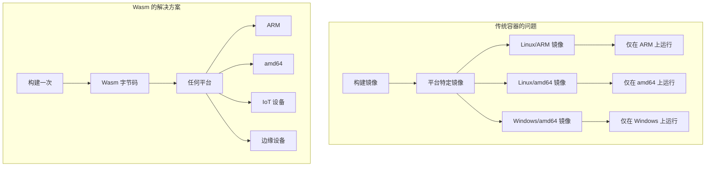
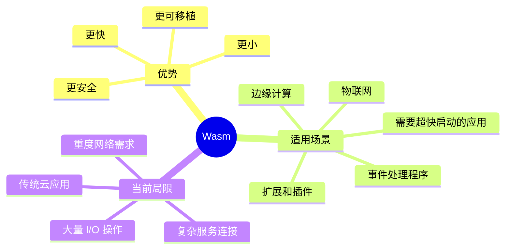
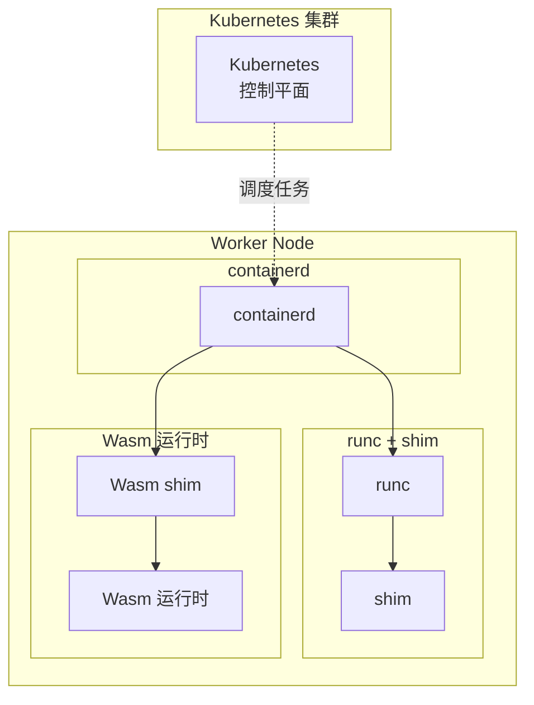
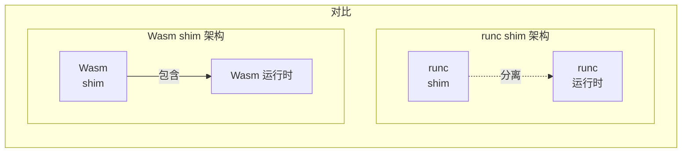
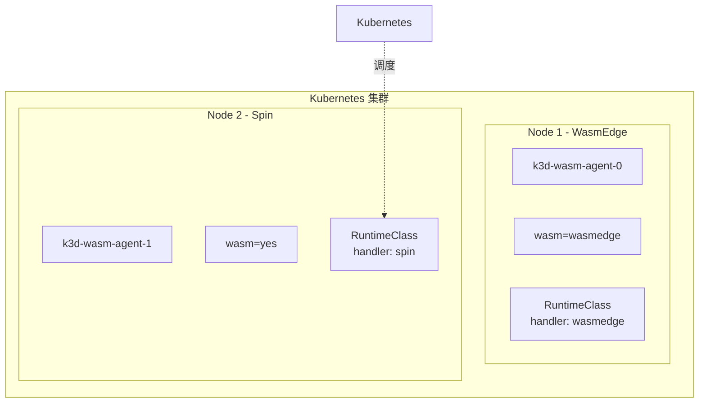
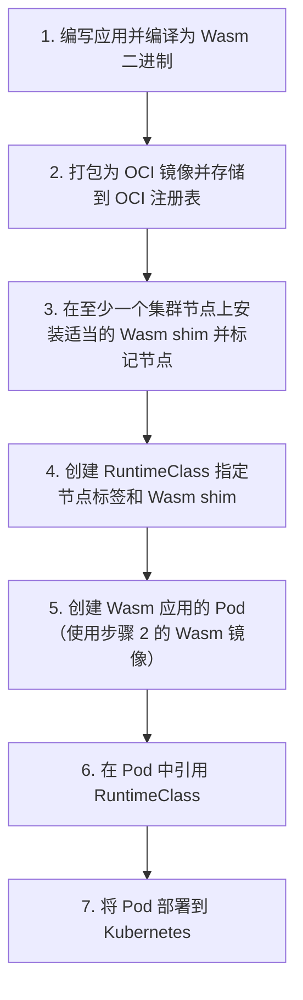
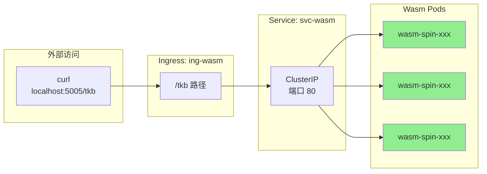

# 第 9 章：Kubernetes 上的 WebAssembly

> [!INFO] 技术浪潮
> 虚拟机是第一波浪潮，容器是第二波，而 WebAssembly 是第三波。每一波新浪潮都使我们能够创建更小、更快、更可移植的应用程序，这些应用可以到达前几波技术无法企及的地方并完成它们无法完成的任务。

本章内容安排如下：

- **Wasm 入门** — 了解 Wasm 是什么及其优缺点
- **理解 Kubernetes 上的 Wasm** — 概述在 Kubernetes 上运行 Wasm 应用的要求
- **Kubernetes 上的 Wasm 实践** — 完整演示构建和配置能够运行 Wasm 应用的 Kubernetes 集群的全过程，包括编写、编译、容器化以及在 Kubernetes 上运行 Wasm 应用

> [!TIP] 实践意义
> 虽然有更简单的方法来创建 Wasm 应用和配置 Kubernetes 来运行它们，例如 Fermyon 的 SpinKube 项目可以自动完成许多即将学习的内容。但在现实世界中，手动完成所有步骤将帮助你获得更深入的理解。

## 术语说明

> [!NOTE] 术语说明
> Wasm 和 WebAssembly 是同一含义，可以互换使用。实际上，Wasm 是 WebAssembly 的缩写，不是首字母缩写词。这意味着正确的写法是 Wasm，而不是 WASM。

此外，"Kubernetes 上的 Wasm" 只是众多用例之一，其他常见表述还包括："浏览器外的 WebAssembly"、"服务器上的 WebAssembly"、"云中的 WebAssembly"和"边缘的 WebAssembly"。

---

# Wasm 入门

WebAssembly 首次出现在 2017 年，并因加速 Web 应用而迅速成名。八年后，它已成为官方 W3C 标准，被所有主流浏览器采用，成为高性能 Web 游戏和 Web 应用的首选解决方案，同时不牺牲安全性和可移植性。

> [!QUOTE] 行业洞察
> Docker 创始人 Solomon Hykes 曾在推特上写道："如果 Wasm+WASI 在 2008 年就存在，我们就不需要创建 Docker 了。它就是这么重要。服务器上的 WebAssembly 是计算的未来。标准化的系统接口是缺失的一环。希望 WASI 能胜任这一任务！"
>
> 他随后又发推文表示，期望 Linux 容器和 Wasm 容器能够共存，Docker 能够与它们协同工作。

Solomon 预测的未来已经到来。Docker 对 Wasm 有着出色的支持，你可以在同一个 Kubernetes Pod 中运行 Linux 容器和 Wasm 容器。然而，Wasm 标准和生态系统仍然相对较新，这意味着传统 Linux 容器仍然是许多云应用和用例的最佳选择。

## 技术原理

从技术角度来看，Wasm 是一种二进制指令集架构（ISA），类似于 ARM、x86、MIPS 和 RISC-V。这意味着编程语言可以将源代码编译成 Wasm 二进制文件，这些文件可以在任何装有 Wasm 运行时的系统上运行。

Wasm 应用在默认拒绝的安全沙箱中执行，沙箱不信任应用程序，这意味着默认情况下所有访问都被拒绝，必须明确授权才能访问。这与容器的默认完全开放模式相反。

> [!KEYPOINT] WASI 是什么？
> WASI（WebAssembly System Interface）是 WebAssembly 系统接口，允许沙箱化的 Wasm 应用安全地访问外部服务，如键值存储、网络、主机环境等。WASI 对于浏览器外的 WebAssembly 成功至关重要，截至编写本书时，WASI Preview 2 已发布，这是一个巨大的飞跃。
>
> 你有时会看到 WASI Preview 2 被写成 WASI 0.2 和 wasip2。

## Wasm 的安全性

> [!WARNING] 安全模型对比
> Wasm 从一切皆锁定的状态开始，而容器从一切皆开放的状态开始。

尽管容器默认采用开放的安全策略，但我们必须承认社区在保护容器和容器编排平台方面所做的出色工作。运行安全的容器化应用比以往任何时候都更容易，尤其是在托管的 Kubernetes 平台上。然而，默认允许的模型加上对共享内核的广泛访问权限，始终会为容器带来安全挑战。

Wasm 则完全不同。Wasm 应用在默认拒绝的沙箱中执行，运行时必须明确允许访问沙箱外部的资源。你还应该知道，这个沙箱经过多年在最恶劣环境之一——网络世界——中的实战检验，已经非常成熟可靠。

## Wasm 的可移植性

> [!IMPORTANT] 常见误解
> 一个常见的误解是认为容器是可移植的。实际上，它们并非真正的可移植！

我们之所以认为容器是可移植的，只是因为它们比虚拟机小，更容易在主机和注册表之间复制。然而，这并非真正的可移植性。实际上，容器是架构依赖的，意味着它们不可移植。例如，你无法在 AMD 处理器上运行 ARM 容器，也无法在 Linux 系统上运行 Windows 容器。



WebAssembly 解决了这个问题，实现了"一次构建，随处运行"的承诺！它通过实现自己的字节码格式来实现这一点，需要运行时来执行。你将应用构建为 Wasm 二进制文件一次，然后就可以在任何装有 Wasm 运行时的系统上运行。

> [!EXAMPLE] 示例
> 作为快速示例，我在基于 ARM 的 Mac 上构建了本章的示例应用。然而，由于我将其编译为 Wasm，它可以在任何具有适当 Wasm 运行时的主机上运行。在本章后面，我们将在 Kubernetes 集群上执行它，该集群可以在你的笔记本电脑上、在数据中心或云中。它还可以在 Kubernetes 支持的任何架构上运行。

Wasm 运行时甚至存在于物联网和边缘设备的特殊架构上。

说到物联网设备，Wasm 应用通常比 Linux 容器小得多，这意味着你可以在资源受限的环境（如边缘和物联网）中运行它们，而在这些环境中无法运行容器。

> [!KEYPOINT] 总结
> Wasm 实现了"一次构建，随处运行"的承诺。

## Wasm 的性能

> [!INFO] 启动时间对比
> 作为一般规律，虚拟机需要分钟级启动，容器需要秒级启动，而 Wasm 让我们进入了令人兴奋的亚秒级启动世界。Wasm 冷启动非常快，以至于感觉不像冷启动。例如，Wasm 应用通常在约 10 毫秒或更短的时间内启动。通过正确的优化，有些可以在微秒级启动！

这改变了游戏规则，并推动了早期的大部分用例。例如，Wasm 非常适合事件驱动的架构（如无服务器函数）。它还使真正的零扩展成为可能。

## 快速回顾



> [!TIP] 发展趋势
> Wasm 应用比传统 Linux 容器更小、更快、更可移植、更安全。然而，目前仍处于早期阶段，Wasm 并非所有场景的最佳选择。当前，Wasm 是事件处理程序和任何需要超快启动时间的场景的绝佳选择。它也非常适合物联网、边缘计算以及构建扩展和插件。然而，截至本书编写时，对于需要网络、重度 I/O 和连接其他服务的传统云应用，容器可能仍然是更好的选择。
>
> 尽管如此，Wasm 发展迅速，WASI Preview 2 是向前迈出的重要一步。

现在我们了解了 Wasm 的基础知识，接下来让我们看看它如何与 Kubernetes 结合使用。

---

# 理解 Kubernetes 上的 Wasm

> [!INFO] 概述说明
> 本节介绍在使用 containerd 的 Kubernetes 集群上运行 Wasm 应用的主要要求。存在其他在 Kubernetes 上运行 Wasm 应用的方法。本节只是一个概述，我们将在实践部分更详细地介绍所有内容。

## 架构概览

Kubernetes 是一个高级编排器，使用其他工具来执行低级任务，如创建、启动和停止容器。最常见的配置是 Kubernetes 使用 containerd 来管理这些低级任务。



在图 9.2 所示的架构中，containerd 以下的所有内容对 Kubernetes 都是隐藏的。这意味着你可以用 Wasm 运行时和 Wasm shim 替换 runc 和标准 shim。图 9.3 显示了同一节点运行两个额外的 Wasm 工作负载。

> [!NOTE] 架构特点
> 请记住，节点上仍然只有一个 containerd 实例，Kubernetes 看不到 containerd 以下的任何内容。这是一个完全受支持的配置，我们将在实践部分部署与此非常相似的配置。

## Wasm Shim 架构



> [!KEYPOINT] 架构差异
> 值得注意的是，Wasm shim 架构与 runc shim 架构不同。如图 9.4 所示，Wasm shim 是一个包含 shim 代码和 Wasm 运行时代码的单一二进制文件。

与 containerd 接口的 Wasm shim 代码是 runwasi，但每个 shim 可以嵌入特定的 Wasm 运行时。例如，Spin shim 嵌入 runwasi Rust 库和 Spin 运行时代码。同样，Slight shim 嵌入 runwasi 和 Slight 运行时。在每个 shim 中，嵌入的 Wasm 运行时创建 Wasm 主机并执行 Wasm 应用，而 runwasi 完成与 containerd 的所有翻译和接口工作。

> [!INFO] Shim 命名规范
> 关于 shim 还有最后一件事。containerd 要求我们按以下方式命名所有 shim 二进制文件：
> - 使用 `containerd-shim-` 前缀
> - 指定运行时名称
> - 指定版本
>
> 例如，Spin shim 称为 `containerd-shim-spin-v2`。



图 9.5 显示了一个 Kubernetes 集群，其中两个节点运行不同的 shim。在这样的配置中，Kubernetes 需要帮助将工作负载调度到具有正确 shim 的节点。我们通过节点标签和 RuntimeClass 对象提供这种帮助。图中 Node 2 具有 `spin=yes` 标签，Kubernetes 有一个 RuntimeClass 对象选择该标签并在 handler 属性中指定目标运行时。这确保了任何引用此 RuntimeClass 的 Pod 将被调度到 Node 2 并使用 Spin 运行时（handler）。

## 部署工作流程



Kubernetes 上的 Wasm 部署工作流程：

1. **编写应用并编译为 Wasm 二进制文件**
2. **将 Wasm 二进制文件打包为 OCI 镜像并存储到 OCI 注册表**
3. **在至少一个集群节点上安装适当的 Wasm shim 并标记节点**
4. **创建 RuntimeClass 指定节点标签和 Wasm shim**
5. **创建 Wasm 应用的 Pod（使用步骤 2 的 Wasm 镜像）**
6. **在 Pod 中引用 RuntimeClass**
7. **将 Pod 部署到 Kubernetes**

> [!INFO] 部署过程说明
> 部署 Pod 时会发生以下所有操作：
> 1. Kubernetes 将 Pod 调度到与 RuntimeClass 中节点选择器匹配的节点
> 2. 节点上的 kubelet 将连同 RuntimeClass 中的 shim 信息一起将工作传递给 containerd
> 3. containerd 将使用 RuntimeClass 中请求的 shim 启动应用

Talk is cheap. Let's do it.

---

# Kubernetes 上的 Wasm 实践

> [!PREREQUISITE] 前置准备
> 在开始本节之前，你需要克隆本书的 GitHub 仓库并切换到 `2025` 分支。

```bash
$ git clone https://github.com/nigelpoulton/TKB.git
<Snip>
$ cd TKB
$ git fetch origin
$ git checkout -b 2025 origin/2025
```

现在进入 wasm 文件夹。

```bash
$ cd TKB/wasm
```

在本节中，你将完成以下所有步骤来编写 Wasm 应用并在多节点 Kubernetes 集群上运行它：

1. 安装并测试前置条件
2. 编写并编译 Wasm 应用
3. 将其构建为 OCI 镜像并推送到 OCI 注册表
4. 为 Wasm 构建和配置新的多节点 Kubernetes 集群
5. 将应用部署到 Kubernetes

> [!TIP] 现实世界
> 在现实世界中，SpinKube 等云平台和工具将简化和自动化大部分流程。然而，你将手动执行这些步骤，这会给你更深入的理解，为你在现实世界中部署和管理 Kubernetes 上的 Wasm 应用做好准备。

## 1. 安装并测试前置条件

> [!REQUIREMENTS] 所需工具
> 如果你打算跟随操作，需要准备以下所有工具：

| 工具 | 版本要求 | 说明 |
|------|---------|------|
| Docker Desktop | 最新版本，启用 Wasm 支持 | 参见第 3 章 |
| Rust | 1.82 或更高版本，安装 wasm32-wasip1 目标 | [安装地址](https://www.rust-lang.org/tools/install) |
| Spin | 3.1.2 或更高版本 | Fermyon 的 Wasm 框架 |
| k3d | 5.8.1 或更高版本 | Kubernetes 集群工具 |

安装 Rust 后，运行以下命令安装 wasm32-wasip1 目标，以便 Rust 可以将代码编译为 Wasm 二进制文件。

```bash
$ rustup target add wasm32-wasip1
info: downloading component 'rust-std' for 'wasm32-wasip1'
info: installing component 'rust-std' for 'wasm32-wasip1'
```

Spin 是一个流行的 Wasm 框架，包含 Wasm 运行时和用于构建和使用 Wasm 应用的工具。在网上搜索 "install Fermyon Spin" 并按照适合你平台的安装说明进行操作。

运行以下命令确认安装成功。

```bash
$ spin --version
spin 3.1.2 (3d37bd8 2025-01-13)
```

## 2. 编写并编译 Wasm 应用

> [!STEP] 步骤说明
> 在本节中，你将使用 Spin 来构建和编译 Wasm 应用。

运行以下 `spin new` 命令（在 wasm 文件夹内），并按所示完成提示。这将创建一个简单的 Spin 应用，响应端口 80 上 `/tkb` 路径的 Web 请求。TKB 是 The Kubernetes Book 的缩写。

```bash
$ spin new tkb-wasm -t http-rust
Description []: My first Wasm app
HTTP path [/...]: /tkb
```

你将有一个名为 `tkb-wasm` 的新目录，其中包含构建和运行应用所需的一切。

进入 `tkb-wasm` 目录并列出其内容。

```bash
$ cd tkb-wasm
$ tree
├── Cargo.toml
├── spin.toml
└── src
    └── lib.rs

2 directories, 3 files
```

我们只关心两个文件：
- `spin.toml` — 告诉 Spin 如何构建和运行应用
- `src/lib.rs` — 应用源代码

> [!TIP] 编辑源代码
> 编辑 `src/lib.rs` 文件，使其返回文本 "The Kubernetes Book loves Wasm!"。

```rust
use spin_sdk::http::{IntoResponse, Request, Response};
<Snip>
fn handle_tkb_wasm(req: Request) -> anyhow::Result<impl IntoResponse> {
    println!("Handling request to {:?}", req.header("spin-full-url"));
    Ok(Response::builder()
        .status(200)
        .header("content-type", "text/plain")
        .body("The Kubernetes Book loves Wasm!")  // <<-- 修改此行
        .build())
}
```

保存更改后，运行 `spin build` 将应用编译为 Wasm 二进制文件。在后台，`spin build` 运行 Rust 工具链中更复杂的 `cargo build` 命令。

```bash
$ spin build
Building component tkb-wasm with `cargo build --target wasm32-wasip1/release`
    Updating crates.io index
    <Snip>
Finished building all Spin components
```

> [!SUCCESS] 恭喜！
> 你刚刚构建并编译了一个 Wasm 应用！

应用二进制文件称为 `tkb_wasm.wasm`，位于 `target/wasm32-wasip1/release/` 文件夹中。这可以在任何装有 Spin Wasm 运行时的机器上运行。在本章后面，你将在装有 Spin Wasm 运行时的 Kubernetes 节点上运行它。

## 3. 构建 OCI 镜像并推送到 OCI 注册表

> [!STEP] 容器化 Wasm 应用
> 现在你已经编译了应用，下一步是将其打包为容器，以便可以在 OCI 注册表上共享并在 Kubernetes 上运行。

首先，你需要的是一个 Dockerfile，告诉 Docker 如何将其打包为 OCI 镜像。

在 `tkb-wasm` 文件夹中创建一个新的 `Dockerfile`，内容如下。注意最后两行末尾的句点。

```dockerfile
FROM scratch
COPY /target/wasm32-wasip1/release/tkb_wasm.wasm .
COPY spin.toml .
```

> [!EXPLANATION] scratch 基础镜像
> `FROM scratch` 行告诉 Docker 将你的 Wasm 应用打包在空的 scratch 镜像中，而不是典型的 Linux 基础镜像中。这可以保持镜像的小巧，并有助于在运行时构建最小的容器。
>
> 你可以这样做是因为 Wasm 应用不需要带有 Linux 文件系统和其他构造的容器。然而，Docker 和 Kubernetes 等平台使用的工具期望使用基本的容器构造和打包，将你的 Wasm 应用打包在 scratch 镜像中可以实现这一点。在运行时，Wasm 应用和 Wasm 运行时将在一个最小的容器内执行，该容器基本上只是命名空间和 cgroup（没有文件系统等）。
>
> 第一个 COPY 指令将编译的 Wasm 二进制文件复制到容器的根文件夹。第二个将 `spin.toml` 文件复制到同一根文件夹。

> [!NOTE] 更新配置
> `spin.toml` 文件告诉 spin 运行时 Wasm 应用在哪里以及如何执行。目前，它期望 Wasm 应用在 `target/wasm32-wasip1/release` 文件夹中，但 Dockerfile 将其复制到容器中的根文件夹。这意味着你需要更新 `spin.toml` 文件，使其期望在根（`/`）文件夹中。

编辑 `spin.toml` 文件，将 `[component.tkb-wasm]` 源字段的前导路径删除，如下所示。

```bash
$ vim spin.toml
<Snip>
[component.tkb-wasm]
source = "tkb_wasm.wasm"  // <<---- 从这里删除前导路径
<Snip>
```

> [!CHECKPOINT] 检查点
> 此时，你已拥有以下所有内容：
> - Wasm 应用（Wasm 二进制文件）
> - `spin.toml` 文件，告诉 Spin Wasm 运行时如何执行 Wasm 应用
> - `Dockerfile`，告诉 Docker 如何将 Wasm 应用构建为 OCI 镜像

运行以下命令将 Wasm 应用构建为 OCI 镜像。如果你计划在后续步骤中将其推送到注册表，需要在最后一行使用你自己的 Docker Hub 用户名。

```bash
$ docker build \
  --platform wasi/wasm \
  --provenance=false \
  -t nigelpoulton/k8sbook:wasm-0.2 .
```

> [!INFO] 平台标志
> `--platform wasi/wasm` 标志设置镜像的操作系统和架构。`docker run` 和 containerd 等工具可以在运行时读取这些属性，以帮助创建容器和运行应用。

检查镜像是否存在于本地机器上。随意运行 `docker inspect` 并验证操作系统和架构属性。

```bash
$ docker images
REPOSITORY              TAG         IMAGE ID        CREATED       
nigelpoulton/k8sbook    wasm-0.2    a003c43b1308    7 seconds ago 
```

> [!TIP] 镜像大小
> 注意镜像有多小。类似的 hello world Linux 容器通常有几兆字节的大小。

> [!SUCCESS] 里程碑
> 恭喜！你已经创建了一个 Wasm 应用并将其打包为可以推送到注册表的 OCI 镜像，以便 Kubernetes 稍后拉取。你不必将镜像推送到注册表，因为我有预先创建的镜像供你使用。但是，如果你确实要推送到注册表，你需要用之前步骤中创建的镜像标签替换它。你还需要在你要推送的注册表上有一个账户。

```bash
$ docker push nigelpoulton/k8sbook:wasm-0.2
The push refers to repository [docker.io/nigelpoulton/k8sbook]
4073bf46d785: Pushed
7893057c9bbc: Pushed
wasm-0.2: digest: sha256:a003c43b1308dce78c8654b7561d9a...779c5c9
```

到目前为止，你已经编写了一个应用，将其编译为 Wasm，打包为 OCI 镜像，并推送到注册表。接下来，你将构建和配置一个能够运行 Wasm 应用的 Kubernetes 集群。

## 4. 为 Wasm 构建和配置多节点 Kubernetes 集群

> [!STEP] 集群构建
> 本节展示如何在本地机器上构建新的 k3d Kubernetes 集群并为其配置 Wasm。它基于包含预装 Wasm shim 的自定义 k3d 镜像，这意味着你将需要构建这个确切的集群才能跟随操作。

你将完成以下所有步骤：
1. 安装 k3d
2. 构建 3 节点 Kubernetes 集群（一个控制平面节点和两个工作节点）
3. 检查其中一个工作节点上的 Wasm 配置
4. 标记其中一个工作节点，以便 Kubernetes 知道它可以运行 Wasm 应用
5. 创建 RuntimeClass，以便 Kubernetes 知道在哪里调度 Wasm 应用

前往 k3d.io 主页，向下滚动找到适合你平台的安装说明。按照说明进行操作，然后运行 `k3d --version` 命令确保正确安装。

安装 k3d 后，运行以下命令创建一个名为 wasm 的新 k3d 集群。这也将把你的 kubectl 上下文更改为新集群。

```bash
$ k3d cluster create wasm \
      --image ghcr.io/deislabs/containerd-wasm-shims/examples/k3d \
      -p "5005:80@loadbalancer" --agents 2
```

> [!EXPLANATION] 命令参数说明
> - 第一行创建一个名为 wasm 的新集群
> - `--image` 标志告诉 k3d 使用哪个镜像来构建控制平面节点和工作节点。这是一个包含 containerd Wasm shim 的特殊镜像
> - `-p` 标志创建一个负载均衡器，连接到集群上的 Ingress，并将你主机上的端口 5005 映射到集群内部的端口 80
> - `--agents 2` 标志创建两个工作节点

集群启动后，你可以用以下命令测试连接。你应该看到三个节点——一个控制平面节点和两个工作节点。

```bash
$ kubectl get nodes
NAME                 STATUS    ROLES            AGE    VERSION
k3d-wasm-server-0    Ready     control-plane    17s    v1.27.8+k3
k3d-wasm-agent-1     Ready     <none>           15s    v1.27.8+k3
k3d-wasm-agent-0     Ready     <none>           15s    v1.27.8+k3
```

### 检查 Wasm shim

> [!REQUIREMENT] 运行 Wasm 工作负载的要求
> 如果你想运行 Wasm 工作负载，至少需要一个具有以下两者的集群节点：
> 1. 安装并运行 containerd
> 2. 安装并注册 containerd Wasm shim

进入 k3d-wasm-agent-1 工作节点并检查 containerd 是否正在运行。

```bash
$ docker exec -it k3d-wasm-agent-1 ash
$ ps | grep containerd
PID   USER     COMMAND
98    0        containerd
<Snip>
```

现在检查节点的 Wasm shim。shim 文件应该在 `/bin` 目录中，并根据 containerd shim 命名约定命名，前缀为 `containerd-shim-` 并在末尾要求版本号。

> [!INFO] Shim 列表
> 以下输出显示五个 shim——`containerd-shim-runc-v2` 是执行 Linux 容器的默认 shim，其他四个是 Wasm shim。对我们来说重要的是名为 `containerd-shim-spin-v2` 的 Spin shim。

```bash
$ ls /bin | grep shim
containerd-shim-lunatic-v1
containerd-shim-runc-v2
containerd-shim-slight-v1
containerd-shim-spin-v2
containerd-shim-wws-v1
```

### 验证 containerd 配置

> [!NOTE] 配置检查
> 文件系统中存在 Wasm shim 是不够的，它们还需要向 containerd 注册并作为 containerd 配置的一部分加载。

检查 `config.toml` containerd 配置文件中的 Wasm shim 条目。你通常可以在 `/etc/containerd` 找到该文件，但 k3d 目前将其存储在不同的位置。我已经修剪了输出，只显示 Wasm 运行时。

```bash
$ cat /var/lib/rancher/k3s/agent/etc/containerd/config.toml
<Snip>
[plugins.cri.containerd.runtimes.spin]
  runtime_type = "io.containerd.spin.v2"
[plugins.cri.containerd.runtimes.slight]
  runtime_type = "io.containerd.slight.v1"
[plugins.cri.containerd.runtimes.wws]
  runtime_type = "io.containerd.wws.v1"
[plugins.cri.containerd.runtimes.lunatic]
  runtime_type = "io.containerd.lunatic.v1"
```

你也可以运行以下命令来验证活动的 containerd 配置。它解析输出以查找对 Spin Wasm shim 的引用。

```bash
$ containerd --config \
  /var/lib/rancher/k3s/agent/etc/containerd/config.toml \
  config dump | grep spin
<Snip>
  [plugins."io.containerd.grpc.v1.cri".containerd.runtimes.spin]
    runtime_type = "io.containerd.spin.v2"
    [plugins."io.containerd.grpc.v1.cri".containerd.runtimes.spin
```

> [!SUCCESS] 验证成功
> 你已确认 containerd 正在运行且 Spin Wasm shim 存在并已注册。这意味着该节点可以运行 Spin 应用的 Wasm 容器。

### 标记节点并创建 RuntimeClass

> [!INFO] 异构环境说明
> k3d 集群中的所有节点都运行相同的 shim，这意味着每个节点都可以运行 Wasm 应用，不需要进一步的工作。然而，大多数现实世界环境具有异构节点配置，不同节点具有不同的 shim 和运行时。在这些场景中，你需要标记节点并创建 RuntimeClass 来帮助 Kubernetes 将工作调度到正确的节点。

我们将用 `wasm=yes` 标签标记 agent-1 节点，并创建一个针对具有该标签节点的 RuntimeClass。

运行以下命令将 `wasm=yes` 标签添加到 agent-1 工作节点。你需要先输入 `exit` 退出 exec 会话并返回主机终端。

```bash
# exit
$ kubectl label nodes k3d-wasm-agent-1 wasm=yes
node/k3d-wasm-agent-1 labeled
```

验证操作是否成功。你的输出可能包含更多标签。

```bash
$ kubectl get nodes --show-labels | grep wasm=yes
NAME                STATUS    ROLES     VERSION         LABELS
k3d-wasm-agent-0    Ready     <none>    v1.27.8+k3s2    beta.kube
```

运行以下命令创建 `rc-spin` RuntimeClass。

```bash
$ kubectl apply -f rc-spin.yml
runtimeclass.node.k8s.io/rc-spin created
```

> [!KEYPOINT] RuntimeClass 说明
> `scheduling.nodeSelector` 字段确保引用此 RuntimeClass 的 Pod 将仅调度到具有 `wasm=yes` 标签的节点。`handler` 字段告诉节点上的 containerd 使用 spin shim 来执行 Wasm 应用。

检查你是否正确创建了它。

```bash
$ kubectl get runtimeclass
NAME      HANDLER   AGE
rc-spin   spin      14s
```

> [!SUCCESS] 准备就绪
> 此时，你的 Kubernetes 集群已具备运行 Wasm 工作负载所需的一切——agent-1 工作节点已标记并安装了四个 Wasm shim，你已创建了 RuntimeClass 来将 Wasm 任务调度到该节点。

## 5. 部署并测试应用

> [!STEP] 应用部署
> 应用定义在本书 GitHub 仓库的 wasm 文件夹中的 `app.yml` 文件中，包括一个 Deployment、一个 Service 和一个 Ingress。

```yaml
apiVersion: apps/v1
kind: Deployment
metadata:
  name: wasm-spin
spec:
  replicas: 3
  <Snip>
  template:
    metadata:
      labels:
        app: wasm
    <Snip>
    spec:
      runtimeClassName: rc-spin  # <<---- 引用 RuntimeClass
      containers:
        - name: testwasm
          image: nigelpoulton/k8sbook:wasm-0.1  # <<---- 预创建镜像
          command: ["/"]
```

> [!KEYPOINT] 部署配置说明
> Deployment YAML 的重要部分是 Pod spec 中对 RuntimeClass 的引用。这确保 Kubernetes 将所有三个副本调度到满足 RuntimeClass 中 `nodeSelector` 要求的节点——即具有 `wasm=yes` 标签的节点。在我们的示例中，Kubernetes 将所有三个副本调度到 agent-1 节点。



图 9.6 显示了流量路径。YAML 文件还包含一个 Ingress 和一个 Service（未显示）。Ingress 将到达 "/" 路径的流量定向到名为 `wasm-spin` 的 ClusterIP Service，该 Service 将流量转发到端口 80 上所有带有 `app=wasm` 标签的 Pod。Deployment 中定义的副本都具有 `app=wasm` 标签。

在下一步中，你将部署 `app.yml` 文件中定义的应用。它使用本书 Docker Hub 仓库中的预创建 Wasm 镜像。如果你想使用之前步骤中创建的镜像，请编辑你的 `app.yml` 文件并更改镜像字段。

```bash
$ kubectl apply -f app.yml
deployment.apps/wasm-spin created
service/svc-wasm created
ingress.networking.k8s.io/ing-wasm created
```

使用 `kubectl get deploy wasm-spin` 命令检查 Deployment 的状态。

等待所有三个副本准备就绪，然后运行以下命令确保它们都被调度到 agent-1 工作节点。

```bash
$ kubectl get pods -o wide
NAME                          READY    STATUS     ...    NODE     
wasm-spin-5f6fccc557-5jzx6    1/1      Running    ...    k3d-wasm
wasm-spin-5f6fccc557-c2tq7    1/1      Running    ...    k3d-wasm
wasm-spin-5f6fccc557-ft6nz    1/1      Running    ...    k3d-wasm
```

> [!SUCCESS] 调度成功
> Kubernetes 已将所有三个副本调度到 agent-1 节点。这意味着标签和 RuntimeClass 按预期工作。

使用以下 curl 命令测试应用。你也可以将浏览器指向 `http://localhost:5005/tkb`。

```bash
$ curl http://localhost:5005/tkb
The Kubernetes Book loves Wasm!
```

> [!SUCCESS] 恭喜！
> Wasm 应用正在你的 Kubernetes 集群上运行！

## 清理

> [!TIP] 清理说明
> 如果你跟随操作，你将拥有以下可能需要清理的构件：

| 构件 | 说明 |
|------|------|
| k3d Kubernetes 集群 | 名为 wasm |
| 存储在 OCI 注册表中的 Wasm OCI 镜像 | |
| 本地主机上的 Wasm OCI 镜像 | |
| 本地机器上的 Spin 应用 | |

清理 Kubernetes 集群的最简单方法是使用以下命令删除它。

```bash
$ k3d cluster delete wasm
```

如果你想保留集群而只删除资源，请运行以下两个命令。

```bash
$ kubectl delete -f app.yml
deployment.apps "wasm-spin" deleted
service "svc-wasm" deleted
ingress.networking.k8s.io "ing-wasm" deleted

$ kubectl delete runtimeclass rc-spin
runtimeclass.node.k8s.io "rc-spin" deleted
```

你可以使用以下命令删除本地机器上的 Wasm 镜像。请务必替换你镜像的名称。

```bash
$ docker rmi nigelpoulton/k8sbook:wasm-0.1
```

当你使用 `spin new` 和 `spin build` 创建应用时，你得到一个名为 `tkb-wasm` 的新目录，其中包含所有应用构件。使用你喜欢的工具删除该目录及其所有文件。注意删除正确的目录！

> [!NOTE] 恢复上下文
> 将你的 Kubernetes 上下文设置回你一直在使用的本书其他示例的集群。如果你有 Docker Desktop，点击 Docker 鲸鱼并从 Kubernetes 上下文选项中选择上下文。如果你没有 Docker Desktop，可以运行以下命令。第一个列出你的上下文，第二个将当前上下文设置为 docker-desktop。你需要将你的上下文设置回你环境中的正确上下文。

```bash
$ kubectl config get-contexts
CURRENT   NAME             CLUSTER          AUTHINFO         NAME
          docker-desktop   docker-desktop   docker-desktop
          lke349416-ctx    lke349416        lke349416-admin   def
*         k3d-wasm         k3d-wasm         admin@k3d-wasm

$ kubectl config current-context docker-desktop
docker-desktop
```

---

# 本章总结

> [!KEYPOINTS] 核心要点

```mermaid
flowchart TB
    subgraph Wasm生态系统["Wasm 生态系统"]
        A["Wasm 是