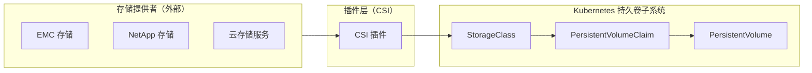
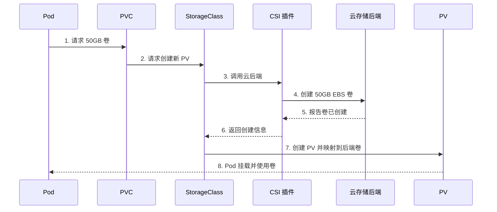
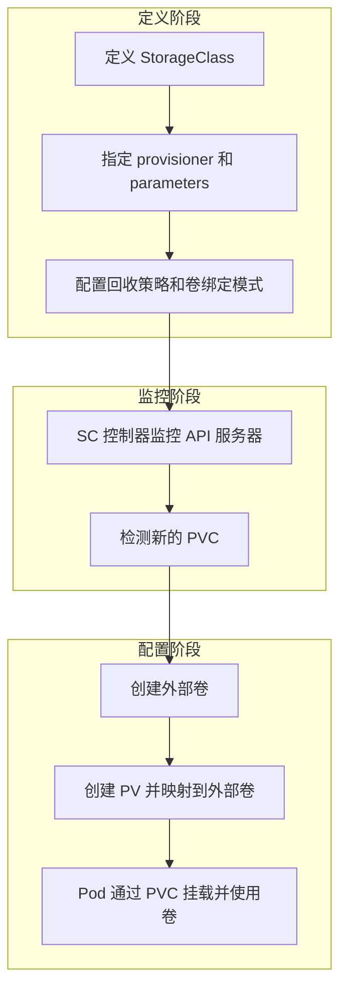
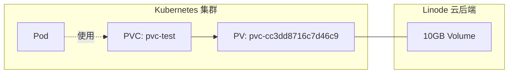
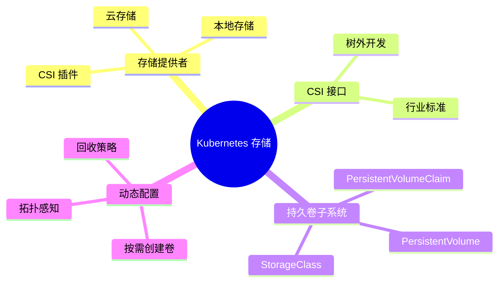

# Kubernetes 存储

存储和检索数据对于大多数实际业务应用至关重要。幸运的是，Kubernetes 提供了一个持久卷子系统，可以轻松连接提供高级数据管理服务（如备份和恢复、复制、快照、加密等）的外部存储系统。

本章分为以下几个部分：

- [[存储概述]]
- [[存储提供者]]
- [[容器存储接口 (CSI)]]
- [[Kubernetes 持久卷子系统]]
- [[使用存储类动态配置]]
- [[实践操作]]
- [[章节总结]]

> [!TIP] 前提条件
> Kubernetes 支持多种外部存储系统，包括来自 EMC、NetApp 等企业级存储系统以及所有主要云提供商的存储服务。

## 存储概述

Kubernetes 支持来自多个不同提供者的多种类型存储。这些存储包括来自外部系统的块存储、文件存储和对象存储，这些外部系统可以位于云端或本地数据中心。

### 架构图



图 11.1 展示了高级架构。

### 存储架构说明

- **左侧**：存储提供者。如前所述，这些是提供高级存储服务的外部系统，可以是本地系统（如 EMC 和 NetApp），也可以是云提供的存储服务。

- **中间**：插件层。这是外部存储系统（左侧）和 Kubernetes（右侧）之间的接口。现代插件使用[[容器存储接口 (CSI)]]，这是一个行业标准的存储接口，适用于 Kubernetes 等容器编排器。

> [!NOTE] CSI 之前的状态
> 在 CSI 之前，我们开发的所有存储插件都作为主 Kubernetes 代码树（树内）的一部分。这迫使它们成为开源，并将插件更新和错误修复与 Kubernetes 发布周期绑定。这对于插件开发者和 Kubernetes 维护者来说都有问题。
> 幸运的是，CSI 插件不需要是开源的，我们可以根据需要随时发布更新。

- **右侧**：图 11.1 的右侧是 Kubernetes 持久卷子系统。这是一组标准化的 API 对象，使应用程序可以轻松使用存储。有越来越多的存储相关 API 对象，但核心对象包括：
  - [[PersistentVolume]] (PV)
  - [[PersistentVolumeClaim]] (PVC)
  - [[StorageClass]] (SC)

> [!INFO] 命名约定
> 在整个章节中，我们会以不同的方式引用这些对象。有时使用 PascalCase 缩写名称——PersistentVolume、PersistentVolumeClaim 和 StorageClass。有时使用其缩写——PV、PVC 和 SC。还有时简称为持久卷和存储类等。

### 卷配置工作流



图 11.2 - 卷配置工作流

工作流程说明：
1. 右侧的 Pod 需要 50GB 卷，通过 PersistentVolumeClaim (PVC) 请求
2. PVC 请求 StorageClass 在 AWS 后端创建新 PV 和关联卷
3. SC 通过 AWS CSI 插件调用 AWS 后端
4. CSI 插件在 AWS 上创建 50GB EBS 卷
5. CSI 插件将外部卷创建报告回 SC
6. SC 创建 PV 并将其映射到 AWS 后端的 EBS 卷
7. Pod 挂载 PV 并使用它

> [!WARNING] 重要限制
> 在深入了解之前，值得注意的是 Kubernetes 有机制防止多个 Pod 写入同一 PV。它还强制外部卷和 PV 之间的一对一映射——您不能将单个 50GB 外部卷映射到 2 个 25GB PV。

## 存储提供者

如前所述，Kubernetes 允许您使用来自各种外部系统的存储。我们通常将这些称为提供者（provider）或配置器（provisioner）。

每个提供者提供自己的 CSI 插件，暴露后端的特性和配置选项。

提供者通常通过 Helm chart 或 YAML 安装程序分发插件。安装后，插件作为一组 Pod 运行在 `kube-system` [[命名空间]]中。

> [!CAUTION] 一些明显的限制适用
> - 例如，如果您的集群在 Microsoft Azure 上，则无法配置和挂载 AWS EBS 卷
> - 本地性限制也可能适用——例如，Pod 可能必须与它们访问的存储位于同一区域或可用区

其他选项（如卷大小、保护级别、快照计划、复制设置、加密配置等）都通过后端的 CSI 插件配置。并非所有后端都支持相同的特性，您有责任阅读插件文档并正确配置它。

## 容器存储接口 (CSI)

[[CSI]] 是一个定义行业标准接口的开源项目，使容器编排器能够以统一的方式利用外部存储资源。例如，它为存储提供者提供文档化的接口。这也意味着 CSI 插件应该可以在任何支持 CSI 的编排平台上工作。

> [!INFO] CSI 插件列表
> 您可以在以下仓库中找到相对最新的 CSI 插件列表。仓库将插件称为驱动：
> https://kubernetes-csi.github.io/docs/drivers.html

大多数云平台会为云的原生存储服务预安装 CSI 插件。对于第三方存储系统，您需要手动安装插件，但如前所述，它们通常以 Helm chart 或来自提供者的 YAML 文件形式提供。安装后，CSI 插件通常作为一组 Pod 运行在 `kube-system` 命名空间中。

## Kubernetes 持久卷子系统

[[持久卷子系统]]是一组 API 对象，允许应用程序请求和访问存储。它包含以下我们将查看和使用的资源：

- [[PersistentVolume]] (PV)
- [[PersistentVolumeClaim]] (PVC)
- [[StorageClass]] (SC)

如前所述，PV 使外部卷在 Kubernetes 上可用。例如，如果您想在集群上使用 50GB AWS 卷，您需要将其映射到 PV。如果 Pod 想使用它，则需要一个授予其访问 PV 权限的 PVC。

SC 允许应用程序动态创建 PV 和后端卷。

### 多层存储示例

假设您有一个外部存储系统，具有以下存储层级：

| 外部层级 | Kubernetes StorageClass | CSI 插件 |
|---------|------------------------|---------|
| 快速块（闪存） | sc-fast-block | csi.xyz.block |
| 快速加密块（闪存） | sc-fast-encrypted | csi.xyz.block |
| 慢速块（机械） | sc-slow | csi.xyz.block |
| 文件（NFS） | sc-file | csi.xyz.file |

假设您被要求部署一个需要 100GB 快速加密块存储的新应用程序。您需要创建一个 YAML 文件，定义一个引用请求从 `sc-fast-encrypted` 存储类获取 100GB 卷的 PVC 的 Pod。

通过将 YAML 文件发送到 API 服务器来部署应用。SC 控制器观察新的 PVC，并指示 CSI 插件在外部存储系统上配置 100GB 加密闪存存储。外部系统创建卷并将结果报告回 CSI 插件，然后 CSI 插件通知 SC 控制器，该控制器将其映射到新的 PV。Pod 使用 PVC 挂载并使用 PV。

## 使用存储类动态配置

[[StorageClass]] 是 `storage.k8s.io/v1` API 组中的资源。资源类型是 `StorageClass`，您可以在常规 YAML 文件中定义它们。使用 kubectl 时可以使用 `sc` 短名称。

> [!TIP] 查看 API 资源
> 您可以运行 `kubectl api-resources` 命令查看完整的 API 资源列表及其短名称。它还显示每个资源的 API 组及其等效的 kind。

顾名思义，StorageClass 允许您定义应用可以请求的不同存储类别。您如何定义类别取决于您可用的存储类型。例如，您的云可能提供以下四种类型的存储：
- 快速块（SSD）
- 快速加密块（SSD）
- 慢速块（机械）
- 文件（NFS）

### StorageClass YAML 示例

以下 YAML 对象定义了一个名为 `fast-local` 的 StorageClass，它从爱尔兰 AWS 区域配置具有 10 IOPS/GB 性能的加密 SSD 卷。

```yaml
kind: StorageClass
apiVersion: storage.k8s.io/v1
metadata:
  name: fast-local
provisioner: ebs.csi.aws.com
parameters:
  encrypted: true           # 创建加密卷
  type: io1                 # AWS SSD 驱动器
  iopsPerGB: "10"           # 性能要求
allowedTopologies:          # 配置卷的位置
- matchLabelExpressions:
  - key: topology.ebs.csi.aws.com/zone
    values:
    - eu-west-1a           # 爱尔兰 AWS 区域
```

与所有 Kubernetes YAML 文件一样，`kind` 和 `apiVersion` 告诉 Kubernetes 您定义的对象的类型和版本。`metadata.name` 是一个任意字符串，给对象一个友好的名称，`provisioner` 字段告诉 Kubernetes 使用哪个 CSI 插件——您需要已安装该插件。`parameters` 块定义要配置的存储类型，`allowedTopologies` 属性允许您指定副本应放置的位置。

> [!IMPORTANT] 重要注意事项
> 1. **存储类是不可变的** — 一旦部署，就无法修改
> 2. `metadata.name` 应该是有意义的，因为它是您和其他对象引用该类的方式
> 3. 我们有时会交替使用术语配置器、插件和驱动
> 4. `parameters` 块用于插件特定的值，每个插件都不同

大多数存储系统都有自己的特性，您有责任阅读插件文档并进行正确配置。

### 使用 StorageClass 的工作流程

使用 StorageClass 部署和使用存储的基本工作流程如下：

1. 安装并配置 CSI 插件
2. 创建一个或多个 StorageClass
3. 部署具有通过 StorageClass 请求卷的 PVC 的 Pod

该列表假设您有一个连接到 Kubernetes 集群的外部存储系统。大多数托管 Kubernetes 服务会预安装云的原生存储后端的 CSI 驱动，使它们更容易使用。

### 综合 YAML 示例

以下 YAML 代码段定义了一个 Pod、一个 PVC 和一个 SC。您可以通过用三个破折号（`---`）分隔来在同一 YAML 文件中定义所有三个对象。

```yaml
apiVersion: v1
kind: Pod                             # 1. Pod
metadata:
  name: mypod
spec:
  volumes:
    - name: data
      persistentVolumeClaim:
        claimName: mypvc              # 2. 通过 PVC 请求卷
  containers:
  ...
---
apiVersion: v1
kind: PersistentVolumeClaim
metadata:
  name: mypvc                         # 3. 这是 "mypvc" PVC
spec:
  accessModes:
  - ReadWriteOnce
  resources:
    requests:
      storage: 50Gi                   # 4. 配置 50Gi 卷
  storageClassName: fast              # 5. 通过 "fast" SC 配置
---
kind: StorageClass
apiVersion: storage.k8s.io/v1
metadata:
  name: fast                          # 6. 这是 "fast" SC
provisioner: pd.csi.storage.gke.io    # 7. 使用此 CSI 插件
parameters:
  type: pd-ssd                        # 8. 配置此类型的存储
```

工作流程步骤说明：
1. 一个普通的 Pod 对象
2. Pod 通过 mypvc PVC 请求卷
3. 文件定义了一个名为 mypvc 的 PVC
4. PVC 配置一个 50Gi 卷
5. 卷将通过 fast StorageClass 配置
6. 文件定义 fast StorageClass
7. StorageClass 通过 pd.csi.storage.gke.io CSI 插件配置卷
8. CSI 插件将从 Google Cloud 存储后端配置快速（pd-ssd）存储

### 其他卷设置

StorageClass 提供了多种方法来控制卷的配置和管理。我们将介绍以下内容：

- [[访问模式]]
- [[回收策略]]

#### 访问模式

Kubernetes 支持三种卷访问模式：

| 模式 | 缩写 | 说明 |
|-----|------|------|
| ReadWriteOnce | RWO | 允许单个 PVC 以读写 (R/W) 模式绑定到卷。多个 PVC 绑定尝试将失败 |
| ReadWriteMany | RWM | 允许多个 PVC 以读写 (R/W) 模式绑定到卷。文件和对象存储通常支持此模式，而块存储通常不支持 |
| ReadOnlyMany | ROM | 允许多个 PVC 以只读 (R/O) 模式绑定到卷 |

> [!WARNING] 模式限制
> 重要的是要知道 PV 只能以一种模式打开。例如，您不能将单个 PV 绑定到一个 PVC（ROM 模式）和另一个 PVC（RWM 模式）。

#### 回收策略

[[ReclaimPolicy]] 告诉 Kubernetes 在释放 PVC 后对 PV 和关联的外部存储执行什么操作。当前存在两种策略：

| 策略 | 说明 | 风险 |
|-----|------|------|
| Delete | 最危险，对于通过 StorageClass 动态创建的 PV 是默认值。释放 PVC 时删除 PV 和关联的外部存储。这意味着删除 PVC 将删除 PV 和外部存储 | ⚠️ 高风险 |
| Retain | 删除 PVC 后保留 PV 和外部存储。这是更安全的选项，但您必须手动回收资源 | ✅ 更安全 |

### StorageClass 总结



[[StorageClass]] (SC) 代表存储层级，应用程序调用它们来动态创建卷。您在常规 YAML 文件中定义它们，这些文件引用一个插件并将它们绑定到特定外部存储系统上的特定类型存储。例如，一个 SC 可能在 AWS Mumbai 区域配置高性能 AWS SSD 存储，而另一个可能从不同的 AWS 区域配置慢速 AWS 存储。

部署后，SC 控制器监控 API 服务器以查找引用 SC 的新 PVC。每次创建与 SC 匹配的 PVC 时，SC 会在外部存储系统上动态创建所需卷，并将其映射到应用可以挂载和使用的 PV。

## 实践操作

本节引导您完成通过 StorageClass 动态配置卷的过程。演示分为以下几个部分：

- 使用现有的 StorageClass
- 创建并使用新的 StorageClass

> [!NOTE] 云环境限制
> 演示全部基于 Linode Kubernetes Engine (LKE)，不会在其他云上工作。这是因为每个云和每个存储提供者都有自己的 CSI 插件，具有自己的配置选项，我没有空间在本书中包含所有这些。但是，您可以轻松构建一个 LKE 集群来跟随学习，即使只是阅读，您仍然会学到很多。

本节的其余部分假设您已经克隆了本书的 GitHub 仓库并且正在 `2025` 分支上工作。它还假设您已连接到 LKE 集群。如果需要构建集群，请参阅第 3 章。

```bash
$ git clone https://github.com/nigelpoulton/TKB.git
<Snip>
$ cd TKB
$ git fetch origin
$ git checkout -b 2025 origin/2025
$ cd storage
```

### 使用现有的 StorageClass

运行以下命令查看集群上预安装的存储类。大多数 Kubernetes 环境至少会预创建一个存储类。

```bash
$ kubectl get sc
NAME                          PROVISIONER               RECLAIM POLICY
linode-blck-stg               linodebs.csi.linode.com   Delete
linode-blck-stg-retain (def)  linodebs.csi.linode.com   Retain
```

输出说明：
- LKE 集群有两个预创建的存储类
- 两者都通过 `linodebs.csi.linode.com` CSI 插件（PROVISIONER）配置卷
- 两者都使用 Immediate 卷绑定模式
- 一个使用 Delete 回收策略，另一个使用 Retain

> [!INFO] 默认存储类
> 第二行的 `linode-block-storage-retain (default)` 类是默认类，这意味着您的 PVC 将使用此类别，除非您指定不同的类别。您应该为重要的生产应用指定存储类，因为默认类可能因集群而异。

以下输出来自 Google Kubernetes Engine 上的 Autopilot 区域集群。它显示八个类，其中五个使用 `filestore.csi.storage.gke.io` 插件访问 Google Cloud 的基于 NFS 的 Filestore 存储，两个使用 `pd.csi.storage.gke.io` 插件访问 Google Cloud 的块存储，一个使用旧的树内 `kubernetes.io/gce-pd` 插件（非 CSI）。

```bash
$ kubectl get sc
NAME                 PROVISIONER                    RECLAIM POLICY  VOL
enterprise-multi..   filestore.csi.storage.gke.io   Delete          Wai
enterprise-rwx       filestore.csi.storage.gke.io   Delete          Wai
premium-rwo          pd.csi.storage.gke.io          Delete          Wai
premium-rwx          filestore.csi.storage.gke.io   Delete          Wai
standard             kubernetes.io/gce-pd          Delete          Imm
standard-rwo (def)   pd.csi.storage.gke.io          Delete          Wai
standard-rwx         filestore.csi.storage.gke.io   Delete          Wai
zonal-rwx            filestore.csi.storage.gke.io   Delete          Wai
```

运行以下命令查看 `linode-block-storage` 类的详细详细信息。

```bash
$ kubectl describe sc linode-block-storage
Name:                  linode-block-storage
IsDefaultClass:        No
Annotations:           lke.linode.com/caplke-version=v1.31.5-2025
Provisioner:           linodebs.csi.linode.com
Parameters:            <none>
AllowVolumeExpansion:  True
MountOptions:          <none>
ReclaimPolicy:         Delete
VolumeBindingMode:     Immediate
Events:                <none>
```

> [!IMPORTANT] Delete 回收策略的风险
> 这个工作流的重要之处在于它使用 Delete 回收策略。这意味着 Kubernetes 将在您停止使用 PVC 时自动删除 PV 和关联的后端卷。您将很快看到这一点。

列出所有现有的 PV 和 PVC，以便轻松识别您将要创建的那些。

```bash
$ kubectl get pv
No resources found
$ kubectl get pvc
No resources found in default namespace.
```

以下 YAML 来自仓库 `storage` 文件夹中的 `lke-pvc-test.yml` 文件。它描述了一个名为 `pvc-test` 的 PVC，通过 `linode-block-storage` 存储类配置 10GB 卷。

```yaml
apiVersion: v1
kind: PersistentVolumeClaim
metadata:
  name: pvc-test
spec:
  accessModes:
  - ReadWriteOnce
  storageClassName: linode-block-storage
  resources:
    requests:
      storage: 10Gi
```

运行以下命令创建 PVC。请务必从 storage 文件夹运行它，只有在您有带有 `linode-block-storage` 存储类的 LKE 集群时才能正常工作。

```bash
$ kubectl apply -f lke-pvc-test.yml
persistentvolumeclaim/pvc-test created
```

运行以下命令查看 PVC。

```bash
$ kubectl get pvc
NAME       STATUS   VOLUME                 CAPACITY   ACCESS MODES   STORAGECLASS
pvc-test   Bound    pvc-cc3dd8716c7d46c9   10Gi       RWO            linode-block-storage
```

Kubernetes 已创建 PVC 并已将其绑定到卷。这是因为 `linode-block-storage` SC 使用 Immediate 卷绑定模式，自动创建 PV 和后端存储，而无需等待 Pod 声明它。

运行以下命令查看 PV。

```bash
$ kubectl get pv
NAME                   CAPACITY   ACCESS MODES   RECLAIM POLICY   STATUS   CLAIM
pvc-cc3dd8716c7d46c9   10Gi       RWO            Delete          Bound    pvc-test
```

PV 也存在并绑定到 `pvc-test` 声明。这意味着卷也应该存在于 Linode 云上。

打开您的 LKE 仪表板（cloud.linode.com）并导航到 Volumes 选项卡，确认您有一个 10GB 卷，其名称与您的 PVC 相同，位于与 LKE 集群相同的区域。

> [!SUCCESS] 恭喜
> 您已成功通过集群内置 SC 配置了外部卷。



图 11.3 - 一切都如何映射

唯一缺少的是右侧使用 PVC 访问 PV 的 Pod。您将在接下来的部分中看到这一点。

> [!TIP] WaitForFirstConsumer 模式
> 如果您将存储类配置为 `VolumeBindingMode` 设置为 `WaitForFirstConsumer`，则存储类不会创建 PV 或后端卷，直到您部署使用它们的 Pod。

运行以下命令删除 PVC。

```bash
$ kubectl delete pvc pvc-test
persistentvolumeclaim "pvc-test" deleted
```

删除 PVC 也会删除 PV 和关联的 LKE 后端卷。这是因为存储类使用 Delete 的 ReclaimPolicy 创建它们。完成以下步骤来验证这一点。

```bash
$ kubectl get pv
No resources found
```

转到 LKE 控制台的 Volumes 选项卡，验证后端卷已消失。

### 创建并使用新的 StorageClass

在本节中，您将创建一个实现拓扑感知配置的新 StorageClass。这是存储类延迟卷创建直到 Pod 请求它的方式。这确保存储类在与 Pod 相同的区域和可用区中创建卷。

您将创建在本书 GitHub 仓库的 `storage` 文件夹中的 `lke-sc-wait-keep.yml` 文件中定义的存储类。它定义了一个名为 `block-wait-keep` 的存储类，具有以下属性：

- 块存储
- 拓扑感知配置（`volumeBindingMode: WaitForFirstConsumer`）
- 删除 PVC 时保留卷和数据（`reclaimPolicy: Retain`）

> [!INFO] 拓扑感知配置
> 您有时会看到拓扑感知配置被称为按需配置。

```yaml
apiVersion: storage.k8s.io/v1
kind: StorageClass
metadata:
  name: block-wait-keep
provisioner: linodebs.csi.linode.com       # CSI 插件
allowVolumeExpansion: true
volumeBindingMode: WaitForFirstConsumer    # 按需配置
reclaimPolicy: Retain                      # 删除 PVC 时保留卷
```

部署 SC 并验证它存在。

```bash
$ kubectl apply -f lke-sc-wait-keep.yml
storageclass.storage.k8s.io/block-wait-keep created

$ kubectl get sc
NAME                          PROVISIONER               RECLAIM POLICY  VOLUME
block-wait-keep               linodebs.csi.linode.com   Retain          WaitForFirst...
linode-blck-stg               linodebs.csi.linode.com   Delete          Immediate
linode-blck-stg-retain (def)  linodebs.csi.linode.com   Retain          Immediate
```

创建存储类后，您可以部署 `lke-pvc-wait-keep.yml` 文件中定义的 PVC。如您所见，它定义了一个名为 `pvc-wait-keep` 的 PVC，从 `block-wait-keep` SC 请求 20GB 卷。

```yaml
apiVersion: v1
kind: PersistentVolumeClaim
metadata:
  name: pvc-wait-keep
spec:
  accessModes:
  - ReadWriteOnce
  resources:
    requests:
      storage: 20Gi
  storageClassName: block-wait-keep
```

使用以下命令部署它。

```bash
$ kubectl apply -f lke-pvc-wait-keep.yml
persistentvolumeclaim "pvc-wait-keep" created
```

确认 Kubernetes 创建了它，并检查它是否已创建 PV。

```bash
$ kubectl get pvc
NAME            STATUS    VOLUME   CAPACITY   ACCESS MODES   STORAGECLASS
pvc-wait-keep   Pending                              20Gi       RWO            block-wait-keep

$ kubectl get pv
No resources found
```

> [!INFO] Pending 状态说明
> PVC 处于 Pending 状态，存储类尚未创建 PV。这是因为 PVC 使用了 `WaitForFirstConsumer` 卷绑定模式的存储类，该模式通过等待 Pod 引用 PVC 来实现拓扑感知配置，然后才在 LKE 上创建 PV 和后端卷。

以下 YAML 定义了一个名为 `volpod` 的 Pod，它使用您刚刚创建的 `pvc-wait-keep` PVC。它来自 `lke-app.yml` 文件。

```yaml
apiVersion: v1
kind: Pod
metadata:
  name: volpod
spec:
  volumes:                           # 创建名为 "data" 的卷
  - name: data
    persistentVolumeClaim:
      claimName: pvc-wait-keep       # 从名为 "pvc-wait-keep" 的 PVC
  containers:
  - name: ubuntu-ctr
    image: ubuntu:latest
    command:
    - /bin/bash
    - "-c"
    - "sleep 60m"
    volumeMounts:                    # 将 "data" 卷挂载到 /tkb
    - name: data
      mountPath: /tkb
```

部署 Pod，然后确认存储类创建了 PV。

```bash
$ kubectl apply -f lke-app.yml
pod/volpod created

$ kubectl get pvc
NAME            STATUS   VOLUME                 CAPACITY   ACCESS MODES   STORAGECLASS
pvc-wait-keep   Bound    pvc-279f09e083254fa9   20Gi       RWO            block-wait-keep

$ kubectl get pv
NAME                   CAPACITY   ACCESS MODES   RECLAIM POLICY   STATUS   CLAIM
pvc-279f09e083254fa9   20Gi       RWO            Retain          Bound    pvc-wait-keep
```

PVC 绑定到一个卷，PV 存在且名称相同，所有设置都符合预期——容量、回收策略和存储类。

运行以下命令确认 Pod 正在声明并挂载卷。

```bash
$ kubectl describe pod volpod
Name:             volpod
Namespace:        default
Node:             lke340882-541526-0198b5d80000/192.168.145.142
Status:           Running
IP:               10.2.1.3

Containers:
  ubuntu-ctr:
    Mounts:
      /tkb from data (rw)

Volumes:
  data:
    Type:       PersistentVolumeClaim (a reference to a PVC...)
    ClaimName:  pvc-wait-keep
    ReadOnly:   false
```

### 刚刚发生的事情总结

1. 创建了一个名为 `block-wait-keep` 的新 StorageClass，从 Linode 云配置块存储
2. StorageClass 控制器开始监控 API 服务器以查找引用您的 `block-wait-keep` 类的新 PVC
3. 创建了一个引用该类的 PVC，但由于卷绑定模式设置为 `WaitForFirstConsumer`，它没有创建卷
4. 部署了使用 PVC 请求新 20GB 卷的 Pod
5. SC 控制器观察到这一点，并在 Linode 云上动态创建了 PV 和外部卷

> [!SUCCESS] 恭喜
> 您已创建了自己的 StorageClass，通过延迟创建 PV 直到 Pod 引用 PVC 来实现拓扑感知配置。这确保 Kubernetes 在与 Pod 相同的区域和可用区中创建卷。

### 清理

您需要做五件事来清理环境：

1. 删除使用 PVC 的 Pod
2. 删除 PVC
3. 删除 PV
4. 手动从 Linode 云后端删除卷
5. 删除 SC

删除 Pod。操作可能需要几秒钟才能完成。

```bash
$ kubectl delete pod volpod
pod "volpod" deleted
```

删除 PVC。

```bash
$ kubectl delete pvc pvc-wait-keep
persistentvolumeclaim "pvc-wait-keep" deleted
```

> [!WARNING] Retain 策略的行为
> 即使您已删除 Pod 和 PVC，Kubernetes 也没有删除 PV 或外部卷，因为存储类使用 Retain 回收策略创建它们。这意味着您必须手动删除它们。

运行以下命令删除 PV。您的将有不同的名称。

```bash
$ kubectl delete pv pvc-279f09e083254fa9
persistentvolume "pvc-279f09e083254fa9" deleted
```

打开 Linode 云控制台，从 Volumes 选项卡删除卷。务必删除与您刚刚删除的 PV 同名的卷！它将在 Attached to 列中显示为"unattached"。不删除卷会产生不必要的 Linode 费用。

最后，删除存储类。

```bash
$ kubectl delete sc block-wait-keep
storageclass.storage.k8s.io "block-wait-keep" deleted
```

## 章节总结



本章中，您了解到 Kubernetes 有一个强大的存储子系统，使应用程序能够从各种外部提供者动态配置和使用存储。

每个外部提供者都有自己的 CSI 插件，用于创建卷并在 Kubernetes 中呈现它们。大多数托管 Kubernetes 集群会预安装作为 Pod 在 `kube-system` 命名空间中运行的 CSI 插件。

安装 CSI 插件后，您创建映射到外部系统上特定类型存储的 [[StorageClass]]。StorageClass 控制器作为控制平面上的后台协调循环运行，监控 API 服务器以查找新的 PVC。每当它看到一个时，它就在外部系统上创建请求的卷，并将其映射到 Kubernetes 上的新 [[PersistentVolume]]。

然后 Pod 可以使用 [[PersistentVolumeClaim]] 来声明并挂载卷。