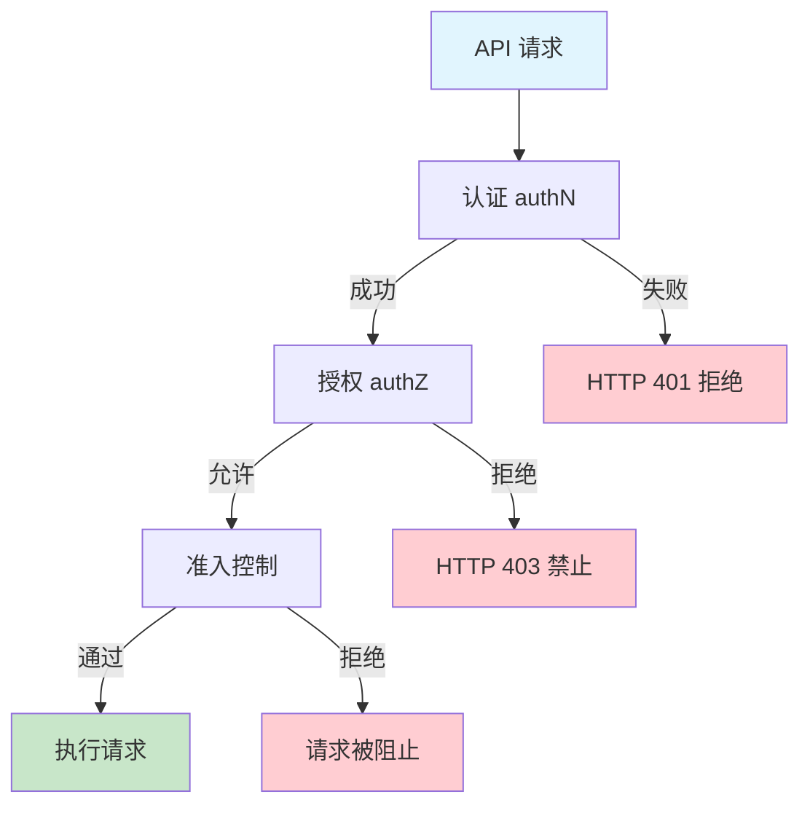
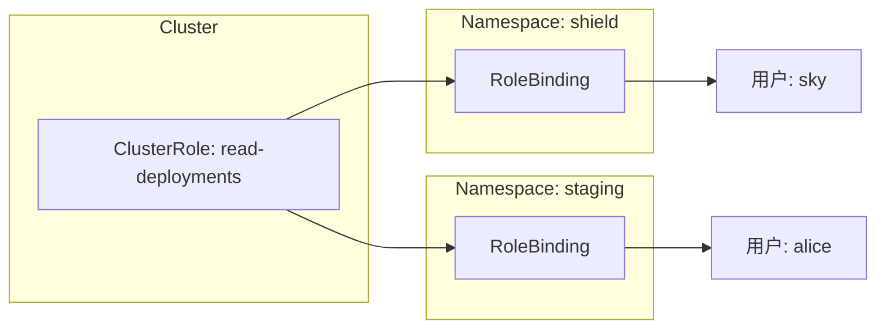
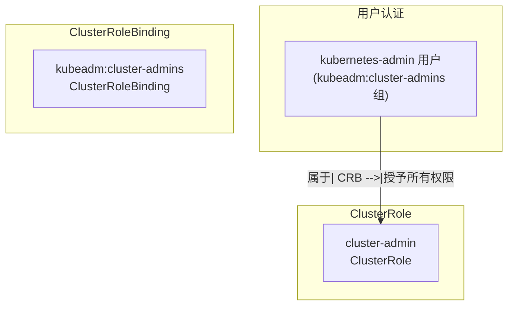
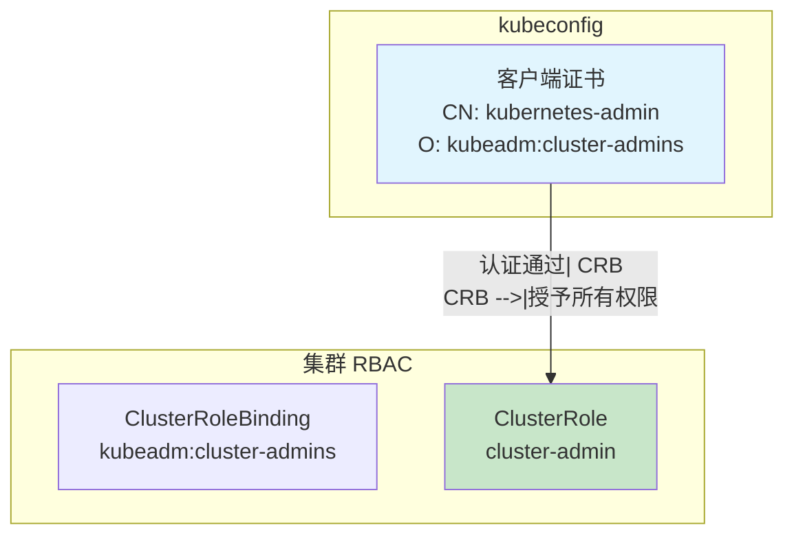

# 14: API 安全与 RBAC

Kubernetes 是以 API 为核心的系统，所有操作都通过 API Server 提供服务。在本章中，你将跟随一个典型的 API 请求，了解它如何通过各种安全检查。

> [!TIP] 章节结构
> - API 安全总览
> - 认证
> - 授权 (RBAC)
> - 准入控制

> [!INFO] 延伸阅读
> 有关 API 设计和结构的深入探讨，请参见第 15 章。

---

## API 安全总览

以下所有对象都会对 API Server 发起 CRUD 类型的请求（创建、读取、更新、删除）：

- [[kubectl]] 操作员和开发人员
- [[Pod]]s
- [[Kubelet]]s
- 控制平面服务
- Kubernetes 原生应用

图 14.1 展示了一个典型的 API 请求通过标准检查的流程。无论请求来自哪里，流程都是相同的。authN 是认证（authentication）的缩写，authZ 是授权（authorization）的缩写。



让我们通过一个快速示例来理解：一位名为 `grant-ward` 的用户尝试在 `terran` [[Namespace]] 中创建一个名为 `hive` 的 [[Deployment]]。

`grant-ward` 用户使用 `kubectl apply` 命令将 YAML 文件发送到 Kubernetes，以在 `terran` Namespace 中创建 Deployment。`kubectl` 命令行工具生成一个带有用户凭证的请求到 API Server。`kubectl` 和 API Server 之间的连接通过 TLS 保护。一旦请求到达 API Server，认证模块会确定请求是否真正来自 `grant-ward` 还是冒充者。假设确认是 `grant-ward`，授权模块会确定 `grant-ward` 是否有权在 `terran` Namespace 中创建 Deployments。如果请求通过认证和授权，准入控制器会确保 Deployment 对象符合策略要求。只有在通过认证、授权和准入控制检查后，请求才会被执行。

这个过程类似于乘坐商业航班。你前往机场并用照片身份证件（通常是护照）进行身份认证。假设你通过了护照认证，系统会检查你是否购买了座位，因此有权登机。如果你通过了认证并获准登机，准入控制可能会检查并应用航空公司的政策，比如限制手提行李、禁止在机舱内携带酒精和武器。在所有这些之后，你终于可以坐下飞往目的地了。

让我们详细了解认证机制。

---

## 认证 (Authentication)

[[认证]]是关于证明你的身份。你可能会看到它被缩短为 authN。

凭证是认证的核心，所有对 API Server 的请求都包含凭证。认证层的职责是验证这些凭证。如果验证失败，API Server 返回 HTTP 401 并拒绝请求。如果请求通过认证，它会进入授权阶段。

> [!INFO] Kubernetes 认证架构
> Kubernetes 认证层是可插拔的，支持多种认证模块。

流行的认证模块包括：

- [[客户端证书]] (Client Certificates)
- [[Webhook]] 回调
- 外部身份管理系统集成，如 [[Active Directory]] (AD) 和云身份访问管理 ([[IAM]]) 系统

实际上，Kubernetes 没有自己的内置身份数据库。相反，它强制你使用外部系统。这避免了创建另一个身份管理孤岛。

开箱即用，大多数 Kubernetes 集群支持客户端证书，但在现实世界中，你需要与选定的云或企业身份管理系统集成。许多托管的 Kubernetes 服务会自动与底层云的身份管理系统集成。在这种情况下，Kubernetes 会将认证委托给外部系统。

### 检查当前认证配置

集群详情和用户凭证存储在 [[kubeconfig]] 文件中。`kubectl` 等工具读取此文件来确定将命令发送到哪个集群以及使用哪些凭证。该文件名为 `config`，位于以下位置：

- **Windows**: `C:\Users\<user>\.kube\config`
- **Linux/Mac**: `/home/<user>/.kube/config`

以下是 kubeconfig 文件的内容示例：

```yaml
apiVersion: v1
kind: Config
clusters:                        # 定义集群的块
- cluster:                  
    name: prod-shield              # 集群的友好名称
    server: https://<api-server-url>:443     # API Server 地址
    certificate-authority-data: LS0tLS1C...LS0tCg==           # CA 公钥
users:                          # 定义用户的块
- name: njfury                   # 名为 njfury 的用户
  user:
    as-user-extra: {}
    token: eyJhbGciOiJSUzI1NiIsImtpZCI6IlZwMzl...SZY3uUQ     # 认证令牌
contexts:                        # 上下文块。上下文是用户和集群的配对
- context:
    name: shield-admin             # 定义一个名为 shield-admin 的上下文
    cluster: prod-shield         # 关联的集群
    user: njfury                 # 关联的用户
    namespace: default
current-context: shield-admin    # kubectl 使用的当前上下文
```

如果你仔细观察，你会发现它有四个顶级部分：

1. **clusters** - 定义一个或多个 Kubernetes 集群
2. **users** - 定义一个或多个用户
3. **contexts** - 用户和集群对的列表
4. **current-context** - kubectl 命令使用的集群和用户

> [!NOTE] 各部分详解
> - **clusters 部分**：定义一个或多个 Kubernetes 集群，每个都有友好名称、API Server 端点和证书颁发机构 (CA) 的公钥
> - **users 部分**：定义一个或多个用户，每个用户需要一个名称和令牌。令牌通常是集群 CA 签署的 X.509 证书（或集群信任的 CA 签署的证书）
> - **contexts 部分**：用户和集群对的列表，current-context 是 kubectl 命令使用的集群和用户组合

以下 YAML 代码段来自同一个 kubeconfig 文件，它会将所有请求发送到 `prod-shield` 集群，作为 `njfury` 用户：

```yaml
current-context: shield-admin    # 当前上下文
contexts:                        
- context:
    name: shield-admin             # 定义一个名为 shield-admin 的上下文
    cluster: prod-shield         # 发送命令到此集群
    user: njfury                 # 作为此用户进行认证
    namespace: default
```

集群的认证模块负责确定用户是否确实是 `njfury`。如果你的集群与外部 IAM 系统集成，它会将认证委托给该系统。

假设认证成功，请求进入授权阶段。

---

## 授权 (RBAC)

[[授权]]发生在成功认证之后，你有时会看到它被缩短为 authZ。

Kubernetes 授权也是可插拔的，你可以在单个集群上运行多个 authZ 模块。然而，大多数集群使用 [[RBAC]]。此外，如果你的集群有多个授权模块，一旦任何模块授权了请求，它会跳过所有其他 authZ 模块，立即进入准入控制。

> [!TIP] 本节涵盖内容
> - RBAC 概述
> - 用户和权限
> - 集群级用户和权限
> - 预配置用户和权限

### RBAC 概述

最常见的授权模块是 RBAC（基于角色的访问控制）。在最高层面，RBAC 涉及三个要素：

1. **用户** (Users)
2. **动作** (Actions)
3. **资源** (Resources)

即：哪些用户可以对哪些资源执行哪些动作。

下表展示了一些示例：

| 用户 (主体) | 动作 | 资源 | 效果 |
|------------|------|------|------|
| Bao | create | Pods | Bao 可以创建 Pods |
| Kalila | list | Deployments | Kalila 可以列出 Deployments |
| Josh | delete | ServiceAccounts | Josh 可以删除 ServiceAccounts |

> [!IMPORTANT] RBAC 安全模型
> RBAC 在大多数 Kubernetes 集群上启用，是一个最小特权、默认拒绝的系统。这意味着它会锁定所有内容，你需要创建允许规则来开放权限。事实上，Kubernetes 不支持拒绝规则——只支持允许规则。这看起来是小事，但它使实现和故障排除更加简单。

### 用户与权限

理解 Kubernetes RBAC 有两个关键概念：

- **[[Role]]s** - 定义一组权限
- **[[RoleBinding]]s** - 将权限绑定到用户

以下资源清单定义了一个 Role 对象。它名为 `read-deployments`，授予了对 `shield` Namespace 中 [[Deployment]] 对象的 `get`、`watch` 和 `list` 权限。

```yaml
apiVersion: rbac.authorization.k8s.io/v1
kind: Role
metadata:
  namespace: shield
  name: read-deployments
rules:
- verbs: ["get", "watch", "list"]   # 允许的动作
  apiGroups: ["apps"]                # 
  resources: ["deployments"]         # 对这类资源的操作
```

但是，Role 在绑定到用户之前不会生效。

以下 RoleBinding 将之前的 `read-deployments` Role 绑定到一个名为 `sky` 的用户：

```yaml
apiVersion: rbac.authorization.k8s.io/v1
kind: RoleBinding
metadata:
  name: read-deployments
  namespace: shield
subjects:
- kind: User
  name: sky                   # 已认证用户的名称
  apiGroup: rbac.authorization.k8s.io
roleRef:
  kind: Role
  name: read-deployments      # 将此 Role 绑定到认证用户
  apiGroup: rbac.authorization.k8s.io
```

将两个对象部署到集群后，名为 `sky` 的已认证用户将能够运行诸如 `kubectl get deployments -n shield` 等命令。

> [!NOTE] 用户名匹配
> RoleBinding 中列出的用户名必须是一个字符串，并且必须与已认证用户匹配。

#### 深入了解 rules

Role 对象有一个 `rules` 部分，定义以下三个属性：

- **verbs** - 允许的动作
- **apiGroups** - API 组
- **resources** - 资源类型

它们共同定义了允许对哪些对象执行哪些操作。

`verbs` 字段列出允许的动作，而 `apiGroups` 和 `resources` 字段标识允许执行动作的对象。以下来自之前 Role 对象的代码段允许对 Deployment 对象进行读取访问（`get`、`watch` 和 `list`）。

```yaml
rules:
- verbs: ["get", "watch", "list"]
  apiGroups: ["apps"] 
  resources: ["deployments"]
```

下表展示了一些可能的 apiGroup 和 resources 组合：

| apiGroup | resource | Kubernetes API 路径 |
|----------|----------|---------------------|
| "" | pods | /api/v1/namespaces/{namespace}/pods |
| "" | secrets | /api/v1/namespaces/{namespace}/secrets |
| "storage.k8s.io" | storageclass | /apis/storage.k8s.io/v1/storageclasses |
| "apps" | deployments | /apis/apps/v1/namespaces/{namespace}/deployments |

> [!INFO] 核心 API 组
> apiGroups 字段中的空双引号 (`""`) 表示核心 (core) API 组。你需要将所有其他 API 组指定为双引号括起的字符串。

下表列出了 Kubernetes 支持的完整动词集。它通过将动词映射到标准 HTTP 方法和 HTTP 响应代码来展示 Kubernetes API 的 REST 特性。

| Kubernetes 动词 | HTTP 方法 | 常见响应 |
|-----------------|-----------|---------|
| create | POST | 201 created, 403 Access Denied |
| get, list, watch | GET | 200 OK, 403 Access Denied |
| update | PUT | 200 OK, 403 Access Denied |
| patch | PATCH | 200 OK, 403 Access Denied |
| delete | DELETE | 200 OK, 403 Access Denied |

运行以下命令可以显示所有 API 资源和支持的动词。在构建规则定义时，这个输出很有用：

```bash
$ kubectl api-resources --sort-by name -o wide
NAME          APIGROUP           KIND        VERBS
deployments   apps               Deployment  [create delete ... get list watch]
ingresses     networking.k8s.io  Ingress     [create delete ... get list watch]
pods                             Pod         [create delete ... get list watch]
secrets                          Secret      [create delete ... get list watch]
services                         Service     [create delete get list watch patch update]
...
```

> [!TIP] 使用通配符
> 在构建规则时，你可以使用星号 (`*`) 来引用所有 API 组、所有资源和所有动词。例如，以下 Role 对象授予对所有 API 组中所有资源的所有操作权限。这只是演示用途，你可能不应该创建这样的规则。

```yaml
apiVersion: rbac.authorization.k8s.io/v1
kind: Role
metadata:
  namespace: shield
  name: read-deployments
rules:
- verbs: ["*"]       # 所有动作
  resources: ["*"]   # 所有资源
  apiGroups: ["*"]   # 所有 API 组
```

### 集群级用户和权限

到目前为止，你已经了解了 [[Role]] 和 [[RoleBinding]]。然而，Kubernetes 实际上有四种 RBAC 对象：

- [[Role]]s
- [[RoleBinding]]s
- [[ClusterRole]]s
- [[ClusterRoleBinding]]s

Role 和 RoleBinding 是命名空间范围的对象，意味着你可以将它们应用到特定的 Namespace。而 ClusterRole 和 ClusterRoleBinding 是集群范围的对象，适用于所有 Namespace。它们都在同一个 API 子组中定义，YAML 结构几乎相同。

一个强大的模式是：在集群级别定义 ClusterRole，然后使用 RoleBinding 将它们绑定到多个特定的 Namespace。这让你可以定义一次通用角色，并在所需的任意多个 Namespace 中重复使用它们。

图 14.2 展示了一个单一的 ClusterRole 通过两个独立的 RoleBinding 应用到两个 Namespace。



以下 YAML 定义了之前相同的 `read-deployments` 角色。但这次它是一个 ClusterRole，意味着你可以使用 RoleBinding 将其应用到所需的多个 Namespace——每个 Namespace 一个 RoleBinding。

```yaml
apiVersion: rbac.authorization.k8s.io/v1
kind: ClusterRole                   # 集群范围的 Role
metadata:
  name: read-deployments
rules:
- verbs: ["get", "watch", "list"]
  apiGroups: ["apps"] 
  resources: ["deployments"]
```

> [!NOTE] YAML 差异
> 如果你仔细观察 YAML，唯一的区别是这个的 `kind` 属性设置为 `ClusterRole`，并且没有 `metadata.namespace` 属性。

### 实际示例

让我们看一个现实世界的例子。

大多数 Kubernetes 集群都有一组预创建的角色和绑定来帮助初始配置和入门。以下示例引导你了解 Docker Desktop 内置的多节点 Kubernetes 集群如何使用 ClusterRoles 和 ClusterRoleBindings 向 kubeconfig 文件中配置的用户授予集群管理员权限。

> [!INFO] 跟随练习
> 如果你使用的是 Docker Desktop 的内置多节点 Kubernetes 集群，可以跟着操作。我们之前在第 3 章展示了如何构建它。其他集群的做法可能略有不同，但原则类似。

Docker Desktop 自动配置你的 kubeconfig 文件，其中包含一个定义 admin 用户的客户端证书。该证书由集群内置 CA 签署，意味着集群会信任其凭证。

运行以下命令查看 Docker Desktop 用户在 kubeconfig 文件中的条目。我已经裁剪了输出以突出我们感兴趣的部分：

```bash
$ kubectl config view
<Snip>
users:
- name: docker-desktop                  # 
  user:                                     # 这是 Docker Desktop 的 kubeconfig 条目
    client-certificate-data: DATA+OMITTED   # 包括客户端证书
    client-key-data: DATA+OMITTED           # 和客户端密钥
<Snip>
```

用户条目名为 `docker-desktop`，但这只是友好名称。`kubectl` 认证的用户名嵌入在文件同一部分的客户端证书中。

> [!NOTE] 客户端证书格式
> 客户端证书将用户名编码在 CN 属性中，将组成员资格编码在 O 属性中。

运行以下长命令来解码 kubeconfig 客户端证书中嵌入的用户名和组成员资格。该命令仅适用于类 Linux 系统，你需要安装 `jq` 工具。你还需要确保 kubeconfig 的当前上下文设置为你自己的 Docker Desktop 用户和集群。

```bash
$ kubectl config view --raw -o json \
    | jq ".users[] | select(.name==\"docker-desktop\")" \
    | jq -r '.user["client-certificate-data"]' \
    | base64 -d | openssl x509 -text | grep "Subject:"
    Subject: O=kubeadm:cluster-admins, CN=kubernetes-admin
```

输出显示 `kubectl` 命令将作为 `kubernetes-admin` 用户进行认证，该用户是 `kubeadm:cluster-admins` 组的成员。

现在你已经知道你是以 `kubernetes-admin` 用户身份进行认证，该用户是 `kubeadm:cluster-admins` 组的成员，让我们看看集群如何使用 ClusterRoles 和 ClusterRoleBindings 给你集群范围的管理员访问权限。

许多 Kubernetes 集群使用名为 `cluster-admin` 的 ClusterRole 来授予集群上的管理员权限。这意味着你的 `kubernetes-admin` 用户（`kubeadm:cluster-admins` 组的成员）需要绑定到 `cluster-admin` ClusterRole。参见图 14.3。



运行以下命令查看 `cluster-admin` ClusterRole 具有的访问权限：

```bash
$ kubectl describe clusterrole cluster-admin
Name:         cluster-admin
Labels:       kubernetes.io/bootstrapping=rbac-defaults
Annotations:  rbac.authorization.kubernetes.io/autoupdate: true
PolicyRule:
  Resources  Non-Resource URLs  Resource Names  Verbs
  ---------  -----------------  --------------  -----
  *.*        []                 []              [*]
             [*]                []              [*]
```

PolicyRule 部分显示此 Role 可以对所有 Namespace 中的所有资源执行所有动词。这意味着绑定到此角色的账户可以对所有位置的所有对象执行任何操作。这相当于 root 权限，是一组强大而危险的权限。

> [!WARNING] 危险权限
> `cluster-admin` ClusterRole 授予对所有资源的所有操作权限。这相当于系统 root 权限，应谨慎使用。

运行以下命令查看你的集群是否有引用 `cluster-admin` 角色的 ClusterRoleBindings：

```bash
$ kubectl get clusterrolebindings | grep cluster-admin
NAME                        ROLE
cluster-admin               ClusterRole/cluster-admin
kubeadm:cluster-admins      ClusterRole/cluster-admin
```

它在两个 ClusterRoleBindings 中被引用，我们感兴趣的是 `kubeadm:cluster-admins` 绑定。希望它会列出我们的 `kubernetes-admin` 用户或其所属的 `kubeadm:cluster-admins` 组。

运行以下命令检查它：

```bash
$ kubectl describe clusterrolebindings kubeadm:cluster-admins
Name:         kubeadm:cluster-admins
Labels:       <none>
Annotations:  <none>
Subjects:                        # 绑定主体（用户）
  Kind   Name                        # 属于
  ----   ----                        # "kubeadm:cluster-admins
  Group  kubeadm:cluster-admins      # 组"的用户

Role:                                # 绑定到
  Kind:  ClusterRole                 # ClusterRole
  Name:  cluster-admin           # 名为 "cluster-admin" 的
```

很好。它将 `kubeadm:cluster-admins` 组中的主体（用户）绑定到名为 `cluster-admin` 的 ClusterRole。我们的 `kubernetes-admin` 用户是该组的成员，因此将获得集群的完整管理员权限。

总之，如图 14.4 所示，Docker Desktop 配置你的 kubeconfig 文件，其中包含一个标识为 `kubernetes-admin` 用户的客户端证书，该用户是 `kubeadm:cluster-admins` 组的成员。证书由集群的 CA 签署，意味着它将通过认证。Docker Desktop Kubernetes 集群有一个名为 `kubeadm:cluster-admins` 的 ClusterRoleBinding，将 `kubeadm:cluster-admins` 组的已认证成员绑定到名为 `cluster-admin` 的 ClusterRole。这个 `cluster-admin` ClusterRole 授予对所有 Namespace 中所有对象的管理员权限。



### 授权总结

[[授权]]确保已认证用户被允许执行操作。[[RBAC]] 是一个流行的 Kubernetes 授权模块，它基于默认拒绝模型实现最小特权访问，除非你创建允许它们的规则，否则拒绝所有操作。

Kubernetes RBAC 使用 [[Role]] 和 [[ClusterRole]] 来授予权限，使用 [[RoleBinding]] 和 [[ClusterRoleBinding]] 将这些权限绑定到用户。

一旦请求通过认证和授权，它就会进入准入控制。

---

## 准入控制

[[准入控制]] 在成功的认证和授权之后立即运行，全部是关于策略的。

Kubernetes 支持两种类型的准入控制器：

- **变更型 (Mutating)** - 检查合规性并可以修改请求
- **验证型 (Validating)** - 检查合规性但不能修改请求

从名称上你就能看出很多信息。变更型控制器检查合规性并可以修改请求，而验证型控制器检查合规性但不能修改请求。

> [!INFO] 执行顺序
> Kubernetes 始终先运行变更型控制器，并且两种类型只适用于试图修改集群的请求。读取请求不经过准入控制。

举一个简单的例子，你可能有一个生产集群，其策略要求所有新对象和更新的对象必须具有 `env=prod` 标签。变更型控制器可以检查新对象和更新对象是否存在该标签，如果不存在则添加它。但是，验证型控制器只能在该标签不存在时拒绝请求。

在 Docker Desktop 集群上运行以下命令，显示 API Server 配置了 `NodeRestriction` 准入控制器：

```bash
$ kubectl describe pod kube-apiserver-desktop-control-plane  \
  --namespace kube-system | grep admission
--enable-admission-plugins=NodeRestriction
```

大多数现实世界的集群会运行更多准入控制器。例如，`AlwaysPullImages` 变更型准入控制器将所有新 Pod 的 `spec.containers.imagePullPolicy` 设置为 `Always`。这会强制所有节点上的容器运行时从配置的 registry 拉取所有镜像，防止 Pod 使用本地缓存的镜像。它要求所有节点具有有效的凭证来拉取镜像。

> [!IMPORTANT] 全部通过原则
> 如果任何准入控制器拒绝请求，请求会立即被拒绝，而不检查其他准入控制器。这意味着所有准入控制器都必须批准请求，然后才能在集群上运行。

如前所述，有许多准入控制器，它们在现实世界的生产集群中非常重要。

---

## 章节总结

> [!ABSTRACT] 本章要点
> 在本章中，你了解到对 API Server 的所有请求都包含凭证，必须通过认证、授权，然后是准入控制检查。客户端和 API Server 之间的连接也通过 TLS 保护。

**认证层**验证请求的身份，大多数集群支持客户端证书。然而，生产集群应使用企业级身份和访问管理 ([[IAM]]) 解决方案。

**授权层**确保已认证用户被允许执行操作。[[RBAC]] 是一个流行的 Kubernetes 授权模块，它基于默认拒绝模型实现最小特权访问。

**准入控制层**在认证和授权成功后运行，确保请求符合集群策略。变更型控制器可以修改请求，而验证型控制器只能接受或拒绝请求。

**RBAC 核心概念**：
- [[Role]] 和 [[ClusterRole]] 定义权限
- [[RoleBinding]] 和 [[ClusterRoleBinding]] 将权限绑定到用户
- Namespace 级别使用 Role/RoleBinding
- 集群级别使用 ClusterRole/ClusterRoleBinding