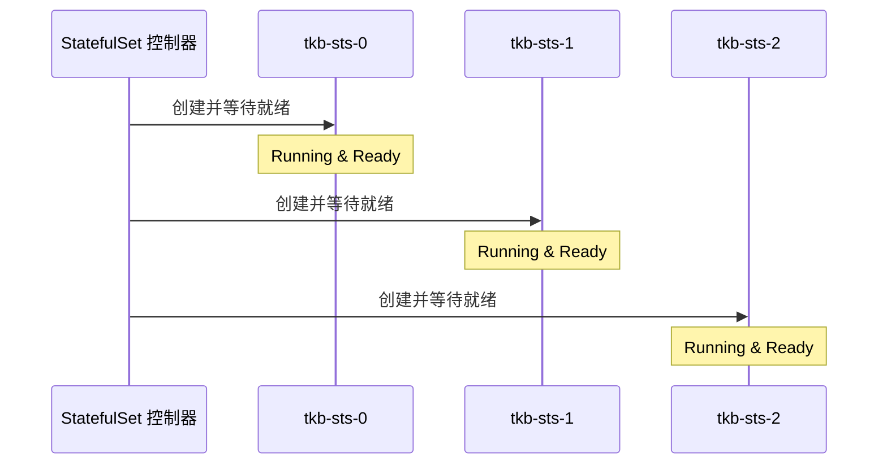
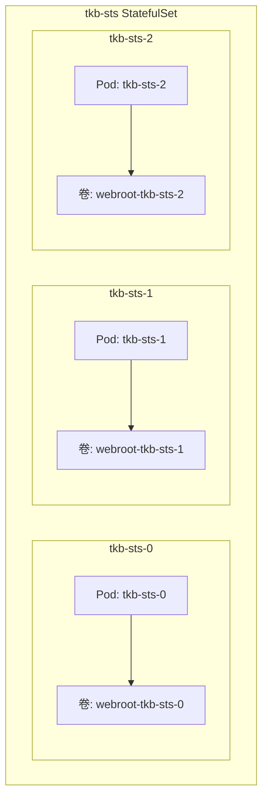

# 13: StatefulSets

在本章中，你将学习如何使用 [[StatefulSet]] 在 [[Kubernetes]] 上部署和管理有状态应用程序。

> [!NOTE] 有状态应用定义
> 本章将**有状态应用**定义为其创建并保存有价值数据的应用。常见例子包括数据库、键值存储，以及保存客户端会话数据以供后续会话使用的应用。

本章安排如下：

- [[#StatefulSet 理论]]
- [[#StatefulSet 实战]]

## StatefulSet 理论

理论部分将介绍 [[StatefulSet]] 的工作原理以及为什么它们对有状态应用有用。不过如果一开始没有完全理解也不用担心，在实战部分你会有更深入的学习。

### StatefulSet 与 [[Deployment]] 对比

将 [[StatefulSet]] 与 [[Deployment]] 进行比较会很有帮助。两者都是 Kubernetes API 资源，都遵循标准的 Kubernetes [[控制器]]架构——将观察到的状态与期望状态进行协调的控制循环。两者都能管理 [[Pod]]，并提供自我修复、扩缩容、滚动更新等功能。

然而，StatefulSet 提供以下 [[Deployment]] 不具备的三个特性：

1. **可预测且持久的 Pod 名称和 DNS 名称**
2. **可预测且持久的卷绑定**
3. **可预测的启动和关闭顺序**

> [!TIP] Pod 的粘性标识
> 第一点和第二点构成了 Pod 的状态，我们有时称之为 Pod 的粘性标识（sticky ID）。[[StatefulSet]] 确保 Pod 名称和卷绑定在故障、扩缩容操作和其他调度事件中保持不变。

例如，[[StatefulSet]] 中的 Pod 如果发生故障，会被具有相同 Pod 名称、相同 DNS 主机名并连接到相同卷的新 Pod 替换。即使 Kubernetes 在不同的集群节点上启动替换 Pod，也是如此。即使 Pod 因缩容操作被终止，随后通过扩容操作重新创建时，也会获得相同的名称和卷。这些特性使它们成为需要唯一可靠 Pod 的应用的理想选择。

以下 YAML 定义了一个名为 `tkb-sts` 的简单 [[StatefulSet]]，包含三个运行 `mongo:latest` 镜像的副本。将其提交到 API 服务器后，会持久化到集群存储，调度器将副本分配到工作节点，StatefulSet 控制器确保观察到的状态与期望状态匹配。

```yaml
apiVersion: apps/v1
kind: StatefulSet
metadata:
  name: tkb-sts
spec:
  selector:
    matchLabels:
      app: mongo
  serviceName: "tkb-sts"
  replicas: 3
  template:
    metadata:
      labels:
        app: mongo
    spec:
      containers:
      - name: ctr-mongo
        image: mongo:latest
        ...
```

### StatefulSet Pod 命名

[[StatefulSet]] 创建的每个 Pod 都会获得一个可预测的名称。事实上，Pod 名称是 [[StatefulSet]] 启动、自我修复、扩缩容、删除 Pod 以及连接 Pod 到卷的核心机制。

StatefulSet Pod 名称的格式为：`<StatefulSet 名称>-<整数>`。整数是从零开始的索引序号（zero-based index ordinal），简单说就是从零开始的数字。继续使用前面的 YAML，Kubernetes 会将第一个副本命名为 `tkb-sts-0`，第二个命名为 `tkb-sts-1`，第三个命名为 `tkb-sts-2`。

Kubernetes 还使用 StatefulSet 名称为每个副本创建 DNS 名称，因此请避免使用会产生无效 DNS 名称的特殊字符。

### 有序创建和删除

[[StatefulSet]] 与 [[Deployment]] 之间的一个关键区别在于它们创建 Pod 的方式：

- **StatefulSet** 一次创建一个 Pod，并等待其运行就绪后再启动下一个
- **Deployment** 使用 [[ReplicaSet]] 控制器同时启动所有 Pod，可能导致竞态条件

继续使用前面的 YAML，StatefulSet 控制器会首先启动 `tkb-sts-0`，等待其运行就绪后再启动 `tkb-sts-1`。后续 Pod 也是如此——控制器等待 `tkb-sts-1` 运行就绪后再启动 `tkb-sts-2`。



> [!NOTE] 运行就绪（Running and Ready）
> 这是一个术语，表示 Pod 中的所有容器都在运行，且 Pod 已准备好服务请求。

相同的启动规则也适用于 [[StatefulSet]] 的扩缩操作。例如，从 3 个副本扩展到 5 个副本时，会先启动名为 `tkb-sts-3` 的新 Pod，等待其运行就绪后再创建 `tkb-sts-4`。缩容遵循相反的规则——控制器先终止索引序号最高的 Pod，等待其完全终止后再终止下一个序号最高的 Pod。

> [!WARNING] 有序缩容的重要性
> 保证 Pod 缩容顺序以及 Kubernetes 绝不会并行终止 Pod 对于有状态应用至关重要。例如，集群应用如果多个副本同时终止，可能会丢失数据。

最后，值得注意的是 [[StatefulSet]] 控制器执行自己的自我修复和扩缩容操作。这与 [[Deployment]] 在架构上不同，Deployment 使用 [[ReplicaSet]] 控制器进行这些操作。

#### 删除 StatefulSet

关于删除 [[StatefulSet]]，你需要了解两个重要事项：

> [!IMPORTANT] 删除 StatefulSet 的注意事项
> 1. 删除 StatefulSet 对象不会有序地终止其 Pod。因此，**删除前应先将 StatefulSet 缩容到零副本！**
> 2. 可以使用 `terminationGracePeriodSeconds` 进一步控制 Pod 终止。例如，通常建议将其设置为至少 10 秒，以便应用程序有足够时间刷新缓冲区并安全提交仍在传输中的写入。

### StatefulSet 和 [[卷]]

[[卷]]是 [[StatefulSet]] Pod 粘性标识的重要组成部分。

当 StatefulSet 控制器创建 Pod 时，也会创建它们所需的任何卷。为了实现这一点，Kubernetes 为卷指定特殊名称，将它们与正确的 Pod 关联。下图展示了一个名为 `tkb-sts` 的 StatefulSet，请求三个各带一个卷的 Pod。你可以看到 Kubernetes 如何使用名称将卷与 Pod 连接。



尽管卷与特定的 Pod 副本关联，但它们仍通过常规的 [[PersistentVolumeClaim]] 系统与 Pod 解耦。这意味着卷具有独立的生命周期，允许它们在 Pod 故障和 Pod 终止操作中存活。例如，当 StatefulSet Pod 发生故障或被终止时，其关联的卷不受影响。这允许替换 Pod 连接到存活的卷和数据，即使 Kubernetes 将替换 Pod 调度到不同的集群节点。

相同的机制也发生在扩缩操作中。如果缩容操作删除了 StatefulSet Pod，后续的扩容操作会将新 Pod 连接到存活的卷。

> [!TIP] 意外删除的救命稻草
> 如果你不小心删除了 StatefulSet Pod，这种行为可能是救命稻草，尤其是最后一个副本！

### 处理故障

[[StatefulSet]] 控制器观察集群状态并将观察到的状态与期望状态协调。

最简单的例子是 Pod 故障。如果你有一个名为 `tkb-sts` 的 StatefulSet，包含五个副本，而 `tkb-sts-3` 副本发生故障，控制器会启动一个新 Pod，使用相同的名称并将其附加到存活的卷。

节点故障可能更复杂，一些旧版本的 Kubernetes 需要手动干预来替换运行在故障节点上的 Pod。这是因为 Kubernetes 有时很难判断节点是真正故障还是只是从临时事件中重新启动。例如，如果一个"故障"节点在 Kubernetes 替换其 Pod 后恢复，你将面临相同的 Pod 试图写入相同卷的情况，可能导致数据损坏。

幸运的是，较新版本的 Kubernetes 在处理这类场景时表现更好。

### 网络标识和 [[无头服务]]

我们已经说过，[[StatefulSet]] 适用于需要 Pod 可预测且长久的应用。一个原因可能是外部应用需要连接并重新连接到相同的 Pod。[[StatefulSet]] 使用一种称为**无头服务**的特殊服务来替代常规 Kubernetes [[服务]]，后者在 Pod 集合之间进行负载均衡。无头服务为每个 StatefulSet Pod 创建可预测的 DNS 名称，这样应用可以查询 DNS（服务注册表）获取完整 Pod 列表，然后直接连接到特定 Pod。

以下 YAML 代码片段展示了一个名为 `mongo-prod` 的无头服务和名为 `sts-mongo` 的 StatefulSet。这是一个无头服务，因为它没有 ClusterIP。它也在 StatefulSet 中被列为管理服务。

```yaml
apiVersion: v1
kind: Service                   # 服务
metadata:
  name: mongo-prod
spec:
  clusterIP: None               # 设为无头服务
  selector:
    app: mongo
    env: prod
---
apiVersion: apps/v1
kind: StatefulSet               # StatefulSet
metadata:
  name: sts-mongo
spec:
  serviceName: mongo-prod       # 管理服务
```

> [!INFO] 术语解释
> **无头服务（Headless Service）**：没有 ClusterIP 地址（`spec.clusterIP: None`）的常规 Kubernetes Service 对象。通过在 StatefulSet 的 `spec.serviceName` 下列出它，使其成为 StatefulSet 的**管理服务（Governing Service）**。

当将无头服务与 [[StatefulSet]] 如此结合时，服务会为每个匹配服务标签选择器的 Pod 创建 DNS SRV 和 DNS A 记录。其他 Pod 和应用可以查询 DNS 以获取 StatefulSet 所有 Pod 的名称和 IP。稍后你会看到，但开发者必须编写应用程序来如此查询 DNS。

## StatefulSet 实战

本节中，你将部署一个可工作的 [[StatefulSet]]。

> [!TIP] 环境准备
> 本演示已在 Linode Kubernetes Engine (LKE) 和本地 Docker Desktop 多节点集群上设计并测试。如果你的集群在其他云或本地环境，需要使用不同的 [[StorageClass]]。我会在相关步骤说明。

如果你还没有这样做，运行以下命令克隆本书的 GitHub 仓库并切换到 `2025` 分支：

```bash
$ git clone https://github.com/nigelpoulton/TKB.git
$ cd TKB
$ git fetch origin
$ git checkout -b 2025 origin/2025
```

所有后续命令都从 `statefulsets` 文件夹内执行。

你将部署以下三个对象：

1. 一个 [[StorageClass]]
2. 一个无头服务
3. 一个 [[StatefulSet]]

为便于跟随，你将逐一部署和检查每个对象。但也可以将它们分组到单个 YAML 文件中，用一条命令部署（参见 `statefulsets` 文件夹中的 `app.yml` 文件）。

### 部署 StorageClass

[[StatefulSet]] 需要一种动态创建卷的方法。为此，它们需要：

- 一个 [[StorageClass]]（SC）
- 一个 [[PersistentVolumeClaim]]（PVC）

以下 YAML 来自 `lke-sc.yml` 文件，定义了一个名为 `block` 的 StorageClass，使用 LKE 块存储 CSI 驱动从 Linode Cloud 动态配置块存储。如果你使用的是 Docker Desktop 多节点集群，需要使用 `dd-kind-sc.yml` 文件代替。如果你的集群在其他云上，可以：

- 创建一个名为 `block` 的新 StorageClass（需要自行配置 `provisioner` 和 `parameters` 部分）
- 使用集群中现有的 StorageClass，并在后续步骤中更改 PVC 中的 StorageClass 名称

```yaml
apiVersion: storage.k8s.io/v1
kind: StorageClass
metadata:
  name: block                                # PVC 将使用此名称
provisioner: linodebs.csi.linode.com         # LKE 块存储 CSI 驱动
allowVolumeExpansion: true
volumeBindingMode: WaitForFirstConsumer
reclaimPolicy: Delete
```

> [!NOTE] volumeBindingMode: WaitForFirstConsumer
> 此设置确保在 Pod 被调度到节点后才绑定 [[PersistentVolume]]，允许 Kubernetes 考虑节点拓扑以获得更好的卷放置。

部署 StorageClass。如果你使用的是本地 Docker Desktop 多节点集群，请记住使用 `dd-kind-sc.yml` 文件。

```bash
$ kubectl apply -f lke-sc.yml
storageclass.storage.k8s.io/block created
```

列出集群的 StorageClass 以确认你的已存在：

```bash
$ kubectl get sc
NAME     PROVISIONER               RECLAIMPOLICY    VOLUMEBINDINGMODE
block    linodebs.csi.linode.com   Delete           WaitForFirstConsumer
```

你的存储类已存在，你的 StatefulSet 将使用它动态创建新卷。

### 创建管理无头服务

用头部和尾部来可视化 [[服务]]对象会很有帮助。头部是稳定的 ClusterIP 地址，尾部是它转发流量的 Pod 列表。无头服务是没有头部/ClusterIP 地址的常规 Kubernetes Service 对象。

无头服务的主要目的是为 [[StatefulSet]] Pod 创建 DNS SRV 记录。客户端查询 DNS 获取单个 Pod，然后直接向这些 Pod 发送查询，而不是通过服务的 ClusterIP。这就是为什么无头服务没有 ClusterIP。

以下 YAML 来自 `headless-svc.yml` 文件，描述了一个名为 `dullahan` 的无头服务，没有 ClusterIP 地址（`spec.clusterIP: None`）。

```yaml
apiVersion: v1
kind: Service        # 常规 Kubernetes Service
metadata:
  name: dullahan     # 名称中只使用有效的 DNS 字符
  labels:
    app: web
spec:
  ports:
  - port: 80
    name: web
  clusterIP: None    # 使其成为无头服务
  selector:
    app: web
```

> [!TIP] 与常规服务的唯一区别
> 无头服务与常规服务的唯一区别是 `clusterIP` 设置为 `None`。

运行以下命令将无头服务部署到集群：

```bash
$ kubectl apply -f headless-svc.yml
service/dullahan created
```

确认它存在：

```bash
$ kubectl get svc
NAME         TYPE         CLUSTER-IP    EXTERNAL-IP    PORT(S)    
dullahan     ClusterIP    None          <none>         80/TCP     
```

### 部署 StatefulSet

现在你已经创建了存储类和无头服务，可以部署 [[StatefulSet]] 了。

以下 YAML 来自 `sts.yml` 文件，定义了 StatefulSet：

```yaml
apiVersion: apps/v1
kind: StatefulSet
metadata:
  name: tkb-sts                          # 命名 StatefulSet
spec:
  replicas: 3                            # 部署三个副本
  selector:
    matchLabels:
      app: web
  serviceName: "dullahan"                # 设为管理服务
  template:
    metadata:
      labels:
        app: web
    spec:
      terminationGracePeriodSeconds: 10
      containers:
      - name: ctr-web
        image: nginx:latest
        ports:
        - containerPort: 80
          name: web
        volumeMounts:                     # 挂载此卷
        - name: webroot
          mountPath: /usr/share/nginx/html
  volumeClaimTemplates:                 # 动态创建卷
  - metadata:
      name: webroot
    spec:
      accessModes: [ "ReadWriteOnce" ]
      storageClassName: "block"
      resources:
        requests:
          storage: 10Gi
```

> [!NOTE] volumeClaimTemplates
> Kubernetes 使用 `spec.volumeClaimTemplates` 为每个 StatefulSet Pod 动态创建唯一的 PVC。由于请求三个副本，Kubernetes 将基于 `spec.template` 部分创建三个唯一的 Pod，基于 `spec.volumeClaimTemplates` 部分创建三个唯一的 PVC。它还确保 Pod 和 PVC 获得正确的名称以便链接。

如果你使用的是非 LKE 集群而是云提供商的内置 StorageClass，需要编辑 `sts.yml` 文件，将 `storageClassName` 字段更改为集群上的 StorageClass。如果你自己创建了名为 `block` 的 StorageClass，则不需要更改。

运行以下命令部署 StatefulSet：

```bash
$ kubectl apply -f sts.yml
statefulset.apps/tkb-sts created
```

监视 StatefulSet 扩容到三个副本。控制器创建所有三个 Pod 和关联的 PVC 可能需要一到两分钟。

```bash
$ kubectl get sts --watch
NAME      READY   AGE
tkb-sts   0/3     14s
tkb-sts   1/3     30s
tkb-sts   2/3     60s
tkb-sts   3/3     90s
```

> [!TIP] 观察有序创建
> 注意启动第一个副本用了约 30 秒。一旦该副本运行就绪，再花 30 秒启动第二个，再花 30 秒启动第三个。这是 StatefulSet 控制器依次启动每个副本并等待其运行就绪后再启动下一个的结果。

现在检查 PVC：

```bash
$ kubectl get pvc
NAME                 STATUS    VOLUME             CAPACITY    MODES    
webroot-tkb-sts-0    Bound     pvc-1146...f274    10Gi        RWO      
webroot-tkb-sts-1    Bound     pvc-3026...6bcb    10Gi        RWO      
webroot-tkb-sts-2    Bound     pvc-2ce7...e56d    10Gi        RWO      
```

你有了三个新 PVC，每个都在创建时与一个 Pod 副本关联。如果仔细观察，你会发现每个 PVC 名称都包含卷声明模板名称、StatefulSet 名称和关联的 Pod 副本。

| volumeClaimTemplate | Pod 名称 | PVC 名称 |
|---------------------|----------|----------|
| webroot | tkb-sts-0 | webroot-tkb-sts-0 |
| webroot | tkb-sts-1 | webroot-tkb-sts-1 |
| webroot | tkb-sts-2 | webroot-tkb-sts-2 |

恭喜，你的 [[StatefulSet]] 正在运行并管理三个 Pod 和三个卷。

### 测试对等发现

让我们解释 [[DNS]] 主机名和 [[DNS]] 子域名如何与 [[StatefulSet]] 配合工作。

所有 Kubernetes 对象都在集群地址空间内获得名称。你可以构建集群时指定自定义地址空间，但大多数使用 `cluster.local` DNS 域。在此域内，Kubernetes 按以下方式构建 DNS 子域名：

```
<object-name>.<service-name>.<namespace>.svc.cluster.local
```

你已在 default 命名空间部署了三个名为 `tkb-sts-0`、`tkb-sts-1` 和 `tkb-sts-2` 的 Pod，由 `dullahan` 无头服务管理。这意味着你的 Pod 将具有以下完全限定的 DNS 名称，这些名称可预测且可靠：

- `tkb-sts-0.dullahan.default.svc.cluster.local`
- `tkb-sts-1.dullahan.default.svc.cluster.local`
- `tkb-sts-2.dullahan.default.svc.cluster.local`

无头服务的职责是将这些 Pod 及其 IP 注册到 `dullahan.default.svc.cluster.local` 名称下。

你将通过部署一个预装了 `dig` 工具的 jump Pod 来测试这一点。然后你会 `exec` 到该 Pod 并使用 `dig` 查询服务的 SRV 记录。

运行以下命令从 `jump-pod.yml` 文件部署 jump Pod：

```bash
$ kubectl apply -f jump-pod.yml
pod/jump-pod created
```

exec 到该 Pod：

```bash
$ kubectl exec -it jump-pod -- bash
root@jump-pod:/#
```

你的终端提示符会改变，表明已连接到 jump Pod。从 jump-pod 内运行以下 `dig` 命令：

```bash
# dig SRV dullahan.default.svc.cluster.local
<Snip>
;; QUESTION SECTION:
;dullahan.default.svc.cluster.local. IN SRV
;; ANSWER SECTION:
dullahan.default.svc.cluster.local. 30 IN SRV... tkb-sts-1.dullah
dullahan.default.svc.cluster.local. 30 IN SRV... tkb-sts-0.dullah
dullahan.default.svc.cluster.local. 30 IN SRV... tkb-sts-2.dullah
;; ADDITIONAL SECTION:
tkb-sts-0.dullahan.default.svc.cluster.local. 30 IN A 10.60.0.5
tkb-sts-2.dullahan.default.svc.cluster.local. 30 IN A 10.60.1.7
tkb-sts-1.dullahan.default.svc.cluster.local. 30 IN A 10.60.2.12
<Snip>
```

> [!INFO] DNS 响应解析
> - **QUESTION SECTION**：询问 `dullahan.default.svc.cluster.local`
> - **ANSWER SECTION**：提供三个 Pod 的 DNS 名称
> - **ADDITIONAL SECTION**：将 Pod 名称映射到 IP 地址

输出显示，询问 `dullahan.default.svc.cluster.local`（QUESTION SECTION）的客户端将获得三个 StatefulSet Pod 的 DNS 名称（ANSWER SECTION）和 IP（ADDITIONAL SECTION）。

输入 `exit` 返回终端。

### 扩缩 StatefulSet

每次 Kubernetes 扩容 [[StatefulSet]] 时，它都会创建新的 Pod 和 PVC。但是，缩容时 Kubernetes 只终止 Pod。这意味着后续的扩容操作只需要创建新 Pod 并将它们连接回原始 PVC。Kubernetes 和 StatefulSet 控制器会自动处理这一切，无需你的干预。

你目前有三个 StatefulSet Pod 和三个 PVC。编辑 `sts.yml` 文件，将副本数从 3 改为 2，然后保存更改。完成后，如果你仍连接到 jump Pod，先输入 `exit`，再运行以下命令将更新的配置重新提交到集群：

```bash
$ kubectl apply -f sts.yml
statefulset.apps/tkb-sts configured
```

检查 StatefulSet 并确认 Pod 数量已减少到 2：

```bash
$ kubectl get sts tkb-sts
NAME      READY   AGE
tkb-sts   2/2     12h
$ kubectl get pods
NAME        READY   STATUS    RESTARTS   AGE
tkb-sts-0   1/1     Running   0          12h
tkb-sts-1   1/1     Running   0          12h
```

你已成功将 Pod 数量缩减到 2。如果仔细观察，你会发现 Kubernetes 删除了索引序号最高的一个，而三个 PVC 仍然存在。记住，缩容 StatefulSet 不会删除 PVC。

确认这一点：

```bash
$ kubectl get pvc
NAME                 STATUS    VOLUME             CAPACITY    MODES    
webroot-tkb-sts-0    Bound     pvc-5955...d71c    10Gi        RWO      
webroot-tkb-sts-1    Bound     pvc-d62c...v701    10Gi        RWO      
webroot-tkb-sts-2    Bound     pvc-2e2f...5f95    10Gi        RWO      
```

所有三个的状态仍显示为 Bound，尽管 `tkb-sts-2` Pod 不再存在。如果你对 `webroot-tkb-sts-2` PVC 运行 `kubectl describe`，会看到 **Used by** 字段显示为 `<none>`。

> [!TIP] PVC 持久化的优势
> 三个 PVC 都存在意味着扩容回 3 个副本只需要一个新 Pod。StatefulSet 控制器将创建新 Pod 并将其连接到现有的 PVC。

再次编辑 `sts.yml` 文件，将副本数递增回 3，然后保存更改。完成后运行以下命令重新部署应用：

```bash
$ kubectl apply -f sts.yml
statefulset.apps/tkb-sts configured
```

等几秒钟让新 Pod 部署，然后用以下命令验证：

```bash
$ kubectl get sts tkb-sts
NAME      READY   AGE
tkb-sts   3/3     12h
```

你回到了 3 个 Pod。描述新的 `tkb-sts-2` Pod 并确认它挂载了 `webroot-tkb-sts-2` 卷。如果你使用的是 Windows，将 `grep ClaimName` 参数替换为 `Select-String -Pattern 'ClaimName'`：

```bash
$ kubectl describe pod tkb-sts-2 | grep ClaimName
ClaimName:  webroot-tkb-sts-2
```

恭喜，新 Pod 自动连接到了正确的卷。

> [!NOTE] 缩容保护机制
> 如果任何 Pod 处于失败状态，Kubernetes 会暂停缩容操作。这保护了应用的弹性和任何数据的完整性。

你还可以通过调整 `spec.podManagementPolicy` 属性来更改 StatefulSet 控制器启动和停止 Pod 的方式。默认设置是 `OrderedReady`，强制一次启动一个 Pod 并等待前一个 Pod 运行就绪后再启动下一个。将值更改为 `Parallel` 会导致 StatefulSet 更像 [[Deployment]]，Pod 并行创建和删除。例如，从 2 > 5 扩容会立即创建所有三个新 Pod，而从 5 > 2 缩容会并行删除三个 Pod。StatefulSet 命名规则仍然强制执行，因为该设置仅适用于扩缩操作，不影响滚动更新和回滚。

### 滚动更新

[[StatefulSet]] 支持滚动更新。你在 YAML 文件中更新镜像版本并重新提交到 API 服务器，控制器会用新 Pod 替换旧 Pod。但是，它总是从序号最高的 Pod 开始，逐个向下工作，直到所有 Pod 都运行新版本。控制器还等待每个新 Pod 就绪后再替换下一个最低索引序号的 Pod。

有关更多信息，运行：

```bash
$ kubectl explain sts.spec.updateStrategy
```

### 测试 Pod 故障

测试故障最简单的方法是手动删除一个 Pod。[[StatefulSet]] 控制器会注意到故障并尝试通过启动一个新 Pod 并将其连接到相同的 PVC 和卷来协调。

让我们测试一下。

确认 StatefulSet 中有三个健康的 Pod：

```bash
$ kubectl get pods
NAME        READY   STATUS   AGE
tkb-sts-0   1/1     Running  12h
tkb-sts-1   1/1     Running  12h
tkb-sts-2   1/1     Running  9m49s
```

让我们删除 `tkb-sts-0` Pod，看看 StatefulSet 控制器是否会自动重新创建它：

```bash
$ kubectl delete pod tkb-sts-0
pod "tkb-sts-0" deleted
$ kubectl get pods --watch
NAME        READY   STATUS              RESTARTS   AGE
tkb-sts-0   1/1     Running             0          12h
tkb-sts-1   1/1     Running             0          12h
tkb-sts-2   1/1     Running             0          10m
tkb-sts-0   0/1     Terminating         0          12h
tkb-sts-0   0/1     Pending             0          0s
tkb-sts-0   0/1     ContainerCreating   0          0s
tkb-sts-0   1/1     Running             0          8s
```

> [!TIP] --watch 标志的用途
> 在命令上放置 `--watch` 允许你看到 StatefulSet 控制器观察终止的 Pod 并创建替换。这是一个干净的故障，StatefulSet 控制器立即创建了替换 Pod。

新 Pod 具有与故障 Pod 相同的名称。但它有相同的 PVC 吗？

运行以下命令确认 Kubernetes 将新 Pod 连接到了原始的 `webroot-tkb-sts-0` PVC。如果你使用的是 Windows，不要忘记将 `grep ClaimName` 参数替换为 `Select-String -Pattern 'ClaimName'`：

```bash
$ kubectl describe pod tkb-sts-0 | grep ClaimName
    ClaimName:  webroot-tkb-sts-0
```

成功了！

### 测试节点故障

从潜在节点故障中恢复要复杂得多，可能取决于你的 Kubernetes 版本。现代 Kubernetes 集群在自动替换故障节点上的 Pod 方面要好得多，而旧版本可能需要手动干预。这是为了防止 Kubernetes 将临时事件误诊为灾难性节点故障。

让我们测试一个简单的节点故障。我将提供在 LKE 集群和 Docker Desktop 多节点 Kubernetes 集群上模拟节点故障的说明，但其他平台的原理相同。

运行以下命令列出 StatefulSet Pod 及其运行的节点：

```bash
$ kubectl get pods -o wide
NAME        READY   STATUS    RESTARTS   AGE   IP           NODE   
tkb-sts-0   1/1     Running   0          11m   10.2.0.132   lke34
tkb-sts-1   1/1     Running   0          12h   10.2.0.3     lke34
tkb-sts-2   1/1     Running   0          21m   10.2.1.7     lke34
```

仔细查看 NODE 列，你会看到 Kubernetes 已将每个副本调度到不同的节点。

在示例中，`tkb-sts-0` 运行在 `lke343...cbe00000` 节点上。通过完成以下程序模拟节点故障。我将展示在 LKE 和 Docker Desktop 多节点集群上的操作方法。

#### 在 LKE 上删除节点

进入你的 LKE Dashboard (cloud.linode.com)，点击左侧的 Kubernetes 选项卡，然后点击你的集群名称打开其摘要页面。向下滚动到集群的节点池，并回收运行 StatefulSet 副本的某个节点。这将删除并替换该节点。

> [!NOTE] 图 13.3 - 删除 LKE 集群节点
> 此处应有删除 LKE 集群节点的截图

#### 在 Docker Desktop 多节点集群 (kind) 上删除节点

这只适用于 Docker Desktop 多节点 (kind) 集群，你需要删除并重新创建集群才能恢复三个节点。如果你有 Docker Desktop 单节点 (kubeadm) 集群，则无法跟随操作。

Docker Desktop 将集群节点作为容器运行，三节点集群将有三个名为 `desktop-control-plane`、`desktop-worker` 和 `desktop-worker2` 的容器。

打开 Docker Desktop，导航到左侧导航窗格中的 Containers 选项卡。找到与你想要删除的工作节点同名的容器，点击容器右侧的垃圾桶图标删除它。确保删除运行 StatefulSet 副本的节点。下图展示如何删除 `desktop-worker2` 节点。

> [!NOTE] 图 13.4 - 删除 Docker Desktop 集群节点
> 此处应有删除 Docker Desktop 集群节点的截图

#### 观察 StatefulSet 恢复过程

删除节点后，你可以运行以下命令见证 StatefulSet 控制器从故障中恢复。当 StatefulSet 控制器观察缺失的 Pod 并决定如何行动时，这个过程可能需要一两分钟才能完成：

```bash
$ kubectl get pods -o wide --watch
NAME        READY   STATUS                RESTARTS   AGE   IP     
tkb-sts-0   1/1     Running               0          14m   10.2.0
tkb-sts-1   1/1     Running               0          12h   10.2.0
tkb-sts-2   1/1     Running               0          30m   10.2.1
tkb-sts-0   1/1     Terminating           0          14m   10.2.0
<Snip> 
tkb-sts-0   0/1     Completed             0          14m   10.2.0
<Snip> 
tkb-sts-0   0/1     Pending               0          0s    <none> 
tkb-sts-0   0/1     Pending               0          0s    <none> 
tkb-sts-0   0/1     ContainerCreating     0          0s    <none> 
tkb-sts-0   0/1     ContainerCreating     0          110s  <none> 
tkb-sts-0   1/1     Running               0          111s  10.2.0
```

让我们检查输出：

| 状态阶段 | 说明 |
|---------|------|
| Terminating | Kubernetes 注意到缺失节点，StatefulSet 从三个副本减少到两个 |
| Completed | 观察到的状态与期望状态不再匹配 |
| Pending | StatefulSet 控制器开始创建缺失的 `tkb-sts-0` 副本，调度器正在为其分配一个存活的节点 |
| ContainerCreating | 节点下载适当的镜像并启动容器 |
| Running | Kubernetes 释放先前的 PVC 附加，将新副本绑定到 PVC，Pod 进入运行状态，StatefulSet 恢复到三个副本 |

> [!NOTE] Pod 调度位置变化
> 如果检查 NODE 列，你会看到原始的 `tkb-sts-0` 副本运行在 `lke343745...cbe00000` 节点上，但 Kubernetes 已将替换副本调度到 `lke343745...7b870000` 节点。这是因为之前的节点已不存在。
> 
> 如果你使用的是 LKE 集群，会有一个新节点替换你回收的节点。但是 Kubernetes 不会将现有副本重新平衡到新节点。

### 删除 StatefulSet

本章前面说过，Kubernetes 在删除 [[StatefulSet]] 时不会有序地终止其 Pod。因此，如果你的应用和数据对有序关闭敏感，应在删除前将 StatefulSet 缩容到零。

将 StatefulSet 缩容到 0 个副本并确认操作。缩容到 0 可能需要几秒钟：

```bash
$ kubectl scale sts tkb-sts --replicas=0
statefulset.apps/tkb-sts scaled
$ kubectl get sts tkb-sts
NAME      READY   AGE
tkb-sts   0/0     13h
```

一旦达到零副本，你就可以删除 StatefulSet：

```bash
$ kubectl delete sts tkb-sts
statefulset.apps "tkb-sts" deleted
```

如果你删除了集群节点，你可能已经终止了 jump pod，你可以随意 exec 到 jump-pod 并运行另一个 `dig` 来证明 Kubernetes 已从集群 DNS 中删除了 SRV 记录。

## 清理

你已经删除了 StatefulSet 及其 Pod。但是 jump pod、无头服务、卷和 StorageClass 仍然存在。如果你一直在跟随，可以用以下命令删除它们。**不删除卷会产生意外的云成本**。

删除 jump pod。如果它已经消失了，不用担心：

```bash
$ kubectl delete pod jump-pod
```

删除无头服务：

```bash
$ kubectl delete svc dullahan
```

删除 PVC。这将删除关联的 PV 和 Linode Cloud 上的后端存储。如果你使用了自己的 StorageClass，应该检查你的存储后端以确认外部卷也被删除。**不删除后端卷可能导致不必要的成本**：

```bash
$ kubectl delete pvc webroot-tkb-sts-0 webroot-tkb-sts-1 webroot-tkb-sts-2
```

删除 StorageClass：

```bash
$ kubectl delete sc block
```

> [!WARNING] Docker Desktop 多节点 (kind) 集群
> 如果你从 Docker Desktop 多节点 (kind) 集群中删除了节点，需要删除并重建集群以恢复所需数量的节点。

## 章节总结

本章中，你学习了如何使用 [[StatefulSet]] 部署和管理与持久数据一起工作的应用。

> [!KEY_POINTS] 核心要点
> - [[StatefulSet]] 可以自我修复、上下扩展和执行滚动更新。回滚需要手动操作。
> - 每个 StatefulSet Pod 获得一个可预测且持久的名称、DNS 主机名和自己的唯一卷。这些在整个 Pod 生命周期中保持不变，包括故障、重启、扩缩容和其他调度操作。事实上，StatefulSet Pod 名称对于扩缩操作和连接到正确的存储卷至关重要。

最后，[[StatefulSet]] 只是一个框架。我们需要设计应用程序以利用它们的工作方式。