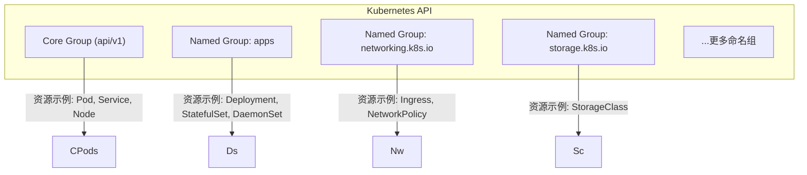
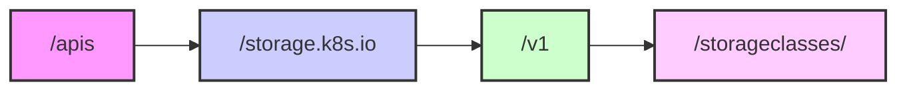

# 15: Kubernetes API

如果你想精通Kubernetes，就必须理解API及其工作原理。然而，API庞大而复杂，如果你不熟悉API，或者对RESTful等术语感到不适应，可能会感到困惑。如果你处于这种情况，本章将扫清这些困惑，让你快速掌握Kubernetes API的基础知识。

本章内容划分如下，最后两节包含大量动手练习：

- Kubernetes API 大图
- API 服务器
- API

不过在开始之前，先快速提几点。

本章包含大量术语，旨在帮助你逐步熟悉它们。

我强烈建议你完成动手练习部分，因为它们将巩固理论部分。

最后，Pod、Service、StatefulSet、StorageClass 等都是API中的资源。不过，当它们被部署到集群中时，通常被称为**对象**。在本章中，我们将互换使用术语**资源**和**对象**。

---

## Kubernetes API 大图

Kubernetes 以 API 为中心。这意味着所有资源都在 API 中定义，所有配置和查询都通过 API 服务器进行。

管理员和客户端向 API 服务器发送请求，以创建、读取、更新和删除对象。他们通常使用 `kubectl` 发送这些请求，但也可以通过代码生成请求，或者使用 API 测试与开发工具生成请求。关键在于，无论你以何种方式生成请求，它们总是发送到 API 服务器，并在被接受前进行身份验证和授权。如果是创建对象的请求，Kubernetes 会将对象定义以其序列化状态持久化到集群存储中，并将其调度到集群。

图 15.1 展示了高级流程，并突出了 API 和 API 服务器的核心地位。

> **图 15.1** （示意图描述：展示客户端（如 kubectl、curl、程序）发送请求到 API 服务器，API 服务器进行身份验证/授权后，将对象持久化到 etcd 集群存储，并调度到集群节点。流程突出 API 服务器的中心地位。）

---

### 解开一些术语的神秘面纱

#### JSON 序列化

将对象以其序列化状态持久化到集群存储中是什么意思？

**序列化**是将对象转换为字符串或字节流的过程，以便通过网络发送并持久化到数据存储中。将字符串或字节流转换回对象的过程称为**反序列化**。

Kubernetes 将对象（如 Pod 和 Service）序列化为 JSON 字符串，并通过 HTTP 在网络中发送。该过程双向进行：

- 像 `kubectl` 这样的客户端在将对象发布到 API 服务器时会序列化对象。
- API 服务器在将响应发送回客户端时会序列化响应。

除了序列化对象以便在网络中传输，Kubernetes 还会对它们进行序列化以便存储在集群存储中。

Kubernetes 支持 JSON 和 Protobuf 序列化方案。Protobuf 更快、更高效，且比 JSON 更具可扩展性，但检查和调试起来更困难。在撰写本文时，Kubernetes 通常通过 JSON 与外部客户端通信，但在与内部集群组件通信时使用 Protobuf。

关于序列化的最后一点：当客户端向 API 服务器发送请求时，它们使用 `Content-Type` 头部列出它们支持的序列化方案。例如，仅支持 JSON 的客户端会在所有请求的 HTTP 头部中指定 `Content-Type: application/json`。Kubernetes 将尊重此设置，并以 JSON 格式返回序列化响应。你将在后面的动手练习部分看到这一点。

---

#### API 类比

考虑一个简短的类比，或许能帮助你理解 Kubernetes API 的概念。如果你已经熟悉 API 的概念，可以跳过本节。

亚马逊销售大量商品：

1. 这些商品存放在仓库中，并通过亚马逊网站在线展示。
2. 你使用浏览器和应用程序等工具搜索网站并购买商品。
3. 第三方通过亚马逊销售自己的商品，你使用相同的浏览器和网站。
4. 当你通过网站购买商品时，商品会被送到你手中，你就可以开始使用了。
5. 亚马逊网站允许你在商品准备和配送过程中跟踪商品。
6. 商品送达后，你可以使用亚马逊网站订购更多或退回商品。

Kubernetes 非常类似。

Kubernetes 拥有大量资源（商品），如 Pod、Service 和 Ingress：

1. 这些 Kubernetes 商品定义在 API 中，并通过 API 服务器暴露。
2. 你使用 `kubectl` 等工具与 API 服务器通信并请求资源。
3. 第三方定义自己的 Kubernetes 资源，你使用相同的 `kubectl` 和 API 服务器来请求它们。
4. 当你通过 API 服务器请求资源时，它们会在你的集群上被创建，你就可以开始使用它们。
5. API 服务器允许你观察对象被创建和部署的过程。
6. 一旦对象被创建，你可以使用 API 服务器创建更多对象，甚至删除它们。

图 15.2 展示了这种对比，下表进行了逐项比较。不过，这只是一个类比，并非所有项都完全匹配。

> **图 15.2** （示意图描述：左侧为亚马逊流程——商品在仓库中，通过网站使用浏览器浏览购买；右侧为 Kubernetes 流程——资源在 API 中，通过 API 服务器使用 kubectl 请求。两者具有相似的层次结构。）

下表为逐项对比：

| 亚马逊              | Kubernetes              |
|---------------------|-------------------------|
| 商品                | 资源/对象              |
| 仓库                | API                     |
| 浏览器              | kubectl                 |
| 亚马逊网站          | API 服务器             |

总结一下：所有可部署的对象，如 Pod、Service 和 Ingress，都定义为 API 中的资源。如果某个对象在 API 中不存在，你就无法部署它。这与亚马逊相同——你只能购买网站上列出的商品。

API 资源具有你可以检查和配置的属性。例如，你可以配置以下所有 Pod 属性（这里只展示部分）：

```yaml
metadata (name, labels, Namespace, annotations...)
restart policy
service account name
runtime class
containers
volumes
```

这与在亚马逊上购买商品类似。例如，当你购买 USB 线缆时，你需要配置 USB 类型、线缆长度和线缆颜色等选项。

要部署一个 Pod，你需要向 API 服务器发送一个 Pod YAML 文件。假设 YAML 有效且你被授权创建 Pod，Kubernetes 会将其部署到集群中。之后，你可以查询 API 服务器以获取其状态。当需要删除它时，你向 API 服务器发送删除请求。

这与从亚马逊购买商品相同。要购买前面提到的 USB 线缆，你需要配置颜色、线缆长度和连接器选项，并将请求提交到亚马逊网站。假设该商品有库存且你提供了支付资金，它就会被发货给你。之后，你可以使用网站跟踪发货情况。如果你需要退货或投诉，都可以通过亚马逊网站完成。

类比部分到此为止。接下来让我们更仔细地看看 API 服务器。

---

## API 服务器

API 服务器通过 RESTful HTTPS 接口暴露 API，通常暴露在端口 **443** 或 **6443** 上。不过，你可以将其配置为在所需的任何端口上运行。

运行以下命令查看你的 Kubernetes 集群的地址和端口：

```bash
$ kubectl cluster-info
Kubernetes control plane is running at https://kubernetes.docker.internal:6443
```

API 服务器充当 API 的前端，有点类似于 Kubernetes 的中央车站——所有组件都通过 REST API 调用与 API 服务器通信。例如：

- 所有 `kubectl` 命令（创建、检索、更新和删除对象）都发送到 API 服务器。
- 所有 kubelet 都监听 API 服务器以获取新任务，并将状态报告给 API 服务器。
- 所有控制平面服务通过 API 服务器共享数据和状态信息。

让我们深入挖掘，解开更多术语的神秘面纱。

API 服务器是一个 Kubernetes 控制平面服务，某些集群会将其作为一组 Pod 运行在 `kube-system` 命名空间中。如果你构建和管理自己的集群，需要确保控制平面高可用，并且性能足够让 API 服务器快速响应请求。如果你使用的是托管的 Kubernetes，API 服务器的实现（包括性能和可用性）由云提供商管理，对你来说是隐藏的。

API 服务器的主要工作是将 API 暴露给集群内部和外部的客户端。它使用 TLS 加密客户端连接，并利用身份验证和授权机制确保只有有效的请求才会被接受并执行。来自内部和外部源的请求都必须通过相同的身份验证和授权。

该 API 是 RESTful 的。这是一个现代 Web API 的术语，它通过标准 HTTP 方法接受 CRUD 风格的请求。CRUD 风格的操作是简单的创建、读取、更新、删除操作，它们映射到标准的 HTTP 方法：POST、GET、PUT、PATCH 和 DELETE。

下表展示了 CRUD 操作、HTTP 方法和 `kubectl` 命令之间的对应关系。如果你已经阅读过关于 API 安全的章节，就会知道我们使用术语 **verb** 来指代 CRUD 操作。

| K8s CRUD 动词 | HTTP 方法       | kubectl 示例                                    |
|---------------|-----------------|-------------------------------------------------|
| create        | POST            | `$ kubectl create -f <filename>`               |
| get, list, watch | GET           | `$ kubectl get pods`                           |
| update        | PUT / PATCH     | `$ kubectl edit deployment <deployment-name>`   |
| delete        | DELETE          | `$ kubectl delete pod <pod-name>`               |

（注：原始文本在“更新”行后结束，但表格通常包含“delete”行以保持完整性；此处根据常见知识补充了删除行的示例，但未在源文本中出现，实际翻译中应仅包含源文本提供的行？原始文本最后一行是"update PUT/PATCH $ kubectl edit deployment <deployment-name>"，没有delete行。所以严格遵循源文本，不添加。但后面内容被截断，我们只转换到提供的部分。因此表格只保留源文本中的前几行。）

---

> [!INFO] 本节为第 15 章的第一部分，涵盖 API 大图、序列化、类比以及 API 服务器的基本介绍。后续部分将继续深入 API 的细节和动手练习。

# 15: Kubernetes API

## DELETE

| Kubernetes CRUD 动词 | 对应 CRUD 操作 | HTTP 方法 | kubectl 示例 |
|-------------------|--------------|-----------|--------------|
| delete            | 删除          | DELETE    | `$ kubectl delete ingress <ig-name>` |

如你所见，CRUD 动词名称、HTTP 方法名称和 `kubectl` 子命令名称并不总是匹配。例如，`kubectl edit` 命令使用的是 update CRUD 动词和 HTTP PATCH 方法。

## 关于 REST 和 RESTful

你会频繁听到 REST 和 RESTful 这两个术语。REST 是 **RE**presentational **S**tate **T**ransfer（表述性状态转移）的缩写，是与基于 Web 的 API 通信的行业标准。使用 REST 的系统（如 Kubernetes）通常被称为 RESTful。

REST 请求包含一个**动词（verb）** 和一个指向资源的**路径（path）**。动词关联到操作，并映射到你刚刚看到的 HTTP 方法。路径是 API 中资源的 URI 路径。

> [!术语]  
> 我们通常使用 term **verb** 来指代 CRUD 操作以及 HTTP 方法。基本上，任何我们提到 **verb** 的地方，都是指一个动作。

以下示例展示了一条 `kubectl` 命令及其关联的 REST 请求，用于列出 `shield` 命名空间中的所有 Pod。`kubectl` 工具将命令转换为所示的 REST 请求——注意 REST 请求包含了我们刚提到的动词和路径。

```bash
$ kubectl get pods --namespace shield
GET /api/v1/namespaces/shield/pods
```

## 动手实践

你需要一份本书的 GitHub 仓库副本，并在 `2025` 分支上工作。

```bash
$ git clone https://github.com/nigelpoulton/TKB.git
<Snip>
$ cd TKB
$ git fetch origin
$ git checkout -b 2025 origin/2025
```

运行以下命令启动一个 `kubectl proxy` 会话。这会将 API 暴露在你的 `localhost` 适配器上，并处理所有身份认证。你可以使用不同的端口。

```bash
$ kubectl proxy --port 9000 &
[1] 27533
Starting to serve on 127.0.0.1:9000
```

代理运行后，你可以使用 `curl` 等工具发起 API 请求。

运行以下命令列出 `shield` 命名空间中的所有 Pod。该命令发出 HTTP GET 请求，URI 是 `shield` 命名空间中 Pod 的路径。

```bash
$ curl -X GET http://localhost:9000/api/v1/namespaces/shield/pods
{
  "kind": "PodList",
  "apiVersion": "v1",
  "metadata": {
    "resourceVersion": "9524"
  },
  "items": []
}
```

请求返回空列表，因为 `shield` 命名空间中没有任何 Pod。

尝试下一个请求，获取集群中所有命名空间的列表。

```bash
$ curl -X GET http://localhost:9000/api/v1/namespaces
{
  "kind": "NamespaceList",
  "apiVersion": "v1",
  "metadata": {
    "resourceVersion": "9541"
  },
  "items": [
    {
      "metadata": {
        "name": "kube-system",
        "uid": "f5d39dd2-ccfe-4523-b634-f48ba3135663",
        "resourceVersion": "10",
<Snip>
```

正如本章前面所学，Kubernetes 使用 JSON 作为其首选的序列化模式。这意味着 `kubectl get pods --namespace shield` 这样的命令会生成一个 Content-Type 为 `application/json` 的请求。假设该请求已通过身份验证和授权，它将返回 HTTP 200（OK）响应码，Kubernetes 将以序列化的 JSON 形式响应 `shield` 命名空间中所有 Pod 的列表。

再次运行之前的 `curl` 命令之一，但添加 `-v` 标志以查看发送和接收的头部信息。为了适应页面并突出最重要的部分，我对响应进行了删减。

```bash
$ curl -v -X GET http://localhost:9000/api/v1/namespaces/shield/pods
> GET /api/v1/namespaces/shield/pods HTTP/1.1    <<---- HTTP GET 方法
> Accept: */*                                    <<---- 接受所有内容类型
> 
< HTTP/1.1 200 OK                                <<---- 请求被接受
< Content-Type: application/json                 <<---- 以 JSON 格式响应
< X-Kubernetes-Pf-Flowschema-Uid: d50...
< X-Kubernetes-Pf-Prioritylevel-Uid: 828...
< 
{                                                <<---- 响应体开始
  "kind": "PodList",
  "apiVersion": "v1",
  "metadata": {
    "resourceVersion": "34217"
  },
  "items": []
}
```

以 `>` 开头的行是由 `curl` 发送的头部数据。以 `<` 开头的行是 API 服务器返回的头部数据。`>` 行显示 `curl` 向 `/api/v1/namespaces/shield/pods` REST 路径发送 GET 请求，并告诉 API 服务器它可以接受任何有效序列化模式的响应（`Accept: */*`）。以 `<` 开头的行显示 API 服务器返回 HTTP 响应码并使用 JSON 序列化。`X-Kubernetes` 行是 Kubernetes 特定的优先级和公平性设置。

## 关于 CRUD

CRUD 是 Web API 用于操作和持久化对象的四个基本功能的缩写——**C**reate（创建）、**R**ead（读取）、**U**pdate（更新）、**D**elete（删除）。如前所述，Kubernetes API 通过常见的 HTTP 方法暴露并实现了 CRUD 风格的操作。

让我们看一个例子。

以下 JSON 来自本书 GitHub 仓库 `api` 文件夹中的 `ns.json` 文件。它定义了一个名为 `shield` 的新命名空间对象。

```json
{
  "kind": "Namespace",
  "apiVersion": "v1",
  "metadata": {
    "name": "shield",
    "labels": {
      "chapter": "api"
    }
  }
}
```

你现在可以用 `kubectl apply -f ns.json` 命令创建它，但我不希望你那样做。你将在后面的步骤中创建它。

然而，如果你真的运行该命令，`kubectl` 会使用 HTTP POST 方法向 API 服务器发起一个请求。这就是为什么你偶尔会听到人们说他们在 **POST** 配置到 API 服务器。POST 方法创建一个指定资源类型的新对象。在这个例子中，它将创建一个名为 `shield` 的新命名空间。

以下是请求头部的简化示例。请求体将是 JSON 文件的内容。

**请求头部：**
```
POST https://<api-server>/api/v1/namespaces
Content-Type: application/json
Accept: application/json
```

如果请求成功，响应将包含标准的 HTTP 响应码、内容类型和载荷，如下所示：

```
HTTP/1.1 200 (OK)
Content-Type: application/json
{
    <payload>
}
```

运行以下 `curl` 命令将 `ns.json` 文件 POST 到 API 服务器。这依赖于你仍然运行着之前启动的 `kubectl proxy` 进程（`kubectl proxy --port 9000 &`），并且你需要从 `ns.json` 所在的 `api` 目录运行该命令。如果 `shield` 命名空间已存在，你需要先删除它再继续。

> 注意：Windows 用户需要将反斜杠（`\`）替换为反引号（`` ` ``），并在 `@` 符号前立即放置一个反引号。

```bash
$ curl -X POST -H "Content-Type: application/json" \
  --data-binary @ns.json http://localhost:9000/api/v1/namespaces
{
  "kind": "Namespace",
  "apiVersion": "v1",
  "metadata": {
    "name": "shield",
<Snip>
```

`-X POST` 参数强制 `curl` 使用 HTTP POST 方法。`-H "Content-Type..."` 告诉 API 服务器请求包含序列化的 JSON。`--data-binary @ns.json` 指定清单文件，URI 是 `kubectl proxy` 暴露的 API 服务器地址，并包含资源的 REST 路径。

验证新的 `shield` 命名空间是否存在。

```bash
$ kubectl get ns
NAME              STATUS   AGE
kube-system       Active   47h
kube-public       Active   47h
kube-node-lease   Active   47h
default           Active   47h
shield            Active   14s
```

现在通过运行指定 DELETE HTTP 方法的 `curl` 命令来删除该命名空间。

```bash
$ curl -X DELETE \
  -H "Content-Type: application/json" http://localhost:9000/api/v1/namespaces/shield
{
  "kind": "Namespace",
  "apiVersion": "v1",
  "metadata": {
    "name": "shield",
    <Snip>
  },
  "spec": {
    "finalizers": [
      "kubernetes"
    ]
  },
  "status": {
    "phase": "Terminating"
  }
}
```

总之，API 服务器通过安全的 RESTful 接口暴露 API，让你可以操作和查询集群上对象的状态。它运行在控制平面上，需要高可用性并具有足够的性能来快速处理请求。

## API

API 是定义所有 Kubernetes 资源的地方。它庞大、模块化且遵循 RESTful 风格。

在 Kubernetes 刚出现时，API 是单体式的，所有资源都存在于一个全局命名空间中。然而，随着 Kubernetes 的发展，我们将 API 拆分为更小、更易于管理的组，我们称之为 **命名组（named groups）** 或 **子组（sub-groups）**。图 15.3 显示了 API 的简化视图，资源被划分为多个组。



**图 15.3 - Kubernetes API 的简化视图**

图中显示了包含四个组的 API。实际上远不止四个，但我保持图片简洁。

有两种 API 组类型：

- **核心组（The core group）**
- **命名组（The named groups）**

### 核心 API 组

核心组定义了 Kubernetes 初始时期的所有原始对象（在它成长并划分为组之前）。该组中的一些资源包括 Pod、节点、Service、Secret 和 ServiceAccount，你可以在 `/api/v1` REST 路径下的 API 中找到它们。下表列出了核心组中资源的一些示例路径。

| 资源 | REST 路径 |
|------|-----------|
| Pods | `/api/v1/namespaces/{namespace}/pods/` |
| Services | `/api/v1/namespaces/{namespace}/services/` |
| Nodes | `/api/v1/nodes/` |
| Namespaces | `/api/v1/namespaces/` |

注意，有些对象是命名空间作用域的，有些则不是。命名空间作用域的对象具有更长的 REST 路径，因为你必须包含两个额外的段——`../namespaces/{namespace}/..`。例如，列出 `shield` 命名空间中的所有 Pod 需要以下路径：

```
GET /api/v1/namespaces/shield/pods/
```

非命名空间作用域的对象（如节点）的 REST 路径要短得多：

```
GET /api/v1/nodes/
```

读取请求预期的 HTTP 响应码为 `200: OK` 或 `401: Unauthorized`。

关于 REST 路径的主题，**GVR** 代表 **G**roup（组）、**V**ersion（版本）和 **R**esource（资源），是记住 REST 路径结构的好方法。图 15.4 显示了 `storage.k8s.io` 命名组中 `v1` 版本 `StorageClasses` 资源的 REST 路径。



**图 15.4**

你不应该期望有任何新的资源被添加到核心组。

### 命名 API 组

命名 API 组是我们添加所有新资源的地方，有时我们称它们为子组。

每个命名组都是一个相关资源的集合。例如，`apps` 组定义了管理应用工作负载的资源，如 Deployment、StatefulSet 和 DaemonSet。同样，我们在 `networking.k8s.io` 组中定义了 Ingress、IngressClass 和 NetworkPolicy。该模式的显着例外是核心组中在命名组出现之前就已存在的旧资源。例如，Pod 和 Service 都在核心组中。然而，如果今天发明它们，我们可能会将 Service 放在 `networking.k8s.io` 组，将 Pod 放在 `apps` 组。

命名组中的资源位于 `/apis/{group-name}/{version}/` REST 路径下。下表列出了一些示例。

| 资源 | 路径 |
|------|------|
| Ingress | `/apis/networking.k8s.io/v1/namespaces/{name}/ingresses/` |
| ClusterRole | `/apis/rbac.authorization.k8s.io/v1/clusterroles/` |
| StorageClass | `/apis/storage.k8s.io/v1/storageclasses/` |

注意，命名组的 URI 路径以 `/apis`（复数）开头，并包含组名称。这与核心组不同，核心组以 `/api`（单数）开头，并且不包含组名称。事实上，在某些地方，你会看到核心 API 组被表示为空双引号（`""`）。这是因为最初创建 API 时没有人考虑到分组——所有内容都“仅仅在 API 中”。

将 API 划分为更小的组使其更具可扩展性，更易于导航和扩展。

## 检查 API

以下命令是查看 API 相关信息的有效方法。

`kubectl api-resources` 命令列出集群支持的所有 API 资源和组。它还显示资源的短名称以及它们是命名空间作用域还是集群作用域。我对输出进行了调整，以适应页面并展示来自不同组的资源组合。

```bash
$ kubectl api-resources
```

# 15: Kubernetes API

## 探索集群中的API资源

`kubectl api-resources` 命令列出集群支持的所有API资源和分组。它还会显示资源的短名称以及它们是命名空间级别还是集群级别。以下输出已调整以适应页面，展示了来自不同分组的混合资源。

```bash
$ kubectl api-resources
NAME                       SHORT    APIVERSION            NAMESPA
namespaces                 ns       v1                    false   
nodes                      no       v1                    false   
pods                       po       v1                    true    
deployments                deploy   apps/v1               true    
replicasets                rs       apps/v1               true    
statefulsets               sts      apps/v1               true    
cronjobs                   cj       batch/v1              true    
jobs                                batch/v1              true    
horizontalpodautoscalers   hpa      autoscaling/v2        true    
ingresses                  ing      networking.k8s.io/v1  true    
networkpolicies            netpol   networking.k8s.io/v1  true    
storageclasses             sc       storage.k8s.io/v1     false   
```

接下来的命令显示你的集群支持哪些API版本。它不会列出哪些资源属于哪些API，但对于了解集群是否启用了类似 alpha API 等功能很有用。注意一些API分组启用了多个版本，例如 beta 和 stable，或者 v1 和 v2。

```bash
$ kubectl api-versions
admissionregistration.k8s.io/v1
apiextensions.k8s.io/v1
apps/v1
<Snip>
autoscaling/v1
autoscaling/v2
v1
```

下一个命令更复杂，只列出受支持资源的 `kind` 和 `version` 字段。在Windows上不起作用。

```bash
$ for kind in `kubectl api-resources | tail +2 | awk '{ print $1 }'`; do kubectl explain $kind; done | grep -e "KIND:" -e "VERSION:"
KIND:     Binding
VERSION:  v1
KIND:     ComponentStatus
VERSION:  v1
<Snip>
KIND:     HorizontalPodAutoscaler
VERSION:  autoscaling/v2
KIND:     CronJob
VERSION:  batch/v1
KIND:     Job
VERSION:  batch/v1
<Snip>
```

如果你的 `kubectl proxy` 进程仍在运行，可以运行以下命令。

运行以下命令列出 `core` API 分组下的所有可用API版本。你应该只看到 v1 版本。

```bash
$ curl http://localhost:9000/api
{
  "kind": "APIVersions",
  "versions": [
    "v1"                   <<---- v1版本
  ],
  "serverAddressByClientCIDRs": [
    {
      "clientCIDR": "0.0.0.0/0",
      "serverAddress": "172.21.0.4:6443"
    }
  ]
}
```

运行此命令列出所有命名API和分组。输出已被精简以节省空间。

```bash
$ curl http://localhost:9000/apis
{
  "kind": "APIGroupList",
  "apiVersion": "v1",
  "groups": [
    <Snip>
    {
      "name": "apps",
      "versions": [
        {
          "groupVersion": "apps/v1",
          "version": "v1"
        }
      ],
      "preferredVersion": {
        "groupVersion": "apps/v1",
        "version": "v1"
      }
    },
    <Snip>
```

你可以列出集群上的特定对象实例或对象列表。以下命令返回所有命名空间的列表。

```bash
$ curl http://localhost:9000/api/v1/namespaces
{
  "kind": "NamespaceList",
  "apiVersion": "v1",
  "metadata": {
    "resourceVersion": "35234"
  },
  "items": [
    {
      "metadata": {
        "name": "kube-system",
        "uid": "05fefa13-cbec-458b-aece-d65eb1972dfb",
        "resourceVersion": "4",
        "creationTimestamp": "2025-02-12T09:59:42Z",
        "labels": {
          "kubernetes.io/metadata.name": "kube-system"
        },
        "managedFields": [
          {
            "manager": "Go-http-client",
            "operation": "Update",
            "apiVersion": "v1",
<Snip>
```

请随意探索。你可以将相同的URI路径输入到浏览器和诸如Postman之类的API工具中。

保持 `kubectl proxy` 进程运行，稍后在本章中你会再次用到它。

## Alpha、Beta 和 Stable

Kubernetes 对于接受新的API资源有一个完善的流程。它们以 Alpha 版本引入，经过 Beta 阶段，最终毕业为 Generally Available (GA)。我们有时将 GA 称为 Stable。

| API 版本 | 阶段 |
|----------|------|
| Alpha    | 实验性 |
| Beta     | 预发布 |
| GA (Generally Available) | 稳定版 |

Alpha 资源是实验性的，你应该认为它们既棘手又可怕。你应该预料到它们会有bug，在没有警告的情况下删除功能，并且在进入 Beta 时会大幅变化。这就是为什么大多数集群默认禁用它们。

举个简单的例子，一个名为 `tkb` 的新资源，在 `apps` API 分组中经历两个 Alpha 版本，将有以下API名称：

```
/apis/apps/v1alpha1/tkb
/apis/apps/v1alpha2/tkb
```

在 Alpha 之后，它会进入 Beta 测试。

Beta 资源被视为预发布版本，应该非常接近开发者期望的最终 GA 版本。然而，在提升到 GA 时出现微小变化是正常的。大多数集群默认启用 Beta API，你偶尔会在生产环境中看到 Beta 资源。但这并不是推荐。你需要自己做决定。

如果同一个 `tkb` 资源经历两个 Beta 版本，Kubernetes 将通过以下API提供它们：

```
/apis/apps/v1beta1/tkb
/apis/apps/v1beta2/tkb
```

Beta 之后的最终阶段是 Generally Available (GA)，有时称为稳定版。

GA 资源被认为是生产就绪的，Kubernetes 对其有长期的坚定承诺。

大多数 GA 资源是 `v1`。然而，有些持续演进并升级到 `v2`。当你创建一个 `v2` 资源时，它会经历完全相同的孵化和毕业过程。例如，`apps` API 中的同一个 `tkb` 资源在达到 `v2` 之前会经历相同的 Alpha 和 Beta 过程：

```
/apis/apps/v2alpha1/tkb
<Snip>
/apis/apps/v2beta1/tkb
<Snip>
/apis/apps/v2/tkb
```

稳定资源的实际路径示例包括：

```
/apis/networking.k8s.io/v1/ingresses
/apis/batch/v1/cronjobs
/apis/autoscaling/v2/horizontalpodautoscalers
```

你可以通过一个API部署对象，然后通过更新的API读取和管理它。例如，你可以通过 `v1beta2` API 部署对象，之后通过稳定的 `v1` API 更新和管理它。

### 资源弃用

如前所述，Alpha 和 Beta 对象在提升到 GA 之前可能会经历许多变化。但是，GA 对象不会变化，Kubernetes 坚定地致力于保持长期可用性和支持。

在撰写本文时，Kubernetes 对 Beta 和 GA 资源有以下承诺：

- **Beta**：Beta 中的资源有9个月的窗口期，要么发布较新的 Beta 版本，要么毕业为 GA。这是为了防止资源停滞在 Beta 阶段。例如，Ingress 资源在 Beta 中停留了超过15个 Kubernetes 版本！
- **GA**：GA 资源预计是长期存在的。当弃用时，Kubernetes 会继续提供和支持它们至少12个月或三个版本（以较长者为准）。在此期限之后，它们将被移除。然而，Kubernetes 只会在有较新稳定版本可用时才弃用现有的稳定资源。例如，只有当相同资源的 `v2` 已经发布时，它才会弃用 `v1` 资源。

当你部署一个已弃用的资源时，较新版本的 Kubernetes 会做三件事：

1. 在CLI上返回弃用警告消息
2. 向请求的审计记录添加 `k8s.io/deprecated:true` 注解
3. 设置一个 `apiserver_requested_deprecated_apis` 仪表指标

CLI上的弃用警告消息让你立即反馈你使用了已弃用的API。另外两个允许你查询审计日志和进程日志，以确定你是否在使用已弃用的API。后两个在规划 Kubernetes 升级时非常有用，因为它们可以帮助你了解是否使用了已弃用的资源。

## 扩展API

Kubernetes 自带一组内置控制器，用于部署和管理内置资源。但是，你可以通过添加自己的资源和控制器来扩展 Kubernetes。

这是网络和存储供应商通过 Kubernetes API 公开高级功能（如快照计划或 IP 地址管理）的流行方式。在存储示例中，卷通过 CSI 驱动程序在 Kubernetes 内部呈现，Pod 通过内置的 Kubernetes 资源（如 StorageClass 和 PersistentVolumeClaim）使用它们，但高级功能（如快照调度）可以通过自定义API资源和控制器进行管理。这使得开发人员和 Kubernetes 操作员能够通过广为人知的 API 接口和标准工具（如 `kubectl` 和 YAML 文件）来部署和管理一切。

扩展API的高级模式涉及两个主要方面：

1. 创建你的自定义资源
2. 编写并部署你的自定义控制器

Kubernetes 有一个 `CustomResourceDefinition` (CRD) 对象，允许你创建看起来、闻起来、感觉起来像原生 Kubernetes 资源的新API资源。你将自定义资源创建为 CRD，然后使用 `kubectl` 创建实例并检查它们，就像对原生资源一样。你的自定义资源甚至在API中获得自己的REST路径。

以下 YAML 来自 `api` 文件夹中的 `crd.yml` 文件。它定义了一个新的集群范围的自定义资源 `books`，位于 `nigelpoulton.com` API 分组中，通过 `v1` 路径提供。

```yaml
apiVersion: apiextensions.k8s.io/v1
kind: CustomResourceDefinition
metadata:
  name: books.nigelpoulton.com
spec:
  group: nigelpoulton.com      <<---- API子分组(也称为 "名称")
  scope: Cluster               <<---- 可以是 "Namespaced" 或 "Cluster"
  names:
    plural: books              <<---- 所有资源都需要复数名称
    singular: book             <<---- 单数名称用于...
    kind: Book                 <<---- YAML 中使用的 kind 属性
    shortNames:
    - bk                       <<---- 可用于...的短名称
  versions:                    <<---- 资源可以通过多个版本提供
    - name: v1                  
      served: true             <<---- 如果设为 false,则 "v1" 将...
      storage: true            <<---- 存储对象的实例...
      schema:                  <<---- 此块定义资源的...
        openAPIV3Schema:
          type: object
          properties:
            spec:
              type: object
              properties:
                <Snip>
```

如果你还没有这样做，运行以下命令克隆本书的 GitHub 仓库并切换到 `2025` 分支。

```bash
$ git clone https://github.com/nigelpoulton/TKB.git
<Snip>
$ cd TKB
$ git fetch origin
$ git checkout -b 2025 origin/2025
```

进入 `api` 目录。

```bash
$ cd TKB/api
```

运行以下命令部署自定义资源。

```bash
$ kubectl apply -f crd.yml
customresourcedefinition.apiextensions.k8s.io/books.nigelpoulton.com created
```

恭喜，新资源已存在于API中，Kubernetes 在以下REST路径上提供它。

```
apis/nigelpoulton.com/v1/books/
```

验证它是否存在于API中。如果你使用 Windows，请将 `grep books` 参数替换为 `Select-String -Pattern 'books'`。

```bash
$ kubectl api-resources | grep books
NAME      SHORTNAMES     APIGROUP                NAMESPACED     K
books     bk             nigelpoulton.com/v1     false          B

$ kubectl explain book
GROUP:      nigelpoulton.com
KIND:       Book
VERSION:    v1
DESCRIPTION:
    <empty>
FIELDS:
    <Snip>
```

以下 YAML 来自 `book.yml` 文件，定义了一个名为 `ai` 的新 Book 对象。注意 `spec` 部分中的字段与自定义资源中定义的名称和类型匹配。

```yaml
apiVersion: nigelpoulton.com/v1
kind: Book
metadata:
  name: ai
spec:
  bookTitle: "AI Explained"
  subTitle: "Facts, Fiction, and Future"
  topic: "Artificial Intelligence"
  edition: 1
  salesUrl: https://www.amazon.com/dp/1916585388
```

使用以下命令部署它。

```bash
$ kubectl apply -f book.yml
book.nigelpoulton.com/ai created
```

你现在可以用常用命令列出和描述它。以下命令使用资源的 `bk` 短名称。

```bash
$ kubectl get bk
```

# 15: Kubernetes API

使用以下命令进行部署。

```bash
$ kubectl apply -f book.yml
book.nigelpoulton.com/ai created
```

现在您可以使用常规命令列出和描述它。以下命令使用了该资源的短名称 `bk`。

```bash
$ kubectl get bk
```

```
NAME    TITLE           SUBTITLE                      EDITION    
ai      AI Explained    Facts, Fiction, and Future    1          
```

您也可以使用 `curl` 等工具查询新的 API 组和资源。

以下命令启动一个 `kubectl proxy` 进程，然后列出新的命名组 `nigelpoulton.com` 下的所有资源。如果您仍在运行本章前面启动的代理，则无需再次启动另一个代理。

```bash
$ kubectl proxy --port 9000 &
[1] 14784
Starting to serve on 127.0.0.1:9000
$ curl http://localhost:9000/apis/nigelpoulton.com/v1/
```

```json
{
  "kind": "APIResourceList",
  "apiVersion": "v1",
  "groupVersion": "nigelpoulton.com/v1",
  "resources": [
    {
      "name": "books",
      "singularName": "book",
      "namespaced": false,
      "kind": "Book",
      "verbs": [
        "delete",
        "deletecollection",
        "get",
        "list",
        "patch",
        "create",
        "update",
        "watch"
      ],
      "shortNames": [
        "bk"
      ],
      "storageVersionHash": "F2QdXaP5vh4="
    }
  ]
}
```

这一切都很好，也很有趣。然而，自定义资源在您创建自定义控制器来处理它们之前并不会执行任何有用的操作。编写自己的控制器超出了本章的范围，但您已经学到了很多关于 Kubernetes API 及其工作原理的知识。

## 清理

如果您一直在跟着操作，那么您将拥有以下所有需要清理的资源：

- 一个 `kubectl proxy` 进程
- 一个 `ai` book 资源
- 一个 `books.nigelpoulton.com` 自定义资源（CRD）

运行以下命令之一以获取您的 `kubectl proxy` 进程的进程 ID（PID）。

```bash
// Linux 和 Mac 命令
$ ps | grep kubectl
PID     TTY       TIME      CMD
27533   ttys001   0:03.13   kubectl proxy --port 9000
```

```powershell
// Windows 命令
> tasklist | Select-String -Pattern 'kubectl'
Image Name       PID  Session Name   Session#
=============  =====  ============   ========
kubectl.exe    19776  Console               1     
```

运行以下命令之一来终止它，请记得使用您系统上的 PID。

```bash
// Linux 和 Mac 命令
$ kill -9 27533
[1]  + 27533 killed     kubectl proxy --port 9000
```

```powershell
// Windows 命令
> taskkill /F /PID 19776
SUCCESS: The process with PID 19776 has been terminated.
```

运行以下命令删除 `ai` book 对象。

```bash
$ kubectl delete book ai
book.nigelpoulton.com "ai" deleted
```

现在删除 `books.nigelpoulton.com` 自定义资源。

```bash
$ kubectl delete crd books.nigelpoulton.com
customresourcedefinition.apiextensions.k8s.io "books.nigelpoulton.com" deleted
```

## 章节总结

现在您已经阅读了本章，以下所有内容都应该变得清晰。但如果其中一些内容仍然令人困惑，也不必担心。API 可能难以理解，而 Kubernetes API 庞大且复杂。

无论如何，总结如下：

- Kubernetes 是一个 API 驱动的平台，API 通过 API 服务器在内部和外部暴露。
- API 服务器作为控制平面服务运行，所有内部和外部客户端都通过 API 服务器与 API 交互。这意味着您的控制平面需要高度可用且高性能。否则，您可能会面临 API 响应缓慢或完全失去 API 访问的风险。
- Kubernetes API 是一个现代的基于资源的 RESTful API，通过统一的 HTTP 方法（如 POST、GET、PUT、PATCH 和 DELETE）接受 CRUD 风格的操作。为了方便和可扩展性，它被划分为命名的组。早期 Kubernetes 中创建的老资源位于原始的 `core` 组中，您可以通过 `/api/v1` REST 路径访问它。所有较新的对象都进入命名的组。例如，我们在 `networking.k8s.io` 中定义较新的网络资源。

> [!INFO] 图片上下文
> 本章包含以下图片（仅作引用，图片未嵌入）：
> - [Image 2847 on Page 449]
> - [Image 2851 on Page 452]
> - [Image 2870 on Page 467]
> - [Image 2874 on Page 470]