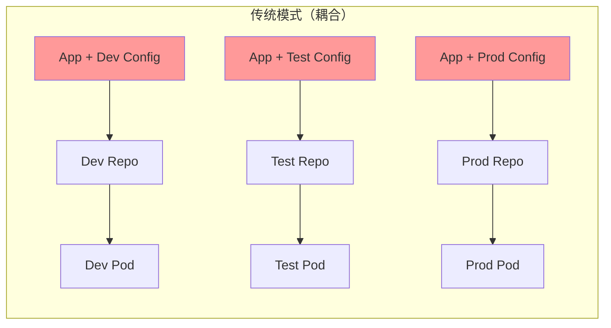
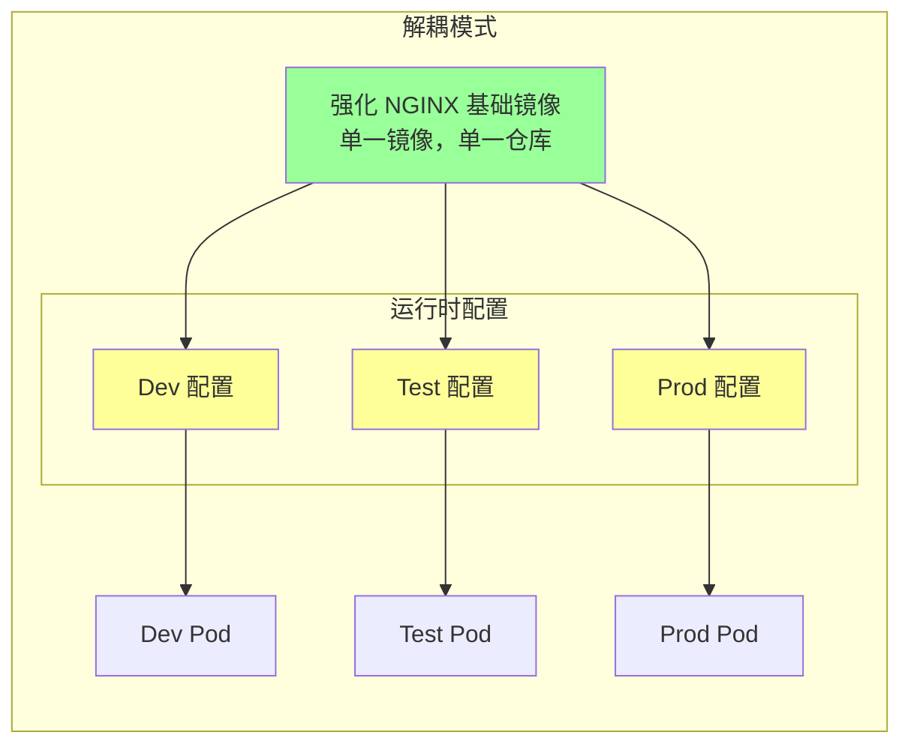
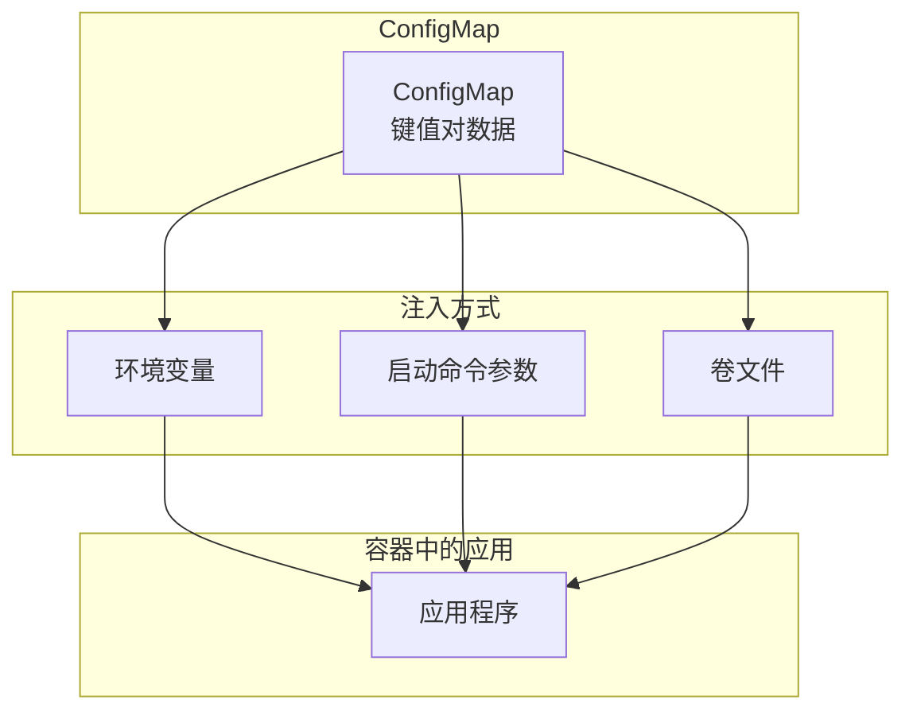
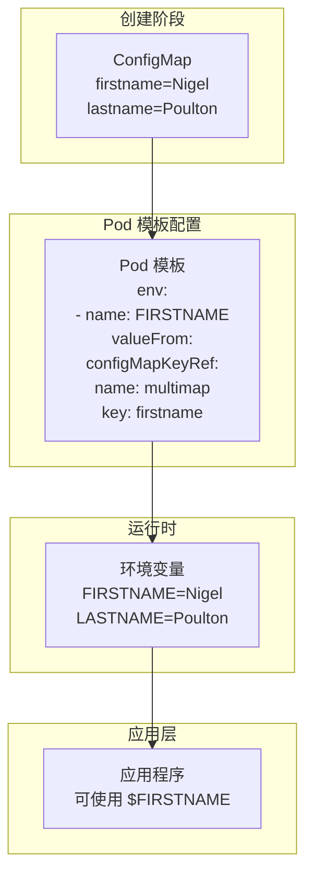
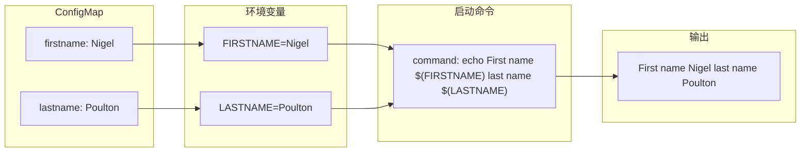
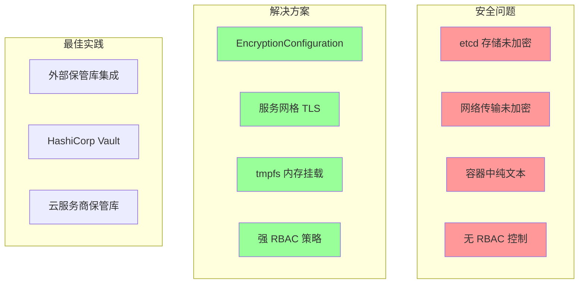

# ConfigMaps 和 Secrets

> [!TIP] 学习目标
> - 理解应用与配置分离的优势
> - 掌握 ConfigMap 的创建和使用方法
> - 了解 Secrets 的工作原理及安全考虑
> - 学会通过环境变量、启动命令和卷注入配置数据

## 12 ConfigMaps 和 Secrets

大多数业务应用程序都包含两个组件：

- 应用程序本身
- 配置文件

简单的例子包括 NGINX 和 httpd (Apache) 等 Web 服务器。在添加配置之前，它们都没有太大用处。

在过去，我们将应用程序及其配置打包成易于部署的单一单元，并将这种模式带入了云原生微服务早期阶段。然而，这是一种 [[Anti-Pattern|反模式]]，你应该将现代应用程序与其配置解耦，因为这能带来以下好处：

> [!NOTE] 反模式说明
> [[Anti-Pattern|反模式]]是指看起来是个好主意但最终证明是坏主意的做法。

- **可复用性** - 相同的镜像可以用于不同环境
- **简化开发和测试** - 配置独立于代码
- **更简单、破坏性更小的变更** - 可以独立更新配置

### 章节结构

本章分为以下几个部分：

1. 大局观 (The big picture)
2. ConfigMap 理论
3. ConfigMap 实践
4. Secrets 实践

> [!INFO] 提示
> 所有关于 ConfigMap 的知识都适用于后面章节中的 Secrets。

---

## 大局观

如前所述，大多数应用程序由应用程序二进制文件和配置组成。[[Kubernetes]] 允许你将它们构建为独立的对象，并在运行时将它们组合在一起。

### 场景示例

假设你在一家拥有三个环境的公司工作：

- **Dev** - 开发环境
- **Test** - 测试环境  
- **Prod** - 生产环境

你在 dev 环境中进行初步测试，在 test 环境中进行更广泛的测试，应用程序最终迁移到 prod 环境。然而，每个环境都有自己的网络和安全策略，以及自己独特的凭证和证书。

### 传统模式的问题

在传统模式中，你将应用程序及其配置打包在同一镜像中，这迫使你为每个应用程序执行以下所有操作：

1. 构建三个镜像（dev 配置、test 配置和 prod 配置各一个）
2. 将镜像存储在三个不同的仓库中
3. 在三个环境中运行应用程序的不同配置



每次更改应用程序时，即使是修复拼写错误这样的小改动，你也需要构建、测试、存储和重新部署三次——dev 一次、test 一次、prod 一次。

当每次更新都包含应用代码和配置时，故障排除和问题隔离也更加困难。

### 解耦后的世界

想象同样的公司，要求你构建一个新的 Web 应用程序。然而，现在公司会将代码和配置解耦。

你决定基于 NGINX 构建应用程序，并创建一个强化的 NGINX 基础镜像，供其他团队和应用程序用自己的配置来复用。这意味着：

- **你只构建一个镜像**，用于所有三个环境
- **你只在一个仓库中存储和保护该镜像**
- **你在所有环境中运行相同版本的镜像**

为了实现这一点，你构建一个只包含强化 NGINX 的单一基础镜像，不嵌入任何配置。



然后创建 dev、test 和 prod 的三个配置，在运行时应用。每个配置用应用程序配置、政策设置和正确环境的凭证来配置强化 NGINX 容器。其他团队和应用程序可以通过应用自己的配置来复用相同的强化 NGINX 镜像。

在这种模式下，你创建和测试单一版本的 NGINX，将其构建到单一镜像中，并存储在单一仓库中。你可以授予所有开发人员访问权限来拉取仓库，因为它不包含敏感数据，你可以独立推送对应用程序或其配置的更改。

例如，如果主页上有拼写错误，你可以在配置中修复并将其推送到所有三个环境中的现有容器。你不再需要停止并替换所有三个环境中的每个容器。

---

## ConfigMap 理论

[[Kubernetes]] 有一个名为 [[ConfigMap]] (CM) 的 API 资源，允许你在 [[Pod]] 外部存储配置数据，并在运行时注入。

### ConfigMap 的特点

ConfigMap 是核心 API 组中的一级对象，属于 v1 版本。这告诉我们几件事：

1. 它们是稳定的 (v1)
2. 它们已经存在一段时间了（新内容永远不会进入核心 API 组）
3. 你可以在 [[YAML]] 文件中定义和部署它们
4. 你可以用 [[kubectl]] 管理它们

### 使用场景

你通常使用 ConfigMap 存储非敏感配置数据，例如：

- [[环境变量]]
- 配置文件（如 Web 服务器配置和数据库配置）
- 主机名
- 服务名和服务端口
- 账户名称

> [!WARNING] 敏感数据处理
> 不应使用 ConfigMap 存储敏感数据（如证书和密码），因为 [[Kubernetes]] 不会保护其内容。对于敏感数据，应使用 [[Kubernetes Secrets]] 作为全面密钥管理解决方案的一部分。

### ConfigMap 工作原理

从高层次来看，ConfigMap 是一个用于存储配置数据的对象，可以轻松地在运行时注入到容器中。你可以配置它们使用环境变量和卷，以便它们与应用程序无缝配合。

在幕后，ConfigMap 是 [[Kubernetes]] 对象，包含一个键值对映射：

- **键（Key）**：可以是任意名称，包括字母数字、短划线、点和下划线
- **值（Value）**：可以存储任何内容，包括具有多行和回车符的完整配置文件
- **大小限制**：最大 1MiB (1,048,576 字节)

### ConfigMap 示例

以下是具有三个条目的 ConfigMap 示例：

```yaml
kind: ConfigMap
apiVersion: v1
metadata:
  name: epl
data:
  Competition: Premier League    # 键值对 1
  Season: 2024-2025             # 键值对 2
  Champions: Liverpool          # 键值对 3
```

以下是值是完整配置文件的示例：

```yaml
kind: ConfigMap
apiVersion: v1
metadata:
  name: cm2
data:
  test.conf: |
    env = plex-test
    endpoint = 0.0.0.0:31001
    char = utf8
    vault = PLEX/test
    log-size = 512M
```

### 注入方式

创建 ConfigMap 后，你可以使用以下任何一种方法在运行时将其注入到容器中：

1. **环境变量**
2. **容器启动命令的参数**
3. **卷中的文件**



> [!TIP] 最佳实践
> 所有三种方法都无需向现有应用程序添加 [[Kubernetes]] 知识即可工作。但是，**卷选项最为灵活**，因为它支持更新。

### ConfigMap 与 Kubernetes 原生应用

[[Kubernetes 原生应用]] 是知道自己在 [[Kubernetes]] 上运行并可以与 [[Kubernetes API Server]] 通信的应用程序。这有很多好处，包括能够直接通过 API 读取 ConfigMap，而无需将其挂载为卷或通过环境变量。这意味着实时容器可以看到 ConfigMap 的更新。

然而，这类应用只能运行在 [[Kubernetes]] 上，会造成 [[Kubernetes 锁定]]。

本章所有示例都使用环境变量和卷，以便现有应用程序可以在不需要重写或被锁定到 [[Kubernetes]] 的情况下访问 ConfigMap 数据。

---

## ConfigMap 实践

你需要一个 [[Kubernetes]] 集群和本书 GitHub 仓库中的实验文件：

```bash
$ git clone https://github.com/nigelpoulton/TKB.git
Cloning into 'TKB'...
$ cd TKB
$ git fetch origin
$ git checkout -b 2025 origin/2025
$ cd configmaps
```

> [!IMPORTANT] 确保你在 2025 分支上运行所有命令。

### 创建 ConfigMap（命令式）

你使用 `kubectl create configmap` 命令以命令式方式创建 ConfigMap。你可以缩短 `configmap` 为 `cm`，该命令接受两种数据源：

- 命令行中的字面值 (`--from-literal`)
- 文件 (`--from-file`)

#### 使用字面值创建

运行以下命令创建一个名为 `testmap1` 的 ConfigMap，并用两个命令行字面值填充：

```bash
$ kubectl create configmap testmap1 \
  --from-literal shortname=SAFC \
  --from-literal longname="Sunderland Association Football Club"
```

运行以下命令查看 [[Kubernetes]] 如何存储映射条目：

```bash
$ kubectl describe cm testmap1
Name:         testmap1
Namespace:    default
Labels:       <none>
Annotations:  <none>

Data
====
shortname:
----
SAFC
longname:
----
Sunderland Association Football Club
BinaryData
====
Events:  <none>
```

如你所见，它只是一个键值对映射，包装成 [[Kubernetes]] 对象。

#### 使用文件创建

以下命令使用 `--from-file` 标志从名为 `cmfile.txt` 的文件创建名为 `testmap2` 的 ConfigMap：

```bash
$ kubectl create cm testmap2 --from-file cmfile.txt
configmap/testmap2 created
```

### 检查 ConfigMap

ConfigMap 是一级 API 对象，这意味着你可以像任何其他 API 对象一样检查和查询它们。

列出当前命名空间中的所有 ConfigMap：

```bash
$ kubectl get cm
AME       DATA   AGE
testmap1   2      11m
testmap2   1      2m23s
```

以下 `kubectl describe` 命令显示关于你从本地文件创建的 `testmap2` 映射的一些有趣信息：

```bash
$ kubectl describe cm testmap2
Name:         testmap2
Namespace:    default
Labels:       <none>
Annotations:  <none>

Data
====
cmfile.txt:                   # 键
----
Kubernetes FTW!               # 值
BinaryData
====
Events:  <none>
```

你也可以运行带有 `-o yaml` 标志的 `kubectl get` 命令来查看整个对象：

```bash
$ kubectl get cm testmap2 -o yaml
apiVersion: v1
data:
  cmfile.txt: |
    Kubernetes FTW!
kind: ConfigMap
metadata:
  creationTimestamp: "2025-02-04T14:19:21Z"
  name: testmap2
  namespace: default
  resourceVersion: "18128"
  uid: 146da79c-aa09-4b10-8992-4dffa087dbfb
```

> [!INFO] 注意
> 如果你仔细观察，会发现缺少 `spec` 和 `status` 子资源。这是因为 ConfigMap 没有期望状态和观察状态的概念。它们有一个 `data` 子资源代替。

### 创建 ConfigMap（声明式）

以下 [[YAML]] 来自 `fullname.yml` 文件，定义了两个映射条目：`firstname` 和 `lastname`。它创建一个名为 `multimap` 的 ConfigMap，具有通常的 `kind`、`apiVersion` 和 `metadata` 字段，但它有一个 `data` 子资源而不是通常的 `spec`：

```yaml
kind: ConfigMap 
apiVersion: v1 
metadata:
  name: multimap 
data:
  firstname: Nigel
  lastname: Poulton
```

部署它：

```bash
$ kubectl apply -f fullname.yml
configmap/multimap created
```

### 存储完整配置文件

以下 [[YAML]] 对象来自 `singlemap.yml` 文件，看起来比前一个复杂。然而，它实际上更简单，因为它在 `data` 块中只有一个条目。它看起来更复杂是因为值条目包含一个完整的配置文件。

```yaml
kind: ConfigMap 
apiVersion: v1 
metadata:
  name: test-config
data:
  test.conf: |
    env = plex-test
    endpoint = 0.0.0.0:31001
    char = utf8
    vault = PLEX/test
    log-size = 512M
```

> [!TIP] 管道符说明
> 如果你仔细观察，会看到键属性名后面的管道符 (`|`)。这告诉 [[Kubernetes]] 将管道后的所有内容视为单个值。

部署后，你会得到以下表格所示的 ConfigMap，名为 `test-config`，只有一个复杂的映射条目：

| 对象名 | 键 | 值 |
|--------|------|------|
| test-config | test.conf | env = plex-test<br/>endpoint = 0.0.0.0:31001<br/>char = utf8<br/>vault = PLEX/test<br/>log-size = 512M |

部署它：

```bash
$ kubectl apply -f singlemap.yml 
configmap/test-config created
```

检查它：

```bash
$ kubectl describe cm test-config
Name:         test-config
Namespace:    default
Labels:       <none>
Annotations:  <none>

Data
====
test.conf:
----
env = plex-test
endpoint = 0.0.0.0:31001
char = utf8
vault = PLEX/test
log-size = 512M
BinaryData
====
Events:  <none>
```

---

## 将 ConfigMap 数据注入 Pod 和容器

有三种方法可以将 ConfigMap 数据注入容器：

1. **作为环境变量**
2. **作为容器启动命令的参数**
3. **作为卷中的文件**

前两种在创建容器时注入数据，无法更新运行中容器的值。卷选项也在创建时注入数据，但会自动将更新推送到实时容器。

### ConfigMap 和环境变量



你已经部署了一个名为 `multimap` 的 ConfigMap，包含以下两个条目：

- `firstname=Nigel`
- `lastname=Poulton`

以下 Pod 清单部署一个容器，其中两个环境变量映射到 ConfigMap 中的值。它来自你要部署的 `podenv.yml` 文件。

```yaml
apiVersion: v1
kind: Pod
spec:
  containers:
    - name: ctr1
      env:
        - name: FIRSTNAME       # 环境变量名为 FIRSTNAME
          valueFrom:           # 基于
            configMapKeyRef:   # ConfigMap
              name: multimap   # 名为 "multimap"
              key: firstname   # 并用 key 'firstname' 的值填充
        - name: LASTNAME       # 环境变量名为 LASTNAME
          valueFrom:           # 基于
            configMapKeyRef:   # ConfigMap
              name: multimap   # 名为 "multimap"
              key: lastname    # 并用 key 'lastname' 的值填充
```

> [!NOTE] 命名说明
> 我用大写字母给环境变量命名，以便你将它们与 ConfigMap 对应项区分开来。在现实中，你可以随意命名。

当 [[Kubernetes]] 调度 Pod 并启动容器时，它会创建 `FIRSTNAME` 和 `LASTNAME` 作为标准 [[Linux]] 或 [[Windows]] 环境变量，以便应用程序可以在不了解 ConfigMap 的情况下使用它们。

部署 Pod：

```bash
$ kubectl apply -f podenv.yml
pod/envpod created
```

运行以下 exec 命令列出容器中名称包含 "NAME" 的环境变量。你会看到 `FIRSTNAME` 和 `LASTNAME` 变量及其来自 ConfigMap 的值。

> [!IMPORTANT] 确保 Pod 运行后再执行命令。Windows 用户需要将 `grep NAME` 参数替换为 `Select-String -Pattern 'NAME'`。

```bash
$ kubectl exec envpod -- env | grep NAME
HOSTNAME=envpod
FIRSTNAME=Nigel    
LASTNAME=Poulton
```

> [!WARNING] 环境变量的限制
> 请记住，环境变量是静态的。这意味着你可以更新映射中的值，但 `envpod` 不会收到更新。

### ConfigMap 和容器启动命令

使用 ConfigMap 与容器启动命令的概念很简单。你在 Pod 模板中指定容器的启动命令，并以参数形式传入环境变量。

以下示例来自 `podstartup.yml` 文件。它描述了一个名为 `args1` 的单个容器，基于 `busybox` 镜像。然后定义并从 `multimap` ConfigMap 填充两个环境变量，并在容器的启动命令中引用它们。

```yaml
spec:
  containers:
    - name: args1
      image: busybox
      env:
        - name: FIRSTNAME
          valueFrom:
            configMapKeyRef:
              name: multimap
              key: firstname
        - name: LASTNAME
          valueFrom:
            configMapKeyRef:
              name: multimap
              key: lastname
      command: [ "/bin/sh", "-c", "echo First name $(FIRSTNAME) last name $(LASTNAME)" ]
```



从 `podstartup.yml` 文件启动一个新的 Pod。Pod 将启动，将 "First name Nigel last name Poulton" 打印到容器日志，然后退出（成功）。

```bash
$ kubectl apply -f podstartup.yml
pod/startup-pod created
```

运行以下命令检查容器的日志并验证它打印了 "First name Nigel last name Poulton"：

```bash
$ kubectl logs startup-pod -c args1
First name Nigel last name Poulton
```

描述 Pod 会显示有关环境变量的以下信息：

```bash
$ kubectl describe pod startup-pod
Environment:
  FIRSTNAME:  <set to the key 'firstname' of config map 'multimap'> 
  LASTNAME:  <set to the key 'lastname' of config map 'multimap'> 
```

> [!WARNING] 限制
> 如你所见，使用 ConfigMap 与容器启动命令仍然使用环境变量。因此，它受到相同的限制——ConfigMap 的更新不会推送到现有变量。

如果 `startup-pod` 正在运行，它应该处于完成状态，因为它完成了任务然后终止。删除它：

```bash
$ kubectl delete pod startup-pod
pod "startup-pod" deleted
```

### ConfigMap 和卷

使用 ConfigMap 与卷是最灵活的选项。它们让你引用整个配置文件，并且会收到更新。然而，更新可能需要一到两分钟才能出现在容器中。

```mermaid
flowchart TD
    subgraph ConfigMap
        CM[multimap<br/>firstname=Nigel<br/>lastname=Poulton]
    end
    
    subgraph Pod 定义
        V[volumes:<br/>- name: volmap<br/>  configMap:<br/>    name: multimap]
        
        VM[volumeMounts:<br/>- name: volmap<br/>  mountPath: /etc/name]
    end
    
    subgraph 容器内
        F1[/etc/name/firstname]
        F2[/etc/name/lastname]
    end
    
    CM --> V
    V --> VM
    VM --> F1
    VM --> F2
```

你已经部署了 `multimap` ConfigMap，它有以下值：

- `firstname=Nigel`
- `lastname=Poulton`

以下 [[YAML]] 来自 `podvol.yml` 文件，定义了一个名为 `cmvol` 的 Pod，具有以下配置：

```yaml
apiVersion: v1
kind: Pod
metadata:
  name: cmvol
spec:                             
  volumes:                        
    - name: volmap                # 创建名为 "volmap" 的卷
      configMap:                  # 基于 ConfigMap
        name: multimap            # 名为 "multimap"
  containers:
    - name: ctr
      image: nginx
      volumeMounts:               # 这些行将
        - name: volmap            # "volmap" 卷挂载到
          mountPath: /etc/name    # 容器的 "/etc/name"
```

部署 `cmvol` Pod：

```bash
$ kubectl apply -f podvol.yml
pod/cmvol created
```

等待 Pod 进入运行阶段，然后运行以下命令列出容器内 `/etc/name/` 目录中的文件：

```bash
$ kubectl exec cmvol -- ls /etc/name
firstname
lastname
```

> [!TIP] 验证内容
> 你可以看到容器有两个与 ConfigMap 条目匹配的文件。你可以运行更多 `kubectl exec` 命令来 `cat` 文件内容，确保它们与 ConfigMap 中的值匹配。

### 验证卷更新

现在让我们证明你对映射所做的更改会出现在你的实时 `cmvol` 容器中。

使用 `kubectl edit` 编辑 ConfigMap 并更改 `data` 块中的任何值。该命令将在你的默认编辑器中打开 [[YAML]] 对象（通常是 [[Linux]] 和 [[Mac]] 上的 `vi`，通常是 [[Windows]] 上的 `notepad.exe`）：

```bash
$ kubectl edit cm multimap
# Please edit the object below. Lines beginning with a '#' will be ignored...
#
apiVersion: v1
data:
  City: Macclesfield       # 已修改
  Country: UK              # 已修改
kind: ConfigMap
metadata:
```

保存你的更改并检查更新是否出现在容器中。更改可能需要大约一分钟才能出现：

```bash
$ kubectl exec cmvol -- ls /etc/name
City
Country
$ kubectl exec cmvol -- cat /etc/name/Country
UK
```

> [!SUCCESS] 恭喜
> 你已经将 `multimap` ConfigMap 的内容通过 ConfigMap 卷显示到容器的文件系统中，并且已经证明卷收到了你的更新。

---

## Secrets 实践

[[Secrets]] 的工作方式与 ConfigMap 相同——它们保存 [[Kubernetes]] 在运行时注入到容器的配置数据。但是，Secrets 旨在作为更全面的密钥管理解决方案的一部分，用于存储敏感数据，如密码、证书和 [[OAuth]] 令牌。

### Kubernetes Secrets 安全吗？

简短的回答是**不**。但这里有稍微长一点的答案……

> [!WARNING] 安全警告
> 一个安全的密钥管理系统涉及的内容远不止 [[Kubernetes Secrets]]。你必须考虑以下所有内容：
> 
> - 集群存储中静止时加密密钥
> - 网络传输中加密密钥
> - 在节点/Pod/容器中显示时保护密钥
> - 通过最小权限 [[RBAC]] 控制 API 访问密钥
> - 控制对 etcd 节点的访问（集群存储）
> - 阻止特权容器访问密钥
> - 阻止通过 [[GitHub]] 等源代码仓库暴露
> - 停用后安全删除密钥

大多数新的 [[Kubernetes]] 集群不执行任何这些操作——它们将密钥以未加密形式存储在集群存储中，在网络上以纯文本形式发送，并以纯文本形式挂载到容器中！

但是，你可以配置 [[EncryptionConfiguration]] 对象来加密集群存储中的 Secrets，部署服务网格来加密所有网络流量，并配置强 [[RBAC]] 来保护 API 访问 Secrets。你甚至可以限制对控制平面节点和 etcd 节点的访问，在使用后安全删除密钥，等等。

在现实世界中，许多生产集群实现服务网格来保护网络流量，它们将密钥存储在 [[Kubernetes]] 之外的第三方保管库中，如 [[HashiCorp Vault]] 或类似的云服务。[[Kubernetes]] 甚至有原生 [[Secrets Store CSI Driver]] 用于与外部保管库集成。



### 典型 Secrets 工作流

仅使用 [[Kubernetes Secrets]] 的典型工作流程如下：

1. 你创建 Secret，[[Kubernetes]] 将其作为未加密对象持久化到集群存储
2. 你调度一个带有使用该 Secret 的容器的 Pod
3. [[Kubernetes]] 通过网络将未加密的 Secret 传输到运行 Pod 的节点
4. 节点上的 [[kubelet]] 启动 Pod 及其容器
5. 容器运行时通过内存中的 tmpfs 文件系统将 Secret 挂载到容器中，并从 [[Base64]] 解码为纯文本
6. 应用程序消费它
7. 当你删除 Pod 时，[[Kubernetes]] 删除节点上的 Secret 副本（它在集群存储中保留副本）

### 创建 Secrets

记住，大多数 [[Kubernetes]] 安装不会对集群存储中的 Secrets 进行加密，也不会对网络传输中的 Secrets 进行加密。即使你实现了这些，它们在容器中总是以纯文本形式显示，以便应用程序轻松消费。

与所有 API 资源一样，你可以以命令式和声明式方式创建 Secrets。

运行以下命令创建一个名为 `creds` 的新 Secret：

```bash
$ kubectl create secret generic creds \
  --from-literal user=nigelpoulton \
  --from-literal pwd=Password123
```

> [!INFO] Base64 编码说明
> 你之前了解到 [[Kubernetes]] 通过 [[Base64]] 编码来混淆 Secrets。使用以下命令验证这一点：

```bash
$ kubectl get secret creds -o yaml
apiVersion: v1
kind: Secret
data:
  pwd: UGFzc3dvcmQxMjM=
  user: bmlnZWxwb3VsdG9u
```

用户名和密码值都是 [[Base64]] 编码的。

运行以下命令解码它们：

```bash
$ echo UGFzc3dvcmQxMjM= | base64 -d
Password123
```

> [!WARNING] 安全警告
> 解码成功完成且没有密钥，证明 [[Base64]] 编码**不安全**。因此，你绝不应该将 Secrets 存储在 [[GitHub]] 等平台上，因为任何有访问权限的人都可以读取它们。

### 声明式创建 Secrets

以下 [[YAML]] 对象来自 `configmaps` 文件夹中的 `tkb-secret.yml` 文件。它描述了一个名为 `tkb-secret` 的 Secret，包含两个 [[Base64]] 编码的条目。你可以通过将 `data` 块更改为 `stringData` 来添加纯文本条目，但你**绝不应该**将任何一种存储在 [[GitHub]] 等地方：

```yaml
apiVersion: v1
kind: Secret
metadata:
  name: tkb-secret
  labels:
    chapter: configmaps
type: Opaque
data:
  username: bmlnZWxwb3VsdG9u
  password: UGFzc3dvcmQxMjM=
```

部署到你的集群：

```bash
$ kubectl apply -f tkb-secret.yml 
secret/tkb-secret created
```

运行 `kubectl get` 和 `kubectl describe` 命令来检查它。

### 在 Pod 中使用 Secrets

在本节中，你将部署一个使用你在上一节中创建的 `tkb-secret` 的 Pod。

Secrets 的工作方式与 ConfigMap 相同，这意味着你可以将它们作为环境变量、命令行参数或卷注入到容器中。与 ConfigMap 一样，**最灵活的选项是卷**。

以下 [[YAML]] 来自 `secretpod.yml` 文件，描述了一个单容器 Pod，具有一个名为 `secret-vol` 的 Secret 卷，基于你之前创建的 `tkb-secret`。它将 `secret-vol` 挂载到容器中的 `/etc/tkb`：

```yaml
apiVersion: v1
kind: Pod
metadata:
  name: secret-pod
  labels:
    topic: secrets
spec:
  volumes:
  - name: secret-vol             # 卷名称
    secret:                      # 卷类型
      secretName: tkb-secret     # 用这个 Secret 的内容填充卷
  containers:
  - name: secret-ctr
    image: nginx
    volumeMounts:
    - name: secret-vol           # 挂载上面定义的卷
      mountPath: "/etc/tkb"      # 到这个路径
```

> [!INFO] 重要特性
> Secret 卷是 [[Kubernetes]] API 中的资源，[[Kubernetes]] 自动将它们以**只读**方式挂载，以防止容器和应用程序意外更改其内容。

部署 Pod。这会导致 [[Kubernetes]] 通过网络将未加密的 Secret 传输到运行 Pod 的节点上的 [[kubelet]]。然后容器运行时使用 tmpfs 挂载将其挂载到容器中：

```bash
$ kubectl apply -f secretpod.yml
pod/secret-pod created
```

运行以下命令查看 Secret 以两个文件的形式挂载在容器中的 `/etc/tkb`——每个条目一个文件：

```bash
$ kubectl exec secret-pod -- ls /etc/tkb                  
password
username
```

如果你检查任一文件的内容，你会看到它们以纯文本形式挂载，以便应用程序轻松消费：

```bash
$ kubectl exec secret-pod -- cat /etc/tkb/password
Password123
```

> [!SUCCESS] 完成
> 你已成功创建一个 Secret 并通过 Secret 卷将其挂载到 Pod 中。由于你选择了卷选项，你可以更新 Secret，应用程序将看到它。

### Secrets 最佳实践总结

> [!WARNING] 重要提醒
> 完整的密钥管理解决方案涉及的内容远不止在 [[Kubernetes Secrets]] 中存储敏感数据。你需要：
> 
> - 在静态时加密它们
> - 在传输中加密它们
> - 控制 API 访问
> - 限制 etcd 节点访问
> - 处理特权容器
> - 防止 Secret 清单文件托管在公共源代码控制仓库上
> 
> 大多数真实世界的解决方案将密钥数据存储在 [[Kubernetes]] 之外的第三方保管库中。

---

## 清理

使用 `kubectl get` 列出你部署的 Pod、ConfigMap 和 Secrets：

```bash
$ kubectl get pods
NAME           READY    STATUS       RESTARTS    AGE
cmvol          1/1      Running      0           27m
envpod         1/1      Running      0           22m
secret-pod     1/1      Running      0           16m

$ kubectl get cm
NAME                DATA    AGE
kube-root-ca.crt    1       71m    # 不要删除这个
multimap            2       19m
test-config         1       17m
testmap1            2       24m
testmap2            1       22m

$ kubectl get secrets
NAME          TYPE      DATA    AGE
creds         Opaque    2       4m55s
tkb-secret    Opaque    2       3m35s
```

现在删除它们。Pod 删除可能需要几秒钟：

```bash
$ kubectl delete pods cmvol envpod secret-pod
$ kubectl delete cm multimap test-config testmap1 testmap2
$ kubectl delete secrets creds tkb-secret
```

---

## 章节总结

> [!TIP] 关键要点

1. **[[ConfigMaps]] 和 [[Secrets]] 是将应用程序与其配置数据解耦的方式**

2. **两者都是 [[Kubernetes]] API 中的一级对象**
   - 可以命令式和声明式创建
   - 可以用 `kubectl` 检查

3. **[[ConfigMap]] 专为应用程序配置参数和完整配置文件而设计**
   - [[Secrets]] 用于敏感数据，旨作为更广泛密钥管理解决方案的一部分

4. **你可以将两者在运行时通过以下方式注入到容器中**：
   - 环境变量
   - 容器启动命令
   - 卷
   - **卷是首选方法，因为它们会将更改传播到实时容器**

5. **[[Kubernetes]] 不会自动加密以下位置的 Secrets**：
   - 集群存储中（静态）
   - 网络传输中（传输中）