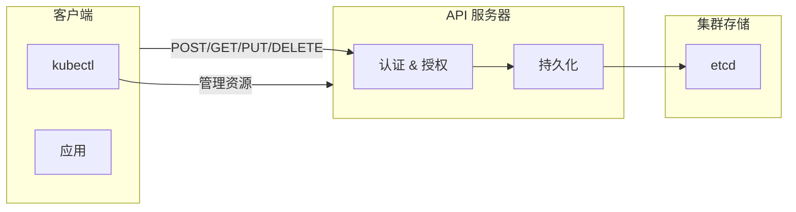
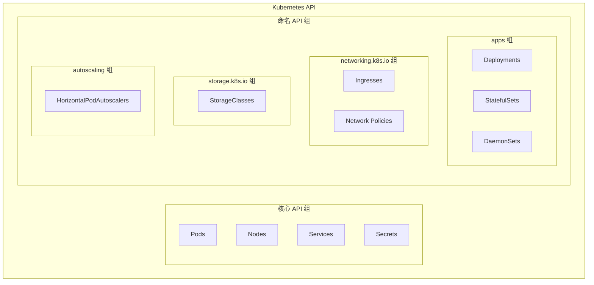
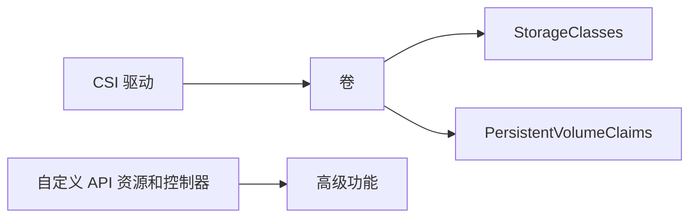

# Kubernetes API

> [!TIP]
> 如果你想掌握 Kubernetes，你需要理解 API 及其工作原理。然而，由于其规模庞大且复杂，对于 API 新手来说可能会感到困惑。本章将帮你消除这些困惑，让你快速掌握 Kubernetes API 的基础知识。

本章分为以下几个部分，最后两个部分包含大量动手实践内容：

- Kubernetes API 大局观
- API 服务器
- API

在开始之前，先提几点：

> [!INFO]
> 本章包含大量术语，帮助你熟悉它们。

> [!IMPORTANT]
> 强烈建议你完成动手实践部分，因为它们会强化理论学习。

> [!NOTE]
> Pod、Service、StatefulSet、StorageClass 等都是 API 中的资源。然而，当部署到集群时，通常称它们为对象。我们将交替使用术语"资源"和"对象"。

---

## Kubernetes API 大局观

Kubernetes 是**以 API 为中心**的。这意味着所有资源都在 API 中定义，所有配置和查询都通过 API 服务器进行。

管理员和客户端向 API 服务器发送请求，以创建、读取、更新和删除对象。他们通常使用 `kubectl` 发送这些请求，但也可以通过代码编写请求，或通过 API 测试和开发工具生成请求。关键点是，无论你如何生成请求，它们总是发送到 API 服务器，在那里进行身份验证和授权后才会被接受。如果是要创建对象的请求，Kubernetes 会将对象定义以序列化状态持久化到集群存储中，并调度到集群。

下图展示了高级别流程，并突出显示了 API 和 API 服务器的中心地位：



> [!NOTE]
> **API 服务器是 Kubernetes 的前端的集中点** —— 所有组件之间通过 REST API 调用相互通信。

---

## JSON 序列化

将对象以其序列化状态持久化到集群存储意味着什么？

**序列化**是将对象转换为字符串或字节流的过程，以便通过网络发送并持久化到数据存储中。反向过程（将字符串或字节流转换为对象）称为**反序列化**。

Kubernetes 将 Pod、Service 等对象序列化为 JSON 字符串，并通过 HTTP 在网络上发送。这个过程是双向的：

- 客户端（如 `kubectl`）在向 API 服务器发送对象时进行序列化
- API 服务器将响应序列化后返回给客户端

除了序列化对象以便在网络上传输外，Kubernetes 还将对象序列化以便存储到集群存储中。

> [!INFO]
> Kubernetes 支持 JSON 和 Protobuf 两种序列化模式：
> - **Protobuf**：更快、更高效，扩展性更好，但难以检查和排查
> - **JSON**：与外部客户端通信时更常用

在撰写本文时，Kubernetes 通常通过 JSON 与外部客户端通信，但在与内部集群组件通信时使用 Protobuf。

关于序列化的最后一点：客户端向 API 服务器发送请求时，使用 `Content-Type` 头列出它们支持的序列化模式。例如，只支持 JSON 的客户端会在所有请求的 HTTP 头中指定 `Content-Type: application/json`。Kubernetes 将遵守此设置，以 JSON 格式返回序列化响应。

---

## API 类比

考虑一个可能帮助你理解 Kubernetes API 的类比。如果你已经熟悉 API 的概念，可以跳过本节。

### Amazon 类比

**Amazon** 销售很多商品：

1. 商品存储在仓库中，通过 Amazon 网站在线展示
2. 你使用浏览器和应用等工具搜索网站并购买商品
3. 第三方通过 Amazon 销售自己的商品，你可以使用相同的浏览器和网站
4. 当你通过网站购买商品时，商品会被送达，你可以开始使用
5. Amazon 网站让你在商品准备和配送过程中跟踪你的商品
6. 商品送达后，你可以使用 Amazon 网站订购更多或退货

**Kubernetes** 非常相似：

| Amazon | Kubernetes |
|--------|-----------|
| 商品 (Stuff) | 资源/对象 (Resources/Objects) |
| 仓库 (Warehouse) | API |
| 浏览器 (Browser) | kubectl |
| Amazon 网站 | API 服务器 |

Kubernetes 有很多资源（如 Pod、Service、Ingress）：

1. Kubernetes 的资源在 API 中定义，通过 API 服务器暴露
2. 你使用 `kubectl` 等工具与 API 服务器通信并请求资源
3. 第三方定义自己的 Kubernetes 资源，你使用相同的 `kubectl` 和 API 服务器请求它们
4. 当你通过 API 服务器请求资源时，资源会在集群上创建，你可以开始使用它们
5. API 服务器让你可以观察对象的创建和部署过程
6. 对象创建后，你可以使用 API 服务器创建更多甚至删除它们

> [!NOTE]
> 这只是一个类比，所以并非所有方面都完全匹配。

### 总结

所有可部署对象（如 Pod、Service、Ingress）都在 API 中定义为资源。如果对象不存在于 API 中，你就无法部署它。这与 Amazon 相同 —— 你只能购买网站上列出的商品。

API 资源有你可以检查和配置的属性。例如，你可以配置以下 Pod 属性（仅展示部分）：

- `metadata`（名称、标签、命名空间、注解...）
- 重启策略
- 服务账户名称
- 运行时类
- 容器
- 卷

这与在 Amazon 上购买商品类似。例如，当你购买 USB 数据线时，你可以配置 USB 类型、数据线长度和数据线颜色等选项。

要部署 Pod，你需要将 Pod YAML 文件发送到 API 服务器。假设 YAML 有效且你有授权创建 Pod，Kubernetes 会将其部署到集群。之后，你可以查询 API 服务器获取其状态。当需要删除时，你向 API 服务器发送删除请求。

---

## API 服务器

> [!INFO]
> API 服务器通过 RESTful HTTPS 接口暴露 API，通常在端口 443 或 6443 上运行。不过，你可以将其配置为在任何需要的端口上运行。

运行以下命令查看 Kubernetes 集群暴露的地址和端口：

```bash
$ kubectl cluster-info
Kubernetes control plane is running at https://kubernetes.docker.
```

API 服务器充当 API 的前端，有点像 Kubernetes 的中央车站 —— 所有组件之间通过 REST API 调用相互通信。例如：

- 所有 `kubectl` 命令都发送到 API 服务器（创建、检索、更新和删除对象）
- 所有 kubelet 监视 API 服务器以获取新任务，并向 API 服务器报告状态
- 所有控制平面服务通过 API 服务器共享数据和状态信息

### API 服务器深入理解

API 服务器是一个 Kubernetes 控制平面服务，某些集群将其作为一组 Pod 运行在 `kube-system` 命名空间中。如果你构建和管理自己的集群，你需要确保控制平面是高可用的，并且有足够的性能以确保 API 服务器快速响应请求。如果你使用托管 Kubernetes，API 服务器的实现（包括性能和可用性）由你的云提供商管理。

> [!TIP]
> API 服务器的主要职责是向集群内外的客户端暴露 API。它使用 TLS 加密客户端连接，并利用身份验证和授权机制来确保只接受和执行有效请求。来自内部和外部源的请求都必须通过相同的身份验证和授权。

API 是 RESTful 的。这是现代 Web API 的术语，指通过标准 HTTP 方法接受 CRUD 样式请求。CRUD 样式操作是简单的创建、读取、更新、删除操作，它们映射到标准的 POST、GET、PUT、PATCH 和 DELETE HTTP 方法。

### CRUD 操作映射表

| K8s CRUD 动词 | HTTP 方法 | kubectl 示例 |
|--------------|-----------|-------------|
| create | POST | `kubectl create -f ` |
| get, list, watch | GET | `kubectl get pods` |
| update | PUT/PATCH | `kubectl edit deployment <deployment-name>` |
| delete | DELETE | `kubectl delete ingress <ingress-name>` |

> [!NOTE]
> 如你所见，CRUD 动词名称、HTTP 方法名称和 `kubectl` 子命令名称并不总是匹配的。例如，`kubectl edit` 命令使用 update CRUD 动词和 HTTP PATCH 方法。

### 关于 REST 和 RESTful

你会经常听到 REST 和 RESTful 这两个术语。REST 是 REpresentational State Transfer（表述性状态转移）的缩写，是与 Web API 通信的行业标准。使用 REST 的系统（如 Kubernetes）通常被称为 RESTful。

REST 请求由一个**动词**和一个**资源路径**组成。动词与操作相关，映射到你之前看到的标准 HTTP 方法。路径是 API 中资源的 URI 路径。

> [!INFO]
> **术语**：我们经常使用术语"动词"来指代 CRUD 操作以及 HTTP 方法。

以下示例展示了一个 `kubectl` 命令和相关的 REST 请求，用于列出 `shield` 命名空间中的所有 Pod：

```bash
$ kubectl get pods --namespace shield
GET /api/v1/namespaces/shield/pods
```

---

## 动手实践

> [!IMPORTANT]
> 你需要一份本书 GitHub 仓库的副本，并且需要在 2025 分支上工作。

```bash
$ git clone https://github.com/nigelpoulton/TKB.git
<Snip>
$ cd TKB
$ git fetch origin
$ git checkout -b 2025 origin/2025
```

运行以下命令启动 `kubectl proxy` 会话。这会在你的 localhost 适配器上暴露 API，并处理所有身份验证。

```bash
$ kubectl proxy --port 9000 &
[1] 27533
Starting to serve on 127.0.0.1:9000
```

### 使用 curl 测试 API

使用以下命令列出 `shield` 命名空间中的所有 Pod：

```bash
$ curl -X GET http://localhost:9000/api/v1/namespaces/shield/pods 
{
  "kind": "PodList",
  "apiVersion": "v1",
  "metadata": {
    "resourceVersion": "9524"
  },
  "items": []
}
```

获取集群上所有命名空间的列表：

```bash
$ curl -X GET http://localhost:9000/api/v1/namespaces
{
  "kind": "NamespaceList",
  "apiVersion": "v1",
  "metadata": {
    "resourceVersion": "9541"
  },
  "items": [
    {
      "metadata": {
        "name": "kube-system",
        "uid": "f5d39dd2-ccfe-4523-b634-f48ba3135663",
        "resourceVersion": "10",
<Snip>
```

### 深入了解 HTTP 头

> [!INFO]
> Kubernetes 使用 JSON 作为首选序列化模式。

运行之前的 curl 命令，但添加 `-v` 标志查看发送和接收的头：

```bash
$ curl -v -X GET http://localhost:9000/api/v1/namespaces/shield/pods
> GET /api/v1/namespaces/shield/pods HTTP/1.1    <<---- HTTP GET 方法
> Accept: */*                                    <<---- 接受任何格式
> 
< HTTP/1.1 200 OK                                <<---- 接受的请求
< Content-Type: application/json                 <<---- JSON 响应格式
< X-Kubernetes-Pf-Flowschema-Uid: d50...
< X-Kubernetes-Pf-Prioritylevel-Uid: 828...
< 
{                                                <<---- JSON 开始
  "kind": "PodList",
  "apiVersion": "v1",
  "metadata": {
    "resourceVersion": "34217"
  },
  "items": []
}
```

以 `>` 开头的行是由 curl 发送的头数据。以 `<` 开头的行是由 API 服务器返回的头数据。

### CRUD 操作示例

> [!INFO]
> **CRUD** 是 Web API 用于操作和持久化对象的四个基本函数的缩写 —— Create（创建）、Read（读取）、Update（更新）、Delete（删除）。如前所述，Kubernetes API 通过常见的 HTTP 方法暴露和实现 CRUD 样式操作。

以下 JSON 来自本书 GitHub 仓库 `api` 文件夹中的 `ns.json` 文件。它定义了一个名为 `shield` 的新命名空间对象：

```json
{
  "kind": "Namespace",
  "apiVersion": "v1",
  "metadata": {
    "name": "shield",
    "labels": {
      "chapter": "api"
    }
  }
}
```

运行以下 curl 命令将 `ns.json` 文件发布到 API 服务器：

```bash
$ curl -X POST -H "Content-Type: application/json" \
  --data-binary @ns.json http://localhost:9000/api/v1/namespaces
{
  "kind": "Namespace",
  "apiVersion": "v1",
  "metadata": {
    "name": "shield",
<Snip>
```

验证新的 `shield` 命名空间是否存在：

```bash
$ kubectl get ns
NAME              STATUS   AGE
kube-system       Active   47h
kube-public       Active   47h
kube-node-lease   Active   47h
default           Active   47h
shield            Active   14s
```

现在通过指定 DELETE HTTP 方法的 curl 命令删除命名空间：

```bash
$ curl -X DELETE \
  -H "Content-Type: application/json" http://localhost:9000/api/v1/namespaces/shield
{
  "kind": "Namespace",
  "apiVersion": "v1",
  "metadata": {
    "name": "shield",
<Snip>
  },
  "spec": {
    "finalizers": [
      "kubernetes"
    ]
  },
  "status": {
    "phase": "Terminating"
  }
}
```

> [!NOTE]
> 总结：API 服务器通过安全的 RESTful 接口暴露 API，让你操作和查询集群上对象的状态。它运行在控制平面上，控制平面需要高可用且有足够的性能来快速服务请求。

---

## API

API 是所有 Kubernetes 资源被定义的地方。它规模庞大、模块化且 RESTful。

> [!INFO]
> 当 Kubernetes 刚出现时，API 是单体的，所有资源都存在于一个全局命名空间中。然而，随着 Kubernetes 的发展，我们将 API 分成更小、更易于管理的组，称为命名组或子组。



### 核心 API 组

核心组是我们定义 Kubernetes 早期所有原始对象的地方（在其成长并分成组之前）。该组中的一些资源包括 Pod、Node、Service、Secret 和 ServiceAccount，你可以在 `/api/v1` REST 路径下找到它们。

**核心组资源示例 REST 路径：**

| 资源 | REST 路径 |
|------|----------|
| Pods | `/api/v1/namespaces/{namespace}/pods/` |
| Services | `/api/v1/namespaces/{namespace}/services/` |
| Nodes | `/api/v1/nodes/` |
| Namespaces | `/api/v1/namespaces/` |

> [!NOTE]
> 注意：某些对象有命名空间，某些没有。有命名空间的对象有更长的 REST 路径，因为你必须包含两个额外的段 —— `../namespaces/{namespace}/..`

- **命名空间 Pod 列表路径**：`GET /api/v1/namespaces/shield/pods/`
- **Node 列表路径**：`GET /api/v1/nodes/`

预期的读取请求 HTTP 响应代码是 200: OK 或 401: Unauthorized。

> [!TIP]
> 关于 REST 路径：**GVR** 代表 Group（组）、Version（版本）和 Resource（资源），是记住 REST 路径结构的好方法。

> [!WARNING]
> 你不应该期望任何新资源被添加到核心组。

### 命名 API 组

命名 API 组是我们添加所有新资源的地方，有时称为子组。

每个命名组是相关资源的集合。例如：

- `apps` 组定义 Deployments、StatefulSets、DaemonSets 等管理应用工作负载的资源
- `networking.k8s.io` 组定义 Ingresses、Ingress Classes 和 Network Policies
- `batch` 组定义 CronJobs 和 Jobs

> [!INFO]
> 资源在命名组中位于 `/apis/{group-name}/{version}/` REST 路径下。

**命名组资源示例 REST 路径：**

| 资源 | REST 路径 |
|------|----------|
| Ingress | `/apis/networking.k8s.io/v1/namespaces/{namespace}/ingresses/` |
| ClusterRole | `/apis/rbac.authorization.k8s.io/v1/clusterroles/` |
| StorageClass | `/apis/storage.k8s.io/v1/storageclasses/` |

> [!NOTE]
> 注意：命名组的 URI 路径以 `/apis`（复数）开头并包含组名。这与核心组不同，核心组以 `/api`（单数）开头且不包含组名。

将 API 分成更小的组使其更易扩展、更易于导航和扩展。

---

## 检查 API

### kubectl api-resources

```bash
$ kubectl api-resources
NAME                       SHORT    APIVERSION            NAMESPACED
namespaces                 ns       v1                    false   
nodes                      no       v1                    false   
pods                       po       v1                    true    
deployments                deploy   apps/v1               true    
replicasets                rs       apps/v1               true    
statefulsets               sts      apps/v1               true    
cronjobs                   cj       batch/v1              true    
jobs                       -        batch/v1              true    
horizontalpodautoscalers   hpa      autoscaling/v2        true    
ingresses                  ing      networking.k8s.io/v1  true    
networkpolicies            netpol   networking.k8s.io/v1  true    
storageclasses             sc       storage.k8s.io/v1     false   
```

### kubectl api-versions

```bash
$ kubectl api-versions
admissionregistration.k8s.io/v1
apiextensions.k8s.io/v1
apps/v1
<Snip>
autoscaling/v1
autoscaling/v2
v1
```

### 检查特定资源类型

```bash
$ for kind in `kubectl api-resources | tail +2 | awk '{ print $1 }'`; do kubectl explain $kind; done | grep -e "KIND:" -e "VERSION:"
KIND:     Binding
VERSION:  v1
KIND:     ComponentStatus
VERSION:  v1
<Snip>
KIND:     HorizontalPodAutoscaler
VERSION:  autoscaling/v2
KIND:     CronJob
VERSION:  batch/v1
KIND:     Job
VERSION:  batch/v1
<Snip>
```

### 通过 API 探索

列出核心 API 组下所有可用的 API 版本：

```bash
$ curl http://localhost:9000/api
{
  "kind": "APIVersions",
  "versions": [
    "v1"
  ],
  "serverAddressByClientCIDRs": [
    {
      "clientCIDR": "0.0.0.0/0",
      "serverAddress": "172.21.0.4:6443"
    }
  ]
}
```

列出所有命名 API 和组：

```bash
$ curl http://localhost:9000/apis
{
  "kind": "APIGroupList",
  "apiVersion": "v1",
  "groups": [
    {
      "name": "apps",
      "versions": [
        {
          "groupVersion": "apps/v1",
          "version": "v1"
        }
      ],
      "preferredVersion": {
        "groupVersion": "apps/v1",
        "version": "v1"
      }
    },
    <Snip>
```

列出所有命名空间：

```bash
$ curl http://localhost:9000/api/v1/namespaces
{
  "kind": "NamespaceList",
  "apiVersion": "v1",
  "metadata": {
    "resourceVersion": "35234"
  },
  "items": [
    {
      "metadata": {
        "name": "kube-system",
        "uid": "05fefa13-cbec-458b-aece-d65eb1972dfb",
        "resourceVersion": "4",
        "creationTimestamp": "2025-02-12T09:59:42Z",
        "labels": {
          "kubernetes.io/metadata.name": "kube-system"
        },
        "managedFields": [
          {
            "manager": "Go-http-client",
            "operation": "Update",
            "apiVersion": "v1",
<Snip>
```

> [!TIP]
> 随意探索。你可以将相同的 URI 路径放入浏览器和 Postman 等 API 工具中。

---

## Alpha、Beta 和 Stable

> [!INFO]
> Kubernetes 有一个完善的流程来接受新的 API 资源。它们作为 alpha 引入，经过 beta，最终毕业为 Generally Available（GA）。我们有时将 GA 称为 stable。

### API 版本成熟度阶段

| API 版本 | 阶段 | 说明 |
|---------|------|------|
| **Alpha** | 实验性 | 存在 bugs，功能可能变化，不推荐生产使用 |
| **Beta** | 预发布 | 接近最终发布版本，可能有小幅更改 |
| **GA (Generally Available)** | 稳定 | 生产就绪，长期支持承诺 |

### Alpha 版本

> [!WARNING]
> Alpha 资源是实验性的，你应该做好心理准备迎接 bug，可能会有功能变化。当它们进入 beta 时会经常变化。这就是为什么大多数集群默认禁用它们。

如果 `apps` API 组中一个名为 `tkb` 的新资源经历两个 alpha 版本，它将有以下 API 名称：

- `/apis/apps/v1alpha1/tkb`
- `/apis/apps/v1alpha2/tkb`

### Beta 版本

> [!CAUTION]
> Beta 资源被认为是预发布版本，应该与开发者期望的最终 GA 版本非常接近。但预期在晋升到 GA 时会有小的更改。大多数集群默认启用 beta API。

如果同一个 `tkb` 资源经历两个 beta 版本，Kubernetes 将通过以下 API 提供服务：

- `/apis/apps/v1beta1/tkb`
- `/apis/apps/v1beta2/tkb`

### GA (Stable) 版本

> [!TIP]
> GA 资源被认为是生产就绪的，Kubernetes 对它们有强烈的长期承诺。

大多数 GA 资源是 `v1`。然而，一些资源继续发展并演进到 `v2`。当你创建 `v2` 资源时，它会经历完全相同的孵化和毕业过程。例如：

- `/apis/apps/v2alpha1/tkb`
- `/apis/apps/v2beta1/tkb`
- `/apis/apps/v2/tkb`

### 稳定资源的真实示例

```
/apis/networking.k8s.io/v1/ingresses
/apis/batch/v1/cronjobs
/apis/autoscaling/v2/horizontalpodautoscalers
```

> [!NOTE]
> 你可以通过一个 API 部署对象，然后通过更新的 API 读取和管理它。例如，你可以通过 `v1beta2` API 部署对象，然后通过稳定的 `v1` API 更新和管理它。

---

## 资源弃用

> [!INFO]
> 如前所述，alpha 和 beta 对象在晋升到 GA 之前可能会经历很多变化。然而，GA 对象不会改变，Kubernetes 强烈致力于维护长期可用性和支持。

### Kubernetes 对 Beta 和 GA 资源的承诺

| 版本类型 | 弃用窗口期 |
|---------|-----------|
| **Beta** | 9 个月窗口发布更新的 beta 版本或晋升到 GA |
| **GA** | 弃用后继续服务和支持 12 个月或三个版本，以较长者为准 |

> [!WARNING]
> Kubernetes 只会在更新的稳定版本可用后才弃用现有稳定资源。例如，只有在相同资源的 v2 已经发布后才会弃用 v1 资源。

### 弃用处理

> [!IMPORTANT]
> 最近版本的 Kubernetes 在你部署弃用资源时执行以下三个操作：
> 1. 在 CLI 上返回弃用警告消息
> 2. 在请求的审计记录中添加 `k8s.io/deprecated:true` 注解
> 3. 设置 `apiserver_requested_deprecated_apis` gauge 指标

CLI 上的弃用警告消息给你即时反馈你使用了弃用的 API。其他两个允许你查询审计日志和处理日志以确定你是否使用了弃用的 API。在规划 Kubernetes 升级时，后两个可能很有用，因为它们帮助你了解是否使用了弃用资源。

---

## 扩展 API

> [!INFO]
> Kubernetes 附带了一组内置控制器，用于部署和管理内置资源。然而，你可以通过添加自己的资源和控制器来扩展 Kubernetes。

这是网络和存储供应商通过 Kubernetes API 暴露高级功能的流行方式（如快照调度或 IP 地址管理）。例如：



### 扩展 API 的高级模式

扩展 API 涉及两个主要方面：

1. 创建你的自定义资源
2. 编写和部署你的自定义控制器

### CustomResourceDefinition (CRD)

> [!NOTE]
> Kubernetes 有一个 CustomResourceDefinition (CRD) 对象，让你创建看起来、闻起来和感觉上像原生 Kubernetes 资源的新 API 资源。你将自定义资源创建为 CRD，然后使用 `kubectl` 创建实例并像原生资源一样检查它们。你的自定义资源甚至会在 API 中获得自己的 REST 路径。

以下 YAML 定义了一个新的集群范围自定义资源 `books`，位于 `nigelpoulton.com` API 组中，通过 `v1` 路径提供服务：

```yaml
apiVersion: apiextensions.k8s.io/v1
kind: CustomResourceDefinition
metadata:
  name: books.nigelpoulton.com
spec:
  group: nigelpoulton.com      # API 子组
  scope: Cluster               # 可以是 "Namespaced" 或 "Cluster"
  names:
    plural: books              # 所有资源需要复数名称
    singular: book             # 单数名称用于 kubectl
    kind: Book                 # YAML 中的 kind 属性
    shortNames:
    - bk                       # 可用于 kubectl 的简称
  versions:                    # 资源可以由多个版本提供服务
    - name: v1                  
      served: true             # 如果设为 false，"v1" 将不可用
      storage: true            # 将对象实例存储到此版本
      schema:                  # 定义资源的 schema
        openAPIV3Schema:
          type: object
          properties:
            spec:
              type: object
              properties:
                <Snip>
```

### 动手实践：部署自定义资源

```bash
$ cd TKB/api
$ kubectl apply -f crd.yml
customresourcedefinition.apiextensions.k8s.io/books.nigelpoulton.com created
```

> [!TIP]
> 恭喜！新资源存在于 API 中，Kubernetes 通过以下 REST 路径提供服务：
> `apis/nigelpoulton.com/v1/books/`

验证它存在于 API 中：

```bash
$ kubectl api-resources | grep books
NAME      SHORTNAMES     APIGROUP                NAMESPACED     KIND
books     bk             nigelpoulton.com/v1     false          Book

$ kubectl explain book
GROUP:      nigelpoulton.com
KIND:       Book
VERSION:    v1
```

### 创建 Book 对象实例

```yaml
apiVersion: nigelpoulton.com/v1
kind: Book
metadata:
  name: ai
spec:
  bookTitle: "AI Explained"
  subTitle: "Facts, Fiction, and Future"
  topic: "Artificial Intelligence"
  edition: 1
  salesUrl: https://www.amazon.com/dp/1916585388
```

部署并验证：

```bash
$ kubectl apply -f book.yml
book.nigelpoulton.com/ai created

$ kubectl get bk
NAME    TITLE           SUBTITLE                      EDITION    
ai      AI Explained    Facts, Fiction, and Future    1          w
```

### 查询自定义 API 组

```bash
$ kubectl proxy --port 9000 &
[1] 14784
Starting to serve on 127.0.0.1:9000

$ curl http://localhost:9000/apis/nigelpoulton.com/v1/
{
  "kind": "APIResourceList",
  "apiVersion": "v1",
  "groupVersion": "nigelpoulton.com/v1",
  "resources": [
    {
      "name": "books",
      "singularName": "book",
      "namespaced": false,
      "kind": "Book",
      "verbs": [
        "delete",
        "deletecollection",
        "get",
        "list",
        "patch",
        "create",
        "update",
        "watch"
      ],
      "shortNames": [
        "bk"
      ],
      "storageVersionHash": "F2QdXaP5vh4="
    }
  ]
}
```

> [!NOTE]
> 自定义资源在创建自定义控制器来处理它们之前不会做任何有用的事情。编写你自己的控制器超出了本章的范围，但你已经学到了很多关于 Kubernetes API 及其工作原理的知识。

---

## 清理

如果你一直在跟随操作，你需要清理以下资源：

- kubectl proxy 进程
- ai book 资源
- books.nigelpoulton.com 自定义资源 (CRD)

### 停止 kubectl proxy 进程

```bash
# Linux 和 Mac
$ ps | grep kubectl
PID     TTY       TIME      CMD
27533   ttys001   0:03.13   kubectl proxy --port 9000

$ kill -9 27533
[1]  + 27533 killed     kubectl proxy --port 9000

# Windows
> tasklist | Select-String -Pattern 'kubectl'
Image Name       PID  Session Name   Session#
=============  =====  ============   ========
kubectl.exe    19776  Console               1     

> taskkill /F /PID 19776
SUCCESS: The process with PID 19776 has been terminated.
```

### 删除资源

```bash
$ kubectl delete book ai
book.nigelpoulton.com "ai" deleted

$ kubectl delete crd books.nigelpoulton.com
customresourcedefinition.apiextensions.k8s.io "books.nigelpoulton.com" deleted
```

---

## 章末总结

> [!NOTE]
> 现在你已经阅读了本章，以下所有内容都应该有意义。但如果你仍然对某些部分感到困惑，不要担心。API 可能很难理解，Kubernetes API 规模庞大且复杂。

### 核心要点

1. **Kubernetes 是 API 驱动的平台**，API 通过 API 服务器在内部和外部暴露。

2. **API 服务器作为控制平面服务运行**，所有内部和外部客户端都通过 API 服务器与 API 交互。这意味着你的控制平面需要高可用和高性能。如果不是，你将面临 API 响应缓慢或完全失去 API 访问的风险。

3. **Kubernetes API 是一个现代的基于资源的 RESTful API**，通过标准的 HTTP 方法（如 POST、GET、PUT、PATCH 和 DELETE）接受 CRUD 样式的操作。它被分成命名组以便于使用和扩展。

4. **API 分组结构**：
   - **核心组**：早期 Kubernetes 创建的旧资源，通过 `/api/v1` REST 路径访问
   - **命名组**：所有新对象进入命名组。例如，较新的网络资源定义在 `networking.k8s.io` 组中

5. **版本成熟度**：
   - Alpha → Beta → GA (Stable)
   - Kubernetes 对 beta 有 9 个月承诺，对 GA 有 12 个月/三版本承诺

6. **API 扩展**：可以使用 CRD（CustomResourceDefinition）扩展 Kubernetes API 来创建自定义资源

> [!TIP]
> 如果你对 API 的某些方面仍然感到困惑，这完全正常。建议你回到动手实践部分，多练习使用 `kubectl` 和 API 交互。你对 API 的理解会随着实践而加深。