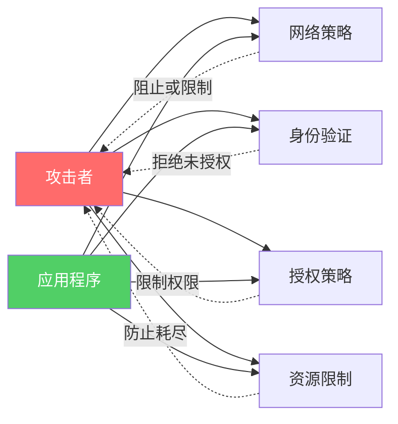

# 威胁建模 Kubernetes

安全性比以往任何时候都更加重要，Kubernetes 也不例外。幸运的是，您可以采取很多措施来保护 Kubernetes，下一章中您将看到一些方法。然而，在此之前，对一些常见威胁进行建模是个好主意。

## 威胁建模

**威胁建模**是识别漏洞的过程，以便您可以采取措施来预防和缓解这些威胁。本章介绍流行的 **STRIDE 模型**，并展示如何将其应用于 Kubernetes。

STRIDE 定义了六种潜在威胁类别：

> [!NOTE] STRIDE 威胁类别
> - **Spoofing（伪装）**：冒充他人以获取额外权限
> - **Tampering（篡改）**：恶意更改某些内容
> - **Repudiation（抵赖）**：对某事产生疑虑
> - **Information disclosure（信息泄露）**：敏感数据被泄露
> - **Denial of service（拒绝服务）**：使某物不可用
> - **Elevation of privilege（权限提升）**：获得比授予的更高的访问权限

虽然该模型很好，提供了结构化评估方法，但没有模型能保证覆盖所有威胁。

本章剩余部分将逐一介绍六种威胁类别。对于每种威胁，我们先给出简要描述，然后查看它如何应用于 Kubernetes。

> [!TIP]
> 本章并不试图涵盖所有内容。目标是为您提供思路，让您入门。

---

## Spoofing（伪装）

**伪装**是指冒充他人，目的是获取额外权限。

让我们看看 Kubernetes 防止不同类型伪装的一些方法。

### 保护与 API Server 的通信

Kubernetes 由许多协同工作的小组件组成。这些组件包括 **API Server**、**控制器管理器**、**调度器**、**集群存储**等。它还包括节点组件，如 **kubelet** 和 **容器运行时**。每个组件都有自己的权限，可以与集群交互和修改集群。尽管 Kubernetes 实现了最小权限模型，但伪装任何这些组件的身份都可能造成问题。

如果您读过 RBAC 和 API 安全章节，您会知道 Kubernetes 要求所有组件通过加密签名证书（**mTLS**）进行身份验证。这很好，Kubernetes 通过自动轮换证书使其变得简单。但是，您必须考虑以下几点：

> [!WARNING]
> 1. 典型的 Kubernetes 安装会自动生成一个**自签名证书颁发机构 (CA)**，为所有集群组件颁发证书。虽然这比什么都没有要好，但它本身对于生产环境来说是不够的。

> [!WARNING]
> 2. 双向 TLS (mTLS) 的安全性取决于颁发证书的 CA。 compromise CA 可能使整个 mTLS 层失效。因此，务必保护 CA 的安全！

> [!TIP]
> 一个好的做法是确保由内部 Kubernetes CA 颁发的证书仅在 Kubernetes 集群内使用和信任。这需要对证书签名请求进行仔细审批，并确保 Kubernetes CA 不会被添加到集群外部任何系统的可信 CA 中。

如前几章所述，对 API Server 的所有内部和外部请求都需经过身份验证和授权检查。因此，API Server 需要一种方法来**认证（信任）**内部和外部来源。一个好的方法是设置两个可信密钥对：

- 一个用于认证内部系统
- 另一个用于认证外部系统

在此模型中，您将使用集群的自签名 CA 为内部系统颁发密钥。然后配置 Kubernetes 信任一个或多个可信的第三方 CA 以进行外部系统认证。

### 保护 Pod 通信

除了伪装对集群的访问外，还存在伪装应用间通信的威胁。在 Kubernetes 中，这可能是一个 Pod 伪装成另一个 Pod。幸运的是，Pod 可以使用证书来验证其身份。

每个 Pod 都有一个关联的 **ServiceAccount**，用于为 Pod 提供身份。这是通过自动将服务账户令牌作为 Secret 挂载到每个 Pod 中实现的。有两点需要注意：

> [!NOTE]
> 1. 服务账户令牌允许访问 API Server
> 2. 大多数 Pod 可能不需要访问 API Server

考虑到这两点，您应该将不需要与 API Server 通信的 Pod 的 `automountServiceAccountToken` 设置为 `false`。以下 Pod 清单展示了如何做到这一点：

```yaml
apiVersion: v1
kind: Pod
metadata:
  name: service-account-example-pod
spec:
  serviceAccountName: some-service-account
  automountServiceAccountToken: false       # <<---- 这一行
  # <Snip>
```

如果 Pod 确实需要与 API Server 通信，以下非默认配置值得探索：

- `expirationSeconds`
- `audience`

这些配置允许您强制设置令牌过期时间，并限制它可以工作的实体。以下示例（灵感来自官方 Kubernetes 文档）设置了一小时的过期期限，并在投影卷中将访问权限限制为 `vault` ：

```yaml
apiVersion: v1
kind: Pod
metadata:
  name: nginx
spec:
  containers:
  - image: nginx
    name: nginx
    volumeMounts:
    - mountPath: /var/run/secrets/tokens
      name: vault-token
  serviceAccountName: my-pod
  volumes:
  - name: vault-token
    projected:
      sources:
      - serviceAccountToken:
          path: vault-token
          expirationSeconds: 3600     # <<---- 这一行
          audience: vault             # <<---- 还有这一行
```

---

## Tampering（篡改）

**篡改**是以恶意方式更改某些内容的行为，可能导致以下情况：

- **拒绝服务**：篡改资源使其不可用
- **权限提升**：篡改资源以获得额外权限

篡改可能很难避免，因此一个常见的对策是使篡改变得明显。常见的非 Kubernetes 示例是药品包装——大多数非处方药都带有防篡改密封，可以明显看出产品是否被篡改。

### 篡改 Kubernetes 组件

篡改以下任何 Kubernetes 组件都可能导致问题：

- etcd
- API Server、控制器管理器、调度器、etcd 和 kubelet 的配置文件
- 容器运行时二进制文件
- 容器镜像
- Kubernetes 二进制文件

一般来说，篡改要么发生在传输过程中，要么发生在静态时。**传输中**指的是数据在网络上传输时，而**静态**指的是存储在内存或磁盘上的数据。

TLS 是保护传输中数据免受篡改的好工具，因为它提供内置的完整性保证，在数据被篡改时会发出警告。

> [!TIP]
> 以下建议也有助于防止 Kubernetes 中静态数据的篡改：

1. 限制运行 Kubernetes 组件的服务器（尤其是控制平面组件）的访问权限
2. 限制存储 Kubernetes 配置文件的仓库的访问权限
3. 仅通过 SSH 执行远程引导（记住保护您的 SSH 密钥安全）
4. 始终对下载文件运行 SHA-2 校验和
5. 限制对镜像仓库及相关仓库的访问

这不是一份详尽的列表。然而，实施这些措施将大大降低数据在静态时被篡改的可能性。

> [!NOTE]
> 除了列出的项目之外，配置重要二进制文件和配置文件的审计和告警是良好的生产卫生实践。如果配置和监控得当，这些可以帮助检测潜在的篡改攻击。

以下示例使用常见的 Linux 审计守护进程来审计对 `docker` 二进制文件的访问。它还审计尝试更改二进制文件属性的行为：

```bash
$ auditctl -w /usr/bin/docker -p wxa -k audit-docker
```

我们稍后将在本章中引用此示例。

### 篡改在 Kubernetes 上运行的应用程序

恶意行为者也会针对应用程序组件以及基础设施组件进行攻击。

防止正在运行的 Pod 被篡改的一个好方法是将文件系统设置为只读。这保证了文件系统的不可变性，您可以通过 Pod 清单文件的 `securityContext` 部分进行配置。

您可以通过将 `readOnlyRootFilesystem` 属性设置为 `true` 来使容器的根文件系统只读。您也可以通过 `allowedHostPaths` 属性对其他容器文件系统执行相同操作。

以下 YAML 显示如何在 Pod 清单中配置这两个设置。在示例中，`allowedHostPaths` 部分确保挂载在 `/test` 下的任何内容都是只读的：

```yaml
apiVersion: v1
kind: Pod
metadata:
  name: readonly-test
spec:
  securityContext:
    readOnlyRootFilesystem: true     # <<---- 只读根文件系统
    allowedHostPaths:                # <<---- 使挂载点下的
      - pathPrefix: "/test"          # <<---- 任何内容
        readOnly: true               # <<---- 都变成只读 (R/O)
  # <Snip>
```

---

## Repudiation（抵赖）

从高层次来看，**抵赖**是关于对某事产生疑虑。**不可否认性**则是提供某事的证明。在信息安全的背景下，不可否认性是证明某些个人执行了某些操作的能力。

更深入地说，不可否认性包括证明以下内容的能力：

- 发生了什么
- 何时发生的
- 谁造成的
- 在哪里发生的
- 为什么发生
- 如何发生的

回答最后两个可能最难，通常需要在一段时间内关联多个事件。

审计 Kubernetes API Server 事件可以帮助回答这些问题。以下是 API Server 审计事件的示例（您可能需要在 API Server 上启用审计功能）：

```json
{
  "kind":"Event",
  "apiVersion":"audit.k8s.io/v1",
  "metadata":{ "creationTimestamp":"2022-11-11T10:10:00Z" },
  "level":"Metadata",
  "timestamp":"2022-11-11T10:10:00Z",
  "auditID":"7e0cbccf-8d8a-4f5f-aefb-60b8af2d2ad5",
  "stage":"RequestReceived",
  "requestURI":"/api/v1/namespaces/default/persistentvolumeclaims",
  "verb":"list",
  "user": {
    "username":"fname.lname@example.com",
    "groups":[ "system:authenticated" ]
  },
  "sourceIPs":[ "123.45.67.123" ],
  "objectRef": {
    "resource":"persistentvolumeclaims",
    "namespace":"default",
    "apiVersion":"v1"
  },
  "requestReceivedTimestamp":"2022-11-11T10:10:00.123456Z",
  "stageTimestamp":"2022-11-11T10:10:00.123456Z"
}
```

> [!NOTE]
> API Server 不是您应该审计以实现不可否认性的唯一组件。至少，您应该从容器运行时、kubelet 和在集群上运行的应用程序收集审计日志。您还应该审计非 Kubernetes 基础设施，如网络防火墙。

一旦开始审计多个组件，您需要一个集中位置来存储和关联事件。一种常见方式是通过 DaemonSet 在所有节点上部署代理。该代理收集日志（运行时、kubelet、应用程序等）并将其发送到安全的中央位置。

> [!WARNING]
> 如果您这样做，集中式日志存储必须是安全的。如果不是，您将无法信任日志，其内容可以被否认。

为了提供相对于二进制文件和配置文件篡改的不可否认性，使用审计守护进程来监视 Kubernetes 控制平面节点和工作节点上某些文件和目录的写入操作可能很有用。例如，您之前在章节中看到了一种审计 `docker` 二进制文件更改的方法。启用此功能后，使用 `docker run` 命令启动新容器将生成如下事件：

```bash
type=SYSCALL msg=audit(1234567890.123:12345): arch=abc123 syscall=exit=0 a0=12345678abc a1=0 a2=abc12345678 a3=a items=1 ppid=1234 pid=1234 uid=0 gid=0 euid=0 suid=0 fsuid=0 egid=0 sgid=0 fsgid=0 tty=pts0 exe="/usr/bin/docker" subj=system_u:object_r:container_runtime_exec_t:s0 key="audit-docker"
type=CWD msg=audit(1234567890.123:12345): cwd=/
type=PATH msg=audit(1234567890.123:12345): item=0 name="/usr/bin/docker" inode=123456 dev=fd:00 mode=0100600 ouid=0 ogid=0 rdev=00:00...
```

当与 Kubernetes 的审计功能结合使用时，像这样的审计日志会创建一个无法被否认的全面且可信的情况。

---

## Information Disclosure（信息泄露）

**信息泄露**是指敏感数据被泄露。常见示例包括被黑客入侵的数据存储和无意中暴露敏感数据的 API。

### 保护集群数据

整个 Kubernetes 集群的配置存储在集群存储（通常是 etcd）中。这包括网络和存储配置、密码、集群 CA 等。这使得集群存储成为信息泄露攻击的主要目标。

> [!WARNING]
> 至少，您应该限制和审计托管集群存储的节点的访问。正如您将在下一段中看到的，获得对集群节点的访问权限可以让登录用户绕过某些安全层。

Kubernetes 1.7 引入了 Secret 的加密，但没有默认启用。即使这成为默认设置，数据加密密钥 (DEK) 也存储在与 Secret 相同的节点上！这意味着获得节点访问权限可以让您绕过加密。这对于托管集群存储（etcd 节点）的节点尤其令人担忧。

Kubernetes 1.11 发布了密钥管理服务 (KMS v1) 作为 beta 功能，允许您将密钥加密密钥 (KEK) 存储在 Kubernetes 集群外部。KEK 用于加密和解密数据加密密钥 (DEK)，应妥善保管。我们称这种方法为"信封加密"。

此后，我们完全重新设计了 KMS，用新的 KMS v2 替换了旧的 KMS v1，自 Kubernetes v1.29 起已正式发布 (GA)。这是一个完全重新设计，具有许多改进，包括：

> [!TIP] KMS v2 改进
> - **每次加密生成新 DEK**：每次写操作都会生成新的 DEK，并使用 KEK 在静态时加密
> - **缓存大小仅受底层控制平面节点资源限制**：这允许在内存中缓存先前的 DEK，以加快加密和解密操作
> - **零停机重新加密操作**：密钥轮换后重新加密 Secret 不再需要 API Server 停机或 Pod 重启

> [!NOTE]
> KMS 插件在控制平面节点上运行，通过 Unix 套接字与 API Server 通信。KMS 插件然后连接到外部 KMS 提供商来处理数据加密密钥 (DEK) 的加密和解密。

所有这些意味着攻击者现在需要同时 compromise Kubernetes 控制平面和外部 KMS。控制平面节点的快照不足以读取明文形式的 Secret。

> [!TIP]
> 因此，您应该认真考虑将 KEK 存储在硬件安全模块 (HSM) 或基于云的密钥管理存储 (KMS) 中。此外，与所有加密相关的事情一样，您应该遵循"信任但要验证"模型，并确保基于 KMS v2 插件的加密按预期工作，同时为 KEK 丢失或与外部 KMS 提供商连接中断等意外情况制定应急计划。

### 保护 Pod 中的数据

如前所述，Kubernetes 有一个名为 Secret 的 API 资源，是存储和共享敏感数据（如密码）的首选方式。例如，访问加密后端数据库的前端容器可以将解密数据库的密钥作为 Secret 挂载。这比将解密密钥存储在纯文本文件或环境变量中要好得多。

将数据和配置信息存储在 Pod 和容器外部的 Persistent Volumes 和 ConfigMaps 中也很常见。如果这些数据是加密的，您应该将解密密钥存储在 Secret 中。

> [!WARNING]
> 尽管所有这些，您必须考虑上一节中关于 Secret 及其加密密钥存储方式的注意事项。您不想在锁好房子却把钥匙留在门上。

---

## Denial of Service（拒绝服务）

**拒绝服务 (DoS)** 是关于使某物不可用。有许多类型的 DoS 攻击，但众所周知的变体是使系统过载到无法再处理请求的程度。在 Kubernetes 世界中，潜在攻击可能是使 API Server 过载，以至于集群操作陷入停顿（即使内部系统也使用 API Server 进行通信）。

让我们看一些可能成为 DoS 攻击目标的潜在 Kubernetes 系统，以及一些保护和缓解方法。

### 保护集群资源免受 DoS 攻击

复制关键服务以实现高可用性 (HA) 是一项悠久的最佳实践。Kubernetes 也不例外，您应该在生产环境中以 HA 配置运行多个控制平面节点。这样可以防止任何控制平面节点成为单点故障。与某些类型的 DoS 攻击相关，攻击者可能需要攻击多个控制平面节点才能产生有意义的影响。

> [!TIP]
> 您还应该跨可用区复制控制平面节点。这可能可以防止特定可用区网络的 DoS 攻击导致整个控制平面瘫痪。

相同的原则也适用于工作节点。拥有多个工作节点不仅允许调度器将您的应用程序分散到多个可用区，而且还可以使针对任何单个节点或可用区的 DoS 攻击无效（或效果较差）。

您还应该为以下内容配置适当的限制：

- 内存
- CPU
- 存储

此类限制有助于防止关键系统资源被耗尽，从而防止潜在的 DoS。

限制 Kubernetes 对象也是一种好习惯。这包括限制特定命名空间中的 ReplicaSets、Pod、Service、Secret 和 ConfigMaps 数量。

以下是一个示例清单，将 `skippy` 命名空间中的 Pod 对象数量限制为 100：

```yaml
apiVersion: v1
kind: ResourceQuota
metadata:
  name: pod-quota
  namespace: skippy
spec:
  hard:
    pods: "100"
```

还有一项功能——`podPidsLimit`——限制 Pod 可以创建的进程数量。

假设一个 Pod 是 fork bomb 攻击的目标，恶意进程试图通过创建足够多的进程来消耗所有系统资源来关闭系统。如果您已使用 `podPidsLimit` 配置 Pod 以限制 Pod 可以创建的进程数量，您将防止它耗尽节点资源并将攻击影响限制在 Pod 范围内。Kubernetes 通常会在 Pod 耗尽其 `podPidsLimit` 后重启 Pod。

> [!NOTE]
> 这还确保单个 Pod 不会耗尽节点上所有其他 Pod（包括 kubelet）的 PID 范围。但是，设置正确的值需要合理估计每个节点上同时运行的 Pod 数量，如果没有粗略估计，您可以轻松地过度或不足分配每个 Pod 的 PID。

### 保护 API Server 免受 DoS 攻击

API Server 通过 TCP 套接字公开 RESTful 接口。这使其成为僵尸网络 DoS 攻击的目标。

以下可能有助于防止或缓解此类攻击：

> [!TIP] API Server DoS 防护
> - **高可用控制平面节点**：在多个可用区的多个节点上运行 API Server 的多个副本
> - **基于合理阈值的 API Server 请求监控和告警**
> - **使用防火墙限制 API Server 对互联网的暴露**

除了僵尸网络 DoS 攻击外，攻击者还可能试图伪装用户或其他控制平面服务以导致过载。幸运的是，Kubernetes 具有强大的身份验证和授权控制来防止伪装。但是，即使有强大的 RBAC 模型，您也必须保护具有高权限的账户访问。

### 保护集群存储免受 DoS 攻击

Kubernetes 将集群配置存储在 etcd 中。这使得 etcd 必须可用且安全。以下建议有助于实现这一目标：

> [!TIP] etcd 保护措施
> - 配置由 3 或 5 个节点组成的 HA etcd 集群
> - 配置对 etcd 请求的监控和告警
> - 在网络级别隔离 etcd，使只有控制平面成员可以与其交互

Kubernetes 的默认安装将 etcd 与其余控制平面安装在相同的服务器上。这对于开发和测试来说没问题。但是，大型生产集群应该认真考虑专用 etcd 集群。这将提供更好的性能和更强的弹性。

在性能方面，etcd 是大型 Kubernetes 集群最常见的瓶颈点。考虑到这一点，您应该进行测试以确保其运行的基础设施能够维持规模化的性能——性能不佳的 etcd 可能与持续遭受 DoS 攻击的 etcd 集群一样糟糕。运营专用 etcd 集群还可以通过保护其免受可能已被 compromise 的控制平面其他部分的影响来提供额外的弹性。

etcd 的监控和告警应该基于合理的阈值，一个好的起点是监控 etcd 日志条目。

### 保护应用程序组件免受 DoS 攻击

大多数 Pod 在网络上公开其主要服务，如果没有额外的控制措施，任何可以访问网络的人都可以对 Pod 执行 DoS 攻击。幸运的是，Kubernetes 提供了 Pod 资源请求限制来防止此类攻击耗尽 Pod 和节点资源。除此之外，以下内容将有所帮助：

> [!TIP] 应用程序 DoS 防护
> - 定义 Kubernetes 网络策略以限制 Pod 到 Pod 以及 Pod 到外部的通信
> - 利用双向 TLS 和 API 令牌进行应用程序级身份验证（拒绝任何未经身份验证的请求）
> - 为深度防御，您还应该实施实现最小权限的应用程序层授权策略

图 16.1 显示了如何组合这些措施以使攻击者难以成功对应用程序执行 DoS。



*图 16.1：多层 DoS 防护架构*

---

## Elevation of Privilege（权限提升）

**权限提升**是获得比授予的更高的访问权限。目的是造成损害或获得未授权的访问。

让我们看看在 Kubernetes 环境中防止这种情况的一些方法。

### 保护 API Server

Kubernetes 提供了几种授权模式来帮助保护 API Server 访问。这些包括：

- **Role-based Access Control (RBAC)**
- **Webhook**
- **Node**

> [!TIP]
> 您应该同时运行多个授权者。例如，同时使用 RBAC 和 Node 授权者是很常见的。

**RBAC 模式**允许您将 API 操作限制为用户子集。这些用户可以是常规用户账户或系统服务。想法是所有对 API Server 的请求都必须经过身份验证和授权。身份验证确保请求来自经过验证的用户，而授权确保经过验证的用户可以执行请求的操作。例如，Mia 可以创建 Pod 吗？在这个例子中，Mia 是用户，create 是操作，Pods 是资源。身份验证确保确实是 Mia 提出请求，而授权决定她是否被允许创建 Pod。

**Webhook 模式**允许您将授权卸载到外部基于 REST 的策略引擎。但是，它需要额外的精力来构建和维护外部引擎。它还使外部引擎成为每个 API Server 请求的潜在单点故障。例如，如果外部 webhook 系统变得不可用，您可能无法对 API Server 发出任何请求。考虑到这一点，您应该在审查和实施任何 webhook 授权服务时严格把关。

**Node 授权**是关于授权 kubelet（节点）发出的 API 请求。kubelet 对 API Server 发出的请求类型通常与普通用户一般发出的请求类型明显不同，Node 授权者旨在帮助处理这个问题。

### 保护 Pod

以下几节将介绍一些有助于降低针对 Pod 和容器的权限提升攻击风险的技术。我们将介绍：

- 防止以 root 身份运行进程
- 丢弃能力
- 过滤系统调用
- 防止权限提升

在继续阅读这些章节时，重要的是要记住 Pod 只是一个或多个容器的执行环境。一些术语可以互换地指代 Pod 和容器，但通常我们指的是容器。

#### 不要以 root 身份运行进程

root 用户是 Linux 系统上最强大的用户，始终是用户 ID 0 (UID 0)。这意味着以 root 身份运行应用程序进程几乎总是一个坏主意，因为它授予应用程序对容器的完全访问权限。更糟糕的是，容器的 root 用户有时对主机系统拥有无限制的 root 访问权限。

> [!WARNING]
> 如果这不能让您害怕，没有什么能了！

幸运的是，Kubernetes 允许您强制容器进程以非特权非 root 用户身份运行。

以下 Pod 清单配置此 Pod 的所有容器以 UID 1000 运行进程。如果 Pod 有多个容器，所有容器进程都将以 UID 1000 运行：

```yaml
apiVersion: v1
kind: Pod
metadata:
  name: demo
spec:
  securityContext:      # <<---- 适用于此 Pod 的所有容器
    runAsUser: 1000     # <<---- 非 root 用户
  containers:
  - name: demo
    image: example.io/simple:1.0
```

`runAsUser` 属性是 PodSecurityContext (`spec.securityContext`) 类别下的众多设置之一。

两个或多个 Pod 可以配置为使用相同的 `runAsUser` UID。当发生这种情况时，两个 Pod 的容器将使用相同的安全上下文，并可能访问相同的资源。如果它们是同一 Pod 的副本，这可能没问题。但是，如果它们不是副本，则很有可能导致问题。例如，两个具有读写访问权限的不同容器访问同一个卷可能导致数据损坏（两者都在不协调写操作的情况下写入相同的数据集）。共享安全上下文也增加了被 compromise 的容器篡改其不应访问的数据集的可能性。

考虑到这一点，可以改用容器级别的 `securityContext.runAsUser` 属性而不是 Pod 级别：

```yaml
apiVersion: v1
kind: Pod
metadata:
  name: demo
spec:
  securityContext:      # <<---- 适用于此 Pod 的所有容器
    runAsUser: 1000     # <<---- 非 root 用户
  containers:
  - name: demo
    image: example.io/simple:1.0
    securityContext:
      runAsUser: 2000   # <<---- 覆盖 Pod 级别设置
```

此示例在 Pod 级别设置 UID 为 1000，但在容器级别覆盖它，以便 `demo` 容器中的进程以 UID 2000 运行。除非另有指定，Pod 中的所有其他容器将使用 UID 1000。

> [!TIP]
> 解决多个 Pod 和容器使用相同 UID 问题的一些其他方法包括：
> - **用户命名空间**
> - **维护 UID 使用映射**

**用户命名空间**是一种 Linux 内核技术，允许进程在容器内以 root 身份运行，但在容器外以不同用户身份运行。例如，进程可以在容器内以 UID 0（root 用户）运行，但映射到主机上的 UID 1000。这对于需要在容器内以 root 身份运行的进程来说可能是一个好的解决方案。但是，您应该检查 Kubernetes 版本和容器运行时是否完全支持它。

#### 能力丢弃 (Capability Dropping)

虽然大多数应用程序不需要完整的 root 能力集，但它们通常需要比典型非 root 用户更多的能力。

我们需要的是一种授予进程运行所需的确切特权集的方法。**能力**就是来解决这个问题的。

让我们快速了解一下背景。

我们已经说过 root 用户是 Linux 系统上最强大的用户。然而，它的强大是许多小特权的组合，我们称之为**能力**。例如，`SYS_TIME` 能力允许用户设置系统时钟，而 `NET_ADMIN` 能力允许用户执行网络相关操作（如修改本地路由表和配置本地接口）。root 用户拥有所有能力，因此非常强大。

拥有模块化的能力集允许您在授予权限时非常精细。不是全有或全无（root vs 非 root）的方法，而是可以授予进程所需的确切能力集。

> [!NOTE]
> 目前有超过 30 种能力，选择正确的能力可能令人生畏。考虑到这一点，许多容器运行时实施了一套合理的默认值，允许大多数进程运行而不会让所有门都敞开。虽然这样的合理默认值比什么都没有好，但它们通常不足以满足生产环境的需求。

> [!TIP]
> 找到应用程序所需绝对最小能力集的常见方法是在所有能力都被丢弃的测试环境中运行它。这会导致应用程序失败并记录有关缺失权限的消息。您将这些权限映射到能力，添加到应用程序的 Pod 规范，然后再次运行应用程序。重复此过程，直到应用程序能够正常运行的最小能力集。

虽然这很好，但有几件事需要考虑。

首先，您必须对每个应用程序进行广泛测试。您最不希望的是生产环境中有一个您没有在测试环境中考虑的边缘情况。这样的情况可能会让您的应用程序在生产中崩溃！

其次，每个应用程序版本都需要针对能力集进行相同的广泛测试。

考虑到这些考虑，至关重要的是您必须拥有可以处理所有这些的测试程序和生产发布流程。

默认情况下，Kubernetes 实现您选择的容器运行时（例 containerd）的默认能力集。但是，您可以通过容器的 `securityContext` 字段覆盖它。

以下 Pod 清单显示如何将 `NET_ADMIN` 和 `CHOWN` 能力添加到容器：

```yaml
apiVersion: v1
kind: Pod
metadata:
  name: capability-test
spec:
  containers:
  - name: demo
    image: example.io/simple:1.0
    securityContext:
      capabilities:
        add: ["NET_ADMIN", "CHOWN"]
```

#### 过滤系统调用 (Filter Syscalls)

**Seccomp**（安全计算的缩写）在概念上类似于能力，但通过过滤系统调用而不是能力来工作。

应用程序请求 Linux 内核执行操作的方式是通过发出**系统调用 (syscall)**。seccomp 允许您控制特定容器可以向主机内核发出的系统调用。与能力一样，您应该实施最小权限模型，其中容器只能发出其运行所需的系统调用。

Seccomp 在 Kubernetes 1.19 中达到 GA，您可以根据以下 seccomp 配置文件以不同方式使用它：

| 配置文件 | 描述 |
|---------|------|
| **Non-blocking** | 允许 Pod 运行，但将每个系统调用记录到审计日志，您可以使用它来创建自定义配置文件。想法是在开发/测试环境中广泛测试您的应用程序 Pod 之后，您将获得一个日志文件，列出 Pod 运行所需的每个系统调用。然后使用它来创建只允许这些系统调用的自定义配置文件（最小权限）。 |
| **Blocking** | 阻止所有系统调用。它非常安全，但阻止 Pod 做任何有用的事情。 |
| **Runtime Default** | 强制 Pod 使用其容器运行时定义的 seccomp 配置文件。如果您仍需要创建自定义配置文件，这是常见的起点。随容器运行时提供的配置文件在可用性和安全性之间取得了平衡。它们也经过彻底测试。 |
| **Custom** | 只允许您的应用程序运行所需系统调用的配置文件。其他一切都被阻止。 |

> [!TIP]
> 通常，在带有非阻塞配置文件的开发/测试环境中广泛测试您的应用程序，将所有系统调用记录到审计日志。然后使用此日志识别应用程序的系统调用并构建定制配置文件。这种方法的危险在于您的应用程序在测试过程中遗漏了一些边缘情况。如果发生这种情况，应用程序在生产中遇到边缘情况并使用测试期间未捕获的系统调用时可能会失败。

自定义配置文件遵循最小权限模型，从安全角度来看是首选方法。

#### 强制访问控制 (Mandatory Access Controls)

Seccomp 过滤和能力是帮助我们以受限权限运行进程的好工具。但是，我们可以使用**强制访问控制 (MAC)** 系统（如 AppArmor 和 SELinux）更进一步。这些是在 Kubernetes 节点级别配置的 Linux 独有技术，然后通过 Pod 安全上下文应用于 Pod。

两种技术都控制进程如何与其他系统资源交互，可能很难配置。但是，有可用的工具通过读取审计日志并生成您可以测试和调整的配置文件来简化配置。然而，一旦启用，它们是强制性的。这与 seccomp 和能力不同，后者是自愿的。

某些容器运行时对所有容器应用默认 SELinux 配置文件。但是，您可以通过 Pod 的 `securityContext` 字段覆盖它。

> [!WARNING]
> AppArmor 和 SELinux 是强大的强制执行点，如果配置错误会阻止您的应用程序运行。因此，在实施之前您应该进行广泛测试。

#### 防止容器权限提升

在 Linux 中创建新进程的唯一方式是让一个进程克隆自身，然后在新的进程上加载新的指令。我们过于简单化了，但原始进程称为**父进程**，副本称为**子进程**。

默认情况下，Linux 允许子进程声称比其父进程更多的权限。这通常是个坏主意。事实上，您通常希望子进程拥有与父进程相同或更少的权限。这对于容器尤其如此，因为容器的安全配置是针对其初始配置定义的，而不是针对可能提升的权限。

幸运的是，可以通过各个容器的 `securityContext` 属性防止权限提升，如下所示：

```yaml
apiVersion: v1
kind: Pod
metadata:
  name: demo
spec:
  containers:
  - name: demo
    image: example.io/simple:1.0
    securityContext:
      allowPrivilegeEscalation: false    # <<---- 这一行
```

---

## 使用 PSS 和 PSA 标准化 Pod 安全

现代 Kubernetes 集群实施两种技术来帮助执行 Pod 安全设置：

- **Pod 安全标准 (PSS)** 是指定所需 Pod 安全设置的策略
- **Pod 安全准入 (PSA)** 在创建 Pod 时强制执行一个或多个 PSS 策略

两者协同工作以实现有效的集中式 Pod 安全执行——您选择要应用的 PSS 策略，PSA 强制执行它们。

### Pod 安全标准 (PSS)

每个 Kubernetes 集群都获得以下三个由社区维护和更新的 PSS 策略：

> [!NOTE] PSS 策略级别
> - **Privileged（特权）**：开放的允许所有策略
> - **Baseline（基线）**：实施合理默认值。比特权策略更安全，但比受限策略安全性低
> - **Restricted（受限）**：实现当前 Pod 安全的最佳实践。但要注意，它受到严格限制，许多 Pod 将无法满足其严格要求

> [!WARNING]
> 在撰写本文时，您无法调整或修改任何这些策略，也无法导入或创建您自己的策略。

### Pod 安全准入 (PSA)

**Pod 安全准入 (PSA)** 强制执行您所需的 PSS 策略。它在命名空间级别工作，并作为验证准入控制器实现。

PSA 提供三种强制模式：

| 模式 | 描述 |
|------|------|
| **Warn** | 允许创建违反策略的 Pod，但发出用户面对的警告 |
| **Audit** | 允许创建违反策略的 Pod，但记录审计事件 |
| **Enforce** | 如果 Pod 违反策略则拒绝 |

> [!TIP]
> 好的做法是至少为每个命名空间配置基线策略，设置为警告或审计模式。这允许您开始收集有关哪些 Pod 未通过策略及其原因的数据。下一步是执行基线策略，并开始对受限策略进行警告和审计。

> [!WARNING]
> 任何没有 Pod 安全配置的命名空间都是安全配置的空白，应尽快附加策略，即使只是警告和审计。

将以下标签应用于命名空间将对其应用基线策略。它将允许违反策略的 Pod 运行，但会生成用户面对的警告：

```yaml
pod-security.kubernetes.io/warn: baseline
```

标签格式为 `<prefix>/<mode>: <policy>`，选项如下：

- **Prefix** 始终是 `pod-security.kubernetes.io`
- **Mode** 是 `warn`、`audit` 或 `enforce` 之一
- **Policy** 始终是 `privileged`、`baseline` 或 `restricted` 之一

> [!NOTE]
> PSA 作为验证准入控制器运行，这意味着它们无法修改 Pod。它们也不会对正在运行的 Pod 产生任何影响。

### PSA 示例

让我们通过一些示例来展示 Pod 安全准入的实际应用。您将完成以下步骤：

1. 创建一个名为 `psa-test` 的命名空间
2. 应用标签以**强制执行**基线 PSS 策略
3. 尝试部署运行特权容器的 Pod（将失败）
4. 修改 Pod 以符合 PSS 策略并重新部署（将成功）
5. 测试切换到受限策略的潜在影响
6. 切换到受限策略
7. 测试对现有 Pod 的任何影响

您将需要 kubectl、一个 Kubernetes 集群，以及本地克隆的书籍 GitHub 仓库。参见第 3 章如果您需要这些。

您可以使用以下命令克隆书籍的 GitHub 仓库并切换到 2025 分支：

```bash
$ git clone https://github.com/nigelpoulton/TKB.git
# <Snip>
$ cd TKB
$ git fetch origin
$ git checkout -b 2025 origin/2025
```

确保从 `psa` 目录运行以下命令。

运行以下命令创建一个名为 `psa-test` 的新命名空间：

```bash
$ kubectl create ns psa-test
```

将 `pod-security.kubernetes.io/enforce=baseline` 标签添加到新命名空间。这将阻止创建任何违反基线 PSS 策略的新 Pod：

```bash
$ kubectl label --overwrite ns psa-test \
    pod-security.kubernetes.io/enforce=baseline
```

验证标签是否正确应用：

```bash
$ kubectl describe ns psa-test
Name:         psa-test
Labels:       kubernetes.io/metadata.name=psa-test
              pod-security.kubernetes.io/enforce=baseline   <<---
Annotations:  <none>
Status:       Active
```

命名空间已创建，基线策略已强制执行。

以下 YAML 来自 `psa-pod.yml` 文件，定义了一个违反基线策略的特权容器：

```yaml
apiVersion: v1
kind: Pod
metadata:
  name: psa-pod
  namespace: psa-test     # <<---- 部署到新的 psa-test 命名空间
spec:
  containers:
  - name: psa-ctr
    image: nginx
    securityContext:
      privileged: true    # <<---- 违反基线策略
```

使用以下命令部署它：

```bash
$ kubectl apply -f psa-pod.yml
Error from server (Forbidden): error when creating "psa-pod.yml": 
forbidden: violates PodSecurity "baseline:latest": privileged (container "psa-ctr" 
must not set securityContext.privileged=true)
```

输出显示 Pod 创建被禁止，并列出了原因。

编辑 `psa-pod.yml` 并将容器的 `securityContext.privileged` 改为 `false` 然后保存：

```yaml
apiVersion: v1
kind: Pod
# <Snip>
spec:
  containers:
  - name: psa-ctr
    image: nginx
    securityContext:
      privileged: false        # <<---- 从 true 改为 false
```

现在尝试部署 Pod：

```bash
$ kubectl apply -f psa-pod.yml
pod/psa-pod created
```

它通过了基线策略的要求，并成功部署。

您可以使用 `--dry-run=server`