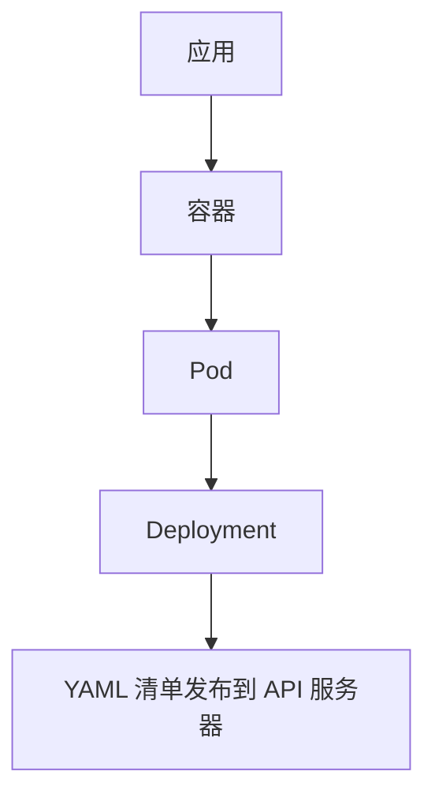
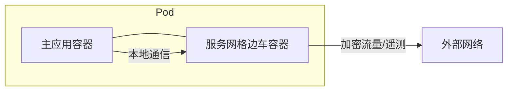
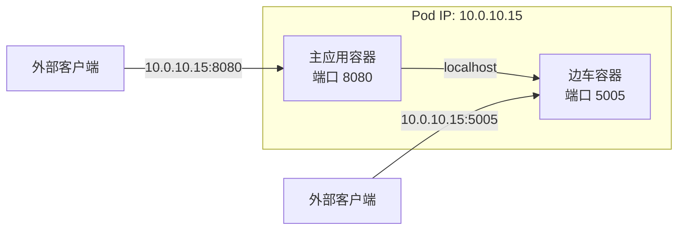
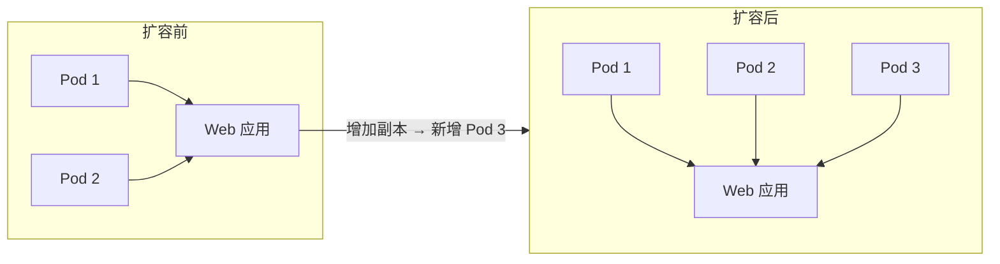

# 2: Kubernetes 工作原理

本章将介绍 Kubernetes 的主要组件，并为后续章节做好准备。本章不会让你成为专家，但会为你打下重要的基础，你将在本书中不断构建这些知识。

我们将涵盖以下所有内容：

- 从 40,000 英尺高空看 Kubernetes
- 控制平面节点与工作节点
- 为 Kubernetes 打包应用
- 声明式模型与[[期望状态]]
- [[Pod]]
- [[Deployment]]
- [[Service]]

## 从 40,000 英尺高空看 Kubernetes

Kubernetes 同时具备以下两种特性：

- 一个集群
- 一个编排器

### Kubernetes：集群

Kubernetes 集群是由一个或多个节点组成的，这些节点提供 CPU、内存及其他资源供应用使用。

Kubernetes 支持两种节点类型：

- 控制平面节点
- 工作节点

两种类型都可以是物理服务器、虚拟机或云实例，并且都可以运行在 ARM 和 AMD64/x86-64 架构上。控制平面节点必须是 Linux，但工作节点可以是 Linux 或 Windows。

控制平面节点实现了 Kubernetes 的智能功能，每个集群至少需要一个。但为了高可用性（HA），你应该使用三个或五个节点。

每个控制平面节点都运行所有控制平面服务，包括 [[API 服务器]]、调度器以及实现云原生特性（如自愈、自动缩放和滚动更新）的控制器。

工作节点是运行业务应用的地方。

图 2.1 展示了一个包含三个控制平面节点和三个工作节点的集群。

> **图 2.1**（图片位置：Kubernetes 集群示意图，包含 3 个控制平面节点和 3 个工作节点，节点间通过 API 服务器通信）

在开发和测试环境中，通常会在控制平面节点上运行用户应用。但许多生产环境将用户应用限制在工作节点上，以便控制平面节点将其资源专注于集群操作。这样做能让控制平面节点专注于管理集群。

### Kubernetes：编排器

编排器是用于部署和管理应用的系统统称。

Kubernetes 是行业标准的编排器，能够智能地将应用部署到各个节点和故障域中，以实现最佳性能和可用性。它还能在应用故障时自动修复、在需求变化时自动缩放，并管理滚动更新和回滚。

这是宏观图景。让我们深入了解一下。

## 控制平面节点与工作节点

我们已经说过，Kubernetes 集群由一个或多个控制平面节点和工作节点组成。

控制平面节点必须是 Linux，但工作节点可以是 Linux 或 Windows。

几乎所有的云原生应用都是 Linux 应用，需要 Linux 工作节点。但如果你有云原生 Windows 应用，则需要一个或多个 Windows 工作节点。幸运的是，单个 Kubernetes 集群可以混合使用 Linux 和 Windows 工作节点，Kubernetes 足够智能，能够将应用调度到正确的节点上。

### 控制平面

控制平面是一组系统服务的集合，它们实现了 Kubernetes 的核心智能。它暴露 API、调度应用、实现自愈、管理缩放操作等等。

最简单的集群运行单个控制平面节点，最适合实验室和测试环境。对于生产集群，你应该运行三个或五个控制平面节点，并将其分布在不同可用区以实现高可用，如图 2.2 所示。

> **图 2.2 控制平面高可用**（图片位置：三个控制平面节点分布在三个可用区，箭头指向集群）

如前所述，生产最佳实践通常是将所有用户应用运行在工作节点上，让控制平面节点将其资源分配给集群相关操作。

大多数集群在每个控制平面节点上运行所有控制平面服务，以实现高可用。

让我们仔细看看主要控制平面服务。

#### API 服务器

API 服务器是 Kubernetes 的前端，所有命令和请求都通过它。即使是内部控制平面服务也通过 API 服务器相互通信。它通过 HTTPS 暴露 RESTful API，所有请求都需经过身份验证和授权。例如，部署或更新应用的流程如下：

1. 在 YAML 配置文件中描述应用
2. 将配置文件 POST 到 API 服务器
3. 请求将经过身份验证和授权
4. 应用定义将被持久化到集群存储中
5. 应用的容器将被调度到集群中的节点上

#### 集群存储

集群存储保存着所有应用和集群组件的期望状态，并且是控制平面中唯一有状态的部分。

它基于 etcd 分布式数据库，大多数 Kubernetes 集群在每个控制平面节点上运行一个 etcd 副本以实现高可用。然而，变化率高的大型集群可能会运行单独的 etcd 集群以获得更好的性能。

> [!WARNING] 集群存储高可用 ≠ 备份与恢复
> 请注意，高可用的集群存储不能替代备份和恢复。你仍然需要足够的方法在集群存储出现问题时进行恢复。

关于可用性，etcd 倾向于使用奇数个副本，以帮助避免脑裂情况。脑裂是指副本间出现通信问题，无法确定是否拥有法定票数（多数）。

图 2.3 展示了两种 etcd 配置在网络分区故障下的情况。左侧集群 A 有四个节点，发生网络分区后两侧各有两个节点，没有一边拥有多数；右侧集群 B 只有三个节点，但未出现脑裂，因为节点 A 知道自己没有多数，而节点 B 和节点 C 知道自己拥有多数。

> **图 2.3 高可用与脑裂情况**（图片位置：左侧显示4节点etcd分为两组各2个节点，标记为“脑裂-无多数”；右侧显示3节点etcd，节点A单侧，节点B和C在另一侧，标记为“无脑裂-节点B和C拥有多数”）

如果发生脑裂，etcd 会进入只读模式，阻止对集群的更新。用户应用将继续工作，但 Kubernetes 无法进行缩放或更新。

与所有分布式数据库一样，写一致性至关重要。例如，来自不同源的多次写入可能导致数据损坏。etcd 使用 [[RAFT 共识算法]] 来防止这种情况发生。

#### 控制器与控制器管理器

Kubernetes 使用[[控制器]]来实现许多集群智能功能。每个控制器作为进程运行在控制平面上，一些常见的控制器包括：

- Deployment 控制器
- StatefulSet 控制器
- ReplicaSet 控制器

还有许多其他控制器，我们将在本书后续介绍其中一些。但它们都作为后台 watch 循环运行，将观察到的状态与期望状态进行协调。

这有很多术语，我们将在本章后面详细介绍。但现在，请记住控制器确保集群运行你所要求的内容。例如，如果你要求某个应用有 3 个副本，控制器将确保有 3 个健康的副本，并在没有时采取适当行动。

Kubernetes 还运行一个[[控制器管理器]]，负责生成和管理各个控制器。

图 2.4 提供了控制器管理器和控制器的高级概览。

> **图 2.4 控制器管理器与控制器**（图片位置：控制器管理器生成多个控制器实例，每个控制器包含watch循环和协调逻辑）

#### 调度器

调度器监视 API 服务器以获取新的工作任务，并将它们分配给健康的工作节点。

它实现以下流程：

1. 监视 API 服务器获取新任务
2. 识别有能力的节点
3. 将任务分配给节点

识别有能力的节点涉及谓词检查、过滤和排名算法。它会检查污点、亲和性和反亲和性规则、网络端口可用性以及可用的 CPU 和内存。它会忽略无法运行任务的节点，并根据节点是否已拥有所需镜像、可用 CPU 和内存量以及当前运行的任务数等因素对剩余节点进行排名。每个因素得分，得分最高的节点被选中运行任务。

如果调度器找不到合适的节点，它会将任务标记为待定状态。

如果集群配置了节点自动缩放，待定任务将触发集群自动缩放事件，添加新节点到集群，然后调度器将任务分配给新节点。

#### 云控制器管理器

如果你的集群位于公有云上，如 AWS、Azure、GCP 或 Civo Cloud，它将运行一个[[云控制器管理器]]，将集群与云服务（如实例、负载均衡器和存储）集成。例如，如果你在云上，且一个应用请求负载均衡器，云控制器管理器会配置一个云负载均衡器并将其连接到你的应用。

### 控制平面总结

控制平面实现了 Kubernetes 的核心智能，包括 API 服务器、调度器和集群存储。它还实现了确保集群运行你所要求内容的控制器。

图 2.5 展示了 Kubernetes 控制平面节点的高级视图。

> **图 2.5 控制平面节点**（图片位置：节点内运行API服务器、调度器、控制器管理器、etcd、云控制器管理器等组件）

为了实现高可用，你应该运行三个或五个控制平面节点，大型繁忙集群可能运行单独的 etcd 集群以获得更好的集群存储性能。

API 服务器是 Kubernetes 的前端，所有通信都通过它。

### 工作节点

工作节点运行你的业务应用，如图 2.6 所示。

> **图 2.6 工作节点**（图片位置：节点内运行 kubelet、kube-proxy、容器运行时等组件）

让我们看看主要的工作节点组件。

#### kubelet

kubelet 是主要的 Kubernetes 代理，处理与集群的所有通信。

它执行以下关键任务：

- 监视 API 服务器获取新任务
- 指示适当的运行时执行任务
- 向 API 服务器报告任务状态

如果任务无法运行，kubelet 会将问题报告给 API 服务器，让控制平面决定采取什么操作。

#### 运行时

每个工作节点都有一个或多个用于执行任务的运行时。

大多数新的 Kubernetes 集群预装 containerd 运行时，并用它来执行任务。这些任务包括：

- 拉取容器镜像
- 管理生命周期操作，如启动和停止容器

较旧的集群随附 Docker 运行时，但现已不再支持。RedHat OpenShift 集群使用 CRI-O 运行时。还有许多其他运行时，各有优缺点。我们将在 Wasm 章节中使用一些不同的运行时。

#### kube-proxy

每个工作节点运行一个 kube-proxy 服务，实现集群网络并对运行在节点上的任务进行负载均衡。

现在你已经理解了控制平面和工作节点的基础知识，让我们切换话题，看看如何打包应用以便在 Kubernetes 上运行。

## 为 Kubernetes 打包应用

Kubernetes 可以运行容器、虚拟机、Wasm 应用等。但所有应用在 Kubernetes 上运行之前，都需要包装在 [[Pod]] 中。

我们很快就会介绍 Pod，但现在请将它们视为一个薄包装层，它抽象了不同类型的任务，使它们能够在 Kubernetes 上运行。下面的快递类比可能有所帮助。

快递公司允许你运送书籍、衣物、食品、电器等物品，只要你使用其批准的包装和标签。一旦你包装并贴好标签，就将物品交给快递公司进行配送。快递公司随后处理复杂的物流，如使用哪些飞机和卡车、安全交接至本地配送中心，以及最终送达客户。他们还提供跟踪包裹、更改配送详情和确认成功送达的服务。你所需要做的就是包装和贴标签。

在 Kubernetes 上运行应用类似。Kubernetes 可以运行容器、虚拟机、Wasm 应用等，只要将它们包装在 Pod 中。一旦包装成 Pod，你将 Pod 交给 Kubernetes，Kubernetes 就会运行它。这包括选择合适节点、加入网络、挂载卷等复杂物流。Kubernetes 甚至允许你查询应用并进行更改。

看一个快速的例子。

你用喜欢的语言编写应用，将其容器化，推送到镜像仓库，然后包装成一个 Pod。此时，你可以将 Pod 交给 Kubernetes，Kubernetes 就会运行它。然而，你几乎总是通过更高级的控制器来部署和管理 Pod。例如，你可以将 Pod 包装在 [[Deployment]] 中，以实现缩放、自愈和滚动更新。

暂时不要担心细节，我们将在后面介绍所有内容。

# 2: Kubernetes 工作原理

现在，你只需要知道两件事：
1. 应用需要被打包到 Pod 中才能在 Kubernetes 上运行。
2. Pod 需要被打包到更高级别的控制器中才能获得高级功能。

让我们快速回顾一下快递员的类比，以帮助解释控制器的作用。

大多数快递公司都提供额外服务，例如为所运货物投保、冷藏配送、签名与拍照签收证明、加急配送等。

Kubernetes 与此类似。它实现了增加价值的控制器，例如确保应用健康、在需求增加时自动扩缩容等。

图 2.7 展示了一个容器被打包到 Pod 中，而 Pod 又被打包到 Deployment 中。暂时不必担心 YAML 配置，它只是用来启发概念的。



**图 2.7 – 对象嵌套**

重要的是要理解每一层封装都增加了功能：

- **容器**封装应用并提供依赖。
- **Pod**封装容器使其能在 Kubernetes 上运行。
- **Deployment**封装 Pod 并添加自愈、扩缩容等功能。

你将 Deployment（YAML 文件）作为应用的 **期望状态** 发布到 API 服务器，Kubernetes 则负责实现它。

## 声明式模型与期望状态

声明式模型和期望状态是 Kubernetes 运行的核心。它们基于三个基本原则：

- **期望状态**（Desired state）
- **观测状态**（Observed state）
- **调谐**（Reconciliation）

> [!NOTE] 术语
> 我们使用**实际状态**、**当前状态**和**观测状态**来指代同一事物——集群的最新视图。

期望状态是你想要的，观测状态是你实际拥有的，调谐则是使观测状态与期望状态保持一致的过程。

在 Kubernetes 中，声明式模型的工作方式如下：

1. 你在 YAML 清单文件中描述应用的期望状态。
2. 你将 YAML 文件发布到 API 服务器。
3. Kubernetes 将其记录在集群存储中，作为意图记录。
4. 控制器注意到集群的观测状态与新的期望状态不匹配。
5. 控制器做出必要的更改以调谐差异。
6. 控制器持续在后台运行，确保观测状态始终与期望状态一致。

让我们更详细地看看。

你编写 YAML 格式的清单文件，告诉 Kubernetes 你希望应用呈现什么样。我们称之为**期望状态**，其中包括要使用的镜像、副本数量、网络端口等。

创建清单后，你将其发布到 API 服务器，在那里进行身份验证和授权。向 Kubernetes 发布 YAML 文件最常见的方式是使用 `kubectl` 命令行工具。

经过身份验证和授权后，Kubernetes 将配置持久化到集群存储中，作为意图记录。

此时，集群的观测状态与你的新期望状态不匹配。控制器会注意到这一点并开始调谐过程。这包括进行 YAML 文件中描述的所有更改，可能包括调度新的 Pod、拉取镜像、启动容器、将它们连接到网络以及启动应用进程。

调谐完成后，观测状态将与期望状态匹配，一切正常。然而，控制器会在后台持续运行，随时准备调谐未来的任何差异。

重要的是要理解，我们所描述的内容与传统的**命令式模型**有很大不同：

- **命令式模型**需要编写复杂的、针对平台的命令脚本才能达到最终状态。
- **声明式模型**是一种简单的、与平台无关的、描述最终状态的方式。

Kubernetes 支持两种方式，但首选声明式模型。这是因为声明式模型与版本控制系统集成，并能实现自愈、自动扩缩容和滚动更新。

考虑几个简单的声明式示例。

假设你根据一个请求 10 个副本的 YAML 文件部署了一个应用。如果运行其中两个副本的节点发生故障，观测状态将降至 8 个副本，不再匹配期望的 10 个。没关系，控制器会看到差异并调度 2 个新副本，使总数恢复到 10 个。

应用更新时也会发生同样的情况。例如，如果你更新 YAML，告诉应用使用更新版本的镜像，并将更改发布到 Kubernetes，相关控制器会注意到差异，并用运行新版本的新副本替换运行旧版本的副本。

如果你尝试以命令式方式执行这样的更新，你将需要编写复杂的脚本来管理、监控和健康检查整个更新过程。而以声明式方式执行，你只需要更改 YAML 中的一行，Kubernetes 会搞定其余一切。

尽管简单，但这非常强大，而且是 Kubernetes 工作方式的基础。

## Pod

在 VMware 中，调度的原子单元是虚拟机（VM）。在 Kubernetes 中，原子单元是 Pod。

是的，Kubernetes 运行容器、虚拟机、Wasm 应用等。但它们都需要被打包到 Pod 中。

### Pod 与容器

最简单的配置是每个 Pod 运行单个容器，这就是为什么我们有时会互换使用 Pod 和容器这两个术语。然而，多容器 Pod 有强大的用例，包括：

- 服务网格（Service mesh）
- 初始化环境的辅助服务
- 具有紧耦合辅助功能（如日志采集器）的应用

图 2.8 展示了一个多容器 Pod，其中包含一个主应用容器和一个服务网格边车。**边车**（Sidecar）是一个行话术语，指与主应用容器运行在同一个 Pod 中并提供额外服务的辅助容器。在图 2.8 中，服务网格边车负责加密网络流量并提供遥测。



**图 2.8 – 多容器服务网格 Pod**

多容器 Pod 还帮助我们实现**单一职责原则**，其中每个容器只执行一个任务。在图 2.8 中，主应用容器可能负责提供消息队列或其他核心应用功能。我们不必将加密和遥测逻辑添加到主应用中，而是保持应用简单，并在同一个 Pod 的服务网格容器中实现额外服务。

### Pod 解剖

每个 Pod 是一个共享的执行环境，供一个或多个容器使用。执行环境包括网络栈、存储卷、共享内存等。

单容器 Pod 中的容器独享整个执行环境，而多容器 Pod 中的容器共享该环境。

例如，图 2.9 展示了一个多容器 Pod，其中两个容器共享 Pod 的 IP 地址。主应用容器可通过 `10.0.10.15:8080` 从 Pod 外部访问，边车可通过 `10.0.10.15:5005` 访问。如果它们需要相互通信（Pod 内部容器间通信），可以使用 Pod 的 `localhost` 接口。



**图 2.9 – 多容器 Pod 共享 Pod IP**

当你的应用具有紧密耦合的组件并需要共享资源（如内存或存储）时，应选择多容器 Pod。在大多数其他情况下，应使用单容器 Pod 并通过网络进行松耦合。

### Pod 调度

Kubernetes 总是将同一个 Pod 中的容器调度到**单个节点**上。这是因为 Kubernetes 调度的是 Pod，而不是单个容器。同时也是因为 Pod 是一个共享的执行环境，你无法轻松跨不同节点共享内存、网络和存储卷。

启动 Pod 也是一个原子操作。这意味着 Kubernetes 只有在 Pod 内**所有**容器都运行时才将其标记为就绪。例如，如果一个 Pod 有两个容器，但只启动了一个，则该 Pod 不视为就绪。

### Pod 作为扩缩容单元

Pod 是 Kubernetes 中最小的调度单元。因此，扩容应用会增加 Pod 的数量，缩容则会删除 Pod。你不能通过向现有 Pod 添加更多容器来扩缩容。图 2.10 展示了如何使用 Pod 作为扩缩容单元来扩展 `web-fe` 微服务。



**图 2.10 – 使用 Pod 进行扩缩容**

### Pod 生命周期

Pod 是有寿命的——它们被创建、存活、然后消亡。每当一个 Pod 死亡，Kubernetes 就会用一个新 Pod 替换它。即使新 Pod 看起来、闻起来、感觉上与旧 Pod 一样，它始终是一个全新的 Pod，拥有新的 ID 和新的 IP。

这迫使你将应用设计为松耦合，使其能够免疫单个 Pod 的故障。

### Pod 不可变性

Pod 是不可变的。这意味着一旦 Pod 正在运行，你永远不要更改它。

例如，如果你需要更改或更新一个 Pod，你总是用一个运行了更新的新 Pod 来替换它。你永远不应该登录到 Pod 并修改它。这意味着每当我们谈论“更新 Pod”时，我们总是意味着删除旧 Pod 并用新 Pod 替换。这可能对某些人来说是一个巨大的思维转变，但它与现代工具和 GitOps 风格的工作流程非常契合。

## Deployment

尽管 Kubernetes 直接使用 Pod，但你几乎总是通过更高级别的控制器来部署它们，例如 Deployment、StatefulSet 和 DaemonSet。这些都是控制平面服务，作为后台监视循环运行，调谐观测状态与期望状态。

Deployment 为无状态应用添加了自愈、扩缩容、滚动更新和版本回滚功能。

请回顾图 2.7 以了解 Deployment 如何封装 Pod。

## Service 对象与稳定的网络

本章前面提到：Pod 是有寿命的，可能会死亡。然而，如果故障 Pod 受控制器管理，它会被一个新 Pod 替换，新 Pod 拥有新的 ID 和新的 IP 地址。滚动更新和扩缩容操作也会发生同样的情况：

- **滚动更新**用具有新 IP 的新 Pod 替换旧 Pod。
- **扩容**会添加具有新 IP 的新 Pod。
- **缩容**会删除现有 Pod。

像这样的事件会产生 IP 变动（IP churn），使 Pod 变得不可靠。例如，客户端无法可靠地连接到单个 Pod，因为 Kubernetes 不保证 Pod 会一直存在。

这就是 **Service** 发挥作用的地方：它为 Pod 组提供可靠的网络。

图 2.11 展示了内部和外部客户端通过一个 Kubernetes Service 连接到一组 Pod。Service（首字母大写，因为它是 Kubernetes API 资源）提供了一个可靠的名称和 IP，并对后端 Pod 进行负载均衡。

```mermaid
graph LR
    subgraph 前端
        S[Service<br>稳定 DNS 名称与 IP]
    end
    subgraph 后端 (动态 Pod 组)
        P1[Pod 1<br>IP: 10.0.x.1]
        P2[Pod 2<br>IP: 10.0.x.2]
        P3[Pod 3<br>IP: 10.0.x.3]
    end
    C1[内部客户端] --> S
    C2[外部客户端] --> S
    S -- 基于标签的负载均衡 --> P1
    S --> P2
    S --> P3
```

**图 2.11 – 通过 Service 连接 Pod**

你应该把 Service 看作具有前端和后端两部分。前端具有稳定的 DNS 名称、IP 地址和网络端口。后端使用标签（Labels）将流量负载均衡到一组动态的 Pod 上。

Service 会维护一份健康 Pod 的列表，因为扩缩容事件、滚动更新和故障会导致 Pod 的来去。这意味着 Service 始终将流量导向活跃且健康的 Pod。同时 Service 保证前端的名称、IP 和端口永远不会改变。

## 章节总结

本章介绍了 Kubernetes 的一些主要特性。

- **控制平面节点** 承载实现 Kubernetes 智能的控制平面服务。它们可以是物理服务器、虚拟机、云实例等。生产集群通常运行三个或五个控制平面节点以实现高可用性。
- 控制平面服务包括 API 服务器、调度器、集群存储以及各种控制器。
- **工作节点** 是运行业务应用程序的地方，同样可以是物理服务器、虚拟机、云实例等。
- 每个工作节点都运行 **kubelet** 服务，该服务监视 API 服务器以获取新的工作任务，并报告任务状态。

---

### 图像上下文

以下图像位于本书第 2 章（页码 32–61）的相关位置，此处列出以供参考：

- [Image 1055 第34页]
- [Image 1058 第36页]
- [Image 1062 第39页]
- [Image 1065 第41页]
- [Image 1068 第43页]
- [Image 1070 第44页]
- [Image 1076 第49页]
- [Image 1083 第54页]
- [Image 1087 第56页]
- [Image 1089 第57页]
- [Image 1093 第60页]