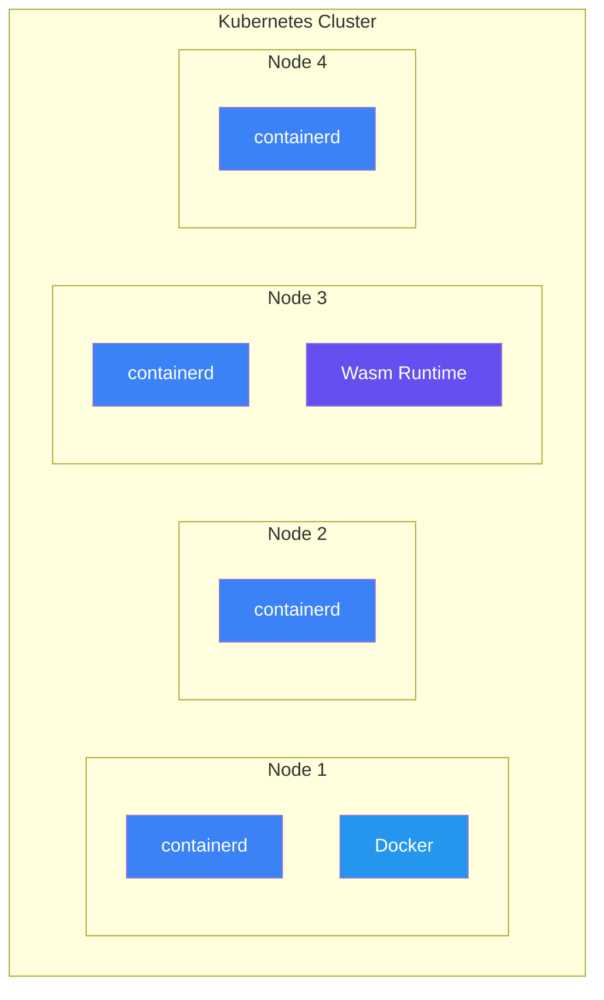
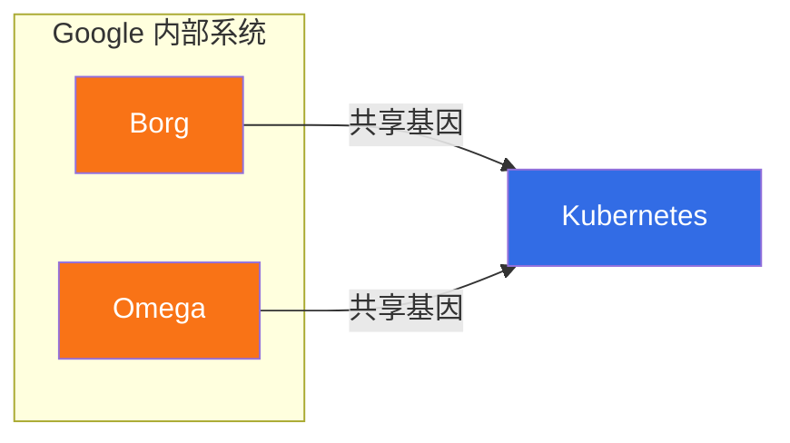
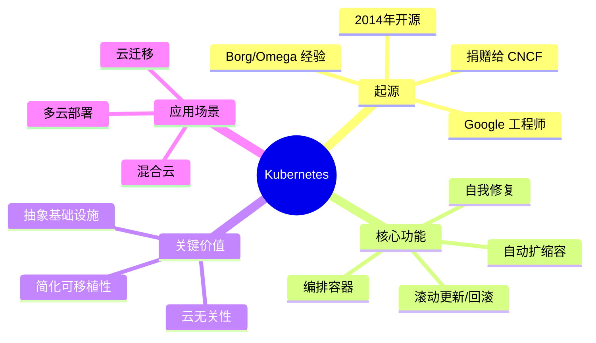

# Kubernetes 入门指南

本章将帮助您快速了解 Kubernetes 的基础知识和背景知识，内容结构如下：

## 重要的 Kubernetes 背景知识

> [!NOTE]
> Kubernetes 是一个[[容器化]]云原生微服务应用的**编排器**（orchestrator）。

这包含大量术语，让我们逐一解释。

### 编排（Orchestration）

**编排器**是一种部署应用程序并能动态响应变化的系统。例如，Kubernetes 能够：

- **部署**应用程序
- 根据需求**扩缩容**
- 当出现问题时**自我修复**
- 执行**滚动更新**和**回滚**
- 以及更多功能...

> [!TIP]
> 最棒的是，你无需亲自动手就能完成所有这些操作。你只需要在前期进行一些配置，之后就可以让 Kubernetes 发挥它的魔力。

### 容器化（Containerization）

**容器化**是将应用程序及其依赖项打包为镜像，然后作为[[容器]]运行的过程。

可以把容器想象成下一代**虚拟机（VM）**。两者都是打包和运行应用程序的方式，但容器更小、更快、更具可移植性。

尽管有这些优势，容器并没有完全取代虚拟机，在大多数环境中你会看到两者并行运行。但对于大多数新应用程序来说，容器是首选解决方案。

### 云原生（Cloud Native）

**云原生**应用程序具备云类似的特性，例如自动扩缩容、自我修复、自动更新、回滚等。

> [!WARNING]
> 仅仅在公有云上运行一个普通应用程序，并不能使其成为云原生应用。

### 微服务（Microservices）

**微服务**应用程序由许多小的、专门的、相互独立的组件构成，这些组件协同工作形成一个有用的应用程序。

以一个具有以下六个功能的电商应用为例：

- Web 前端
- 商品目录
- 购物车
- 身份验证
- 日志记录
- 存储

要将其构建为微服务应用，你需要将每个功能设计、开发和部署为各自独立的小应用程序，我们称之为**微服务**。因此，这个应用有六个微服务。

这样的设计带来了巨大的灵活性：
- 六个微服务可以各自拥有独立的小型开发团队
- 各自拥有独立的发布周期
- 可以独立地进行扩缩容和更新

> [!INFO]
> 最常见的模式是将每个微服务部署为独立的容器。这意味着一个或多个 Web 前端容器、一个或多个目录容器、一个或多个购物车容器等。对应用的任何部分进行扩缩容就像添加或删除容器一样简单。

现在我们已经解释了一些概念，让我们重新审视并改写本章开头那句充满术语的话。

原句是："Kubernetes is an orchestrator of containerized cloud-native microservices applications."

我们现在知道这意味着：**Kubernetes 部署、扩缩容、自我修复和更新应用程序，其中各个应用程序功能被打包并部署为容器。**

希望这能澄清一些术语。但如果你仍然觉得有些模糊，也不用担心，我们将在本书的后续章节中更详细地介绍所有内容。

---

## Kubernetes 的起源

Kubernetes 由一群 Google 工程师开发，部分是为了应对 **Amazon Web Services（AWS）** 和 **Docker** 的崛起。

AWS 在发明现代云计算时改变了世界，整个行业都需要迎头赶上。其中一家迎头赶上的公司是 Google。他们已经构建了自己的云，但需要一种方式来抽象 AWS 的价值，让客户尽可能容易地从 AWS 迁移到自己的云上。此外，他们自己的生产应用（如搜索和 Gmail）每周运行着数十亿个容器。

与此同时，Docker 正席卷全球，用户需要帮助来管理爆发式增长的容器。

这促使一群 Google 工程师将他们在使用内部容器管理工具中学到的经验教训整合起来，创建了一个名为 **Kubernetes** 的新工具。2014 年，他们将 Kubernetes 开源，并将其捐赠给新成立的**云原生计算基金会（CNCF）**。

> [!IMPORTANT]
> 截至本文撰写时，Kubernetes 已超过 10 年，并经历了惊人的增长和 adoption。然而，在其核心层面，它仍然做 Google 和整个行业需要的两件事：
> 1. **抽象基础设施**（如 AWS）
> 2. **简化应用程序可移植性**

这是 Kubernetes 对行业重要的两个最大原因。

---

## Kubernetes 与 Docker

早期所有版本的 Kubernetes 都内置 **Docker** 作为容器运行时。这意味着 Kubernetes 使用 Docker 来执行创建、启动和停止容器等底层任务。

然而，两件事发生了：

1. Docker 变得臃肿
2. 人们创建了许多 Docker 替代品

因此，Kubernetes 项目创建了**容器运行时接口（CRI）**，使运行时层可插拔。这意味着你现在可以为自己的需求挑选最佳的运行时。例如，一些运行时提供更好的隔离性，一些提供更好的性能，一些支持 Wasm 容器等。

> [!INFO]
> Kubernetes 1.24 最终移除了对 Docker 作为运行时的支持，因为它过于臃肿，对于 Kubernetes 的需求来说过于大材小用。

此后，大多数新的 Kubernetes 集群默认使用 **containerd**（发音为 "container dee"）作为运行时。幸运的是，containerd 是 Docker 的精简版，专为 Kubernetes 优化，完全支持由 Docker 容器化的应用程序。事实上，Docker、containerd 和 Kubernetes 都与实现**开放容器倡议（OCI）**标准的镜像和容器配合工作。

下图展示了一个四节点 Kubernetes 集群运行多个容器运行时的架构：



> [!NOTE]
> 注意某些节点有多个运行时。这种配置完全受支持且越来越常见。你将在第 9 章中使用类似的配置将 Wasm（WebAssembly）应用程序部署到 Kubernetes。

---

## Docker Swarm 呢？

2016 年和 2017 年，Docker Swarm、Mesosphere DCOS 和 Kubernetes 竞争成为行业标准的容器编排器。最终 Kubernetes 胜出。

然而，Docker Swarm 仍在开发中，仍被一些小公司用作 Kubernetes 的简单替代方案。

---

## Kubernetes 与 Borg：抵抗是徒劳的！

我们已经说过，Google 长期以来一直以超大规模运行容器。好吧，他们有两个名为 **Borg** 和 **Omega** 的内部工具来编排这些数十亿个容器。因此，与 Kubernetes 的联系显而易见——三者都在大规模编排容器，而且都与 Google 有关。

然而，Kubernetes 不是 Borg 或 Omega 的开源版本。更准确地说，Kubernetes 与它们有着共同的基因和家族历史。



目前，Kubernetes 是一个由 CNCF 拥有的开源项目。它采用 Apache 2.0 许可证，1.0 版本早在 2015 年 7 月发布，截至本文撰写时已达到 1.32 版本，平均每年发布三个新版本。

---

## Kubernetes 名称的由来

大多数人会将 Kubernetes 发音为 "koo-ber-net-eez"，但社区非常友好，即使你发音不同也没人会介意。

> [!INFO]
> Kubernetes 这个词源自希腊语中的 "舵手"（helmsman），也就是掌舵船只的人。你可以在其标志中看到这一点，它是一个船舵。

```
        ⚓ 轮毂
     ╱      ╲
   ╱    ╲╱    ╲
  ╱  ╱      ╲  ╲
 ╱  ╱   ⚓   ╲  ╲
  ╲  ╲      ╱  ╱
   ╲  ╲    ╱  ╱
     ╲  ╲╱  ╱
       轮辐
    (7根辐条)
```

> [!TIP]
> 一些最初的工程师想将 Kubernetes 命名为 "Seven of Nine"。这是因为 Google 的 Borg 项目启发了 Kubernetes，而《星际迷航：航海者号》中著名的博格无人机就叫做 Seven of Nine。由于版权法不允许，他们将标志设计成七个轮辐作为对 Seven of Nine 的微妙致敬。

关于名称还有最后一件事：你经常会看到它被简称为 **K8s**，发音为 "kates"。数字 8 代替了 "K" 和 "s" 之间的八个字符。

---

## Kubernetes：云的操作系统

Kubernetes 是云原生应用程序的事实标准平台，我们有时称其为云的**操作系统（OS）**。

这是因为它抽象了云平台之间的差异，就像 Linux 和 Windows 等操作系统抽象了服务器之间的差异一样：

| 传统操作系统 | Kubernetes |
|------------|-------------|
| Linux 和 Windows 抽象服务器资源并调度应用程序进程 | Kubernetes 抽象云资源并调度应用程序微服务 |

举一个简单的例子：你可以在 Kubernetes 上调度应用程序，而无需关心它们运行在 AWS、Azure、Civo Cloud、GCP 还是本地数据中心上。

> [!SUCCESS]
> 这使得 Kubernetes 成为以下场景的关键推动者：
> - **混合云**
> - **多云**
> - **云迁移**
> - **跨云迁移**

简而言之，Kubernetes 让今天部署到一个云、明天迁移到另一个云变得更加容易。

---

### 应用程序调度

操作系统的主要功能之一是简化工作任务的调度。

例如，计算机是硬件资源（如 CPU、内存、存储和网络）的复杂集合。谢天谢地，现代操作系统隐藏了大部分复杂性，使应用程序开发的世界变得更加友好。例如，有多少开发者需要关心他们的代码使用哪个 CPU 核心、内存条或闪存芯片？大多数时候，我们让操作系统来决定。

Kubernetes 对云和数据中心做着类似的事情。从高层次来看，云或数据中心是资源和服务的复杂集合。Kubernetes 抽象了大部分复杂性，使资源更容易消费。同样，你有多少次关心你的应用使用哪个计算节点、哪个故障区域或哪个存储卷？大多数时候，你会很高兴让 Kubernetes 来决定。

---

## 章节总结

> [!ABSTRACT]- 核心要点

Kubernetes 由 Google 工程师基于多年在超大规模运行容器的经验创建而成。他们将其作为开源项目贡献给社区，现在已成为部署和管理云原生应用程序的行业标准平台。

**关键特点：**

| 特性 | 说明 |
|------|------|
| **跨平台** | 可运行在任何云或本地数据中心 |
| **基础设施抽象** | 抽象底层基础设施 |
| **灵活性** | 支持构建混合云、在不同云之间迁移 |
| **许可证** | Apache 2.0 开源许可 |
| **管理机构** | 云原生计算基金会（CNCF）拥有和管理 |

