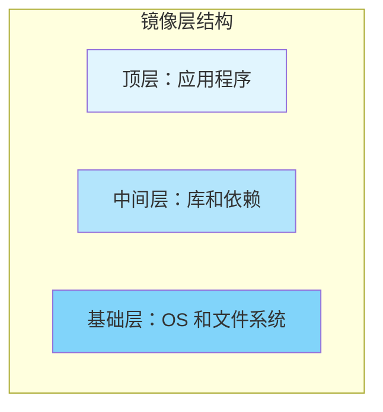
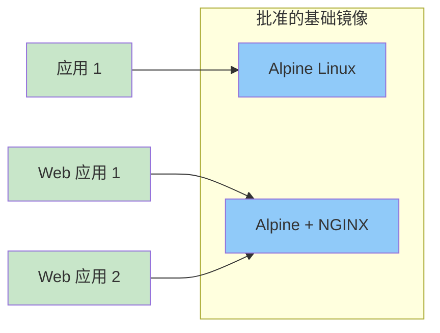
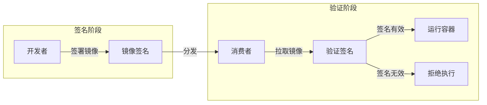
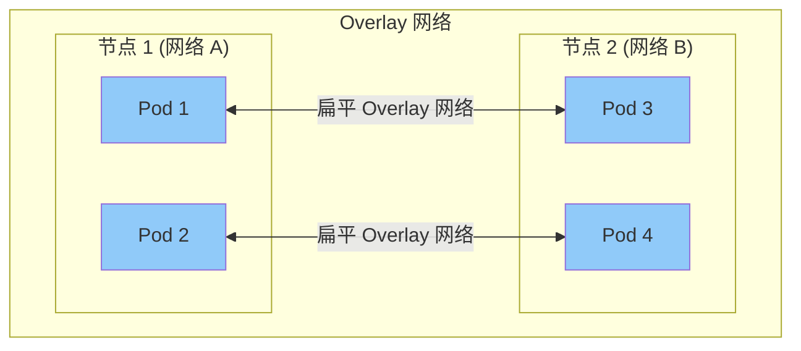
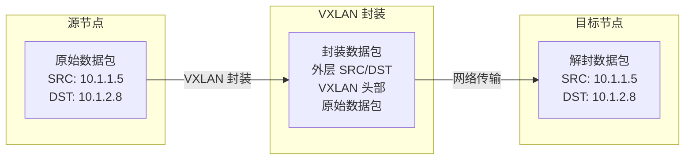
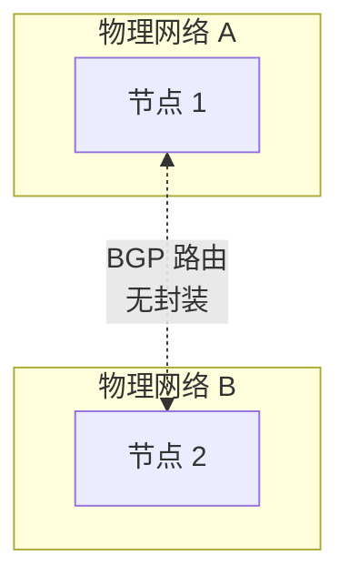
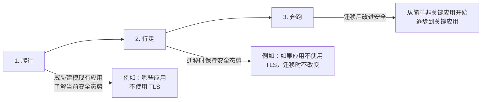

# 17: 真实世界的 Kubernetes 安全

前一章向你展示了如何使用 STRIDE 模型对 Kubernetes 进行威胁建模。在本章中，你将了解到在真实世界中实施 Kubernetes 时可能遇到的安全相关挑战。

本章的目标是从安全架构师的高层视角向你展示相关内容，而非提供傻瓜式的解决方案。

本章分为以下四个部分：
- [[软件交付管道安全]]
- [[工作负载隔离]]
- [[身份和访问管理 (IAM)]]
- [[安全监控与审计]]

---

## 软件交付管道安全

[[容器]]彻底改变了我们构建、发布和运行应用程序的方式。不幸的是，这也使得运行危险代码比以往任何时候都更容易。让我们看看一些保护供应链安全的方法，这些供应链将应用程序代码从开发人员的笔记本电脑带到生产服务器。

> [!TIP] 核心原则
> 软件供应链安全涉及从代码编写到生产部署的整个过程，每一个环节都需要安全控制。

### 镜像仓库

我们将镜像存储在划分为仓库的公共和私有注册表中。

公共注册表位于互联网上，是推送和拉取镜像最简单的方式。但是，使用它们时你应该非常小心：

1. 你需要充分保护存储在公共注册表上的镜像
2. 你不应该信任从公共注册表拉取的镜像

一些公共注册表有官方镜像和社区镜像的概念。一般来说，官方镜像比社区镜像更安全，但你应该始终进行尽职调查。

官方镜像通常由产品供应商提供，并经过严格的审查流程以确保质量。你应该期望它们实现良好的实践，定期扫描漏洞，并包含最新的补丁和修复。其中一些甚至可能由产品供应商或托管注册表的公司提供支持。

社区镜像没有经过严格的审查，使用时应该格外小心。

考虑到这些要点，你应该实施一种标准化的方式让开发人员获取和使用镜像。你也应该让这个过程尽可能无摩擦，这样开发人员就不会觉得有必要绕过这个流程。

> [!WARNING] 风险提示
> 使用未经审查的社区镜像可能引入未知的安全风险，包括恶意代码和已知漏洞。

### 使用批准的基础镜像

大多数镜像从一个基础层开始，然后添加其他层来形成有用的镜像。

图 17.1 展示了一个简化的三层镜像示例。基础层包含核心操作系统和文件系统组件，中间层包含库和依赖项，顶层包含你的应用程序。三个层的组合就是镜像，包含运行应用程序所需的一切。

**图 17.1 - 镜像分层结构**

通常，保持少量经过批准的基础镜像是一个好习惯。这些通常来自官方镜像，并根据你的企业策略和要求进行加固。例如，你可能基于官方 Alpine Linux 镜像创建少量经过批准的基础镜像，并进行调整以满足你的要求（补丁、驱动程序、审计设置等）。

**图 17.2 - 使用批准的基础镜像**

虽然你需要投入前期精力来创建你批准的基础镜像，但它们带来以下所有好处：

- **标准化驱动程序集**
- **已知补丁**
- **标准化审计设置**
- **减少软件 sprawl**（减少非官方基础镜像）
- **简化测试**（针对少量已知基础镜像进行测试）
- **简化更新**（需要修补的基础镜像更少）
- **简化故障排除**（易于理解和有限的基础镜像集）

拥有批准的基础镜像集也让开发人员能够专注于应用程序，而不必关心操作系统相关的事情。它还可能允许你减少必须处理的support contracts和供应商数量。

### 管理非标准基础镜像的需求

尽管拥有少量批准的基础镜像很好，但你可能仍有合法需求需要特殊配置。在这种情况下，你需要良好的流程来：

1. 识别为何不能使用现有的批准基础镜像
2. 确定现有批准基础镜像是否可以更新以满足需求（包括是否值得付出努力）
3. 确定在环境中引入全新镜像的[[支持影响]]

在大多数情况下，你将希望更新现有基础镜像——例如，为 GPU 计算添加设备驱动程序——而不是引入全新的镜像。

### 控制对镜像的访问

有几种方法可以保护你组织的镜像。一个安全且实用的选项是在你自己的防火墙内托管你自己的私有注册表。这允许你控制注册表的部署方式、复制方式和修补方式。你还可以创建符合你组织需求的仓库和策略，并将它们与现有的身份管理提供者（如 Active Directory）集成。

如果你无法管理自己的私有注册表，你可以在公共注册表上的私有仓库中托管你的镜像。但是，并非所有公共注册表都是相同的，你需要谨慎选择正确的注册表并正确配置。

无论你选择哪种解决方案，你都应该只托管组织批准使用的镜像。这些通常来自可信来源，并由你的信息安全团队审查。你应该在仓库上设置访问控制，以便只有批准的用户才能推送和拉取。

除了注册表本身，你还应该：

- **限制哪些集群节点可以访问互联网**，记住你的镜像注册表可能在互联网上
- **配置访问控制**，只允许授权的用户和节点推送到仓库

如果你使用的是公共注册表，你可能需要授予你的集群节点访问互联网的权限，以便它们可以拉取镜像。在这种情况下，最好将互联网访问限制在你注册表使用的地址和端口。你还应该在注册表上实施严格的 [[RBAC]] 规则，以控制谁可以从哪些仓库推送和拉取镜像。例如，你可能限制开发人员只能针对开发和测试仓库进行推送和拉取，而你可以允许你的运营团队针对生产仓库进行推送和拉取。

最后，你可能只希望一部分节点（构建节点）能够推送镜像。你甚至可能希望将设置锁定为只有你的自动化构建系统可以推送到特定仓库。

### 将镜像从非生产环境转移到生产环境

许多组织有单独的开发、测试和生产环境。

一般来说，开发环境规则较少，是开发人员可以实验的地方。这可能涉及你的开发人员最终想要在生产中使用的非标准镜像。

以下部分概述了一些你可以采取的措施，以确保只有安全的镜像被批准用于生产。

#### 漏洞扫描

在允许镜像进入生产之前审查镜像的首要任务是漏洞扫描。这些服务在二进制级别扫描你的镜像，并将其内容与已知安全漏洞（CVE）数据库进行比对。

你应该将漏洞扫描集成到你的 [[CI/CD]] 管道中，并实施策略，自动失败构建并隔离包含特定类别漏洞的镜像。例如，你可能实施一个构建阶段，扫描镜像并自动失败任何使用已知严重漏洞镜像的内容。

> [!TIP] 最佳实践
> 选择能够支持高度可定制策略的扫描解决方案，以便根据你的具体环境标记误报或忽略不相关的漏洞。

例如，一个执行 TLS 验证的 Python 方法在 Common Name 包含大量通配符时可能容易受到拒绝服务攻击。但是，如果你从不以这种方式使用 Python，你可能认为该漏洞不相关，并希望将其标记为误报。

并非所有扫描解决方案都允许你这样做。

#### 配置即代码

扫描应用程序代码的漏洞被广泛认为是良好的生产卫生习惯。但是，扫描你的 [[Dockerfile]]、Kubernetes YAML 文件、Helm charts 和其他配置文件的做法还没有那么广泛采用。

一个广为人知的未审查配置文件的例子是，当 IBM 数据科学实验将私有 [[TLS]] 密钥嵌入到其容器镜像中时。这意味着攻击者可以拉取镜像并获得托管容器节点上的 root 访问权限。整个事件如果他们对自己的 Dockerfile 执行了安全审查，就可以轻松避免。

使用实现策略即代码规则的工具来自动化这些检查方面仍在不断进步。

#### 签署容器镜像

信任在当今世界是一个大问题，在软件交付管道的每个阶段对内容进行加密签名正在成为常态。幸运的是，Kubernetes 和大多数容器运行时都支持加密签名和验证镜像。

在这个模型中，开发人员对其镜像进行加密签名，消费者在拉取和运行它们时对其进行加密验证。这让消费者相信他们正在使用正确的镜像，并且该镜像没有被篡改。

**图 17.3 - 镜像签名和验证流程**

镜像签名和验证通常由容器运行时实现。你应该寻找允许你定义和强制执行企业范围签名策略的工具，这样就不会留给个别用户决定。

#### 镜像晋升工作流

综合我们迄今涵盖的所有内容，你的构建管道应尽可能包含以下内容：

1. **强制使用签名镜像的策略**
2. **限制哪些节点可以推送和拉取镜像的网络规则**
3. **保护镜像仓库的 [[RBAC]] 规则**
4. **使用批准的基础镜像**
5. **针对已知漏洞扫描镜像**
6. **基于扫描结果晋升和隔离镜像**
7. **审查和扫描 [[基础设施即代码 (IaC)]] 配置文件**

还有更多你可以做的事情，这个列表并不意味着代表一个精确的工作流。

---

## 工作负载隔离

本节将向你展示一些隔离工作负载的方法。

我们将从集群级别开始，转到运行时级别，然后查看集群外部的基础设施（如网络防火墙）。

### 集群级别的工作负载隔离

直接切入主题，Kubernetes 不支持安全的[[多租户]]集群。隔离两个工作负载的唯一方法是在它们自己的集群和自有硬件上运行它们。

让我们仔细看看。

划分 Kubernetes 集群的唯一方法是通过创建 [[Namespace]]。然而，这些仅仅是分组资源和应用以下内容的方式：

- 资源[[限制 (Limits)]]
- [[配额 (Quota)]]
- [[RBAC]] 规则

Namespace 不能防止一个 Namespace 中被入侵的工作负载影响其他 Namespace 中的工作负载。这意味着你不应该在同一个 Kubernetes 集群上运行敌对的工作负载。

尽管如此，Kubernetes Namespace 很有用，你应该使用它们。只是不要将它们用作安全边界。

#### Namespace 和软多租户

就我们的目的而言，软多租户是在共享基础设施上托管多个可信工作负载。"可信"意味着工作负载不需要绝对保证一个工作负载不能影响另一个工作负载。

可信工作负载的一个例子可能是一个电子商务应用程序，具有 Web 前端服务和后端推荐服务。由于它们是同一应用程序的一部分，所以它们不是敌对的。但是，你可能希望每个都有自己的资源限制，由不同的团队管理。

在这种情况下，具有一个用于前端服务和一个用于后端服务的 Namespace 的单个集群可能是一个好的解决方案。

#### Namespace 和硬多租户

我们将硬多租户定义为在共享基础设施上托管不受信任和潜在敌对的工作负载。然而，正如我们之前所说，这在 Kubernetes 中目前是不可能的。

这意味着需要强安全边界的工作负载需要在单独的 Kubernetes 集群上运行！示例包括：

- 隔离生产和非生产工作负载
- 隔离不同客户
- 隔离敏感项目 和业务功能

还存在其他例子，但关键点是，需要强隔离的工作负载需要自己的集群。

> [!INFO] 未来发展
> Kubernetes 项目有一个专门的多租户工作组，正在积极研究多租户模型。这意味着未来的 Kubernetes 版本可能对硬多租户有更好的解决方案。

### 节点隔离

有时候会有需要非标准权限的应用程序，例如以 root 身份运行或执行非标准系统调用。在它们自己的集群上隔离这些可能过于杀鸡用牛刀，但你可能合理地将它们运行在一个隔离的 worker 节点子集上。这样做会限制被入侵的工作负载只能影响同一节点上的其他工作负载。

你还应该通过在运行具有非标准权限的工作负载的节点上启用更严格的审计日志和更紧密的运行时防御选项来应用[[纵深防御]]原则。

Kubernetes 提供了多种技术，例如标签、亲和性和反亲和性规则以及 [[污点 (Taints)]]，以帮助你将工作负载定向到特定节点。

### 运行时隔离

容器与虚拟机的话题曾经是一个有争议的话题。然而，在工作负载隔离方面，只有一个永远的赢家……虚拟机。

大多数容器平台实现命名空间容器。这是一个所有容器共享主机内核的模型，隔离由内核构造（如 namespace 和 cgroups）提供，而这些构造从未被设计为强安全边界。Docker、containerd 和 CRI-O 是实现命名空间容器的流行容器运行时和平台示例。

这与虚拟机模型非常不同，在虚拟机模型中，每个虚拟机获得自己的专用内核，并通过硬件强制从其他虚拟机强隔离。

然而，比以往任何时候都更容易使用安全相关技术增强容器，使它们更安全并实现更强的工作负载隔离。这些技术包括 [[AppArmor]]、[[SELinux]]、seccomp、capabilities 和 user namespace，大多数容器运行时和托管 Kubernetes 服务在实现所有这些技术的合理默认值方面都做得很好。但是，当故障排除时，它们仍然可能很复杂。

你还应该考虑不同类别的容器运行时。两个例子是 [[gVisor]] 和 [[Kata Containers]]，它们都提供了更强的工作负载隔离级别，并且由于[[容器运行时接口 (CRI)]] 和 Runtime Classes，与 Kubernetes 的集成也很容易。

也有一些项目使 Kubernetes 能够编排其他工作负载类型，例如虚拟机、无服务器函数和 [[WebAssembly]]。

虽然你可能对其中一些感到不知所措，但在确定工作负载所需的隔离级别时，你需要考虑所有这些。

> [!NOTE] 关键概念
> 隔离级别与性能和资源效率之间存在权衡。需要更强隔离的工作负载可能需要接受更高的开销。

总而言之，存在以下工作负载隔离选项：

1. **虚拟机**：每个工作负载获得自己的专用内核。它提供出色的隔离，但相对较慢且资源密集。
2. **命名空间容器**：所有容器共享主机的内核。这些快速且轻量级，但需要额外努力来改善工作负载隔离。
3. **在虚拟机中运行每个容器**：此类解决方案试图将容器的多功能性与 VM 的安全性结合，方法是在自己的专用 VM 中运行每个容器。尽管使用专门的轻量级 VM，但这些解决方案失去了容器的许多吸引力，而且它们不太受欢迎。
4. **使用不同的运行时类**：这允许你将所有工作负载作为容器运行，但你将需要更强隔离的工作负载定向到适当的容器运行时。
5. **Wasm 容器**：Wasm 容器将 [[WebAssembly]] 应用打包在 OCI 容器中，可以在 Kubernetes 上执行。这些应用仅使用容器进行打包和调度，在运行时它们在安全的默认拒绝的 Wasm 主机中执行。更多详情请参见第 9 章。

### 网络隔离

防火墙是任何分层信息安全系统的组成部分。目标是只允许授权的通信。

在 Kubernetes 中，Pod 通过称为 Pod 网络的内部网络进行通信。但是，Kubernetes 不实现 Pod 网络。相反，它实现了一个名为 [[容器网络接口 (CNI)]] 的插件模型，允许第三方供应商实现 Pod 网络。有很多 CNI 插件存在，但它们分为两大类：

- [[Overlay 网络]]
- [[BGP 网络]]

每种对防火墙实施和网络安全的实现都有不同的影响。

#### Kubernetes 和 Overlay 网络

大多数 Kubernetes 环境将 Pod 网络实现为一个简单的扁平 Overlay 网络，隐藏集群节点之间任何网络复杂性。例如，你可能跨十个不同的网络部署集群节点，这些网络通过路由器连接，但 Pod 连接到扁平的 Pod 网络并通信，无需了解主机网络的任何复杂性。

**图 17.4 - Overlay 网络拓扑**

Overlay 网络使用 [[VXLAN]] 技术来封装在简单的扁平 Layer-2 网络上传输的流量，该网络在现有 Layer-3 基础设施之上运行。如果这对你来说网络术语太多，你需要知道的是 Overlay 网络封装由容器发送的数据包。这种封装隐藏了原始源和目标 IP 地址，使防火墙更难知道发生了什么。

**图 17.5 - Overlay 网络上的封装**

#### Kubernetes 和 BGP

BGP 是驱动互联网的协议。然而，在其核心，它是一个简单且可扩展的协议，创建用于共享路由和执行路由的对等关系。

以下类比可能有所帮助。想象一下你想寄一张生日卡给一位失去联系的老朋友，你没有他们的地址。然而，你的孩子在学校有一个朋友，其父母仍然与你老朋友保持联系。在这种情况下，你把卡片给孩子，让他们交给学校的朋友。这个朋友把它交给他们的父母，他们把它递给你的朋友。

BGP 路由与此类似，通过帮助彼此找到路由的对等网络发生。

从安全角度来看，重要的是 BGP 不封装数据包。这使得防火墙的事情变得简单得多。

**图 17.6 - BGP 网络上的无封装**

#### 这对防火墙的影响

我们已经说过，防火墙根据源和目标地址允许或禁止流量流动。例如：

- 允许来自 `10.0.0.0/24` 网络的流量
- 禁止来自 `192.168.0.0/24` 网络的流量

如果你的 Pod 网络是 Overlay 网络，所有流量都将被封装，只有能够打开数据包并检查其内容的防火墙才能做出关于是否允许或拒绝流量的有用决策。如果你的防火墙不能做到这一点，你可能需要考虑 [[BGP Pod 网络]]。

> [!TIP] 架构建议
> 选择支持网络安全要求的基础设施，如果你的网络安全工具无法处理封装流量，那么 BGP 网络可能是更好的选择。

你还应该考虑是部署物理防火墙、主机防火墙还是两者结合。

物理防火墙是专用网络硬件设备，通常由中央团队管理。主机防火墙是操作系统（OS）功能，通常由部署和管理你的操作系统的团队管理。两种解决方案各有利弊，结合两者通常是最安全的。但是，你应该考虑你的组织是否有一个漫长而复杂的程序来实现物理防火墙的更改。如果是，它可能不适合你的 Kubernetes 环境的性质。

#### 数据包捕获

关于网络和 IP 地址的话题，Pod IP 地址有时不仅被封装隐藏，而且它们也是动态的，可以被不同的 Pod 回收和重用。我们称之为 [[IP  churn]]，这降低了 IP 地址在识别系统和负载方面的有用性。

考虑到这一点，在执行数据包捕获等操作时，能够将 IP 地址与 Kubernetes 特定的标识符（如 Pod ID、Service 别名和容器 ID）关联起来可能非常有用。

---

## 身份和访问管理 (IAM)

控制用户对 Kubernetes 的访问在任何生产环境中都很重要。幸运的是，Kubernetes 有一个强大的 [[RBAC]] 子系统，可与现有的 IAM 提供者集成，如 Active Directory、其他 LDAP 系统和基于云的 IAM 解决方案。

大多数组织已经有一个集中式 IAM 提供者，与公司 HR 系统集成以简化员工生命周期管理。

幸运的是，Kubernetes 利用现有的 IAM 提供者而不是实现自己的。这意味着新员工在企业 IAM 数据库中获得一个身份，假设你让他们成为适当组的成员，他们将自动在 Kubernetes 中获得权限。同样，当员工离开组织时，HR 流程将自动从 IAM 数据库中删除他们的身份，他们的 Kubernetes 访问将停止。

[[RBAC]] 自 v1.8 以来一直是稳定的 Kubernetes 功能，你应该充分利用其全部能力。

### 管理对集群节点的远程 SSH 访问

你几乎所有的 Kubernetes 管理都将通过到 API 服务器的 REST 调用完成。这意味着用户很少需要远程 SSH 访问 Kubernetes 集群节点。事实上，对集群节点的远程 SSH 访问应该仅用于以下类型的活动：

- **节点管理活动**，你无法通过 Kubernetes API 执行
- **紧急突破活动**，例如当 API 服务器宕机时
- **深度故障排除**

> [!WARNING] 安全提示
> 限制对集群节点的 SSH 访问是减少攻击面的关键措施。大多数日常管理应通过 Kubernetes API 完成。

### 多因素认证 (MFA)

权力越大，责任越大。

拥有 API 服务器 root 访问权限和集群节点 root 访问权限的账户非常强大，是攻击者和不满员工的首要目标。因此，你应该通过[[多因素认证 (MFA)]] 保护其使用。这是用户必须输入用户名和密码，然后进行第二阶段认证的地方。例如：

- **第一阶段**：测试用户名和密码的知识
- **第二阶段**：测试拥有某物（如一次性密码）

你还应该保护对安装了 kubectl 的工作站和用户配置文件的访问。

---

## 安全监控和审计

没有任何系统是 100% 安全的，你应该始终为系统被入侵的可能性做计划。当入侵发生时，你必须能够至少做两件事：

1. **识别**发生了入侵
2. **构建**不可抵赖的详细事件时间线

审计对这两者都至关重要，构建可靠时间线的能力有助于回答以下事后问题：

- 发生了什么
- 它是如何发生的
- 什么时候发生的
- 谁做的

在极端情况下，这些信息可以在法庭上被传唤。

良好的审计和监控解决方案也有助于识别安全系统中的漏洞。

考虑到这些要点，你应该确保强大的审计和监控是你优先事项列表中的重中之重，在你上线生产之前不应该没有它们。

### 基线最佳实践

有各种工具和检查可以帮助你确保按照最佳实践和公司策略配置你的 Kubernetes 环境。

信息安全中心（CIS）发布了 Kubernetes 安全的行业标准基准，Aqua Security（aquasec.com）编写了一个名为 [[kube-bench]] 的易于使用的工具，用于对你的集群运行 CIS 测试并生成报告。不幸的是，kube-bench 无法检查托管 Kubernetes 服务控制平面节点。

你应该考虑将 kube-bench 作为节点配置过程的一部分，并根据结果通过或失败节点配置。

你还可以将 kube-bench 报告用作事件后的基线。这允许你比较事件前后 kube-bench 报告，以确定配置更改是否发生以及在何处发生。

> [!TIP] 工具推荐
> kube-bench 是验证 Kubernetes 安全配置的宝贵工具，应集成到你的节点配置工作流程中。

### 容器和 Pod 生命周期事件

Pod 和容器是会不断来来去去的短暂对象。这意味着你会看到很多宣布新对象的事件，也会看到很多宣布已终止对象的事件。

考虑到这一点，考虑配置日志保留以保存已终止 Pod 的日志，以便即使在终止后也可供检查。你的容器运行时也可能会保留与容器生命周期事件相关的日志。

### 取证检查点

[[取证 (Forensics)]] 是收集和检查可用证据以构建事件轨迹的科学，特别是在你怀疑恶意行为时。

容器的短暂性过去使这成为一项挑战。然而，最近的技术，如用户空间中的检查点/恢复（[[CRIU]]），使得静默捕获运行容器的状态并在沙箱环境中恢复它们进行更深入的分析变得更加容易。在撰写本文时，CRIU 是 Kubernetes 中的 Alpha 功能，目前唯一支持它的运行时是 CRI-O。

### 应用程序日志

应用程序日志在识别潜在安全相关问题时也很重要。

但是，并非所有应用程序都将日志发送到相同的地方。有些将日志发送到容器的标准输出（stdout）或标准错误（stderr）流，你的日志工具可以在那里与容器日志一起获取它们。但是，有些将日志发送到专有日志文件中的自定义位置。请务必研究每个应用程序的日志情况，并进行配置，这样你就不会错过日志。

### 用户执行的操作

你的大多数 Kubernetes 配置和管理都将通过 API 服务器完成，所有请求都应该在日志中记录。但是，恶意行为者也可能获得对控制平面节点的远程 SSH 访问并直接操作 Kubernetes 对象。这可能包括访问集群存储和 etcd 节点。

我们已经说过你应该限制对集群节点的 SSH 访问，并用 [[多因素认证 (MFA)]] 加强安全。但是，你还应该记录所有 SSH 活动并将其发送到安全的日志聚合器。你还应该考虑要求两个有能力的人在场才能对控制平面节点进行所有 SSH 访问。

### 管理日志数据

容器的关键优势之一是应用程序密度——你可以在服务器和数据中心中运行更多应用程序。这会产生大量的日志数据和审计数据，如果没有专门的工具来分类和理解这些数据，这些数据是压倒性的。幸运的是，存在不仅存储数据的高级工具，还可以将其用于主动分析和事件后反应分析。

### 安全相关事件的警报

除了对事件后分析和反驳有用外，有些事件足够重要，值得立即调查。示例包括：

> [!WARNING] 关键监控项
> 
> - **特权 Pod 创建**：特权 Pod 可以经常获得节点上的 root 级别访问，你通常会有策略来防止其创建。在极少数需要时，它们通常由具有服务账户的自动化流程创建。
> - **Exec 会话**：Exec 会话授予类似 shell 的容器访问权限，通常仅用于故障排除。你应该调查非故障排除目的的 exec 会话，并考虑删除它们以防止篡改。
> - **来自互联网的集群访问尝试**：阻止从互联网访问控制平面是一种常见做法。因此，你应该监控来自互联网成功和未成功连接到控制平面的尝试，成功尝试通常表明你应该修复的安全配置错误。

---

## 将现有应用迁移到 Kubernetes

在将应用程序迁移到 Kubernetes 时，使用"爬行、行走、然后奔跑"策略可能很有用：

1. **爬行**：对你现有的应用进行威胁建模将帮助你了解它们当前的安全态势。例如，你现有的哪些应用使用和不使用 [[TLS]] 通信。

2. **行走**：迁移到 Kubernetes 时，确保这些应用的安全态势保持不变。例如，如果一个应用不使用 TLS，作为迁移的一部分不要改变这一点。

3. **奔跑**：在迁移后开始改进应用的安全。从简单的非关键应用开始，仔细地逐步提升到关键任务应用。你可能还想系统地部署更深层次的安全，例如最初配置应用通过单向 TLS 通信，然后最终通过双向 TLS 通信。

> [!IMPORTANT] 关键原则
> 不要在迁移到 Kubernetes 的过程中改变应用的安全态势。这是因为执行迁移和进行更改可能使诊断问题变得更加困难——是安全更改还是迁移导致的问题？

---

## 真实世界示例

2019 年 2 月发生了一个容器相关漏洞的例子，本章讨论的一些最佳实践本可以轻松防止这个问题。[[CVE-2019-5736]] 允许以 root 身份运行的容器进程获得 worker 节点上的 root 访问权限以及托管在该主机上的所有容器。

尽管这个漏洞很危险，但本章涵盖的以下内容可以防止这个问题：

- [[镜像漏洞扫描]]
- **不作为 root 运行进程**
- **启用 SELinux**

由于漏洞有 CVE 编号，扫描工具会找到它并发出警报。即使扫描平台遗漏了它，防止 root 容器和标准 SELinux 策略的策略也会阻止漏洞被利用。

---

## 章节总结

本章的目的是介绍影响许多 Kubernetes 的真实世界安全考虑因素。

我们首先研究了保护软件交付管道的方法，并讨论了一些镜像相关的最佳实践。这些包括保护你的镜像仓库、扫描镜像中的漏洞以及加密签名和验证镜像。然后，我们看了看基础设施栈不同层存在的一些工作负载隔离选项。特别地，我们研究了集群级隔离、节点级隔离以及一些不同的运行时隔离选项。

我们讨论了[[身份和访问管理]]，包括对集群节点的远程 SSH 访问和 [[MFA]] 的使用。

我们研究了 Kubernetes 的 [[RBAC]] 系统以及如何将其与现有身份提供者集成，以实现员工入职和离职的自动化生命周期管理。

最后，我们讨论了安全监控和审计的重要主题，包括：

- 基线最佳实践和 [[kube-bench]] 等工具
- 容器和 Pod 生命周期日志
- [[取证检查点]] 技术
- 应用程序日志和 SSH 活动日志
- 管理大量日志数据的高级工具
- 安全相关事件的监控和警报

> [!TIP] 核心要点
> 
> 1. Kubernetes 不支持安全的硬多租户，需要强隔离的工作负载必须有自己的集群
> 2. 保护软件供应链是 Kubernetes 安全的关键组成部分
> 3. 审计和监控对于检测和响应安全事件至关重要
> 4. 集成现有的企业 IAM 系统可实现自动化的人员生命周期管理