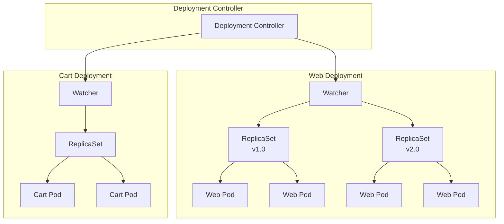
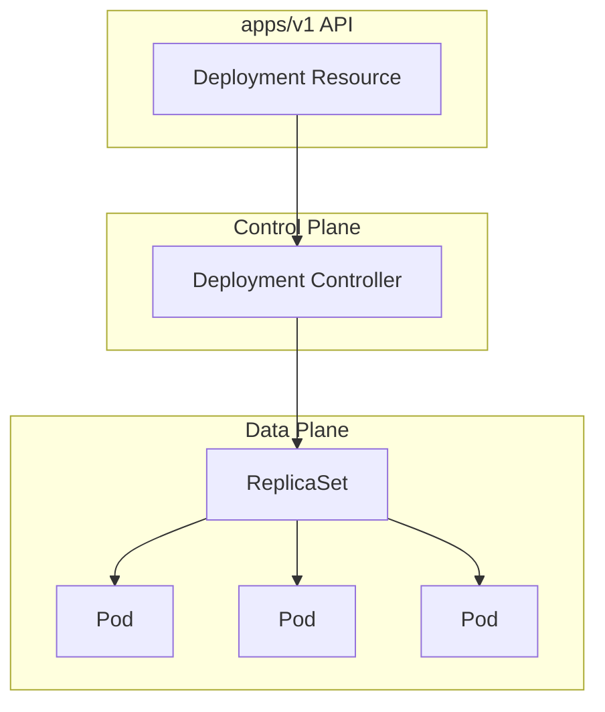
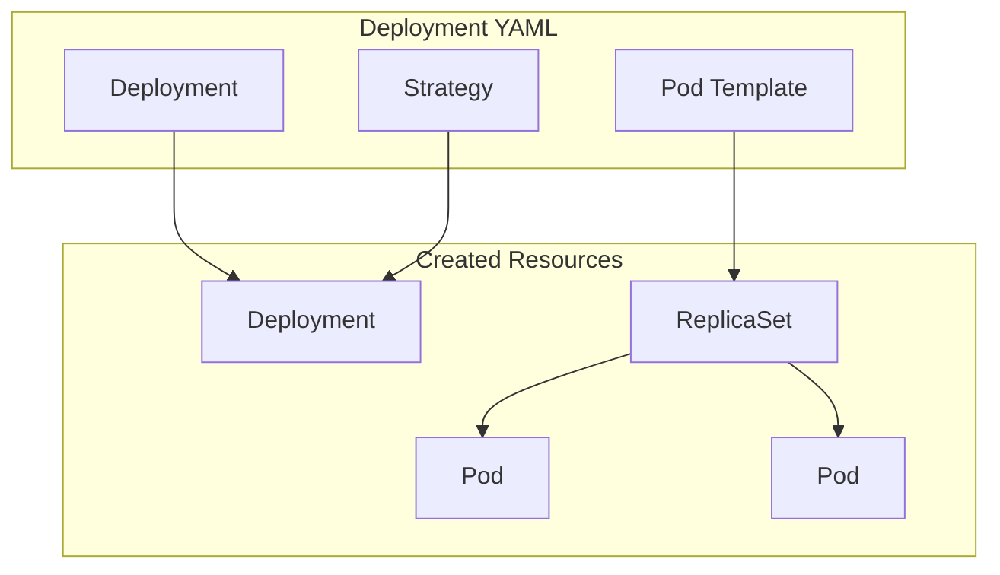
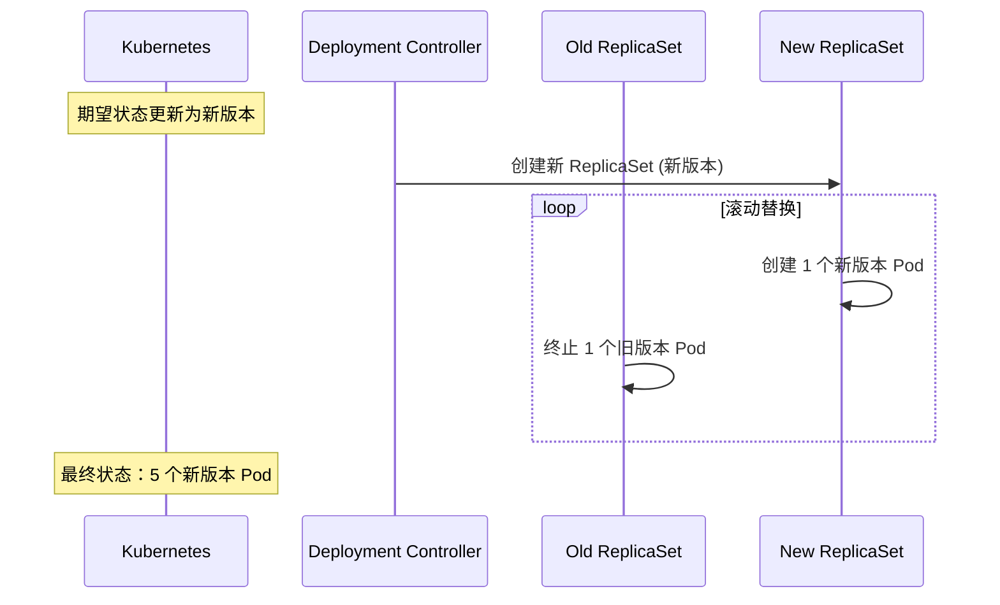

# Kubernetes 部署（Deployments）

本章将向你展示如何使用 Deployment 为 Kubernetes 上的无状态应用添加云原生特性，包括[[自愈]]（self-healing）、[[扩缩容]]（scaling）、[[滚动更新]]（rolling updates）和[[版本回滚]]（rollbacks）。

章节安排如下：
- [[Deployment 理论]]
- [[创建 Deployment]]
- [[手动扩缩容应用]]
- [[执行滚动更新]]
- [[执行回滚]]

---

## [[Deployment 理论]]

Deployment 是运行无状态应用最流行的方式。它们提供了自愈、扩缩容、滚动发布和回滚能力。

### 快速示例

假设你有一个 Web 应用需求：需要具备弹性、可按需扩展，并且经常更新。你编写应用、将其容器化，并定义为 [[Pod]]。然而，在将 Pod 发送给 Kubernetes 之前，你需要将其包装在 Deployment 中，以获得弹性、扩缩容和更新能力。然后将 Deployment 提交给 Kubernetes，Deployment 控制器会部署 Pod。

此时，你的集群正在运行一个管理单个 Pod 的 Deployment。

- 如果 Pod 失败，Deployment 控制器会用新的 Pod 替换它
- 如果需求增加，Deployment 控制器可以通过部署更多相同的 Pod 来扩展应用
- 当你更新应用时，Deployment 控制器会删除旧 Pod 并用新的替换

> [!INFO] 多服务场景
> 假设你添加了一个购物车服务，同样需要弹性、可扩展和定期更新。你会将其容器化，在自己的 Pod 中定义，包装到自己的 Deployment 中，然后部署到集群。此时你有两个管理不同微服务的 Deployment。

下图展示了一个类似设置，Deployment 控制器监视和管理两个 Deployment。web Deployment 管理四个相同的 Web Server Pod，cart Deployment 管理两个相同的购物车 Pod。



> [!TIP] 架构理解
> Deployment 的核心是资源（Resource）和控制器（Controller）的组合。资源定义对象，控制器管理它们。

### 底层架构

在高层，Deployment 遵循标准 Kubernetes 架构：



- **Deployment 资源**位于 `apps/v1` API，定义了所有支持的属性和功能
- **Deployment 控制器**是控制平面服务，监视 Deployment 并协调观察状态与期望状态

---

## [[Deployments 与 Pods 的关系]]

每个 Deployment 管理一个或多个相同的 Pod。

例如，一个包含 Web 服务和购物车服务的应用需要两个 Deployment——一个用于管理 Web Pod，另一个用于管理购物车 Pod。

下图展示了一个 Deployment YAML 文件请求四个相同的 Pod 副本。如果你将副本数增加到六个，它会部署和管理两个更多的相同 Pod。

```yaml
spec:
  replicas: 4              # 请求四个副本
  template:               # Pod 模板嵌入在 Deployment 中
    metadata:
      labels:
        app: web-app
    spec:
      containers:
      - name: web
        image: nginx:latest
```

> [!INFO] Pod 模板
> 注意 Pod 是在 Deployment YAML 中嵌入的模板中定义的。这通常被称为 Pod 模板（Pod template）。

---

## [[Deployments 与 ReplicaSets 的关系]]

我们已经多次提到 Deployment 添加了自愈、扩缩容、滚动更新和回滚功能。然而，在幕后，提供自愈和扩缩容的是一个名为 [[ReplicaSet]] 的资源。



将此 Deployment YAML 提交到集群将创建：
- 一个 Deployment
- 一个 ReplicaSet  
- 两个运行相同容器的相同 Pod

Pod 由 ReplicaSet 管理，而 ReplicaSet 又由 Deployment 管理。但是，**你应该始终通过 Deployment 进行管理**，从不直接管理 ReplicaSet 或 Pod。

---

## [[扩缩容]]

你的应用可以手动扩缩容，我们稍后会看到如何操作。然而，Kubernetes 有多个自动扩缩容器，可以自动扩缩你的应用和基础设施。

### 自动扩缩容器类型

| 自动扩缩容器 | 功能 | 备注 |
|-------------|------|------|
| **HPA** (Horizontal Pod Autoscaler) | 增加和删除 Pod 以满足当前需求 | 大多数集群自动安装，广泛使用 |
| **VPA** (Vertical Pod Autoscaler) | 增加和减少分配给运行中 Pod 的 CPU 和内存 | 未默认安装，有已知限制，每次扩缩容会删除并重建 Pod |
| **CA** (Cluster Autoscaler) | 增加和删除集群节点，确保有足够的节点运行所有调度的 Pod | 默认安装，广泛使用 |

> [!WARNING] VPA 的限制
> VPA 当前实现每次调整 Pod 资源时会删除现有 Pod 并用新的替换。这会中断服务，甚至可能导致 Kubernetes 将新 Pod 调度到不同的节点。正在进行改进以支持对运行中 Pod 的原地更新，但这目前是早期 alpha 功能。

### 多维度自动扩缩容

多维度自动扩缩容（Multi-dimensional autoscaling）是组合多种扩缩容方法的术语：
- Pod 扩缩容和节点扩缩容
- 水平扩缩容（添加更多 Pod）和垂直扩缩容（向现有 Pod 添加更多资源）

---

## [[状态管理]]

在深入了解之前，理解以下概念至关重要。

### 期望状态与观察状态

- **期望状态（Desired state）**：你想要的状态
- **观察状态（Observed state）**：当前实际状态
- **调和（Reconciliation）**：控制器将观察状态与期望状态同步的过程

目标始终是让两者匹配。当它们不匹配时，控制器启动调和过程将观察状态与期望状态同步。

> [!INFO] 声明式模型
> 声明式模型（Declarative model）是我们向 Kubernetes 声明期望状态的方式，而不需要告诉 Kubernetes 如何实现。你将"如何"留给 Kubernetes。

### [[声明式 vs 命令式]]

| 模型 | 描述 | 示例 |
|------|------|------|
| **声明式** | 描述最终目标——告诉 Kubernetes 你想要什么 | "给我一个能喂饱十人的巧克力蛋糕" |
| **命令式** | 需要一长串命令告诉 Kubernetes 如何达到最终目标 | 一系列烘焙步骤：开车去商店、买食材、回家、预热烤箱、混合原料... |

> [!TIP] 为什么 Kubernetes 偏好声明式
> 声明式模型更简单，将"如何"留给 Kubernetes。而命令式模型需要提供所有步骤和命令，更容易出错，且由于没有声明期望状态，就没有自愈能力。

### [[控制器与调和]]

调和对于期望状态管理至关重要。

例如，Kubernetes 将 ReplicaSet 实现为后台控制器，运行在调和循环中，确保始终存在正确数量的 Pod 副本。

```
期望状态：10 个副本
观察状态：8 个 Pod 存在
     ↓
ReplicaSet 控制器创建 2 个新副本
     ↓
观察状态与期望状态同步
```

> [!NOTE] 自愈能力
> 如果 Pod 失败是由于故障还是自动扩缩容器请求增加，都无关紧要。ReplicaSet 控制器会创建缺失的副本来同步观察状态与期望状态。这不需要你的任何帮助！

相同的调和过程实现了自愈、扩缩容、滚动更新和回滚。

---

## [[滚动更新]]

Deployment 在零停机滚动更新（rollouts）方面表现出色。但要发挥最佳效果，你的应用应该设计为：

1. **松耦合，通过 API 通信**
2. **向后和向前兼容**

### 微服务设计原则

**松耦合**：微服务应始终松耦合，只通过明确定义的 API 通信。这样你可以更新和修补任何微服务，而不用担心影响其他服务——所有连接都通过正式的 API，暴露文档化接口并隐藏细节。

**版本兼容性**：确保发布是向后和向前兼容的，意味着你可以执行独立更新，而不需要关心哪些版本的客户端正在使用你的服务。

> [!INFO] 类比理解
> 想象一辆汽车。汽车暴露了标准的驾驶"API"：方向盘和脚踏板。只要不改变这个"API"，你就可以更换发动机、更换排气系统、加大刹车，所有这些都不需要驾驶员学习任何新技能。

### 滚动更新工作原理

```
初始状态：5 个旧版本 Pod
     ↓
创建 1 个新版本 Pod，同时终止 1 个旧版本 Pod
     ↓
状态：4 个旧版本 + 1 个新版本
     ↓
重复上述过程，直到全部 5 个都是新版本
     ↓
零停机完成更新！
```

由于应用是无状态的，多个副本在运行，客户端体验无停机或服务中断。

### 幕后机制

每个微服务构建为容器，包装在 Pod 中。你将每个微服务的 Pod 包装在自己的 Deployment 中以实现自愈、扩缩容和滚动更新。每个 Deployment 定义：

- Pod 副本数量
- 使用的容器镜像
- 网络端口
- 如何执行滚动更新

当你更新 Deployment YAML 文件并重新提交时：
1. 观察状态与期望状态不再匹配
2. Deployment 控制器创建新的 ReplicaSet
3. 新的 ReplicaSet 定义运行新版本的相同数量 Pod
4. Deployment 控制器在新 ReplicaSet 中递增 Pod 数量，同时在旧 ReplicaSet 中递减
5. 结果是平滑、渐进的零停机发布



---

## [[回滚]]

如前所述，较旧的 ReplicaSet 会缩减，不再管理任何 Pod。然而，它们的配置仍然存在，可以用来轻松回滚到早期版本。

回滚过程与发布相反——扩大旧的 ReplicaSet，同时当前版本缩减。

> [!NOTE] 回滚本质
> 不要被"回滚"这个术语混淆。它实际上是更新的一种。它们遵循相同的逻辑和规则——终止当前镜像的 Pod 并替换为运行新镜像的 Pod。在回滚的情况下，"新"镜像实际上是较旧的。

---

## [[创建 Deployment]]

### 准备实验环境

你需要从本书的 GitHub 仓库获取实验室文件。运行以下命令：

```bash
$ git clone https://github.com/nigelpoulton/TKB.git
Cloning into 'TKB'...
$ cd TKB
$ git fetch origin
$ git checkout -b 2025 origin/2025
```

> [!IMPORTANT] 工作分支
> 确保从 2025 分支工作，并从 deployments 文件夹运行所有命令。

### Deployment YAML 文件

我们将使用 `deploy.yml` 文件，它定义了一个包装在 Deployment 中的单容器 Pod。

```yaml
kind: Deployment
apiVersion: apps/v1
metadata:
  name: hello-deploy
spec:
  replicas: 10                    # 部署的 Pod 副本数
  selector:
    matchLabels:
      app: hello-world
  revisionHistoryLimit: 5         # 保留最近 5 个 ReplicaSet
  progressDeadlineSeconds: 300    # 每个新副本的启动超时时间
  minReadySeconds: 10             # Pod 就绪后等待时间
  strategy:                       # 定义滚动更新策略
    type: RollingUpdate
    rollingUpdate:
      maxUnavailable: 1           # 最多不可用 1 个副本
      maxSurge: 1                 # 最多超出 1 个副本
  template:
    metadata:
      labels:
        app: hello-world
    spec:
      containers:
      - name: hello-pod
        image: nigelpoulton/k8bbook:1.0
        ports:
        - containerPort: 8080
```

### YAML 字段解析

| 字段 | 说明 |
|------|------|
| `spec.replicas` | 请求 10 个 Pod 副本 |
| `spec.selector` | 标签选择器，定义管理哪些 Pod |
| `spec.revisionHistoryLimit` | 保留前 5 个 ReplicaSet 以支持回滚 |
| `spec.progressDeadlineSeconds` | 每个新副本有 5 分钟启动窗口 |
| `spec.strategy.type` | 使用 RollingUpdate 策略 |
| `maxUnavailable: 1` | 最多不可用 1 个副本 |
| `maxSurge: 1` | 最多超出 1 个副本（即最多 11 个） |
| `spec.template` | 以下定义此 Deployment 管理的 Pod |

> [!TIP] 对象命名规范
> 应始终给对象有效的 DNS 名称。这意味着对象名称中应只使用字母数字、点和破折号。

### 部署到集群

```bash
$ kubectl apply -f deploy.yml
deployment.apps/hello-deploy created
```

此时，Deployment 配置持久化到集群存储作为意图记录，Kubernetes 已将 10 个副本调度到健康的工作节点。Deployment 和 ReplicaSet 控制器也在后台运行，监视状态并准备执行调和操作。

---

## [[查看 Deployment]]

### kubectl get 和 describe

```bash
$ kubectl get deploy hello-deploy
NAME           READY   UP-TO-DATE   AVAILABLE   AGE
hello-deploy   10/10   10          10          105s

$ kubectl describe deploy hello-deploy
Name:                   hello-deploy
Namespace:              default
Annotations:            deployment.kubernetes.io/revision: 1
Selector:               app=hello-world
Replicas:               10 desired | 10 updated | 10 total | 10 available
StrategyType:           RollingUpdate
MinReadySeconds:        10
RollingUpdateStrategy:  1 max unavailable, 1 max surge
...
NewReplicaSet:   hello-deploy-54f5d46964 (10/10 replicas created)
```

### 查看 ReplicaSet

```bash
$ kubectl get rs
NAME                      DESIRED   CURRENT   READY   AGE
hello-deploy-54f5d46964   10        10        10      3m45s
```

> [!INFO] ReplicaSet 命名
> ReplicaSet 的名称匹配 Deployment 名称，末尾添加了哈希值。这是 Pod 模板部分的加密哈希。对 Pod 模板部分的任何更改都会启动滚动更新并创建具有新哈希的 ReplicaSet。

### 通过 Service 访问应用

Deployment 正在运行，你有 10 个副本。但是，你需要 Kubernetes Service 对象才能连接到应用。

创建 Service：

```yaml
apiVersion: v1
kind: Service
metadata:
  name: lb-svc
  labels:
    app: hello-world
spec:
  type: LoadBalancer
  ports:
  - port: 8080
    protocol: TCP
  selector:
    app: hello-world
```

```bash
$ kubectl apply -f lb.yml
service/lb-svc created

$ kubectl get svc lb-svc
NAME     TYPE           CLUSTER-IP       EXTERNAL-IP   PORT(S)    
lb-svc   LoadBalancer   10.100.247.251   localhost     8080:31086/
```

在浏览器中访问 `localhost:8080`。

---

## [[手动扩缩容]]

你可以用两种方式手动扩缩容 Deployment：

### 命令式扩缩容

```bash
$ kubectl scale deploy hello-deploy --replicas 5
deployment.apps/hello-deploy scaled

$ kubectl get deploy hello-deploy
NAME           READY   UP-TO-DATE   AVAILABLE   AGE
hello-deploy   5/5     5            5           29m
```

> [!WARNING] 命令式扩缩容的隐患
> 当前环境状态与你声明的清单不再匹配——集群上有 5 个副本，但你的 Deployment YAML 仍定义为 10。这可能在执行未来更新时导致问题。例如，更新 YAML 中的镜像版本并重新提交到集群也会将副本数改回 10。
>
> **最佳实践**：始终通过 YAML 清单进行声明式更改，保持清单与实时环境同步。

### 声明式扩缩容

将 YAML 文件中的副本数改回 10，然后重新提交：

```bash
$ kubectl apply -f deploy.yml
deployment.apps/hello-deploy configured

$ kubectl get deploy hello-deploy
NAME           READY   UP-TO-DATE   AVAILABLE   AGE
hello-deploy   10/10   10          10          38m
```

---

## [[执行滚动更新]]

> [!INFO] 术语说明
> 滚动更新（rollout）、发布（release）、零停机更新（zero-downtime update）和滚动更新（rolling update）含义相同，本章交替使用。

### 前提条件

> [!IMPORTANT] Pod 不可变性
> 所有更新操作实际上都是替换操作。当你更新 Pod 时，实际上是删除它并用新的替换。这是因为 Pod 是不可变对象，所以在部署后你永远不会更改或更新它们。

### 更新步骤

1. 使用编辑器更新 `deploy.yml` 中的镜像版本：

```yaml
spec:
  template:
    spec:
      containers:
      - name: hello-pod
        image: nigelpoulton/k8sbook:2.0  # 从 1.0 更新到 2.0
        ports:
        - containerPort: 8080
```

2. 重新提交清单到集群：

```bash
$ kubectl apply -f deploy.yml
deployment.apps/hello-deploy configured
```

3. 监视滚动更新进度：

```bash
$ kubectl rollout status deployment hello-deploy
Waiting for deployment "hello-deploy" rollout... 4 out of 10 new replicas
Waiting for deployment "hello-deploy" rollout... 6 out of 10 new replicas
Waiting for deployment "hello-deploy" rollout... 10 out of 10 new replicas
deployment "hello-deploy" successfully rolled out
```

4. 检查状态：

```bash
$ kubectl get deploy hello-deploy
NAME           READY   UP-TO-DATE   AVAILABLE   AGE
hello-deploy   10/10   10          10          71m
```

### 暂停和恢复滚动更新

**暂停**：

```bash
$ kubectl rollout pause deploy hello-deploy
deployment.apps/hello-deploy paused
```

暂停期间查看状态：

```bash
$ kubectl describe deploy hello-deploy
Name:                   hello-deploy
Annotations:            deployment.kubernetes.io/revision: 2
...
Conditions:
  Type           Status   Reason
  Available      True     MinimumReplicasAvailable
  Progressing    Unknown  DeploymentPaused
OldReplicaSets:  hello-deploy-54f5d46964 (3/3 replicas created)
NewReplicaSet:   hello-deploy-5f84c5b7b7 (6/6 replicas created)
```

**恢复**：

```bash
$ kubectl rollout resume deploy hello-deploy
deployment.apps/hello-deploy resumed
```

刷新浏览器查看更新后的应用！

---

## [[执行回滚]]

### 查看回滚历史

```bash
$ kubectl rollout history deployment hello-deploy
deployment.apps/hello-deploy
REVISION  CHANGE-CAUSE
1         <none>
2         <none>
```

- Revision 1：基于 1.0 镜像的初始发布
- Revision 2：更新 Pod 到 2.0 镜像的滚动更新

### 查看 ReplicaSet

```bash
$ kubectl get rs
NAME                      DESIRED   CURRENT   READY   AGE
hello-deploy-5f84c5b7b7   10        10        10      27m
hello-deploy-54f5d46964   0         0         0       93m
```

### 执行回滚

```bash
$ kubectl rollout undo deployment hello-deploy --to-revision=1
deployment.apps "hello-deploy" rolled back
```

> [!TIP] 快速回滚
> 虽然这看起来像是即时操作，但实际上不是。回滚遵循与滚动更新相同的规则。你可以用以下命令验证进度：
>
> ```bash
> $ kubectl get deploy hello-deploy
> NAME           READY   UP-TO-DATE   AVAILABLE   AGE
> hello-deploy   9/10    6            9           96m
> ```

恭喜！你已成功执行了滚动更新和回滚。

---

## [[标签与 Rollouts]]

### pod-template-hash 标签

Deployment 和 ReplicaSet 使用标签和选择器来确定它们拥有和管理哪些 Pod。

在较新版本的 Kubernetes 中，Deployment（通过 ReplicaSet）创建的所有 Pod 都会添加一个系统生成的 `pod-template-hash` 标签。这可以防止高级别控制器夺取现有静态 Pod 的所有权。

```bash
$ kubectl get pods --show-labels
NAME                        READY   STATUS    LABELS
hello-deploy-54f5d46964..  1/1     Running   app=hello-world,pod-template-hash=54f5d46964
...
```

> [!NOTE] 设计目的
> ReplicaSet 在其标签选择器中包含 `pod-template-hash` 标签，但 Deployment 不包含。因为实际上是由 ReplicaSet 管理 Pod。你不应该尝试修改 `pod-template-hash` 标签。

---

## [[清理]]

使用以下命令删除示例中创建的 Deployment 和 Service：

```bash
$ kubectl delete -f deploy.yml
$ kubectl delete -f lb.yml
```

---

## [[章节总结]]

本章学习要点：

> [!TIP] 核心要点
> 1. **Deployment 是管理无状态应用的绝佳方式**，它们增强了 Pod 的自愈、扩缩容、滚动更新和回滚能力
> 2. **Deployment 是 Kubernetes API 中的对象**，应声明式地使用它们
> 3. **Deployment 定义在 `apps/v1` API 中**，实现了一个在控制平面上作为调和循环运行的控制器
> 4. **Deployment 在幕后使用 ReplicaSet** 来创建、终止和管理 Pod 副本数量
> 5. **你不应直接创建或编辑 ReplicaSet**，应始终通过 Deployment 配置它们

### 关键概念回顾

| 概念 | 说明 |
|------|------|
| [[期望状态]] | 你想要的状态 |
| [[观察状态]] | 当前实际状态 |
| [[调和]] | 控制器将观察状态与期望状态同步 |
| [[声明式模型]] | 声明期望状态，由 Kubernetes 实现 |
| [[命令式模型]] | 提供详细步骤和命令 |

### 滚动更新配置

```yaml
strategy:
  type: RollingUpdate
  rollingUpdate:
    maxUnavailable: 1  # 最多不可用 1 个副本
    maxSurge: 1        # 最多超出 1 个副本
```

这些设置确保滚动更新平滑、增量执行，同时保持足够的可用性。