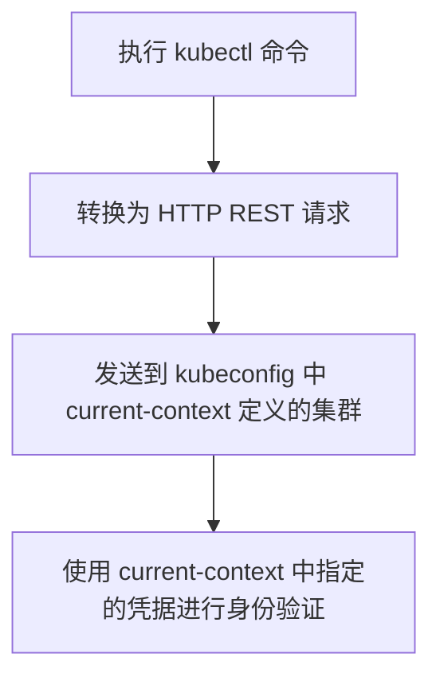
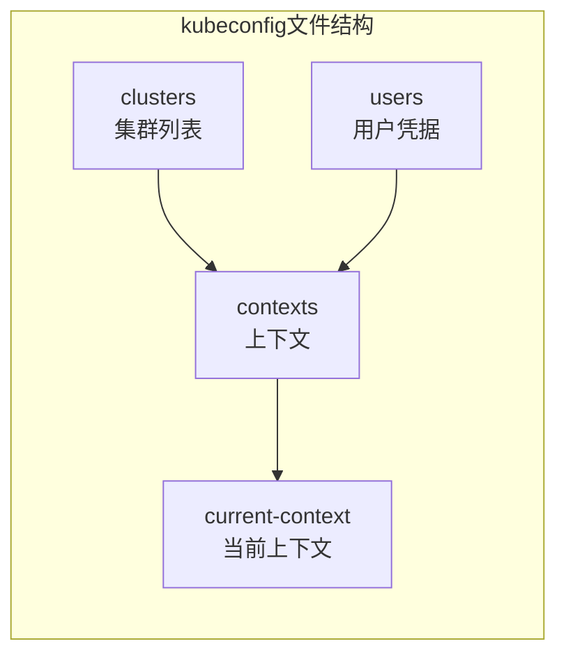

# 第3章：部署 Kubernetes

> [!INFO] 本章内容概要
> 本章将指导您安装和配置本书所有示例所需的工具，包括：
> - [[Docker]] 容器引擎
> - [[Kubernetes]] 集群
> - kubectl 命令行工具

获取这三样工具最简单的方式是 **Docker Desktop**。它不仅安装了 Docker，还包含一个多节点集群，并能自动安装和配置 kubectl。我每天都使用它，强烈推荐。

> [!WARNING] 重要限制
> Docker Desktop 内置的集群无法用于第 8 章和第 11 章的示例。这是因为这两章需要集成云负载均衡器和云存储服务。

> [!TIP] 灵活的学习方案
> 您可以先用 Docker Desktop 的内置集群学习大部分示例，仅在需要时再构建云端集群。

---

## 3.1 Docker Desktop 全套安装

### 3.1.1 创建 Docker 账号

访问 [app.docker.com/signup](https://app.docker.com/signup) 注册免费个人账号。

> [!NOTE] 许可证说明
> Docker Desktop 对个人和教育用途免费。如果您的公司员工超过 250 人或年收入超过 1000 万美元，则需要付费许可。

### 3.1.2 安装 Docker Desktop

> [!INFO] 版本要求
> 需要 Docker Desktop 4.38 或更高版本。

**安装步骤：**

1. 在网上搜索 **Docker Desktop**
2. 下载适合您系统的安装包（Linux、Mac 或 Windows）
3. 运行安装程序，按提示完成安装
4. **Windows 用户**：当提示安装 WSL 2 子系统时，请务必安装

安装完成后，可能需要手动启动应用：
- **Mac 用户**：菜单栏顶部会显示鲸鱼图标
- **Windows 用户**：系统托盘底部会显示鲸鱼图标

点击鲸鱼图标可以查看基本控制选项和运行状态。

**验证安装：**

```bash
$ docker --version
Docker version 27.5.1, build 9f9e405

$ kubectl version --client=true -o yaml
clientVersion:
  major: "1"
  minor: "31"
  platform: darwin/arm64
```

> [!SUCCESS] 恭喜！
> 您已成功安装 Docker 和 kubectl。

### 3.1.3 部署 Docker Desktop 内置多节点集群

Docker Desktop v4.38 及更高版本内置了多节点集群，部署简单。

**部署步骤：**

1. 点击菜单栏/系统托盘中的 Docker 鲸鱼图标并登录
2. 再次点击鲸鱼图标，选择 **Settings** 打开设置界面
3. 在 **General** 选项卡中，确保勾选 **Use containerd for pulling and storing images**
4. 从左侧导航栏选择 **Kubernetes**
5. 勾选 **Enable Kubernetes** 选项
6. 选择 **kind (sign-in required)** 选项

> [!IMPORTANT] 关键选择
> 务必选择 `kind (sign-in required)` 选项。另一个选项 `kubeadm` 只会创建单节点集群。

> [!TIP] Konami 码
> 如果使用 v4.38 或更高版本但看不到 kind 选项，可以尝试输入 Konami 码：在 Kubernetes 设置页面依次输入 `↑↑↓↓←→←→BA`。这会打开 Experimental features 页面，您可以启用 MultiNodeKubernetes 功能。

7. 将 **Node(s)** 滑块设置为 **3**
8. 勾选 **Show system containers (advanced)** 选项
9. 可选：启用 Kubernetes Dashboard（本书示例不会用到）

> [!INFO] 图示说明
> 图 3.1 - Docker Desktop Kubernetes 配置界面

这将创建一个包含一个控制平面节点和两个工作节点的三节点集群。

10. 点击 **Apply & restart**

集群启动可能需要一到两分钟，您可以在同一界面监控构建进度。集群运行后，Docker Desktop 界面底部会显示绿色的 "Kubernetes running" 文字。

**查看集群状态：**

```bash
$ kubectl get nodes
NAME                    STATUS   ROLES           AGE   VERSION
desktop-control-plane   Ready    control-plane   10m   v1.32.2
desktop-worker          Ready    <none>          10m   v1.32.2
desktop-worker2         Ready    <none>          10m   v1.32.2
```

> [!INFO] Docker Desktop 容器化实现
> 返回 Docker Desktop 的 Containers 选项卡，您会看到三个容器，名称与集群节点相同。这是因为 Docker Desktop 将集群作为容器运行。不要感到困惑，用户体验完全相同。

> [!INFO] 图示说明
> 图 3.2 - 作为容器运行的集群节点

> [!SUCCESS] 阶段性成果
> 您已成功安装 Docker 和 kubectl，并在笔记本电脑上部署了多节点集群。大部分书中的示例都可以使用这个集群完成。

---

## 3.2 在 Linode 云平台构建 LKE 集群

> [!TIP] 云端集群的必要性
> 如果您想跟随第 8 章（Ingress）和第 11 章（存储）的示例，需要在云端构建集群。

本节将展示如何使用 Linode Kubernetes Engine (LKE) 在云端获取多节点集群。大多数云服务商都提供自己的 Kubernetes 服务，您可以使用任何一个。但是，第 11 章的示例设计为与 Linode 云存储配合使用，如果您使用其他云平台，需要修改存储配置文件。

> [!INFO] 免费额度
> 我提供了一个链接，新用户可获得 100 美元的 Linode 信用额度，有效期 60 天，足够完成本书所有示例。

### 3.2.1 注册 Linode 账号

访问以下链接注册，获取 60 天有效的 100 美元免费信用额度：

**https://bit.ly/4b7YZix**

> [!NOTE] 备用链接
> 如果上述链接失效，可以尝试完整 URL：
> `https://www.linode.com/lp/refer/?r=6107b344722dbd6017ea12da672510`

> [!WARNING] 计费提醒
> 如果超过 60 天或使用超出免费额度，需要支付费用。请确保输入有效的账单信息。

如果链接完全失效，您需要从 linode.com 首页注册，可能无法获得免费额度。

### 3.2.2 创建 LKE 集群

1. 创建账号后，访问 [cloud.linode.com](https://cloud.linode.com)
2. 从左侧导航栏选择 **Kubernetes**
3. 点击 **Create Cluster** 按钮

**集群配置：**

| 配置项 | 值 |
|--------|-----|
| Cluster label | tkb |
| Region | 选择离您最近的区域 |
| Kubernetes Version | 选择一个近期版本 |
| HA Control Plane | No |
| Control Plane ACL | Disabled |
| Add Node Pools | Shared CPU 选项卡，添加 3 个 Linode 2GB 节点 |

> [!INFO] 图示说明
> 图 3.3 - LKE 集群设置

> [!INFO] 费用预估
> 界面会显示预估的集群费用。

4. 确认配置和费用后，点击 **Create Cluster** 按钮

Linode 构建集群可能需要一到两分钟。

> [!SUCCESS] 集群就绪
> 当三个节点都显示绿色时，表示集群已就绪。接下来只需配置 kubectl 连接到此集群。

### 3.2.3 配置 kubectl

> [!INFO] kubectl 版本匹配
> kubectl 版本必须与集群版本相差不超过一个次版本号。例如，如果集群运行 Kubernetes v1.32.x，kubectl 版本应在 v1.31.x 到 v1.33.x 之间。

**kubeconfig 文件位置：**

kubectl 在幕后读取 kubeconfig 文件来确定：
- 向哪个集群发送命令
- 使用哪些凭据进行身份验证

kubeconfig 文件名为 `config`，位于以下隐藏目录中：

```
macOS:  /Users/<用户名>/.kube/
Windows: C:\Users/<用户名>\.kube\
```

> [!NOTE] 显示隐藏文件夹
> 如果系统默认不显示隐藏文件夹，请先配置系统以显示隐藏文件夹。

根据您的情况完成以下相应步骤：

---

#### 如果您没有 kubeconfig 文件

> [!INFO] 前提条件
> 仅在您确定主目录下没有名为 `.kube` 的隐藏文件夹时才执行以下步骤。

**配置步骤：**

1. 在主目录下创建一个名为 `.kube` 的隐藏文件夹（注意前面的小数点）
2. 从 Linode Cloud 仪表板下载 LKE kubeconfig 文件到 `~/.kube` 目录
3. 将文件名重命名为 `config`

> [!WARNING] 文件名关键
> 文件名必须是 `config`，**不能有任何扩展名**（如 `.yaml`）。您可能需要配置系统以显示文件扩展名。

完成后可以跳到「测试 LKE 集群」部分。

---

#### 如果您已有 kubeconfig 文件

**配置步骤：**

1. 将现有的 kubeconfig 文件重命名为 `config-bkp`
2. 从 Linode Cloud 仪表板下载 LKE kubeconfig 文件，复制到 `~/.kube` 目录
   - 如果按之前的说明创建，文件名应为 `tkb-kubeconfig.yaml`
3. 运行以下命令合并两个配置并验证：

```bash
$ export KUBECONFIG=~/.kube/config-bkp:~/.kube/tkb-kubeconfig.yaml
$ kubectl config view
```

> [!INFO] 合并结果示例
> 如果合并成功，您应该会在 cluster、user 和 context 部分看到 LKE 集群的详细信息。

4. 将合并后的配置导出为新的 config 文件：

```bash
$ kubectl config view --flatten > ~/.kube/config
$ export KUBECONFIG=~/.kube/config
```

5. **设置当前上下文**为 LKE 集群

> [!TIP] Docker Desktop 用户
> 如果安装了 Docker Desktop，可以点击鲸鱼图标，从 **Kubernetes Context** 选项中选择 LKE 上下文。

**手动切换上下文（无 Docker Desktop）：**

```bash
$ kubectl config get-contexts
CURRENT   NAME             CLUSTER          AUTHINFO          NAMESPACE
*         docker-desktop   docker-desktop   docker-desktop    default
          lke349416-ctx    lke349416        lke349416-admin   default

$ kubectl config use-context lke349416-ctx
Switched to context "lke349416-ctx".
```

> [!NOTE] 上下文名称
> 您的 LKE 上下文名称会与示例不同，请使用实际的上下文名称。

### 3.2.4 测试 LKE 集群

```bash
$ kubectl get nodes
NAME                             STATUS   ROLES     AGE    VERSION
lke349416-551020-184a46360000    Ready    <none>    19m    v1.32.2
lke349416-551020-1c6f99c20000    Ready    <none>    19m    v1.32.2
lke349416-551020-47ad6c5c0000    Ready    <none>    19m    v1.32.2
```

> [!SUCCESS] 成功标志
> 您应该看到三个节点，名称以 `lke` 开头，ROLES 列显示 `<none>` 表示都是工作节点。这是因为 Linode 负责管理控制平面，不对用户开放。

> [!WARNING] 故障排除
> 如果出现错误或节点名称不以 `lke` 开头，最可能的原因是 kubeconfig 文件有问题。请回顾前面的步骤，确保完整执行了所有配置。

> [!CAUTION] 成本提醒
> 使用完毕后请记得删除 LKE 集群，以避免不必要的费用。

---

## 3.3 kubectl 与 kubeconfig 文件详解

### 3.3.1 kubectl 工作原理

每次执行 kubectl 命令时，都会执行以下三个步骤：



### 3.3.2 kubeconfig 文件结构

kubeconfig 文件定义了四个核心概念：



| 组成部分 | 说明 | 示例 |
|---------|------|------|
| **clusters** | 已知的 Kubernetes 集群列表 | shield |
| **users** | 用户凭据列表 | coulson |
| **contexts** | 集群与凭据的组合 | director |
| **current-context** | 当前使用的上下文 | director |

**示例说明：**

假设您有一个名为 `ops-prod` 的上下文，它将 `ops` 凭据与 `prod` 集群关联。如果这也设置为当前上下文，kubectl 会将所有命令发送到 prod 集群，并使用 ops 凭据进行身份验证。

### 3.3.3 kubeconfig 文件示例

```yaml
apiVersion: v1
kind: Config

clusters:                                    # 所有已知集群
- name: shield                               # 友好名称
  cluster:
    server: https://192.168.1.77:8443        # 集群 API 服务器地址
    certificate-authority-data: LS0tLS...    # 集群证书数据

users:                                       # 用户凭据
- name: coulson                              # 友好名称
  user:
    client-certificate-data: LS0tLS1CRU...  # 用户证书
    client-key-data: LS0tLS1CRUdJTiBFQyB     # 用户私钥

contexts:                                    # 上下文列表
- context:
    name: director                           # 上下文名称
    cluster: shield                          # 发送命令到此集群
    user: coulson                            # 使用此凭据认证

current-context: director                    # kubectl 将使用此上下文
```

### 3.3.4 常用 kubectl config 命令

```bash
# 查看当前上下文
$ kubectl config current-context
docker-desktop

# 查看完整配置（敏感数据会被遮蔽）
$ kubectl config view

# 列出所有上下文
$ kubectl config get-contexts

# 切换上下文
$ kubectl config use-context <上下文名称>
```

> [!TIP] Docker Desktop 用户快捷方式
> 如果安装了 Docker Desktop，可以点击鲸鱼图标，从 **Kubernetes Context** 选项中快速切换上下文。

---

## 3.4 本章小结

> [!SUMMARY] 本章要点
> - Docker Desktop 是获取本地 Kubernetes 集群最便捷的方式
> - LKE（Linode Kubernetes Engine）是零运维的生产级 Kubernetes 托管服务
> - kubectl 通过 kubeconfig 文件管理集群连接和身份验证
> - 上下文（context）让您轻松在多个集群间切换

> [!INFO] 更多选择
> 除了 Docker Desktop，还有 **k3d**、**KinD** 和 **minikube** 等工具可以在笔记本电脑上部署 Kubernetes 集群。Docker Desktop 的优势在于它附带完整的 Docker 开发工具套件并自动安装 kubectl。

---

## 相关资源

- [[Docker Desktop 官方文档]]
- [[kubectl 安装指南]]
- [[Linode Kubernetes Engine (LKE) 文档]]
- [[Kubernetes 官方文档]]