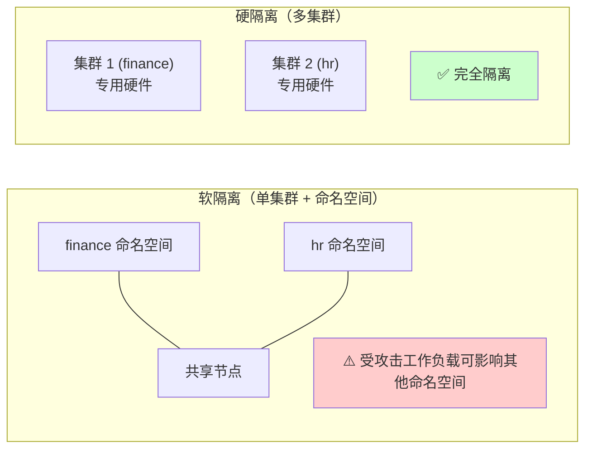

# 5: 虚拟集群与命名空间

命名空间是一种将 Kubernetes 集群划分为多个虚拟集群的方法。

> [!NOTE] 章节目标
> 本章为命名空间奠定基础，帮助你快速掌握创建和管理命名空间的方法，并介绍一些用例。你将在后续章节中看到它们的应用。

---

## 命名空间简介

首先需要了解的是，Kubernetes 命名空间与 Linux 内核命名空间并不相同。

| 类型 | 说明 |
|------|------|
| **内核命名空间** | 将操作系统分区为称为容器的虚拟操作系统 |
| **Kubernetes 命名空间** | 将 Kubernetes 集群分区为称为命名空间的虚拟集群 |

> [!TIP] 命名约定
> 当我们指代 Kubernetes 命名空间时，使用大写的 **Namespace**。这遵循了 Kubernetes API 资源大写的惯例，以明确我们指的是 Kubernetes 命名空间，而非内核命名空间。

同样重要的是要知道，命名空间是一种**软隔离**形式，支持**软多租户**。例如，你可以为 dev、test 和 qa 环境创建命名空间，并为每个环境应用不同的配额和策略。但是，一个命名空间中受到攻击的工作负载很容易影响其他命名空间中的工作负载。

以下命令显示对象是否有命名空间限制。如你所见，大多数对象都有命名空间限制，这意味着你可以将它们部署到具有自定义策略和配额的具体命名空间中。没有命名空间限制的对象（如节点和持久卷）是集群范围的，无法部署到具体的命名空间。

```bash
$ kubectl api-resources

NAME                     SHORTNAMES   ...    NAMESPACED   KIND
nodes                    no                  false        Node
persistentvolumeclaims   pvc                 true         Persist
persistentvolumes        pv                  false        Persist
pods                     po                  true         Pod
podtemplates                                 true         PodTemp
replicationcontrollers   rc                  true         Replica
resourcequotas           quota               true         Resourc
secrets                                      true         Secret
serviceaccounts          sa                  true         ServiceA
services                 svc                 true         Service
<Snip>
```

除非你另行指定，否则 Kubernetes 会将对象部署到 **default** 命名空间。

---

## 命名空间用例

命名空间是多个租户共享同一集群的一种方式。

> [!INFO] 什么是租户？
> 租户是一个宽泛的术语，可以指单个应用程序、不同的团队或部门，甚至外部客户。

如何实现命名空间以及你将什么视为租户取决于你，但最常见的是使用命名空间来划分供同一组织内租户使用的集群。

例如，你可以将生产集群划分为以下三个命名空间以匹配组织结构：

- `finance` - 财务
- `hr` - 人力资源
- `corporate-ops` - 企业运营

你会将财务应用部署到 `finance` 命名空间，HR 应用部署到 `hr` 命名空间，企业应用部署到 `corporate-ops` 命名空间。每个命名空间都可以有自己的用户、权限、资源配额和策略。

> [!WARNING] 外部租户隔离的局限性
> 使用命名空间为外部租户划分集群并不常见。这是因为它们只提供软隔离，无法防止受攻击的工作负载逃逸命名空间并影响其他命名空间中的工作负载。在撰写本文时，强烈隔离租户的最常见方式是让它们运行在各自的集群和各自的硬件上。

图 5.1 展示了软隔离和硬隔离的对比：

- **左侧集群**：使用命名空间实现软多租户。所有应用共享相同的节点和控制平面，受攻击的工作负载可能影响两个命名空间。
- **右侧两个集群**：通过在专用硬件上实现两个独立集群来提供强隔离。



**图 5.1 - 软隔离与硬隔离**

> [!SUMMARY] 隔离策略对比
> - **命名空间**：轻量级、易于管理，但仅提供软隔离
> - **多集群**：成本更高、管理开销更大，但提供强隔离

---

## 默认命名空间

每个 Kubernetes 集群都有一组预创建的命名空间。运行以下命令列出你的命名空间：

```bash
$ kubectl get namespaces

NAME             STATUS    AGE
default          Active    2d
kube-system      Active    2d
kube-public      Active    2d
kube-node-lease  Active    2d
```

| 命名空间 | 用途 |
|---------|------|
| `default` | 新对象在未指定命名空间时的默认部署位置 |
| `kube-system` | 运行控制平面组件，如内部 DNS 服务和指标服务器 |
| `kube-public` | 用于需要任何人都可读取的对象 |
| `kube-node-lease` | 用于节点心跳和管理节点租约 |

运行 `kubectl describe` 检查集群上的某个命名空间。在使用 kubectl 时，你可以用 `namespace` 的简写 `ns`：

```bash
$ kubectl describe ns default

Name:         default
Labels:       kubernetes.io/metadata.name=default
Annotations:  <none>
Status:       Active

No resource quota.
No LimitRange resource.
```

你还可以在 kubectl 命令中添加 `-n` 或 `--namespace` 参数来筛选特定命名空间的结果：

```bash
$ kubectl get svc --namespace kube-system

NAME                 TYPE           CLUSTER-IP     EXTERNAL-IP   
kube-dns             ClusterIP      10.43.0.10     <none>        
metrics-server       ClusterIP      10.43.4.203    <none>        
traefik-prometheus   ClusterIP      10.43.49.213   <none>        
traefik              LoadBalancer   10.43.222.75   <pending>     
```

你也可以使用 `--all-namespaces` 标志返回所有命名空间中的对象。

---

## 创建和管理命名空间

本节将介绍如何创建、检查和删除命名空间。

> [!TIP] 前置准备
> 如果你想跟着操作，需要克隆本书的 GitHub 仓库，并且需要在 `2025` 分支上。

```bash
$ git clone https://github.com/nigelpoulton/TKB.git
<Snip>

$ cd TKB
$ git fetch origin
$ git checkout -b 2025 origin/2025
```

你还需要从仓库的 `namespaces` 目录运行所有命令。

命名空间是核心 v1 API 组中的一级资源。这意味着它们稳定、易于理解，并且已经存在很长时间。这也意味着你可以用命令式（通过 CLI）或声明式（通过配置文件）方式操作它们。我们两种方式都会用到。

### 创建命名空间

运行以下命令创建一个名为 `hydra` 的新命名空间：

```bash
$ kubectl create ns hydra
namespace/hydra created
```

现在用声明式方式从 `shield-ns.yml` YAML 文件创建一个命名空间。这是一个定义名为 `shield` 的命名空间的简单文件：

```yaml
kind: Namespace
apiVersion: v1
metadata:
  name: shield
  labels:
    env: marvel
```

用以下命令创建它：

```bash
$ kubectl apply -f shield-ns.yml
namespace/shield created
```

列出所有命名空间，查看你创建的两个新命名空间：

```bash
$ kubectl get ns

NAME         STATUS   AGE
<Snip>
hydra        Active   49s
shield       Active   3s
```

> [!CAUTION] 漫威彩蛋
> 如果你了解漫威电影宇宙，就会知道 Shield 和 Hydra 是死对头，不应该让它们只靠命名空间分隔就共享同一个集群。

删除 `hydra` 命名空间：

```bash
$ kubectl delete ns hydra
namespace "hydra" deleted
```

### 配置 kubectl 使用特定命名空间

使用命名空间时，你会很快意识到需要在所有 kubectl 命令中添加 `-n` 或 `--namespace` 标志是很麻烦的。更好的方法是配置 kubeconfig 自动针对特定命名空间运行命令。

运行以下命令配置 kubeconfig，使所有未来的 kubectl 命令针对 `shield` 命名空间运行：

```bash
$ kubectl config set-context --current --namespace shield
Context "tkb" modified.
```

运行几个简单的 kubectl get 命令来测试它是否生效。由于 `shield` 命名空间是空的，你的命令不会返回任何对象。

---

## 部署对象到命名空间

如前所述，大多数对象都有命名空间限制，Kubernetes 会将新对象部署到 **default** 命名空间，除非你另行指定。

将对象部署到特定命名空间有两种方式：

| 方式 | 方法 |
|------|------|
| **命令式** | 在命令中添加 `-n` 或 `--namespace` 标志 |
| **声明式** | 在对象的 YAML 清单中指定命名空间 |

让我们使用声明式方法将一个应用部署到 `shield` 命名空间。

该应用定义在本书 GitHub 仓库 `namespaces` 文件夹中的 `app.yml` 文件中。它定义了三个对象：[[ServiceAccount]]、[[Service]] 和 [[Pod]]。以下 YAML 摘录显示了所有三个对象都针对 `shield` 命名空间。

> [!NOTE] 无需完全理解
> 如果你不理解 YAML 中的所有内容也没关系。你只需要知道它定义了三个对象，并将每个对象指向 `shield` 命名空间。

```yaml
apiVersion: v1
kind: ServiceAccount
metadata:
  namespace: shield     <<---- 命名空间
  name: default
---
apiVersion: v1
kind: Service
metadata:
  namespace: shield     <<---- 命名空间
  name: the-bus
spec:
  type: LoadBalancer
  ports:
  - port: 8080
    targetPort: 8080
  selector:
    env: marvel
---
apiVersion: v1
kind: Pod
metadata:
  namespace: shield     <<---- 命名空间
  name: triskelion
<Snip>
```

用以下命令部署它。如果[[ServiceAccount]] 出现关于缺少注解的警告，请不用担心：

```bash
$ kubectl apply -f app.yml
serviceaccount/default configured
service/the-bus configured
pod/triskelion created
```

运行几个命令验证所有三个对象都在 `shield` 命名空间中。如果你已经配置 kubectl 自动针对 `shield` 命名空间，则不需要添加 `-n shield` 标志：

```bash
$ kubectl get pods -n shield

NAME         READY   STATUS    RESTARTS   AGE
triskelion   1/1     Running   0          48s

$ kubectl get svc -n shield

NAME      TYPE           CLUSTER-IP     EXTERNAL-IP   PORT(S)     
the-bus   LoadBalancer   10.43.30.174   localhost     8080:31112/T
```

现在你已经部署了应用，可以使用浏览器或 curl 命令连接到 EXTERNAL-IP 列中的值，端口 8080。

> [!TIP] Docker Desktop 用户注意
> 某些 Docker Desktop 集群会在 EXTERNAL-IP 中错误显示 172 IP 地址。你需要将其替换为 `localhost` 并连接到 `localhost:8080`。

```bash
$ curl localhost:8080

<!DOCTYPE html>
<html>
<head>
    <title>AOS</title>
    <Snip>
```

恭喜！你已成功创建了一个命名空间并将一个应用部署到其中。连接到命名空间中的应用与连接到 default 命名空间中的应用完全相同。

---

## 清理

以下命令将清理你的集群并将 kubeconfig 恢复为使用 **default** 命名空间：

删除 `shield` 命名空间。这将自动删除你部署到其中的 Pod、Service 和 ServiceAccount。命令完成可能需要几秒钟：

```bash
$ kubectl delete ns shield
namespace "shield" deleted
```

重置 kubeconfig 使其使用 default 命名空间。如果你不这样做，未来的命令将在已删除的 `shield` 命名空间上运行并返回空结果：

```bash
$ kubectl config set-context --current --namespace default
Context "tkb" modified.
```

---

## 章节总结

本章中，你学习了 Kubernetes 如何使用命名空间来划分集群以进行资源管理和计费。每个命名空间都可以有自己的用户、RBAC 规则和资源配额，你可以有选择性地对命名空间应用策略。但是，它们不是强工作负载隔离边界，因此不能用于硬多租户。

如果你在部署时未指定，Kubernetes 会将对象部署到 **default** 命名空间。

> [!KEY TERMS] 关键术语
> - [[Namespace]] - 命名空间，Kubernetes 中用于划分集群的虚拟分区
> - [[Soft Isolation]] - 软隔离，命名空间提供的隔离级别
> - [[Multi-tenancy]] - 多租户，多个租户共享同一集群的模式
> - [[kubeconfig]] - kubeconfig 文件，用于配置 kubectl 访问集群