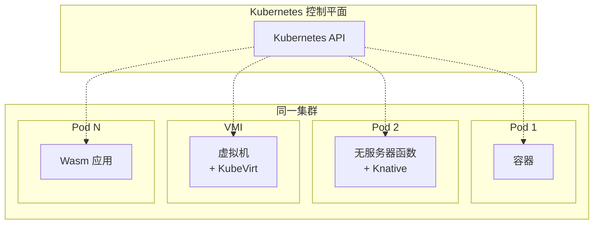
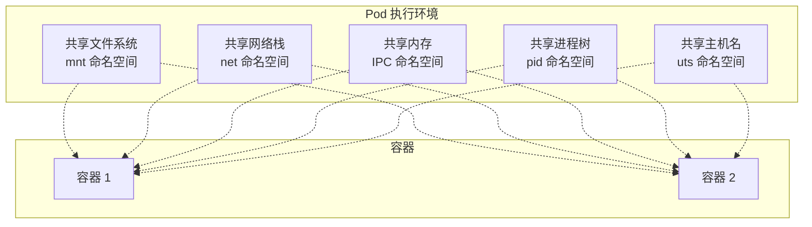
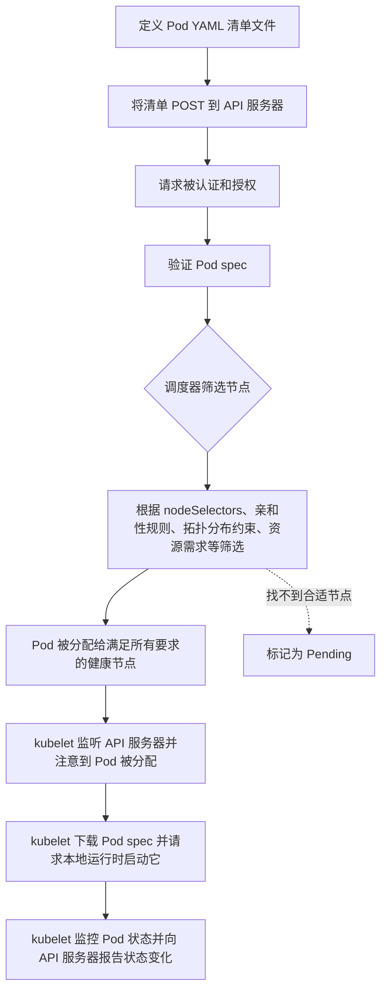
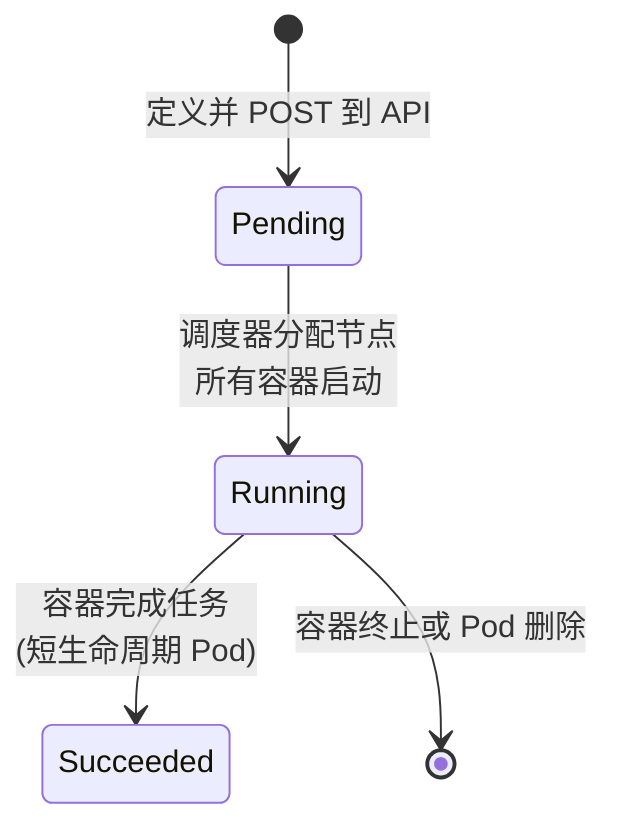
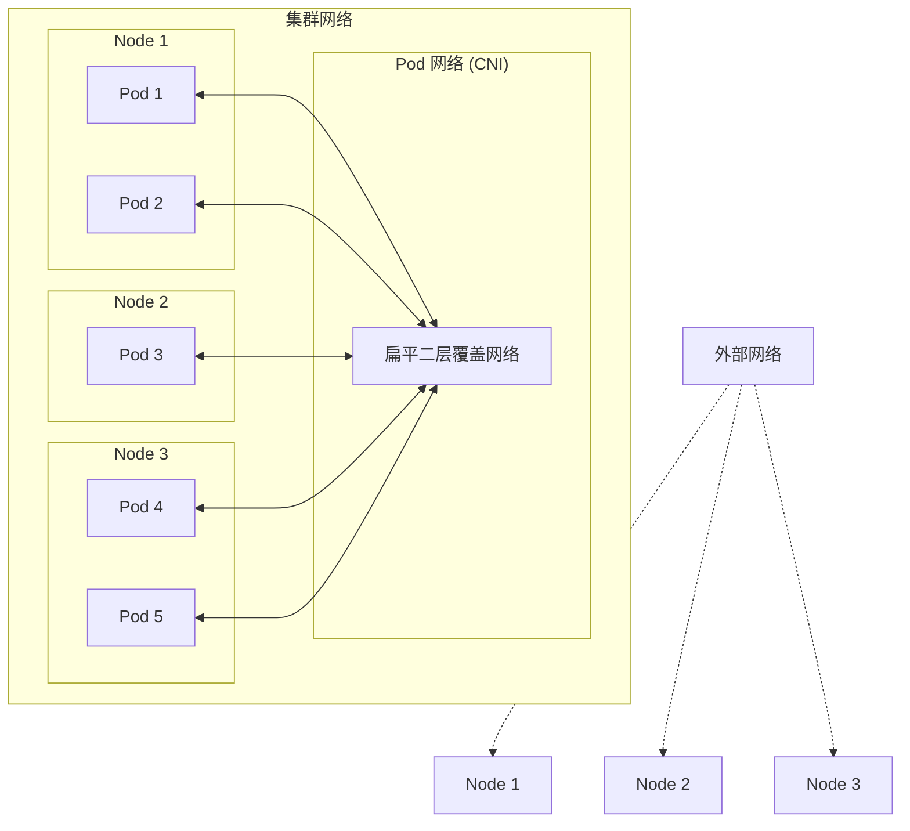
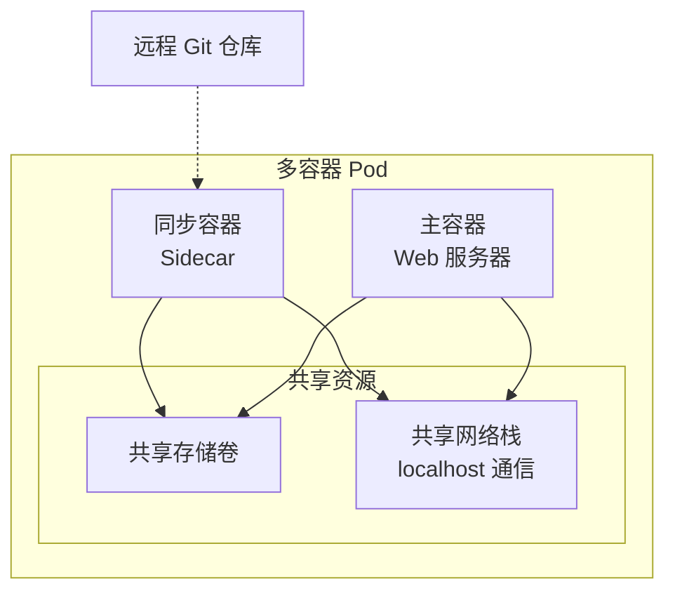
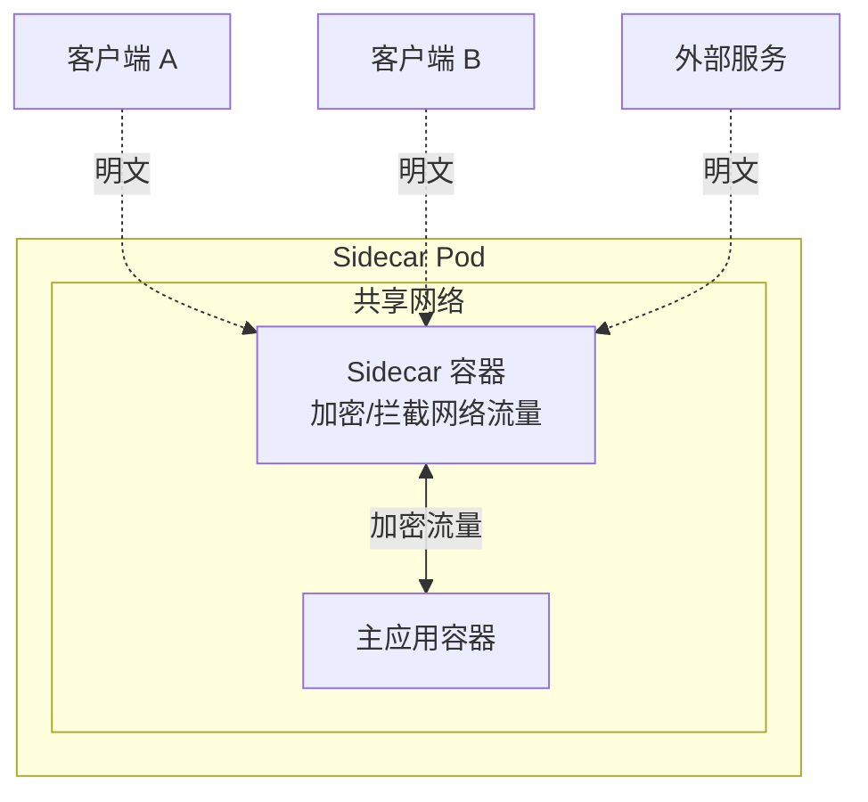

# 第四章：Pod 详解

在 Kubernetes 上运行的每个应用都位于 Pod 中。

- 部署应用时，实际上是部署了一个 Pod
- 终止应用时，实际上是终止了其 Pod
- 扩展应用时，是添加更多 Pod
- 缩容应用时，是移除 Pod
- 更新应用时，是部署新的 Pod

这使得 Pod 变得至关重要，也是本章深入探讨的原因。

本章主要分为两部分：

- **Pod 理论**：深入理解 Pod 的核心概念
- **Pod 实战**：通过动手练习掌握 Pod 的使用方法

> [!NOTE]
> 如果有些内容感觉似曾相识，那是因为我们建立在第二章介绍的一些概念之上。

我们还将发现 Kubernetes 使用 Pod 来运行多种不同类型的工作负载。然而，大多数情况下 Pod 运行的是容器，因此大多数示例都会引用容器。

---

## Pod 理论

Kubernetes 使用 Pod 有很多原因：它们是抽象层、启用资源共享、增加功能特性、增强调度能力等。让我们深入了解其中的一些。

### Pod 作为抽象层

Pod 抽象了工作负载的详细信息。这意味着你可以在 Pod 内运行容器、虚拟机、无服务器函数和 Wasm 应用，而 Kubernetes 不会察觉到差异。

使用 Pod 作为抽象层对 Kubernetes 和工作负载都有好处：

- Kubernetes 可以专注于部署和管理 Pod，无需关心 Pod 内部是什么
- 异构工作负载可以在同一集群上并行运行，利用完整的声明式 Kubernetes API，获得 Pod 的所有其他优势

> [!TIP]
> 容器和 Wasm 应用使用标准 Pod、标准工作负载控制器和标准运行时。但是无服务器函数和虚拟机需要一些额外的帮助。

- 无服务器函数运行在标准 Pod 中，但需要 Knative 等应用来扩展 Kubernetes API，添加自定义资源和控制器
- 虚拟机类似，需要 KubeVirt 等应用来扩展 API



图 4.1 展示了在同一集群上运行四种不同工作负载。每个工作负载都被包装在 Pod 中，由控制器管理，并使用标准运行时。虚拟机工作负载运行在 VirtualMachineInstance (VMI) 中而不是 Pod 中，但它们与 Pod 非常相似，并利用了许多 Pod 的功能特性。

### Pod 增强工作负载

Pod 通过多种方式增强工作负载，包括：

- 资源共享
- 高级调度
- 应用健康检查探针
- 重启策略
- 安全策略
- 终止控制
- [[存储卷|Volumes]]

> [!INFO]
> 以下命令显示完整的 Pod 属性列表，输出超过 1000 行。按空格键分页浏览，按 `q` 键返回提示符。

```bash
$ kubectl explain pods --recursive | more
```

你甚至可以深入了解特定的 Pod 属性及其支持的值。以下示例深入了解 Pod 的 `restartPolicy` 属性。

```bash
$ kubectl explain pod.spec.restartPolicy
```

尽管 Pod 添加了这么多功能，但它们是轻量级的，开销很小。

### Pod 启用资源共享

Pod 运行一个或多个容器，同一 Pod 中的所有容器共享 Pod 的执行环境。这包括：



图 4.2 展示了一个多容器 Pod，两个容器共享 Pod 的存储卷和网络资源。

其他应用和客户端可以通过 Pod 的 IP 地址（如 10.0.10.15）访问容器——主应用容器在端口 8080 上可用，sidecar 在端口 5005 上可用。如果需要通信，两个容器可以使用 Pod 的 localhost 适配器在 Pod 内部相互通信。两个容器都挂载了 Pod 的存储卷，可以使用它来共享数据。例如，sidecar 容器可能从远程 Git 仓库同步静态内容并存储到存储卷中，主应用容器从中读取并作为网页提供服务。

### Pod 与调度

在继续之前，记住节点是托管服务器，可以是物理服务器、虚拟机或云实例。Pod 包装容器并在节点上执行。

> [!IMPORTANT]
> Kubernetes 保证 Pod 中的所有容器都会被调度到同一集群节点。尽管如此，只有当容器需要共享资源（如内存、存储卷和网络）时，才应该将它们放在同一个 Pod 中。

如果你的唯一要求是将两个工作负载调度到同一节点，你应该将它们放在单独的 Pod 中，并使用以下选项之一来确保它们被调度到同一节点：

| 调度方式 | 说明 |
|---------|------|
| **nodeSelectors** | 最简单的方式，提供标签列表，调度器只会将 Pod 分配给具有所有标签的节点 |
| **亲和性/反亲和性** | 更强大的 nodeSelector，支持硬规则和软规则，可以基于 Pod 或节点选择 |
| **拓扑分布约束** | 灵活地将 Pod 智能分布到基础设施中，支持高可用性、性能、本地性等需求 |
| **资源请求和限制** | 告诉调度器 Pod 需要多少 CPU 和内存 |

#### nodeSelectors

这是将 Pod 运行在特定节点上的最简单方式。你提供标签列表，调度器只会将 Pod 分配给具有所有这些标签的节点。

#### 亲和性规则

亲和性和反亲和性规则就像更强大的 nodeSelector。顾名思义，它们支持：

- **亲和性规则**：将 Pod 吸引到一起
- **反亲和性规则**：将 Pod 推开

同时支持：

- **硬规则**：必须遵守
- **软规则**：只是建议，尽力满足

基于节点选择和基于 Pod 选择的逻辑是相同的。

#### 拓扑分布约束

这是一种灵活的方式，可以智能地将 Pod 分布在整个基础设施中，实现高可用性、性能、本地性或任何其他需求。一个典型示例是将 Pod 分布到云或数据中心的底层可用区以实现高可用性 (HA)。

> [!TIP]
> 你可以为几乎任何场景创建自定义域，例如将 Pod 调度到更接近数据源的位置，或更接近客户端以改善网络延迟。

#### 资源请求和限制

资源请求和资源限制非常重要，每个 Pod 都应该使用它们。它们告诉调度器 Pod 需要多少 CPU 和内存，调度器使用它们来确保 Pod 运行在有足够资源的节点上。如果不指定它们，调度器无法知道 Pod 需要什么资源，可能会将其调度到资源不足的节点。

### 部署 Pod

部署 Pod 包括以下步骤：



> [!NOTE]
> 如果调度器找不到合适的节点，会将其标记为 `pending`。

部署 Pod 是一个原子操作。这意味着 Pod 只有在所有容器都运行时才开始服务请求。

### Pod 生命周期

Pod 被设计为**可终结的**和**不可变的**。

#### 可终结的 (Mortal)

> [!WARNING]
> 你不能重启失败的或已删除的 Pod。是的，如果更高级别的控制器管理它们，Kubernetes 会替换失败的 Pod。但这与重启和修复失败的 Pod 不同。

#### 不可变的 (Immutable)

> [!IMPORTANT]
> 你不能在部署后修改它们。如果你来自传统背景，经常修补运行中的服务器并登录它们进行修复和配置更改，这可能是巨大的思维转变。

如果需要更改 Pod，你需要创建一个带有更改的新 Pod，删除旧的，用新的替换。如果需要向 Pod 写入数据，应该附加一个存储卷并将数据存储在存储卷中。这样，即使 Pod 消失后，你仍然可以访问数据和存储卷。

让我们看一个典型的 Pod 生命周期：



你在声明式 YAML 对象中定义 Pod 并 POST 到 API 服务器。它在调度器找到运行它的节点时进入 `pending` 阶段。假设它找到了一个节点，Pod 被调度，本地 kubelet 指示运行时启动其容器。一旦所有容器都在运行，Pod 进入 `running` 阶段。如果是一个长期运行的 Pod（如 Web 服务器），它会无限期地保持运行阶段。如果是短期 Pod（如批处理作业），一旦所有容器完成其任务，它就进入 `succeeded` 状态。

> [!NOTE]
> 关于在 Kubernetes 上运行 VM 的快速说明。VM 与容器相反，它们被设计为可变的和不可终结的。例如，你可以重启它们、更改它们的配置，甚至迁移它们。这与 Pod 的设计目标完全不同，这就是为什么 KubeVirt 将 VM 包装在名为 VirtualMachineInstance (VMI) 的修改版 Pod 中，并使用自定义工作负载控制器来管理它们。

### 重启策略

前面说过 Pod 用重启策略增强应用。但是这些应用于单个容器而不是 Pod。

让我们考虑一些场景：

你使用 Deployment 控制器将 Pod 调度到节点，节点发生故障。当这种情况发生时，Deployment 控制器注意到失败的节点，删除 Pod 并在幸存的节点上用新的替换它。即使新 Pod 基于相同的 Pod spec，它有一个新的 UID、新的 IP 地址，并且没有状态。

> [!KEY POINT]
> 当我们说更新或重启 Pod 时，实际上是指用新的 Pod 替换它们。

虽然 Kubernetes 不能重启 Pod，但可以重启容器。这总是由本地 kubelet 完成，并受 Pod 的 `spec.restartPolicy` 值管理，可以是以下任一值：

| 策略 | 说明 |
|------|------|
| `Always` | 始终尝试重启容器 |
| `Never` | 从不尝试重启 |
| `OnFailure` | 仅当容器以错误代码失败时才尝试重启 |

这些值不言自明。该策略是 Pod 范围的，意味着它适用于 Pod 中的所有容器（init 容器除外）。

重启策略的选择取决于应用的性质——是长期运行的容器还是短期运行的容器。

**长期运行的容器**托管 Web 服务器、数据存储和消息队列等应用，这些应用无限期运行。如果它们失败，你通常希望重启它们，因此通常会为它们设置 `Always` 重启策略。

**短期运行的容器**不同，通常运行批处理样式的工作负载，这些工作负载完成任务直到完成。大多数时候，你对它们完成感到满意，只希望在它们失败时重启它们。因此，你可能为它们设置 `OnFailure` 重启策略。如果你不关心它们是否失败，为它们设置 `Never` 策略。

### 静态 Pod vs 控制器

部署 Pod 有两种方式：

1. **直接通过 Pod 清单**（很少使用）
2. **间接通过工作负载资源和控制器**（最常见）

直接从 Pod 清单部署会创建静态 Pod，不能自愈、扩展或执行滚动更新。这是因为它们只由运行它们的节点上的 kubelet 管理，而 kubelet 的功能仅限于在同一节点上重启容器。而且，如果节点发生故障，kubelet 也会随之故障，无法帮助 Pod。

另一方面，通过工作负载资源部署的 Pod 可以获得由高可用控制器管理的所有好处——可以在其他节点上重启它们、在需求变化时扩展它们，并执行滚动更新和版本化回滚等高级操作。本地 kubelet 仍然可以尝试重启失败的容器，但如果节点发生故障或被驱逐，控制器可以将其重启到不同的节点。

> [!IMPORTANT]
> 记住，当我们说重启 Pod 时，我们的意思是用新的 Pod 替换它。

### Pod 网络

每个 Kubernetes 集群运行一个 Pod 网络，并自动将所有 Pod 连接到它。它通常是一个扁平的二层覆盖网络，跨越每个集群节点，允许每个 Pod 直接与每个其他 Pod 通信，即使远程 Pod 在不同的集群节点上。



图 4.4 显示三个节点运行五个 Pod。Pod 网络跨越所有三个节点，所有五个 Pod 都连接到它。这意味着所有 Pod 可以通信，尽管它们在不同的节点上。注意节点连接到外部网络，但不直接连接到 Pod 网络。

你的 Pod 网络由第三方插件实现，该插件通过容器网络接口 (CNI) 与 Kubernetes 接口。你在集群构建时选择一个网络插件，它为整个集群配置 Pod 网络。存在很多插件，每个都有其优缺点。然而，在撰写本文时，Cilium 是最流行的，实现了安全性和可观测性等许多高级功能。

> [!WARNING]
> 新创建的集群通常实现一个非常开放的 Pod 网络，几乎没有安全措施。这使得 Kubernetes 易于使用并避免与网络安全相关的常见挫败感。但是，你应该使用 Kubernetes 网络策略和其他措施来保护它。

---

## 多容器 Pod

多容器 Pod 是一个强大的模式，在现实世界中非常流行。

根据微服务设计模式，每个容器应该有一个明确定义的职责。例如，一个从仓库同步内容并作为网页提供服务的应用有两个不同的职责：

1. 同步内容
2. 提供网页服务

你应该用两个微服务设计这个应用，每个有自己的容器——一个容器负责同步内容，另一个负责提供内容。我们称之为关注点分离或单一职责原则，它使容器保持小而简单，鼓励重用，并使故障排除更容易。

大多数时候，你会将应用容器放在它们自己的 Pod 中，它们会通过 Pod 网络通信。然而，有时将它们放在同一个 Pod 中更好。例如，继续使用同步和服务应用，将两个容器放在同一个 Pod 中允许同步容器从远程系统拉取内容并存储到共享存储卷中，Web 容器可以从中读取并提供服务。



### Init 容器

Init 容器是 Kubernetes API 中定义的一种特殊类型容器。你将它们与应用容器运行在同一 Pod 中，但 Kubernetes 保证它们会在主应用容器启动之前启动和完成。它还保证它们只运行一次。

Init 容器的目的是准备和初始化环境，使其准备好供应用容器使用。

考虑几个快速示例：

**示例 1**：你有一个应用，只有在远程 API 准备好接受连接时才应该启动。与其在主应用中复杂化检查远程 API 的逻辑，不如在与主应用相同的 Pod 中运行该逻辑的 init 容器。当你部署 Pod 时，Kubernetes 首先启动 init 容器，它向 API 服务器发送周期性请求，直到收到响应。在此期间，Kubernetes 阻止应用容器启动。然而，一旦 init 容器收到 API 服务器的响应，它就完成了，Kubernetes 启动应用。

**示例 2**：假设你另一个应用需要在启动前一次性克隆远程仓库。同样，与其用克隆和准备内容的代码（了解远程服务器地址、证书、认证、文件同步协议、校验验证等）膨胀和复杂化主应用，不如在 init 容器中实现，这保证会在主应用容器启动之前完成任务。

> [!NOTE]
> 每个 Pod 可以列出多个 init 容器，Kubernetes 按它们在 Pod 清单中出现的顺序运行它们。所有 init 容器都必须完成，Kubernetes 才会开始运行常规应用容器。如果任何 init 容器失败，Kubernetes 会尝试重启它。但是如果你将 Pod 的 `restartPolicy` 设置为 `Never`，Kubernetes 会使 Pod 失败。

Init 容器的缺点是它们仅限于在主应用容器启动之前运行任务。对于与主应用容器并行运行的东西，你需要 sidecar 容器。

### Sidecar 容器

Sidecar 容器的工作是为应用添加功能，而不必将其直接添加到应用容器中。示例包括抓取日志、监控和同步远程内容、代理连接、处理数据和加密网络流量的 sidecar。



图 4.6 显示了一个具有应用容器和服务网格 sidecar 的多容器 Pod，拦截和加密所有网络流量。在这个例子中，sidecar 在主应用容器之前启动并在 Pod 的整个生命周期中保持运行是至关重要的——如果 sidecar 没有运行，应用容器就不能使用网络。

> [!INFO]
> 旧版本的 Kubernetes 没有 sidecar 容器的概念，我们必须将它们实现为常规容器。然而，这存在问题，因为没有可靠的方法在应用容器之前启动 sidecar、与应用容器并行保持运行，或在应用容器之后停止它们。幸运的是，Kubernetes v1.28 引入了原生 sidecar 作为 alpha 功能，并在 v1.29 中将其推进到 beta 状态。截至 v1.32，sidecar 容器仍然是 beta 功能，你应该谨慎使用。但是，它们默认启用，许多知名项目使用，包括 Argo CD 和 Istio。我们应该期待它们很快达到 GA（稳定）里程碑。

你将在动手部分更详细地看到这一点，但你将 sidecar 定义为 init 容器 (`spec.initContainers`)，并将 `restartPolicy` 设置为 `Always`。如果你这样做，Kubernetes 保证它们将：

- 在主应用容器之前启动
- 与主应用容器并行保持运行
- 在主应用容器之后终止

除此之外，它们遵循 init 容器的其他规则，如启动顺序，你可以附加探针来管理和监控它们的生命周期。

### Pod 理论总结

- Pod 是 Kubernetes 上的原子调度单元，抽象了内部工作负载的详细信息
- 许多 Pod 运行单个容器，但多容器 Pod 更强大
- 你可以使用多容器 Pod 来紧密耦合需要共享资源（如内存和存储卷）的工作负载
- 你也可以使用多容器 Pod 来增强应用（sidecar 模式）和初始化环境（init 模式）
- 你在声明式 YAML 对象中定义 Pod，但通常通过更高级别的工作负载控制器部署它们，这些控制器用自愈、自动扩展等功能增强它们

是时候看一些示例了。

---

## Pod 实战

如果你在跟随操作，克隆本书的 GitHub 仓库并切换到 `2025` 分支：

```bash
$ git clone https://github.com/nigelpoulton/TKB.git
Cloning into 'TKB'...
$ cd TKB
$ git fetch origin
$ git checkout -b 2025 origin/2025
```

> [!IMPORTANT]
> 确保从 `pods` 文件夹运行所有命令。

### Pod 清单文件

让我们看看第一个 Pod 清单。这是 `pods` 文件夹中的 `pod.yml` 文件：

```yaml
kind: Pod
apiVersion: v1
metadata:
  name: hello-pod
  labels:
    zone: prod
    version: v1
spec:
  containers:
  - name: hello-ctr
    image: nigelpoulton/k8sbook:1.0
    ports:
    - containerPort: 8080
    resources:
      limits:
        memory: 128Mi
        cpu: 0.5
```

这是一个简单的示例，但你可以立即看到四个顶级字段：

- `kind`：告诉 Kubernetes 你定义的对象类型
- `apiVersion`：告诉 Kubernetes 创建对象时使用哪个版本的 API
- `metadata`：命名 Pod 并给它两个标签
- `spec`：定义容器及其配置

#### 清单文件：代码即同理心

快速旁述。

Kubernetes YAML 文件是优秀的文档来源，你可以用它们快速让新团队成员上手，并帮助弥合开发人员和运维之间的差距。

例如，新团队成员可以阅读你的 YAML 文件，快速了解应用的基本功能和需求。运维团队也可以用它们来了解应用需求，如网络端口、CPU 和内存要求等。

你也可以将它们存储在源代码控制仓库中以便轻松版本化，并与不同版本进行比较。

> [!QUOTE]
> Nirmal Mehta 在他的 2017 年 DockerCon 演讲"A Strong Belief, Loosely Held: Bringing Empathy to IT"中将这些好处描述为"代码即同理心"的一种形式。

### 从清单文件部署 Pod

运行以下 `kubectl apply` 命令来部署 Pod：

```bash
$ kubectl apply -f pod.yml
pod/hello-pod created
```

虽然输出说 Pod 已创建，但它可能仍在拉取镜像和启动容器。

运行 `kubectl get pods` 检查状态：

```bash
$ kubectl get pods
NAME        READY    STATUS             RESTARTS   AGE
hello-pod   0/1      ContainerCreating  0          9s
```

> [!NOTE]
> Kubernetes 自动从 Docker Hub 拉取（下载）镜像。要使用其他仓库，只需在 YAML 文件中的镜像名称前添加仓库的 URL。

一旦 `READY` 列显示 `1/1` 并且 `STATUS` 列显示 `Running`，你的 Pod 就在健康的集群节点上运行，并被节点的 kubelet 主动监控。

### 检查 Pod

让我们看看你将使用的主要方式来使用 `kubectl` 监控和检查 Pod。

#### kubectl get

你已经运行过 `kubectl get pods` 命令并看到它返回一行基本信息。然而，以下标志可以让你获取更多信息：

| 标志 | 说明 |
|------|------|
| `-o wide` | 提供更多列，但仍是一行输出 |
| `-o yaml` | 获取 Kubernetes 知道的对象的所有信息 |

以下示例显示带有 `-o yaml` 标志的 `kubectl get pods` 的输出。输出分为两个主要部分：

- **spec**：显示对象的期望状态
- **status**：显示观察到的状态

```bash
$ kubectl get pods hello-pod -o yaml
```

> [!TIP]
> 完整输出比你用来创建 Pod 的 17 行 YAML 文件包含得多。Kubernetes 从两个主要来源获取所有这些额外细节：Pod 有很多属性，任何你没有在 YAML 文件中明确定义的内容都会用默认值填充；status 部分显示 Pod 的当前状态，不在你的 YAML 文件中。

#### kubectl describe

另一个很棒的命令是 `kubectl describe`。这给你一个对象格式良好的概览，包括生命周期事件。

```bash
$ kubectl describe pod hello-pod
```

> [!SUGGESTION]
> 我为本书删减了输出，但如果你在自己的系统上研究完整输出，你会学到很多东西。

#### kubectl logs

你可以使用 `kubectl logs` 命令从 Pod 中的任何容器拉取日志。基本格式是 `kubectl logs <pod>`。

如果你针对多容器 Pod 运行命令，你自动从 Pod 中的第一个容器获取日志。但是你可以使用 `--container` 标志指定不同容器的名称来覆盖它。

```yaml
kind: Pod
apiVersion: v1
metadata:
  name: logtest
spec:
  containers:
  - name: app                   # 第一个容器（默认）
    image: nginx
  - name: syncer                # 第二个容器
    image: k8s.gcr.io/git-sync:v3.1.6
```

运行以下命令如果你想要 syncer 容器的日志：

```bash
$ kubectl logs logtest --container syncer
```

#### kubectl exec

`kubectl exec` 命令是在运行中的容器内执行命令的好方法。

你可以通过两种方式使用 `kubectl exec`：

1. **远程命令执行**
2. **Exec 会话**

**远程命令执行**让你从本地 shell 向容器发送命令。容器执行命令并将输出返回到你的 shell。

**Exec 会话**将你的本地 shell 连接到容器的 shell，就和登录到容器一样。

让我们看看两者，从远程命令执行开始：

```bash
$ kubectl exec hello-pod -- ps
```

容器执行了 `ps` 命令并在你的本地终端显示了结果。

命令格式是 `kubectl exec <pod> -- <command>`，你可以执行安装在容器中的任何命令。如果你想在特定容器中运行命令，记得使用 `--container` 标志。

尝试运行以下命令：

```bash
$ kubectl exec hello-pod -- curl localhost:8080
```

这个失败了，因为这个容器没有 `curl` 命令。

让我们使用 `kubectl exec` 获取到同一容器的交互式 exec 会话：

```bash
$ kubectl exec -it hello-pod -- sh
```

> [!WARNING]
> 像这样对运行中的 Pod 进行更改是一种反模式，因为 Pod 被设计为不可变对象。但是，像这样的演示目的是可以的。

#### Pod 主机名

Pod 从其 YAML 文件的 `metadata.name` 字段获取名称，Kubernetes 将此用作 Pod 中每个容器的主机名。

```bash
$ env | grep HOSTNAME
HOSTNAME=hello-pod
```

容器的主机名与 Pod 的名称匹配。如果是多容器 Pod，它的所有容器都有相同的主机名。正因为如此，你应该确保 Pod 名称是有效的 DNS 名称（a-z、0-9、减号和句点符号）。

### 检查 Pod 不可变性

Pod 被设计为不可变对象，这意味着你不应该在部署后更改它们。

不可变性适用于两个级别：

1. **对象不可变性**（Pod）
2. **应用不可变性**（容器）

Kubernetes 通过阻止对运行中 Pod 配置的更改来处理对象不可变性。然而，Kubernetes 不能总是阻止你更改容器内部的应用和文件系统。你负责确保容器及其应用是无状态和不可变的。

以下示例使用 `kubectl edit` 编辑运行中的 Pod 对象。尝试更改以下任一属性：

- 容器名称
- 容器端口
- 资源请求和限制

```bash
$ kubectl edit pod hello-pod
```

编辑文件，保存你的更改并关闭编辑器。你会收到一条消息告诉你更改被禁止，因为这些属性是不可变的。

> [!TIP]
> 如果你卡在 vi 会话中，你可以输入 `:q!` 然后按回车退出。

### 资源请求和资源限制

Kubernetes 允许你为 Pod 中的每个容器指定资源请求和资源限制。

- **请求**：最小值
- **限制**：最大值

```yaml
resources:
  requests:              # 调度的最小值
    cpu: 0.5
    memory: 256Mi
  limits:                # kubelet 限制的最大值
    cpu: 1.0
    memory: 512Mi
```

这个容器需要至少 256Mi 内存和半核 CPU。调度器读取此内容并将其分配给有足够资源的节点。如果找不到合适的节点，它会将 Pod 标记为 pending，集群自动扩缩器会尝试配置新的集群节点。

假设调度器找到了合适的节点，它将 Pod 分配给节点，kubelet 下载 Pod spec 并请求本地运行时启动它。作为过程的一部分，kubelet 保留请求的 CPU 和内存，保证资源在需要时可用。它还告诉运行时根据每个容器的资源限制设置资源上限。

> [!IMPORTANT]
> 当容器执行时，它被保证访问其最低要求（请求）。如果节点有额外的可用资源，它也可以使用更多，但绝不允许使用超过你在限制中指定的数量。

对于多容器 Pod，调度器组合所有容器的请求，并找到有足够资源满足整个 Pod 的节点。

### 多容器 Pod 示例 - Init 容器

以下 YAML 定义了一个带有 init 容器和应用容器的多容器 Pod：

```yaml
apiVersion: v1
kind: Pod
metadata:
  name: initpod
  labels:
    app: initializer
spec:
  initContainers:
  - name: init-ctr
    image: busybox:1.28.4
    command: ['sh', '-c', 'until nslookup k8sbook; do echo waiting...; sleep 1; done; echo Service found!']
  containers:
    - name: web-ctr
      image: nigelpoulton/web-app:1.0
      ports:
        - containerPort: 8080
```

在 `spec.initContainers` 块下定义容器使它们成为 init 容器，Kubernetes 保证它们会在开始常规容器之前运行和完成。

部署多容器 Pod 并检查状态：

```bash
$ kubectl apply -f initpod.yml
$ kubectl get pods --watch
NAME      READY   STATUS     RESTARTS   AGE
initpod   0/1     Init:0/1   0          6s
```

`Init:0/1` 状态告诉你 init 容器仍在运行，意味着主容器尚未启动。

运行以下命令创建 Service 并重新检查 Pod 状态：

```bash
$ kubectl apply -f initsvc.yml
$ kubectl get pods --watch
NAME      READY   STATUS            RESTARTS   AGE
initpod   0/1     Init:0/1          0          15s
initpod   0/1     PodInitializing   0          3m39s
initpod   1/1     Running           0          3m57s
```

init 容器在看到 Service 时完成，主应用容器开始启动。

### 多容器 Pod 示例 - Sidecar 容器

Sidecar 容器的工作是通过提供日志抓取或与远程仓库同步等辅助服务来增强应用容器。

> [!INFO]
> 你需要 Kubernetes v1.29 或更高版本以及 GitHub 账户来跟随这个示例。GitHub 账户是免费的。

你将完成以下步骤：

1. Fork GitHub 仓库
2. 更新 YAML 文件，填入你 fork 的仓库 URL
3. 部署应用
4. 连接到应用并看到它显示 "This is version 1.0"
5. 对你的 GitHub fork 进行更改
6. 验证你的更改出现在应用的网页上

以下 YAML 文件定义了你即将部署的多容器 Pod：

```yaml
apiVersion: v1
kind: Pod
metadata:
  name: git-sync
  labels:
    app: sidecar
spec:
  initContainers:                     
  - name: ctr-sync                    
    restartPolicy: Always              # ← 关键设置
    image: k8s.gcr.io/git-sync:v3.1.6 
    volumeMounts:                      
    - name: html                      
      mountPath: /tmp/git                
    env:                                
    - name: GIT_SYNC_REPO                
      value: <你的 fork URL>           
    - name: GIT_SYNC_BRANCH              
      value: master                      
    - name: GIT_SYNC_DEPTH               
      value: "1"                         
    - name: GIT_SYNC_DEST                
      value: "html"                   
  containers:
  - name: ctr-web                     
    image: nginx                       
    volumeMounts:                      
    - name: html                      
      mountPath: /usr/share/nginx/html
  volumes:
  - name: html
    emptyDir: {}
```

**ctr-sync** sidecar 容器监视 GitHub 仓库并同步任何更改到名为 html 的共享存储卷。**ctr-web** 应用容器监视此共享存储卷并从其内容中提供网页。

检查 Pod 状态和容器类型：

```bash
$ kubectl get pods                     
NAME         READY     STATUS      RESTARTS     AGE
git-sync     2/2       Running     0            12s

$ kubectl get pod -o "custom-columns=\
  NAME:.metadata.name,\
  INIT:.spec.initContainers[*].name,\
  CONTAINERS:.spec.containers[*].name"
NAME         INIT         CONTAINERS
git-sync     ctr-sync     ctr-web
```

> [!SUCCESS]
> 恭喜。Sidecar 在应用容器之前启动并且仍在运行。你用 kubectl 命令证明了这一点，你还通过更改你的 GitHub fork 的内容并目睹你的更改出现在应用程序中证明了这一点。

---

## 清理

如果你一直在跟随，你会在集群中部署了以下内容：

**Pod：**
- hello-pod
- initpod
- git-sync

**Service：**
- k8sbook
- svc-sidecar

用以下命令删除它们：

```bash
$ kubectl delete pod hello-pod initpod git-sync
$ kubectl delete svc k8sbook svc-sidecar
```

你也可以通过它们的 YAML 文件删除对象：

```bash
$ kubectl delete -f initsidecar.yml -f initpod.yml -f pod.yml -f initsvc.yml
```

---

## 章节总结

> [!ABSTRACT]
> 在本章中，你了解到 Kubernetes 将所有应用部署在 Pod 中。这些应用可以是容器、无服务器函数、Wasm 应用和虚拟机。但是，它们通常是容器，所以我们通常用运行容器的术语来指代 Pod。

### 关键要点

| 概念 | 说明 |
|------|------|
| [[Pod]] 作为原子单元 | 是 Kubernetes 的基本部署和管理单位 |
| [[抽象层]] | Pod 隐藏内部工作负载细节，支持异构工作负载 |
| [[资源共享]] | 同一 Pod 中的容器共享网络、存储卷、进程命名空间等 |
| [[调度]] | 支持多种策略确保 Pod 分配到合适的节点 |
| [[生命周期]] | Pod 是可终结和不可变的——失败时替换而不是重启 |
| [[多容器模式]] | Init 容器用于初始化，Sidecar 容器用于增强功能 |
| [[重启策略]] | Always、OnFailure、Never 取决于应用性质 |

### 动手练习要点

1. **部署 Pod**：使用 `kubectl apply -f <manifest>.yml`
2. **检查 Pod**：使用 `kubectl get pods`、`kubectl describe pod`、`kubectl logs`
3. **进入容器**：使用 `kubectl exec -it <pod> -- sh`
4. **编辑 Pod**：`kubectl edit pod <name>`（验证不可变性）
5. **资源管理**：始终设置资源请求和限制
6. **清理**：使用 `kubectl delete` 删除不再需要的资源

> [!TIP]
> 下一章将介绍如何使用工作负载控制器（如 Deployment）来管理 Pod，这些控制器提供自愈、自动扩展和滚动更新等高级功能。