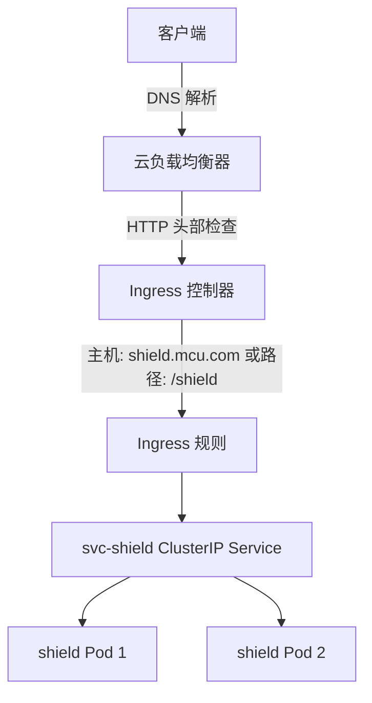

# 8: Ingress

Ingress 的核心功能是通过单个 LoadBalancer Service 访问多个 Web 应用程序。

在阅读本章之前，你需要具备 Kubernetes Services 的实用知识。如果尚未掌握，建议先阅读上一章。

我将本章分为以下三个部分：

- 为 Ingress 设定场景
- Ingress 架构
- Ingress 动手实践

我们将把 Ingress 首字母大写，因为它是 Kubernetes API 中的一种资源。同时，我们会按如下方式使用术语 **LoadBalancer** 和 **load balancer**：

- **LoadBalancer**：指 `type=LoadBalancer` 的 Kubernetes Service 对象。
- **load balancer**：指云平台的面向互联网的负载均衡器。

例如，当你创建一个 Kubernetes LoadBalancer Service 时，Kubernetes 会与云平台通信，并配置一个云负载均衡器。

Ingress 在 Kubernetes 版本 1.19 中升级为正式通用可用（GA），此前它在 beta 阶段经历了超过 15 个版本。在超过 3 年的 alpha 和 beta 阶段，服务网格的流行度不断增长，现在两者在功能上存在一些重叠。因此，如果你计划部署服务网格，可能不需要 Ingress。

---

## 为 Ingress 设定场景

上一章展示了如何使用 NodePort 和 LoadBalancer Services 将应用程序暴露给外部客户端。然而，这两种方式都有局限性。

- **NodePort Services** 仅在高端口号上工作，并且客户端需要跟踪节点 IP 地址。
- **LoadBalancer Services** 解决了这个问题，但仅提供内部 Service 与云负载均衡器之间的一对一映射。这意味着一个拥有 25 个面向互联网应用程序的集群将需要 25 个云负载均衡器，而云负载均衡器是需要花钱的！你的云平台还可能限制你能创建的负载均衡器数量。

**Ingress** 通过允许你通过单个云负载均衡器暴露多个 Service 来解决这个问题。它通过创建一个位于端口 80 或 443 的单一云负载均衡器，并使用基于主机名和基于路径的路由将连接映射到集群中的不同 Service 来实现这一点。我们很快就会解释这些术语。

---

## Ingress 架构

Ingress 定义在 `networking.k8s.io/v1` API 子组中，它需要通常的两个构造：

1. **资源**（Resource）
2. **控制器**（Controller）

资源定义了路由规则，控制器则实现这些规则。

然而，Kubernetes 没有内置的 Ingress 控制器，这意味着你需要自行安装一个。这与 Deployments、ReplicaSets、Services 以及大多数其他拥有内置预配置控制器的资源不同。不过，一些云平台通过在构建集群时允许安装 Ingress 控制器来简化这个过程。我们将在动手实践部分展示如何安装流行的 NGINX Ingress 控制器。

一旦你有了 Ingress 控制器，你就可以部署包含规则的 Ingress 资源，告诉控制器如何路由请求。

关于路由，Ingress 工作在 OSI 模型的第 7 层，也称为**应用层**。这意味着它可以检查 HTTP 头部，并基于主机名和路径转发流量。

> [!INFO]
> **OSI 模型**是 TCP/IP 网络的行业标准参考模型，有 7 层（编号 1-7）。最低层关注信号和电子学，中间层通过确认和重试处理可靠性，高层为 HTTP 等添加服务。Ingress 工作在第 7 层（应用层），实现了 HTTP 智能处理。

下表展示了主机名和路径如何路由到后端的 ClusterIP Service。

| 基于主机的示例     | 基于路径的示例     | 后端 K8s Service |
|-------------------|-------------------|------------------|
| shield.mcu.com    | mcu.com/shield    | shield           |
| hydra.mcu.com     | mcu.com/hydra     | hydra            |

图 8.1 展示了两条请求到达同一个云负载均衡器。在幕后，DNS 名称解析将两个主机名映射到同一个负载均衡器 IP。Ingress 控制器监控负载均衡器，并根据 HTTP 头部中的主机名路由请求。在这个例子中，它将 `shield.mcu.com` 路由到 shield ClusterIP Service，将 `hydra.mcu.com` 路由到 hydra Service。基于路径的路由逻辑相同，我们将在动手实践部分看到两者。


*图 8.1 基于主机的路由*

总之，单个 Ingress 可以通过一个云负载均衡器暴露多个 Kubernetes Service。你创建并部署 Ingress 资源，告诉 Ingress 控制器如何根据请求头部中的主机名和路径来路由请求。你可能需要手动安装 Ingress 控制器。

让我们看看实际操作。

---

## Ingress 动手实践

> [!WARNING]
> 本节内容不适用于 Docker Desktop v4.38 或更早版本附带的单节点 Kubernetes 集群。未来版本或许可以。我建议你使用基于云的集群，例如我们在第 3 章中展示如何构建的 LKE 集群。

如果你要跟着操作，需要满足以下两个条件：

- 一个 Kubernetes 集群
- 本书 GitHub 仓库的克隆

如果还没有，请克隆本书的 GitHub 仓库并切换到 `2025` 分支。

```bash
$ git clone https://github.com/nigelpoulton/TKB.git
Cloning from...
$ cd TKB
$ git fetch origin
$ git checkout -b 2025 origin/2025
```

进入 `ingress` 目录，并在该目录下运行所有命令。

你将完成以下所有步骤：

1. 安装 NGINX Ingress 控制器
2. 配置 Ingress 类
3. 部署示例应用程序
4. 配置 Ingress 对象
5. 检查 Ingress 对象
6. 配置 DNS 名称解析
7. 测试 Ingress

### 安装 NGINX Ingress 控制器

你将从一个托管在 Kubernetes GitHub 仓库中的 YAML 文件安装 NGINX 控制器。它会安装一系列 Kubernetes 对象，包括 Namespace、ServiceAccounts、ConfigMaps、Roles、RoleBindings 等。

使用以下命令安装。由于 URL 太长，我将命令分成两行。你需要在一行中运行它。

```bash
$ kubectl apply -f https://raw.githubusercontent.com/kubernetes/ingress-nginx/controller-v1.12.0/deploy/static/provider/cloud/deploy.yaml
namespace/ingress-nginx created
serviceaccount/ingress-nginx created
<Snip>
```

运行以下命令检查 `ingress-nginx` 命名空间，并确保控制器 Pod 正在运行。它可能需要几秒钟才能进入运行状态。Windows 用户需要将第一行末尾的反斜杠 (`\`) 替换为反引号 (`` ` ``)。

```bash
$ kubectl get pods -n ingress-nginx \
  -l app.kubernetes.io/name=ingress-nginx
NAME                                        READY   STATUS      R
ingress-nginx-admission-create-789md        0/1     Completed   0 
ingress-nginx-admission-patch-tc4cl         0/1     Completed   0 
ingress-nginx-controller-7445ddc6c4-csf98   0/1     Running     0 
```

不要担心 `Completed` 状态的 Pod。这些是初始化环境的短期 Pod。

一旦控制器 Pod 运行，你就拥有了一个 NGINX Ingress 控制器，可以开始创建一些 Ingress 对象了。然而，在此之前，我们先看看 Ingress 类。

---

### Ingress 类

**Ingress 类** 允许你在单个集群上运行多个 Ingress 控制器。过程很简单：

1. 将每个 Ingress 控制器映射到自己的 Ingress 类。
2. 创建 Ingress 对象时，将它们分配给一个 Ingress 类。

如果你在跟着操作，你至少会有一个名为 `nginx` 的 Ingress 类。这是在安装 NGINX 控制器时创建的。

```bash
$ kubectl get ingressclass
```

（后续内容需继续第 2/3 部分）

# 8: Ingress

1. 将每个 Ingress 控制器映射到其自己的 Ingress 类
2. 创建 Ingress 对象时，将其分配给一个 Ingress 类

如果你在跟着操作，你应该至少有一个名为 `nginx` 的 Ingress 类。这个类是在你安装 NGINX 控制器时创建的。

```bash
$ kubectl get ingressclass
```

```
NAME    CONTROLLER             PARAMETERS   AGE
nginx   k8s.io/ingress-nginx   <none>       2m25s
```

如果你的集群已经有一个 Ingress 控制器，你会有多个类。

使用以下命令更仔细地查看 `nginx` Ingress 类。Ingress 类对象没有短名称。

```bash
$ kubectl describe ingressclass nginx
```

```
Name:         nginx
Labels:       app.kubernetes.io/component=controller
              app.kubernetes.io/instance=ingress-nginx
              app.kubernetes.io/name=ingress-nginx
              app.kubernetes.io/part-of=ingress-nginx
              app.kubernetes.io/version=1.9.4
Annotations:  <none>
Controller:   k8s.io/ingress-nginx
Events:       <none>
```

有了 Ingress 控制器和 Ingress 类后，就可以部署和配置 Ingress 对象了。

## 配置基于主机和基于路径的路由

本节将部署两个应用和一个 Ingress 对象。Ingress 将通过一个负载均衡器将流量路由到两个应用。该负载均衡器可以是基于云的负载均衡器，也可以是某些本地集群上的 `localhost`。

你将完成以下所有步骤：

1. 部署一个名为 `shield` 的应用，并为其前端创建一个 ClusterIP Service（后端）`svc-shield`
2. 部署一个名为 `hydra` 的应用，并为其前端创建一个 ClusterIP Service（后端）`svc-hydra`
3. 部署一个 Ingress 对象，该对象创建一个负载均衡器和针对以下主机名与路径的路由规则：
   1. 基于主机：`shield.mcu.com` >> `svc-shield`
   2. 基于主机：`hydra.mcu.com` >> `svc-hydra`
   3. 基于路径：`mcu.com/shield` >> `svc-shield`
   4. 基于路径：`mcu.com/hydra` >> `svc-hydra`
4. 配置 DNS 名称解析，使得 `shield.mcu.com`、`hydra.mcu.com` 和 `mcu.com` 指向你的负载均衡器

图 8.2 展示了使用基于主机和基于路径路由的整体架构。

**图 8.2 基于主机的路由**

流量流向 shield Pod 的过程如下：

1. 客户端向 `shield.mcu.com` 或 `mcu.com/shield` 发送流量
2. DNS 名称解析确保流量到达云负载均衡器
3. Ingress 控制器读取 HTTP 头部，找到主机名（`shield.mcu.com`）或路径（`mcu.com/shield`）
4. Ingress 规则触发，将流量路由到 `svc-shield` ClusterIP 后端 Service
5. ClusterIP Service 确保流量到达一个 shield Pod

为便于理解，可参考以下 Mermaid 图（基于图 8.2 的描述）：



### 部署示例环境

本节部署两个应用及其 ClusterIP Service，Ingress 将流量路由到这些 Service。

实验定义在 `ingress` 文件夹下的 `app.yml` 文件中，包含以下内容：

- 一个名为 `shield` 的应用，监听端口 `8080`，前端使用名为 `svc-shield` 的 ClusterIP Service
- 另一个名为 `hydra` 的应用，也监听端口 `8080`，前端使用名为 `svc-hydra` 的 ClusterIP Service

使用以下命令部署：

```bash
$ kubectl apply -f app.yml
```

```
service/svc-shield created
service/svc-hydra created
pod/shield created
pod/hydra created
```

一旦 Pod 和 Service 启动并运行，继续下一节创建 Ingress。

### 创建 Ingress 对象

你将部署 `ig-all.yml` 文件中定义的 Ingress 对象。该文件描述了一个名为 `mcu-all` 的 Ingress 对象，包含四条规则。

```yaml
1  apiVersion: networking.k8s.io/v1
2  kind: Ingress
3  metadata:
4    name: mcu-all
5    annotations:
6      nginx.ingress.kubernetes.io/rewrite-target: /
7  spec:
8    ingressClassName: nginx
9    rules:
10   - host: shield.mcu.com     ----┐ 
11     http:                        |
12       paths:                     |
13       - path: /                  |
14         pathType: Prefix         | Host rule block for shield 
15         backend:                 |
16           service:               |
17             name: svc-shield     |
18             port:                |
19               number: 8080   ----┘
20   - host: hydra.mcu.com      ----┐
21     http:                        |
22       paths:                     |
23       - path: /                  |
24         pathType: Prefix         | Host rule block for hydra a
25         backend:                 |
26           service:               |
27             name: svc-hydra      |
28             port:                |
29               number: 8080   ----┘
30   - host: mcu.com
31     http:
32       paths:
33       - path: /shield        ----┐
34         pathType: Prefix         |
35         backend:                 |
36           service:               |  Path rule block for shield 
37             name: svc-shield     |
38             port:                |
39               number: 8080   ----┘
40       - path: /hydra         ----┐ 
41         pathType: Prefix         |
42         backend:                 |
43           service:               | Path rule block for shield 
44             name: svc-hydra      |
45             port:                |
46               number: 8080   ----┘ 
```

让我们逐步解析。

- 前两行告诉 Kubernetes 基于 `networking.k8s.io/v1` API 中的 schema 部署 Ingress 对象。
- 第四行将 Ingress 命名为 `mcu-all`。
- 第六行的注解告诉控制器尽最大努力将路径重写为应用期望的路径。此示例将所有入站路径重写为“/”。例如，到达负载均衡器 `mcu.com/shield` 路径的流量将被重写为 `mcu.com/`。稍后你会看到示例。此注解特定于 NGINX Ingress 控制器，如果你使用不同的控制器，则需要注释掉它。
- 第八行的 `spec.ingressClassName` 字段告诉 Kubernetes 此 Ingress 对象需要由你之前安装的 NGINX Ingress 控制器管理。如果你使用不同的 Ingress 控制器，则需要更改或注释掉此行。
- 文件包含四条规则：
  - 第 10-19 行：定义基于主机的规则，用于到达 `shield.mcu.com` 的流量
  - 第 20-29 行：定义基于主机的规则，用于到达 `hydra.mcu.com` 的流量
  - 第 30-39 行：定义基于路径的规则，用于到达 `mcu.com/shield` 的流量
  - 第 40-49 行：定义基于路径的规则，用于到达 `mcu.com/hydra` 的流量

让我们看一条基于主机的规则和一条基于路径的规则。

以下基于主机的规则在流量通过 `shield.mcu.com` 到达根路径“/”时触发，并将其转发到名为 `svc-shield`、端口 `8080` 的 ClusterIP 后端 Service。

```yaml
- host: shield.mcu.com            <<---- Traffic arriving via this host
  http:
    paths:
    - path: /                     <<---- Arriving at root (no subpath)
      pathType: Prefix
      backend:                    <<---- The next five lines send traffic to
        service:                  <<---- existing "backend" ClusterIP Service
          name: svc-shield        <<---- called "svc-shield"
          port:                   <<---- that's listening on 
            number: 8080          <<---- port 8080
```

以下基于路径的规则在流量到达 `mcu.com/shield` 时触发。流量被路由到相同的 `svc-shield` 后端 Service 和相同的端口。

```yaml
  - host: mcu.com                 <<---- Traffic arriving via this host
    http:
      paths:
      - path: /shield             <<---- Arriving on this subpath
        pathType: Prefix
        backend:                  <<---- The next five lines send traffic to
          service:                <<---- existing "backend" ClusterIP Service
            name: svc-shield      <<---- called "svc-shield"
            port:                 <<---- that's listening on 
              number: 8080        <<---- port 8080
```

使用以下命令部署 Ingress 对象：

```bash
$ kubectl apply -f ig-all.yml 
```

```
ingress.networking.k8s.io/mcu-all created
```

### 检查 Ingress 对象

列出默认命名空间中的所有 Ingress 对象。如果你的集群在云上，在云提供商配置负载均衡器时，可能需要一分钟左右才能获得 ADDRESS。

```bash
$ kubectl get ing
```

```
NAME      CLASS   HOSTS                                  ADDRESS  
mcu-all   nginx   shield.mcu.com,hydra.mcu.com,mcu.com   212.2.24
```

- `CLASS` 字段显示处理这组规则的 Ingress 类。如果你只有一个 Ingress 控制器且没有配置类，它可能显示为 `<None>`。
- `HOSTS` 字段是 Ingress 将处理流量的主机名列表。
- `ADDRESS` 字段是负载均衡器的端点。如果在云上，它将是一个公共 IP 或公共 DNS 名称；如果在本地集群，通常是 `localhost`。
- `PORTS` 字段可以是 `80` 或 `443`。

关于端口：Ingress 仅支持 HTTP 和 HTTPS。

描述 Ingress 对象（输出已修剪以适应页面）：

```bash
$ kubectl describe ing mcu-all
```

```
Name:             mcu-all
Namespace:        default
Address:          212.2.246.150
Ingress Class:    nginx
Default backend:  <default>
Rules:
  Host            Path      Backends
  ----            ----      --------
  shield.mcu.com  /         svc-shield:8080 (10.36.1.5:8080)
  hydra.mcu.com   /         svc-hydra:8080 (10.36.0.7:8080)
  mcu.com         /shield   svc-shield:8080 (10.36.1.5:8080)
                  /hydra    svc-hydra:8080 (10.36.0.7:8080)
Annotations:      nginx.ingress.kubernetes.io/rewrite-target: /
Events:           <none>
  Type    Reason  Age                From                      Me
  ----    ------  ----               ----                      --
  Normal  Sync    27s (x2 over 28s)  nginx-ingress-controller  Sc
```

逐步解析输出：

- `Address` 行是 Ingress 创建的负载均衡器的 IP 或 DNS 名称。在本地集群上可能是 `localhost`。
- `Default backend` 是控制器将到达未定义路由的主机名或路径的流量发送到的位置。并非所有 Ingress 控制器都实现了默认后端。
- `Rules` 部分定义了主机、路径和后端之间的映射。请记住，后端通常是 ClusterIP Service，将流量发送到 Pod。
- 你可以使用注解定义特定于控制器的功能以及与云后端的集成。此示例告诉控制器重写所有路径，使其看起来像是到达根路径“/”。这是一种尽力而为的方法，稍后你将看到它并不适用于所有应用。

此时，你的负载均衡器已创建。如果你在云平台上，可能可以通过云控制台查看它。图 8.3 显示了如果你的集群在 Google Kubernetes Engine (GKE) 上，它在 Google Cloud 后端的样子。

**图 8.3 云后端负载均衡器配置**

如果你一直在跟着操作，你现在应该拥有以下所有内容：

- 两个应用及其关联的 ClusterIP Service
- 负载均衡器（基于云或 `localhost`）
- 配置了路由的 Ingress（控制器和资源）

剩下的唯一工作是配置 DNS 名称解析，使得 `shield.mcu.com`、`hydra.mcu.com` 和 `mcu.com` 将流量发送到负载均衡器。

### 配置 DNS 名称解析

在真实环境中，你会配置内部 DNS 或互联网 DNS，将主机名指向 Ingress 负载均衡器。具体做法取决于你的环境和互联网 DNS 提供商。

如果你在跟着操作，最简单的方法是编辑本地计算机上的 `hosts` 文件，将主机名映射到 Ingress 负载均衡器。

- 在 Mac 和 Linux 上，文件是 `/etc/hosts`，你需要 root 权限才能编辑。
- 在 Windows 上，文件是 `C:\Windows\System32\drivers\etc\hosts`，你需要以管理员身份打开。

Windows 用户需要以管理员身份运行 `notepad.exe`，然后打开 `C:\Windows\System32\drivers\etc` 下的 `hosts` 文件。确保打开对话框设置为打开所有文件（`*.*`）。

创建三行新内容，将 `shield.mcu.com`、`hydra.mcu.com` 和 `mcu.com` 映射到负载均衡器的 IP。使用 `kubectl get ing mcu-all` 命令输出中的 IP。如果你使用本地集群且输出显示 `localhost`，则使用 `127.0.0.1` 这个 IP 地址。

```bash
$ sudo vi /etc/hosts
```

# 8: Ingress

## 配置主机文件

将所有文件（`.`）列出来后，创建三个新行，将 `shield.mcu.com`、`hydra.mcu.com` 和 `mcu.com` 映射到负载均衡器的 IP 地址。

使用 `kubectl get ing mcu-all` 命令输出中的 IP 地址。如果你使用的是本地集群，且该命令返回 `localhost`，请使用 `127.0.0.1` IP 地址。

```bash
$ sudo vi /etc/hosts
```

```hosts
# Host Database
<Snip>
212.2.246.150 shield.mcu.com
212.2.246.150 hydra.mcu.com
212.2.246.150 mcu.com
```

记得保存更改。

完成此操作后，你发送到 `shield.mcu.com`、`hydra.mcu.com` 或 `mcu.com` 的任何流量都将被发送到 Ingress 负载均衡器。

## 测试 Ingress

打开 Web 浏览器，尝试以下 URL：

- `shield.mcu.com`
- `hydra.mcu.com`
- `mcu.com`

图 8.4 展示了整体架构和流量流向。

流量到达 Kubernetes 在你部署 Ingress 时自动创建的负载均衡器。流量通过端口 80 进入，Ingress 根据请求头中的主机名将其发送到内部的 ClusterIP Service。发送到 `shield.mcu.com` 的流量流向 `svc-shield` Service，发送到 `hydra.mcu.com` 的流量流向 `svc-hydra` Service。

**图 8.4 - 基于主机的路由**

注意，对 `mcu.com` 的请求被路由到默认后端。这是因为你没有为 `mcu.com` 创建 Ingress 规则。根据你的 Ingress 控制器，返回的消息会有所不同，你的 Ingress 甚至可能没有实现默认后端。GKE 内置 Ingress 配置的默认后端会返回一条有用的消息：`response 404 (backend NotFound), service rules for [ / ] non-existent`。

现在尝试连接到以下任意一个 URL：

- `mcu.com/shield`
- `mcu.com/hydra`

对于此类基于路径的路由，Ingress 使用对象注解中指定的重写目标（rewrite targets）特性。但是，图像不会显示，因为此类路径重写并不适用于所有应用。

> [!TIP]
> 恭喜！你已成功为基于主机和基于路径的路由配置了 Ingress —— 你现在有两个应用前端由两个 ClusterIP Service 提供服务，但两者都通过 Kubernetes Ingress 创建和管理的单个负载均衡器发布。

## 清理

如果你一直在跟随操作，你的集群上现在会有以下所有资源：

| Pods | Services | Ingress 控制器 | Ingress 资源 |
|------|----------|----------------|--------------|
| shield | svc-shield | ingress-nginx | mcu-all |
| hydra | svc-hydra |                |              |

删除 Ingress 资源。

```bash
$ kubectl delete -f ig-all.yml
ingress.networking.k8s.io "mcu-all" deleted
```

删除 Pod 和 ClusterIP Service。Pod 的优雅终止可能需要几秒钟。

```bash
$ kubectl delete -f app.yml
service "svc-shield" deleted
service "svc-hydra" deleted
pod "shield" deleted
pod "hydra" deleted
```

删除 NGINX Ingress 控制器。我为了排版将命令分成了两行，你需要在一行内执行它。命令可能需要大约一分钟才能完成并释放你的终端。

```bash
$ kubectl delete -f https://raw.githubusercontent.com/kubernetes/ingress-nginx/controller-v1.12.0/deploy/static/provider/cloud/deploy.yaml
namespace "ingress-nginx" deleted
serviceaccount "ingress-nginx" deleted
<Snip>
```

最后，如果你之前手动添加了条目，别忘了还原你的 `/etc/hosts` 文件。

```bash
$ sudo vi /etc/hosts
```

```hosts
# Host Database
<Snip>
212.2.246.150 shield.mcu.com       <<---- 删除此行
212.2.246.150 hydra.mcu.com        <<---- 删除此行
212.2.246.150 mcu.com              <<---- 删除此行
```

## 章节总结

在本章中，你学到了 Ingress 是一种通过单个云负载均衡器暴露多个应用（ClusterIP Service）的方式。它们是 API 中的稳定对象，但其功能与许多服务网格重叠。如果你正在运行服务网格，可能就不需要 Ingress。