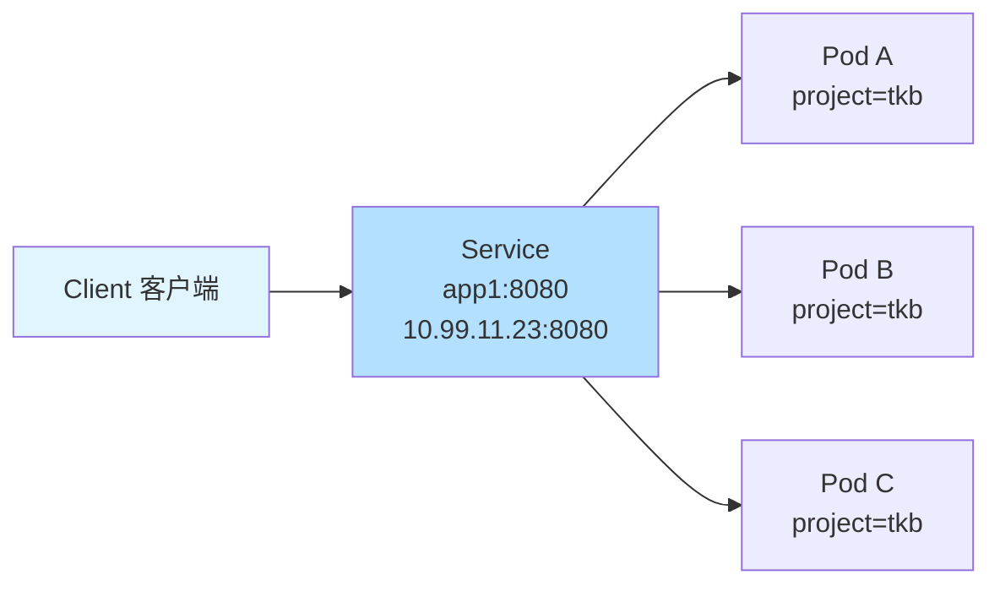
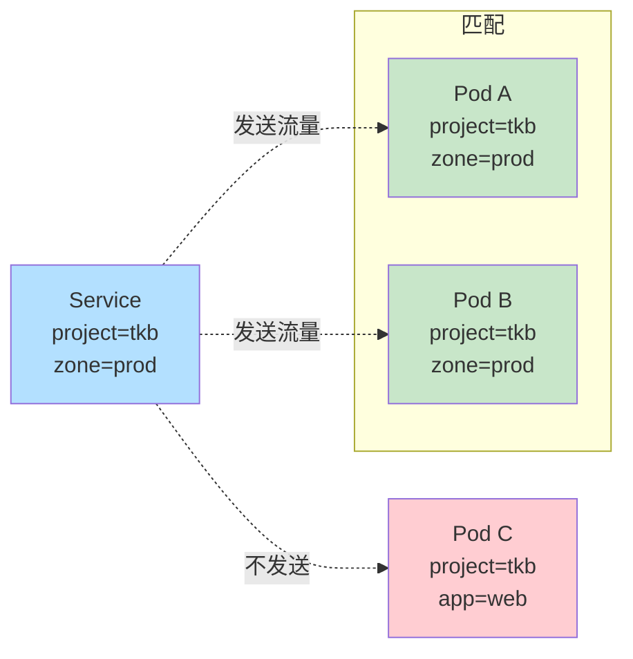
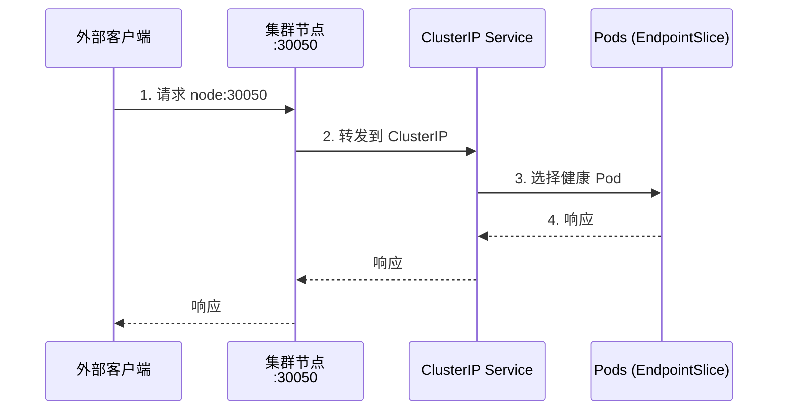
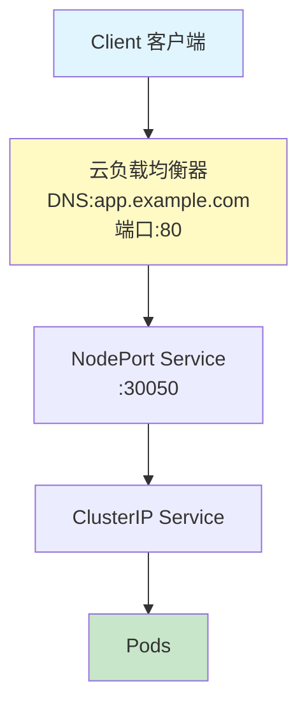
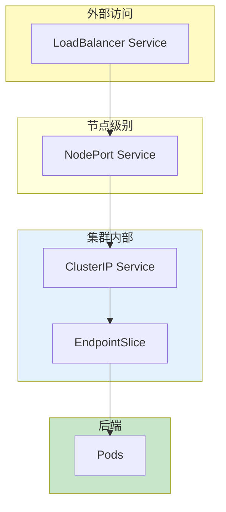
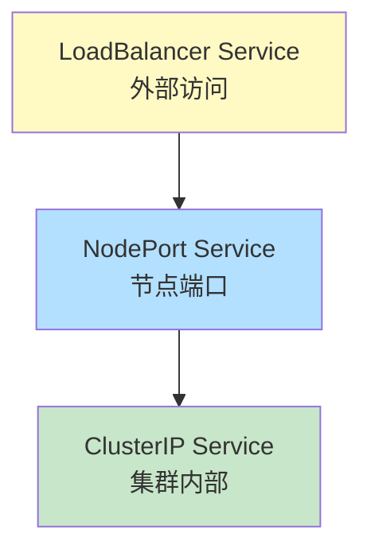

# 7: Kubernetes Services

> [!NOTE]
> Pod 是不可靠的，永远不要直接连接它们。始终应通过 Service 进行连接。

本章内容安排如下：
- Service 理论
- Service 实践操作

---

## Service 理论

Kubernetes 将 [[Pods]] 视为临时对象，在以下任何事件发生时都会删除它们：

- 缩减操作（Scale-down operations）
- 滚动更新（Rolling updates）
- 回滚（Rollbacks）
- 节点维护/驱逐（Node maintenance/evictions）
- 故障（Failures）

这意味着 Pod 是不可靠的，应用程序不能依赖它们持续响应请求。幸运的是，Kubernetes 提供了解决方案——[[Service]] 对象位于一个或多个相同 Pod 的前面，通过可靠的 DNS 名称、IP 地址和端口暴露它们。



> **图 7.1** - 客户端通过 Service 访问 Pod

> [!NOTE]
> Service 是 Kubernetes API 中的资源，因此我们大写"S"以避免与其他用法的混淆。

每个 [[Service]] 都有前端和后端：
- **前端**包含 Kubernetes 保证永远不会改变的 DNS 名称、IP 地址和网络端口
- **后端**是一个标签选择器，将流量发送到具有匹配标签的健康 Pod

在上图中，客户端通过 `app1:8080` 或 `10.99.11.23:8080` 向 Service 发送流量，Kubernetes 保证流量会到达带有 `project=tkb` 标签的 Pod。

[[Service]] 还足够智能，可以维护匹配标签的健康 Pod 列表。这意味着你可以随时扩容和缩容、执行发布和回滚，Pod 甚至可能发生故障，但 Service 始终会保持最新的活动健康 Pod 列表。

### 标签与松耦合

[[Service]] 使用 [[Label Selector|标签选择器]] 来决定将流量发送到哪些 [[Pods]]。这与告诉 [[Deployment]] 管理哪些 Pod 的技术相同。



> **图 7.2** - Service 和标签

在上例中，Service 向 Pod A、Pod B 和 Pod D 发送流量，因为它们都具有 Service 所需的标签。Pod D 有额外的标签并不重要。但是，Service 不会向 Pod C 发送流量，因为它没有两个标签。

以下 YAML 定义了一个 [[Deployment]] 和一个 [[Service]]：

```yaml
apiVersion: apps/v1
kind: Deployment
metadata:
  name: tkb-2024
spec:
  replicas: 10
  <Snip>
  template:
    metadata:
      labels:
        project: tkb        ----┐  创建 Pod
        zone: prod          ----┘  使用这些标签
    spec:
      containers:
  <Snip>
---
apiVersion: v1
kind: Service
metadata:
  name: tkb
spec:
  ports:
  - port: 8080
  selector:
    project: tkb            ----┐ 发送到具有
    zone: prod              ----┘ 这些标签的 Pod
```

### EndpointSlice 幕后机制

每当你创建一个 [[Service]]，Kubernetes 都会自动创建一个关联的 [[EndpointSlices]] 来跟踪具有匹配标签的健康 Pod。

工作原理如下：

1. 每当你创建 [[Service]]，EndpointSlice 控制器会自动创建一个关联的 EndpointSlice 对象
2. Kubernetes 然后监视集群，查找与 Service 标签选择器匹配的 Pod
3. 任何匹配选择器的新 Pod 都会被添加到 EndpointSlice
4. 任何被删除的 Pod 都会被移除
5. 应用程序通过 Service 名称发送流量
6. 应用程序的容器使用集群 DNS 将名称解析为 Service 的 IP 地址
7. 容器然后将流量发送到 Service 的 IP，Service 将其转发到 EndpointSlice 中列出的某个 Pod

> [!TIP]
> 旧版本的 Kubernetes 使用 Endpoints 对象而不是 EndpointSlices。它们的函数功能相同，但 EndpointSlices 在大型繁忙集群上性能更好。

### Service 类型

Kubernetes 有多种类型的 [[Service]] 以满足不同的用例和要求。主要类型包括：

| 类型 | 描述 |
|------|------|
| [[ClusterIP]] | 最基本的类型，在内部 Pod 网络上提供可靠的端点 |
| [[NodePort]] | 在 ClusterIP 基础上构建，允许外部客户端通过每个集群节点上的端口连接 |
| [[LoadBalancer]] | 在前两者基础上构建，与云负载均衡器集成，从互联网访问非常简单 |

让我们逐一了解它们。

#### ClusterIP Service - 从集群内部访问应用

[[ClusterIP]] 是默认的 Service 类型。这些 Service 获得一个 DNS 名称和 IP 地址，被编程到内部网络结构中，只能从集群内部访问。这意味着：

- IP 只在内部 Pod 网络上可路由
- 名称自动注册到集群的内部 DNS
- 所有容器都预先编程为使用集群 DNS 进行名称解析

例如，你正在部署一个名为 `skippy` 的应用程序，希望集群上的其他应用程序通过该名称访问它。要满足这些要求，你需要创建一个名为 `skippy` 的新 ClusterIP Service。Kubernetes 创建 Service，分配一个内部 IP，并在集群的内部 DNS 中创建 DNS 记录。Kubernetes 还配置集群上的所有容器使用集群 DNS 进行名称解析。这意味着集群上的每个应用都可以使用 `skippy` 名称连接到新应用。

> [!WARNING]
> ClusterIP Service 不可路由，需要访问集群的内部 DNS 服务，意味着它们在集群外部无法工作。

#### NodePort Service - 从集群外部访问应用

[[NodePort]] Service 在 [[ClusterIP]] Service 基础上构建，添加了一个专用端口，外部客户端可以使用。我们将此专用端口称为"NodePort"。

以下 YAML 定义了一个名为 `skippy` 的 [[NodePort]] Service：

```yaml
apiVersion: v1
kind: Service
metadata:
  name: skippy           <<---- 注册到内部集群 DNS
spec:
  type: NodePort         <<---- Service 类型
  ports:
  - port: 8080           <<---- 内部 ClusterIP 端口
    targetPort: 9000     <<---- 容器内的应用端口
    nodePort: 30050      <<---- 每个集群节点上的外部端口
  selector:
    app: hello-world
```

将此 YAML 提交到 Kubernetes 将：
- 创建一个 ClusterIP Service，带有通常的内部可路由 IP 和 DNS 名称
- 在每个集群节点上发布端口 30050，并将其映射回 ClusterIP



> **图 7.3** - NodePort Service

外部客户端可以将请求发送到任何集群节点，Service 可以将请求发送到三个健康 Pod 中的任何一个。事实上，未来的请求可能会发送到其他 Pod，因为 Service 执行简单的轮询负载均衡。

> [!WARNING]
> NodePort Service 有两个重要限制：
> 1. 使用 30000-32767 之间的高编号端口
> 2. 客户端需要知道节点的名称或 IP，以及节点是否健康
>
> 这就是为什么大多数人都使用 LoadBalancer Service 的原因。

#### LoadBalancer Service - 通过负载均衡器访问应用

[[LoadBalancer]] Service 是向外部客户端暴露服务最简单的方式。它们通过在前面放置云负载均衡器来简化 [[NodePort]] Service。



> **图 7.4** - LoadBalancer Service

客户端通过可靠的、友好的 DNS 名称在低端口号上连接到负载均衡器，负载均衡器将请求转发到健康集群节点上的 NodePort。从那里开始，与 [[NodePort]] Service 相同——发送到内部 [[ClusterIP]] Service，从 EndpointSlice 中选择一个 Pod，然后将请求发送到该 Pod。

以下 YAML 创建一个 [[LoadBalancer]] Service，在端口 8080 上监听，并一路映射到带有 `project=tkb` 标签的 Pod 上的端口 9000。它会在后台自动创建所需的 NodePort 和 ClusterIP 结构。

```yaml
apiVersion: v1
kind: Service
metadata:
  name: lb               <<---- 注册到集群 DNS
spec:
  type: LoadBalancer
  ports:
  - port: 8080           <<---- 负载均衡器端口
    targetPort: 9000     <<---- 容器内的应用端口
  selector:
    project: tkb
```

你将在后面的实践部分创建和使用 [[LoadBalancer]] Service。

### Service 理论总结



- [[Service]] 位于 [[Pods]] 前面，通过可靠的网络端点使它们可访问
- [[Service]] 的前端提供 IP 地址、DNS 名称和端口，在整个 Service 生命周期内保证稳定
- 后端通过 [[Label Selector]] 在动态 Pod 集合上负载均衡流量
- [[ClusterIP]] Service 是默认类型，在内部集群网络上提供可靠端点
- [[NodePort]] 和 [[LoadBalancer]] 提供外部端点
- [[LoadBalancer]] Service 在底层云平台上创建负载均衡器，以及所有将流量从负载均衡器转发到 Pod 的结构和映射

---

## Service 实践操作

本节展示如何以命令式和声明式方式使用 [[Service]]。一如既往，Kubernetes 更倾向于使用 YAML 文件进行声明式部署和管理。但了解命令式命令可能会有所帮助。

> [!INFO]
> 你需要准备以下内容才能跟随练习：
> - 本书 GitHub 仓库的克隆
> - Kubernetes 集群

你将创建和使用 [[LoadBalancer]] Service，可以使用第 3 章中展示的任何方式创建的集群。如果你的集群在云上，Kubernetes 将配置你的云负载均衡器并提供公网 IP 或公网 DNS 名称。如果你使用的是本地集群（如 Docker Desktop），体验相同，但你会使用本地构造如 `localhost`。

如果你还没有本书 GitHub 仓库的副本，使用以下命令克隆它，然后切换到 `2025` 分支：

```bash
$ git clone https://github.com/nigelpoulton/TKB.git
Cloning into 'TKB'...
$ cd TKB
$ git fetch origin
$ git checkout -b 2025 origin/2025
```

切换到 `Services` 目录：

```bash
$ cd TKB/services
```

运行以下命令部署一个名为 `svc-test` 的示例应用。这是一个 [[Deployment]]，创建 10 个运行 Web 应用的 Pod，监听端口 8080，并带有 `chapter=services` 标签。

```bash
$ kubectl apply -f deploy.yml
deployment.apps/svc-test created
```

确保 Pod 成功部署，然后继续下一节。

```bash
$ kubectl get deploy svc-test
NAME        READY    UP-TO-DATE    AVAILABLE    AGE
svc-test    10/10    10            10           24s
```

### 命令式操作 Service

`kubectl expose` 命令为现有 [[Deployment]] 创建一个 [[Service]]。它足够智能，可以检查正在运行的 Deployment 并创建所有所需的构造，如 IP 地址、标签选择器、DNS 记录和正确的端口映射。

运行以下命令为 `svc-test` Deployment 中的 Pod 创建一个新的 [[LoadBalancer]] Service：

```bash
$ kubectl expose deployment svc-test --type=LoadBalancer
service/svc-test exposed
```

列出 Service 查看其基本配置。如果你在云上运行，EXTERNAL-IP 列可能需要一分钟才能填充。

```bash
$ kubectl get svc -o wide
NAME         TYPE           CLUSTER-IP    EXTERNAL-IP    PORT(S)  
kubernetes   ClusterIP      10.96.0.1     <none>         443/TCP  
svc-test     LoadBalancer   10.10.19.33   212.2.245.220  8080:317
```

第一行是一个名为 `kubernetes` 的系统 Service，将 Kubernetes API 暴露给集群上的所有 Pod 和容器。你的 Service 在第二行，有很多信息，让我们逐步查看：

- **名称**：分配了与它前面的 Deployment 相同的名称——`svc-test`
- **TYPE**：显示这是一个 LoadBalancer Service，示例中分配了 EXTERNAL-IP `212.2.245.220`。如果你使用的是 Docker Desktop 等本地集群，EXTERNAL-IP 将显示 `localhost`。某些 Docker Desktop 集群会在 EXTERNAL-IP 列中错误地返回 172 IP 地址，应该是 `localhost`
- **CLUSTER-IP**：列出了 Service 的内部 IP，仅在内部集群网络上可路由
- **PORT(S)**：显示负载均衡器端口（8080）和 NodePort（31755）。默认情况下，负载均衡器端口与应用监听的端口匹配，但你可以覆盖它。NodePort 值从 30000-32767 之间随机分配
- **SELECTOR**：匹配 Pod 标签

> [!NOTE]
> 命令检查了正在运行的 Deployment，并创建了正确的端口映射和标签选择器——应用在端口 8080 上监听，所有 10 个 Pod 都有 `chapter=services` 标签。

> [!NOTE]
> 尽管这是一个 [[LoadBalancer]] Service，它也创建了所有 [[ClusterIP]] 和 [[NodePort]] 构造。这是因为 [[LoadBalancer]] Service 构建在 [[NodePort]] Service 之上，而 [[NodePort]] Service 又构建在 [[ClusterIP]] Service 之上。



> **图 7.5** - Service 堆叠

`kubectl describe` 命令提供更多详细信息：

```bash
$ kubectl describe svc svc-test
Name:                     svc-test
Namespace:                default
Labels:                   <none>
Annotations:              <none>
Selector:                 chapter=services
Type:                     LoadBalancer
IP Family Policy:         SingleStack
IP Families:              IPv4
IP:                       10.10.19.33
IPs:                      10.10.19.33
LoadBalancer Ingress:     212.2.245.220
Port:                     <unset>  8080/TCP      <<---- 负载均衡器端口
TargetPort:               8080/TCP               <<---- 应用端口
NodePort:                 <unset>  31755/TCP     <<---- NodePort
Endpoints:                10.1.0.200:8080,10.1.0.201:8080,10.1.0.202:8080,...
Session Affinity:         None
External Traffic Policy:  Cluster
Events:                   <none>
```

输出重复了你已经看到的许多内容，但有一些额外的行值得关注：

- **Endpoints**：是来自 Service 的 [[EndpointSlices]] 对象的健康匹配 Pod 列表
- **Session Affinity**：允许你控制会话粘性——是否将来自同一客户端的多个连接总是发送到同一 Pod。默认值为 `None`，将来自同一客户端的多个连接转发到不同的 Pod。如果你的应用在 Pod 中存储状态并需要会话粘性，你应该尝试 `ClientIP` 选项。但是，这是反模式，因为微服务应用应该设计为进程可处置性，客户端可以连接到任何 Pod
- **External Traffic Policy**：决定到达 Service 的流量是在所有集群节点上的 Pod 之间负载均衡，还是仅在流量到达的节点上的 Pod 之间负载均衡。默认值是 `Cluster`，将流量发送到所有集群节点上的 Pod，但会隐藏源 IP 地址。另一个选项是 `Local`，仅将流量发送到流量到达的节点上的 Pod，但会保留源 IP

> [!INFO]
> 如果你的集群运行双栈网络，你的输出也可能列出 IPv6 地址。

通过浏览器访问 EXTERNAL-IP 列中的值在端口 8080 上测试 Service 是否正常工作。

> **图 7.6** - 浏览器测试成功

成功了！你的应用运行在容器内并监听端口 8080。你创建了一个 [[LoadBalancer]] Service，在端口 8080 上监听，并将流量转发到每个集群节点上的 [[NodePort]] Service，而 [[NodePort]] Service 又将其转发到端口 8080 上的 [[ClusterIP]] Service。从那里，它被发送到托管应用副本的 Pod 上的端口 8080。

接下来，你将用声明式方式再做一次。但首先需要清理。

```bash
$ kubectl delete svc svc-test
service "svc-test" deleted
```

### 声明式方法

是时候用正确的方式——Kubernetes 的方式——来操作了。

#### Service 清单文件

以下 YAML 来自 `lb.yml` 文件，你将使用它来声明式部署 [[LoadBalancer]] Service：

```yaml
kind: Service
apiVersion: v1
metadata:
  name: svc-lb
spec:
  type: LoadBalancer
  ports:
  - port: 9000           <<---- 负载均衡器端口
    targetPort: 8080     <<---- 容器内的应用端口
  selector:
    chapter: services
```

让我们逐步查看：

- 前两行告诉 Kubernetes 基于 `v1` 架构部署一个 [[Service]] 对象
- `metadata` 块告诉 Kubernetes 将此 Service 命名为 `svc-lb` 并将名称注册到内部集群 DNS。你也可以在这里定义自定义标签和注解
- `spec` 部分定义所有前端和后端详细信息。此示例告诉 Kubernetes 部署一个 `LoadBalancer` Service，在前端端口 9000 上监听，并将流量发送到具有 `chapter=services` 标签的 Pod 的端口 8080

使用以下命令部署：

```bash
$ kubectl apply -f lb.yml
service/svc-lb created
```

#### 检查 Service

[[Service]] 是常规 API 资源，意味着你可以使用常规 `kubectl get` 和 `kubectl describe` 命令检查它们。

```bash
$ kubectl get svc svc-lb
NAME       TYPE           CLUSTER-IP      EXTERNAL-IP     PORT(S) 
svc-lb     LoadBalancer   10.43.191.202   212.2.247.202   9000:30
```

> [!TIP]
> 如果你的集群在云上，你的输出将在 EXTERNAL-IP 列中显示 `<pending>`，同时你的云平台配置负载均衡器并分配 IP 地址。持续刷新命令直到出现地址。

示例中的 Service 通过云负载均衡器在 `212.2.247.202` 上暴露到互联网。如果你运行的是本地 Docker Desktop 集群，你将通过笔记本电脑的 `localhost` 接口访问它。如果你的 Docker Desktop 集群在 EXTERNAL-IP 列中显示 172 IP 地址，请忽略它并在端口 9000 上使用 `localhost`。

一旦 Kubernetes 创建了你的 [[Service]]，在端口 9000 上将浏览器指向 EXTERNAL-IP 列中的值，确保你可以看到应用。记住，Docker Desktop 集群使用 `localhost`。

#### EndpointSlice 对象

本章前面你了解到每个 [[Service]] 都有一个或多个自己的 [[EndpointSlices]] 对象。这些是 Kubernetes 保持最新匹配标签选择器的健康 Pod 列表的地方，你可以用常规 `kubectl` 命令检查它们。

> [!INFO]
> 以下示例来自运行双栈网络的集群。注意存在两个 EndpointSlice——一个用于 IPv4 映射，另一个用于 IPv6。你的集群可能只有 IPv4 映射。

```bash
$ kubectl get endpointslices
NAME            ADDRESSTYPE   PORTS   ENDPOINTS                   
svc-lb-n7jg4    IPv4          8080    10.42.1.16,10.42.1.17,10.42.1.18,...
svc-lb-9s6sq    IPv6          8080    fd00:10:244:1::c,fd00:10:244:1::d,...
```

```bash
$ kubectl describe endpointslice svc-lb-n7jg4
Name:         svc-lb-n7jg4
Namespace:    default
Labels:       chapter=services
              endpointslice.kubernetes.io/managed-by=endpointslic...
              kubernetes.io/service-name=svc-lb
Annotations:  endpoints.kubernetes.io/last-change-trigger-time: 2024-01-15T10:30:00Z
AddressType:  IPv4
Ports:
  Name     Port  Protocol
  ----     ----  --------
  <unset>  8080  TCP
Endpoints:
  - Addresses:  10.42.1.16
    Conditions:
      Ready:    true
    Hostname:   <unset>
    TargetRef:  Pod/svc-lb-9d7b4cf9d-hnvbf
    NodeName:   k3d-tkb-agent-2
    Zone:       <unset>
  - Addresses:  10.42.1.17
<Snip>
Events:         <none>
```

完整的命令输出为每个健康 Pod 包含一个块，其中包含有用的信息。如果 [[Service]] 映射到超过 100 个 [[Pods]]，它将有多个 [[EndpointSlices]]。

### 清理

运行以下命令删除示例中创建的 [[Deployment]] 和 [[Service]]。当你删除关联的 [[Service]] 时，Kubernetes 会自动删除 Endpoints 和 [[EndpointSlices]]。

```bash
$ kubectl delete -f deploy.yml -f lb.yml
deployment.apps "svc-lb" deleted
service "svc-lb" deleted
```

---

## 章节总结

> [!SUMMARY]
> 本章你学习了 [[Service]] 为 [[Pods]] 提供可靠的网络。它们有一个前端，包含 Kubernetes 保证永远不会改变的 DNS 名称、IP 地址和端口。它们还有一个后端，将流量发送到匹配标签选择器的健康 Pod。

- **[[ClusterIP]] Service**：在内部 Kubernetes 网络上提供可靠的网络
- **[[NodePort]] Service**：在每个集群节点上暴露一个端口
- **[[LoadBalancer]] Service**：与云平台集成，创建高度可用的面向互联网的负载均衡器

---

## 相关概念

[[Label Selector]] | [[EndpointSlices]] | [[DNS]] | [[Deployment]] | [[Pods]]