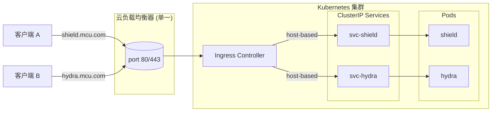
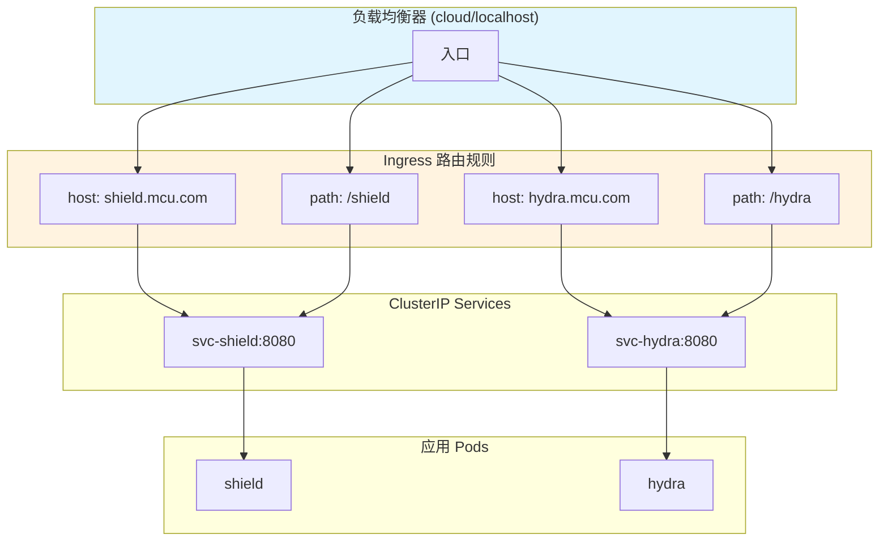
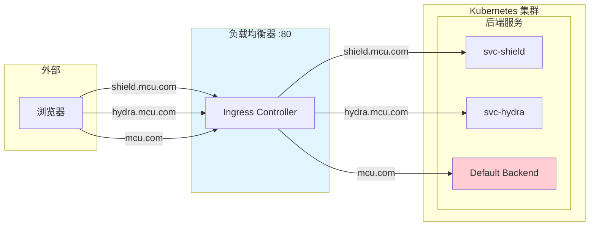

# 8: Ingress

> [!INFO]+ 先决条件
> 阅读本章前，你需要具备 [[8. Kubernetes Services]] 的实用知识。如果还没有，建议先阅读上一章。

本章分为以下三个部分：

- Ingress 场景设置
- Ingress 架构
- Ingress 实践操作

我们将对 **Ingress** 首字母大写，因为它是 Kubernetes API 中的一个资源对象。

术语说明：

- **LoadBalancer** 指 Kubernetes 中 `type=LoadBalancer` 的 [[8. Kubernetes Services|Service]] 对象
- **load balancer** 指云平台提供的互联网-facing 负载均衡器

例如，当创建一个 Kubernetes LoadBalancer Service 时，Kubernetes 会与云平台通信，配置一个云负载均衡器。

> [!TIP]+ 版本说明
> Ingress 在 Kubernetes 1.19 版本中被提升为正式发布（GA），此前经历了超过 15 个版本的 Beta 阶段。在 3 年多的 Alpha 和 Beta 期间，服务网格（Service Mesh）逐渐流行起来，功能上存在一定重叠。因此，如果你计划部署服务网格，可能不需要 Ingress。

## Ingress 场景设置

上一章介绍了如何使用 [[NodePort]] 和 [[LoadBalancer]] Service 将应用暴露给外部客户端。然而，两者都有局限性：

- **NodePort Services**：只能使用高端口号，客户端需要跟踪节点 IP 地址
- **LoadBalancer Services**：修复了上述问题，但只提供内部 Services 与云负载均衡器之间的一对一映射

这意味着一个集群如果有 25 个互联网-facing 应用，就需要 25 个云负载均衡器，而云负载均衡器是需要付费的！云平台也可能限制可创建的负载均衡器数量。

**Ingress** 通过允许通过单个云负载均衡器暴露多个 Services 来解决这个问题。

它通过在端口 80 或 443 上创建单个云负载均衡器，并使用**基于主机**（host-based）和**基于路径**（path-based）的路由将连接映射到集群上的不同 Services。我们将在下文解释这些术语。

## Ingress 架构

Ingress 定义在 `networking.k8s.io/v1` API 子组中，需要两个常规构造：

1. **资源（Resource）** - 定义路由规则
2. **控制器（Controller）** - 实现这些规则

> [!NOTE]+ 重要区别
> Kubernetes 没有内置的 Ingress 控制器，需要自行安装。这与 [[Deployments]]、[[ReplicaSets]]、[[Services]] 等大多数内置控制器的资源不同。不过，一些云平台在创建集群时会简化这个过程。

安装 Ingress 控制器后，你可以部署带有规则的 Ingress 资源，告诉控制器如何路由请求。

在路由方面，Ingress 工作在 OSI 模型的第 7 层，也称为**应用层**。这意味着它可以检查 HTTP 头部并根据主机名和路径转发流量。

> [!INFO]+ OSI 模型简介
> OSI 模型是 TCP/IP 网络的行业标准参考模型，分为 7 层（编号 1-7）：
> - 底层处理信号和电子传输
> - 中间层通过确认和重试处理可靠性
> - 高层为 HTTP 等服务添加功能
>
> Ingress 工作在第 7 层（应用层），实现 HTTP 智能路由。

### 路由示例

下表展示了主机名和路径如何路由到后端 [[ClusterIP]] Services：

| 基于主机示例 | 基于路径示例 | 后端 K8s Service |
|-------------|-------------|-----------------|
| shield.mcu.com | mcu.com/shield | shield |
| hydra.mcu.com | mcu.com/hydra | hydra |

### 架构图



**图 8.1：基于主机的路由**

上图展示两个请求访问同一个云负载均衡器。DNS 名称解析将两个主机名映射到同一个负载均衡器 IP。Ingress 控制器监视负载均衡器，并根据 HTTP 头部中的主机名路由请求。在这个例子中，它将 `shield.mcu.com` 路由到 shield [[ClusterIP]] Service，将 `hydra.mcu.com` 路由到 hydra Service。

> [!TIP]+ 总结
> 单一 Ingress 可以通过单个云负载均衡器暴露多个 [[8. Kubernetes Services]]。你创建并部署 Ingress 资源，告诉 Ingress 控制器如何根据请求头中的主机名和路径路由请求。可能需要手动安装 Ingress 控制器。

---

## Ingress 实践操作

> [!WARNING]+ 环境要求
> 本节不支持 Docker Desktop v4.38 或更早版本附带的单节点 Kubernetes 集群。建议使用云端集群（如第 3 章介绍的 LKE 集群）。

### 前置准备

你需要以下环境：

- 一个 Kubernetes 集群
- 本书 GitHub 仓库的克隆

克隆仓库并切换到 `2025` 分支：

```bash
$ git clone https://github.com/nigelpoulton/TKB.git
Cloning from...
$ cd TKB
$ git fetch origin
$ git checkout -b 2025 origin/2025
```

所有命令请在 `ingress` 目录下执行。

### 实践步骤概览

1. 安装 NGINX Ingress 控制器
2. 配置 Ingress Class
3. 部署示例应用
4. 配置 Ingress 对象
5. 检查 Ingress 对象
6. 配置 DNS 名称解析
7. 测试 Ingress

---

### 安装 NGINX Ingress 控制器

从 Kubernetes GitHub 仓库的 YAML 文件安装 NGINX 控制器。它会安装多个 Kubernetes 对象，包括 Namespace、ServiceAccounts、ConfigMaps、Roles、RoleBindings 等。

> [!NOTE]+ 命令说明
> 以下命令跨两行显示，实际使用时请合并为一行。

```bash
$ kubectl apply -f https://raw.githubusercontent.com/kubernetes/ingress-nginx/controller-v1.12.0/deploy/static/provider/cloud/deploy.yaml
namespace/ingress-nginx created
serviceaccount/ingress-nginx created
<截断>
```

检查 `ingress-nginx` Namespace 并确保控制器 Pod 运行中：

```bash
$ kubectl get pods -n ingress-nginx \
  -l app.kubernetes.io/name=ingress-nginx
NAME                                        READY   STATUS      
ingress-nginx-admission-create-789md        0/1     Completed   
ingress-nginx-admission-patch-tc4cl         0/1     Completed   
ingress-nginx-controller-7445ddc6c4-csf98   0/1     Running     
```

> [!TIP]+ 关于 Completed 状态的 Pods
> 不必担心 Completed 状态的 Pods，它们是初始化环境的短生命周期 Pods。

控制器 Pod 运行后，NGINX Ingress 控制器就绪，可以创建 Ingress 对象了。

---

### Ingress Classes

**Ingress Classes** 允许你在单个集群上运行多个 Ingress 控制器：

1. 将每个 Ingress 控制器映射到自己的 Ingress Class
2. 创建 Ingress 对象时，分配给某个 Ingress Class

如果你跟随操作，至少会有一个名为 `nginx` 的 Ingress Class（安装 NGINX 控制器时创建）。

```bash
$ kubectl get ingressclass
NAME    CONTROLLER             PARAMETERS   AGE
nginx   k8s.io/ingress-nginx   <none>       2m25s
```

查看 nginx Ingress Class 的详细信息：

```bash
$ kubectl describe ingressclass nginx
Name:         nginx
Labels:       app.kubernetes.io/component=controller
              app.kubernetes.io/instance=ingress-nginx
              app.kubernetes.io/name=ingress-nginx
              app.kubernetes.io/part-of=ingress-nginx
              app.kubernetes.io/version=1.9.4
Annotations:  <none>
Controller:   k8s.io/ingress-nginx
Events:       <none>
```

Ingress 控制器和 Ingress Class 就绪后，可以部署和配置 Ingress 对象了。

---

### 配置基于主机和基于路径的路由

本节部署两个应用和单个 Ingress 对象。Ingress 通过单个负载均衡器将流量路由到两个应用。

#### 部署架构



**图 8.2：基于主机和路径的路由架构**

#### 流量流向说明

以 shield Pod 的流量为例：

1. 客户端发送请求到 `shield.mcu.com` 或 `mcu.com/shield`
2. DNS 名称解析确保流量到达云负载均衡器
3. Ingress 控制器读取 HTTP 头部，找到主机名（`shield.mcu.com`）或路径（`mcu.com/shield`）
4. Ingress 规则触发，将流量路由到 `svc-shield` [[ClusterIP]] 后端 Service
5. [[ClusterIP]] Service 确保流量到达 shield Pod

---

### 部署示例环境

本节部署 Ingress 将路由的两个应用和 [[ClusterIP]] Services。

`app.yml` 文件包含：

- `shield` 应用（监听端口 8080），前端配置 [[ClusterIP]] Service `svc-shield`
- `hydra` 应用（监听端口 8080），前端配置 [[ClusterIP]] Service `svc-hydra`

```bash
$ kubectl apply -f app.yml
service/svc-shield created
service/svc-hydra created
pod/shield created
pod/hydra created
```

Pod 和 Service 运行后，进入下一节创建 Ingress。

---

### 创建 Ingress 对象

部署 `ig-all.yml` 文件中定义的 Ingress 对象。它描述了名为 `mcu-all` 的 Ingress，包含四条规则。

```yaml
apiVersion: networking.k8s.io/v1
kind: Ingress
metadata:
  name: mcu-all
  annotations:
    nginx.ingress.kubernetes.io/rewrite-target: /
spec:
  ingressClassName: nginx
  rules:
  - host: shield.mcu.com
    http:
      paths:
      - path: /
        pathType: Prefix
        backend:
          service:
            name: svc-shield
            port:
              number: 8080
  - host: hydra.mcu.com
    http:
      paths:
      - path: /
        pathType: Prefix
        backend:
          service:
            name: svc-hydra
            port:
              number: 8080
  - host: mcu.com
    http:
      paths:
      - path: /shield
        pathType: Prefix
        backend:
          service:
            name: svc-shield
            port:
              number: 8080
      - path: /hydra
        pathType: Prefix
        backend:
          service:
            name: svc-hydra
            port:
              number: 8080
```

#### 配置详解

| 行号    | 说明                                                          |
| ----- | ----------------------------------------------------------- |
| 1-2   | 通知 Kubernetes 部署基于 `networking.k8s.io/v1` API 的 Ingress 对象  |
| 4     | Ingress 名称为 `mcu-all`                                       |
| 6     | 注解告诉控制器尝试重写路径为应用期望的路径（`/`）。这是 NGINX Ingress 控制器特有的注解        |
| 8     | `spec.ingressClassName` 字段指定此 Ingress 由 NGINX Ingress 控制器管理 |
| 10-19 | `shield.mcu.com` 的基于主机规则                                    |
| 20-29 | `hydra.mcu.com` 的基于主机规则                                     |
| 30-39 | `mcu.com/shield` 的基于路径规则                                    |
| 40-49 | `mcu.com/hydra` 的基于路径规则                                     |

> [!NOTE]+ rewrite-target 注解
> 此注解是 NGINX Ingress 控制器特有的。使用其他控制器时需要注释掉此行。

部署 Ingress 对象：

```bash
$ kubectl apply -f ig-all.yml 
ingress.networking.k8s.io/mcu-all created
```

---

### 检查 Ingress 对象

列出 default Namespace 中的所有 Ingress 对象：

```bash
$ kubectl get ing
NAME      CLASS   HOSTS                                  ADDRESS  
mcu-all   nginx   shield.mcu.com,hydra.mcu.com,mcu.com   212.2.24
```

字段说明：

- **CLASS**：处理此规则集的 Ingress Class
- **HOSTS**：Ingress 处理的 hostname 列表
- **ADDRESS**：负载均衡器端点（云平台为公网 IP/DNS，本地集群为 localhost）
- **PORTS**：仅支持 80 或 443

查看 Ingress 详情：

```bash
$ kubectl describe ing mcu-all
Name:             mcu-all
Namespace:        default
Address:          212.2.246.150
Ingress Class:    nginx
Default backend:  <default>
Rules:
  Host            Path      Backends
  ----            ----      --------
  shield.mcu.com  /         svc-shield:8080 (10.36.1.5:8080)
  hydra.mcu.com   /         svc-hydra:8080 (10.36.0.7:8080)
  mcu.com         /shield   svc-shield:8080 (10.36.1.5:8080)
                  /hydra    svc-hydra:8080 (10.36.0.7:8080)
Annotations:      nginx.ingress.kubernetes.io/rewrite-target: /
Events:           <none>
  Type    Reason  Age                From                      Message
  ----    ------  ----               ----                      -------
  Normal  Sync    27s (x2 over 28s)  nginx-ingress-controller  Scheduled for update
```

输出说明：

- **Address**：负载均衡器的 IP 或 DNS 名称（本地集群可能是 localhost）
- **Default backend**：控制器将未知 hostname 或路径的流量发送到的位置
- **Rules**：主机、路径和后端之间的映射规则
- **Annotations**：定义控制器特定功能和云后端集成

> [!INFO]+ 云控制台查看
> 负载均衡器创建后，可以在云控制台查看。如果集群在 Google Kubernetes Engine (GKE) 上，图 8.3 展示了 Google Cloud 后端负载均衡器的配置样式。

**图 8.3：云后端负载均衡器配置**

---

### 配置 DNS 名称解析

实际环境中，需要配置内部 DNS 或互联网 DNS 将主机名指向 Ingress 负载均衡器。具体方法因环境和 DNS 提供商而异。

跟随操作时，最简单的方法是编辑本地计算机的 `hosts` 文件：

| 操作系统 | 文件位置 | 权限要求 |
|---------|---------|---------|
| Mac/Linux | `/etc/hosts` | root 权限 |
| Windows | `C:\Windows\System32\drivers\etc\hosts` | 管理员身份运行 |

> [!WARNING]+ Windows 用户注意
> 以管理员身份打开记事本，然后打开 `C:\Windows\System32\drivers\etc` 目录下的 hosts 文件。确保打开对话框设置为"所有文件 (*.*)"。

添加三条记录（使用 `kubectl get ing mcu-all` 的输出中的 IP）：

```
212.2.246.150 shield.mcu.com
212.2.246.150 hydra.mcu.com
212.2.246.150 mcu.com
```

---

### 测试 Ingress

打开浏览器尝试以下 URL：

- `shield.mcu.com`
- `hydra.mcu.com`
- `mcu.com`



**图 8.4：基于主机的路由完整架构**

> [!NOTE]+ 关于 mcu.com 根路径
> 注意：`mcu.com` 的请求被路由到默认后端，因为你没有为 `mcu.com` 创建 Ingress 规则。不同 Ingress 控制器的响应消息可能不同。GKE 内置 Ingress 返回：
> ```
> 404 response (backend NotFound), service rules for [ / ] non-existent
> ```

尝试基于路径的路由：

- `mcu.com/shield`
- `mcu.com/hydra`

> [!TIP]+ 路径重写限制
> 基于路径的路由使用对象注解中指定的 rewrite-target 功能。但某些应用可能不支持路径重写，图片可能无法显示。

**恭喜！** 你已成功配置了基于主机和基于路径路由的 Ingress —— 两个应用分别由两个 [[ClusterIP]] Services 前置，但都通过 Kubernetes Ingress 创建和管理的单个负载均衡器发布！

---

## 清理

跟随操作的集群上会有以下资源：

| 资源类型 | 名称 |
|---------|------|
| Pods | shield, hydra |
| Services | svc-shield, svc-hydra |
| Ingress 控制器 | ingress-nginx |
| Ingress 资源 | mcu-all |

**1. 删除 Ingress 资源：**

```bash
$ kubectl delete -f ig-all.yml
ingress.networking.k8s.io "mcu-all" deleted
```

**2. 删除 Pods 和 ClusterIP Services：**

```bash
$ kubectl delete -f app.yml
service "svc-shield" deleted
service "svc-hydra" deleted
pod "shield" deleted
pod "hydra" deleted
```

**3. 删除 NGINX Ingress 控制器：**

```bash
$ kubectl delete -f https://raw.githubusercontent.com/kubernetes/ingress-nginx/controller-v1.12.0/deploy/static/provider/cloud/deploy.yaml
namespace "ingress-nginx" deleted
serviceaccount "ingress-nginx" deleted
<截断>
```

**4. 还原 hosts 文件：**

```bash
$ sudo vi /etc/hosts
# Host Database
<截断>
# 删除以下条目：
# 212.2.246.150 shield.mcu.com
# 212.2.246.150 hydra.mcu.com
# 212.2.246.150 mcu.com
```

---

## 本章总结

本章学习了以下内容：

- **Ingress** 是一种通过单个云负载均衡器暴露多个应用（[[ClusterIP]] Services）的方式
- Ingress 是 API 中的稳定对象，但功能与许多服务网格有重叠
- 如果你正在运行[[服务网格]]（Service Mesh），可能不需要 Ingress

### 关键要点

> [!ABSTRACT]+ 核心概念
> - Ingress 通过单个负载均衡器实现多应用暴露
> - 需要手动安装 Ingress 控制器（Kubernetes 无内置）
> - 支持基于主机和基于路径的路由
> - 工作在 OSI 第 7 层（应用层），可检查 HTTP 头部
> - 资源 + 控制器 = 完整 Ingress 功能

### 实践技能

- 安装 NGINX Ingress 控制器
- 配置 Ingress Classes
- 部署 Ingress 对象
- 配置基于主机和路径的路由规则
- 测试和验证 Ingress 功能