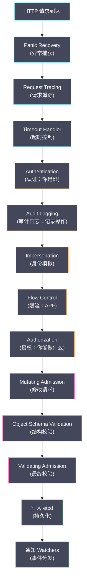
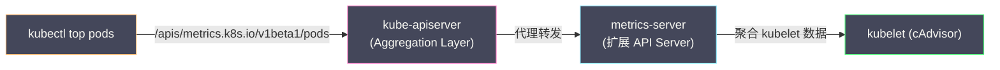

# 01 API Server 的角色与整体架构

**摘要：**

在 [[02 Kubernetes 整体架构]] 中我们确立了 API Server 的核心定位：它是 K8s 集群中**所有组件通信的唯一枢纽**，也是 [[etcd]] 的**唯一客户端**。但"唯一枢纽"这四个字背后隐藏着巨大的工程复杂度——API Server 需要同时扮演 REST API 网关、认证授权门卫、数据校验引擎、Watch 事件分发器、API 版本转换器等多重角色，还要在高并发下保持低延迟和高可用。本文作为 API Server 专栏的开篇，先从"API Server 到底做了什么"出发，梳理它在 K8s 架构中承担的全部职责，然后深入其内部的**请求处理管线（Handler Chain）**——一个 HTTP 请求从进入 API Server 到写入 etcd 并通知 Watcher，经历了哪些处理阶段、每个阶段解决什么问题。最后介绍 **API Aggregation Layer**——K8s 如何在不修改核心 API Server 的情况下扩展 API 端点。

---

## 第 1 章 API Server 的七重角色

### 1.1 角色一：RESTful API 网关

API Server 对外暴露了一组符合 REST 风格的 HTTP API。K8s 中的每种资源类型对应一个 REST 端点，支持标准的 CRUD 操作：

| HTTP 方法 | 操作 | K8s 语义 | 示例 |
| :--- | :--- | :--- | :--- |
| **GET** | Read | 获取单个对象或列表 | `GET /api/v1/namespaces/default/pods/nginx` |
| **POST** | Create | 创建新对象 | `POST /api/v1/namespaces/default/pods` |
| **PUT** | Update | 整体更新对象（必须提供完整的 spec）| `PUT /api/v1/namespaces/default/pods/nginx` |
| **PATCH** | Partial Update | 部分更新对象 | `PATCH /api/v1/namespaces/default/pods/nginx` |
| **DELETE** | Delete | 删除对象 | `DELETE /api/v1/namespaces/default/pods/nginx` |
| **GET** + `?watch=true` | Watch | 长连接监听资源变化 | `GET /api/v1/pods?watch=true` |

API Server 使用 Go 的 `net/http` 包构建 HTTP 服务，内部通过 **go-restful** 框架注册路由。每种资源类型（由 [[03 API 对象模型与 GVR 体系|GVR]] 标识）对应一组路由：

```
/api/v1/namespaces/{namespace}/pods              → PodStorage (List, Create)
/api/v1/namespaces/{namespace}/pods/{name}        → PodStorage (Get, Update, Delete)
/api/v1/namespaces/{namespace}/pods/{name}/status  → PodStatusStorage (Get, Update)
/api/v1/namespaces/{namespace}/pods/{name}/log     → PodLogStorage (Get)
```

REST 的一致性使得 K8s 的 API 非常可预测——一旦你知道了一种资源的 API 路径模式，其他所有资源都遵循相同的模式。这也是 `kubectl` 能用统一的命令操作所有资源的基础。

### 1.2 角色二：认证门卫（Authentication）

每个到达 API Server 的请求必须先通过**认证（Authentication）**——确定"请求者是谁"。API Server 支持多种认证方式，并将它们组织为一条**认证链（Authentication Chain）**——请求按顺序通过每种认证方式，任意一种认证成功即可，全部失败则拒绝请求。

认证的结果是一个**用户信息（UserInfo）**——包含用户名、UID、所属组。这个信息会传递给后续的授权阶段。

认证机制的详细分析见 [[02 认证机制深度解析]]。

### 1.3 角色三：授权门卫（Authorization）

认证确定了"你是谁"，授权决定"你能做什么"。API Server 收到一个已认证的请求后，检查该用户是否有权限执行该操作（如"用户 alice 是否可以在 default Namespace 中创建 Pod"）。

K8s 支持多种授权模式，最常用的是 **RBAC（Role-Based Access Control）**——通过 Role/ClusterRole 定义权限、通过 RoleBinding/ClusterRoleBinding 将权限绑定到用户或组。

授权机制的详细分析见 [[03 授权机制——RBAC 深度解析]]。

### 1.4 角色四：准入控制器（Admission Control）

通过认证和授权后，请求进入**准入控制（Admission Control）** 阶段。准入控制器可以修改请求（如设置默认值、注入 Sidecar 容器）或拒绝请求（如拒绝不合规的资源配置）。

准入控制分为两个子阶段：**Mutating Admission**（可以修改请求）和 **Validating Admission**（只能接受或拒绝，不能修改）。准入控制器是 K8s 安全策略和策略执行的关键环节。

准入控制器的详细分析见 [[04 准入控制器深度解析]]。

### 1.5 角色五：数据校验与持久化

通过准入控制后，API Server 对请求中的对象进行**Schema 校验**——验证对象的结构是否符合 API 定义（字段名是否正确、类型是否匹配、必填字段是否存在）。校验通过后，API Server 将对象序列化（默认 protobuf 格式）并写入 [[etcd]]。

API Server 是 etcd 的**唯一客户端**——其他任何组件（kubectl、kubelet、Controller Manager）都不直接访问 etcd。这种设计将 etcd 的读写逻辑封装在 API Server 内部，对外暴露结构化的 REST API，实现了存储层与业务逻辑的解耦。

### 1.6 角色六：Watch 事件分发器

当 etcd 中的数据发生变化时（新对象被创建、现有对象被更新或删除），API Server 通过 **Watch 机制**将变更事件推送给所有订阅了该资源的客户端。

API Server 内部维护一个 **watch cache**——它缓存了最近的变更事件和资源对象。当客户端发起 Watch 请求时，API Server 从 watch cache 中获取数据，而不是直接查询 etcd——这大幅减少了 etcd 的读取压力。在大规模集群中，可能有数百个控制器同时 Watch 不同类型的资源——如果每个 Watch 都直接查询 etcd，etcd 会被压垮。

Watch 机制的详细分析见 [[05 List-Watch 机制与 Informer 框架]]。

### 1.7 角色七：API 版本转换器

同一种资源可能有多个 API 版本（如 `autoscaling/v1` 和 `autoscaling/v2`），但在 etcd 中只存储一个版本（Storage Version）。当客户端通过非存储版本的 API 读写资源时，API Server 需要在请求版本和存储版本之间进行**双向转换**。

例如：客户端通过 `autoscaling/v2` 创建一个 HPA，API Server 将其从 `v2` 格式转换为 `v1`（存储版本）后写入 etcd。当另一个客户端通过 `autoscaling/v1` 读取该 HPA 时，API Server 直接返回 etcd 中的数据（已经是 v1 格式）。当通过 `v2` 读取时，API Server 从 etcd 读取 v1 数据，转换为 v2 格式后返回。

这个转换过程对客户端完全透明——客户端认为自己在操作 v2 的 API，不知道 etcd 中存储的是 v1 格式。

---

## 第 2 章 请求处理管线（Handler Chain）

### 2.1 全链路概览

一个 HTTP 请求从进入 API Server 到写入 etcd 并通知 Watcher，经历以下处理阶段：



每个阶段都是一个 HTTP 中间件（Middleware / Filter）。API Server 使用 Go 的 `http.Handler` 接口将这些中间件串联为一条处理链——请求从最外层开始，逐层通过每个中间件，直到到达最终的 REST handler。

### 2.2 Panic Recovery

处理链的最外层是**异常恢复**——捕获请求处理过程中任何未被处理的 panic，避免单个请求的崩溃导致整个 API Server 进程退出。捕获 panic 后返回 500 Internal Server Error。

这是一个防御性设计——在一个需要 7×24 运行的核心基础设施组件中，任何未预期的异常都不应该杀死整个进程。

### 2.3 Timeout Handler

API Server 为每个请求设置超时——默认 60 秒。如果请求在超时时间内没有处理完，API Server 返回 504 Gateway Timeout。

超时控制的意义在于防止慢请求占用资源——如果一个 etcd 写入操作因为 etcd 响应缓慢而阻塞 60 秒以上，该请求会被强制终止，避免线程（goroutine）泄漏。

长连接的 Watch 请求是例外——它们不受这个超时限制，因为 Watch 本身就是设计为持续运行的。

### 2.4 Authentication（认证）

认证阶段确定请求者的身份。API Server 维护一个认证器链——请求按顺序通过每个认证器：

1. **客户端证书认证**（X.509）：检查 TLS 握手中的客户端证书
2. **Bearer Token 认证**：检查 HTTP Header 中的 `Authorization: Bearer <token>`
3. **ServiceAccount Token 认证**：Pod 中自动挂载的 JWT Token
4. **OIDC 认证**：外部身份提供者（如 Google、Azure AD）签发的 ID Token
5. **Webhook 认证**：调用外部服务验证 Token
6. **匿名认证**：如果所有认证器都没有认证成功且允许匿名访问，以 `system:anonymous` 身份继续

任意一种认证方式成功，请求就带上了用户身份信息进入下一阶段。全部失败则返回 401 Unauthorized。

### 2.5 Audit Logging（审计日志）

认证成功后，API Server 记录**审计日志（Audit Log）**——记录"谁（user）在什么时候（timestamp）对什么资源（resource）做了什么操作（verb）"。

审计日志分为四个级别：

| 级别 | 记录内容 |
| :--- | :--- |
| **None** | 不记录 |
| **Metadata** | 记录请求元数据（用户、资源、操作、时间）|
| **Request** | 记录元数据 + 请求体 |
| **RequestResponse** | 记录元数据 + 请求体 + 响应体 |

通过 **Audit Policy** 可以为不同的资源和操作配置不同的审计级别——例如对 Secret 的所有操作记录 RequestResponse 级别（便于追踪谁读取了密钥），对 Pod 的 Get 操作只记录 Metadata 级别（减少日志量）。

审计日志是安全合规的关键——它提供了集群中所有操作的完整审计轨迹。在安全事件发生时，审计日志是追溯攻击路径的重要依据。

### 2.6 Impersonation（身份模拟）

**身份模拟**允许一个用户"假装"成另一个用户发送请求——前提是该用户拥有 `impersonate` 权限。典型场景是管理员排查问题时模拟某个 ServiceAccount 的视角，检查它能看到什么资源。

```bash
# 管理员模拟 ServiceAccount "app-sa" 查看 Pod
kubectl get pods --as=system:serviceaccount:default:app-sa
```

API Server 在这个阶段检查请求中的 Impersonation Header（`Impersonate-User`、`Impersonate-Group`），验证发起者是否有权限模拟目标身份，然后将后续处理中的用户身份替换为被模拟的用户。

### 2.7 Flow Control（限流——APF）

**API Priority and Fairness（APF）** 是 K8s 1.20 引入的请求限流机制，替代了之前简单的 `--max-requests-inflight` 全局限流。

APF 的核心思想是将请求分类，并为每个类别分配独立的优先级和并发配额——确保高优先级的请求（如 Leader Election）不会被大量低优先级请求（如批量 List）饿死。

APF 使用两个 CRD 配置：

- **FlowSchema**：将请求分类（基于用户、Namespace、资源类型、API 组等条件）
- **PriorityLevelConfiguration**：为每个优先级定义并发配额和排队策略

```yaml
# 示例：将 system:leader-locking 组的请求分为最高优先级
apiVersion: flowcontrol.apiserver.k8s.io/v1
kind: FlowSchema
metadata:
  name: leader-election
spec:
  priorityLevelConfiguration:
    name: leader-election       # 关联的优先级
  matchingPrecedence: 100
  rules:
    - subjects:
        - kind: Group
          group:
            name: "system:leader-locking"
      resourceRules:
        - verbs: ["get", "create", "update"]
          apiGroups: ["coordination.k8s.io"]
          resources: ["leases"]
```

APF 的价值在大规模集群中尤为突出——当集群有数千个 Pod 同时重启（如节点故障恢复后），kubelet 会同时向 API Server 发送大量请求。没有 APF 时，这些请求可能淹没 API Server，导致控制器的协调请求（更高优先级）也被阻塞。APF 确保控制器的请求优先被处理。

### 2.8 Authorization（授权）

授权阶段检查已认证的用户是否有权限执行该操作。API Server 支持多种授权模式，按配置顺序依次检查：

| 授权模式 | 说明 |
| :--- | :--- |
| **RBAC** | 基于角色的访问控制（最常用）|
| **Node** | 专门为 kubelet 设计的授权器——限制 kubelet 只能访问分配给它的 Pod 和相关资源 |
| **Webhook** | 调用外部服务做授权决策 |
| **ABAC** | 基于属性的访问控制（已弃用，被 RBAC 取代）|
| **AlwaysAllow / AlwaysDeny** | 允许/拒绝所有请求（仅用于开发测试）|

任意一种授权方式返回"允许"，请求通过。所有方式都返回"拒绝"或"无意见"，请求被拒绝（403 Forbidden）。

### 2.9 Mutating Admission → Schema Validation → Validating Admission

这是准入控制的三步骤——请求必须依次通过：

1. **Mutating Admission**：可以修改请求中的对象。例如 `DefaultStorageClass` 准入控制器在创建 PVC 时自动注入默认的 StorageClass；`MutatingWebhookConfiguration` 允许外部 Webhook 服务修改请求。
2. **Schema Validation**：验证对象的 JSON/YAML 结构是否符合 API 的 OpenAPI Schema——字段名是否合法、类型是否正确、枚举值是否有效。
3. **Validating Admission**：最终的校验——只能接受或拒绝，不能修改。例如 `ResourceQuota` 准入控制器检查请求是否超出 Namespace 的资源配额；`ValidatingWebhookConfiguration` 允许外部 Webhook 服务校验请求。

> [!info] 为什么 Mutating 在 Validating 之前
> Mutating Admission 可能会修改对象（如注入字段、设置默认值），这些修改后的内容需要再经过 Validating Admission 的校验。如果顺序相反——先 Validate 再 Mutate——Mutate 注入的内容就没有被校验过，可能不符合安全策略。

---

## 第 3 章 API Aggregation Layer

### 3.1 问题背景

K8s 的核心 API Server（kube-apiserver）内置了所有核心资源类型的处理逻辑。但某些 API 需要特殊的后端实现——例如 **Metrics API**（`metrics.k8s.io`），它返回的是实时的 CPU/内存使用率数据，这些数据来自 kubelet 的采集，而不是 etcd 中的持久化对象。

如果把所有这类特殊 API 都塞进 kube-apiserver，它会变得臃肿且难以维护。K8s 需要一种机制，允许独立的 API 服务"注册"到 kube-apiserver 的 API 路径下——客户端（如 kubectl）无感地通过 kube-apiserver 的统一入口访问这些扩展 API。

### 3.2 工作机制

**API Aggregation Layer** 是 kube-apiserver 内置的代理层。它通过 **APIService** 对象将特定的 API Group/Version 的请求转发给后端的扩展 API Server。

```yaml
apiVersion: apiregistration.k8s.io/v1
kind: APIService
metadata:
  name: v1beta1.metrics.k8s.io
spec:
  service:
    name: metrics-server        # 后端服务名称
    namespace: kube-system
  group: metrics.k8s.io
  version: v1beta1
  insecureSkipTLSVerify: true
  groupPriorityMinimum: 100
  versionPriority: 100
```

注册后，所有发往 `/apis/metrics.k8s.io/v1beta1/` 的请求不再由 kube-apiserver 自己处理，而是被代理转发给 `kube-system` Namespace 中名为 `metrics-server` 的 Service。



### 3.3 Aggregated API vs CRD

在 [[03 API 对象模型与 GVR 体系]] 中我们已经对比过 CRD 和 Aggregated API。这里从 API Server 架构的角度补充：

**CRD** 的处理逻辑完全在 kube-apiserver 内部——kube-apiserver 使用通用的 handler 处理所有 CRD 资源，数据存储在 etcd 中。CRD 不需要额外的服务进程。

**Aggregated API** 的处理逻辑在外部的扩展 API Server 中——kube-apiserver 只做请求转发（代理）。扩展 API Server 可以使用自己的存储后端（如内存、数据库），适合返回实时计算的数据（如 Metrics）。

---

## 第 4 章 API Server 的无状态设计

### 4.1 为什么无状态

API Server 本身不在内存或本地磁盘中保存任何集群状态——所有持久化状态都在 etcd 中，watch cache 只是 etcd 数据的内存镜像。这种无状态设计带来三个关键优势：

**水平扩展**：可以部署多个 API Server 实例，前面放一个负载均衡器（如 HAProxy 或云厂商的 LB），每个实例独立处理请求。实例之间不需要同步任何状态——它们都从 etcd 读取数据、向 etcd 写入数据。

**快速恢复**：如果一个 API Server 实例崩溃，重启后它只需要重新建立与 etcd 的连接、重建 watch cache——不需要从其他实例同步任何数据。

**简化运维**：不需要关心实例间的状态一致性——每个实例是完全对等的。升级 API Server 时可以逐一滚动重启，不会丢失数据。

### 4.2 Watch Cache 的角色

虽然 API Server 是"无状态"的，但它在内存中维护了一个 **watch cache**——这是 etcd 数据的一个副本，用于加速读取和 Watch 操作。

watch cache 的结构：

| 组件 | 作用 |
| :--- | :--- |
| **store**（内存缓存）| 存储每种资源类型的所有对象的最新版本 |
| **watch event buffer**（事件环形缓冲区）| 存储最近的变更事件（默认保留 100 个事件）|

**读取加速**：`kubectl get pods`（List 操作）默认从 watch cache 中读取，不查询 etcd。只有需要强一致性的读取（携带 `resourceVersion="0"` 以外的精确版本号）才会回源到 etcd。

**Watch 加速**：客户端的 Watch 请求从 watch cache 的事件缓冲区中获取变更事件，而不是直接 Watch etcd。多个客户端同时 Watch 同一种资源时，etcd 只需要推送一次变更给 API Server，API Server 的 watch cache 再扇出（fan-out）给所有客户端。

> [!note] watch cache 的一致性
> watch cache 是 etcd 数据的**最终一致副本**——etcd 中的变更需要经过 Watch 机制传播到 API Server 的 watch cache，存在微小的延迟（通常在毫秒级）。对于 K8s 的控制器来说，这个延迟是可以接受的——控制器本身是基于 [[01 Kubernetes 的诞生与设计哲学|Level-triggered]] 设计的，即使短暂读到旧数据，下一次协调循环会修正。

---

## 第 5 章 API Server 的启动与自举

### 5.1 启动流程

API Server 的启动是一个精心编排的过程——它需要先建立与 etcd 的连接、注册所有 API 资源的 handler、加载认证和授权配置、初始化准入控制器链，然后才开始接受请求。

关键的启动阶段：

1. **解析命令行参数和配置**：读取证书路径、etcd 端点、认证/授权配置等
2. **建立 etcd 连接**：验证 etcd 的可达性和健康状态
3. **创建 API 资源的 Storage**：为每种资源类型（Pod、Deployment、Service 等）创建对应的 Storage 对象——封装了与 etcd 的 CRUD 交互
4. **注册 REST 路由**：将每种资源的 Storage 映射到对应的 HTTP 路由
5. **初始化认证器链**：加载客户端 CA 证书、ServiceAccount 密钥、OIDC 配置等
6. **初始化授权器链**：加载 RBAC 策略（从 etcd 中读取 Role/RoleBinding）
7. **初始化准入控制器链**：加载内置准入控制器和 Webhook 配置
8. **初始化 watch cache**：为每种资源启动一个 etcd Watcher，将数据同步到内存缓存
9. **启动 HTTPS 服务**：开始接受客户端请求

### 5.2 健康检查端点

API Server 暴露了三个健康检查端点：

| 端点 | 含义 |
| :--- | :--- |
| **`/livez`** | API Server 进程是否存活 |
| **`/readyz`** | API Server 是否准备好接受请求（所有组件是否初始化完成）|
| **`/healthz`** | 遗留端点，综合了 livez 和 readyz |

负载均衡器使用 `/readyz` 判断实例是否可以接收流量——在 API Server 启动过程中，watch cache 还没有同步完成时，`/readyz` 返回不健康，负载均衡器不会将请求路由到该实例。

---

## 第 6 章 OpenAPI 与 API Discovery

### 6.1 OpenAPI Specification

API Server 自动为所有注册的 API 资源生成 **OpenAPI v3 Specification**——这是一份机器可读的 API 文档，描述了每种资源的所有字段、类型、校验规则。

```bash
# 获取 OpenAPI 规范
kubectl get --raw /openapi/v3
```

OpenAPI 规范的用途：

- **kubectl explain**：`kubectl explain pod.spec.containers` 的输出来自 OpenAPI 规范
- **客户端代码生成**：`client-go`、Python 客户端、Java 客户端等都基于 OpenAPI 规范自动生成
- **IDE 补全**：VS Code 等 IDE 使用 OpenAPI 规范提供 YAML 补全和校验
- **CRD 校验**：CRD 的 `openAPIV3Schema` 字段定义自定义资源的结构，API Server 基于此进行请求校验

### 6.2 API Discovery

API Server 在 `/api` 和 `/apis` 端点提供 **API Discovery**——列出集群中所有可用的 API Group、Version 和 Resource。

```bash
# 列出所有 API 组
kubectl get --raw /apis | python3 -m json.tool

# 列出 apps/v1 组中的所有资源
kubectl get --raw /apis/apps/v1 | python3 -m json.tool
```

kubectl 在首次运行时会查询 Discovery API 并缓存结果（`~/.kube/cache/discovery/`）。CRD 注册后，Discovery API 自动包含新资源——这就是为什么 `kubectl get <crd-resource>` 能立即工作。

---

## 第 7 章 总结

本文建立了对 API Server 内部架构的全局认知：

- **七重角色**：REST API 网关、认证、授权、准入控制、数据校验与持久化、Watch 事件分发、API 版本转换
- **Handler Chain**：请求经历 Panic Recovery → Timeout → Authentication → Audit → Impersonation → Flow Control (APF) → Authorization → Mutating Admission → Schema Validation → Validating Admission → etcd 写入 → Watch 通知
- **API Aggregation**：通过 APIService 对象将特定 API Group 的请求代理给外部扩展 API Server
- **无状态设计**：所有持久状态在 etcd 中，watch cache 是加速层，支持水平扩展
- **OpenAPI + Discovery**：自动生成 API 文档和资源发现，驱动 kubectl、客户端库和 IDE

后续五篇文章将逐一深入每个核心阶段：[[02 认证机制深度解析|认证]]、[[03 授权机制——RBAC 深度解析|RBAC 授权]]、[[04 准入控制器深度解析|准入控制]]、[[05 List-Watch 机制与 Informer 框架|List-Watch/Informer]]、[[06 API Server 性能调优与高可用|性能与高可用]]。

---

## 参考资料

1. Kubernetes Documentation - API Server：https://kubernetes.io/docs/reference/command-line-tools-reference/kube-apiserver/
2. Kubernetes Documentation - API Access Control：https://kubernetes.io/docs/concepts/security/controlling-access/
3. Kubernetes Documentation - API Aggregation：https://kubernetes.io/docs/concepts/extend-kubernetes/api-extension/apiserver-aggregation/
4. Kubernetes Documentation - API Priority and Fairness：https://kubernetes.io/docs/concepts/cluster-administration/flow-control/
5. Kubernetes Source Code - staging/src/k8s.io/apiserver：https://github.com/kubernetes/kubernetes/tree/master/staging/src/k8s.io/apiserver
6. Daniel Smith (2019). *API Machinery Deep Dive*. KubeCon.
7. Michael Hausenblas, Stefan Schimanski (2019). *Programming Kubernetes*. O'Reilly, Chapter 2.

---

> [!note] 思考题
> 1. API Server 是 Kubernetes 唯一直接操作 etcd 的组件——所有其他组件（Controller Manager、Scheduler、kubelet）通过 API Server 间接访问 etcd。这种'单一入口'设计简化了安全控制（只需保护 API Server），但也使 API Server 成为潜在瓶颈。在 5000 节点的集群中，API Server 的 QPS 可能达到数万——如何通过多实例水平扩展和负载均衡来应对？
> 2. API Server 的请求处理链：认证（Authentication）→ 授权（Authorization）→ 准入控制（Admission Control）→ 持久化到 etcd。Mutating Admission Webhook 可以修改请求对象（如注入 Sidecar），Validating Admission Webhook 可以拒绝不合规的请求。Webhook 的调用增加了 API 请求的延迟——在什么场景下 Webhook 延迟成为问题？`failurePolicy: Ignore` 跳过不可用的 Webhook 是否安全？
> 3. API Server 的 Watch 机制是 Kubernetes 响应式架构的基础——Controller 通过 Watch 监听资源变化并做出响应。大量 Watch 连接（如 1000 个 Controller 各 Watch 不同资源）对 API Server 的内存和 CPU 有什么影响？`--watch-cache-sizes` 参数如何优化 Watch 性能？
