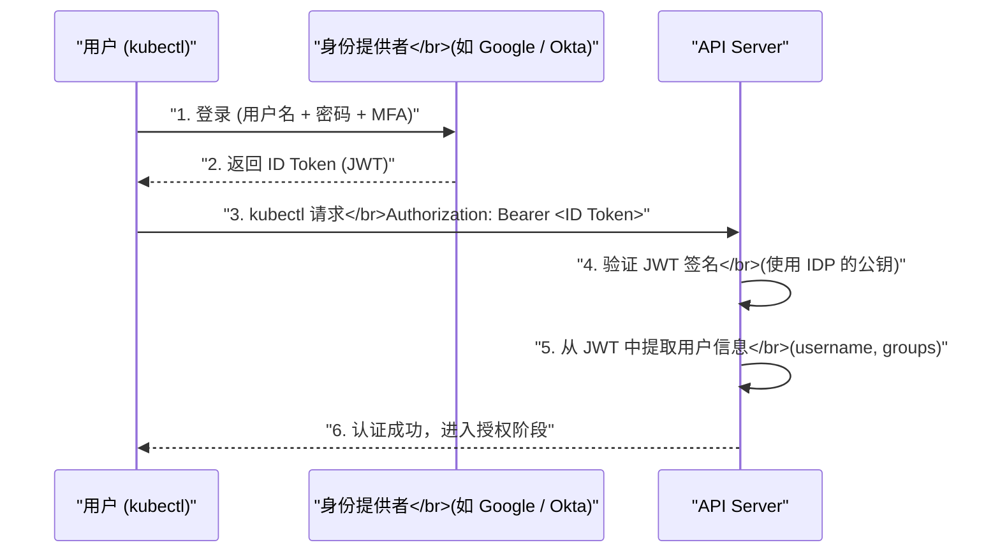

# 02 认证机制深度解析

**摘要：**

在 [[01 API Server 的角色与整体架构]] 中我们看到，认证（Authentication）是 API Server 请求处理管线的第一道安全关卡——它回答一个根本问题："这个请求是谁发出的？"K8s 集群中有多种类型的请求者：运维人员用 kubectl 操作集群、CI/CD 系统自动化部署应用、Pod 中的业务代码调用 K8s API、kubelet 向 API Server 汇报节点状态、Controller Manager 协调资源。每种请求者的身份验证方式不同——人类用户可能通过公司的统一身份系统（OIDC）认证，Pod 使用自动挂载的 ServiceAccount Token，kubelet 使用客户端证书。本文系统梳理 K8s 支持的六种认证机制——X.509 客户端证书、静态 Token、Bootstrap Token、ServiceAccount Token（从 Legacy 到 Bound Token 的演进）、OIDC 集成、Webhook Token Review——分析每种机制的工作原理、适用场景和安全边界，然后深入认证链的执行逻辑和认证结果（UserInfo）的结构。

---

## 第 1 章 认证的基本概念

### 1.1 K8s 中的"用户"

K8s 的认证体系中有两类"用户"：

**普通用户（Normal User）**：人类操作者或外部系统。K8s **不存储普通用户的信息**——它没有 `User` 这种 API 对象。普通用户的身份信息完全由外部系统管理（如企业的 LDAP、OIDC 身份提供者、客户端证书的 CA）。API Server 只负责验证"这个请求携带的凭证是否有效"，不负责管理用户的创建、删除和密码。

**ServiceAccount（服务账户）**：K8s 内部管理的身份，专为 Pod 中运行的程序设计。ServiceAccount 是一种 K8s API 对象（`v1/ServiceAccount`），存储在 etcd 中，可以通过 `kubectl create serviceaccount` 创建。每个 Namespace 都有一个默认的 ServiceAccount（`default`），Pod 如果没有指定 ServiceAccount，就使用它。

这种"不管理普通用户"的设计是刻意的——K8s 不想成为又一个身份管理系统。企业通常已经有成熟的身份管理基础设施（Active Directory、Okta、Google Workspace），K8s 通过 OIDC 或 Webhook 集成这些系统，而不是重新发明一套。

### 1.2 认证链的执行逻辑

API Server 启动时根据配置初始化一系列认证器（Authenticator），组成**认证链（Authentication Chain）**。当请求到达时，按配置顺序依次调用每个认证器：

```
请求到达
  → X.509 客户端证书认证器：检查 TLS 证书 → 失败（没有客户端证书）
  → Bearer Token 认证器：检查 Authorization Header → 失败（没有 Bearer Token）
  → ServiceAccount Token 认证器：检查 Authorization Header → 成功！
  → 返回 UserInfo{User: "system:serviceaccount:default:my-app", Groups: ["system:serviceaccounts", ...]}
```

**规则**：
- 任意一个认证器返回成功，认证通过，请求带上 UserInfo 进入下一阶段
- 如果所有认证器都返回"不是我负责的凭证类型"（not applicable），且启用了匿名认证，请求以 `system:anonymous` 身份通过
- 如果所有认证器都拒绝且未启用匿名认证，返回 401 Unauthorized

### 1.3 认证结果：UserInfo

认证成功后，认证器返回一个 **UserInfo** 对象，包含以下信息：

| 字段 | 说明 | 示例 |
| :--- | :--- | :--- |
| **Username** | 用户名 | `alice`、`system:serviceaccount:default:my-app` |
| **UID** | 用户唯一标识 | `abc-123-def` |
| **Groups** | 所属组列表 | `["developers", "system:authenticated"]` |
| **Extra** | 额外信息（键值对）| `{"scopes": ["profile", "email"]}` |

这个 UserInfo 会被传递给授权阶段（RBAC 根据 Username 和 Groups 判断权限）和审计日志（记录操作者身份）。

---

## 第 2 章 X.509 客户端证书认证

### 2.1 工作原理

X.509 客户端证书认证是 K8s **最基础的认证方式**——它利用 TLS 双向认证（mTLS）：客户端在 TLS 握手阶段向 API Server 出示由受信任 CA 签发的客户端证书，API Server 验证证书的有效性后，从证书的 Subject 字段中提取用户信息。

```
证书 Subject:
  CN (Common Name) = alice          → Username = "alice"
  O  (Organization) = developers    → Groups = ["developers"]
  O  (Organization) = team-backend  → Groups 追加 "team-backend"
```

**CN（Common Name）** 映射为 Username，**O（Organization）** 映射为 Groups（可以有多个 O 字段，每个映射为一个 Group）。

### 2.2 K8s 内部组件的证书认证

K8s 控制平面的内部组件（kubelet、Scheduler、Controller Manager）默认使用客户端证书与 API Server 通信。kubeadm 在初始化集群时自动生成这些证书：

| 组件 | 证书 CN | 证书 O | 认证后的身份 |
| :--- | :--- | :--- | :--- |
| **kube-scheduler** | `system:kube-scheduler` | `system:kube-scheduler` | 用户 `system:kube-scheduler`，组 `system:kube-scheduler` |
| **kube-controller-manager** | `system:kube-controller-manager` | `system:kube-controller-manager` | 用户 `system:kube-controller-manager` |
| **kubelet** | `system:node:<node-name>` | `system:nodes` | 用户 `system:node:worker-1`，组 `system:nodes` |
| **kube-proxy** | `system:kube-proxy` | `system:node-proxier` | 用户 `system:kube-proxy` |
| **admin (kubeconfig)** | `kubernetes-admin` | `system:masters` | 用户 `kubernetes-admin`，组 `system:masters` |

`system:masters` 组在 K8s 中拥有**超级管理员权限**——RBAC 中内置了一个 ClusterRoleBinding 将 `system:masters` 组绑定到 `cluster-admin` ClusterRole。因此 kubeadm 生成的 admin kubeconfig（其证书 O=system:masters）拥有集群的最高权限。

> [!warning] 证书安全
> 客户端证书一旦签发就无法吊销（K8s 不检查 CRL 或 OCSP）。如果一个证书泄露了，你无法使它失效——只能等它自然过期。因此：
> - 客户端证书应设置较短的有效期（如 1 年）
> - admin 证书（system:masters 权限）应妥善保管，不要分发给多人
> - 生产环境推荐使用 OIDC 进行人类用户认证（支持 Token 吊销），而非客户端证书

### 2.3 如何生成客户端证书

```bash
# 1. 生成私钥
openssl genrsa -out alice.key 2048

# 2. 生成证书签名请求 (CSR)
openssl req -new -key alice.key -out alice.csr \
  -subj "/CN=alice/O=developers/O=team-backend"

# 3. 使用 K8s CA 签发证书
openssl x509 -req -in alice.csr \
  -CA /etc/kubernetes/pki/ca.crt \
  -CAkey /etc/kubernetes/pki/ca.key \
  -CAcreateserial \
  -out alice.crt -days 365

# 4. 配置 kubeconfig
kubectl config set-credentials alice \
  --client-certificate=alice.crt \
  --client-key=alice.key
```

K8s 还提供了 **CertificateSigningRequest (CSR)** API——允许用户通过 API 提交 CSR，由集群管理员审批后签发证书。这是一种更安全的证书分发方式——不需要直接访问 CA 私钥。

---

## 第 3 章 ServiceAccount Token 认证

### 3.1 ServiceAccount 的设计目的

**ServiceAccount 是为 Pod 中运行的程序设计的身份机制。** Pod 中的应用代码经常需要调用 K8s API——例如一个 Operator 需要 Watch CRD 资源、一个 CI/CD Runner 需要创建 Deployment。这些应用需要一个身份来通过 API Server 的认证。

你不能给每个 Pod 分发一个人类用户的证书——这既不安全（Pod 可能被攻破导致证书泄露）也不可管理（数千个 Pod 各需要一个证书）。ServiceAccount 提供了一种自动化的、Pod 级别的身份机制。

### 3.2 Legacy Token（静态长期 Token）

在 K8s 1.24 之前，每个 ServiceAccount 创建时会自动生成一个 **Secret**（类型 `kubernetes.io/service-account-token`），其中包含一个永不过期的 JWT Token。这个 Secret 被自动挂载到使用该 ServiceAccount 的 Pod 的 `/var/run/secrets/kubernetes.io/serviceaccount/token` 路径。

```bash
# Pod 内读取 Token
cat /var/run/secrets/kubernetes.io/serviceaccount/token
# eyJhbGciOiJSUzI1NiIsImtpZCI6Ii0tLS0...（JWT Token）
```

Pod 内的应用程序读取这个 Token，在 HTTP 请求中携带 `Authorization: Bearer <token>` 与 API Server 通信。API Server 验证 JWT 的签名后，从 Token 的 payload 中提取 ServiceAccount 信息。

**Legacy Token 的安全问题**：

- **永不过期**：Token 一旦生成就永久有效——即使 Pod 已经被删除，Token 仍然可以使用。如果 Token 泄露，攻击者可以永久使用它
- **无绑定**：Token 不绑定到特定的 Pod——任何人拿到这个 Token 都可以冒充该 ServiceAccount
- **无受众限制**：Token 没有指定目标受众（Audience）——可以用于任何 API Server，增加了滥用风险

### 3.3 Bound ServiceAccount Token（K8s 1.22+）

为了解决 Legacy Token 的安全问题，K8s 引入了 **Bound ServiceAccount Token**——通过 **TokenRequest API** 签发的短期、绑定、有受众限制的 JWT Token。

**关键改进**：

| 维度 | Legacy Token | Bound Token |
| :--- | :--- | :--- |
| **生命周期** | 永不过期 | 默认 1 小时，自动轮换 |
| **绑定** | 不绑定 Pod | 绑定到特定的 Pod（Pod 删除后 Token 失效）|
| **受众** | 无限制 | 指定目标受众（默认 `https://kubernetes.default.svc`）|
| **存储** | 存储在 Secret 中 | 不存储，由 kubelet 通过 TokenRequest API 动态获取 |

kubelet 在创建 Pod 时，通过 TokenRequest API 向 API Server 请求一个 Bound Token，然后通过 projected volume 挂载到 Pod 中。Token 接近过期时，kubelet 自动请求新的 Token 并更新挂载——对 Pod 中的应用完全透明。

```yaml
# K8s 1.22+ 自动为 Pod 配置 Projected Volume
spec:
  containers:
    - name: app
      volumeMounts:
        - name: kube-api-access
          mountPath: /var/run/secrets/kubernetes.io/serviceaccount
  volumes:
    - name: kube-api-access
      projected:
        sources:
          - serviceAccountToken:
              expirationSeconds: 3607    # Token 有效期
              path: token
          - configMap:
              name: kube-root-ca.crt     # CA 证书
              items:
                - key: ca.crt
                  path: ca.crt
          - downwardAPI:
              items:
                - path: namespace
                  fieldRef:
                    fieldPath: metadata.namespace
```

> [!info] 从 Legacy 到 Bound 的迁移
> K8s 1.24 起不再自动为 ServiceAccount 创建 Secret。1.22-1.23 同时支持 Legacy 和 Bound Token。如果你的应用代码直接读取 `/var/run/secrets/kubernetes.io/serviceaccount/token`，迁移到 Bound Token 通常是无感的——文件路径不变，只是 Token 的内容和有效期变了。但如果你的代码从 Secret 中读取 Token（如 `kubectl get secret <sa-secret> -o jsonpath=...`），需要改为使用 TokenRequest API。

---

## 第 4 章 OIDC 认证

### 4.1 为什么需要 OIDC

客户端证书适合 K8s 内部组件（kubelet、Scheduler），但不适合人类用户的日常操作：

- 证书签发和分发需要手动操作（或搭建内部 PKI）
- 证书无法吊销——泄露后只能等过期
- 证书不支持多因素认证（MFA）
- 每个用户需要独立的证书——管理成本高

大多数企业已经有统一的身份管理系统（如 Google Workspace、Azure AD、Okta、Keycloak），员工通过这些系统登录各种内部服务。**OIDC（OpenID Connect）** 认证允许 K8s 集成这些现有的身份系统——用户通过企业身份系统登录后获得 ID Token，然后在 kubectl 中使用该 Token 访问 K8s API。

### 4.2 OIDC 认证流程



**关键配置**：

```bash
# API Server 启动参数
--oidc-issuer-url=https://accounts.google.com     # 身份提供者的 URL
--oidc-client-id=my-k8s-cluster                    # 客户端 ID
--oidc-username-claim=email                         # JWT 中哪个字段作为 Username
--oidc-groups-claim=groups                          # JWT 中哪个字段作为 Groups
--oidc-username-prefix=oidc:                        # Username 前缀（避免冲突）
--oidc-groups-prefix=oidc:                          # Groups 前缀
```

API Server 在验证 ID Token 时：

1. 验证 JWT 的签名（使用身份提供者的公钥，通过 JWKS 端点获取）
2. 验证 `iss`（issuer）字段是否匹配配置的 `--oidc-issuer-url`
3. 验证 `aud`（audience）字段是否包含配置的 `--oidc-client-id`
4. 验证 Token 是否过期（`exp` 字段）
5. 从配置的 claim 字段中提取 Username 和 Groups

### 4.3 kubectl 的 OIDC 集成

kubectl 不直接处理 OIDC 登录流程——它通过 **credential plugin** 或 **auth provider** 获取 ID Token。

推荐的方式是使用 **kubelogin**（`kubectl-oidc_login`）插件：

```yaml
# kubeconfig 配置
users:
  - name: alice
    user:
      exec:
        apiVersion: client.authentication.k8s.io/v1beta1
        command: kubectl
        args:
          - oidc-login
          - get-token
          - --oidc-issuer-url=https://accounts.google.com
          - --oidc-client-id=my-k8s-cluster
          - --oidc-client-secret=<secret>
```

执行 `kubectl get pods` 时，kubectl 调用 kubelogin 插件，插件打开浏览器让用户登录身份提供者，获取 ID Token 后返回给 kubectl，kubectl 将 Token 放入 HTTP Header 发送给 API Server。

> [!note] OIDC 的优势
> OIDC 是生产环境中人类用户认证的**推荐方式**：
> - **集中式身份管理**：用户的创建、删除、密码策略、MFA 由企业身份系统统一管理
> - **Token 短期有效**：ID Token 通常 1 小时过期——泄露后影响范围有限
> - **支持 Token 刷新**：Refresh Token 可以在 ID Token 过期时自动获取新的 Token
> - **支持吊销**：删除身份提供者中的用户或 Session 后，新的 Token 无法签发

---

## 第 5 章 Webhook Token Review

### 5.1 工作原理

**Webhook Token Review** 允许 API Server 将 Token 验证委托给外部的 Webhook 服务。API Server 收到 Bearer Token 后，将 Token 发送给配置的 Webhook 服务，Webhook 服务返回认证结果（成功/失败，以及 UserInfo）。

```yaml
# Webhook 认证配置文件
apiVersion: v1
kind: Config
clusters:
  - name: auth-webhook
    cluster:
      server: https://auth-service.internal:8443/authenticate
      certificate-authority: /etc/kubernetes/pki/webhook-ca.crt
users:
  - name: apiserver
    user:
      client-certificate: /etc/kubernetes/pki/apiserver.crt
      client-key: /etc/kubernetes/pki/apiserver.key
```

API Server 向 Webhook 服务发送 **TokenReview** 请求：

```json
{
  "apiVersion": "authentication.k8s.io/v1",
  "kind": "TokenReview",
  "spec": {
    "token": "eyJhbGciOiJSUzI1NiIs..."
  }
}
```

Webhook 服务验证 Token 后返回：

```json
{
  "apiVersion": "authentication.k8s.io/v1",
  "kind": "TokenReview",
  "status": {
    "authenticated": true,
    "user": {
      "username": "alice@company.com",
      "uid": "12345",
      "groups": ["developers", "team-backend"]
    }
  }
}
```

### 5.2 适用场景

Webhook Token Review 适用于企业已有自定义的 Token 验证服务（如基于内部 IAM 系统的 Token 签发），且不使用标准的 OIDC 协议的场景。它提供了最大的灵活性——Webhook 服务可以实现任意的 Token 验证逻辑。

缺点是每个请求都需要调用一次 Webhook（虽然 API Server 有缓存可以减少调用频率），增加了认证延迟和外部依赖。

---

## 第 6 章 Bootstrap Token

### 6.1 设计目的

**Bootstrap Token** 是一种特殊的短期 Token，专为**节点加入集群**的场景设计。当你使用 `kubeadm join` 将一个新的 Worker 节点加入集群时，该节点的 kubelet 还没有自己的客户端证书——它需要一个临时凭证来向 API Server 请求证书签发（CSR）。

Bootstrap Token 就是这个"入门凭证"——它的权限被严格限制为"只能提交 CSR 请求"，有效期很短（默认 24 小时），用完即弃。

### 6.2 工作流程

```
1. 管理员在 Master 上生成 Bootstrap Token
   kubeadm token create → 输出 "abcdef.0123456789abcdef"

2. 管理员将 Token 传递给新节点
   kubeadm join <master-ip>:6443 --token abcdef.0123456789abcdef

3. 新节点的 kubelet 使用 Bootstrap Token 向 API Server 认证
   → 认证后身份为 system:bootstrap:<token-id>

4. kubelet 提交 CSR（Certificate Signing Request）

5. Controller Manager 自动批准 CSR（或管理员手动批准）

6. kubelet 获得客户端证书，后续使用证书认证
   → Bootstrap Token 不再需要
```

Bootstrap Token 存储在 `kube-system` Namespace 的 Secret 中（名称格式 `bootstrap-token-<token-id>`）。

---

## 第 7 章 匿名认证与认证策略选型

### 7.1 匿名认证

如果所有认证器都没有认证成功，且 API Server 启用了匿名认证（默认启用），请求以 `system:anonymous` 用户、`system:unauthenticated` 组的身份继续。

匿名用户默认几乎没有权限——RBAC 中没有为 `system:anonymous` 绑定任何 Role。但某些公开端点（如 `/healthz`、`/readyz`）允许匿名访问。

生产环境中可以通过 `--anonymous-auth=false` 禁用匿名认证——所有请求必须通过认证，否则返回 401。

### 7.2 认证策略选型

| 场景 | 推荐的认证方式 |
| :--- | :--- |
| **K8s 内部组件**（kubelet、Scheduler、Controller Manager）| X.509 客户端证书（kubeadm 自动配置）|
| **Pod 中的应用调用 K8s API** | ServiceAccount Bound Token（自动挂载）|
| **人类用户日常操作**（kubectl）| OIDC（集成企业身份系统）|
| **CI/CD 系统** | ServiceAccount Token（通过 TokenRequest API 签发短期 Token）|
| **节点加入集群** | Bootstrap Token |
| **自定义认证逻辑** | Webhook Token Review |

---

## 第 8 章 总结

本文系统梳理了 K8s 的认证体系：

- **两类用户**：普通用户（K8s 不管理，由外部系统管理）和 ServiceAccount（K8s 内部管理，为 Pod 设计）
- **认证链**：多种认证方式组成链条，任一方式成功即通过
- **X.509 证书**：TLS 双向认证，CN→Username，O→Groups。K8s 内部组件的默认认证方式，但无法吊销
- **ServiceAccount Token**：从永不过期的 Legacy Token 演进到短期、绑定 Pod、有受众限制的 Bound Token（1.22+）
- **OIDC**：集成企业身份系统的推荐方式，支持 MFA、Token 吊销、集中管理
- **Webhook**：最大灵活性，将 Token 验证委托给外部服务
- **Bootstrap Token**：节点加入集群的临时凭证，用完即弃

下一篇 [[03 授权机制——RBAC 深度解析]] 将深入认证之后的"第二道关卡"——RBAC 授权模型。

---

## 参考资料

1. Kubernetes Documentation - Authenticating：https://kubernetes.io/docs/reference/access-authn-authz/authentication/
2. Kubernetes Documentation - Service Accounts：https://kubernetes.io/docs/concepts/security/service-accounts/
3. Kubernetes Enhancement Proposal - Bound Service Account Tokens：https://github.com/kubernetes/enhancements/tree/master/keps/sig-auth/1205-bound-service-account-tokens
4. Kubernetes Documentation - Bootstrap Tokens：https://kubernetes.io/docs/reference/access-authn-authz/bootstrap-tokens/
5. OpenID Connect Specification：https://openid.net/specs/openid-connect-core-1_0.html
6. Kubernetes Documentation - Webhook Token Authentication：https://kubernetes.io/docs/reference/access-authn-authz/authentication/#webhook-token-authentication
