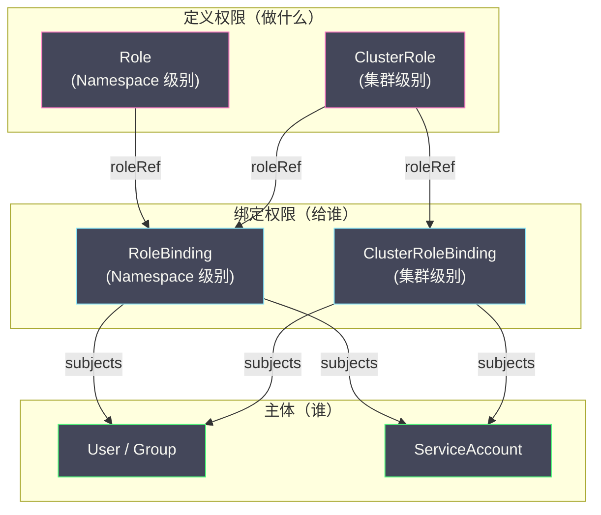

# 03 授权机制——RBAC 深度解析

**摘要：**

[[02 认证机制深度解析|认证]]回答了"你是谁"，**授权（Authorization）** 回答"你能做什么"。一个已认证的用户并不意味着可以在集群中为所欲为——API Server 必须检查该用户是否有权限执行请求的操作。K8s 支持多种授权模式，其中 **RBAC（Role-Based Access Control，基于角色的访问控制）** 是事实上的标准——几乎所有生产集群都使用 RBAC 作为唯一的授权模式。RBAC 的核心思想是：不直接给用户分配权限，而是定义**角色（Role）**——一组权限的集合，然后将角色**绑定（Binding）** 到用户或组。本文从 RBAC 的四个核心对象（Role / ClusterRole / RoleBinding / ClusterRoleBinding）出发，深入分析权限的粒度模型（verbs × resources × namespace）、内置角色体系、Node 授权器的特殊设计，以及最小权限原则在 K8s 中的落地实践。

---

## 第 1 章 授权的基本模型

### 1.1 授权决策的输入

当一个已认证的请求到达授权阶段时，API Server 需要判断以下信息的组合是否被允许：

| 属性 | 说明 | 示例 |
| :--- | :--- | :--- |
| **User** | 请求者的用户名（来自认证阶段）| `alice`、`system:serviceaccount:default:my-app` |
| **Groups** | 请求者所属的组 | `["developers", "system:authenticated"]` |
| **Verb** | 操作类型 | `get`、`list`、`watch`、`create`、`update`、`patch`、`delete` |
| **Resource** | 操作的资源类型 | `pods`、`deployments`、`secrets` |
| **Subresource** | 子资源 | `status`、`log`、`exec` |
| **Namespace** | 资源所在的 Namespace | `default`、`kube-system` |
| **API Group** | 资源所属的 API 组 | `""`（core）、`apps`、`batch` |
| **Resource Name** | 特定资源的名称（可选）| `nginx`、`my-secret` |

授权器根据这些属性做出三种决策之一：**Allow（允许）**、**Deny（拒绝）**、**NoOpinion（无意见）**。

### 1.2 授权链的执行逻辑

API Server 可以配置多个授权器，形成**授权链**。请求按顺序通过每个授权器：

- 如果任一授权器返回 **Allow**，请求通过，不再检查后续授权器
- 如果任一授权器返回 **Deny**，请求被拒绝（403 Forbidden）
- 如果返回 **NoOpinion**，继续检查下一个授权器
- 如果所有授权器都返回 NoOpinion，请求被拒绝

典型的授权链配置：`--authorization-mode=Node,RBAC`——先检查 Node 授权器（专门处理 kubelet 请求），如果 Node 授权器返回 NoOpinion（不是 kubelet 发的请求），再检查 RBAC 授权器。

---

## 第 2 章 RBAC 的四个核心对象

### 2.1 Role 与 ClusterRole

**Role** 定义了一组权限——"可以对哪些资源执行哪些操作"。Role 是 **Namespace 级别**的——它定义的权限只在特定 Namespace 内有效。

```yaml
apiVersion: rbac.authorization.k8s.io/v1
kind: Role
metadata:
  namespace: default
  name: pod-reader
rules:
  - apiGroups: [""]           # core 组
    resources: ["pods"]        # 资源类型
    verbs: ["get", "list", "watch"]  # 允许的操作
```

这个 Role 表示："在 default Namespace 中，可以 get/list/watch Pod"。

**ClusterRole** 与 Role 的结构完全相同，但它是**集群级别**的——定义的权限可以应用于所有 Namespace，也可以应用于集群级资源（如 Node、PersistentVolume、ClusterRole 本身——这些资源不属于任何 Namespace）。

```yaml
apiVersion: rbac.authorization.k8s.io/v1
kind: ClusterRole
metadata:
  name: node-reader
rules:
  - apiGroups: [""]
    resources: ["nodes"]       # Node 是集群级资源
    verbs: ["get", "list", "watch"]
  - apiGroups: [""]
    resources: ["pods"]        # Pod 是 Namespace 级资源
    verbs: ["get", "list"]     # ClusterRole 绑定后可跨所有 Namespace 生效
```

**何时用 Role，何时用 ClusterRole？**

| 场景 | 使用 |
| :--- | :--- |
| 权限只在一个 Namespace 内 | Role |
| 权限需要跨多个 Namespace（如"读取所有 Namespace 的 Pod"）| ClusterRole + ClusterRoleBinding |
| 操作的是集群级资源（Node、PV、Namespace）| ClusterRole |
| 定义可复用的权限模板（在多个 Namespace 中复用）| ClusterRole + 每个 Namespace 一个 RoleBinding |

### 2.2 RoleBinding 与 ClusterRoleBinding

Role/ClusterRole 只定义了权限，但没有指定"谁拥有这些权限"。**Binding** 将角色绑定到**主体（Subject）**——用户、组或 ServiceAccount。

**RoleBinding** 将角色绑定到特定 Namespace 内的主体：

```yaml
apiVersion: rbac.authorization.k8s.io/v1
kind: RoleBinding
metadata:
  name: read-pods
  namespace: default
subjects:
  - kind: User
    name: alice
    apiGroup: rbac.authorization.k8s.io
  - kind: Group
    name: developers
    apiGroup: rbac.authorization.k8s.io
  - kind: ServiceAccount
    name: my-app
    namespace: default
roleRef:
  kind: Role
  name: pod-reader
  apiGroup: rbac.authorization.k8s.io
```

这个 RoleBinding 表示："在 default Namespace 中，用户 alice、developers 组的所有成员、以及 ServiceAccount default/my-app 都拥有 pod-reader 角色定义的权限（get/list/watch Pod）"。

**ClusterRoleBinding** 将 ClusterRole 绑定到集群范围内的主体——权限在所有 Namespace 中生效：

```yaml
apiVersion: rbac.authorization.k8s.io/v1
kind: ClusterRoleBinding
metadata:
  name: read-all-pods
subjects:
  - kind: Group
    name: sre-team
    apiGroup: rbac.authorization.k8s.io
roleRef:
  kind: ClusterRole
  name: pod-reader
  apiGroup: rbac.authorization.k8s.io
```

### 2.3 四个对象的关系图



**一个容易混淆的组合**：**ClusterRole + RoleBinding**。这意味着用 ClusterRole 定义一套可复用的权限模板，然后通过 RoleBinding 将其绑定到特定 Namespace。效果是主体只在该 Namespace 内拥有 ClusterRole 定义的权限——而不是在所有 Namespace 中。这是权限模板复用的常见模式。

---

## 第 3 章 权限的粒度控制

### 3.1 Verbs：操作类型

K8s 定义了以下标准操作类型：

| Verb | HTTP 方法 | 说明 |
| :--- | :--- | :--- |
| `get` | GET（单个对象）| 获取指定名称的对象 |
| `list` | GET（集合）| 获取某类资源的所有对象 |
| `watch` | GET + `?watch=true` | 长连接监听资源变化 |
| `create` | POST | 创建新对象 |
| `update` | PUT | 整体更新对象 |
| `patch` | PATCH | 部分更新对象 |
| `delete` | DELETE（单个）| 删除指定对象 |
| `deletecollection` | DELETE（集合）| 批量删除 |

**特殊 Verb**：

- `impersonate`：身份模拟（见 [[01 API Server 的角色与整体架构]]）
- `bind`：创建 RoleBinding/ClusterRoleBinding 时引用 Role
- `escalate`：修改 Role/ClusterRole 使其包含当前用户没有的权限

### 3.2 Resources 与 Subresources

权限可以精确到**子资源（Subresource）** 级别。例如 Pod 有多个子资源：

```yaml
rules:
  - apiGroups: [""]
    resources: ["pods"]          # Pod 本身的 CRUD
    verbs: ["get", "list"]
  - apiGroups: [""]
    resources: ["pods/log"]      # Pod 的日志（kubectl logs）
    verbs: ["get"]
  - apiGroups: [""]
    resources: ["pods/exec"]     # Pod 的 exec（kubectl exec）
    verbs: ["create"]            # exec 使用 create verb
  - apiGroups: [""]
    resources: ["pods/status"]   # Pod 的 status 子资源
    verbs: ["get"]
```

**`pods/exec` 的权限控制尤为重要**——`kubectl exec` 允许用户在容器内执行任意命令，等同于 SSH 进入容器。在生产环境中应严格限制谁拥有 `pods/exec` 权限。

### 3.3 Resource Names：精确到具体对象

默认情况下，权限应用于指定类型的**所有**对象。如果需要限制到特定名称的对象，可以使用 `resourceNames`：

```yaml
rules:
  - apiGroups: [""]
    resources: ["secrets"]
    resourceNames: ["db-password"]   # 只能访问名为 db-password 的 Secret
    verbs: ["get"]
```

`resourceNames` 对 `list`、`watch`、`create` 操作无效——你无法限制"只能 list 名为 X 的资源"（list 本身就是列出所有），也无法限制"只能创建名为 X 的资源"（创建时名称由用户指定）。`resourceNames` 主要用于 `get`、`update`、`patch`、`delete` 操作。

### 3.4 Non-Resource URL

除了 K8s API 资源，API Server 还暴露了一些非资源 URL（如 `/healthz`、`/metrics`、`/openapi/v3`）。RBAC 可以控制这些 URL 的访问：

```yaml
apiVersion: rbac.authorization.k8s.io/v1
kind: ClusterRole
metadata:
  name: metrics-reader
rules:
  - nonResourceURLs: ["/metrics"]
    verbs: ["get"]
```

---

## 第 4 章 内置角色与系统角色

### 4.1 面向用户的内置 ClusterRole

K8s 预定义了四个面向用户的 ClusterRole：

| ClusterRole | 权限范围 | 适用场景 |
| :--- | :--- | :--- |
| **cluster-admin** | 所有资源的所有操作（超级管理员）| 集群管理员 |
| **admin** | 一个 Namespace 内的大部分资源的所有操作（不含 ResourceQuota 和 Namespace 本身）| Namespace 管理员 |
| **edit** | 一个 Namespace 内的大部分资源的读写（不含 Role/RoleBinding）| 开发者 |
| **view** | 一个 Namespace 内的大部分资源的只读（不含 Secret）| 只读查看者 |

**`view` 角色不包含 Secret 的读取权限**——这是一个刻意的安全设计。Secret 可能包含数据库密码、API 密钥等敏感信息，即使"只读"权限也不应该随意授予。如果需要读取 Secret，应该显式授权。

### 4.2 系统组件的内置角色

K8s 为每个系统组件预定义了精确的角色：

| 组件 | 用户名 | 绑定的 ClusterRole |
| :--- | :--- | :--- |
| **kube-scheduler** | `system:kube-scheduler` | `system:kube-scheduler`（可读 Pod/Node，可更新 Pod 的 nodeName）|
| **kube-controller-manager** | `system:kube-controller-manager` | `system:kube-controller-manager`（可管理各类资源）|
| **kube-proxy** | `system:kube-proxy` | `system:node-proxier`（可读 Service/Endpoints/Node）|
| **kubelet** | `system:node:<node-name>` | 由 Node 授权器处理（见下文）|

这些内置角色遵循**最小权限原则**——每个组件只拥有它工作所需的最小权限集。Scheduler 只能读取 Pod 和 Node、更新 Pod 的调度结果——它不能读取 Secret、不能创建 Deployment、不能修改 RBAC 规则。

### 4.3 system:masters 组

`system:masters` 是一个特殊的组——绑定了 `cluster-admin` ClusterRole，拥有集群的**完全控制权**。kubeadm 生成的管理员证书（O=system:masters）就属于这个组。

> [!warning] system:masters 的风险
> `system:masters` 的权限**不受 RBAC 限制**——即使你删除了 `cluster-admin` 的 ClusterRoleBinding，`system:masters` 仍然拥有所有权限。这是因为 API Server 内部对 `system:masters` 有硬编码的特殊处理。因此：
> - 不要将 `system:masters` 组授予普通用户
> - kubeadm 的 admin kubeconfig 应严格保管
> - 日常操作应使用权限受限的用户身份，而非 admin

---

## 第 5 章 Node 授权器

### 5.1 为什么需要专门的 Node 授权器

kubelet 需要访问大量 API 资源来完成工作：读取分配给自己节点的 Pod、读取 Pod 引用的 Secret 和 ConfigMap、更新 Pod 和 Node 的 status。如果用 RBAC 为 kubelet 定义权限，你会面临一个矛盾：

**用 ClusterRole 授权**：kubelet 可以读取**所有** Namespace 中的**所有** Secret——因为 RBAC 无法表达"只能读取本节点上 Pod 引用的 Secret"这种细粒度约束。这意味着一个被攻破的 kubelet 可以窃取整个集群的所有 Secret。

**Node 授权器**解决了这个问题——它维护了一个**节点到资源的映射图谱**：知道每个节点上运行了哪些 Pod，每个 Pod 引用了哪些 Secret/ConfigMap/PVC。当 kubelet 请求读取一个 Secret 时，Node 授权器检查"这个 Secret 是否被分配到该 kubelet 所在节点上的某个 Pod 引用"——如果是，允许；如果不是，拒绝。

### 5.2 Node 授权器的工作条件

Node 授权器只处理满足以下条件的请求：

- 请求者属于 `system:nodes` 组（kubelet 的证书 O=system:nodes）
- 请求者的用户名格式为 `system:node:<node-name>`

不满足条件的请求，Node 授权器返回 NoOpinion，由后续的 RBAC 授权器处理。

### 5.3 NodeRestriction 准入控制器

Node 授权器配合 **NodeRestriction** 准入控制器一起使用——后者进一步限制 kubelet 只能修改自己节点上的 Node 对象和 Pod 的 status，不能修改其他节点的资源。两者组合实现了"每个 kubelet 只能访问和修改自己节点上的资源"的安全隔离。

---

## 第 6 章 RBAC 最佳实践

### 6.1 最小权限原则

**永远从零权限开始，按需添加。** 不要从 `cluster-admin` 开始然后"减去不需要的权限"——应该从空 Role 开始，逐一添加应用实际需要的权限。

```yaml
# 正确示范：只授予 Operator 实际需要的权限
apiVersion: rbac.authorization.k8s.io/v1
kind: Role
metadata:
  namespace: production
  name: my-operator
rules:
  - apiGroups: ["apps"]
    resources: ["deployments"]
    verbs: ["get", "list", "watch", "update", "patch"]
  - apiGroups: [""]
    resources: ["pods"]
    verbs: ["get", "list", "watch"]
  - apiGroups: [""]
    resources: ["events"]
    verbs: ["create"]
```

### 6.2 使用 Group 而非 User 绑定

将角色绑定到 **Group** 而非单个 User——方便批量管理。当新成员加入团队时，只需在身份系统（OIDC）中将其加入对应的组，不需要修改 K8s 的 RoleBinding。

```yaml
# 推荐：绑定到组
subjects:
  - kind: Group
    name: backend-developers
    apiGroup: rbac.authorization.k8s.io

# 不推荐：逐个绑定用户
subjects:
  - kind: User
    name: alice
  - kind: User
    name: bob
  - kind: User
    name: charlie
```

### 6.3 审查权限

定期审查集群中的 RBAC 配置，识别过度授权：

```bash
# 查看某个用户的权限
kubectl auth can-i --list --as=alice -n default

# 检查特定操作是否被允许
kubectl auth can-i create pods -n production --as=alice
# yes / no

# 查看所有 ClusterRoleBinding（关注 cluster-admin 绑定）
kubectl get clusterrolebindings -o wide | grep cluster-admin

# 查看所有 ServiceAccount 的权限
kubectl auth can-i --list --as=system:serviceaccount:default:my-app -n default
```

### 6.4 常见的权限陷阱

**陷阱一：给 ServiceAccount 绑定 cluster-admin**

某些教程为了简单，直接给 Operator 的 ServiceAccount 绑定 `cluster-admin`。这意味着 Operator 中的任何 bug 或安全漏洞都可能被利用来控制整个集群。

**陷阱二：忽视 `escalate` 和 `bind` verb**

如果一个用户拥有修改 Role/ClusterRole 的权限（`update` verb on `roles`），他可能修改自己绑定的 Role 来提升权限（权限提升攻击）。K8s 通过 `escalate` verb 防止这种情况——修改 Role 使其包含当前用户没有的权限需要 `escalate` 权限。

**陷阱三：Secret 权限过于宽泛**

授予 `secrets` 的 `list` 权限意味着可以列出（并读取内容）Namespace 中的所有 Secret。如果只需要读取特定 Secret，应使用 `resourceNames` 限制。

---

## 第 7 章 总结

本文系统梳理了 K8s 的 RBAC 授权体系：

- **四个核心对象**：Role（Namespace 权限）、ClusterRole（集群权限）、RoleBinding（Namespace 绑定）、ClusterRoleBinding（集群绑定）
- **权限粒度**：verbs × apiGroups × resources × subresources × resourceNames × namespace 的组合
- **内置角色**：cluster-admin / admin / edit / view 四级用户角色，以及每个系统组件的专用角色
- **Node 授权器**：为 kubelet 提供细粒度的"只能访问本节点资源"的授权，弥补 RBAC 无法表达的约束
- **最小权限实践**：从零权限开始、绑定 Group 而非 User、定期审查、避免 cluster-admin 滥用

下一篇 [[04 准入控制器深度解析]] 将深入授权之后的"第三道关卡"——准入控制器如何在资源写入 etcd 之前执行策略校验和变更。

---

## 参考资料

1. Kubernetes Documentation - RBAC：https://kubernetes.io/docs/reference/access-authn-authz/rbac/
2. Kubernetes Documentation - Node Authorization：https://kubernetes.io/docs/reference/access-authn-authz/node/
3. Kubernetes Documentation - Using RBAC Authorization：https://kubernetes.io/docs/reference/access-authn-authz/rbac/
4. Kubernetes Security Best Practices - RBAC：https://kubernetes.io/docs/concepts/security/rbac-good-practices/
5. Kubernetes Source - plugin/pkg/auth/authorizer/rbac：https://github.com/kubernetes/kubernetes/tree/master/plugin/pkg/auth/authorizer/rbac
