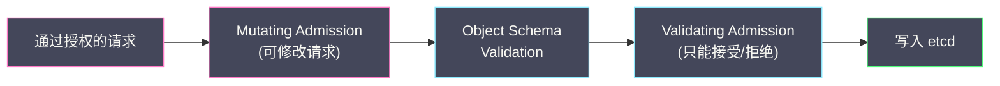
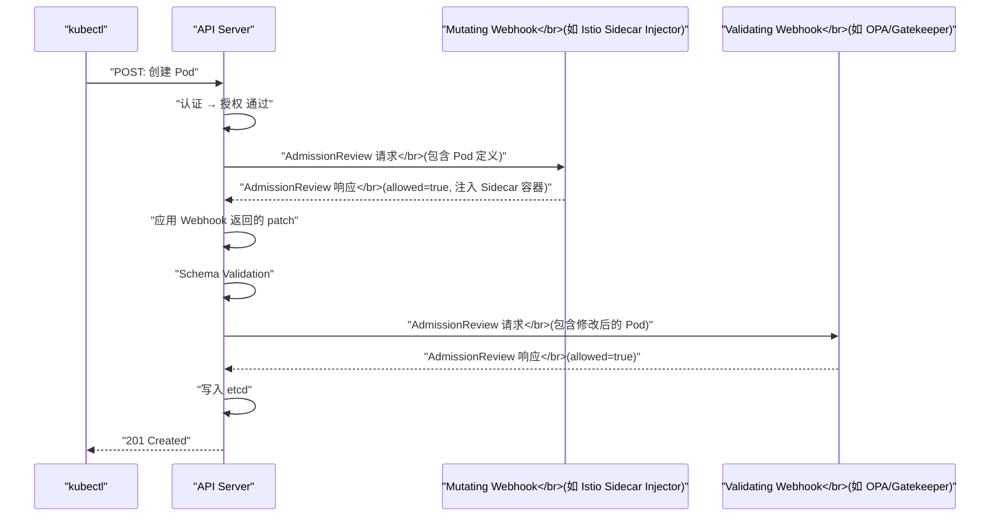

# 04 准入控制器深度解析

**摘要：**

[[02 认证机制深度解析|认证]]确认了"你是谁"，[[03 授权机制——RBAC 深度解析|RBAC]] 判断了"你能做什么"，但这还不够。授权只回答"这个用户是否有权限创建 Pod"，不回答"这个 Pod 的配置是否合规"——例如 Pod 是否设置了资源限制？镜像是否来自受信任的仓库？容器是否以 root 权限运行？这些**策略级别的校验和变更**由 **准入控制器（Admission Controller）** 负责。准入控制是资源写入 [[etcd]] 之前的**最后一道关卡**——它可以修改请求（注入 Sidecar、设置默认值）或拒绝请求（违反安全策略）。本文从内置准入控制器和动态准入控制（Webhook）两个维度展开，深入分析 Mutating 和 Validating 两个阶段的执行逻辑、常用的内置控制器、Webhook 的工作机制和配置方式，以及基于 Webhook 构建的策略引擎（OPA/Gatekeeper、Kyverno）。

---

## 第 1 章 准入控制的定位

### 1.1 认证 → 授权 → 准入控制的关系

在 [[01 API Server 的角色与整体架构]] 中我们介绍了 API Server 的请求处理管线。认证、授权和准入控制是三道逐层递进的安全关卡，它们的职责完全不同：

| 关卡 | 回答的问题 | 示例 |
| :--- | :--- | :--- |
| **认证** | 你是谁？ | "请求者是 alice" |
| **授权** | 你能做什么？ | "alice 可以在 default NS 中创建 Pod" |
| **准入控制** | 这个操作是否合规？需要修改吗？ | "这个 Pod 没有设置 CPU Limit，拒绝"或"自动注入 Istio Sidecar" |

授权是**基于身份的粗粒度控制**——"alice 可以创建 Pod"意味着 alice 可以创建**任何配置**的 Pod。准入控制是**基于内容的细粒度控制**——它检查 Pod 的具体配置（镜像来源、安全上下文、资源请求、标签规范等），在对象级别执行策略。

### 1.2 两个阶段：Mutating 与 Validating

准入控制分为两个阶段，按顺序执行：



**Mutating Admission（变更准入）**：可以**修改**请求中的对象——添加字段、设置默认值、注入容器。修改后的对象会传递给下一个阶段。Mutating 控制器之间**按顺序执行**——因为前一个控制器的修改可能影响后一个控制器的判断。

**Validating Admission（验证准入）**：只能**接受或拒绝**请求，不能修改。如果多个 Validating 控制器同时运行，它们可以**并行执行**——因为它们不会修改对象。所有控制器都接受，请求通过；任一控制器拒绝，请求失败。

为什么不合并为一个阶段？因为 Mutating 控制器修改了对象后，Validating 控制器需要对**修改后的最终版本**进行校验。如果合并，Validating 控制器可能校验的是修改前的版本——遗漏了 Mutating 注入的不合规内容。

### 1.3 准入控制只作用于写操作

准入控制器**只拦截写操作**（create、update、patch、delete）——不拦截读操作（get、list、watch）。这是因为准入控制的目的是"在数据写入 etcd 之前进行校验和变更"——读操作不会修改数据，不需要经过准入控制。

---

## 第 2 章 内置准入控制器

### 2.1 什么是内置准入控制器

内置准入控制器是编译在 API Server 二进制文件中的插件——它们在 API Server 启动时通过 `--enable-admission-plugins` 参数启用。K8s 预定义了数十个内置控制器，覆盖了资源管理、安全策略、默认值设置等场景。

### 2.2 关键的内置控制器

#### NamespaceLifecycle

**作用**：防止在正在被删除的 Namespace 中创建新资源，防止删除系统 Namespace（`default`、`kube-system`、`kube-public`）。

**为什么需要**：当用户删除一个 Namespace 时，K8s 需要清理该 Namespace 中的所有资源。如果在清理过程中有新资源被创建，清理将永远无法完成——Namespace 会一直卡在 "Terminating" 状态。NamespaceLifecycle 控制器通过拒绝向 Terminating 状态的 Namespace 中创建资源来避免这个问题。

#### LimitRanger

**作用**：为没有设置资源请求/限制的 Pod 注入默认值，并验证资源请求是否在 LimitRange 定义的范围内。

**为什么需要**：如果 Pod 没有设置 `resources.requests` 和 `resources.limits`，Scheduler 无法做出合理的调度决策（不知道 Pod 需要多少资源），并且 Pod 可能无限制地消耗节点资源，影响其他 Pod。LimitRange 通过设置默认值和上下限来防止这种情况。

```yaml
apiVersion: v1
kind: LimitRange
metadata:
  name: default-limits
  namespace: production
spec:
  limits:
    - type: Container
      default:              # 默认 Limit
        cpu: "500m"
        memory: "256Mi"
      defaultRequest:       # 默认 Request
        cpu: "100m"
        memory: "128Mi"
      max:                  # 最大 Limit
        cpu: "2"
        memory: "2Gi"
      min:                  # 最小 Request
        cpu: "50m"
        memory: "64Mi"
```

#### ResourceQuota

**作用**：在 Namespace 级别限制资源总量——确保一个 Namespace 不会消耗超过配额的资源。

**为什么需要**：在多租户集群中，如果一个团队的 Namespace 不受限制地创建 Pod，可能耗尽整个集群的资源，影响其他团队。ResourceQuota 通过设置 Namespace 级别的资源上限来实现公平分配。

```yaml
apiVersion: v1
kind: ResourceQuota
metadata:
  name: compute-quota
  namespace: team-backend
spec:
  hard:
    requests.cpu: "10"        # 所有 Pod 的 CPU Request 总和不超过 10 核
    requests.memory: "20Gi"   # 内存 Request 总和不超过 20Gi
    limits.cpu: "20"          # CPU Limit 总和不超过 20 核
    limits.memory: "40Gi"     # 内存 Limit 总和不超过 40Gi
    pods: "50"                # 最多 50 个 Pod
    services: "10"            # 最多 10 个 Service
    secrets: "20"             # 最多 20 个 Secret
```

当用户在 `team-backend` Namespace 中创建 Pod 时，ResourceQuota 准入控制器计算"当前已使用的资源量 + 新 Pod 请求的资源量"是否超过配额——如果超过，拒绝创建。

#### DefaultStorageClass

**作用**：当用户创建 PVC 但没有指定 StorageClass 时，自动注入集群的默认 StorageClass。

**为什么需要**：如果 PVC 没有 StorageClass，K8s 不知道使用哪种存储后端来动态供给 PV。DefaultStorageClass 控制器检查集群中标记为 `storageclass.kubernetes.io/is-default-class: "true"` 的 StorageClass，将其注入到没有指定 StorageClass 的 PVC 中。

#### ServiceAccount

**作用**：为没有指定 ServiceAccount 的 Pod 自动注入默认的 `default` ServiceAccount，并挂载对应的 Token 和 CA 证书。

**为什么需要**：Pod 中的应用可能需要调用 K8s API（即使只是读取自身的配置）。ServiceAccount 准入控制器确保每个 Pod 都有一个身份——即使用户没有显式配置。

#### NodeRestriction

**作用**：限制 kubelet 只能修改自己节点上的 Node 对象和 Pod 的 status。

**为什么需要**：配合 [[03 授权机制——RBAC 深度解析|Node 授权器]]，防止被攻破的 kubelet 修改其他节点的资源——例如将其他节点标记为不健康（NotReady）来触发 Pod 迁移，或者篡改其他 Pod 的 status。

### 2.3 默认启用的控制器

K8s 1.28+ 默认启用的准入控制器（按执行顺序的子集）：

```
NamespaceLifecycle, LimitRanger, ServiceAccount, 
DefaultStorageClass, DefaultTolerationSeconds,
MutatingAdmissionWebhook, ValidatingAdmissionWebhook,
ResourceQuota, Priority, NodeRestriction,
RuntimeClass, TaintNodesByCondition
```

---

## 第 3 章 动态准入控制：Webhook

### 3.1 为什么需要 Webhook

内置准入控制器的局限在于——它们是编译在 API Server 中的，要添加新的控制器必须修改 API Server 源码并重新编译。对于企业特定的策略需求（如"所有镜像必须来自公司内部的镜像仓库"、"所有 Pod 必须带有 cost-center 标签"），修改 API Server 显然不可行。

**动态准入控制（Dynamic Admission Control）** 通过 Webhook 机制解决了这个问题——用户部署一个外部的 Webhook 服务，API Server 在准入控制阶段调用该服务。Webhook 服务接收请求、执行自定义逻辑、返回允许/拒绝/修改的结果。

### 3.2 Webhook 的两种类型

| 类型 | CRD 配置 | 能力 | 执行阶段 |
| :--- | :--- | :--- | :--- |
| **MutatingAdmissionWebhook** | `MutatingWebhookConfiguration` | 可以修改请求中的对象 | Mutating 阶段 |
| **ValidatingAdmissionWebhook** | `ValidatingWebhookConfiguration` | 只能接受或拒绝 | Validating 阶段 |

### 3.3 Webhook 的工作流程



### 3.4 AdmissionReview 请求与响应

API Server 向 Webhook 发送的请求是一个 **AdmissionReview** 对象：

```json
{
  "apiVersion": "admission.k8s.io/v1",
  "kind": "AdmissionReview",
  "request": {
    "uid": "abc-123",
    "kind": {"group": "", "version": "v1", "kind": "Pod"},
    "resource": {"group": "", "version": "v1", "resource": "pods"},
    "namespace": "default",
    "operation": "CREATE",
    "userInfo": {
      "username": "alice",
      "groups": ["developers", "system:authenticated"]
    },
    "object": {
      "apiVersion": "v1",
      "kind": "Pod",
      "metadata": {"name": "nginx", "namespace": "default"},
      "spec": {
        "containers": [{"name": "nginx", "image": "nginx:1.25"}]
      }
    },
    "oldObject": null
  }
}
```

Webhook 返回的响应：

```json
{
  "apiVersion": "admission.k8s.io/v1",
  "kind": "AdmissionReview",
  "response": {
    "uid": "abc-123",
    "allowed": true,
    "patchType": "JSONPatch",
    "patch": "W3sib3AiOiAiYWRkIiwgInBhdGgiOiAi..."
  }
}
```

Mutating Webhook 通过 **JSON Patch** 格式修改对象——patch 字段是 Base64 编码的 JSON Patch 数组。Validating Webhook 不返回 patch——只返回 `allowed: true/false` 和可选的拒绝原因。

### 3.5 Webhook 配置详解

```yaml
apiVersion: admissionregistration.k8s.io/v1
kind: ValidatingWebhookConfiguration
metadata:
  name: image-policy
webhooks:
  - name: validate-image.example.com
    clientConfig:
      service:
        name: image-policy-webhook     # Webhook 服务的 Service 名称
        namespace: kube-system
        path: /validate                 # Webhook 服务的 HTTP 路径
      caBundle: "LS0tLS1CRUdJTi..."    # Webhook 服务的 TLS CA 证书
    rules:
      - operations: ["CREATE", "UPDATE"]
        apiGroups: [""]
        apiVersions: ["v1"]
        resources: ["pods"]
    namespaceSelector:                  # 只拦截带特定标签的 Namespace
      matchLabels:
        policy-enforced: "true"
    failurePolicy: Fail                 # Webhook 不可达时的行为
    timeoutSeconds: 10                  # Webhook 调用超时
    sideEffects: None                   # 声明 Webhook 无副作用
    admissionReviewVersions: ["v1"]
```

**关键配置字段**：

**`rules`**：定义 Webhook 拦截哪些请求——按 operation、apiGroup、apiVersion、resource 过滤。只有匹配 rules 的请求才会被发送给 Webhook。

**`namespaceSelector`**：通过 [[04 Label Selector 与松耦合设计|Label Selector]] 进一步过滤——只拦截来自带有匹配标签的 Namespace 的请求。这允许你在特定 Namespace 中启用策略，而不影响其他 Namespace。

**`failurePolicy`**：当 Webhook 服务不可达（超时、5xx 错误）时的行为：
- **`Fail`**（默认）：拒绝请求——安全优先，但如果 Webhook 服务宕机，所有匹配的请求都会被拒绝
- **`Ignore`**：忽略 Webhook 错误，允许请求通过——可用性优先，但策略不再被强制执行

> [!warning] Webhook 的可用性风险
> 如果 Mutating/Validating Webhook 配置了 `failurePolicy: Fail` 且拦截了核心资源（如 Pod），当 Webhook 服务不可用时，**所有 Pod 创建都会失败**——包括 Webhook 服务自身的 Pod。这会导致"死锁"——Webhook Pod 崩溃后无法重建，因为重建 Pod 的请求被不可用的 Webhook 拒绝。
>
> **防护措施**：
> - Webhook 服务部署多副本，确保高可用
> - 使用 `namespaceSelector` 排除 `kube-system` Namespace——确保系统组件不受 Webhook 影响
> - 对非关键策略使用 `failurePolicy: Ignore`
> - 监控 Webhook 的延迟和错误率

### 3.6 Istio Sidecar Injection：Mutating Webhook 的经典案例

**Istio** 服务网格的 Sidecar 注入是 Mutating Webhook 最广为人知的应用。当用户创建 Pod 时，Istio 的 Mutating Webhook 自动向 Pod 中注入 Envoy Sidecar 容器和 init 容器——用户的 Pod YAML 中不需要包含任何 Istio 相关的配置。

```yaml
# 用户提交的 Pod（2 个容器）
spec:
  containers:
    - name: app
      image: my-app:v1

# 经过 Istio Mutating Webhook 后的 Pod（自动注入了 Sidecar）
spec:
  initContainers:
    - name: istio-init        # 注入的 init 容器（配置 iptables 劫持流量）
      image: istio/proxyv2
  containers:
    - name: app
      image: my-app:v1
    - name: istio-proxy       # 注入的 Sidecar 容器（Envoy 代理）
      image: istio/proxyv2
```

---

## 第 4 章 ValidatingAdmissionPolicy（CEL 原生策略）

### 4.1 Webhook 的痛点

虽然 Webhook 提供了最大的灵活性，但运维成本较高：

- **需要部署独立服务**：每个策略都需要一个运行的 Webhook 服务
- **网络延迟**：API Server → Webhook 服务的网络调用增加了请求延迟
- **可用性风险**：Webhook 服务宕机可能影响集群正常运行
- **开发成本**：编写 Webhook 服务需要实现 HTTP 处理、TLS 配置、AdmissionReview 解析等

对于简单的校验策略（如"Pod 必须有特定标签"、"镜像必须来自指定仓库"），部署一个完整的 Webhook 服务有些大材小用。

### 4.2 ValidatingAdmissionPolicy

K8s 1.30 起 GA 的 **ValidatingAdmissionPolicy** 提供了一种**无需 Webhook 的原生策略机制**——使用 **CEL（Common Expression Language）** 表达式直接在 API Server 内部执行校验逻辑。

```yaml
apiVersion: admissionregistration.k8s.io/v1
kind: ValidatingAdmissionPolicy
metadata:
  name: require-labels
spec:
  matchConstraints:
    resourceRules:
      - apiGroups: ["apps"]
        apiVersions: ["v1"]
        resources: ["deployments"]
        operations: ["CREATE", "UPDATE"]
  validations:
    - expression: "has(object.metadata.labels) && 'app' in object.metadata.labels"
      message: "Deployment 必须有 app 标签"
    - expression: "has(object.metadata.labels) && 'team' in object.metadata.labels"
      message: "Deployment 必须有 team 标签"
---
apiVersion: admissionregistration.k8s.io/v1
kind: ValidatingAdmissionPolicyBinding
metadata:
  name: require-labels-binding
spec:
  policyName: require-labels
  validationActions: ["Deny"]
  matchResources:
    namespaceSelector:
      matchLabels:
        policy-enforced: "true"
```

**CEL 表达式**在 API Server 进程内部执行——没有网络调用开销、没有外部服务依赖、没有可用性风险。

CEL 的常用表达式：

```cel
// 检查容器镜像前缀
object.spec.template.spec.containers.all(c, c.image.startsWith("harbor.company.com/"))

// 检查资源限制
object.spec.template.spec.containers.all(c, has(c.resources) && has(c.resources.limits))

// 检查特权容器
!object.spec.template.spec.containers.exists(c, 
  has(c.securityContext) && has(c.securityContext.privileged) && c.securityContext.privileged)
```

---

## 第 5 章 策略引擎：OPA/Gatekeeper 与 Kyverno

### 5.1 OPA/Gatekeeper

**OPA（Open Policy Agent）** 是 CNCF 毕业的通用策略引擎，使用 **Rego** 语言编写策略。**Gatekeeper** 是 OPA 在 K8s 中的集成方案——它以 ValidatingWebhook 的形式运行，将 K8s 的 AdmissionReview 请求转换为 OPA 的策略评估。

Gatekeeper 引入了两个 CRD：

- **ConstraintTemplate**：定义策略模板（包含 Rego 代码）
- **Constraint**：定义策略的具体实例（指定参数和作用范围）

```yaml
# 定义策略模板：要求特定标签
apiVersion: templates.gatekeeper.sh/v1
kind: ConstraintTemplate
metadata:
  name: k8srequiredlabels
spec:
  crd:
    spec:
      names:
        kind: K8sRequiredLabels
      validation:
        openAPIV3Schema:
          type: object
          properties:
            labels:
              type: array
              items:
                type: string
  targets:
    - target: admission.k8s.gatekeeper.sh
      rego: |
        package k8srequiredlabels
        violation[{"msg": msg}] {
          provided := {label | input.review.object.metadata.labels[label]}
          required := {label | label := input.parameters.labels[_]}
          missing := required - provided
          count(missing) > 0
          msg := sprintf("缺少必需的标签: %v", [missing])
        }
---
# 实例化策略：所有 Deployment 必须有 app 和 team 标签
apiVersion: constraints.gatekeeper.sh/v1beta1
kind: K8sRequiredLabels
metadata:
  name: deploy-must-have-labels
spec:
  match:
    kinds:
      - apiGroups: ["apps"]
        kinds: ["Deployment"]
  parameters:
    labels: ["app", "team"]
```

### 5.2 Kyverno

**Kyverno** 是另一个 CNCF 孵化的 K8s 原生策略引擎。与 OPA/Gatekeeper 不同，Kyverno 使用**声明式 YAML**（而非 Rego 编程语言）定义策略，降低了使用门槛。

```yaml
apiVersion: kyverno.io/v1
kind: ClusterPolicy
metadata:
  name: require-labels
spec:
  validationFailureAction: Enforce
  rules:
    - name: check-app-label
      match:
        any:
          - resources:
              kinds:
                - Deployment
      validate:
        message: "Deployment 必须有 app 标签"
        pattern:
          metadata:
            labels:
              app: "?*"
```

### 5.3 策略引擎选型

| 维度 | ValidatingAdmissionPolicy (CEL) | OPA/Gatekeeper | Kyverno |
| :--- | :--- | :--- | :--- |
| **策略语言** | CEL 表达式 | Rego（通用策略语言）| 声明式 YAML |
| **部署依赖** | 无（API Server 内置）| 需要部署 Gatekeeper | 需要部署 Kyverno |
| **学习成本** | 低 | 高（Rego 有学习曲线）| 低 |
| **策略能力** | 校验（Validating only）| 校验 + 变更 + 生成 | 校验 + 变更 + 生成 |
| **适用场景** | 简单的校验策略 | 复杂的跨资源策略 | K8s 原生策略管理 |

对于简单的校验需求（如标签检查、镜像前缀检查），CEL 原生策略是最轻量的选择。对于复杂的跨资源策略或需要 Mutating 能力的场景，OPA/Gatekeeper 或 Kyverno 更合适。

---

## 第 6 章 准入控制的执行顺序与陷阱

### 6.1 完整的执行顺序

```
1. 内置 Mutating 控制器（按编译顺序）
2. MutatingAdmissionWebhook（按 Webhook 名称字母序）
3. Object Schema Validation
4. 内置 Validating 控制器
5. ValidatingAdmissionWebhook（可并行执行）
6. ValidatingAdmissionPolicy (CEL)
```

**Mutating Webhook 之间的顺序很重要**——如果 Webhook A 注入了一个 Sidecar 容器，Webhook B 检查容器数量是否超过 3 个，那么 A 必须在 B 之前执行。Webhook 按名称的字母序执行（可以通过 `reinvocationPolicy: IfNeeded` 配置重新调用——当其他 Webhook 修改了对象后重新执行）。

### 6.2 Dry-Run 模式

`kubectl apply --dry-run=server` 会触发完整的准入控制链（包括 Webhook 调用），但不会写入 etcd。Webhook 收到的 AdmissionReview 中 `request.dryRun` 为 `true`——Webhook 应避免在 dry-run 模式下执行有副作用的操作（如发送通知、写入外部系统）。

---

## 第 7 章 总结

本文系统梳理了 K8s 的准入控制体系：

- **两个阶段**：Mutating（可修改）→ Schema Validation → Validating（只校验），确保修改后的对象也经过校验
- **内置控制器**：NamespaceLifecycle、LimitRanger、ResourceQuota、DefaultStorageClass、ServiceAccount、NodeRestriction 等，覆盖资源管理和安全基线
- **Webhook 机制**：MutatingWebhookConfiguration 和 ValidatingWebhookConfiguration 支持外部自定义逻辑，注意 failurePolicy 和可用性风险
- **CEL 原生策略**：ValidatingAdmissionPolicy 提供无需 Webhook 的轻量级校验，适合简单策略
- **策略引擎**：OPA/Gatekeeper（Rego）和 Kyverno（YAML）提供企业级策略管理能力

下一篇 [[05 List-Watch 机制与 Informer 框架]] 将深入 K8s 事件驱动架构的核心——API Server 如何通过 Watch 机制将状态变更推送给控制器，以及 Informer 框架如何在客户端高效管理本地缓存。

---

## 参考资料

1. Kubernetes Documentation - Admission Controllers：https://kubernetes.io/docs/reference/access-authn-authz/admission-controllers/
2. Kubernetes Documentation - Dynamic Admission Control：https://kubernetes.io/docs/reference/access-authn-authz/extensible-admission-controllers/
3. Kubernetes Documentation - ValidatingAdmissionPolicy：https://kubernetes.io/docs/reference/access-authn-authz/validating-admission-policy/
4. OPA Gatekeeper Documentation：https://open-policy-agent.github.io/gatekeeper/
5. Kyverno Documentation：https://kyverno.io/docs/
6. Kubernetes Enhancement Proposal - CEL Admission Control：https://github.com/kubernetes/enhancements/tree/master/keps/sig-api-machinery/3488-cel-admission-control

---

> [!note] 思考题
> 1. Mutating Admission Webhook 在对象持久化前修改它——典型应用包括 Sidecar 注入（Istio）、默认资源限制注入、镜像仓库重写。如果多个 Mutating Webhook 都修改同一个字段——最终值由执行顺序决定。你如何控制 Webhook 的执行顺序？冲突如何解决？
> 2. OPA Gatekeeper 和 Kyverno 是 Kubernetes 的策略引擎——通过 Admission Webhook 拒绝不合规的资源。例如'所有 Pod 必须设置资源限制'、'镜像必须来自内部仓库'、'不允许 privileged 容器'。在什么规模的集群中引入策略引擎是值得的？策略引擎的维护成本（编写和测试策略规则）如何评估？
> 3. Admission Webhook 的可用性直接影响 API Server——如果 Webhook 服务不可用且 `failurePolicy: Fail`，所有相关的 API 请求都会被拒绝。这可能导致集群'瘫痪'（如无法创建 Pod）。你如何保证 Webhook 服务的高可用？Webhook 应该部署在什么 Namespace？用什么 anti-affinity 策略？
