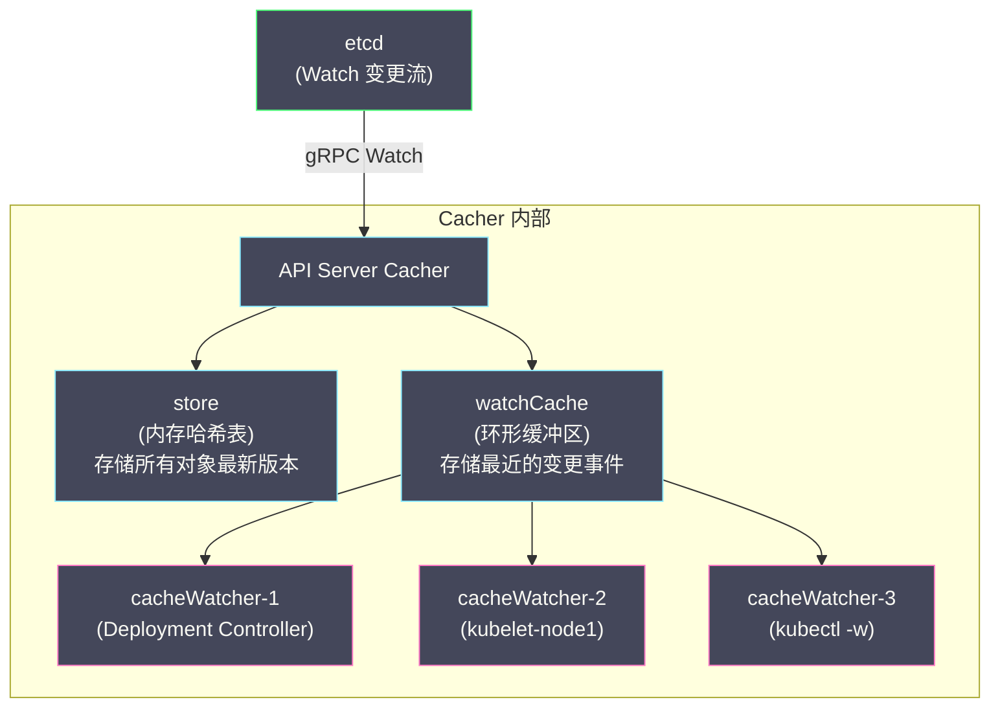
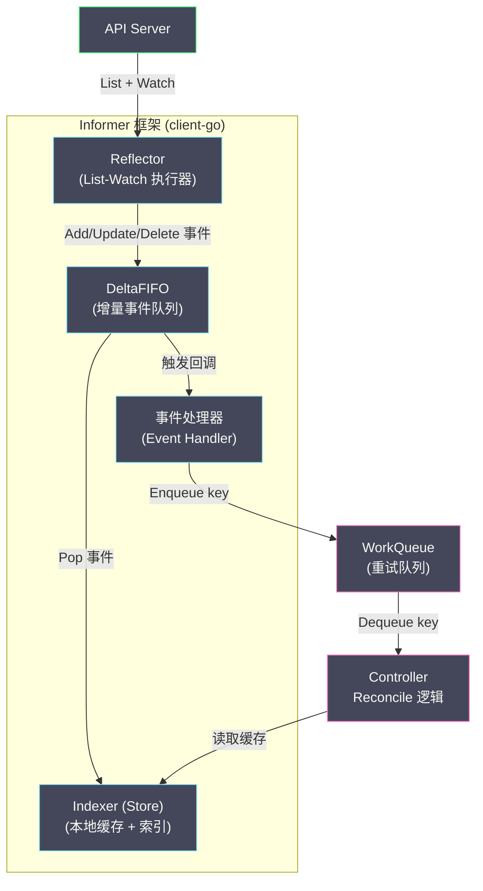
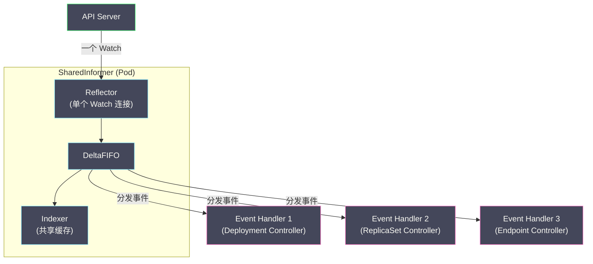
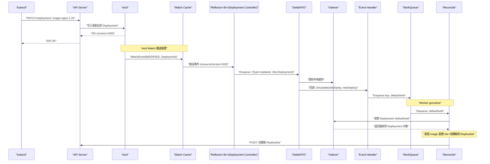

# 05 List-Watch 机制与 Informer 框架

**摘要：**

前几篇文章剖析了 API Server 的"入口侧"——请求如何经过认证、授权、准入控制最终写入 [[etcd]]。本文转向"出口侧"——数据写入 etcd 后，如何被其他组件感知和消费。K8s 的所有控制器（Deployment Controller、ReplicaSet Controller、kubelet 等）都不轮询 API Server——它们通过 **List-Watch 协议**获取资源的初始状态和后续变更。在客户端侧，`client-go` 库提供了 **Informer 框架**——一套精心设计的本地缓存和事件分发机制，使得控制器可以高效地基于内存缓存做决策，而不是每次协调都查询 API Server。Informer 是 K8s 控制器编程的基石——理解 Reflector、DeltaFIFO、Indexer、WorkQueue 这些组件如何协作，是编写 Operator 和理解 K8s 内部行为的必备知识。本文从 API Server 端的 Watch 实现出发，完整追踪数据从 etcd 变更到控制器执行协调的全链路。

---

## 第 1 章 为什么需要 List-Watch

### 1.1 轮询的代价

假设 K8s 没有 Watch 机制，所有控制器只能通过**轮询（Polling）** 获取资源状态——每隔 N 秒执行一次 `GET /api/v1/pods` 拉取所有 Pod 的最新状态，与本地缓存比较，找出变化。

在一个 5000 Pod 的集群中，假设有 20 个控制器各自轮询 Pod 列表，轮询间隔 1 秒：

- **每秒请求数**：20 个控制器 × 1 次/秒 = 20 QPS（仅 Pod 一种资源）
- **每次响应大小**：5000 个 Pod × 平均 5KB/Pod = 25MB
- **每秒网络流量**：20 × 25MB = 500MB/s（仅 Pod 一种资源）
- **etcd 读取压力**：每次 List 都需要从 etcd 读取所有 Pod 数据

这个开销是不可接受的——而且大部分时候，两次轮询之间 Pod 列表根本没有变化。控制器传输了 25MB 的数据，只是为了发现"什么都没变"。

### 1.2 Watch 的优势

Watch 是**增量推送**——客户端建立一个长连接，API Server 只在数据发生变化时推送**变更事件**（而不是完整的资源列表）。如果 1 秒内只有 1 个 Pod 被更新，API Server 只推送这 1 个 Pod 的变更（约 5KB），而不是 5000 个 Pod 的完整列表（25MB）。

| 维度 | 轮询 | Watch |
| :--- | :--- | :--- |
| **网络开销** | O(N × 资源总量) / 每次 | O(变更数量) / 持续 |
| **延迟** | 最大 = 轮询间隔 | 接近实时（毫秒级）|
| **API Server 压力** | 高（每次轮询都是全量 List）| 低（只推送增量变更）|
| **etcd 压力** | 高（每次 List 都读 etcd）| 低（Watch 从 API Server 的 watch cache 获取）|

### 1.3 List-Watch 协议

单独使用 Watch 有一个问题——客户端启动时不知道当前有哪些资源存在，它只能收到启动后的变更。因此 K8s 定义了 **List-Watch 协议**：

1. **Initial List**：客户端先执行一次 List，获取所有资源的当前快照和一个 `resourceVersion`
2. **Watch**：然后从该 `resourceVersion` 开始 Watch，获取后续的增量变更

这保证了客户端既知道"当前有什么"（List），又能实时感知"发生了什么变化"（Watch）。

---

## 第 2 章 API Server 端的 Watch 实现

### 2.1 Watch Cache

在 [[01 API Server 的角色与整体架构]] 中我们介绍了 API Server 的 watch cache。这里深入其内部结构：

API Server 为每种资源类型维护一个 **cacher** 对象，包含：

**store（缓存存储）**：一个内存中的哈希表，存储该资源类型的所有对象的最新版本。key 是 `namespace/name`，value 是资源对象。当 List 请求到达时，直接从 store 中读取，不查询 etcd。

**watchCache（事件环形缓冲区）**：一个固定大小的环形缓冲区（默认 100 个事件槽位，可通过 `--watch-cache-sizes` 配置），存储最近的变更事件。每个事件包含事件类型（ADDED/MODIFIED/DELETED）、变更后的对象和 resourceVersion。

**cacheWatcher（Watch 分发器）**：每个客户端的 Watch 请求对应一个 cacheWatcher。当 watchCache 收到新事件时，遍历所有 cacheWatcher，将匹配的事件推送给对应的客户端。



### 2.2 Watch 事件的扇出（Fan-out）

etcd 中的一次变更，可能需要推送给多个 Watch 客户端。例如一个 Pod 被更新：

- Deployment Controller Watch 了所有 Pod → 收到事件
- ReplicaSet Controller Watch 了所有 Pod → 收到事件
- kubelet Watch 了分配到本节点的 Pod → 如果该 Pod 在本节点，收到事件
- `kubectl get pods -w` → 如果匹配 Namespace，收到事件

API Server 的 watch cache 实现了高效的扇出——etcd 只推送一次变更给 API Server，API Server 在内存中将事件分发给所有匹配的 cacheWatcher。这比让每个客户端各自直接 Watch etcd 高效得多——etcd 只需要维护一个 Watch 连接（与 API Server），而不是几十甚至几百个（与每个控制器）。

### 2.3 Watch 的中断与恢复

Watch 连接可能因为网络问题、API Server 重启或 etcd Compaction 而中断。中断后的恢复策略：

**正常中断恢复**：客户端记录了最后收到的事件的 `resourceVersion`，重新发起 Watch 请求并携带该 `resourceVersion`。API Server 从 watchCache 的环形缓冲区中找到该 resourceVersion 之后的事件，继续推送。

**Compaction 导致的历史丢失**：如果客户端断线时间太长，最后记录的 `resourceVersion` 已经被 etcd Compaction 清理（或 watchCache 的环形缓冲区已经被覆盖），API Server 返回 `410 Gone` 错误。客户端收到 410 后必须执行一次完整的 Re-list（重新获取所有数据），然后从新的 `resourceVersion` 开始 Watch。

**Watch Bookmark**：API Server 定期发送 Bookmark 事件（只包含最新的 resourceVersion，不包含数据），帮助客户端更新记录的 resourceVersion——减少 Compaction 导致 Re-list 的概率。

---

## 第 3 章 Informer 框架概览

### 3.1 Informer 解决的问题

List-Watch 协议解决了"如何高效获取资源变更"的问题，但控制器开发者还需要处理很多细节：

- 初始 List 后如何将数据存入本地缓存？
- Watch 事件到来时如何更新本地缓存？
- Watch 断开后如何自动重连和 Re-list？
- 控制器的协调逻辑如何被触发？如何避免重复处理？
- 如何按 Namespace、Label 等条件高效查询本地缓存？

**Informer 框架**（`client-go` 库的一部分）封装了这些细节，提供了一套开箱即用的本地缓存和事件分发机制。

### 3.2 核心组件



---

## 第 4 章 Reflector：List-Watch 执行器

### 4.1 职责

**Reflector** 是 Informer 中负责与 API Server 交互的组件——它执行 List-Watch 协议，将 API Server 返回的数据转化为事件（Add/Update/Delete），放入 DeltaFIFO 队列。

### 4.2 工作流程

1. **初始 List**：Reflector 启动时，调用 API Server 的 List 接口获取所有对象。对于每个对象，生成一个 `Add` 事件放入 DeltaFIFO。同时记录 List 返回的 `resourceVersion`。

2. **开始 Watch**：从记录的 `resourceVersion` 开始 Watch。API Server 推送的每个事件（ADDED/MODIFIED/DELETED）对应一个 Add/Update/Delete 事件，放入 DeltaFIFO。

3. **错误处理**：
   - Watch 连接中断：自动重连，从最后记录的 resourceVersion 继续 Watch
   - 收到 `410 Gone`：执行完整的 Re-list（清空 DeltaFIFO，重新 List 所有数据）
   - 连续失败：指数退避重试（backoff 从 500ms 到 5 分钟）

### 4.3 Re-sync（定期重同步）

Reflector 支持一个可选的 **Re-sync 机制**——即使没有 Watch 事件，也会定期（如每 30 秒）将 Indexer 中的所有对象重新放入 DeltaFIFO 作为 `Sync` 事件。这些事件会触发控制器重新执行协调逻辑。

Re-sync 的意义在于**兜底**——如果控制器因为某些原因遗漏了一个事件（如处理事件时发生 panic 被恢复），Re-sync 确保控制器最终会处理到所有对象。这与 [[01 Kubernetes 的诞生与设计哲学|Level-triggered]] 的设计理念一致——不依赖边缘触发的完美送达，而是通过定期重检来保证最终一致性。

---

## 第 5 章 DeltaFIFO：增量事件队列

### 5.1 设计动机

为什么不直接从 Reflector 到 Indexer？因为需要一个**缓冲区**来解耦"数据获取"和"数据处理"的速度差异——Reflector 从 API Server 获取事件的速度可能快于控制器处理的速度。DeltaFIFO 作为中间缓冲区，保存了每个对象的增量变更历史。

### 5.2 核心数据结构

DeltaFIFO 维护两个数据结构：

**queue（FIFO 队列）**：一个字符串队列，存储有待处理的对象的 key（格式 `namespace/name`）。保证处理顺序为先入先出。

**items（增量映射）**：一个 map，key 是对象的 key，value 是该对象的**增量列表（Deltas）**——记录了自上次处理以来该对象的所有变更。

```
items = {
  "default/nginx": [
    {Type: Added,    Object: Pod{...}},    // 第一次创建
    {Type: Updated,  Object: Pod{...}},    // 随后被更新
  ],
  "default/redis": [
    {Type: Deleted,  Object: Pod{...}},    // 被删除
  ],
}
queue = ["default/nginx", "default/redis"]
```

**为什么保存增量列表而不是最新状态？** 因为控制器可能需要知道"发生了什么变化"——例如如果一个 Pod 先被创建再被删除，只保留最新状态（Deleted）会丢失"曾经存在"的信息。DeltaFIFO 保留完整的变更历史，让消费者可以按顺序处理每个变更。

### 5.3 去重与合并

DeltaFIFO 对同一个对象的事件会**追加**到该对象的增量列表中，但**不会在 queue 中重复入队**。如果对象 "default/nginx" 在未被处理前又收到了新事件，新事件会追加到 items 中的增量列表，但 queue 中不会再添加一个 "default/nginx" 条目——避免同一个对象被重复出队。

---

## 第 6 章 Indexer：本地缓存与索引

### 6.1 职责

**Indexer** 是 Informer 的本地缓存——它存储了资源对象的最新版本，并支持按多种维度建立索引以加速查询。

DeltaFIFO 的消费者（Informer 内部的 processLoop）从 DeltaFIFO 中 Pop 出事件后：
1. 更新 Indexer 中的数据（Add → 添加对象、Update → 更新对象、Delete → 删除对象）
2. 调用用户注册的 Event Handler（OnAdd/OnUpdate/OnDelete）

### 6.2 索引机制

Indexer 默认建立了一个 **Namespace 索引**——可以按 Namespace 快速查询属于该 Namespace 的所有对象。用户也可以自定义索引函数。

```go
// 默认的 Namespace 索引函数
func MetaNamespaceKeyFunc(obj interface{}) (string, error) {
    meta, _ := meta.Accessor(obj)
    if meta.GetNamespace() == "" {
        return meta.GetName(), nil
    }
    return meta.GetNamespace() + "/" + meta.GetName(), nil
}
```

控制器在执行协调逻辑时，**从 Indexer 读取数据而不是查询 API Server**。例如 Deployment Controller 需要查找"所有 label 匹配的 ReplicaSet"——它从 Indexer 中查询，不需要发送 HTTP 请求。这大幅减少了 API Server 的读取压力。

> [!info] Indexer 的一致性
> Indexer 中的数据可能比 etcd 稍旧——Watch 事件从 etcd 到 API Server 到 Informer 有毫秒级延迟。对于 K8s 的控制器来说，这是可接受的——控制器是面向终态的，即使基于稍旧的数据做出决策，下一次协调循环会修正。但在编写控制器时需要意识到这一点——**不要假设 Indexer 中的数据是实时最新的**。

---

## 第 7 章 SharedInformer：多控制器共享缓存

### 7.1 问题背景

一个 K8s 进程中可能运行多个控制器——例如 `kube-controller-manager` 进程内运行了 Deployment Controller、ReplicaSet Controller、Node Controller 等数十个控制器。如果每个控制器都独立创建自己的 Informer，会导致：

- **重复的 Watch 连接**：10 个控制器 Watch Pod → 10 个 Watch 连接 → API Server 负担增加
- **重复的本地缓存**：每个 Informer 各自维护一份 Pod 缓存 → 内存浪费
- **重复的 List 请求**：启动时 10 个 Informer 各自执行 List → 10 次全量拉取

### 7.2 SharedInformer 的设计

**SharedInformer** 解决了这个问题——对于同一种资源类型，所有控制器共享**一个** Informer 实例（一个 Reflector、一个 DeltaFIFO、一个 Indexer），但每个控制器可以注册自己的 Event Handler。



`kube-controller-manager` 使用 **SharedInformerFactory** 管理所有 SharedInformer——当一个控制器请求 Pod 的 Informer 时，Factory 检查是否已经存在 Pod 的 SharedInformer，如果存在直接返回，不重复创建。

### 7.3 Event Handler 的类型

控制器通过 `AddEventHandler` 注册三种回调：

```go
informer.AddEventHandler(cache.ResourceEventHandlerFuncs{
    AddFunc: func(obj interface{}) {
        // 新对象被创建（或首次 List 时发现的已有对象）
        key, _ := cache.MetaNamespaceKeyFunc(obj)
        workqueue.Add(key)
    },
    UpdateFunc: func(oldObj, newObj interface{}) {
        // 对象被更新
        key, _ := cache.MetaNamespaceKeyFunc(newObj)
        workqueue.Add(key)
    },
    DeleteFunc: func(obj interface{}) {
        // 对象被删除
        key, _ := cache.DeletionHandlingMetaNamespaceKeyFunc(obj)
        workqueue.Add(key)
    },
})
```

Event Handler 的典型做法是**只入队 key，不做业务逻辑**——将对象的 key（`namespace/name`）放入 WorkQueue，由独立的 worker goroutine 从 WorkQueue 中取出 key 执行协调。这种解耦确保了 Informer 的事件分发不会被某个控制器的慢处理阻塞。

---

## 第 8 章 WorkQueue：重试与限速

### 8.1 为什么需要 WorkQueue

Event Handler 被触发后，为什么不直接执行协调逻辑，而是要通过一个 WorkQueue 中转？

**去重**：同一个对象在短时间内可能收到多个事件（如连续被更新两次）。如果每个事件都触发一次协调，会浪费资源。WorkQueue 自动去重——如果 key "default/nginx" 已经在队列中，再次入队不会创建重复条目。

**限速**：如果协调逻辑因为外部依赖（如数据库不可用）反复失败，不应该立即重试——应该用指数退避策略（如 1s → 2s → 4s → 8s → ... → 最大 5 分钟）延迟重试。WorkQueue 内置了限速器。

**并发控制**：多个 worker goroutine 可以从同一个 WorkQueue 中并发取出不同的 key 执行协调——同一个 key 同一时刻只会被一个 worker 处理。

### 8.2 WorkQueue 的三种类型

`client-go` 提供了三种 WorkQueue 实现：

| 类型 | 特性 |
| :--- | :--- |
| **FIFO Queue** | 基本的先入先出队列，支持去重 |
| **Delayed Queue** | 支持延迟入队——"5 秒后再处理这个 key" |
| **Rate-Limited Queue**（最常用）| 支持限速——失败后按指数退避延迟重入队 |

```go
// 创建一个限速 WorkQueue
queue := workqueue.NewRateLimitingQueue(
    workqueue.DefaultControllerRateLimiter(),
)

// 处理失败，稍后重试
queue.AddRateLimited(key)  // 按退避策略延迟入队

// 处理成功，标记完成
queue.Done(key)
queue.Forget(key)  // 清除该 key 的重试计数
```

### 8.3 控制器的标准处理循环

一个典型的 K8s 控制器的处理循环：

```go
func (c *Controller) processNextWorkItem() bool {
    // 1. 从 WorkQueue 取出一个 key（如果队列为空则阻塞）
    key, shutdown := c.queue.Get()
    if shutdown {
        return false
    }
    defer c.queue.Done(key)

    // 2. 执行协调逻辑
    err := c.reconcile(key.(string))
    if err == nil {
        // 3a. 成功：清除重试计数
        c.queue.Forget(key)
        return true
    }

    // 3b. 失败：按退避策略重新入队
    c.queue.AddRateLimited(key)
    return true
}

func (c *Controller) reconcile(key string) error {
    namespace, name, _ := cache.SplitMetaNamespaceKey(key)
    
    // 从 Indexer（本地缓存）读取对象，不查询 API Server
    pod, exists, err := c.podLister.GetByKey(key)
    if err != nil {
        return err
    }
    if !exists {
        // 对象已被删除，执行清理逻辑
        return nil
    }
    
    // 基于对象的当前状态执行协调逻辑
    // ...
    return nil
}
```

---

## 第 9 章 全链路数据流

### 9.1 从 etcd 变更到控制器协调

以"用户更新 Deployment 的镜像版本"为例，追踪完整的数据流：



### 9.2 关键设计要点

**异步解耦**：整个链路由多个异步阶段组成——etcd → Watch Cache → Reflector → DeltaFIFO → Indexer/EventHandler → WorkQueue → Reconcile。每个阶段之间通过队列或 Watch 连接解耦，不存在同步的调用链。

**读写分离**：写操作（Reconcile 中创建 ReplicaSet）直接发送给 API Server；读操作（查询当前 Deployment 状态）从本地 Indexer 读取——不增加 API Server 的读取压力。

**幂等性**：Reconcile 函数被设计为幂等的——即使因为 Re-sync 或 Watch 事件重复被调用，执行结果相同。Reconcile 只关注"当前状态与期望状态的差距"，不关心"为什么被调用"。

---

## 第 10 章 总结

本文追踪了 K8s 事件驱动架构的完整数据流：

- **List-Watch 协议**：初始 List 获取全量快照 + Watch 获取增量变更，替代低效的轮询
- **API Server Watch Cache**：内存缓存 + 环形事件缓冲区 + 扇出分发，减少 etcd 压力
- **Reflector**：执行 List-Watch，将 API 事件转化为 DeltaFIFO 事件，处理断线重连和 Re-list
- **DeltaFIFO**：增量事件队列，保存对象的变更历史，支持去重
- **Indexer**：本地缓存 + 多维索引，控制器从缓存读取数据而非查询 API Server
- **SharedInformer**：多控制器共享一个 Watch 连接和缓存，减少资源消耗
- **WorkQueue**：去重 + 限速 + 并发控制，是控制器协调循环的驱动引擎

下一篇 [[06 API Server 性能调优与高可用]] 将基于本文建立的认知，分析 API Server 在大规模集群中的性能瓶颈和调优策略。

---

## 参考资料

1. Kubernetes client-go Source Code：https://github.com/kubernetes/client-go
2. Kubernetes Documentation - API Concepts (Watch)：https://kubernetes.io/docs/reference/using-api/api-concepts/#efficient-detection-of-changes
3. Michael Hausenblas, Stefan Schimanski (2019). *Programming Kubernetes*. O'Reilly, Chapter 4-5.
4. Kubernetes Enhancement Proposal - Watch Bookmark：https://github.com/kubernetes/enhancements/tree/master/keps/sig-api-machinery/956-watch-bookmark
5. Kubernetes Source - staging/src/k8s.io/apiserver/pkg/storage/cacher：https://github.com/kubernetes/kubernetes/tree/master/staging/src/k8s.io/apiserver/pkg/storage/cacher
6. Joe Beda (2017). *Understanding the Kubernetes Informer Pattern*. KubeCon NA.

---

> [!note] 思考题
> 1. API Server 的 `--max-requests-inflight`（默认 400）和 `--max-mutating-requests-inflight`（默认 200）限制并发请求数。Priority and Fairness（APF）机制将请求分为不同优先级——system 请求优先于 user 请求。在一个自动化工具（如 CI/CD Pipeline）发送大量 API 请求时，APF 如何防止这些请求'饿死'关键的 Controller 请求？
> 2. 审计日志（Audit Log）记录所有 API 请求——用于安全审计和故障排查。审计策略定义了记录哪些事件和哪些字段。在高 QPS 集群中，审计日志的量可能很大——如何通过审计策略过滤不重要的事件（如对 ConfigMap 的 GET 请求）来降低日志量？
> 3. API Server 的 etcd 请求延迟是关键性能指标。如果 etcd 延迟超过 100ms，API Server 的响应时间显著增加。`--etcd-servers` 配置的 etcd 端点数量和负载均衡策略如何影响性能？API Server 到 etcd 的网络延迟应该控制在多少以内？
