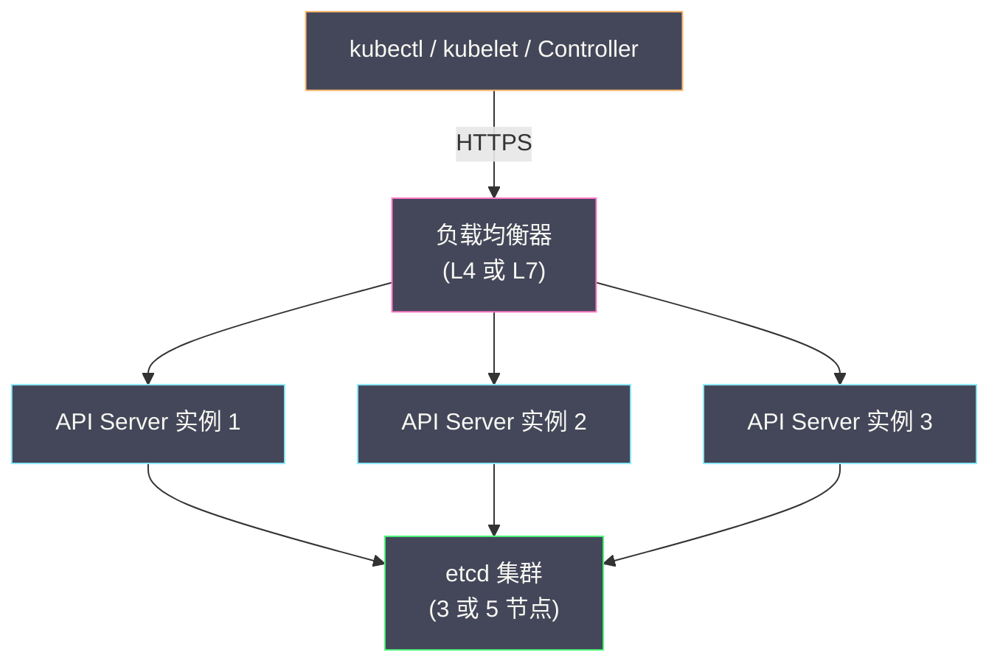

# 06 API Server 性能调优与高可用

**摘要：**

前五篇文章建立了对 API Server 内部机制的完整认知——从请求处理管线到认证授权、准入控制、List-Watch/Informer。本文作为 API Server 专栏的收官，聚焦两个生产环境中最关键的工程问题：**性能**和**可用性**。API Server 是 K8s 集群的"咽喉"——它的延迟和吞吐量直接决定了集群的响应速度，它的可用性直接决定了集群能否正常运作。在小规模集群中（几十个节点），API Server 几乎不会成为瓶颈；但当集群规模增长到数百甚至数千节点、数万 Pod 时，API Server 的性能压力急剧上升——大量的 List 请求消耗内存和带宽、数千个 Watch 连接占用 goroutine、频繁的写入操作压迫 [[etcd]] 的延迟。本文从 API Server 的性能模型出发，分析大规模集群中的典型瓶颈，介绍关键的调优参数和策略，然后深入高可用部署架构——多实例部署、负载均衡、Leader Election、优雅关闭。

---

## 第 1 章 API Server 的性能模型

### 1.1 请求类型与资源消耗

API Server 处理的请求可以分为四类，它们对资源的消耗模式截然不同：

| 请求类型 | 资源消耗特征 | 典型场景 |
| :--- | :--- | :--- |
| **短读（Get）** | 低 CPU、低内存、低延迟 | `kubectl get pod nginx` |
| **长读（List）** | 高内存（需要序列化大量对象）、高带宽 | `kubectl get pods --all-namespaces`、Informer 初始 List |
| **写入（Create/Update/Delete）** | 中等 CPU、低内存、依赖 etcd 写入延迟 | 创建 Pod、更新 Deployment |
| **Watch** | 低 CPU、持续占用连接和 goroutine | 所有控制器的 Watch 连接 |

在大规模集群中，**List 请求是最大的性能杀手**。一个 "List all Pods" 请求在 10000 Pod 的集群中需要：
- 从 watch cache 中序列化 10000 个 Pod 对象
- 单个 Pod 的 JSON 大小约 3-8KB，总响应约 30-80MB
- 序列化过程中消耗大量 CPU 和内存

如果 20 个 Informer 同时启动（如 API Server 重启后所有控制器重新 List），API Server 需要同时序列化 20 × 80MB = 1.6GB 的响应数据——这可能导致 API Server 的内存使用量瞬间飙升，甚至触发 OOM。

### 1.2 K8s 的 SLI/SLO 定义

K8s 社区为 API Server 定义了标准的 **SLI（Service Level Indicator）** 和 **SLO（Service Level Objective）**：

| SLI | SLO |
| :--- | :--- |
| **Mutating API 调用延迟**（单个对象的写入） | p99 < 1 秒 |
| **Non-mutating API 调用延迟**（单个对象的读取） | p99 < 1 秒 |
| **Non-mutating API 调用延迟**（List，针对 Namespace 级别） | p99 < 5 秒（返回最多 500 个对象）|
| **Non-mutating API 调用延迟**（List，集群级别） | p99 < 30 秒 |

这些 SLO 定义了 K8s 集群的"健康标准"——如果 API 调用延迟持续超过 SLO，说明集群存在性能问题。

---

## 第 2 章 大规模集群的典型瓶颈

### 2.1 List 风暴

**场景**：API Server 重启后，所有控制器的 Informer 同时执行初始 List（因为 Watch 连接断开）。在 5000 节点、50000 Pod 的集群中，数十个控制器同时 List 所有 Pod，每个响应 50-100MB。

**影响**：API Server 内存使用量暴涨、响应延迟大幅增加、可能触发 OOM 或 goroutine 阻塞。etcd 如果同时被大量 List 回源请求命中，也会出现延迟飙升。

**缓解策略**：

**分页 List（Pagination）**：K8s 1.9 引入了 List 分页——客户端可以通过 `limit` 和 `continue` 参数分批获取数据：

```
GET /api/v1/pods?limit=500
→ 返回前 500 个 Pod + continue token

GET /api/v1/pods?limit=500&continue=<token>
→ 返回下 500 个 Pod + 新的 continue token
```

分页将一个大的 List 请求拆分为多个小请求，降低了每个请求的内存峰值。`client-go` 的 Informer 默认使用分页 List（limit=500）。

**Streaming List（K8s 1.31+）**：传统的 List 需要 API Server 在内存中构建完整的响应后才开始发送。Streaming List 允许 API Server 边构建边发送——减少了内存峰值。

### 2.2 Watch 连接数

每个 Watch 请求在 API Server 中占用一个 goroutine 和一个 cacheWatcher。在大规模集群中：

- `kube-controller-manager` 中有 30+ 个控制器，每个 Watch 至少 1 种资源 → 30+ Watch
- 每个 kubelet Watch 自己节点上的 Pod、Secret、ConfigMap → 5000 节点 × 3 Watch ≈ 15000 Watch
- 每个 kube-proxy Watch Service 和 Endpoints → 5000 节点 × 2 Watch ≈ 10000 Watch
- 自定义控制器、Operator、监控系统的 Watch → 数千

总计可能有 **2-3 万个 Watch 连接**。每个 Watch 连接对应 API Server 中的一个 goroutine——虽然 Go 的 goroutine 很轻量（初始栈 2KB），但 2 万个 goroutine 加上 watchCache 的扇出分发也有不小的开销。

**缓解策略**：调大 `--watch-cache-sizes` 增加事件缓冲区，减少 Watch 因缓冲区满而断开重连的频率。

### 2.3 etcd 延迟

API Server 的写入操作依赖 etcd 的写入延迟——etcd 的 Raft 提交需要多数节点确认（见 [[06 etcd 与 Kubernetes 的状态存储]]）。etcd 延迟受磁盘 I/O 和网络延迟影响：

| etcd 磁盘类型 | 典型 WAL fsync 延迟 | 对 API Server 写入的影响 |
| :--- | :--- | :--- |
| **NVMe SSD** | 0.1-0.5ms | API 写入延迟 < 10ms |
| **SATA SSD** | 0.5-2ms | API 写入延迟 10-30ms |
| **机械硬盘** | 5-20ms | API 写入延迟 50-200ms（不可接受）|

> [!warning] 生产环境必须使用 SSD
> etcd 的性能几乎完全取决于磁盘 fsync 延迟。使用机械硬盘或与其他负载共享磁盘 I/O 的 SSD 会导致 etcd 延迟飙升，进而导致 API Server 的所有写入操作变慢。生产环境应为 etcd 使用**专用的 NVMe SSD**，不与其他进程共享。

### 2.4 大对象

K8s 的 API 对象默认大小限制是 1.5MB（`--max-request-bytes`）。虽然大多数对象远小于这个限制，但某些场景会产生大对象：

- 包含大量数据的 ConfigMap/Secret（如嵌入了整个配置文件或证书链）
- 带有大量 Annotation 的对象（某些工具将元数据存储在 Annotation 中）
- 拥有数千条规则的 NetworkPolicy 或大型 CRD 对象

大对象的影响：
- 增加 etcd 的存储压力和写入延迟
- 增加 Watch 事件的传输大小——每次对象变更都需要推送完整的对象
- 增加 API Server 的序列化/反序列化 CPU 消耗

---

## 第 3 章 关键调优参数

### 3.1 API Priority and Fairness（APF）

[[01 API Server 的角色与整体架构|APF]] 是 API Server 最重要的限流机制——在大规模集群中，合理的 APF 配置是防止 API Server 过载的第一道防线。

**核心参数**：

`--max-requests-inflight`：非 mutating 请求的最大并发数（与 APF 配合使用时作为全局上限）。默认 400。

`--max-mutating-requests-inflight`：mutating 请求的最大并发数。默认 200。

**APF 调优策略**：

为关键请求路径分配更高优先级：

```yaml
# Leader Election 请求：最高优先级
apiVersion: flowcontrol.apiserver.k8s.io/v1
kind: PriorityLevelConfiguration
metadata:
  name: leader-election
spec:
  type: Limited
  limited:
    nominalConcurrencyShares: 50    # 并发份额
    lendablePercent: 0               # 不借出份额
    limitResponse:
      type: Queue
      queuing:
        queues: 16
        handSize: 4
        queueLengthLimit: 50
```

```yaml
# 大批量 List 请求：低优先级
apiVersion: flowcontrol.apiserver.k8s.io/v1
kind: PriorityLevelConfiguration
metadata:
  name: bulk-operations
spec:
  type: Limited
  limited:
    nominalConcurrencyShares: 10    # 较少的并发份额
    lendablePercent: 50              # 空闲时可借出
    limitResponse:
      type: Queue
      queuing:
        queues: 64
        handSize: 6
        queueLengthLimit: 50
```

### 3.2 Watch Cache 参数

`--watch-cache`：是否启用 watch cache（默认启用，不要禁用）。

`--watch-cache-sizes`：为特定资源类型配置 watch cache 的大小（事件缓冲区的条目数）。

```bash
# 为 Pod 和 Node 配置更大的 watch cache
--watch-cache-sizes=pods#1000,nodes#500
```

在大规模集群中，默认的 100 条事件缓冲区可能不够——如果短时间内有大量 Pod 变更（如批量滚动更新），缓冲区被填满后，较慢的 Watch 客户端会收到 `410 Gone` 并触发代价昂贵的 Re-list。增大缓冲区可以减少 Re-list 的频率。

### 3.3 请求超时

`--request-timeout`：HTTP 请求的默认超时时间（默认 60 秒）。

`--min-request-timeout`：List 和 Watch 请求的最小超时时间（默认 1800 秒 = 30 分钟）。Watch 请求通常需要更长的超时，因为它是长连接。

### 3.4 序列化与内存

`--max-request-bytes`：单个请求的最大字节数（默认 3MB，即 3 × 1048576）。限制大对象的写入。

API Server 默认使用 **protobuf** 格式与 etcd 交互（比 JSON 更紧凑、序列化/反序列化更快）。与客户端之间默认使用 JSON（兼容性好），但 `client-go` 库会优先使用 protobuf（通过 Accept Header `application/vnd.kubernetes.protobuf`）。

---

## 第 4 章 高可用部署架构

### 4.1 多实例部署

API Server 是**无状态**的（见 [[01 API Server 的角色与整体架构]]）——可以部署多个实例，前面放负载均衡器。典型的高可用部署：



**实例数量**：通常 3 个 API Server 实例——与 etcd 的 3 节点对应。更大的集群可以部署 5 个甚至更多。API Server 实例数不受 Raft quorum 限制（它不是共识系统），可以自由扩缩。

**资源配置**：每个 API Server 实例通常需要 2-4 CPU 核心和 4-8GB 内存（中等规模集群）。大规模集群（5000+ 节点）可能需要 8-16 CPU 和 16-32GB 内存。

### 4.2 负载均衡

API Server 前的负载均衡器有两种选择：

**L4 负载均衡（TCP 层）**：负载均衡器只做 TCP 连接分发，不解析 HTTP 内容。TLS 终止在 API Server 端。优点是简单高效；缺点是无法基于 HTTP 路径做路由。

**L7 负载均衡（HTTP 层）**：负载均衡器解析 HTTP 请求，可以基于路径、Header 做智能路由。TLS 可以在负载均衡器端终止。优点是可以实现更精细的流量控制；缺点是增加了一层 TLS 解析的开销。

**Watch 连接的特殊处理**：Watch 是长连接——一旦建立，可能持续数小时。L4 负载均衡器通常按"连接数"做负载均衡——Watch 连接可能导致某个 API Server 实例承载更多长连接。需要监控各实例的 Watch 连接数分布是否均衡。

### 4.3 kubeadm 的高可用模式

kubeadm 支持两种高可用拓扑：

**Stacked（堆叠）拓扑**：每个 Master 节点同时运行 API Server 和 etcd——API Server 通过 localhost 访问本地 etcd。优点是部署简单；缺点是 Master 节点故障时同时丢失一个 API Server 和一个 etcd 节点。

**External etcd 拓扑**：etcd 集群独立于 Master 节点部署——API Server 通过网络访问 etcd。优点是 etcd 的故障域与 API Server 完全隔离；缺点是需要更多的节点和更复杂的运维。

| 拓扑 | 最少节点数 | 故障域隔离 | 运维复杂度 |
| :--- | :--- | :--- | :--- |
| **Stacked** | 3 个 Master 节点 | API Server + etcd 共享故障域 | 低 |
| **External etcd** | 3 Master + 3 etcd = 6 节点 | 完全隔离 | 高 |

### 4.4 Leader Election

虽然多个 API Server 实例可以同时处理读写请求，但某些内部任务需要**只由一个实例执行**——避免重复工作。这些任务通过 **Leader Election** 机制协调。

API Server 本身的 Leader Election 主要用于以下场景：

- **垃圾回收控制器**：只需一个实例执行
- **StorageVersion 更新**：只需一个实例负责

Leader Election 使用 [[06 etcd 与 Kubernetes 的状态存储|etcd 的 Lease 机制]]——Leader 持续续租一个 Lease 对象，如果 Leader 崩溃，Lease 过期后其他实例竞争成为新的 Leader。

### 4.5 优雅关闭（Graceful Shutdown）

API Server 在收到终止信号（SIGTERM）后的关闭流程：

1. **停止接受新连接**：关闭监听端口
2. **`/readyz` 返回不健康**：通知负载均衡器停止向该实例发送新请求
3. **等待存量请求完成**：给正在处理的请求一段时间（`--shutdown-delay-duration`，默认 0）完成
4. **关闭 Watch 连接**：向所有 Watch 客户端发送关闭信号，客户端会自动重连到其他实例
5. **关闭 etcd 连接**
6. **进程退出**

> [!warning] shutdown-delay-duration 的重要性
> 在负载均衡器检测到 `/readyz` 不健康并将实例从后端池中移除之前，可能仍有新请求被路由到正在关闭的实例。`--shutdown-delay-duration` 设置一个延迟——API Server 先等待该时长（让负载均衡器有时间摘除实例），然后才真正开始关闭。推荐设置为 **60-90 秒**（取决于负载均衡器的健康检查间隔）。

---

## 第 5 章 关键监控指标

### 5.1 请求延迟

```
# Mutating 请求延迟（p99）
apiserver_request_duration_seconds{verb=~"CREATE|UPDATE|PATCH|DELETE", resource="pods"}

# List 请求延迟（p99）
apiserver_request_duration_seconds{verb="LIST", resource="pods"}

# Watch 初始化延迟
apiserver_request_duration_seconds{verb="WATCH", resource="pods"}
```

### 5.2 请求速率与错误

```
# 每秒请求数（按 verb 和 resource 分组）
rate(apiserver_request_total[5m])

# 错误率（4xx + 5xx）
rate(apiserver_request_total{code=~"4..|5.."}[5m]) / rate(apiserver_request_total[5m])

# 429 限流响应（APF 触发）
rate(apiserver_request_total{code="429"}[5m])
```

### 5.3 Watch 相关

```
# 活跃 Watch 数量
apiserver_longrunning_requests{verb="WATCH"}

# Watch 事件发送速率
rate(apiserver_watch_events_sizes_sum[5m])
```

### 5.4 etcd 相关

```
# etcd 请求延迟
etcd_request_duration_seconds{operation="get|put|list|watch"}

# etcd 数据库大小
apiserver_storage_db_total_size_in_bytes
```

### 5.5 告警规则示例

| 指标 | 告警条件 | 严重等级 |
| :--- | :--- | :--- |
| **API 请求延迟** | `apiserver_request_duration_seconds` p99 > 1s 持续 5 分钟 | Warning |
| **API 请求延迟** | `apiserver_request_duration_seconds` p99 > 5s 持续 5 分钟 | Critical |
| **API 错误率** | 5xx 错误率 > 1% 持续 5 分钟 | Warning |
| **APF 限流** | 429 响应率 > 0 持续 5 分钟 | Warning |
| **etcd 延迟** | `etcd_request_duration_seconds` p99 > 100ms 持续 5 分钟 | Critical |
| **Watch 连接数** | 活跃 Watch 数异常增长（> 2 倍基线）| Warning |

---

## 第 6 章 大规模集群的工程实践

### 6.1 控制 List 请求的影响

- **使用 Informer 而非直接 List**：所有控制器应通过 SharedInformer 获取数据（见 [[05 List-Watch 机制与 Informer 框架]]），从本地缓存读取，不直接调用 API Server 的 List 接口
- **使用 Label Selector 过滤**：List 请求应尽可能携带 [[04 Label Selector 与松耦合设计|Label Selector]] 或 Field Selector，减少返回的数据量
- **避免不必要的全量 List**：`kubectl get pods --all-namespaces` 在大集群中可能返回数万个对象——应限制到特定 Namespace

### 6.2 减少 etcd 写入压力

- **批量操作使用 Server-Side Apply**：K8s 1.22+ 的 Server-Side Apply 支持 Field Management——多个控制器可以安全地管理同一个对象的不同字段，减少冲突重试
- **避免高频更新 status**：某些 Operator 在每次协调时都更新 CRD 的 status，即使状态没有变化——这会产生大量不必要的 etcd 写入。应先比较新旧 status，仅在有变化时才更新
- **控制 Event 写入频率**：K8s Event 是高频写入对象——大规模集群中每秒可能产生数百个 Event。可以通过配置 Event 的 TTL 和合并策略减少写入量

### 6.3 API Server 资源隔离

在大规模集群中，可以部署**专用的 API Server 实例**处理不同类型的流量：

- **系统 API Server**：处理控制平面组件（Controller Manager、Scheduler）的请求
- **用户 API Server**：处理用户的 kubectl 请求和 Webhook 调用
- **Node API Server**：处理 kubelet 和 kube-proxy 的请求

通过负载均衡器的路由规则（如基于客户端证书的 CN）将不同来源的请求路由到不同的 API Server 实例——防止某类流量的突增影响其他流量。

---

## 第 7 章 总结

本文作为 API Server 专栏的收官，分析了性能和高可用两个生产关键问题：

- **性能模型**：List 请求是最大的资源消耗者，Watch 连接数和 etcd 延迟是另外两个关键瓶颈
- **调优参数**：APF 限流（优先级 + 公平性）、watch-cache-sizes（事件缓冲区）、请求超时
- **高可用架构**：多实例 + 负载均衡器 + Leader Election + 优雅关闭
- **监控告警**：请求延迟、错误率、APF 限流、etcd 延迟、Watch 连接数
- **工程实践**：控制 List 影响、减少 etcd 写入、流量隔离

至此，「API Server」专栏的 6 篇文章全部完成。我们从整体架构到认证、授权、准入控制、Informer 框架，再到性能与高可用，建立了对 K8s 核心枢纽的系统性认知。下一个专栏将转向「控制器与调度器」——K8s 的执行引擎。

---

## 参考资料

1. Kubernetes Documentation - API Server：https://kubernetes.io/docs/reference/command-line-tools-reference/kube-apiserver/
2. Kubernetes Documentation - API Priority and Fairness：https://kubernetes.io/docs/concepts/cluster-administration/flow-control/
3. Kubernetes Scalability SLIs/SLOs：https://github.com/kubernetes/community/blob/master/sig-scalability/slos/slos.md
4. Kubernetes Documentation - Large Cluster Considerations：https://kubernetes.io/docs/setup/best-practices/cluster-large/
5. Kubernetes Enhancement Proposal - Streaming List：https://github.com/kubernetes/enhancements/tree/master/keps/sig-api-machinery/3157-watch-list
6. Wojciech Tyczynski (2019). *Scalability Updates and Scalability Testing Framework*. KubeCon EU.
7. Antonio Ojea (2023). *API Server Internals Deep Dive*. KubeCon NA.

---

> [!note] 思考题
> 1. CRD（Custom Resource Definition）允许用户定义新的 API 资源——如 `Certificate`、`VirtualService`。CRD 由 API Server 原生支持（存储在 etcd 中）。Aggregated API Server 是独立的 API 服务器——通过 APIService 注册到主 API Server。在什么场景下 CRD 足够使用？什么场景下需要 Aggregated API Server（如需要自定义的存储后端、复杂的验证逻辑）？
> 2. CRD 的 Structural Schema（结构化 Schema）在 Kubernetes 1.15+ 成为必需——所有 CRD 必须定义 OpenAPI v3 Schema。Schema 验证在 API Server 层执行——确保 CR 的数据格式正确。但 Schema 无法表达复杂的业务约束（如'字段 A 存在时字段 B 必须存在'）。你如何通过 Validating Webhook 实现更复杂的验证？
> 3. Operator 模式是 CRD + Controller 的组合——Controller 监听 CR 变化并执行对应的业务逻辑。Operator SDK、Kubebuilder 和 controller-runtime 是常用的 Operator 开发框架。在什么场景下开发自定义 Operator 是值得的（如有状态应用的生命周期管理、复杂的运维自动化）？开发和维护 Operator 的成本如何评估？
