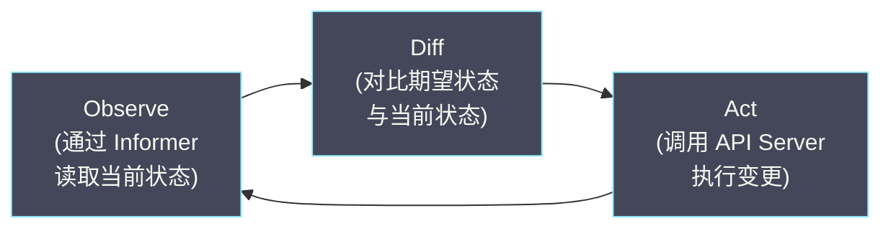
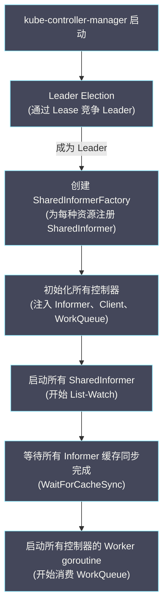

# 01 控制器模式与协调循环

**摘要：**

在 [[01 Kubernetes 的诞生与设计哲学]] 中我们提出了 K8s 的核心设计原则之一——**声明式 API + 控制器模式**。用户通过 YAML 声明"期望状态"（Desired State），控制器持续观察"当前状态"（Current State），计算两者的差异，然后执行操作将当前状态推向期望状态——这个循环被称为**协调循环（Reconcile Loop）**或**控制循环（Control Loop）**。K8s 中几乎所有的自动化行为——Deployment 的滚动更新、ReplicaSet 维持副本数、Node Controller 标记节点不健康、Garbage Collector 回收孤儿资源——都是由控制器驱动的。理解控制器模式是理解 K8s 所有运行时行为的基础。本文从控制论的角度剖析控制循环的本质，深入分析 Level-triggered 设计的意义、幂等性的硬性要求、乐观并发控制与冲突重试机制，最后介绍 kube-controller-manager 的架构——数十个控制器如何在一个进程中协作运行。

---

## 第 1 章 控制循环的本质

### 1.1 从恒温器说起

控制循环不是 K8s 发明的概念——它是控制论（Cybernetics）中最基础的模型。日常生活中最直观的例子是**恒温器**：

1. **观察（Observe）**：温度传感器读取当前室温——25°C
2. **比较（Diff）**：用户设定的目标温度是 22°C，差异 = +3°C
3. **执行（Act）**：打开空调制冷
4. **循环**：持续重复步骤 1-3，直到当前温度 ≈ 目标温度

K8s 的控制器遵循完全相同的模式：

1. **Observe**：通过 [[05 List-Watch 机制与 Informer 框架|Informer]] 获取资源的当前状态
2. **Diff**：比较当前状态与 Spec 中声明的期望状态
3. **Act**：调用 API Server 执行操作（创建/删除/更新资源），推动当前状态向期望状态靠拢
4. **Loop**：等待下一个事件触发，重复循环



### 1.2 以 ReplicaSet 控制器为例

用户创建了一个 ReplicaSet，声明 `replicas: 3`（期望 3 个 Pod）。ReplicaSet 控制器的协调逻辑：

```
当前 Pod 数 = 0（刚创建，没有任何 Pod）
期望 Pod 数 = 3
差异 = 3 - 0 = +3 → 需要创建 3 个 Pod

→ 创建 Pod-1, Pod-2, Pod-3
→ 等待下一次协调

当前 Pod 数 = 3（3 个 Pod 都在运行）
期望 Pod 数 = 3
差异 = 0 → 无需操作

→ 等待下一次协调

（Pod-2 所在节点故障，Pod-2 变为 Failed）
当前健康 Pod 数 = 2
期望 Pod 数 = 3
差异 = 3 - 2 = +1 → 需要创建 1 个新 Pod

→ 创建 Pod-4
```

控制器**不关心"为什么"当前状态与期望状态不一致**——它只关心"差异是什么"和"如何消除差异"。无论 Pod 是因为节点故障消失、被人手动删除、还是因为 OOM 被杀死，控制器的响应都是相同的："当前 Pod 不够，创建新的"。

### 1.3 声明式 vs 命令式

控制器模式与声明式 API 是一体的。理解两者的区别是理解 K8s 设计哲学的关键：

**命令式（Imperative）**："执行操作 X"——关注动作

```bash
# 命令式：告诉系统"做什么"
kubectl scale deployment web --replicas=5    # 把副本数改成 5
kubectl delete pod nginx                      # 删除这个 Pod
```

**声明式（Declarative）**："让状态变成 X"——关注结果

```yaml
# 声明式：告诉系统"我要什么"
apiVersion: apps/v1
kind: Deployment
metadata:
  name: web
spec:
  replicas: 5    # 我要 5 个副本
```

命令式操作是"一次性"的——你发出"创建 3 个 Pod"的命令后，如果一个 Pod 挂了，系统不会自动补建。声明式操作是"持续的"——你声明"我要 3 个 Pod"，控制器会**持续**确保有 3 个 Pod 在运行。

> [!note] 声明式的本质优势
> 声明式 API + 控制器模式的组合提供了一种**自愈能力**——系统持续将实际状态推向期望状态，无论中间发生了什么故障。这是 K8s 能够管理大规模分布式系统的根本原因——在数千节点的集群中，节点故障、网络分区、进程崩溃是常态，系统必须能够自动恢复，而不是依赖人工干预。

---

## 第 2 章 Level-triggered vs Edge-triggered

### 2.1 概念起源

**Level-triggered（电平触发）** 和 **Edge-triggered（边缘触发）** 是电子工程中的概念，被 K8s 的设计者借鉴到控制器的设计中。

**Edge-triggered**：在信号**变化的瞬间**触发动作——"当 Pod 从 Running 变为 Failed 时，执行 X"。

**Level-triggered**：根据信号的**当前状态**触发动作——"只要 Pod 处于 Failed 状态，就执行 X"。

### 2.2 为什么 K8s 选择 Level-triggered

K8s 的控制器是 Level-triggered 设计——Reconcile 函数的输入是"对象的当前状态"，而不是"发生了什么事件"。

**Edge-triggered 的问题**：如果控制器在处理"Pod-2 从 Running 变为 Failed"的事件时崩溃了，事件丢失。重启后，控制器不知道 Pod-2 曾经 Failed 过——它可能永远不会创建替代的 Pod。

**Level-triggered 的优势**：控制器重启后，Informer 会重新 List 所有资源，控制器检查**当前状态**——发现只有 2 个健康 Pod（期望 3 个），立即创建新 Pod。不需要知道"Pod-2 是什么时候 Failed 的"——只需要知道"现在少了一个 Pod"。

```
Edge-triggered（脆弱）：
  事件: "Pod-2 Failed" → 处理中崩溃 → 事件丢失 → 永远不创建新 Pod

Level-triggered（健壮）：
  状态: "当前 2 个 Pod，期望 3 个" → 创建新 Pod
  （无论是刚发生的还是 3 天前发生的，结果一样）
```

> [!info] Level-triggered 的代价
> Level-triggered 的代价是控制器可能执行"不必要"的检查——即使什么都没变，Re-sync 仍然会触发 Reconcile，Reconcile 发现"差异为 0"后不做任何操作。这点计算开销远小于 Edge-triggered 模型中事件丢失导致的数据不一致风险。

### 2.3 事件是优化，不是依赖

虽然控制器是 Level-triggered 设计，但它仍然利用 Watch 事件作为**触发信号**——"有事件来了，可能需要协调"。事件的作用是**提高响应速度**（不必等待下一次 Re-sync），但控制器的正确性不依赖事件的可靠送达。

```
事件到来 → 触发 Reconcile → 基于当前状态做决策（Level-triggered）
Re-sync 定时器 → 触发 Reconcile → 基于当前状态做决策（Level-triggered）
```

两条路径触发同一个 Reconcile 函数，Reconcile 函数只看当前状态——不关心是什么触发了它。

---

## 第 3 章 幂等性

### 3.1 为什么 Reconcile 必须幂等

**幂等性（Idempotency）** 指的是：对同一个输入执行多次，结果与执行一次完全相同。Reconcile 函数必须满足幂等性，原因有三：

**原因一：重复触发。** 同一个对象可能因为 Watch 事件、Re-sync、其他关联对象的变更等原因被多次触发 Reconcile。如果 Reconcile 不幂等——例如"每次被调用都创建一个 Pod"——那么一个 ReplicaSet 可能因为被触发 5 次而创建了 5 个额外的 Pod。

**原因二：并发冲突重试。** 当 Reconcile 尝试更新一个对象但遇到 409 Conflict（被其他控制器或用户同时修改），它会重新入队并稍后重试——相当于再次执行 Reconcile。

**原因三：控制器重启。** 控制器重启后 Informer 重新 List 所有对象，每个对象都会触发一次 Reconcile——即使这些对象在重启前已经被成功处理过。

### 3.2 如何实现幂等

**模式一：先检查再操作**

```
# 非幂等（危险）
创建 Pod "nginx-1"

# 幂等
if Pod "nginx-1" 不存在:
    创建 Pod "nginx-1"
else:
    不做任何事
```

**模式二：基于状态而非事件做决策**

```
# 非幂等（基于事件）
收到 "Pod Failed" 事件 → 创建新 Pod

# 幂等（基于状态）
计算 当前Pod数 vs 期望Pod数
if 当前 < 期望:
    创建 (期望 - 当前) 个 Pod
```

**模式三：使用 GenerateName 避免命名冲突**

```yaml
# 控制器创建 Pod 时使用 generateName 而非 name
metadata:
  generateName: "nginx-"    # API Server 自动追加随机后缀
```

---

## 第 4 章 乐观并发控制与冲突重试

### 4.1 并发冲突场景

在 K8s 集群中，多个控制器可能同时操作相关联的对象。例如：

- Deployment Controller 更新 ReplicaSet 的 `spec.replicas`
- HPA Controller 也在更新同一个 ReplicaSet 的 `spec.replicas`
- 用户通过 `kubectl scale` 也在更新同一个 ReplicaSet 的 `spec.replicas`

如果不做并发控制，后到的写入会覆盖先到的写入（Lost Update 问题）——HPA 将副本数从 3 改成 5，但用户紧接着从 3 改成 2（基于旧数据），最终副本数变成 2 而不是用户和 HPA 期望的混合结果。

### 4.2 ResourceVersion 机制

K8s 使用 [[06 etcd 与 Kubernetes 的状态存储|ResourceVersion]]（etcd 的 Revision）实现**乐观并发控制（Optimistic Concurrency Control）**：

1. 控制器从 Informer 读取对象（包含 `resourceVersion: "100"`）
2. 控制器修改对象并发送 Update 请求（携带 `resourceVersion: "100"`）
3. API Server 向 etcd 发起条件写入："如果当前 Revision == 100，则写入新值"
4. 如果在步骤 1-3 之间有其他控制器修改了该对象（Revision 变成了 101），条件不满足，etcd 拒绝写入
5. API Server 返回 **409 Conflict**

### 4.3 冲突重试策略

控制器收到 409 Conflict 后的标准处理方式：**重新入队**。

```go
func (c *Controller) reconcile(key string) error {
    // 从 Informer 缓存读取最新的对象
    obj, err := c.lister.Get(key)
    if err != nil {
        return err
    }
    
    // 基于最新状态计算变更
    newObj := obj.DeepCopy()
    newObj.Spec.Replicas = calculateDesiredReplicas(newObj)
    
    // 尝试更新
    _, err = c.client.Update(ctx, newObj)
    if errors.IsConflict(err) {
        // 409 Conflict: 对象已被其他人修改
        // 不需要特殊处理——返回 error 后 WorkQueue 会自动重新入队
        // 下次 Reconcile 时 Informer 缓存已经更新为最新版本
        return err
    }
    return err
}
```

**关键点**：控制器不需要手动"重新获取最新版本再重试"——当 409 发生时，Informer 的 Watch 通常已经收到了导致冲突的那次更新，本地缓存已经是最新版本。下一次 Reconcile 从缓存中读取到的就是最新的对象，基于最新状态重新计算，冲突概率大幅降低。

> [!warning] 避免 Read-Modify-Write 循环中的陈旧读取
> Reconcile 函数中应从 Informer 缓存（Lister）读取对象，而不是通过 API Server 的 `client.Get()` 直接读取。原因：
> - Lister 读取是内存操作，零延迟、零 API Server 压力
> - `client.Get()` 是 HTTP 调用，增加延迟和 API Server 负担
> - 对于乐观并发控制，Lister 的"稍旧"数据不影响正确性——如果冲突发生，409 会触发重试

---

## 第 5 章 kube-controller-manager 的架构

### 5.1 "一个进程，数十个控制器"

`kube-controller-manager` 是一个**单进程**，内部运行了 K8s 所有内置控制器——Deployment Controller、ReplicaSet Controller、Node Controller、Endpoint Controller、Namespace Controller、Garbage Collector 等数十个控制器。

为什么不把每个控制器作为独立进程部署？

**资源效率**：每个控制器都需要 Watch 多种资源。如果独立部署，每个进程各自创建 Informer——重复的 Watch 连接和本地缓存会浪费大量内存和连接。单进程中所有控制器通过 [[05 List-Watch 机制与 Informer 框架|SharedInformerFactory]] 共享 Informer，一种资源只需要一个 Watch 连接和一份缓存。

**部署简化**：一个进程意味着一个 Deployment、一个镜像、一组配置——运维复杂度远低于数十个独立进程。

### 5.2 Controller Manager 的启动流程



### 5.3 Leader Election

虽然可以部署多个 kube-controller-manager 副本（高可用），但**同一时刻只有一个副本在运行控制器**——通过 Leader Election 保证。

如果多个副本同时运行控制器，它们会做出重复甚至冲突的操作——例如两个 ReplicaSet Controller 都发现 Pod 不够，各自创建 Pod，导致 Pod 数量超过期望值。

Leader Election 使用 [[06 etcd 与 Kubernetes 的状态存储|Lease]] 对象：

```yaml
apiVersion: coordination.k8s.io/v1
kind: Lease
metadata:
  name: kube-controller-manager
  namespace: kube-system
spec:
  holderIdentity: "master-1_abc123"   # 当前 Leader 的标识
  leaseDurationSeconds: 15             # Lease 有效期
  renewTime: "2026-03-04T10:00:05Z"   # 最后一次续租时间
  acquireTime: "2026-03-04T09:30:00Z" # 获得 Lease 的时间
```

Leader 持续每隔几秒续租 Lease。如果 Leader 崩溃，Lease 过期后（默认 15 秒），其他副本竞争获取 Lease 成为新的 Leader。切换期间（15-30 秒）控制器不运行——这段时间内集群状态不会被主动协调，但已有的 Pod 和服务不受影响。

### 5.4 WaitForCacheSync 的重要性

所有控制器启动后的第一件事是 **WaitForCacheSync**——等待所有 Informer 的本地缓存与 API Server 完成初始同步（Initial List 完成）。

如果控制器在缓存同步完成前就开始工作，它看到的"当前状态"是不完整的——例如 Informer 只同步了 1000 个 Pod 中的 200 个，控制器误以为只有 200 个 Pod 存在，可能错误地创建 800 个新 Pod。

WaitForCacheSync 确保控制器开始工作时，本地缓存已经包含了所有资源的完整快照。

---

## 第 6 章 内置控制器一览

### 6.1 核心控制器

| 控制器 | 监听的资源 | 职责 |
| :--- | :--- | :--- |
| **Deployment Controller** | Deployment, ReplicaSet | 管理滚动更新和回滚（详见 [[02 Deployment 控制器深度解析]]）|
| **ReplicaSet Controller** | ReplicaSet, Pod | 维持指定数量的 Pod 副本 |
| **StatefulSet Controller** | StatefulSet, Pod, PVC | 管理有状态应用的有序部署和更新（详见 [[03 StatefulSet 控制器深度解析]]）|
| **DaemonSet Controller** | DaemonSet, Pod, Node | 确保每个节点运行一个 Pod 副本（详见 [[04 DaemonSet Job CronJob 控制器解析]]）|
| **Job Controller** | Job, Pod | 管理一次性任务的执行和完成 |
| **CronJob Controller** | CronJob, Job | 按 Cron 表达式定期创建 Job |

### 6.2 辅助控制器

| 控制器 | 职责 |
| :--- | :--- |
| **Node Controller** | 监控节点健康状态，标记不健康节点，驱逐 Pod |
| **Endpoint Controller** | 为 Service 维护 Endpoints 列表（匹配 Label 的 Pod IP） |
| **EndpointSlice Controller** | Endpoint Controller 的改进版，将大 Endpoints 拆分为多个 EndpointSlice |
| **Namespace Controller** | 删除 Namespace 时清理其下所有资源 |
| **ServiceAccount Controller** | 为每个 Namespace 创建默认的 ServiceAccount |
| **Garbage Collector** | 基于 [[04 Label Selector 与松耦合设计|OwnerReference]] 级联删除资源 |
| **ResourceQuota Controller** | 跟踪 Namespace 的资源使用量，与 [[04 准入控制器深度解析|ResourceQuota 准入控制器]]配合 |
| **PV Controller** | 管理 PersistentVolume 和 PersistentVolumeClaim 的绑定 |
| **TTL Controller** | 清理过期的 Job 和已完成的 Pod |

### 6.3 控制器之间的协作

K8s 的控制器**不直接通信**——它们通过 API Server 间接协作。每个控制器只关注自己负责的资源，通过 Watch 感知其他控制器的操作结果。

以 Deployment 的滚动更新为例：

```
Deployment Controller:
  监听 Deployment 变更 → 创建新的 ReplicaSet → 更新旧 ReplicaSet 的 replicas

ReplicaSet Controller:
  监听 ReplicaSet 变更 → 创建/删除 Pod 以匹配 replicas 数

Scheduler:
  监听未调度的 Pod → 选择节点 → 更新 Pod 的 nodeName

kubelet:
  监听分配到本节点的 Pod → 拉取镜像 → 启动容器 → 更新 Pod status
```

四个控制器各自独立工作，通过共享的 API 对象状态协调——Deployment Controller 不知道 ReplicaSet Controller 的存在，ReplicaSet Controller 不知道 Scheduler 的存在。这种松耦合设计使得每个控制器可以独立开发、测试和部署。

---

## 第 7 章 控制器编写的黄金法则

### 7.1 十条法则

基于 K8s 社区的最佳实践和 controller-runtime 框架的设计指导，控制器编写需要遵循以下黄金法则：

**法则一：Reconcile 必须幂等。** 无论被调用多少次，结果必须一致。

**法则二：基于当前状态做决策，不基于事件。** Reconcile 的输入是对象的 key（namespace/name），通过 Lister 读取当前状态做决策。不要在 Event Handler 中执行业务逻辑。

**法则三：一次 Reconcile 只做一步。** 不要在一次 Reconcile 中尝试完成所有工作——完成一步后返回，等待下一次触发再做下一步。这样即使某步失败，前面的步骤不会回滚。

**法则四：返回 error 意味着重新入队。** Reconcile 返回 error 后，WorkQueue 会按退避策略重新入队。只有在确实需要重试时才返回 error——对于"对象已被删除"这类预期情况，不应该返回 error。

**法则五：更新 Status 和 Spec 分开。** 不要在一次 Update 中同时修改 Spec 和 Status——使用 Status 子资源单独更新 Status。

**法则六：避免不必要的更新。** 在 Update 之前比较新旧对象——如果没有变化，不要发送 Update 请求（避免触发无意义的 Watch 事件和 etcd 写入）。

**法则七：使用 OwnerReference 管理所有权。** 控制器创建的子资源应设置 OwnerReference 指向父资源——确保父资源被删除时子资源被自动清理。

**法则八：Watch 关联资源时使用 EnqueueRequestForOwner。** 当子资源变更时，应将**父资源**的 key 入队（而不是子资源的 key），让 Reconcile 重新评估父资源的状态。

**法则九：处理对象不存在的情况。** Reconcile 被触发时对象可能已经被删除——Lister 返回 NotFound 应优雅处理（执行清理逻辑或直接返回 nil）。

**法则十：使用 Finalizer 处理外部资源清理。** 如果控制器管理了 K8s 集群外部的资源（如云上的负载均衡器、DNS 记录），应添加 [[04 Label Selector 与松耦合设计|Finalizer]] 确保外部资源在对象删除前被清理。

---

## 第 8 章 总结

本文建立了对 K8s 控制器模式的系统性认知：

- **控制循环**：Observe → Diff → Act 的持续循环，将当前状态推向期望状态
- **Level-triggered**：基于当前状态（而非事件）做决策，事件丢失不影响正确性
- **幂等性**：Reconcile 必须可重复执行，结果一致——先检查再操作、基于状态而非事件决策
- **乐观并发**：通过 ResourceVersion 实现条件写入，409 Conflict 自动重试
- **Controller Manager**：单进程运行数十个控制器，SharedInformer 共享缓存，Leader Election 保证单实例运行
- **控制器协作**：通过共享 API 对象状态间接协作，完全松耦合

后续三篇文章将深入具体的内置控制器：[[02 Deployment 控制器深度解析|Deployment]]、[[03 StatefulSet 控制器深度解析|StatefulSet]]、[[04 DaemonSet Job CronJob 控制器解析|DaemonSet/Job/CronJob]]。

---

## 参考资料

1. Kubernetes Documentation - Controllers：https://kubernetes.io/docs/concepts/architecture/controller/
2. Kubernetes Documentation - kube-controller-manager：https://kubernetes.io/docs/reference/command-line-tools-reference/kube-controller-manager/
3. Kubernetes Source Code - pkg/controller：https://github.com/kubernetes/kubernetes/tree/master/pkg/controller
4. Michael Hausenblas, Stefan Schimanski (2019). *Programming Kubernetes*. O'Reilly, Chapter 6.
5. Kubernetes Community - Writing Controllers：https://github.com/kubernetes/community/blob/master/contributors/devel/sig-api-machinery/controllers.md
6. Tim Hockin (2019). *Kubernetes Design Principles*. KubeCon EU.

---

> [!note] 思考题
> 1. Controller Manager 运行所有内置控制器（Deployment Controller、ReplicaSet Controller、Node Controller 等）。每个控制器通过'调谐循环'（Reconcile Loop）将实际状态向期望状态收敛。如果调谐过程中出错（如创建 Pod 失败），控制器会重试——重试间隔使用指数退避。在什么场景下无限重试会造成问题（如资源配额不足导致永远无法创建 Pod）？
> 2. Deployment Controller → ReplicaSet Controller → Pod 的控制层级。滚动更新时，Deployment Controller 创建新 ReplicaSet 并逐步增加副本数，同时减少旧 ReplicaSet 的副本数。`maxSurge` 和 `maxUnavailable` 如何控制更新的速度和可用性？如果新版本的 Pod 一直无法就绪（如 CrashLoopBackOff），滚动更新会一直卡住吗？
> 3. Controller 使用 Informer（本地缓存 + Watch）而非直接查询 API Server——减少了 API Server 的压力。Informer 的本地缓存可能与 etcd 不一致（有短暂延迟）。在什么场景下这种延迟会导致控制器做出错误决策？`Resync` 机制如何定期全量同步来修复不一致？
