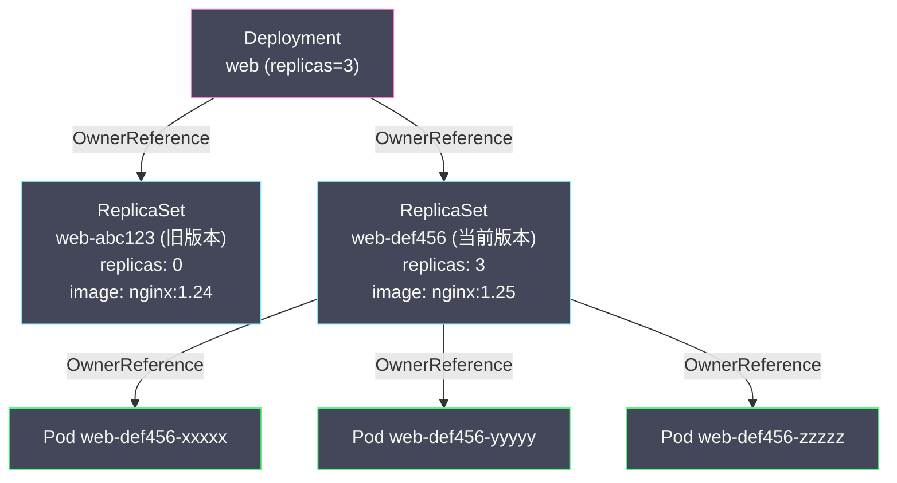
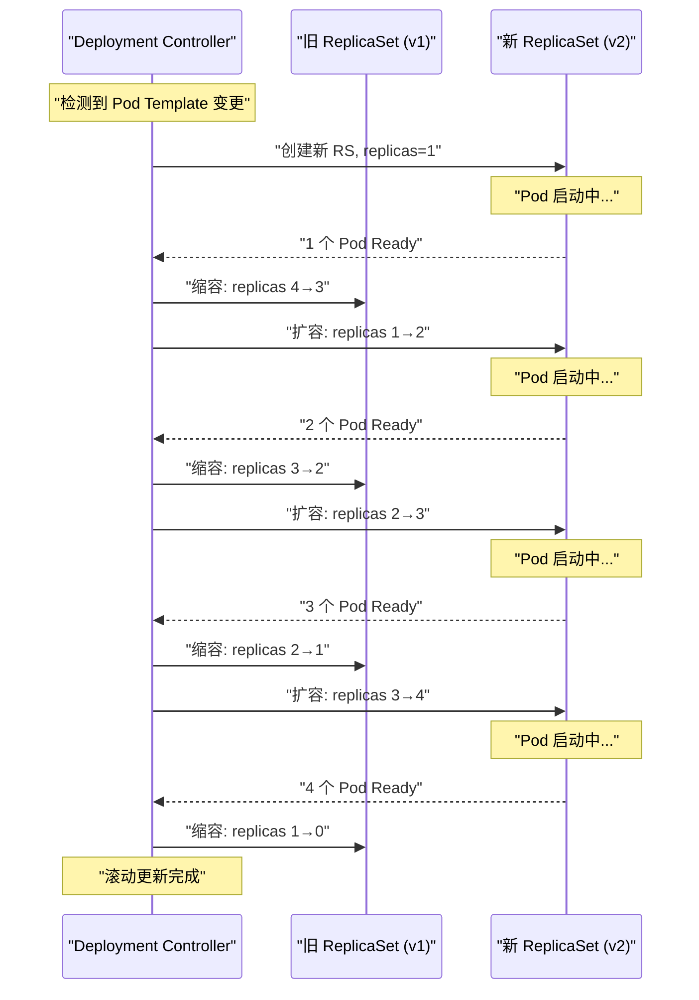

# 02 Deployment 控制器深度解析

**摘要：**

Deployment 是 K8s 中**使用频率最高的工作负载对象**——几乎所有无状态应用都通过 Deployment 部署。在 [[05 核心工作负载对象深度解析]] 中我们介绍了 Deployment 的基本概念和使用方式，本文从控制器的视角深入其**内部实现机制**——Deployment Controller 如何通过中间层 ReplicaSet 实现滚动更新、如何控制更新速度（maxSurge / maxUnavailable）、如何保留历史版本实现回滚、以及暂停/恢复等高级功能。理解 Deployment Controller 的工作原理，不仅能让你在生产环境中更精准地配置更新策略，也为理解 K8s 其他控制器的设计模式提供了范例。

---

## 第 1 章 Deployment → ReplicaSet → Pod 的三级结构

### 1.1 为什么需要中间层 ReplicaSet

一个直觉的问题是：Deployment 为什么不直接管理 Pod？为什么要引入 ReplicaSet 这个中间层？

答案在于**版本管理**。Deployment 的核心能力是滚动更新——将 Pod 从旧版本（如 nginx:1.24）滚动替换到新版本（如 nginx:1.25）。在更新过程中，**旧版本和新版本的 Pod 同时存在**——需要两个独立的"副本管理器"分别管理新旧两组 Pod 的副本数。ReplicaSet 就是这个"副本管理器"。

每次 Deployment 的 Pod 模板（`spec.template`）发生变化时，Deployment Controller 创建一个**新的 ReplicaSet**，逐步扩大新 ReplicaSet 的副本数、缩小旧 ReplicaSet 的副本数——这就是滚动更新。旧的 ReplicaSet（副本数已缩为 0）被保留下来，作为**历史版本的记录**，用于支持回滚。



### 1.2 ReplicaSet 的 Pod Template Hash

Deployment Controller 通过 **pod-template-hash** Label 区分不同版本的 ReplicaSet 和 Pod。当创建新的 ReplicaSet 时，Controller 对 Pod 模板的内容计算哈希值，将其作为 Label 注入到 ReplicaSet 和它管理的 Pod 上。

```yaml
# ReplicaSet 的 Label
metadata:
  labels:
    app: web
    pod-template-hash: "def456"   # Pod 模板的哈希值

# 该 ReplicaSet 管理的 Pod 的 Label
metadata:
  labels:
    app: web
    pod-template-hash: "def456"   # 与 ReplicaSet 一致
```

`pod-template-hash` 确保了：
- 不同版本的 ReplicaSet 有不同的 hash → 它们的 [[04 Label Selector 与松耦合设计|Label Selector]] 互不冲突
- 一个 ReplicaSet 只管理与它 hash 匹配的 Pod → 不会误管理其他版本的 Pod

### 1.3 Deployment 不直接操作 Pod

**Deployment Controller 只操作 ReplicaSet**——创建、缩放、删除 ReplicaSet。Pod 的创建和删除由 **ReplicaSet Controller** 负责。这是 [[01 控制器模式与协调循环|控制器之间松耦合协作]]的典型体现：

```
用户: 更新 Deployment 的镜像
  → Deployment Controller: 创建新 ReplicaSet，调整新旧 ReplicaSet 的 replicas
    → ReplicaSet Controller: 根据 replicas 创建/删除 Pod
      → Scheduler: 为新 Pod 选择节点
        → kubelet: 拉取镜像，启动容器
```

每个控制器只负责自己的层级，通过 Watch 感知其他层级的状态变化。

---

## 第 2 章 滚动更新的执行过程

### 2.1 更新策略

Deployment 支持两种更新策略：

| 策略 | 说明 |
| :--- | :--- |
| **RollingUpdate**（默认）| 逐步替换旧版本 Pod，保持服务持续可用 |
| **Recreate** | 先删除所有旧 Pod，再创建新 Pod。更新期间服务完全不可用 |

Recreate 策略适用于不能同时运行两个版本的应用（如使用了独占的文件锁或数据库 Schema 不兼容）。绝大多数场景应使用 RollingUpdate。

### 2.2 maxSurge 与 maxUnavailable

RollingUpdate 策略通过两个参数控制更新速度：

**maxSurge**：滚动更新期间，**超出期望副本数的最大 Pod 数量**。可以是绝对数字或百分比。

**maxUnavailable**：滚动更新期间，**不可用的最大 Pod 数量**。可以是绝对数字或百分比。

这两个参数的组合决定了更新的"攻击性"——更大的 maxSurge 意味着更快的更新（同时运行更多 Pod 消耗更多资源），更大的 maxUnavailable 意味着更激进的更新（允许更多 Pod 同时不可用）。

**默认值**：`maxSurge: 25%`, `maxUnavailable: 25%`

以 `replicas=4, maxSurge=1, maxUnavailable=1` 为例：

- 期望副本数 = 4
- 最大 Pod 总数 = 4 + 1 (maxSurge) = 5
- 最小可用 Pod 数 = 4 - 1 (maxUnavailable) = 3

### 2.3 滚动更新的步骤

以 `replicas=4, maxSurge=1, maxUnavailable=1` 从 v1 更新到 v2 为例：

```
初始状态：
  旧 RS (v1): replicas=4, ready=4
  新 RS (v2): 不存在
  总 Pod: 4 (全部 v1)

步骤 1: 创建新 RS，扩容新 RS
  旧 RS (v1): replicas=4, ready=4
  新 RS (v2): replicas=1, ready=0 → 等待 Pod 就绪
  总 Pod: 5 (4个v1 + 1个v2)  ← 不超过 maxSurge 限制 (4+1=5)

步骤 2: 新 Pod 就绪后，缩旧 RS
  旧 RS (v1): replicas=3, ready=3  ← 缩掉 1 个
  新 RS (v2): replicas=1, ready=1
  总 Pod: 4 (3个v1 + 1个v2), 可用: 4 ← 满足 maxUnavailable

步骤 3: 继续扩新缩旧
  旧 RS (v1): replicas=3, ready=3
  新 RS (v2): replicas=2, ready=1 → 等待第 2 个 Pod 就绪
  总 Pod: 5

步骤 4-7: 重复扩新缩旧...

最终状态：
  旧 RS (v1): replicas=0  (保留用于回滚)
  新 RS (v2): replicas=4, ready=4
  总 Pod: 4 (全部 v2)
```



### 2.4 更新过程中的就绪检查

Deployment Controller 在扩容新 RS 和缩容旧 RS 时，会检查新 Pod 是否**Ready**——即 Pod 的所有容器都通过了 `readinessProbe`。如果新 Pod 一直不 Ready（如镜像拉取失败、应用启动崩溃），Controller 不会继续缩旧 RS——**更新被阻塞**，旧版本的 Pod 继续服务。

这是一个重要的安全机制——如果新版本有 bug 导致启动失败，滚动更新会"卡住"而不是把所有旧 Pod 都杀掉。运维人员看到更新卡住后可以执行回滚。

> [!warning] readinessProbe 的重要性
> 如果 Pod 没有配置 readinessProbe，K8s 会在容器进程启动后立即认为 Pod 是 Ready 的——即使应用还没有完成初始化。这会导致：
> - Deployment 误以为新 Pod 已就绪，过早地缩掉旧 Pod
> - Service 将流量路由到还没准备好的 Pod
> - 用户看到 502 / Connection Refused 等错误
>
> **生产环境的 Deployment 必须配置 readinessProbe。**

### 2.5 progressDeadlineSeconds

`spec.progressDeadlineSeconds`（默认 600 秒 = 10 分钟）定义了 Deployment 更新的超时时间。如果在这个时间内更新没有取得进展（没有新的 Pod 变为 Ready），Deployment 的 status 中 `Progressing` Condition 变为 `False`，Deployment 被标记为"更新失败"。

注意：这只是一个**状态标记**——Deployment Controller 不会自动回滚。它会继续尝试让新 Pod Ready。运维人员需要通过告警发现更新失败并手动决定是修复问题还是回滚。

---

## 第 3 章 回滚机制

### 3.1 Revision 与 ReplicaSet 历史

每次 Deployment 的 Pod 模板变更（触发新 ReplicaSet 创建）都会增加一个 **Revision 号**。每个 ReplicaSet 的 Annotation 中记录了它对应的 Revision：

```yaml
# ReplicaSet 的 Annotation
metadata:
  annotations:
    deployment.kubernetes.io/revision: "3"
```

Deployment 的 `spec.revisionHistoryLimit`（默认 10）控制保留多少个旧 ReplicaSet。超出限制的最旧 ReplicaSet（replicas=0）会被删除。

```bash
# 查看 Deployment 的历史版本
kubectl rollout history deployment/web
# REVISION  CHANGE-CAUSE
# 1         初始部署 nginx:1.23
# 2         更新到 nginx:1.24
# 3         更新到 nginx:1.25 (当前)

# 查看特定 Revision 的详情
kubectl rollout history deployment/web --revision=2
```

### 3.2 执行回滚

回滚操作本质上是**将 Deployment 的 Pod 模板恢复为某个旧 ReplicaSet 的 Pod 模板**——然后触发一次正常的滚动更新（从当前版本滚动到"旧版本"）。

```bash
# 回滚到上一个版本
kubectl rollout undo deployment/web

# 回滚到指定版本
kubectl rollout undo deployment/web --to-revision=1
```

回滚的内部流程：

1. Deployment Controller 找到目标 Revision 对应的旧 ReplicaSet
2. 将该 ReplicaSet 的 Pod 模板复制回 Deployment 的 `spec.template`
3. 这触发了一次"新的"滚动更新——目标 ReplicaSet 变成"新" RS 被扩容，当前 RS 变成"旧" RS 被缩容
4. 目标 ReplicaSet 的 Revision 号更新为最新值

**回滚不是"回到过去"——而是"用过去的配置做一次新的滚动更新"。** 它遵循与正常更新完全相同的 maxSurge / maxUnavailable 策略，保证服务的平滑过渡。

### 3.3 revisionHistoryLimit 的权衡

- **设置过大**：保留了太多旧 ReplicaSet（虽然 replicas=0，不消耗计算资源），但每个 ReplicaSet 对象本身占用 etcd 空间，大量旧 RS 也会让 `kubectl get rs` 输出变得冗长
- **设置过小（如 0）**：所有旧 ReplicaSet 被删除，无法回滚到任何历史版本
- **推荐值**：3-5（保留最近几个版本即可）

---

## 第 4 章 暂停与恢复

### 4.1 使用场景

在某些场景下，你需要对 Deployment 做**多次修改**，但不希望每次修改都触发一次滚动更新——例如同时修改镜像版本、环境变量和资源限制。

如果直接连续修改三次，Deployment Controller 会触发三次滚动更新（每次 Pod 模板变更都创建新 RS）——效率低下。**暂停（Pause）** 功能允许你暂时冻结 Deployment 的更新逻辑——所有对 Pod 模板的修改只会更新 Deployment 对象本身，但不会触发 ReplicaSet 的创建和滚动更新。修改完成后**恢复（Resume）**，Controller 一次性执行所有变更。

```bash
# 暂停 Deployment
kubectl rollout pause deployment/web

# 做多次修改
kubectl set image deployment/web web=nginx:1.26
kubectl set resources deployment/web -c web --limits=cpu=500m,memory=256Mi
kubectl set env deployment/web -c web APP_VERSION=v2

# 恢复——所有修改合并为一次滚动更新
kubectl rollout resume deployment/web
```

### 4.2 暂停状态下的行为

暂停状态下：
- Deployment 对象可以正常修改
- **不会**创建新的 ReplicaSet
- **不会**触发滚动更新
- **不会**触发回滚
- 现有的 Pod 不受影响

恢复后，Controller 检测到 Deployment 的 Pod 模板与当前活跃 RS 不一致，创建新 RS 并执行一次滚动更新。

---

## 第 5 章 Deployment Controller 的 Reconcile 逻辑

### 5.1 核心流程

Deployment Controller 的 Reconcile 函数在每次被触发时执行以下步骤：

```
1. 获取 Deployment 对象
2. 列出该 Deployment 拥有的所有 ReplicaSet（通过 OwnerReference）
3. 列出所有 ReplicaSet 管理的 Pod（计算 Ready Pod 数量）
4. 判断当前状态：
   a. 如果 Deployment 被暂停 → 仅同步 status，不执行更新
   b. 如果正在进行滚动更新 → 继续推进（扩新缩旧）
   c. 如果 Pod 模板未变更 → 同步副本数（Scale）
   d. 如果 Pod 模板变更 → 触发新的滚动更新
5. 更新 Deployment 的 status（包括 Conditions、ReadyReplicas 等）
```

### 5.2 ReplicaSet 的匹配与认领

Deployment Controller 通过两个维度关联 ReplicaSet：

**Label Selector 匹配**：ReplicaSet 的 Label 必须匹配 Deployment 的 `spec.selector`。

**OwnerReference 认领**：匹配 Label 但没有 OwnerReference（或 OwnerReference 不指向当前 Deployment）的 ReplicaSet 会被"认领"——Controller 为其添加 OwnerReference。这处理了手动创建的 RS 或从旧版本 K8s 升级的场景。

反过来，如果一个 RS 有指向当前 Deployment 的 OwnerReference，但 Label 不再匹配（Deployment 的 selector 被修改了），Controller 会"释放"该 RS——移除 OwnerReference。

### 5.3 Scale 操作

当 Deployment 的 `spec.replicas` 变更（但 Pod 模板未变）时，Controller 执行 Scale 操作：

- 找到当前活跃的 ReplicaSet（Pod 模板与 Deployment 一致的那个）
- 将该 RS 的 `spec.replicas` 设为 Deployment 的 `spec.replicas`
- ReplicaSet Controller 负责实际的 Pod 创建/删除

如果正在进行滚动更新，Scale 操作会**按比例分配**给新旧 RS——确保新旧 RS 的副本数比例与当前更新进度一致。

---

## 第 6 章 生产环境的更新策略配置

### 6.1 常见的策略组合

| 场景 | maxSurge | maxUnavailable | 效果 |
| :--- | :--- | :--- | :--- |
| **零停机更新**（资源充裕）| 25% | 0 | 先扩新再缩旧，始终保持所有旧 Pod 可用 |
| **快速更新**（可接受短暂降级）| 50% | 50% | 激进替换，更新速度快但短暂时间可用 Pod 减少 |
| **保守更新**（关键服务）| 1 | 0 | 一次只增加 1 个新 Pod，确认 Ready 后才缩旧 |
| **金丝雀式**（手动控制）| 1 | 0 + Pause | 暂停后扩 1 个新 Pod 观察，确认无问题后恢复 |

### 6.2 与 HPA 的交互

**HPA（Horizontal Pod Autoscaler）** 通过修改 Deployment 的 `spec.replicas` 实现自动扩缩容。HPA 与滚动更新可能产生冲突：

- 滚动更新期间，HPA 检测到 CPU 使用率变化（因为新旧 Pod 交替），可能触发 Scale 操作
- Scale 操作会修改 Deployment 的 replicas，与 Deployment Controller 的滚动更新逻辑交叉

K8s 的处理方式是：滚动更新期间 HPA 仍然正常工作，Deployment Controller 在执行滚动更新时会考虑当前的 replicas（可能已被 HPA 修改）。两者通过乐观并发控制（ResourceVersion）协调——如果发生冲突，各自重试。

### 6.3 minReadySeconds

`spec.minReadySeconds`（默认 0）定义了新 Pod 在变为 Ready 后，还需要等待多少秒才算"Available"——Deployment Controller 在这段时间内不会继续缩旧 RS。

这提供了一个观察窗口——如果新 Pod 在 Ready 后的几秒内就崩溃了（如启动后短暂正常然后 OOM），minReadySeconds 可以防止 Controller 过早地认为更新成功。

```yaml
spec:
  minReadySeconds: 30    # Pod Ready 后再等 30 秒
  strategy:
    type: RollingUpdate
    rollingUpdate:
      maxSurge: 1
      maxUnavailable: 0
```

---

## 第 7 章 总结

本文深入剖析了 Deployment Controller 的工作机制：

- **三级结构**：Deployment → ReplicaSet → Pod，ReplicaSet 是版本管理的基本单元，pod-template-hash 确保版本隔离
- **滚动更新**：maxSurge 控制超出的最大 Pod 数、maxUnavailable 控制不可用的最大 Pod 数，两者组合决定更新速度
- **就绪检查**：新 Pod 必须通过 readinessProbe 才算 Ready，否则更新阻塞——防止错误版本全量上线
- **回滚**：旧 ReplicaSet 保留作为历史版本，回滚是"用旧配置做一次新的滚动更新"
- **暂停/恢复**：批量修改 Deployment 配置，一次性触发更新
- **生产配置**：零停机更新使用 maxUnavailable=0，必须配置 readinessProbe 和 minReadySeconds

下一篇 [[03 StatefulSet 控制器深度解析]] 将分析有状态应用的控制器——StatefulSet 如何在"稳定标识 + 有序操作 + 持久存储"的约束下实现部署和更新。

---

## 参考资料

1. Kubernetes Documentation - Deployments：https://kubernetes.io/docs/concepts/workloads/controllers/deployment/
2. Kubernetes Documentation - Rolling Update：https://kubernetes.io/docs/tutorials/kubernetes-basics/update/update-intro/
3. Kubernetes Source Code - pkg/controller/deployment：https://github.com/kubernetes/kubernetes/tree/master/pkg/controller/deployment
4. Kubernetes Documentation - Pod Lifecycle (readinessProbe)：https://kubernetes.io/docs/concepts/workloads/pods/pod-lifecycle/#container-probes
5. Kubernetes Enhancement Proposal - Deployment：https://github.com/kubernetes/design-proposals-archive/blob/main/apps/deployment.md
