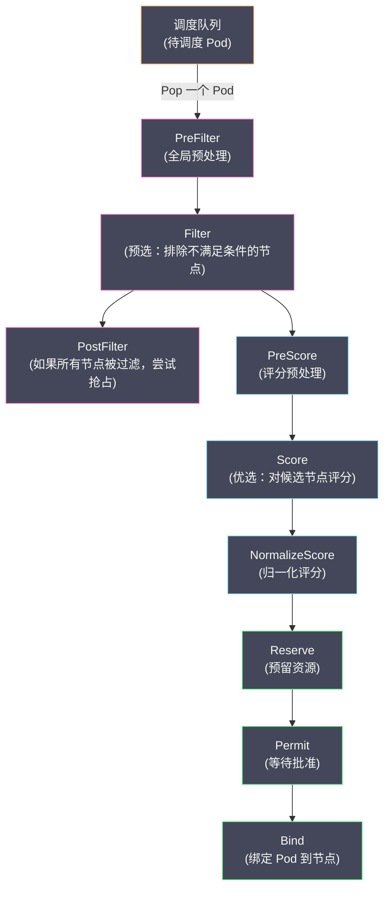

# 05 Scheduler 调度流程与算法

**摘要：**

当一个 Pod 被创建但尚未分配到节点时（`spec.nodeName` 为空），**kube-scheduler** 负责为它选择一个最合适的节点——这个过程就是**调度（Scheduling）**。调度看似简单（"挑个节点放上去"），实际上是一个多维度的约束求解问题：节点是否有足够的 CPU 和内存？Pod 是否要求与特定 Pod 在同一节点（亲和性）或不在同一节点（反亲和性）？节点是否有 GPU 或 SSD 等特殊资源？Pod 是否能容忍节点上的污点（Taint）？在满足所有硬性约束的节点中，哪个节点的资源利用率最均衡？本文从 Scheduler 的整体架构出发，深入 **Scheduling Framework** 的插件化设计，逐一分析 Filter（预选）和 Score（优选）两个核心阶段的算法，然后覆盖亲和性/反亲和性、拓扑分散约束、Taint/Toleration、优先级与抢占等关键调度特性。

---

## 第 1 章 Scheduler 的整体架构

### 1.1 Scheduler 是一种特殊的控制器

从 [[01 控制器模式与协调循环|控制器模式]] 的角度看，Scheduler 就是一个控制器：

- **Observe**：通过 Informer Watch 未调度的 Pod（`spec.nodeName` 为空）和所有 Node
- **Diff**：Pod 没有 nodeName → 需要调度
- **Act**：选择最佳节点，通过 Binding API 将 Pod 绑定到节点（设置 `spec.nodeName`）

Scheduler 独立于 kube-controller-manager 运行（虽然在概念上它也是一种控制器）——因为调度逻辑的复杂度和性能要求使得它适合作为独立进程。

### 1.2 调度的一次完整流程



**核心阶段**：

1. **Filter（预选）**：遍历所有节点，排除不满足 Pod 需求的节点（如资源不足、Taint 不匹配）。输出是"候选节点列表"。
2. **Score（优选）**：对候选节点评分（0-100 分），选择得分最高的节点。如果多个节点得分相同，随机选择。
3. **Bind（绑定）**：向 API Server 发送 Binding 请求，设置 Pod 的 `spec.nodeName`。

### 1.3 Scheduling Framework

K8s 1.19+ 的 Scheduler 基于 **Scheduling Framework** 构建——一种插件化架构。调度流程被分解为多个**扩展点（Extension Point）**，每个扩展点可以注册多个**插件（Plugin）**。内置的调度逻辑（资源检查、亲和性、Taint 等）都以插件形式实现。

| 扩展点 | 阶段 | 说明 |
| :--- | :--- | :--- |
| **PreFilter** | Filter 前 | 全局预处理——计算 Pod 的聚合信息供 Filter 使用 |
| **Filter** | 预选 | 逐节点检查是否满足 Pod 的硬性约束 |
| **PostFilter** | Filter 后 | 当所有节点被过滤时触发——尝试抢占（Preemption）|
| **PreScore** | Score 前 | 评分预处理——计算全局信息供 Score 使用 |
| **Score** | 优选 | 对每个候选节点评分 |
| **NormalizeScore** | Score 后 | 将各插件的原始分数归一化到 0-100 |
| **Reserve** | 绑定前 | 预留节点资源（乐观假设调度成功）|
| **Permit** | 绑定前 | 等待外部批准（如 Gang Scheduling 等待所有 Pod 就绪）|
| **PreBind** | 绑定前 | 绑定前的准备工作（如挂载 Volume）|
| **Bind** | 绑定 | 将 Pod 绑定到节点 |
| **PostBind** | 绑定后 | 绑定后的清理工作 |

插件化设计使得调度器可以在不修改核心代码的情况下扩展——用户可以编写自定义插件注册到任意扩展点。

---

## 第 2 章 Filter 阶段：预选

### 2.1 Filter 的核心逻辑

Filter 阶段遍历所有节点，对每个节点运行所有 Filter 插件。如果任一插件返回"不满足"，该节点被排除。只有通过**所有** Filter 插件的节点才进入候选列表。

### 2.2 关键 Filter 插件

#### NodeResourcesFit

**检查节点的可用资源是否满足 Pod 的 `resources.requests`。**

Scheduler 维护了每个节点的资源使用快照——已分配的 CPU/Memory requests 总和（不是实际使用量，是所有 Pod 的 requests 之和）。

```
节点 worker-1:
  Allocatable:  CPU=4000m, Memory=8Gi
  已分配 Requests: CPU=2500m, Memory=5Gi
  可分配: CPU=1500m, Memory=3Gi

Pod 请求: CPU=1000m, Memory=2Gi
→ 1500m ≥ 1000m 且 3Gi ≥ 2Gi → 通过

Pod 请求: CPU=2000m, Memory=2Gi
→ 1500m < 2000m → 不通过，节点被排除
```

> [!info] 为什么用 Requests 而非实际使用量
> Scheduler 基于 Requests（声明的需求量）而非实际使用量做调度决策。原因是实际使用量是动态变化的——此刻 CPU 空闲不代表下一秒还空闲。Requests 是一种**资源预留（Reservation）**——保证了 Pod 在任何时刻都能使用到 Requests 声明的资源量。这避免了"调度时节点看似空闲，但运行后资源争用"的问题。

#### NodePorts

检查 Pod 请求的 `hostPort` 在节点上是否已被占用。两个 Pod 不能在同一节点上使用相同的 hostPort。

#### PodToleratesNodeTaints

检查 Pod 的 `tolerations` 是否容忍节点上的所有 `taints`（详见第 4 章）。

#### NodeAffinity

检查 Pod 的 `nodeAffinity.requiredDuringSchedulingIgnoredDuringExecution` 是否与节点的 Label 匹配（详见第 3 章）。

#### InterPodAffinity

检查 Pod 的 `podAffinity.requiredDuringSchedulingIgnoredDuringExecution`（必须与特定 Pod 同节点/同区域）和 `podAntiAffinity.requiredDuringSchedulingIgnoredDuringExecution`（不能与特定 Pod 同节点/同区域）。

#### VolumeBinding

检查 Pod 请求的 PVC 是否能在该节点上绑定到 PV——涉及存储拓扑约束（某些存储卷只能在特定可用区的节点上挂载）。

### 2.3 Filter 的性能优化

在大规模集群中（5000 节点），对每个 Pod 遍历所有节点运行所有 Filter 插件是昂贵的。Scheduler 使用 **percentageOfNodesToScore** 优化——不检查所有节点，只检查一定比例的节点（默认根据集群规模自适应，大集群约 5-50%）。找到足够多的候选节点后就停止 Filter。

这是一种"足够好就行"的启发式策略——牺牲了"全局最优"的保证，换来显著的性能提升。在绝大多数场景下，从 100 个候选节点中选出的最佳节点与从 5000 个候选节点中选出的相差不大。

---

## 第 3 章 Score 阶段：优选

### 3.1 Score 的核心逻辑

Filter 阶段输出了候选节点列表——这些节点都满足 Pod 的硬性约束。Score 阶段对候选节点进行**软性排名**——找出"最佳"节点。

每个 Score 插件对每个候选节点打 0-100 分，然后乘以该插件的**权重（Weight）**。所有插件的加权分数累加，得分最高的节点被选中。

```
候选节点: worker-1, worker-2, worker-3

NodeResourcesBalancedAllocation 插件 (权重=1):
  worker-1: 80分, worker-2: 60分, worker-3: 90分

InterPodAffinity 插件 (权重=2):
  worker-1: 50分, worker-2: 100分, worker-3: 30分

加权总分:
  worker-1: 80×1 + 50×2 = 180
  worker-2: 60×1 + 100×2 = 260  ← 最高
  worker-3: 90×1 + 30×2 = 150

→ 选择 worker-2
```

### 3.2 关键 Score 插件

#### NodeResourcesBalancedAllocation

**目标：选择 CPU 和 Memory 利用率最均衡的节点。**

避免出现"CPU 利用率 90% 但 Memory 利用率只有 10%"的不均衡状态——不均衡意味着某种资源（Memory）被浪费了。

```
worker-1: CPU 分配率 60%, Memory 分配率 65% → 差异 5% → 高分（均衡）
worker-2: CPU 分配率 90%, Memory 分配率 20% → 差异 70% → 低分（不均衡）
```

#### NodeResourcesFit（Score 模式）

除了 Filter 功能外，NodeResourcesFit 还有 Score 功能——支持三种评分策略：

| 策略 | 目标 | 适用场景 |
| :--- | :--- | :--- |
| **LeastAllocated**（默认）| 选择资源分配率最低的节点 | 负载均衡——将 Pod 分散到空闲节点 |
| **MostAllocated** | 选择资源分配率最高的节点 | 节约成本——集中负载，空出整节点用于缩容 |
| **RequestedToCapacityRatio** | 根据自定义的利用率-评分曲线评分 | 精细控制——如"利用率在 60-80% 时评分最高" |

**LeastAllocated** 是默认策略——将 Pod 尽量分散到不同节点，避免热点。

**MostAllocated** 适用于需要"装箱优化"的场景——如云上按节点计费的集群，将 Pod 集中到少数节点，空出的节点可以释放以节约成本。

#### InterPodAffinity（Score 模式）

Pod 的 `podAffinity.preferredDuringSchedulingIgnoredDuringExecution`（软亲和性）和 `podAntiAffinity.preferredDuringSchedulingIgnoredDuringExecution`（软反亲和性）在 Score 阶段生效——倾向于将 Pod 调度到满足软亲和/反亲和条件的节点。

#### ImageLocality

**目标：选择已经有 Pod 所需容器镜像的节点。**

如果节点上已经存在镜像，Pod 不需要重新拉取——启动速度更快。对于大镜像（如数 GB 的机器学习镜像），这个优化效果显著。

---

## 第 4 章 Taint 与 Toleration

### 4.1 核心概念

**Taint（污点）** 是节点的属性——表示"这个节点有某种特殊情况，不希望普通 Pod 调度到这里"。

**Toleration（容忍）** 是 Pod 的属性——表示"这个 Pod 可以容忍节点上的某种 Taint"。

只有 Pod 的 Toleration 匹配了节点的 Taint，Pod 才能被调度到该节点。这是一种**排斥机制**——默认拒绝，显式容忍。

### 4.2 Taint 的三种效果

| Effect | 含义 |
| :--- | :--- |
| **NoSchedule** | 不允许新 Pod 调度到该节点（已存在的 Pod 不受影响）|
| **PreferNoSchedule** | 尽量不调度到该节点（软约束，如果没有其他选择还是会调度）|
| **NoExecute** | 不允许调度 + 驱逐该节点上不容忍此 Taint 的已有 Pod |

```bash
# 给节点添加 Taint
kubectl taint nodes gpu-node-1 nvidia.com/gpu=true:NoSchedule

# 查看节点的 Taint
kubectl describe node gpu-node-1 | grep Taints
# Taints: nvidia.com/gpu=true:NoSchedule
```

```yaml
# Pod 的 Toleration
spec:
  tolerations:
    - key: "nvidia.com/gpu"
      operator: "Equal"
      value: "true"
      effect: "NoSchedule"
```

### 4.3 典型使用场景

**Master 节点隔离**：kubeadm 默认为 Master 节点添加 `node-role.kubernetes.io/control-plane:NoSchedule` Taint——防止业务 Pod 调度到 Master 节点，保护控制平面的资源。

**专用节点**：为 GPU 节点添加 Taint，只允许需要 GPU 的 Pod 调度（通过 Toleration）——防止非 GPU 任务占用昂贵的 GPU 节点。

**节点维护**：给要维护的节点添加 `NoExecute` Taint，驱逐该节点上的所有 Pod（除了系统 DaemonSet），然后安全地进行维护操作。

```bash
# 维护节点：驱逐所有 Pod
kubectl taint nodes worker-3 maintenance=true:NoExecute
# 等待 Pod 迁移完成后执行维护
# 维护完成后移除 Taint
kubectl taint nodes worker-3 maintenance=true:NoExecute-
```

### 4.4 Node Controller 自动添加的 Taint

当节点出现异常时，Node Controller 自动为其添加 Taint：

| 条件 | 自动添加的 Taint |
| :--- | :--- |
| 节点不可达（心跳超时）| `node.kubernetes.io/unreachable:NoExecute` |
| 节点未就绪 | `node.kubernetes.io/not-ready:NoExecute` |
| 内存压力 | `node.kubernetes.io/memory-pressure:NoSchedule` |
| 磁盘压力 | `node.kubernetes.io/disk-pressure:NoSchedule` |
| PID 压力 | `node.kubernetes.io/pid-pressure:NoSchedule` |
| 网络不可用 | `node.kubernetes.io/network-unavailable:NoSchedule` |

NoExecute Taint 的 Pod 容忍可以配置 `tolerationSeconds`——容忍一段时间后仍然驱逐：

```yaml
tolerations:
  - key: "node.kubernetes.io/unreachable"
    operator: "Exists"
    effect: "NoExecute"
    tolerationSeconds: 300    # 容忍 5 分钟，之后驱逐
```

---

## 第 5 章 亲和性与反亲和性

### 5.1 Node Affinity

**Node Affinity** 约束 Pod 调度到满足特定条件的节点——比 nodeSelector 更灵活。

**硬亲和性**（`requiredDuringSchedulingIgnoredDuringExecution`）：必须满足，否则 Pod 不调度。等效于 Filter 阶段的硬约束。

**软亲和性**（`preferredDuringSchedulingIgnoredDuringExecution`）：尽量满足，但不是必须。等效于 Score 阶段的权重。

```yaml
spec:
  affinity:
    nodeAffinity:
      requiredDuringSchedulingIgnoredDuringExecution:
        nodeSelectorTerms:
          - matchExpressions:
              - key: topology.kubernetes.io/zone
                operator: In
                values: ["us-east-1a", "us-east-1b"]
      preferredDuringSchedulingIgnoredDuringExecution:
        - weight: 80
          preference:
            matchExpressions:
              - key: node-type
                operator: In
                values: ["high-memory"]
```

### 5.2 Pod Affinity 与 Pod Anti-Affinity

**Pod Affinity**："把这个 Pod 调度到与某些 Pod 在同一拓扑域的节点上"——例如"Web Pod 必须与 Cache Pod 在同一个可用区"（减少跨区延迟）。

**Pod Anti-Affinity**："把这个 Pod 调度到与某些 Pod 不在同一拓扑域的节点上"——例如"同一个 Deployment 的 Pod 不能在同一个节点上"（高可用——节点故障只影响一个副本）。

```yaml
spec:
  affinity:
    podAntiAffinity:
      requiredDuringSchedulingIgnoredDuringExecution:
        - labelSelector:
            matchLabels:
              app: web
          topologyKey: kubernetes.io/hostname    # 拓扑域 = 节点
```

**topologyKey** 定义了"同一拓扑域"的含义：

| topologyKey | 含义 |
| :--- | :--- |
| `kubernetes.io/hostname` | 同一节点 |
| `topology.kubernetes.io/zone` | 同一可用区 |
| `topology.kubernetes.io/region` | 同一地域 |

> [!warning] Pod Anti-Affinity 的性能影响
> 硬性 Pod Anti-Affinity（required）需要 Scheduler 检查候选节点上已有的所有 Pod 的 Label——在大规模集群中这可能很慢。K8s 要求使用 Pod Anti-Affinity 时必须指定 `topologyKey`——不能是空的"匹配所有拓扑"。

---

## 第 6 章 拓扑分散约束（Topology Spread Constraints）

### 6.1 解决的问题

Pod Anti-Affinity 可以实现"同一 Deployment 的 Pod 不在同一节点"，但无法实现"均匀分布在所有可用区"。例如 3 个可用区、6 个副本——Anti-Affinity 只能保证不在同一节点，但可能出现 Zone-A 有 4 个 Pod、Zone-B 有 2 个的不均衡分布。

**Topology Spread Constraints** 是 K8s 1.19 GA 的特性——确保 Pod 在指定拓扑域中**均匀分布**。

### 6.2 配置示例

```yaml
spec:
  topologySpreadConstraints:
    - maxSkew: 1                                    # 最大不均衡度
      topologyKey: topology.kubernetes.io/zone      # 按可用区分布
      whenUnsatisfiable: DoNotSchedule              # 不满足时不调度
      labelSelector:
        matchLabels:
          app: web
```

**maxSkew** 定义了最大允许的不均衡度——任意两个拓扑域中匹配 Pod 数量的最大差值。`maxSkew=1` 意味着各可用区的 Pod 数量最多相差 1。

```
3 个可用区, 6 个副本, maxSkew=1:
✅ Zone-A: 2, Zone-B: 2, Zone-C: 2 (最大差=0)
✅ Zone-A: 3, Zone-B: 2, Zone-C: 1 (最大差=2 > 1) ← 不满足！
✅ Zone-A: 2, Zone-B: 2, Zone-C: 2 → 正确的均匀分布
```

**whenUnsatisfiable** 的两个选项：

| 选项 | 行为 |
| :--- | :--- |
| **DoNotSchedule** | 不满足时不调度（硬约束）|
| **ScheduleAnyway** | 不满足时仍调度，但优先选择使分布更均匀的节点（软约束）|

---

## 第 7 章 优先级与抢占

### 7.1 设计动机

当集群资源不足时（所有节点的资源都已被占满），新的 Pod 无法被调度——进入 Pending 状态。如果这个 Pod 是关键服务（如支付系统），而占用资源的是低优先级任务（如数据分析 Job），我们希望 Scheduler 能**驱逐低优先级的 Pod 为高优先级 Pod 腾出资源**——这就是**抢占（Preemption）**。

### 7.2 PriorityClass

**PriorityClass** 定义了 Pod 的优先级——值越大优先级越高：

```yaml
apiVersion: scheduling.k8s.io/v1
kind: PriorityClass
metadata:
  name: critical
value: 1000000
globalDefault: false
preemptionPolicy: PreemptLowerPriority
description: "关键服务 Pod"
---
apiVersion: scheduling.k8s.io/v1
kind: PriorityClass
metadata:
  name: batch
value: 100
preemptionPolicy: Never    # 不允许抢占其他 Pod
description: "批处理任务 Pod"
```

Pod 通过 `spec.priorityClassName` 引用 PriorityClass：

```yaml
spec:
  priorityClassName: critical
```

### 7.3 抢占流程

当 Filter 阶段排除了所有节点（Pod 无法调度）时，触发 **PostFilter** 扩展点——执行抢占逻辑：

1. 遍历所有节点，模拟"如果驱逐该节点上的低优先级 Pod，是否能为当前 Pod 腾出足够资源"
2. 找到"驱逐代价最小"的节点——尽量少驱逐 Pod、优先驱逐最低优先级的 Pod
3. 在目标节点上设置 **NominatedNode**——标记该节点已被"提名"给待调度的 Pod
4. 向被驱逐的 Pod 发送删除信号（优雅终止）
5. 等待被驱逐的 Pod 终止后，重新尝试调度

> [!warning] 抢占的代价
> 抢占会导致低优先级 Pod 被强制终止——如果这些 Pod 正在执行重要的批处理任务，进度会丢失。因此：
> - 合理规划 PriorityClass——不要给所有服务都设高优先级
> - 批处理任务应设计为可中断和可恢复的
> - 使用 `preemptionPolicy: Never` 阻止某些 Pod 发起抢占

---

## 第 8 章 调度器的扩展

### 8.1 多调度器

K8s 支持运行多个调度器——每个调度器有一个唯一的名称，Pod 通过 `spec.schedulerName` 指定使用哪个调度器：

```yaml
spec:
  schedulerName: my-custom-scheduler
```

未指定 schedulerName 的 Pod 默认由 `default-scheduler` 调度。

**使用场景**：某些特殊的工作负载需要特殊的调度策略——例如机器学习训练任务需要 Gang Scheduling（所有 Pod 必须同时调度，否则都不调度），可以部署一个自定义调度器处理这类任务。

### 8.2 Scheduler Extender

Scheduler Extender 是一种 Webhook 扩展机制——在 Filter 或 Score 阶段调用外部 HTTP 服务执行自定义逻辑。适用于需要访问 K8s 之外的信息做调度决策的场景（如检查外部 CMDB 中的机房信息）。

### 8.3 Scheduling Profile

K8s 1.18+ 支持在一个 Scheduler 进程中配置多个 **Scheduling Profile**——每个 Profile 是一组不同的插件配置。不同的 Pod 可以通过 `schedulerName` 选择不同的 Profile，无需部署多个 Scheduler 进程。

---

## 第 9 章 总结

本文系统分析了 K8s Scheduler 的调度流程与算法：

- **Scheduling Framework**：插件化架构，调度流程分解为 PreFilter → Filter → PostFilter → PreScore → Score → Reserve → Permit → Bind 多个扩展点
- **Filter（预选）**：NodeResourcesFit（资源检查）、PodToleratesNodeTaints（污点检查）、NodeAffinity、InterPodAffinity、VolumeBinding 等硬约束
- **Score（优选）**：LeastAllocated（负载均衡）、BalancedAllocation（资源均衡）、ImageLocality（镜像就近）等软性排名
- **Taint/Toleration**：节点排斥机制，NoSchedule / PreferNoSchedule / NoExecute 三种效果
- **亲和性/反亲和性**：Node Affinity 约束节点选择，Pod Affinity/Anti-Affinity 约束 Pod 间的拓扑关系
- **拓扑分散**：maxSkew 确保 Pod 在可用区/节点间均匀分布
- **优先级与抢占**：PriorityClass 定义优先级，资源不足时驱逐低优先级 Pod

下一篇 [[06 Operator 模式与自定义控制器]] 将介绍如何基于控制器模式扩展 K8s 的能力——CRD + 自定义控制器 = Operator。

---

## 参考资料

1. Kubernetes Documentation - Scheduling：https://kubernetes.io/docs/concepts/scheduling-eviction/kube-scheduler/
2. Kubernetes Documentation - Scheduling Framework：https://kubernetes.io/docs/concepts/scheduling-eviction/scheduling-framework/
3. Kubernetes Documentation - Taints and Tolerations：https://kubernetes.io/docs/concepts/scheduling-eviction/taint-and-toleration/
4. Kubernetes Documentation - Topology Spread Constraints：https://kubernetes.io/docs/concepts/scheduling-eviction/topology-spread-constraints/
5. Kubernetes Documentation - Pod Priority and Preemption：https://kubernetes.io/docs/concepts/scheduling-eviction/pod-priority-preemption/
6. Kubernetes Source Code - pkg/scheduler：https://github.com/kubernetes/kubernetes/tree/master/pkg/scheduler
7. Huang Wei (2020). *Scheduling Framework Deep Dive*. KubeCon EU.

---

> [!note] 思考题
> 1. Job 保证 Pod 成功执行指定次数（`completions`）。如果 Pod 失败，Job 自动重建——`backoffLimit`（默认 6）限制重试次数。但如果 Pod 因为 OOM 反复失败，6 次重试后 Job 标记为失败——你如何区分'临时错误'（值得重试）和'永久错误'（不应重试）？`activeDeadlineSeconds` 设置 Job 的最大运行时间——超时后所有 Pod 被终止。
> 2. CronJob 按 Cron 表达式定期创建 Job。`concurrencyPolicy: Forbid` 禁止并发执行——如果上一次 Job 未完成，新 Job 不会创建。但在什么场景下并发执行是安全的（`Allow`）？如果 CronJob 的执行时间偶尔超过调度间隔——`Forbid` 策略会'跳过'本次执行还是'延迟'执行？
> 3. Kubernetes 1.25+ 的 Indexed Job 为每个 Pod 分配唯一索引（`JOB_COMPLETION_INDEX` 环境变量）——适合并行处理分片数据（如每个 Pod 处理数据的一个分片）。与使用 Message Queue（每个 Pod 从队列获取任务）的方式相比，Indexed Job 在什么场景下更简单？
