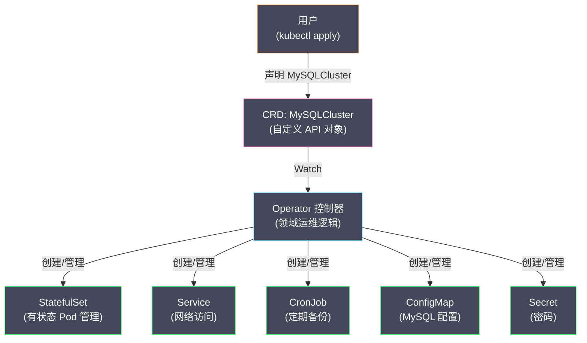
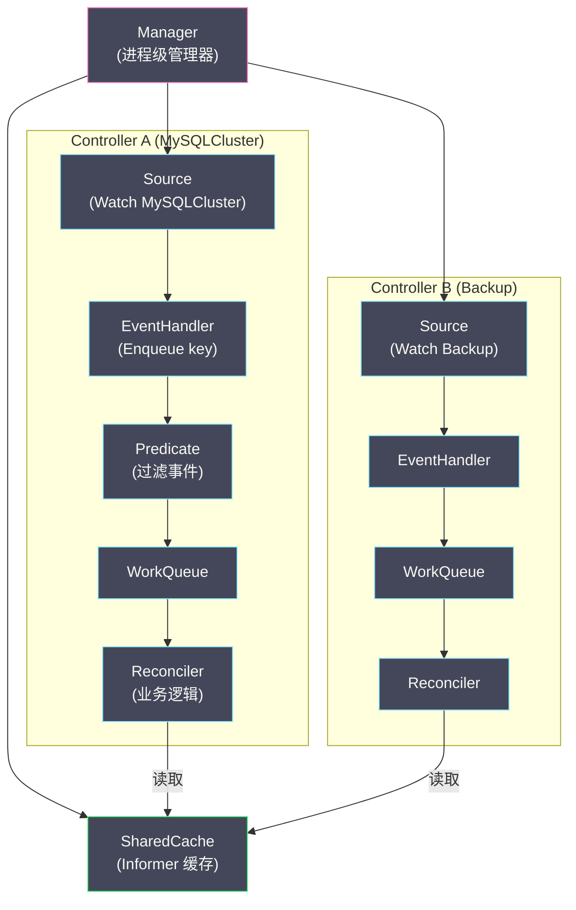

# 06 Operator 模式与自定义控制器

**摘要：**

前五篇文章分析了 K8s 内置控制器的工作机制——Deployment、StatefulSet、DaemonSet、Job 以及 Scheduler。这些控制器覆盖了"通用工作负载"的管理需求，但企业的实际场景远不止于此：数据库集群需要自动化的主从切换和备份恢复、消息队列需要动态扩缩分区、机器学习平台需要管理训练任务的生命周期。这些**领域特定的运维知识**无法由通用控制器表达。**Operator 模式**解决了这个问题——通过 **CRD（Custom Resource Definition）** 扩展 K8s 的 API 对象，通过**自定义控制器**将运维经验编码为自动化逻辑。CRD + 自定义控制器 = Operator——它将"人类运维专家"的知识封装为软件，让 K8s 能够像管理原生资源一样管理复杂的有状态应用。本文从 Operator 的设计理念出发，介绍 CRD 的定义方式，深入 controller-runtime 框架（Kubebuilder）的核心组件——Manager、Reconciler、Controller、Source/EventHandler/Predicate，然后讨论 Operator 的编写模式和最佳实践。

---

## 第 1 章 Operator 的设计理念

### 1.1 问题：StatefulSet 不够用

[[03 StatefulSet 控制器深度解析|StatefulSet]] 为有状态应用提供了稳定标识、持久存储和有序操作——但它只解决了**基础设施层面**的问题。真正运维一个生产级数据库集群，还需要大量**领域特定**的操作：

| 运维操作 | 领域知识 | StatefulSet 支持 |
| :--- | :--- | :--- |
| 初始化主从复制 | MySQL 的 CHANGE MASTER TO 语句 | ❌ |
| 主节点故障自动切换 | 选举逻辑、数据一致性检查 | ❌ |
| 定期备份与恢复 | mysqldump / xtrabackup 工具 | ❌ |
| 在线扩容从节点 | 从主节点全量同步 + 增量追赶 | ❌ |
| 版本升级（滚动） | 先升从后升主、验证复制状态 | ❌ |
| 监控与告警 | 复制延迟、慢查询、连接数 | ❌ |

这些操作需要深度的 MySQL 运维知识——StatefulSet 无法表达。传统做法是由 DBA 手动执行或编写脚本——但这违背了 K8s "声明式+自动化"的理念。

### 1.2 Operator = CRD + 自定义控制器

**Operator 模式**的核心思想是：**将运维知识编码为 K8s 控制器。**

1. **定义 CRD**：创建一个新的 API 资源类型（如 `MySQLCluster`），用户通过 YAML 声明数据库集群的期望状态（副本数、版本、备份策略等）
2. **编写控制器**：监听 `MySQLCluster` 对象的变化，执行协调逻辑——创建 StatefulSet、初始化复制、配置备份 CronJob 等
3. **用户体验**：用户只需 `kubectl apply -f mysql-cluster.yaml`，Operator 自动完成所有运维操作

```yaml
# 用户的声明式配置——运维复杂度被封装在 Operator 内部
apiVersion: mysql.example.com/v1
kind: MySQLCluster
metadata:
  name: production-db
spec:
  replicas: 3
  version: "8.0.35"
  storage:
    size: 100Gi
    storageClass: ssd
  backup:
    schedule: "0 2 * * *"
    retention: 7d
```

### 1.3 Operator 的抽象层次



Operator 封装了 **"用户意图"到"K8s 原生资源"的翻译逻辑**——用户只需表达"我要一个 3 副本的 MySQL 集群"，Operator 将其翻译为具体的 StatefulSet、Service、ConfigMap、CronJob 等原生资源并持续管理它们。

---

## 第 2 章 CRD：扩展 K8s API

### 2.1 什么是 CRD

**CRD（Custom Resource Definition）** 允许用户在不修改 K8s 源码的情况下向 API Server 注册新的资源类型。注册后，新资源可以像内置资源一样通过 `kubectl` 和 API 操作。

在 [[03 API 对象模型与 GVR 体系]] 中我们介绍了 K8s 的 GVR 命名体系。CRD 遵循相同的规范：

```yaml
apiVersion: apiextensions.k8s.io/v1
kind: CustomResourceDefinition
metadata:
  name: mysqlclusters.mysql.example.com    # <plural>.<group>
spec:
  group: mysql.example.com                  # API Group
  versions:
    - name: v1                              # API Version
      served: true
      storage: true
      schema:
        openAPIV3Schema:
          type: object
          properties:
            spec:
              type: object
              properties:
                replicas:
                  type: integer
                  minimum: 1
                  maximum: 7
                version:
                  type: string
                storage:
                  type: object
                  properties:
                    size:
                      type: string
                    storageClass:
                      type: string
            status:
              type: object
              properties:
                readyReplicas:
                  type: integer
                phase:
                  type: string
      subresources:
        status: {}                           # 启用 status 子资源
  scope: Namespaced                          # Namespace 级别的资源
  names:
    plural: mysqlclusters                    # 复数名（URL 路径）
    singular: mysqlcluster                   # 单数名
    kind: MySQLCluster                       # Kind
    shortNames:
      - mysql                                # kubectl get mysql
```

CRD 注册后，API Server 自动为新资源类型提供完整的 REST API：

```bash
# 创建
kubectl apply -f mysql-cluster.yaml

# 查询
kubectl get mysqlclusters
kubectl get mysql    # 使用 shortName

# 详情
kubectl describe mysql production-db

# 删除
kubectl delete mysql production-db
```

### 2.2 Schema 校验

CRD 的 `openAPIV3Schema` 定义了资源的结构校验规则——类似于 [[04 准入控制器深度解析|准入控制]] 的功能。API Server 在写入 CRD 对象时自动校验 Schema：

- **类型检查**：`replicas` 必须是 integer
- **范围检查**：`minimum: 1, maximum: 7`
- **必填字段**：通过 `required` 指定
- **正则校验**：通过 `pattern` 指定

Schema 校验是 CRD 的第一道防线——在对象写入 etcd 之前拒绝不合法的配置。

### 2.3 Status 子资源

启用 `subresources.status` 后，CRD 对象的 `status` 字段只能通过 **Status 子资源 API** 更新（`PUT /apis/.../mysqlclusters/production-db/status`），不能通过普通的 Update API 修改。

这是一个重要的安全设计——用户通过 `kubectl apply` 修改 `spec`（期望状态），控制器通过 Status 子资源更新 `status`（当前状态）。两者分离，互不干扰。

---

## 第 3 章 controller-runtime 框架

### 3.1 为什么需要框架

从零编写一个 K8s 控制器需要处理大量的基础设施代码：

- 连接 API Server、配置认证
- 创建 Informer、注册 Event Handler
- 管理 WorkQueue、实现重试逻辑
- Leader Election（高可用）
- 健康检查、Metrics 暴露
- 优雅关闭

**controller-runtime** 是 K8s SIG（Special Interest Group）官方维护的控制器开发框架——它封装了上述所有基础设施，开发者只需编写 **Reconcile 函数**。**Kubebuilder** 是基于 controller-runtime 的脚手架工具——自动生成项目结构、CRD 定义、Reconciler 模板。

### 3.2 核心组件



**Manager**：进程级别的管理器——负责创建共享缓存（Informer Cache）、启动所有 Controller、管理 Leader Election 和健康检查。一个 Operator 进程通常只有一个 Manager。

**Controller**：对应一个控制循环——监听特定资源的变化，将事件转化为 WorkQueue 中的 key，驱动 Reconciler 执行协调。

**Source**：事件源——通常是一个 Informer，Watch 特定类型的资源。

**EventHandler**：将事件转化为 WorkQueue 中的 Reconcile Request（包含对象的 namespace/name）。常用的 EventHandler：
- `handler.EnqueueRequestForObject`：将变更的对象本身入队
- `handler.EnqueueRequestForOwner`：将变更对象的 Owner（父对象）入队

**Predicate**：事件过滤器——可以过滤掉不需要处理的事件（如只关心 Spec 变更，忽略 Status 变更）。

**Reconciler**：开发者实现的核心接口——接收一个 Request（namespace/name），执行协调逻辑，返回 Result。

### 3.3 Reconciler 接口

```go
type Reconciler interface {
    Reconcile(ctx context.Context, req ctrl.Request) (ctrl.Result, error)
}
```

**输入**：`ctrl.Request` 只包含对象的 namespace 和 name——不包含事件类型（Created/Updated/Deleted）。这是 [[01 控制器模式与协调循环|Level-triggered]] 设计的体现——Reconciler 不关心"发生了什么事件"，只关心"当前状态是什么"。

**输出**：
- `Result{}`：成功，不重新入队
- `Result{RequeueAfter: 30 * time.Second}`：30 秒后重新入队（用于定期轮询外部状态）
- `error`：失败，按退避策略重新入队

---

## 第 4 章 Reconciler 的编写模式

### 4.1 标准模板

```go
func (r *MySQLClusterReconciler) Reconcile(ctx context.Context, req ctrl.Request) (ctrl.Result, error) {
    log := log.FromContext(ctx)

    // 1. 获取 CR 对象
    var cluster mysqlv1.MySQLCluster
    if err := r.Get(ctx, req.NamespacedName, &cluster); err != nil {
        if apierrors.IsNotFound(err) {
            // 对象已删除，无需处理（如果有 Finalizer，不会走到这里）
            return ctrl.Result{}, nil
        }
        return ctrl.Result{}, err
    }

    // 2. 检查是否正在被删除（Finalizer 逻辑）
    if !cluster.DeletionTimestamp.IsZero() {
        return r.handleDeletion(ctx, &cluster)
    }

    // 3. 确保 Finalizer 存在
    if !controllerutil.ContainsFinalizer(&cluster, finalizerName) {
        controllerutil.AddFinalizer(&cluster, finalizerName)
        if err := r.Update(ctx, &cluster); err != nil {
            return ctrl.Result{}, err
        }
    }

    // 4. 协调子资源
    if err := r.reconcileStatefulSet(ctx, &cluster); err != nil {
        return ctrl.Result{}, err
    }
    if err := r.reconcileService(ctx, &cluster); err != nil {
        return ctrl.Result{}, err
    }
    if err := r.reconcileBackup(ctx, &cluster); err != nil {
        return ctrl.Result{}, err
    }

    // 5. 更新 Status
    if err := r.updateStatus(ctx, &cluster); err != nil {
        return ctrl.Result{}, err
    }

    return ctrl.Result{}, nil
}
```

### 4.2 子资源协调模式

协调子资源（如 StatefulSet）的标准模式是"创建或更新"：

```go
func (r *MySQLClusterReconciler) reconcileStatefulSet(ctx context.Context, cluster *mysqlv1.MySQLCluster) error {
    desired := buildStatefulSet(cluster)    // 根据 CR 构建期望的 StatefulSet

    // CreateOrUpdate: 如果不存在则创建，如果存在则更新
    _, err := controllerutil.CreateOrUpdate(ctx, r.Client, desired, func() error {
        // 在这个函数中设置 StatefulSet 的期望状态
        desired.Spec.Replicas = &cluster.Spec.Replicas
        desired.Spec.Template.Spec.Containers[0].Image = "mysql:" + cluster.Spec.Version
        
        // 设置 OwnerReference——确保 CR 被删除时子资源被级联删除
        return controllerutil.SetControllerReference(cluster, desired, r.Scheme)
    })
    return err
}
```

**`controllerutil.CreateOrUpdate`** 是一个非常实用的工具函数——它封装了"先 Get，不存在则 Create，存在则 Update"的逻辑，并且处理了乐观并发冲突（409 Conflict 自动重试）。

### 4.3 Finalizer 模式

[[04 Label Selector 与松耦合设计|Finalizer]] 用于在 CR 被删除之前执行清理逻辑——特别是清理**K8s 集群外部的资源**（如云上的负载均衡器、DNS 记录、数据库用户）。

```go
const finalizerName = "mysql.example.com/cleanup"

func (r *MySQLClusterReconciler) handleDeletion(ctx context.Context, cluster *mysqlv1.MySQLCluster) (ctrl.Result, error) {
    if controllerutil.ContainsFinalizer(cluster, finalizerName) {
        // 执行外部资源清理
        if err := r.cleanupExternalResources(ctx, cluster); err != nil {
            return ctrl.Result{}, err    // 清理失败，重试
        }

        // 清理完成，移除 Finalizer
        controllerutil.RemoveFinalizer(cluster, finalizerName)
        if err := r.Update(ctx, cluster); err != nil {
            return ctrl.Result{}, err
        }
    }

    // Finalizer 已移除，K8s 会自动删除 CR 和级联删除子资源
    return ctrl.Result{}, nil
}
```

**工作流程**：
1. 用户 `kubectl delete mysql production-db`
2. API Server 设置 CR 的 `deletionTimestamp`，但因为存在 Finalizer，**不立即删除**
3. Reconciler 检测到 `deletionTimestamp` 不为零，执行清理逻辑
4. 清理完成后移除 Finalizer
5. API Server 发现没有 Finalizer 了，真正删除 CR 对象
6. OwnerReference 级联删除 StatefulSet、Service 等子资源

### 4.4 Watch 关联资源

Operator 通常需要 Watch 多种资源——不仅是自己的 CRD，还有 CRD 管理的子资源（StatefulSet、Pod 等）。当子资源变更时（如 Pod 变为 Ready），需要触发父资源（MySQLCluster）的 Reconcile。

```go
func (r *MySQLClusterReconciler) SetupWithManager(mgr ctrl.Manager) error {
    return ctrl.NewControllerManagedBy(mgr).
        For(&mysqlv1.MySQLCluster{}).                    // 主资源
        Owns(&appsv1.StatefulSet{}).                      // Watch StatefulSet，变更时 Reconcile 其 Owner
        Owns(&corev1.Service{}).                          // Watch Service
        Watches(                                          // 自定义 Watch
            &corev1.Pod{},
            handler.EnqueueRequestForOwner(              // Pod 变更时 Reconcile 其 Owner 的 Owner
                mgr.GetScheme(), mgr.GetRESTMapper(),
                &mysqlv1.MySQLCluster{},
            ),
        ).
        Complete(r)
}
```

**`Owns`**：Watch 的资源发生变更时，通过 OwnerReference 找到父资源（MySQLCluster），将父资源的 key 入队。

---

## 第 5 章 Operator 的成熟度模型

CNCF 社区定义了 Operator 的五级成熟度模型：

| 级别 | 名称 | 能力 | 示例 |
| :--- | :--- | :--- | :--- |
| **Level 1** | 基本安装 | 自动化部署应用（创建 StatefulSet、Service 等）| Helm Chart + 简单控制器 |
| **Level 2** | 无缝升级 | 自动化版本升级（滚动更新、数据迁移）| 自动升级 MySQL 版本 |
| **Level 3** | 全生命周期 | 备份恢复、故障自愈、扩缩容 | 自动主从切换、定期备份 |
| **Level 4** | 深度洞察 | 监控集成、告警、日志分析、性能调优 | 自动慢查询分析和索引建议 |
| **Level 5** | 自动驾驶 | 基于负载自动调优参数、预测性扩容 | 根据流量自动调整连接池大小 |

大多数生产级 Operator 处于 Level 2-3。Level 4-5 需要深度的领域知识和 AI/ML 能力。

---

## 第 6 章 Operator 最佳实践

### 6.1 一个 CR 对应一个 Reconciler

不要在一个 Reconciler 中处理多种 CR——每种 CRD 应有独立的 Reconciler。如果 Operator 管理多种 CRD（如 MySQLCluster 和 MySQLBackup），为每种 CRD 注册独立的 Controller。

### 6.2 Status 要反映真实状态

CR 的 Status 应准确反映当前状态——包括 Phase、Conditions、ReadyReplicas 等。遵循 K8s 的 Condition 规范：

```go
// 更新 Status 中的 Condition
meta.SetStatusCondition(&cluster.Status.Conditions, metav1.Condition{
    Type:    "Ready",
    Status:  metav1.ConditionTrue,
    Reason:  "AllReplicasReady",
    Message: "所有 3 个副本已就绪",
})
```

### 6.3 避免无限循环

Reconciler 更新 Status 会触发 Watch 事件，Watch 事件又触发 Reconcile——形成无限循环。解决方法：

**方法一：使用 Predicate 过滤 Status-only 变更**

```go
ctrl.NewControllerManagedBy(mgr).
    For(&mysqlv1.MySQLCluster{}, builder.WithPredicates(predicate.GenerationChangedPredicate{})).
    Complete(r)
```

`GenerationChangedPredicate` 只在 `metadata.generation` 变更时触发——Spec 变更会增加 generation，Status 变更不会。

**方法二：在 Reconcile 中检查是否需要更新**

```go
// 只在 Status 真正变化时才更新
if !reflect.DeepEqual(cluster.Status, newStatus) {
    cluster.Status = newStatus
    return r.Status().Update(ctx, cluster)
}
```

### 6.4 错误处理与重试策略

- **可重试错误**（如网络超时、409 Conflict）：返回 error，WorkQueue 自动按退避策略重试
- **不可重试错误**（如用户配置错误——无效的 MySQL 版本）：不返回 error，而是更新 Status Condition 标记错误原因，等待用户修复配置
- **需要等待的操作**（如等待 Pod 启动）：返回 `Result{RequeueAfter: 10 * time.Second}`，定期轮询直到完成

### 6.5 测试策略

| 层次 | 工具 | 测试什么 |
| :--- | :--- | :--- |
| **单元测试** | Go test + fake client | Reconcile 逻辑的各个分支 |
| **集成测试** | envtest（嵌入式 API Server + etcd）| 与真实 API Server 的交互 |
| **端到端测试** | kind/minikube + 真实集群 | 完整的 Operator 生命周期 |

`envtest` 是 controller-runtime 提供的集成测试框架——它启动一个嵌入式的 API Server 和 etcd，不需要完整的 K8s 集群，但提供了真实的 API 行为（包括 Schema 校验、乐观并发、Watch 事件等）。

---

## 第 7 章 知名 Operator 案例

| Operator | 管理的应用 | 核心能力 |
| :--- | :--- | :--- |
| **prometheus-operator** | Prometheus 监控栈 | 自动化 Prometheus 实例管理、ServiceMonitor 动态发现、告警规则管理 |
| **strimzi-kafka-operator** | Apache Kafka | Kafka 集群部署、Topic 管理、用户认证、滚动升级 |
| **zalando/postgres-operator** | PostgreSQL | 主从复制、自动故障切换、逻辑备份、连接池管理 |
| **cert-manager** | TLS 证书 | 自动申请和续期 Let's Encrypt 证书、管理 K8s Secret |
| **istio-operator** | Istio 服务网格 | Istio 组件的安装、配置和升级 |
| **rook/ceph** | Ceph 存储 | 分布式存储集群的自动化部署和运维 |

这些 Operator 都遵循相同的模式：CRD 定义期望状态 → 控制器执行协调 → Status 反映当前状态。

---

## 第 8 章 总结

本文作为「控制器与调度器」专栏的收官，介绍了 K8s 扩展能力的核心——Operator 模式：

- **Operator = CRD + 自定义控制器**：将领域运维知识编码为自动化控制循环
- **CRD**：扩展 K8s API，定义新的资源类型，Schema 校验保证数据合法性，Status 子资源分离读写
- **controller-runtime**：官方控制器框架，Manager 管理进程级生命周期，Reconciler 是开发者的核心接口
- **编写模式**：CreateOrUpdate 管理子资源、Finalizer 处理外部清理、Owns/Watches 监听关联资源
- **最佳实践**：一 CR 一 Reconciler、GenerationChangedPredicate 避免无限循环、Status 反映真实状态

至此，「控制器与调度器」专栏的 6 篇文章全部完成。我们从控制器模式的本质出发，分析了 Deployment、StatefulSet、DaemonSet/Job/CronJob 四种内置控制器，深入了 Scheduler 的调度算法，最后介绍了 Operator 模式——K8s 生态最强大的扩展机制。下一个专栏将转向「生命周期管理与服务发现」。

---

## 参考资料

1. Kubernetes Documentation - Custom Resources：https://kubernetes.io/docs/concepts/extend-kubernetes/api-extension/custom-resources/
2. Kubernetes Documentation - Operator Pattern：https://kubernetes.io/docs/concepts/extend-kubernetes/operator/
3. controller-runtime Documentation：https://pkg.go.dev/sigs.k8s.io/controller-runtime
4. Kubebuilder Book：https://book.kubebuilder.io/
5. Michael Hausenblas, Stefan Schimanski (2019). *Programming Kubernetes*. O'Reilly, Chapter 6-9.
6. OperatorHub.io：https://operatorhub.io/
7. Kubernetes Enhancement Proposal - CRD：https://github.com/kubernetes/enhancements/tree/master/keps/sig-api-machinery/2524-crd-validation-expression-language

---

> [!note] 思考题
> 1. DaemonSet 确保每个 Node（或满足条件的 Node）运行一个 Pod——典型应用包括日志收集（Fluentd/Fluent Bit）、监控（Node Exporter）和网络插件（Calico/Cilium）。DaemonSet Pod 默认容忍所有 Taint——包括 `node.kubernetes.io/not-ready`。这意味着即使 Node 不健康，DaemonSet Pod 仍然运行。在什么场景下这是正确的行为？你何时需要给 DaemonSet 添加额外的 Toleration？
> 2. Node 的 cordon（禁止调度新 Pod）和 drain（驱逐现有 Pod）是维护操作的标准流程。`kubectl drain --ignore-daemonsets --delete-emptydir-data` 驱逐所有非 DaemonSet Pod。但如果 Pod 设置了 PodDisruptionBudget（PDB）且 drain 会违反 PDB——drain 会被阻塞。在紧急维护场景中你如何处理？
> 3. DaemonSet 的更新策略 `RollingUpdate` 逐节点更新 Pod。`maxUnavailable: 1` 确保同时只有一个节点的 DaemonSet Pod 在更新。在 100 节点集群中，逐个更新需要很长时间——增大 `maxUnavailable` 可以加速但降低了可用性。在日志收集 DaemonSet 的更新中，`maxUnavailable: 10%` 是否可接受？
