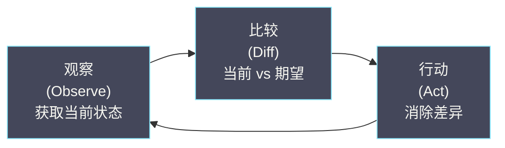
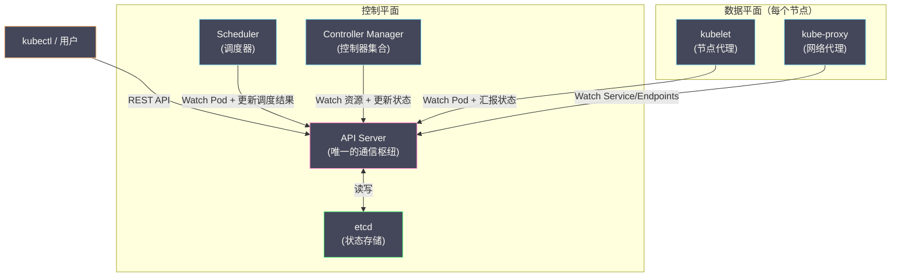

# 01 Kubernetes 的诞生与设计哲学

**摘要：**

Kubernetes 不是凭空出现的——它脱胎于 Google 内部运行了十五年的集群管理系统 Borg，又汲取了 Borg 的继任者 Omega 在调度架构上的教训。理解 Kubernetes 的设计决策，必须先理解它要解决的问题、它的前辈们踩过的坑、以及它所坚持的架构原则。本文从 Google 内部的集群管理演进（Borg → Omega → Kubernetes）出发，剖析 K8s 诞生的历史背景和工程动机，然后系统梳理 K8s 最核心的五个设计原则——声明式 API、控制器模式、面向终态的协调、Level-triggered 而非 Edge-triggered、以及松耦合的组件架构。这些原则不是抽象的"设计模式口号"，而是直接决定了 K8s 每一个组件的行为方式和每一个 API 的字段语义。理解它们，是深入学习后续所有专栏的基础。

---

## 第 1 章 从 Borg 到 Kubernetes

### 1.1 Google 的集群管理演进

要理解 Kubernetes 为什么被设计成现在的样子，必须回溯到 Google 内部的集群管理历史。Google 是全球最早面临"如何在数万台机器上高效运行数十万个应用"这个问题的公司之一。他们的解决方案经历了三代演进：

**第一代：Borg（2003-2004 年）**

Borg 是 Google 内部的集群管理系统，运行了超过十五年，管理着 Google 几乎所有的生产工作负载——从搜索引擎、Gmail 到 YouTube。Borg 的核心设计思想对 Kubernetes 产生了深远影响：

- **将整个数据中心视为一台计算机**：用户不需要关心自己的应用运行在哪台物理机上，只需要告诉 Borg "我需要 2 核 CPU、4GB 内存来运行这个二进制文件"，Borg 负责找到合适的机器并启动它。这个思想直接演变为 Kubernetes 的 Pod 调度模型。
- **区分长期运行服务（prod）和批处理任务（non-prod）**：Borg 将工作负载分为两类，长期运行的服务（如 Web 服务器）拥有更高的调度优先级，可以抢占批处理任务的资源。这个分类在 Kubernetes 中演变为 Deployment（长期运行）和 Job（批处理）两种工作负载对象。
- **声明式任务描述**：用户通过配置文件（BCL，Borg Configuration Language）描述自己想要的状态——"运行 3 个副本的 Web 服务"——而不是"在机器 A 上启动一个进程，在机器 B 上启动一个进程"。Borg 负责将当前状态调整到期望状态。

Google 在 2015 年发表了著名的 Borg 论文——*Large-scale cluster management at Google with Borg*——其中明确提到了 Borg 对 Kubernetes 设计的影响。

**第二代：Omega（2010-2013 年）**

Omega 是 Google 对 Borg 调度架构的一次重大实验。Borg 使用集中式调度器——所有调度决策由一个中心节点完成。当集群规模达到数万台机器、每秒需要做出数千个调度决策时，集中式调度器成为瓶颈。

Omega 的核心创新是**共享状态调度（Shared-state Scheduling）**——多个调度器并行工作，共享一份集群状态的副本，各自独立做出调度决策，然后通过乐观并发控制（Optimistic Concurrency Control）解决冲突。这个设计思想部分影响了 Kubernetes 的架构——K8s 的 Scheduler 是一个独立组件，可以被替换或扩展，而不是 API Server 或 Controller Manager 的一部分。

Omega 还强化了一个重要理念：**所有集群状态存储在一个中心化的、支持事务的存储系统中**。在 Kubernetes 中，这个角色由 [[etcd]] 承担。

**第三代：Kubernetes（2014 年）**

2014 年 6 月，Google 宣布开源 Kubernetes。K8s 不是 Borg 的开源版——它是 Google 工程师基于十五年 Borg 运维经验，重新设计的一个**面向外部用户的容器编排系统**。

K8s 与 Borg 的关键差异在于面向的用户群体不同。Borg 的用户是 Google 内部的工程师——他们熟悉分布式系统，愿意编写复杂的配置文件，能容忍学习曲线。K8s 的目标用户是全球所有的开发者和运维人员——他们的技术背景各异，需要一个更简洁、更标准化、更易扩展的系统。这个目标直接驱动了 K8s 在 API 设计上的诸多决策。

### 1.2 Kubernetes 要解决什么问题

在 [[01 容器的本质——从进程隔离到 OCI 标准]] 中，我们了解到容器解决了"应用打包与环境一致性"的问题——一个容器镜像可以在任何 Linux 机器上运行，不依赖宿主机的软件环境。但容器本身只解决了**单机上的应用运行问题**。当你需要在数十台甚至数千台机器上管理成百上千个容器时，一系列新问题浮出水面：

**问题一：调度——容器应该运行在哪台机器上？**

一个集群有 100 台机器，每台机器的 CPU、内存、磁盘资源不同。你有 500 个容器需要运行。哪个容器放在哪台机器上，才能最大化资源利用率，同时满足容器的资源需求和约束条件（比如"这两个容器必须分散在不同机器上以实现高可用"）？手动分配显然不可行。

**问题二：自愈——容器挂了怎么办？**

容器运行的进程可能因为 bug 崩溃、机器可能因为硬件故障宕机。如果你期望"始终有 3 个副本在运行"，当一个副本挂掉后，谁来自动在另一台健康的机器上重新启动一个新副本？

**问题三：服务发现——如何找到一个服务？**

你的 Web 前端需要连接后端 API 服务。后端 API 有 3 个副本，分布在不同的机器上，IP 地址各不相同，而且可能因为重启或迁移而变化。前端如何知道后端的地址？硬编码 IP 显然不可行。

**问题四：滚动更新——如何不停机发布新版本？**

你的应用有新版本需要发布。直接停掉所有旧版本、启动新版本会导致服务中断。你希望逐步替换——先启动一个新版本副本，确认它健康后再停掉一个旧版本副本，如此循环。如果新版本有 bug，还需要能快速回滚到旧版本。

**问题五：配置与密钥管理——如何安全地传递配置信息？**

数据库密码、API 密钥不能硬编码在容器镜像中。需要一种机制在运行时将配置和密钥注入容器，而且不同环境（开发、测试、生产）的配置不同。

Kubernetes 正是为了解决这些问题而生的。它不是"另一个容器运行时"——Docker/containerd 已经解决了"怎么运行一个容器"的问题。Kubernetes 解决的是"怎么在集群中管理大量容器"的问题——**编排（Orchestration）**。

### 1.3 为什么 Kubernetes 赢了

2014-2017 年，容器编排领域有三个主要竞争者：**Docker Swarm**（Docker 公司的原生编排方案）、**Apache Mesos + Marathon**（Twitter/Airbnb 等公司使用的通用调度平台）、**Kubernetes**（Google 开源的编排系统）。

Kubernetes 最终胜出，原因是多方面的：

**架构优势**：K8s 的声明式 API 和控制器模式提供了比 Swarm 的命令式操作更强大的自愈能力和扩展性。Mesos 虽然调度能力强大，但"通用调度框架"的定位使得它在容器编排这个具体场景上不如 K8s 专注和易用。

**生态优势**：Google 将 K8s 捐赠给了 CNCF（Cloud Native Computing Foundation），而不是由 Google 单独控制。这种中立的治理模式让 AWS、Azure、阿里云等各大云厂商放心参与——K8s 成为了所有公有云的标准容器编排层。

**扩展性优势**：K8s 的 CRD（Custom Resource Definition）+ 控制器模式允许任何人扩展 K8s 的能力——定义新的 API 对象、编写新的控制逻辑——而无需修改 K8s 本身的代码。这使得围绕 K8s 涌现了庞大的生态：Istio（服务网格）、Prometheus（监控）、ArgoCD（GitOps）、Tekton（CI/CD）等。

2017 年 Docker 公司宣布在 Docker Enterprise 中集成 Kubernetes 支持，标志着"编排之战"的终结。

---

## 第 2 章 五大设计原则

### 2.1 原则一：声明式 API（Declarative over Imperative）

#### 什么是声明式

**声明式**意味着你告诉系统"我想要什么（What）"，而不是"怎么做（How）"。系统负责弄清楚如何从当前状态到达你期望的状态。

**命令式**的例子——手动操作：

```bash
# 命令式：告诉系统每一步怎么做
ssh machine-A "docker run -d --name web nginx:1.25"
ssh machine-B "docker run -d --name web nginx:1.25"
ssh machine-C "docker run -d --name web nginx:1.25"
# 如果 machine-B 挂了，你需要自己发现并在 machine-D 上重新启动
```

**声明式**的例子——Kubernetes：

```yaml
# 声明式：告诉系统你想要什么
apiVersion: apps/v1
kind: Deployment
metadata:
  name: web
spec:
  replicas: 3      # 我想要 3 个副本
  template:
    spec:
      containers:
        - name: nginx
          image: nginx:1.25
# K8s 会自动找到合适的机器、启动 3 个副本
# 如果任何一个挂了，K8s 自动重新创建
```

#### 为什么选择声明式

**幂等性**：声明式操作天然是幂等的——提交同一份配置 10 次和提交 1 次的效果完全一致。命令式操作不是幂等的——执行"创建一个容器"10 次会创建 10 个容器。

**自愈能力**：声明式系统持续比较"当前状态"和"期望状态"的差异，自动修复偏差。如果一个 Pod 被意外删除，系统会重新创建它——因为当前状态（2 个副本）与期望状态（3 个副本）不一致。命令式系统没有"期望状态"的概念，无法自愈。

**审计与版本控制**：声明式配置文件可以存放在 Git 中，形成完整的变更历史。"谁在什么时候把副本数从 3 改成了 5"——Git log 一目了然。这就是 GitOps 的基础。

**多方协作**：在 K8s 中，多个组件（用户、Controller、Webhook）可能同时修改同一个对象。声明式 API 配合乐观并发控制（ResourceVersion）确保每次修改都基于最新的状态，避免覆盖其他组件的变更。命令式操作很难处理并发冲突。

> [!note] 设计哲学
> K8s 的声明式理念可以用一句话概括：**用户描述意图，系统负责实现。** 用户不需要关心"Pod 运行在哪台机器上"、"旧的 Pod 先删除还是新的 Pod 先创建"——这些细节由 K8s 的控制器和调度器处理。用户只需要维护一份描述"期望状态"的 YAML 文件。

### 2.2 原则二：控制器模式（Controller Pattern）

#### 什么是控制器

**控制器**是一个持续运行的循环，它不断地：

1. **观察（Observe）**：通过 API Server 获取资源的当前状态
2. **比较（Diff）**：计算当前状态与期望状态的差异
3. **行动（Act）**：执行操作消除差异，使当前状态趋近于期望状态

这个循环被称为 **Reconcile Loop（协调循环）** 或 **Control Loop（控制循环）**。



#### 日常生活中的控制器

控制器模式并非 K8s 的发明——它在物理世界中无处不在。**空调的恒温器**就是一个完美的控制器：

- **期望状态**：用户设置温度 25°C
- **当前状态**：室内温度传感器读数 28°C
- **Diff**：当前温度比期望高 3°C
- **Action**：启动制冷
- 持续循环直到室内温度达到 25°C

关键点：恒温器不会记住"我 5 分钟前开始制冷了"——它只看当前温度和目标温度的差值。每次循环都是独立的判断。这正是 K8s 控制器的工作方式——**无状态的协调循环，基于当前状态做决策，不依赖历史操作记录**。

#### K8s 中的控制器实例

以 **ReplicaSet 控制器**为例，它的协调逻辑可以用伪代码表示：

```
func reconcile(replicaSet):
    期望副本数 = replicaSet.spec.replicas        // 用户期望 3 个
    当前 Pod 列表 = 查找 Label 匹配的 Pod         // 当前只有 2 个
    
    差值 = 期望副本数 - len(当前 Pod 列表)        // 差 1 个
    
    if 差值 > 0:
        创建 差值 个新 Pod                        // 创建 1 个
    elif 差值 < 0:
        删除 |差值| 个多余 Pod                     // 删掉多的
    // else: 状态一致，无需操作
```

K8s 中有数十个内置控制器（Deployment Controller、StatefulSet Controller、Endpoint Controller、Node Controller……），它们各自负责不同类型的资源的协调。所有控制器运行在 **kube-controller-manager** 进程中。

### 2.3 原则三：面向终态（Desired State → Reconciliation）

#### 终态驱动而非过程驱动

传统的运维系统是**过程驱动**的——你编写一个脚本描述操作步骤："先停 A，再启 B，然后修改 C 的配置，最后重启 D"。如果脚本执行到一半失败了（比如步骤 3 失败），系统停留在一个不确定的中间状态——A 已经停了，B 已经启动了，但 C 的配置没改——你需要手动判断该如何恢复。

K8s 是**终态驱动**的——你只描述最终期望的状态（"我要 3 个运行 nginx:1.25 的 Pod"），K8s 负责从任何当前状态到达这个终态。即使协调过程中某一步失败了，控制器会在下一次循环中重新尝试——因为它每次都是从"当前状态"计算到"期望状态"的差距，不依赖之前的操作是否成功。

**这就是为什么 K8s 具有自愈能力的根本原因**：控制器不知道也不关心"上一次协调是否成功"——它只关心"现在的状态和期望的状态是否一致"。如果不一致，就采取行动。这个特性使得系统在面对故障时极其健壮——任何瞬时错误（网络抖动、临时超时）都会在下一次协调中被自动修复。

#### spec 与 status 的分离

K8s 的每个 API 对象都有两个关键字段：

- **spec**：期望状态（Desired State）——由用户编写，描述"我想要什么"
- **status**：当前状态（Current State）——由控制器更新，描述"现在是什么"

```yaml
apiVersion: apps/v1
kind: Deployment
metadata:
  name: web
spec:                          # 用户写的：期望状态
  replicas: 3
  template:
    spec:
      containers:
        - image: nginx:1.25
status:                        # 控制器更新的：当前状态
  replicas: 2                  # 当前只有 2 个副本
  readyReplicas: 2             # 2 个已就绪
  updatedReplicas: 2           # 2 个已是最新版本
  conditions:
    - type: Available
      status: "True"
```

控制器的工作就是持续将 `status` 向 `spec` 对齐。当 `status.replicas` (2) 小于 `spec.replicas` (3) 时，控制器创建一个新的 Pod。当它们相等时，状态一致，控制器不采取任何行动。

> [!info] 核心认知
> **spec 是用户与 K8s 之间的"契约"——用户声明意图，K8s 承诺履行。status 是 K8s 向用户的"汇报"——告诉用户系统当前的真实状态。** 所有的自动化逻辑（自愈、扩缩容、滚动更新）都建立在 spec 和 status 的差异比较之上。

### 2.4 原则四：Level-triggered 而非 Edge-triggered

这是 K8s 设计中最精妙也最容易被忽视的原则。

#### 概念来源

这对术语来自电子工程的数字电路设计：

- **Edge-triggered（边缘触发）**：只在信号**变化的瞬间**做出响应。比如"当温度从 24°C 变到 26°C 的那一刻，发出警报"。如果你错过了那个瞬间（比如系统重启了），你不会再收到警报——即使温度一直是 26°C。
- **Level-triggered（电平触发）**：只要信号**处于某个状态**就持续响应。比如"只要温度高于 25°C，就持续发出警报"。即使你错过了温度升高的那个瞬间，只要你检查时温度仍然高于 25°C，你就能感知到异常。

#### 为什么 K8s 选择 Level-triggered

在分布式系统中，**消息可能丢失、事件可能被错过、组件可能重启**。如果系统是 Edge-triggered 的——只在事件发生的瞬间做出反应——那么错过一个事件就意味着永远错过了。

考虑以下场景：

```
时刻 1：用户创建了一个 Deployment（replicas=3）
时刻 2：Deployment Controller 收到"创建事件"，开始创建 3 个 Pod
时刻 3：Controller 创建了 2 个 Pod 后崩溃重启
时刻 4：Controller 重启后……
```

如果是 **Edge-triggered**（事件驱动）：Controller 只响应"创建事件"。重启后，"创建事件"已经消费过了，Controller 不会再看到它。系统停留在只有 2 个 Pod 的状态——**自愈失败**。

如果是 **Level-triggered**（状态驱动）：Controller 重启后，不关心之前发生了什么事件。它只观察当前状态——"spec 说要 3 个 Pod，现在只有 2 个"——于是创建 1 个新的 Pod。**自愈成功**。

**K8s 的控制器本质上是 Level-triggered 的**：它们定期（或在收到 Watch 事件后）检查资源的当前状态，与期望状态比较，然后采取行动。Watch 事件只是**加速触发**协调循环的手段，而不是协调逻辑的唯一依赖。即使没有收到任何事件，控制器也会通过定期的 **Resync**（重新同步所有资源）来确保状态一致。

> [!warning] 对开发者的启示
> 如果你编写自定义 K8s 控制器（Operator），必须遵循 Level-triggered 原则：**Reconcile 函数的逻辑必须基于资源的当前状态做决策，而不是基于"发生了什么事件"**。不要在 Reconcile 中维护"上一次处理到哪了"的状态——每次 Reconcile 都应该像第一次被调用一样，完整地评估当前状态并决定需要采取什么行动。

### 2.5 原则五：松耦合的组件架构

#### Hub-and-Spoke 模型

K8s 的组件之间**不直接通信**——所有通信都通过 [[API Server]] 作为中心枢纽进行。这被称为 **Hub-and-Spoke（辐射轮毂）** 架构。



**关键设计决策**：

**Scheduler 不直接与 kubelet 通信**。Scheduler 将调度结果写入 API Server（更新 Pod 的 `spec.nodeName` 字段），kubelet Watch 到 Pod 被调度到自己的节点，然后拉取镜像、启动容器。Scheduler 和 kubelet 之间没有任何直接的网络连接。

**Controller Manager 不直接创建容器**。Deployment Controller 创建 ReplicaSet 对象、ReplicaSet Controller 创建 Pod 对象——都是写入 API Server。实际创建容器的是 kubelet——它 Watch 到分配给自己节点的 Pod，然后通过 CRI 调用 containerd 创建容器。

这种设计带来三个重要优势：

**组件可独立替换**：每个组件只依赖 API Server 的 RESTful API，不依赖其他组件的内部实现。你可以替换默认的 Scheduler 为自定义 Scheduler（只要它能读写 API Server），而不需要修改任何其他组件。

**故障隔离**：如果 Scheduler 崩溃了，已经运行的 Pod 不受影响（kubelet 独立管理容器的生命周期），只是新的 Pod 无法被调度。Controller Manager 崩溃了，现有的 Pod 仍然运行，只是自愈能力暂时丧失。**只有 API Server 和 etcd 的故障会影响整个集群**——这也是为什么它们是 K8s 高可用架构中最重要的组件。

**可观测性**：所有状态变更都经过 API Server 并被记录在 etcd 中——审计日志可以追踪每一次变更的来源和时间。没有"暗箱操作"——组件之间没有绕过 API Server 的私下通信。

---

## 第 3 章 Kubernetes 的非目标

理解一个系统"不做什么"和理解它"做什么"同样重要。Kubernetes 官方文档明确列出了以下非目标：

### 3.1 不是 PaaS

Kubernetes 不限制支持的应用类型——它不在乎你跑的是 Java、Go、Python 还是 Node.js。它不提供应用层面的服务（如数据库、消息队列、缓存）作为内置功能——这些通过 Operator 模式以扩展的方式提供。K8s 提供的是"原语"（Primitives），而不是端到端的解决方案。

### 3.2 不管理源代码，不构建应用

K8s 不关心你的代码仓库在哪里、如何编译、如何打包成镜像。CI/CD（持续集成/持续部署）是 K8s 之外的关注点——由 Jenkins、GitLab CI、ArgoCD 等工具处理。K8s 只接受构建好的容器镜像，负责运行和编排。

### 3.3 不提供应用级服务

日志收集、监控告警、服务网格——这些都不是 K8s 内核的一部分。K8s 提供的是可扩展的接口（如 Metrics API、自定义资源），由生态系统中的项目（[[Prometheus]]、Fluentd、[[Istio]]）来实现这些功能。

这种"只做编排，不做上层"的定位使得 K8s 成为了一个**可组合的平台**——用户根据自己的需求选择和组合生态中的组件，而不是被迫接受一个全家桶式的解决方案。

---

## 第 4 章 从设计原则看 K8s 的日常行为

### 4.1 一个 Pod 的创建流程

将五大原则代入一个具体场景——用户执行 `kubectl apply -f deployment.yaml` 创建一个 3 副本的 Deployment——可以清晰地看到每个原则如何落地：

| 步骤 | 执行者 | 对应的设计原则 |
| :--- | :--- | :--- |
| 用户提交 Deployment YAML | kubectl | **声明式 API**：用户只描述期望状态 |
| API Server 验证并存储到 etcd | API Server | **松耦合**：API Server 是唯一入口 |
| Deployment Controller 发现新 Deployment，创建 ReplicaSet | Controller Manager | **控制器模式**：观察-比较-行动 |
| ReplicaSet Controller 发现 Pod 数不足，创建 3 个 Pod 对象 | Controller Manager | **面向终态**：当前 0 个 → 期望 3 个 |
| Scheduler 发现 3 个未调度的 Pod，分配到合适的节点 | Scheduler | **松耦合**：通过 API Server 间接通信 |
| kubelet Watch 到分配给自己的 Pod，创建容器 | kubelet | **Level-triggered**：基于当前状态行动 |

整个过程是**异步的、事件驱动的、最终一致的**。没有一个"编排者"在指挥每一步——每个组件独立 Watch 自己关心的资源变化，独立做出决策。这种去中心化的协作模式使得 K8s 在面对组件故障时依然健壮——任何组件的临时不可用只会导致该组件负责的功能暂时停滞，不会级联影响其他组件。

### 4.2 自愈的完整链路

假设一个 Node 宕机了，上面运行着 2 个 Pod（属于一个 replicas=3 的 Deployment）：

1. **Node Controller** 检测到 Node 的心跳（kubelet 的 Lease）超时，将 Node 标记为 `NotReady`
2. **Node Controller** 在等待 `pod-eviction-timeout`（默认 5 分钟）后，将该 Node 上的 Pod 标记为 `Terminating`
3. **ReplicaSet Controller** 发现当前只有 1 个 Running 的 Pod（另外 2 个在宕机 Node 上），但期望 3 个
4. ReplicaSet Controller 创建 2 个新的 Pod 对象（未调度）
5. **Scheduler** 将 2 个新 Pod 调度到其他健康节点
6. **kubelet** 在健康节点上创建容器

全程无人工干预。每一步都是某个控制器"观察当前状态，与期望状态比较，采取行动"的结果。如果 ReplicaSet Controller 在步骤 3 和步骤 4 之间崩溃重启了——没关系，重启后它会重新检查状态（Level-triggered），发现仍然只有 1 个 Running Pod，继续创建。

---

## 第 5 章 总结

本文梳理了 Kubernetes 的诞生背景和五大核心设计原则：

- **从 Borg 到 K8s 的演进**：K8s 脱胎于 Google 十五年的集群管理经验，解决的核心问题是大规模集群中的容器编排（调度、自愈、服务发现、滚动更新）
- **声明式 API**：用户描述"想要什么"，系统负责实现。天然支持幂等性、自愈、审计
- **控制器模式**：观察-比较-行动的持续循环，是 K8s 所有自动化逻辑的基础
- **面向终态**：spec（期望状态）与 status（当前状态）的分离，控制器持续将 status 向 spec 对齐
- **Level-triggered**：基于当前状态做决策，不依赖事件是否被消费。确保系统在面对故障和消息丢失时仍能最终达到正确状态
- **松耦合架构**：所有组件通过 API Server 间接通信，组件可独立替换和独立故障

下一篇 [[02 Kubernetes 整体架构]] 将具体拆解 K8s 的每个组件——API Server、etcd、Scheduler、Controller Manager、kubelet、kube-proxy——它们各自的职责、内部工作机制和交互方式。

---

## 参考资料

1. Abhishek Verma et al. (2015). *Large-scale cluster management at Google with Borg*. EuroSys'15.
2. Malte Schwarzkopf et al. (2013). *Omega: flexible, scalable schedulers for large compute clusters*. EuroSys'13.
3. Brendan Burns et al. (2016). *Borg, Omega, and Kubernetes: Lessons learned from three container-management systems over a decade*. ACM Queue.
4. Kubernetes Documentation - Concepts：https://kubernetes.io/docs/concepts/
5. Kubernetes Design Principles：https://github.com/kubernetes/design-proposals-archive
6. Brian Grant (2018). *Kubernetes Design Principles*. KubeCon keynote.
7. Joe Beda, Brendan Burns, Kelsey Hightower (2019). *Kubernetes: Up and Running*, 2nd Edition. O'Reilly.

---

> [!note] 思考题
> 1. Kubernetes 的声明式 API——用户描述'期望状态'（如'运行 3 个副本'），Controller 负责将实际状态收敛到期望状态。与命令式 API（如'启动一个容器'）相比，声明式的优势在于自愈能力——Pod 崩溃后 Controller 自动重建。但声明式也有劣势——你无法精确控制'如何'达到目标状态。在什么场景下声明式模型不够灵活（如需要特定的操作顺序）？
> 2. Kubernetes 的'最终一致性'模型——Controller 异步调谐，状态变化不是瞬间完成的。从 `kubectl apply` 到 Pod 实际运行可能需要数秒到数分钟。在需要快速响应的场景中（如自动扩缩容应对流量突增），这个延迟是否可接受？你如何缩短从'决策到生效'的延迟？
> 3. Kubernetes 的 Label 和 Selector 是松耦合的对象关联机制——Service 通过 Selector 关联 Pod，Deployment 通过 Selector 关联 ReplicaSet。Label 的错误配置可能导致严重问题——如两个 Deployment 使用相同 Selector 导致 Pod 被错误管理。你在 Label 设计中遵循什么命名规范？`app.kubernetes.io/*` 推荐 Label 集有什么价值？
