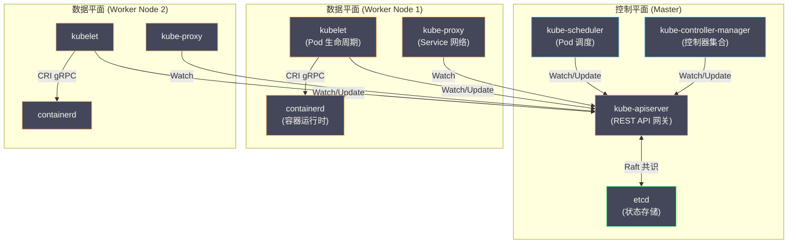
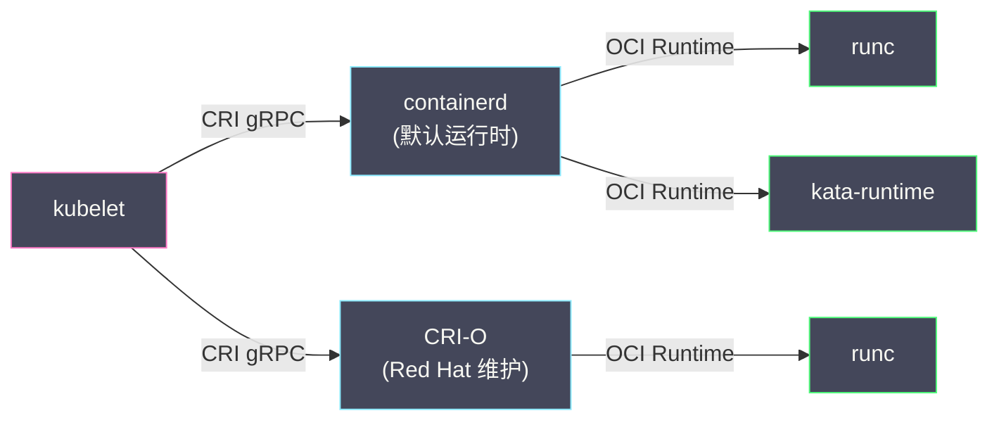
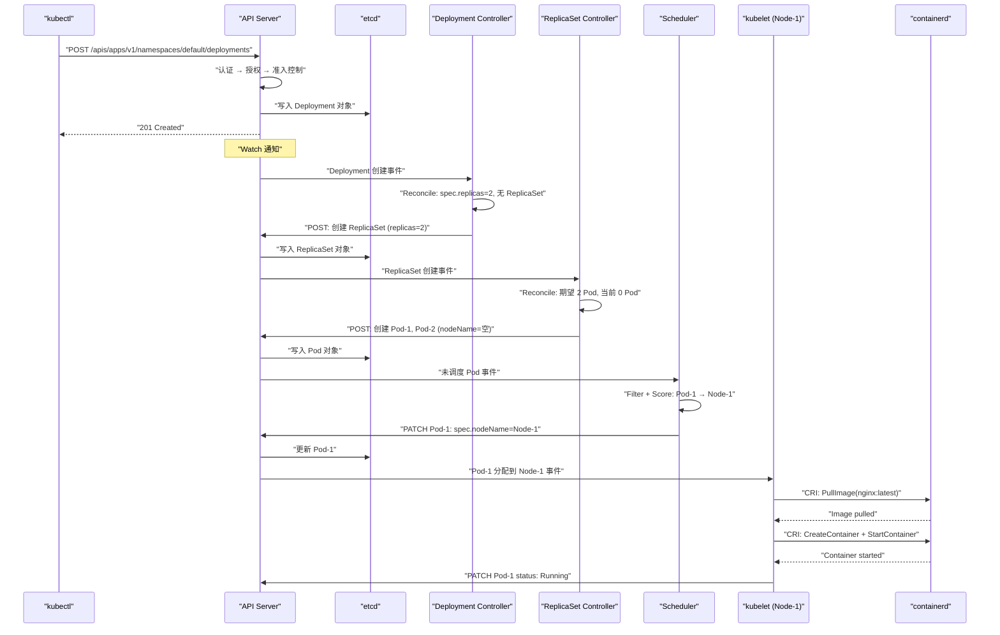

# 02 Kubernetes 整体架构

**摘要：**

[[01 Kubernetes 的诞生与设计哲学]] 建立了对 K8s 设计原则的认知——声明式 API、控制器模式、面向终态、Level-triggered、松耦合架构。本文将这些原则具象化为 K8s 的实际组件：**控制平面**（API Server、etcd、Scheduler、Controller Manager）负责集群的"大脑"功能——存储状态、做出决策；**数据平面**（kubelet、kube-proxy、容器运行时）负责每个节点上的"执行"功能——运行容器、转发网络流量。本文逐一拆解每个组件的职责、核心工作机制和关键数据流，然后通过一个完整的端到端场景——"从 `kubectl apply` 到容器在节点上运行"——将所有组件串联，展示它们如何通过异步的、事件驱动的协作完成编排任务。最后讨论控制平面的高可用部署模型。

---

## 第 1 章 架构全景

### 1.1 控制平面与数据平面

Kubernetes 的架构分为两个层面：

**控制平面（Control Plane）**——通常运行在专用的 Master 节点上（生产环境中至少 3 个，用于高可用）：

| 组件 | 职责 |
| :--- | :--- |
| **kube-apiserver** | 集群的唯一入口，所有资源的 CRUD 和 Watch 都经过它 |
| **etcd** | 分布式键值存储，保存集群的所有状态数据 |
| **kube-scheduler** | 为未调度的 Pod 选择合适的节点 |
| **kube-controller-manager** | 运行所有内置控制器（Deployment、ReplicaSet、Node 等）|
| **cloud-controller-manager** | 与云平台 API 交互（创建 LoadBalancer、管理节点等），仅在云环境中存在 |

**数据平面（Data Plane）**——运行在集群的每个 Worker 节点上：

| 组件 | 职责 |
| :--- | :--- |
| **kubelet** | 节点代理，负责 Pod 的生命周期管理（拉取镜像、启动/停止容器、健康检查）|
| **kube-proxy** | 网络代理，实现 Service 的负载均衡（维护 iptables/IPVS 规则）|
| **容器运行时** | 实际运行容器的组件（containerd、CRI-O），通过 CRI 接口与 kubelet 交互 |



### 1.2 一个关键的架构约束

在深入每个组件之前，需要强调一个贯穿 K8s 架构的约束：

**只有 API Server 直接与 etcd 通信。** 其他所有组件（Scheduler、Controller Manager、kubelet、kube-proxy、kubectl）都只与 API Server 交互。这个约束有三层含义：

1. **API Server 是 etcd 的唯一客户端**——它封装了 etcd 的读写逻辑，对外暴露结构化的 RESTful API。其他组件不需要知道 etcd 的存在。
2. **所有状态变更都经过 API Server 的验证和准入控制**——没有任何组件可以绕过权限检查直接修改集群状态。
3. **API Server 提供了统一的 Watch 接口**——所有组件通过 Watch 机制获知资源变化，不需要轮询或直连 etcd 的 Watch。

---

## 第 2 章 控制平面组件

### 2.1 kube-apiserver：集群的唯一入口

#### 核心职责

API Server 是 K8s 集群中**最重要的组件**——它是所有交互的中心枢纽。它的职责包括：

- **REST API 服务**：对外暴露 K8s 的所有 API（Pod、Deployment、Service 等），支持 CRUD 操作和 Watch
- **认证（Authentication）**：验证请求者的身份（X.509 证书、Bearer Token、OIDC 等）
- **授权（Authorization）**：检查请求者是否有权限执行该操作（RBAC 是默认的授权模式）
- **准入控制（Admission Control）**：在资源被写入 etcd 之前，执行一系列校验和变更逻辑（如设置默认值、强制资源配额）
- **状态持久化**：将验证通过的资源对象序列化后写入 etcd
- **Watch 通知**：当 etcd 中的资源发生变化时，通知所有 Watch 该资源的客户端

#### 请求处理管线

一个 API 请求从进入到落地，经历以下阶段：


每个阶段都是一个"关卡"——请求必须通过所有关卡才能写入 etcd。任何一个关卡失败，请求被拒绝并返回错误。这个管线的详细机制将在 [[00 专栏导览|API Server 专栏]] 中展开。

#### 无状态设计

API Server 本身是**无状态的**——它不在内存或本地磁盘中保存任何集群状态，所有状态都存储在 etcd 中。这意味着 API Server 可以水平扩展——部署多个实例，前面放一个负载均衡器，每个实例处理的请求互不干扰。这是 K8s 控制平面高可用的基础。

### 2.2 etcd：集群的"唯一真相来源"

#### 为什么是 etcd

etcd 是一个分布式键值存储系统，基于 [[Raft]] 共识算法保证数据的强一致性。K8s 选择 etcd 作为状态存储，原因包括：

**强一致性**：etcd 使用 Raft 算法——写入操作必须被多数节点确认后才算成功。在 3 节点的 etcd 集群中，一次写入需要至少 2 个节点确认。这保证了在网络分区或节点故障时，数据不会丢失或不一致。

**Watch 支持**：etcd 原生支持 Watch 操作——客户端可以监听一个 key 或 key 前缀的变化，当数据发生变化时立即收到通知。K8s 的整个事件驱动架构建立在 etcd 的 Watch 之上。

**MVCC（多版本并发控制）**：etcd 的每次写入都产生一个新的版本号（revision）。K8s 利用这个版本号实现乐观并发控制——API 对象的 `metadata.resourceVersion` 就是 etcd 的 revision。更新对象时必须携带正确的 resourceVersion，否则更新失败（409 Conflict）。

#### etcd 中的数据布局

K8s 在 etcd 中存储数据时使用分层的 key 结构：

```
/registry/pods/default/nginx-abc123
/registry/pods/kube-system/coredns-xyz789
/registry/deployments/default/web
/registry/services/default/my-service
/registry/secrets/default/db-password
```

key 的格式为 `/registry/<资源类型>/<namespace>/<名称>`。value 是资源对象的序列化内容（默认 protobuf 格式，可配置为 JSON）。

> [!warning] 生产实践
> etcd 是 K8s 集群中**最关键的有状态组件**——如果 etcd 的数据丢失，整个集群的状态（所有 Pod、Deployment、Service、Secret 的定义）就丢失了。生产环境中必须：
> - 部署 3 或 5 个节点的 etcd 集群（容忍 1 或 2 个节点故障）
> - 定期备份 etcd 数据（`etcdctl snapshot save`）
> - 将 etcd 运行在高性能 SSD 上（etcd 对磁盘延迟非常敏感）

### 2.3 kube-scheduler：调度器

#### 核心职责

Scheduler 的唯一职责是：**为每个新创建的、尚未被分配节点的 Pod 选择一个最合适的节点。**

Scheduler 通过 Watch 机制监听 API Server 中的 Pod 对象。当一个新 Pod 被创建但 `spec.nodeName` 为空时（表示未调度），Scheduler 启动调度流程：

1. **过滤（Filter/Predicate）**：排除不满足 Pod 要求的节点（如资源不足、不满足亲和性约束、有不能容忍的 Taint）
2. **打分（Score/Priority）**：对通过过滤的候选节点进行评分（如选择资源利用率最均衡的节点、尽量满足 Pod 的偏好约束）
3. **绑定（Bind）**：将 Pod 的 `spec.nodeName` 更新为得分最高的节点（通过 API Server 写入 etcd）

#### Scheduler 的"异步协作"特性

Scheduler 做出调度决策后，**并不直接通知 kubelet 去启动容器**。它只是更新了 Pod 的 `spec.nodeName` 字段。kubelet 通过 Watch 机制发现"有一个 Pod 被分配到了我的节点上"，然后自主地拉取镜像、创建容器。

这是 [[01 Kubernetes 的诞生与设计哲学|松耦合架构]] 的体现——Scheduler 和 kubelet 之间没有直接的 RPC 调用。它们通过 API Server 中的 Pod 对象"间接通信"。

#### Scheduling Framework

从 K8s 1.15 开始，Scheduler 引入了 **Scheduling Framework**——一个插件化的调度框架。调度流程被分解为多个扩展点（Extension Point），每个扩展点可以插入自定义插件：

| 扩展点 | 阶段 | 作用 |
| :--- | :--- | :--- |
| **PreFilter** | 过滤前 | 预处理 Pod 信息（如计算资源请求总量）|
| **Filter** | 过滤 | 排除不满足条件的节点 |
| **PostFilter** | 过滤后 | 过滤阶段没有可用节点时触发（用于抢占逻辑）|
| **PreScore** | 打分前 | 预处理打分需要的信息 |
| **Score** | 打分 | 为候选节点评分 |
| **Reserve** | 预留 | 在 Bind 之前预留节点资源（乐观假设绑定会成功）|
| **Bind** | 绑定 | 将 Pod 绑定到节点 |

这种插件化设计允许用户在不修改 Scheduler 核心代码的情况下扩展调度逻辑——例如添加 GPU 调度策略、拓扑感知调度等。

### 2.4 kube-controller-manager：控制器集合

#### 核心职责

Controller Manager 是一个进程，内部运行了**数十个控制器**。每个控制器负责一种或一类资源的协调逻辑：

| 控制器 | Watch 的资源 | 职责 |
| :--- | :--- | :--- |
| **Deployment Controller** | Deployment, ReplicaSet | 管理 Deployment 的滚动更新和回滚 |
| **ReplicaSet Controller** | ReplicaSet, Pod | 维持 Pod 的副本数 |
| **StatefulSet Controller** | StatefulSet, Pod | 管理有状态应用的有序部署 |
| **DaemonSet Controller** | DaemonSet, Node, Pod | 确保每个（或指定的）节点运行一个 Pod |
| **Job Controller** | Job, Pod | 管理批处理任务的执行 |
| **Node Controller** | Node | 监控节点健康状态，处理节点故障 |
| **Endpoint Controller** | Service, Pod | 维护 Service 对应的 Endpoints 列表 |
| **EndpointSlice Controller** | Service, Pod | 维护 EndpointSlice（大规模优化版 Endpoints）|
| **ServiceAccount Controller** | Namespace | 为新的 Namespace 创建默认 ServiceAccount |
| **Namespace Controller** | Namespace | 清理被删除 Namespace 中的所有资源 |
| **Garbage Collector** | 所有资源 | 级联删除具有 OwnerReference 关系的资源 |

#### 为什么放在一个进程里

所有控制器运行在同一个 `kube-controller-manager` 进程中，而不是每个控制器独立部署。原因主要是**运维简便性**——管理一个进程比管理几十个进程简单得多。但在逻辑上，每个控制器是完全独立的——它们各自维护自己的 Informer 缓存，各自执行自己的协调循环，互不干扰。

#### Leader Election

在高可用部署中，多个 Controller Manager 实例同时运行，但**只有一个实例是 Leader**——只有 Leader 实际执行控制器逻辑，其他实例处于待命状态。当 Leader 故障时，其他实例通过 [[etcd]] 的 Lease 机制自动选举新的 Leader（通常在几秒内完成）。

Scheduler 也使用同样的 Leader Election 机制——多个实例中只有一个实际执行调度逻辑。

---

## 第 3 章 数据平面组件

### 3.1 kubelet：节点代理

#### 核心职责

kubelet 是运行在每个 Worker 节点上的代理进程——它是控制平面与节点上实际容器之间的"桥梁"。

kubelet 的核心职责：

- **Watch Pod**：通过 API Server 的 Watch 接口监听分配到本节点的 Pod
- **Pod 生命周期管理**：创建/更新/删除 Pod 中的容器（通过 CRI 接口调用容器运行时）
- **健康检查**：执行 Pod 配置的 Liveness/Readiness/Startup 探针
- **资源监控**：通过 cAdvisor 采集容器的 CPU、内存使用量
- **状态上报**：定期向 API Server 汇报节点状态（Node Status）和 Pod 状态（Pod Status）
- **Volume 管理**：挂载 Pod 需要的存储卷（如 ConfigMap、Secret、PersistentVolume）

#### CRI：容器运行时接口

kubelet 不直接操作容器——它通过 **CRI（Container Runtime Interface）** 这个 gRPC 接口与容器运行时交互。CRI 的设计使得 kubelet 可以对接不同的容器运行时：



CRI 定义了两类 gRPC 服务：

- **RuntimeService**：管理 Pod 和容器的生命周期（创建/启动/停止/删除 Sandbox 和 Container）
- **ImageService**：管理容器镜像（拉取/列出/删除镜像）

在 [[01 容器的本质——从进程隔离到 OCI 标准]] 中我们了解了 containerd 和 runc 的分层架构。kubelet → containerd → containerd-shim → runc 这条调用链，就是 K8s 最终将一个 Pod 定义变成实际运行的容器的路径。

#### PLEG：Pod Lifecycle Event Generator

kubelet 需要知道节点上容器的实际状态（运行中？已退出？OOM 被杀？）。**PLEG（Pod Lifecycle Event Generator）** 是 kubelet 内部的组件，它定期（默认每秒）调用容器运行时查询所有容器的状态，与上一次的状态比较，生成事件（如"容器 X 从 Running 变为 Exited"）。这些事件驱动 kubelet 的同步逻辑——例如重启一个因 OOM 而退出的容器。

> [!info] PLEG 与节点性能
> PLEG 的轮询周期和响应时间直接影响 kubelet 的健康检测。如果节点上运行了大量 Pod（>100），PLEG 的每次轮询需要查询所有容器的状态，可能出现延迟。`PLEG is not healthy` 是 K8s 集群中常见的节点异常告警——通常由容器运行时响应缓慢引起。

### 3.2 kube-proxy：Service 网络代理

#### 核心职责

kube-proxy 运行在每个节点上，负责实现 K8s 的 **Service** 抽象——将发往 Service ClusterIP 的流量负载均衡到后端的 Pod。

kube-proxy Watch API Server 中的 Service 和 EndpointSlice 对象，然后在本节点上配置网络转发规则。它支持三种代理模式：

| 模式 | 实现方式 | 性能 | 适用场景 |
| :--- | :--- | :--- | :--- |
| **iptables**（默认）| 为每个 Service 创建 iptables 规则 | 中等，规则数 O(n) 匹配 | 中小规模集群 |
| **IPVS** | 使用 Linux 内核的 IPVS 模块 | 高，哈希表 O(1) 匹配 | 大规模集群（>1000 Service）|
| **nftables** | 使用 nftables 框架（K8s 1.29+）| 高 | 新一代替代方案 |

iptables 模式下，kube-proxy 为每个 Service 生成一组 iptables 规则。例如一个有 3 个后端 Pod 的 Service：

```
# 简化的 iptables 规则
# 流量到达 Service ClusterIP 10.96.0.100:80 时
-A KUBE-SERVICES -d 10.96.0.100/32 -p tcp --dport 80 -j KUBE-SVC-XXXX

# 随机分配到 3 个后端 Pod（概率各 1/3）
-A KUBE-SVC-XXXX -m statistic --mode random --probability 0.333 -j KUBE-SEP-POD1
-A KUBE-SVC-XXXX -m statistic --mode random --probability 0.500 -j KUBE-SEP-POD2
-A KUBE-SVC-XXXX -j KUBE-SEP-POD3

# DNAT 到实际的 Pod IP
-A KUBE-SEP-POD1 -p tcp -j DNAT --to-destination 10.244.1.5:80
-A KUBE-SEP-POD2 -p tcp -j DNAT --to-destination 10.244.2.8:80
-A KUBE-SEP-POD3 -p tcp -j DNAT --to-destination 10.244.3.2:80
```

这与 [[05 容器网络原理]] 中介绍的 Docker 端口映射原理本质相同——都是通过 [[iptables]] DNAT 实现流量转发。区别在于 Docker 的 DNAT 将宿主机端口映射到单个容器，而 K8s 的 Service 是将 ClusterIP 负载均衡到多个 Pod。

### 3.3 容器运行时

容器运行时是实际创建和管理容器的组件。K8s 1.24 起移除了对 Docker（dockershim）的内置支持，目前主流的运行时是：

- **containerd**：CNCF 毕业项目，从 Docker 中独立出来的核心运行时，是大多数 K8s 发行版的默认选择
- **CRI-O**：Red Hat 主导开发，专门为 K8s 设计的轻量级运行时

两者都通过 CRI 接口与 kubelet 交互，底层都使用 runc（或其他 [[OCI]] 兼容的运行时如 kata-runtime、runsc）来创建容器。

---

## 第 4 章 端到端场景：一个 Pod 从创建到运行

### 4.1 完整流程

用户执行 `kubectl apply -f nginx-deployment.yaml`，创建一个 `replicas: 2` 的 Nginx Deployment。以下是从请求发出到容器在节点上运行的完整链路：



### 4.2 关键观察

**异步解耦**：整个流程没有任何同步调用链。每一步都是"某个组件修改 API 对象 → API Server 写入 etcd → Watch 通知另一个组件 → 另一个组件修改 API 对象"。没有任何组件在等待另一个组件的直接回复。

**级联创建**：Deployment → ReplicaSet → Pod 是三级级联创建。Deployment Controller 不直接创建 Pod——它创建 ReplicaSet，由 ReplicaSet Controller 创建 Pod。这种"每个控制器只管一级"的设计使得每个控制器的逻辑简单且可组合。

**渐进式状态变化**：Pod 对象经历了多次状态变化——先被 ReplicaSet Controller 创建（`spec.nodeName` 为空），再被 Scheduler 调度（`spec.nodeName` 被设置），再被 kubelet 启动（`status.phase` 变为 Running）。每一步都由不同的组件负责，通过 Watch 机制衔接。

**容错性**：如果 Scheduler 在步骤 4 崩溃了，Pod 会停留在"未调度"状态。Scheduler 重启后，它会重新 Watch 所有未调度的 Pod，继续调度。如果 kubelet 在步骤 5 拉取镜像时失败了，它会按照退避策略（exponential backoff）重试。整个系统是最终一致的——组件的临时故障不会导致永久的状态异常。

---

## 第 5 章 控制平面高可用

### 5.1 高可用部署模型

生产环境中，控制平面通常部署为多副本以实现高可用：

| 组件 | 部署方式 | 高可用机制 |
| :--- | :--- | :--- |
| **API Server** | 3 个实例 + 负载均衡器 | 无状态，所有实例同时处理请求 |
| **etcd** | 3 或 5 个节点集群 | Raft 共识，容忍 (n-1)/2 个节点故障 |
| **Scheduler** | 3 个实例 | Leader Election，只有 1 个活跃 |
| **Controller Manager** | 3 个实例 | Leader Election，只有 1 个活跃 |

**API Server** 可以多实例同时工作（Active-Active），因为它是无状态的。每个实例都直接读写 etcd，前面通过负载均衡器分发请求。

**Scheduler 和 Controller Manager** 使用 Active-Standby 模式——只有 Leader 执行逻辑，其他实例待命。Leader 通过在 API Server 中维护一个 Lease 对象来"占位"——如果 Leader 停止更新 Lease（如崩溃），其他实例检测到 Lease 过期后竞争成为新 Leader。

**etcd** 的高可用依赖 Raft 共识——3 节点集群容忍 1 个节点故障，5 节点集群容忍 2 个。节点数量应为奇数（避免脑裂）。

### 5.2 Stacked vs External etcd

K8s 控制平面有两种典型的 etcd 部署方式：

**Stacked（堆叠式）**：etcd 运行在 Master 节点上，每个 Master 节点同时运行 API Server + etcd。优点是部署简单（kubeadm 的默认方式），缺点是 Master 节点故障会同时丢失一个 API Server 实例和一个 etcd 节点。

**External（外部式）**：etcd 运行在独立的节点上，不与 API Server 共享机器。优点是 etcd 集群和 K8s 控制平面的故障域完全隔离，缺点是需要更多的机器和更复杂的运维。

大规模生产环境推荐使用 External etcd——将 etcd 的运维独立出来，确保即使所有 Master 节点同时故障，etcd 中的集群状态数据仍然安全。

---

## 第 6 章 总结

本文拆解了 K8s 的完整组件架构：

- **API Server**：无状态的 REST API 网关，唯一的 etcd 入口，请求经过认证→授权→准入控制管线
- **etcd**：基于 Raft 的分布式键值存储，集群的"唯一真相来源"，支持 Watch 和 MVCC
- **Scheduler**：基于 Filter + Score 的插件化调度框架，通过更新 `spec.nodeName` 与 kubelet 异步协作
- **Controller Manager**：数十个内置控制器的集合，每个控制器独立执行协调循环
- **kubelet**：节点代理，通过 CRI 接口管理容器生命周期，PLEG 监控容器状态
- **kube-proxy**：通过 iptables/IPVS 实现 Service 的负载均衡

所有组件通过 API Server 的 Watch 机制异步协作——这种松耦合的事件驱动架构使得系统在面对组件故障时依然健壮。

下一篇 [[03 API 对象模型与 GVR 体系]] 将深入 K8s 的 API 设计——所有资源对象共享的统一结构（TypeMeta/ObjectMeta/Spec/Status）和 GVR/GVK 命名体系。

---

## 参考资料

1. Kubernetes Documentation - Components：https://kubernetes.io/docs/concepts/overview/components/
2. Kubernetes Documentation - API Server：https://kubernetes.io/docs/reference/command-line-tools-reference/kube-apiserver/
3. Kubernetes Documentation - Scheduler：https://kubernetes.io/docs/concepts/scheduling-eviction/kube-scheduler/
4. etcd Documentation：https://etcd.io/docs/
5. CRI Specification：https://github.com/kubernetes/cri-api
6. Kubernetes Design Proposals - Scheduling Framework：https://github.com/kubernetes/enhancements/tree/master/keps/sig-scheduling/624-scheduling-framework
7. Brendan Burns, Joe Beda, Kelsey Hightower (2019). *Kubernetes: Up and Running*, 2nd Edition. O'Reilly.
8. Michael Hausenblas, Stefan Schimanski (2019). *Programming Kubernetes*. O'Reilly, Chapter 1-3.

---

> [!note] 思考题
> 1. Pod 的三种探针：Liveness（存活，失败则重启）、Readiness（就绪，失败则从 Service 摘除）、Startup（启动，防止慢启动应用被 Liveness 误杀）。在一个 Java 应用中（启动需要 60 秒），如果不设置 Startup Probe 而 Liveness Probe 的 `initialDelaySeconds` 设为 30 秒——应用会在启动期间被反复杀死重启。如何正确配置三种探针的关系？
> 2. 资源的 Request（保证最低资源）和 Limit（最大资源上限）的设置至关重要。Request 决定调度（调度器根据 Node 的可用 Request 分配 Pod），Limit 由 CGroups 强制执行。如果 Request=100m CPU、Limit=1000m CPU——Pod 平时使用 100m，突发时可以 burst 到 1000m。但如果 Node 上所有 Pod 同时 burst，CPU 不够用——谁的性能受影响？CPU 的 CFS throttling 如何工作？
> 3. Pod 的 QoS Class（Guaranteed、Burstable、BestEffort）由资源配置决定。Guaranteed（Request=Limit）的 Pod 在内存压力下最后被 OOM Kill。在关键服务中你是否应该总是设置 Guaranteed QoS？Guaranteed 意味着不能 burst——是否浪费了资源？
