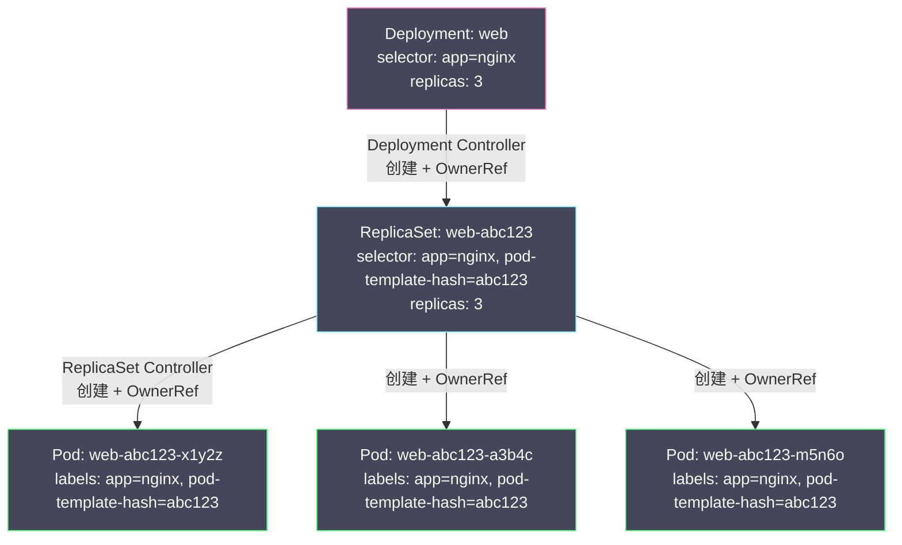

# 04 Label Selector 与松耦合设计

**摘要：**

在 [[03 API 对象模型与 GVR 体系]] 中，我们了解到 `metadata.labels` 是 K8s 对象的关键字段之一。但 Label 在 K8s 中的地位远不止"给对象打个标签"这么简单——**Label + Selector 是 K8s 实现对象间松耦合关联的核心机制**。Deployment 如何找到它管理的 Pod？Service 如何知道将流量转发给哪些 Pod？NetworkPolicy 如何指定哪些 Pod 受策略约束？答案都是 Label Selector。K8s 刻意避免了"在对象中硬编码另一个对象的名称"这种紧耦合设计，而是通过"贴标签 + 按标签筛选"实现灵活的多对多关联。本文深入分析 Label 的语义规范、两种 Selector 语法（等式与集合）、Label 在 Deployment→ReplicaSet→Pod 级联管理中的具体应用，然后剖析 OwnerReference 和 Finalizer 这两个与对象生命周期紧密相关的元数据机制，最后总结 Label 设计的最佳实践。

---

## 第 1 章 为什么需要 Label

### 1.1 如果用硬编码 ID 关联对象

假设 K8s 的设计是：Deployment 通过硬编码 Pod 的名称来管理 Pod——`deployment.spec.podNames: ["pod-abc", "pod-def", "pod-ghi"]`。

这种设计会导致严重的问题：

**扩缩容困难**：增加一个 Pod 副本时，需要先创建 Pod，获得其名称，再更新 Deployment 的 `podNames` 列表。删除一个 Pod 时同样需要更新列表。任何操作都需要两次写入（创建 Pod + 更新 Deployment），增加了失败的可能性和一致性的复杂度。

**替换困难**：当一个 Pod 因为 OOM 被杀死后，新创建的 Pod 会有不同的名称（因为 Pod 名称中包含随机后缀）。Deployment 的 `podNames` 列表需要被更新——删掉旧名称，加入新名称。如果控制器在更新列表时崩溃了，列表中会有一个已经不存在的 Pod 名称——"悬挂引用"。

**多维度关联困难**：一个 Pod 可能同时被 Service（网络流量）、NetworkPolicy（安全策略）、PodDisruptionBudget（可用性保障）关联。如果每种关联都需要在对方对象中硬编码 Pod 名称，复杂度会爆炸。

### 1.2 Label + Selector 的松耦合设计

K8s 的解决方案是：**对象之间不直接引用彼此的名称，而是通过 Label 和 Selector 进行基于属性的匹配。**

```yaml
# Deployment 定义了 Selector
apiVersion: apps/v1
kind: Deployment
metadata:
  name: web
spec:
  selector:
    matchLabels:
      app: nginx        # "我管理所有带 app=nginx 标签的 Pod"
  template:
    metadata:
      labels:
        app: nginx      # 创建的 Pod 会带这个标签
    spec:
      containers:
        - name: nginx
          image: nginx:1.25
---
# Service 也通过 Selector 关联 Pod
apiVersion: v1
kind: Service
metadata:
  name: web-svc
spec:
  selector:
    app: nginx          # "将流量转发给所有带 app=nginx 标签的 Pod"
  ports:
    - port: 80
```

这种设计的优势：

**扩缩容零成本**：增加 Pod 副本时，只需创建一个带 `app: nginx` 标签的 Pod——Deployment 的 Selector 自动匹配到它，Service 也自动将流量分配到它。无需修改 Deployment 或 Service 对象本身。

**替换透明**：旧 Pod 被杀死后，新 Pod 自动带着相同的标签创建。Selector 匹配的是标签而非名称——新 Pod 自动被关联，无需任何额外操作。

**多维度关联自然**：同一个 Pod 可以带多个标签（`app: nginx`, `env: production`, `team: platform`），不同的控制器和资源通过不同的 Selector 从不同维度关联它——Service 按 `app: nginx` 关联，NetworkPolicy 按 `env: production` 关联，PodDisruptionBudget 按 `app: nginx, env: production` 关联。

> [!note] 设计哲学
> Label + Selector 的本质是**基于属性的关联（Attribute-based Association）**，而非基于标识的关联（Identity-based Association）。这与关系数据库中"外键引用"的设计截然不同——K8s 的对象之间没有"外键"，只有"共同的标签"。这种设计牺牲了一点精确性（你无法精确指定"就是这个 Pod"），换来了巨大的灵活性和健壮性。

---

## 第 2 章 Label 的规范与约束

### 2.1 Label 的格式

一个 Label 由**键（key）**和**值（value）**组成。键可以有可选的**前缀（prefix）**：

```
# 不带前缀
app: nginx
env: production
tier: frontend

# 带前缀（域名格式，用 / 分隔）
app.kubernetes.io/name: nginx
app.kubernetes.io/version: "1.25"
prometheus.io/scrape: "true"
```

格式约束：

| 部分 | 约束 |
| :--- | :--- |
| **前缀** | 可选。必须是合法的 DNS 子域名，不超过 253 字符 |
| **名称** | 必须以字母或数字开头和结尾，中间可以包含 `-`、`_`、`.`，不超过 63 字符 |
| **值** | 可以为空。如果非空，必须以字母或数字开头和结尾，中间可以包含 `-`、`_`、`.`，不超过 63 字符 |

**前缀的作用**：区分不同组织定义的 Label，避免命名冲突。`kubernetes.io/` 和 `k8s.io/` 前缀保留给 K8s 核心组件使用。第三方工具应使用自己的域名作为前缀（如 `prometheus.io/`、`helm.sh/`）。

### 2.2 推荐的 Label 体系

K8s 官方推荐了一组标准 Label 前缀 `app.kubernetes.io/`：

| Label | 含义 | 示例 |
| :--- | :--- | :--- |
| `app.kubernetes.io/name` | 应用名称 | `nginx` |
| `app.kubernetes.io/instance` | 应用实例标识 | `nginx-prod` |
| `app.kubernetes.io/version` | 应用版本 | `1.25.3` |
| `app.kubernetes.io/component` | 组件角色 | `frontend`, `backend`, `database` |
| `app.kubernetes.io/part-of` | 所属的更高级应用 | `wordpress` |
| `app.kubernetes.io/managed-by` | 管理工具 | `helm`, `argocd` |

使用标准 Label 的好处是生态工具（Prometheus、Grafana、ArgoCD）可以自动识别这些标签并提供统一的展示和过滤。

---

## 第 3 章 Selector 的两种语法

### 3.1 等式选择器（Equality-based Selector）

等式选择器支持三种操作符：`=`（等于）、`==`（等于，与 `=` 相同）、`!=`（不等于）。

```bash
# kubectl 命令行中使用等式选择器
kubectl get pods -l app=nginx                    # app 等于 nginx
kubectl get pods -l app=nginx,env=production     # AND：同时满足两个条件
kubectl get pods -l app!=redis                   # app 不等于 redis
```

在 YAML 中使用 `matchLabels`（等式选择器的 YAML 表示）：

```yaml
selector:
  matchLabels:
    app: nginx
    env: production
# 等价于 app=nginx AND env=production
```

**`matchLabels` 中的多个条件是 AND 关系**——必须全部满足才算匹配。K8s 的 Label Selector **不支持 OR 逻辑**——你不能用 `matchLabels` 表达"app=nginx OR app=redis"。如果需要类似 OR 的语义，需要使用集合选择器。

### 3.2 集合选择器（Set-based Selector）

集合选择器支持更丰富的操作：`In`（值在集合中）、`NotIn`（值不在集合中）、`Exists`（键存在）、`DoesNotExist`（键不存在）。

```bash
# kubectl 命令行
kubectl get pods -l 'env in (production, staging)'   # env 是 production 或 staging
kubectl get pods -l 'tier notin (frontend)'           # tier 不是 frontend
kubectl get pods -l 'app'                              # 存在 app 标签（不管值是什么）
kubectl get pods -l '!canary'                          # 不存在 canary 标签
```

在 YAML 中使用 `matchExpressions`：

```yaml
selector:
  matchExpressions:
    - key: env
      operator: In
      values: ["production", "staging"]
    - key: tier
      operator: NotIn
      values: ["frontend"]
    - key: app
      operator: Exists
```

`matchLabels` 和 `matchExpressions` 可以同时使用——它们之间也是 AND 关系：

```yaml
selector:
  matchLabels:
    app: nginx                    # 条件 1
  matchExpressions:
    - key: env
      operator: In
      values: ["production"]      # 条件 2
# 必须同时满足条件 1 和条件 2
```

### 3.3 哪些资源使用哪种 Selector

| 资源 | Selector 字段 | 支持的语法 |
| :--- | :--- | :--- |
| **Service** | `spec.selector` | 仅等式（`matchLabels` 风格的 map）|
| **ReplicaSet / Deployment** | `spec.selector` | 等式 + 集合（`matchLabels` + `matchExpressions`）|
| **Job / CronJob** | `spec.selector` | 等式 + 集合 |
| **NetworkPolicy** | `spec.podSelector` | 等式 + 集合 |
| **PodDisruptionBudget** | `spec.selector` | 等式 + 集合 |
| **kubectl -l** | 命令行参数 | 等式 + 集合 |

Service 只支持等式选择器（`spec.selector` 是一个简单的 `map[string]string`），这是历史遗留设计——Service 的 Selector 在 API 的早期版本中就已经定义，当时集合选择器还不存在。

---

## 第 4 章 Label 在级联管理中的应用

### 4.1 Deployment → ReplicaSet → Pod 的三级级联

这是 K8s 中最典型的 Label + Selector 应用场景。当你创建一个 Deployment 时，会触发一个三级级联创建：



**关键细节：`pod-template-hash` 标签**

Deployment Controller 在创建 ReplicaSet 时，会为其添加一个 `pod-template-hash` 标签——这是 Pod 模板内容的哈希值。这个标签的作用是**区分不同版本的 ReplicaSet**。

假设你修改了 Deployment 的镜像版本（从 `nginx:1.24` 改为 `nginx:1.25`），Deployment Controller 会创建一个新的 ReplicaSet（`pod-template-hash` 不同）。新旧两个 ReplicaSet 都匹配 `app=nginx`，但它们通过 `pod-template-hash` 区分：

```
旧 ReplicaSet: selector = {app: nginx, pod-template-hash: abc123}  → 旧版本 Pod
新 ReplicaSet: selector = {app: nginx, pod-template-hash: def456}  → 新版本 Pod
```

Deployment Controller 通过逐步调整两个 ReplicaSet 的 `spec.replicas` 来实现滚动更新——增加新 ReplicaSet 的副本数，减少旧 ReplicaSet 的副本数。

### 4.2 Service → Pod 的流量关联

Service 通过 `spec.selector` 找到后端 Pod：

```yaml
apiVersion: v1
kind: Service
metadata:
  name: web-svc
spec:
  selector:
    app: nginx        # 匹配所有 app=nginx 的 Pod
  ports:
    - port: 80
        targetPort: 80
```

**Endpoint Controller**（内置控制器之一）Watch Service 和 Pod 两种资源。当它发现一个 Service 的 Selector 匹配到了哪些 Pod 时，它创建/更新对应的 **Endpoints 对象**（或 EndpointSlice 对象），列出所有匹配 Pod 的 IP 地址和端口。[[kube-proxy]] 再根据 Endpoints 生成 iptables/IPVS 规则，实现流量转发。

```
Service (selector: app=nginx)
    ↓  Endpoint Controller 匹配
Endpoints (10.244.1.5:80, 10.244.2.8:80, 10.244.3.2:80)
    ↓  kube-proxy Watch
iptables/IPVS 规则
    ↓  数据平面转发
Pod (10.244.1.5)  |  Pod (10.244.2.8)  |  Pod (10.244.3.2)
```

**这意味着 Service 和 Deployment 之间没有直接关系**——Service 不知道 Deployment 的存在，它只关心"哪些 Pod 带有匹配的标签"。一个 Service 可以同时关联来自多个 Deployment 的 Pod（只要它们的 Label 匹配），也可以关联手动创建的、不属于任何 Deployment 的 Pod。这就是 Label 松耦合设计的威力。

### 4.3 Selector 不可变性

**Deployment 和 ReplicaSet 的 `spec.selector` 一旦创建就不可修改。** 这是一个有意的设计约束——如果允许修改 Selector，可能导致 ReplicaSet "失去"对已有 Pod 的关联（新 Selector 不再匹配已有 Pod），或者"接管"不属于它的 Pod（新 Selector 意外匹配到其他 Pod）。

如果你确实需要修改 Selector（如重命名标签），正确的做法是：创建一个新 Deployment（新 Selector），等新 Pod 就绪后删除旧 Deployment。

---

## 第 5 章 OwnerReference 与垃圾回收

### 5.1 OwnerReference 的设计

Label + Selector 解决了"谁关联谁"的问题，但没有解决"谁拥有谁"的问题。考虑以下场景：当你删除一个 Deployment 时，它创建的 ReplicaSet 和 Pod 应该也被删除——它们是 Deployment 的"附属品"，没有 Deployment 它们就没有存在的意义。

K8s 通过 **OwnerReference** 实现了对象之间的所有权关系：

```yaml
# 一个由 ReplicaSet "web-abc123" 创建的 Pod
apiVersion: v1
kind: Pod
metadata:
  name: web-abc123-x1y2z
  ownerReferences:
    - apiVersion: apps/v1
      kind: ReplicaSet
      name: web-abc123
      uid: "12345-abcde"    # Owner 的 UID（不是名称！）
      controller: true       # 标记为"控制型所有者"
      blockOwnerDeletion: true
```

**OwnerReference 的关键字段**：

- **`uid`**：Owner 对象的 UID，而不是名称。这确保了即使 Owner 被删除后重建（名称相同但 UID 不同），旧的 OwnerReference 不会错误地指向新 Owner。
- **`controller: true`**：标记这是"控制型"所有者——一个对象只能有一个 `controller: true` 的 Owner（通常是创建它的控制器）。
- **`blockOwnerDeletion: true`**：如果设置为 true，在前台级联删除中，Owner 会等到所有 `blockOwnerDeletion: true` 的附属对象都被删除后才真正被删除。

### 5.2 垃圾回收器

K8s 的 **Garbage Collector（垃圾回收器）** 是一个内置控制器，它 Watch 所有资源的 OwnerReference 变化。当它发现一个对象的 Owner 已经不存在时（UID 不匹配），它会根据删除策略清理该"孤儿"对象。

**三种级联删除策略**：

| 策略 | 行为 |
| :--- | :--- |
| **Foreground（前台）** | 先删除所有附属对象，再删除 Owner 对象。Owner 在等待期间处于"Terminating"状态 |
| **Background（后台，默认）** | 立即删除 Owner 对象，然后 Garbage Collector 在后台异步清理附属对象 |
| **Orphan（孤儿化）** | 只删除 Owner 对象，附属对象变为"孤儿"（移除 OwnerReference），不被删除 |

```bash
# 后台删除（默认行为）
kubectl delete deployment web

# 前台删除（等待所有 Pod 终止后才删除 Deployment）
kubectl delete deployment web --cascade=foreground

# 孤儿化（只删 Deployment，保留 ReplicaSet 和 Pod）
kubectl delete deployment web --cascade=orphan
```

### 5.3 OwnerReference vs Label Selector

两者的职责不同且互补：

| | Label Selector | OwnerReference |
| :--- | :--- | :--- |
| **关系类型** | 逻辑关联（"这些 Pod 属于这个 Service"）| 所有权关系（"这个 Pod 由这个 ReplicaSet 创建"）|
| **方向** | 从上到下查询（Deployment 用 Selector 查找 Pod）| 从下到上声明（Pod 声明自己的 Owner 是 ReplicaSet）|
| **生命周期耦合** | 无（删除 Service 不影响 Pod）| 有（删除 Owner 级联删除附属对象）|
| **多对多** | 支持（一个 Pod 可以被多个 Service 选中）| 一个对象只有一个 controller Owner |

---

## 第 6 章 Finalizer：删除保护机制

### 6.1 什么是 Finalizer

**Finalizer** 是 `metadata.finalizers` 列表中的字符串标识——它的作用是**阻止对象被立即删除**。当一个带有 Finalizer 的对象被请求删除时，API Server 不会立即从 etcd 中删除它，而是设置 `deletionTimestamp`——对象进入"正在终止"状态，但仍然存在于 etcd 中。

负责该 Finalizer 的控制器检测到 `deletionTimestamp` 被设置后，执行清理逻辑（如删除外部资源、释放存储卷、注销 DNS 记录），然后从 `finalizers` 列表中移除自己的标识。当 `finalizers` 列表变为空时，API Server 才真正删除该对象。

```yaml
metadata:
  name: my-pv
  finalizers:
    - kubernetes.io/pv-protection   # PV 保护 Finalizer
    - external-storage.io/cleanup    # 外部存储清理 Finalizer
  deletionTimestamp: "2026-03-04T10:30:00Z"  # 已被请求删除
# 对象不会被真正删除，直到两个 Finalizer 都被移除
```

### 6.2 Finalizer 的典型应用

| Finalizer | 控制器 | 保护目的 |
| :--- | :--- | :--- |
| `kubernetes.io/pv-protection` | PV Controller | 防止正在被 PVC 使用的 PV 被删除 |
| `kubernetes.io/pvc-protection` | PVC Controller | 防止正在被 Pod 使用的 PVC 被删除 |
| `foregroundDeletion` | Garbage Collector | 前台级联删除——等所有附属对象删除后再删除 Owner |

> [!warning] Finalizer 卡住的排查
> 如果一个对象长期处于 `Terminating` 状态无法删除，最常见的原因是 Finalizer 没有被清除——负责该 Finalizer 的控制器可能已经不存在（如 Operator 被卸载但 CRD 资源还在）或执行清理逻辑失败。排查方法：`kubectl get <resource> <name> -o yaml | grep finalizers`。紧急恢复：手动编辑对象移除 Finalizer（`kubectl patch <resource> <name> -p '{"metadata":{"finalizers":null}}' --type=merge`）。

---

## 第 7 章 Label 设计最佳实践

### 7.1 Label 的规划原则

**层次化命名**：使用一致的标签体系覆盖应用、环境、版本、组件等维度。

```yaml
labels:
  app.kubernetes.io/name: nginx
  app.kubernetes.io/instance: nginx-production
  app.kubernetes.io/version: "1.25"
  app.kubernetes.io/component: frontend
  app.kubernetes.io/part-of: web-platform
  app.kubernetes.io/managed-by: helm
  environment: production
  team: platform
```

**避免在 Label 中存储高基数数据**：不要把用户 ID、请求 ID、时间戳等高基数值作为 Label 的值。Label 需要被 etcd 索引以支持 Selector 查询——大量不同的 Label 值会增加 etcd 的存储和查询开销。这类数据应该放在 Annotation 中。

**Selector 保持简洁**：Deployment 的 Selector 应该只包含标识应用身份的最小标签集（如 `app: nginx`），不要包含版本号、环境等可能变化的信息——因为 Selector 一旦创建不可修改。

### 7.2 Label vs Annotation 速查

| 场景 | 用 Label | 用 Annotation |
| :--- | :--- | :--- |
| 被 Service/Deployment Selector 过滤 | ✅ | ❌ |
| kubectl -l 命令行过滤 | ✅ | ❌ |
| 存储构建信息（commit hash、构建时间）| ❌ | ✅ |
| 存储配置提示（prometheus 抓取配置）| ❌ | ✅ |
| 存储最后操作者信息 | ❌ | ✅ |
| 存储变更原因说明 | ❌ | ✅ |
| 值长度 > 63 字符 | ❌ | ✅ |

---

## 第 8 章 总结

本文系统梳理了 K8s 的对象关联机制：

- **Label + Selector** 是 K8s 实现松耦合关联的核心——对象之间不硬编码引用，而是通过标签匹配动态关联
- **等式选择器**（`matchLabels`）和**集合选择器**（`matchExpressions`）提供了灵活的匹配语法，多条件之间是 AND 关系
- **Deployment → ReplicaSet → Pod** 通过 Label + `pod-template-hash` 实现版本区分和滚动更新
- **OwnerReference** 建立对象之间的所有权关系，驱动 Garbage Collector 执行级联删除
- **Finalizer** 在对象被删除前执行必要的清理逻辑，防止资源泄漏

下一篇 [[05 核心工作负载对象深度解析]] 将深入 Pod、Deployment、StatefulSet、DaemonSet、Job 五种核心工作负载对象的设计动机和适用场景。

---

## 参考资料

1. Kubernetes Documentation - Labels and Selectors：https://kubernetes.io/docs/concepts/overview/working-with-objects/labels/
2. Kubernetes Documentation - Annotations：https://kubernetes.io/docs/concepts/overview/working-with-objects/annotations/
3. Kubernetes Documentation - Owners and Dependents：https://kubernetes.io/docs/concepts/overview/working-with-objects/owners-dependents/
4. Kubernetes Documentation - Finalizers：https://kubernetes.io/docs/concepts/overview/working-with-objects/finalizers/
5. Kubernetes Documentation - Recommended Labels：https://kubernetes.io/docs/concepts/overview/working-with-objects/common-labels/
6. Kubernetes API Conventions - Metadata：https://github.com/kubernetes/community/blob/master/contributors/devel/sig-architecture/api-conventions.md#metadata

---

> [!note] 思考题
> 1. Pod 的 SecurityContext 控制容器的安全配置——`runAsNonRoot: true` 强制容器以非 root 用户运行，`readOnlyRootFilesystem: true` 将根文件系统设为只读。在什么场景下容器必须以 root 运行（如需要绑定低端口、修改系统配置）？你如何通过 capabilities（`add: [NET_BIND_SERVICE]`）给予最小必要权限？
> 2. PodSecurityAdmission（PSA，替代了 PodSecurityPolicy）定义了三个安全级别：Privileged（无限制）、Baseline（阻止已知的权限提升）和 Restricted（严格限制）。在生产 Namespace 中应该使用什么级别？`enforce` vs `warn` vs `audit` 三种模式如何在迁移期间配合使用？
> 3. ServiceAccount Token 自动挂载到每个 Pod（`/var/run/secrets/kubernetes.io/serviceaccount/token`）。如果应用不需要访问 Kubernetes API，自动挂载的 Token 是不必要的安全风险——攻击者可以利用它调用 API。`automountServiceAccountToken: false` 应该在什么粒度设置（Pod 级别 vs ServiceAccount 级别）？
