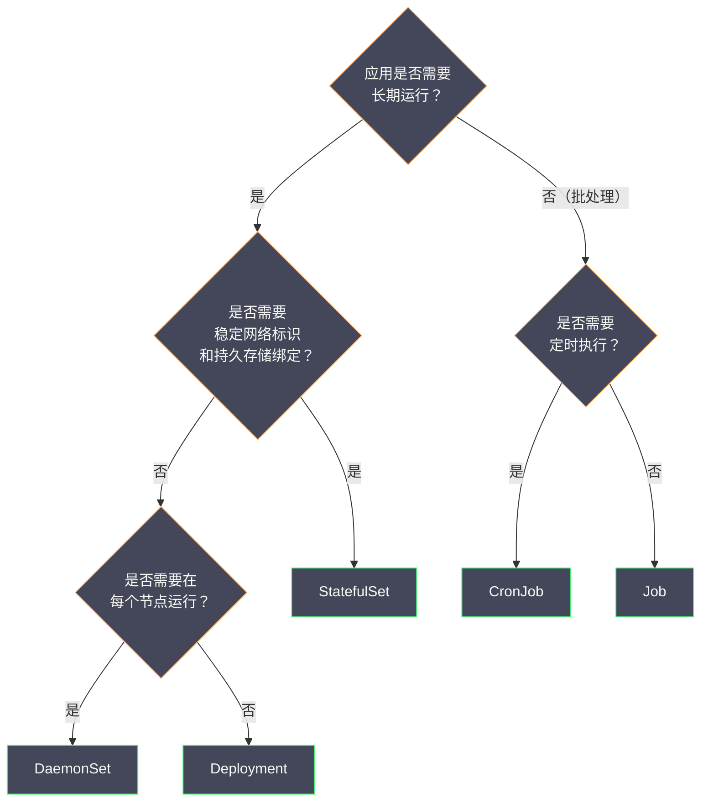

# 05 核心工作负载对象深度解析

**摘要：**

前几篇文章建立了 K8s 的基础认知框架：设计哲学、组件架构、API 对象模型、Label/Selector 关联机制。本文将这些知识聚焦到用户日常接触最多的领域——**工作负载对象**。K8s 定义了多种工作负载对象来满足不同的应用运行模式：Pod 是最小的调度单元，Deployment 管理无状态服务的副本和滚动更新，StatefulSet 为有状态应用提供稳定标识和有序管理，DaemonSet 确保每个节点运行特定的守护进程，Job/CronJob 处理一次性和定时批处理任务。本文不止于"这些对象是什么"——更重要的是剖析**为什么需要这种对象、没有它会怎样、它解决了哪些具体的工程问题**，使读者能够在面对实际业务需求时准确选择合适的工作负载类型。

---

## 第 1 章 Pod：为什么不是容器而是 Pod

### 1.1 Pod 的定义

**Pod 是 Kubernetes 中最小的可调度单元**——注意不是"容器"，而是"Pod"。一个 Pod 可以包含一个或多个容器，这些容器共享网络（同一个 [[Network Namespace]]）和存储（共享 Volume），被作为一个整体调度到同一个节点上。

### 1.2 为什么不直接调度容器

这是理解 Pod 设计的核心问题。Docker 和 containerd 都以单个容器为管理单元——为什么 K8s 要在容器之上再抽象一层"Pod"？

**原因一：紧耦合的辅助进程**

很多应用不是一个单独的进程就能完成所有工作的。考虑一个 Java Web 应用：

- 主容器：Tomcat 运行业务逻辑
- 日志采集 Sidecar：Filebeat 从共享的日志目录读取日志并发送到 [[Elasticsearch]]
- 配置热加载 Sidecar：监听 ConfigMap 变化并通知主容器重新加载配置

这三个进程有极强的共生关系——它们必须运行在同一台机器上（共享日志目录），需要通过 localhost 通信（主容器暴露管理端口供配置热加载 Sidecar 调用），它们的生命周期应该绑定在一起（主容器崩溃时，日志采集也应该停止）。

如果 K8s 以容器为调度单元，这三个容器可能被调度到不同的节点上——日志采集容器无法读取主容器的日志文件。你需要手动添加亲和性约束确保它们在同一节点，还需要自己管理共享存储和网络——这些正是 Pod 自动处理的。

**原因二：共享网络栈的需求**

在 [[02 Linux Namespace 深度解析]] 中我们介绍了 Kubernetes 的 Pod 网络模型——同一个 Pod 内的所有容器共享一个 Network Namespace。这意味着：

- 容器之间可以通过 `localhost` 互相访问
- 它们共享同一个 IP 地址和端口空间
- 不需要跨网络的服务发现

如果没有 Pod 的抽象，要实现这种"同一网络空间"的共享，用户需要手动使用 Docker 的 Container 网络模式（`--network container:<name>`）——这在大规模集群中几乎不可管理。

**原因三：共享存储的需求**

Pod 中的容器可以通过 Volume 共享文件。上面的日志采集场景中，主容器将日志写入一个 `emptyDir` Volume，Sidecar 从同一个 Volume 读取——不需要跨网络传输，直接读取本地文件系统。

### 1.3 Pod 内部的 pause 容器

在 [[02 Linux Namespace 深度解析]] 中我们已经提到过 **pause 容器**（也叫 infra 容器或 sandbox 容器）。kubelet 创建 Pod 时，首先创建一个极其轻量的 pause 容器——它的进程只是调用 `pause()` 系统调用永远休眠。pause 容器的唯一作用是**持有 Pod 的 Network Namespace 和 IPC Namespace**。

Pod 中的其他业务容器通过 `setns()` 加入 pause 容器的 Namespace。这样即使业务容器重启（进程崩溃后被 kubelet 重新创建），Pod 的 Network Namespace 仍然由 pause 容器持有——Pod 的 IP 地址不会因为业务容器重启而变化。

### 1.4 Pod 的设计边界

Pod 不是为了把所有关联的服务都塞在一起。判断两个容器是否应该放在同一个 Pod 中的标准：

**应该放在同一个 Pod**：
- 它们之间有共享文件系统的强需求（如日志 Sidecar）
- 它们之间需要通过 localhost 通信且延迟敏感
- 它们的生命周期完全绑定（一个退出另一个也没有意义）

**不应该放在同一个 Pod**：
- 它们可以独立扩缩容（前端 3 个副本，后端 5 个副本）
- 它们是不同团队维护的独立服务
- 它们之间通过网络 API 通信（这种关系用 Service 表达更合适）

> [!note] 设计原则
> Pod 的设计意图是"一个应用进程 + 它的辅助进程"，而不是"一组微服务"。**如果你不确定两个容器是否应该在同一个 Pod 中，那大概率不应该。** 大多数 Pod 只包含一个业务容器。

---

## 第 2 章 Deployment：无状态服务的标准管理器

### 2.1 Deployment 解决的问题

如果你只使用 Pod 来运行应用，你会面临三个问题：

**问题一：副本管理**。你需要手动创建 3 个 Pod YAML 文件来运行 3 个副本，扩容到 5 个需要再手动创建 2 个。Pod 被 OOM 杀死后不会自动重建——你需要自己监控并重新创建。

**问题二：版本更新**。发布新版本时，你需要逐一删除旧 Pod、创建新 Pod。如果中间出错，你需要手动回滚——删除新 Pod、重建旧 Pod。

**问题三：历史追溯**。你无法知道"上一个版本用的是什么镜像"——Pod 被删除后其配置就消失了。

Deployment 通过 ReplicaSet 间接管理 Pod，一站式解决上述问题。

### 2.2 Deployment → ReplicaSet → Pod 的三级结构

在 [[04 Label Selector 与松耦合设计]] 中我们详细分析了这个级联关系。这里补充 Deployment 的核心工作逻辑：

**正常运行时**：Deployment 只维护一个"当前"的 ReplicaSet（`spec.replicas` > 0），ReplicaSet 控制器确保 Pod 数量等于期望副本数。

**滚动更新时**：Deployment 创建一个新的 ReplicaSet（使用新的 Pod 模板），然后同时调整两个 ReplicaSet 的副本数——逐步增加新 ReplicaSet 的副本数，减少旧 ReplicaSet 的副本数。更新速率由两个参数控制：

| 参数 | 含义 | 默认值 |
| :--- | :--- | :--- |
| **`maxSurge`** | 滚动更新过程中，Pod 总数最多超出期望副本数的数量（或百分比）| 25% |
| **`maxUnavailable`** | 滚动更新过程中，最多有多少 Pod 不可用（或百分比）| 25% |

假设 `replicas=4, maxSurge=1, maxUnavailable=1`，滚动更新的过程：

```
初始状态：旧版本 4 个 Pod
步骤1：创建 1 个新 Pod（总数 5 = 4 + maxSurge），删除 1 个旧 Pod（不可用 1 ≤ maxUnavailable）
步骤2：新 Pod Ready 后，再创建 1 个新 Pod，再删除 1 个旧 Pod
...
最终状态：新版本 4 个 Pod
```

**回滚**：Deployment 保留旧的 ReplicaSet（`spec.replicas` 缩为 0 但对象仍在）。回滚时只需将旧 ReplicaSet 的副本数恢复、将当前 ReplicaSet 的副本数缩为 0。`spec.revisionHistoryLimit`（默认 10）控制保留多少个历史 ReplicaSet。

```bash
# 查看 Deployment 的历史版本
kubectl rollout history deployment web
# REVISION  CHANGE-CAUSE
# 1         Initial deploy
# 2         Update to nginx:1.25
# 3         Update to nginx:1.26

# 回滚到上一个版本
kubectl rollout undo deployment web

# 回滚到指定版本
kubectl rollout undo deployment web --to-revision=1
```

### 2.3 Deployment 的适用场景

Deployment 适合**无状态应用**——即每个 Pod 副本是可互换的，不需要稳定的网络标识或持久存储绑定。典型场景：

- Web 服务器（Nginx、Tomcat）
- API 服务
- 无状态的微服务
- 前端应用

---

## 第 3 章 StatefulSet：有状态应用的有序管理

### 3.1 有状态应用的核心需求

Deployment 对 Pod 的管理策略是"所有副本完全等价"——Pod 的名称是随机的（`web-abc123-x1y2z`），调度到哪个节点不确定，删除重建后名称和 IP 都会变化。这对无状态服务没有问题，但对有状态应用是致命的。

考虑一个 3 节点的 MySQL 主从集群：

**需求一：稳定的网络标识**。MySQL 的复制配置中，从节点需要知道主节点的地址。如果主节点的 Pod 被重建后 IP 和域名都变了，所有从节点的复制配置就失效了——需要手动更新。

**需求二：稳定的持久存储绑定**。每个 MySQL 实例的数据存储在独立的磁盘卷上。如果 Pod 被重建后绑定到了一个新的空卷，之前的所有数据就丢失了。Pod 必须始终绑定到它之前使用的那个卷。

**需求三：有序的部署和扩缩容**。MySQL 主从集群应该先启动主节点（index 0），再启动从节点（index 1、2）——从节点需要主节点已经运行才能建立复制关系。缩容时应该先删除最后一个从节点（index 2），而不是随机删除。

### 3.2 StatefulSet 提供的保证

| 保证 | Deployment | StatefulSet |
| :--- | :--- | :--- |
| **Pod 名称** | 随机后缀（`web-abc123-x1y2z`）| 有序编号（`mysql-0`, `mysql-1`, `mysql-2`）|
| **DNS 名称** | 无稳定 DNS | 每个 Pod 有稳定的 DNS（`mysql-0.mysql-svc.default.svc.cluster.local`）|
| **存储绑定** | 所有 Pod 共享相同的 PVC 模板 | 每个 Pod 有独立的 PVC（`data-mysql-0`, `data-mysql-1`）|
| **部署顺序** | 并行创建所有 Pod | 按序号逐一创建（0 → 1 → 2）|
| **缩容顺序** | 随机删除 Pod | 按逆序号逐一删除（2 → 1 → 0）|
| **更新顺序** | 随机替换 | 按逆序号逐一更新（2 → 1 → 0）|

### 3.3 Headless Service

StatefulSet 需要配合一个 **Headless Service**（`clusterIP: None`）使用。普通 Service 有一个 ClusterIP，DNS 解析返回的是 ClusterIP。Headless Service 没有 ClusterIP，DNS 解析直接返回后端 Pod 的 IP 地址——同时为每个 Pod 创建独立的 DNS A 记录。

```yaml
apiVersion: v1
kind: Service
metadata:
  name: mysql-svc
spec:
  clusterIP: None       # Headless Service
  selector:
    app: mysql
  ports:
    - port: 3306
---
apiVersion: apps/v1
kind: StatefulSet
metadata:
  name: mysql
spec:
  serviceName: mysql-svc    # 关联的 Headless Service
  replicas: 3
  selector:
    matchLabels:
      app: mysql
  template:
    metadata:
      labels:
        app: mysql
    spec:
      containers:
        - name: mysql
          image: mysql:8.0
  volumeClaimTemplates:       # 每个 Pod 独立的 PVC
    - metadata:
        name: data
      spec:
        accessModes: ["ReadWriteOnce"]
        resources:
          requests:
            storage: 10Gi
```

创建后的 DNS 记录：

```
mysql-0.mysql-svc.default.svc.cluster.local → 10.244.1.5
mysql-1.mysql-svc.default.svc.cluster.local → 10.244.2.8
mysql-2.mysql-svc.default.svc.cluster.local → 10.244.3.2
```

即使 `mysql-0` 被重建（调度到不同节点，获得新的 IP），它的 DNS 名称仍然是 `mysql-0.mysql-svc.default.svc.cluster.local`——只是 IP 地址更新了。从节点只需要配置主节点的 DNS 名称（而非 IP），重建后自动解析到新 IP。

### 3.4 volumeClaimTemplates：持久存储绑定

StatefulSet 的 `volumeClaimTemplates` 为每个 Pod 创建独立的 PVC（PersistentVolumeClaim）：

```
mysql-0 → PVC: data-mysql-0 → PV: pv-xxx-001
mysql-1 → PVC: data-mysql-1 → PV: pv-xxx-002
mysql-2 → PVC: data-mysql-2 → PV: pv-xxx-003
```

**关键特性**：当 `mysql-0` 被删除并重建时，新的 `mysql-0` Pod 仍然绑定到 `data-mysql-0` PVC——因为 PVC 名称是确定性的（`<volumeClaimTemplate.name>-<statefulset.name>-<ordinal>`）。PVC 和 PV 不随 Pod 删除而删除——数据得以保留。

> [!warning] 缩容时的存储行为
> 缩容 StatefulSet（如从 3 减到 2）时，`mysql-2` Pod 会被删除，但 `data-mysql-2` PVC **不会被自动删除**——这是为了防止数据意外丢失。如果后续再扩容回 3，新的 `mysql-2` 会自动绑定到保留的 `data-mysql-2` PVC，恢复之前的数据。如果确定不再需要，需要手动删除 PVC。

---

## 第 4 章 DaemonSet：每个节点运行一个守护进程

### 4.1 DaemonSet 解决的问题

某些应用需要在集群的**每个节点**（或满足条件的节点）上运行一个副本——不是"3 个副本分散在集群中"，而是"每个节点恰好 1 个"。典型场景：

- **日志采集**：每个节点上运行一个 Fluentd/Filebeat，采集该节点上所有 Pod 的日志
- **监控 Agent**：每个节点上运行一个 Node Exporter，采集节点级的 CPU/内存/磁盘指标
- **网络插件**：每个节点上运行 CNI 插件的 Agent（如 Calico Felix、Cilium Agent）
- **存储插件**：每个节点上运行 CSI 驱动的 Node Agent

Deployment 不适合这个场景——`replicas=N`（N 等于节点数）虽然能创建相同数量的 Pod，但 Scheduler 可能把多个 Pod 调度到同一个节点上（尤其当节点资源不均衡时），同时有些节点可能没有 Pod。

### 4.2 DaemonSet 的工作机制

DaemonSet 控制器 Watch 节点列表和 Pod 列表。当一个新节点加入集群时，DaemonSet 自动在该节点上创建一个 Pod。当一个节点被移除时，该节点上的 DaemonSet Pod 也被清理。

DaemonSet 创建的 Pod 具有以下特殊属性：

- **`spec.nodeName` 直接指定**：DaemonSet 控制器直接在 Pod 的 `spec.nodeName` 中指定目标节点——这些 Pod **不经过 Scheduler 调度**（在 K8s 1.12+ 中已改为通过 Scheduler 调度，但添加了 `NodeAffinity` 确保调度到目标节点）。
- **容忍所有 Taint**：DaemonSet 的 Pod 模板中通常配置了对 `node-role.kubernetes.io/control-plane` 等 Taint 的容忍——确保即使在 Master 节点上也能运行（如果需要）。

### 4.3 节点选择

DaemonSet 默认在所有节点上运行 Pod。如果只需要在部分节点上运行（如只在有 GPU 的节点上运行 GPU 监控 Agent），可以使用 `nodeSelector` 或 `nodeAffinity`：

```yaml
apiVersion: apps/v1
kind: DaemonSet
metadata:
  name: gpu-monitor
spec:
  selector:
    matchLabels:
      app: gpu-monitor
  template:
    spec:
      nodeSelector:
        hardware: gpu           # 只在带 hardware=gpu 标签的节点上运行
      containers:
        - name: monitor
          image: gpu-monitor:v1
```

---

## 第 5 章 Job 与 CronJob：批处理任务

### 5.1 Job 解决的问题

Deployment 和 StatefulSet 管理的是**长期运行**的服务——Pod 异常退出后会被自动重启，永远保持运行。但批处理任务的需求不同：

- 数据库迁移脚本：运行一次，成功后退出
- 模型训练任务：可能需要多个并行 Worker，全部完成后退出
- 数据导出任务：每天凌晨 3 点运行一次

如果用 Deployment 跑批处理脚本，脚本成功退出后（exit code 0），kubelet 会立即重启它——因为 Deployment 的目标是"保持运行"。

Job 的目标是**确保任务成功完成指定次数**——Pod 成功退出后不再重启，Pod 失败后根据策略重试。

### 5.2 Job 的并行模型

| 参数 | 含义 | 典型配置 |
| :--- | :--- | :--- |
| **`completions`** | 任务需要成功完成的总次数 | 1（单次任务）、10（需要处理 10 批数据）|
| **`parallelism`** | 同时运行的 Pod 数量（并行度）| 1（串行）、3（最多 3 个并行）|
| **`backoffLimit`** | 允许的最大失败重试次数 | 6（默认）|

三种常见的并行模式：

**单次任务**（`completions=1, parallelism=1`）：最简单的场景——运行一个 Pod，成功退出即完成。

```yaml
apiVersion: batch/v1
kind: Job
metadata:
  name: db-migrate
spec:
  template:
    spec:
      containers:
        - name: migrate
          image: myapp:v1
          command: ["python", "migrate.py"]
      restartPolicy: Never    # Job 的 Pod 必须是 Never 或 OnFailure
```

**固定完成次数**（`completions=10, parallelism=3`）：总共需要 10 个 Pod 成功完成，最多 3 个同时运行。适合"将一个大任务分成 10 个子任务并行处理"的场景。

**工作队列模式**（`completions` 不设置, `parallelism=3`）：3 个 Pod 并行运行，从外部工作队列（如 RabbitMQ、Redis）获取任务。当所有 Pod 都成功退出时（意味着队列中没有更多任务），Job 完成。

### 5.3 CronJob

CronJob 在 Job 之上添加了定时调度的能力——按 Cron 表达式周期性地创建 Job：

```yaml
apiVersion: batch/v1
kind: CronJob
metadata:
  name: daily-report
spec:
  schedule: "0 3 * * *"        # 每天凌晨 3 点
  concurrencyPolicy: Forbid     # 如果上一次 Job 还在运行，跳过本次
  successfulJobsHistoryLimit: 3 # 保留最近 3 次成功的 Job
  failedJobsHistoryLimit: 1     # 保留最近 1 次失败的 Job
  jobTemplate:
    spec:
      template:
        spec:
          containers:
            - name: report
              image: report-generator:v1
          restartPolicy: Never
```

CronJob 的 `concurrencyPolicy` 控制并发行为：

| 策略 | 行为 |
| :--- | :--- |
| **Allow**（默认）| 允许并发——即使上一次 Job 还在运行，也创建新的 Job |
| **Forbid** | 禁止并发——上一次 Job 还在运行时跳过本次调度 |
| **Replace** | 替换——停止正在运行的 Job，创建新的 Job |

---

## 第 6 章 工作负载对象选型指南

### 6.1 决策树



### 6.2 对比总结

| 维度 | Deployment | StatefulSet | DaemonSet | Job/CronJob |
| :--- | :--- | :--- | :--- | :--- |
| **运行模式** | 长期运行 | 长期运行 | 长期运行 | 运行至完成 |
| **副本数** | 用户指定 | 用户指定 | 自动（= 节点数）| 用户指定 completions |
| **Pod 标识** | 随机 | 有序编号 | 每节点一个 | 随机 |
| **存储** | 共享 PVC 模板 | 每 Pod 独立 PVC | 通常用 hostPath | 通常无持久存储 |
| **更新策略** | 滚动更新 | 有序滚动更新 | 滚动更新 | 不适用 |
| **典型场景** | Web 服务、API | MySQL、Redis、Kafka | 日志采集、监控 Agent | 数据迁移、模型训练 |

---

## 第 7 章 总结

本文深入分析了 K8s 的五种核心工作负载对象：

- **Pod**：最小调度单元，为紧耦合的辅助容器提供共享网络和存储。判断标准：如果两个容器必须共享文件系统或通过 localhost 通信，放在同一个 Pod
- **Deployment**：无状态服务的标准管理器，通过 ReplicaSet 实现副本管理、滚动更新和回滚
- **StatefulSet**：为有状态应用提供稳定的网络标识（有序 Pod 名 + Headless Service DNS）和持久存储绑定（volumeClaimTemplates），有序部署和缩容
- **DaemonSet**：确保每个节点运行一个 Pod，用于日志采集、监控 Agent、网络/存储插件
- **Job/CronJob**：批处理任务的管理器，确保任务成功完成指定次数，支持并行执行和定时调度

下一篇 [[06 etcd 与 Kubernetes 的状态存储]] 将深入 K8s 的"唯一真相来源"——etcd 的 Raft 共识、Watch 机制和 MVCC 版本控制。

---

## 参考资料

1. Kubernetes Documentation - Workloads：https://kubernetes.io/docs/concepts/workloads/
2. Kubernetes Documentation - Pods：https://kubernetes.io/docs/concepts/workloads/pods/
3. Kubernetes Documentation - Deployments：https://kubernetes.io/docs/concepts/workloads/controllers/deployment/
4. Kubernetes Documentation - StatefulSets：https://kubernetes.io/docs/concepts/workloads/controllers/statefulset/
5. Kubernetes Documentation - DaemonSet：https://kubernetes.io/docs/concepts/workloads/controllers/daemonset/
6. Kubernetes Documentation - Jobs：https://kubernetes.io/docs/concepts/workloads/controllers/job/
7. Brendan Burns (2018). *Designing Distributed Systems*. O'Reilly, Chapter 2: Sidecar Pattern.

---

> [!note] 思考题
> 1. CPU Request 用于调度决策——调度器确保 Node 有足够的可分配 CPU。CPU Limit 通过 CFS Bandwidth Control 强制执行——超过 Limit 的 CPU 使用会被 throttled。但 CPU throttling 不会杀死进程（与内存 OOM 不同）。throttled 的表现是什么——进程'变慢'还是'暂停'？在延迟敏感的应用中，CPU throttling 如何影响 P99 延迟？
> 2. 内存 Request 和 Limit 的设置更关键——超过 Limit 会被 OOM Kill。在 Java 应用中，JVM 堆内存只是总内存的一部分——还包括 Metaspace、线程栈、NIO Buffer、JIT 编译缓存等。如果 JVM 堆设为 2GB 但 Pod 的内存 Limit 也设为 2GB——非堆内存可能导致 OOM Kill。你如何估算 Java 容器的总内存需求？经验法则是'Limit = 堆 × 1.5-2'吗？
> 3. LimitRange 和 ResourceQuota 在 Namespace 级别控制资源使用。LimitRange 为未设置资源的 Pod 自动注入默认值（`defaultRequest/defaultLimit`）。ResourceQuota 限制 Namespace 的总资源使用量。在多租户集群中，如何合理设置每个 Namespace 的 Quota 以防止'噪声邻居'问题？
