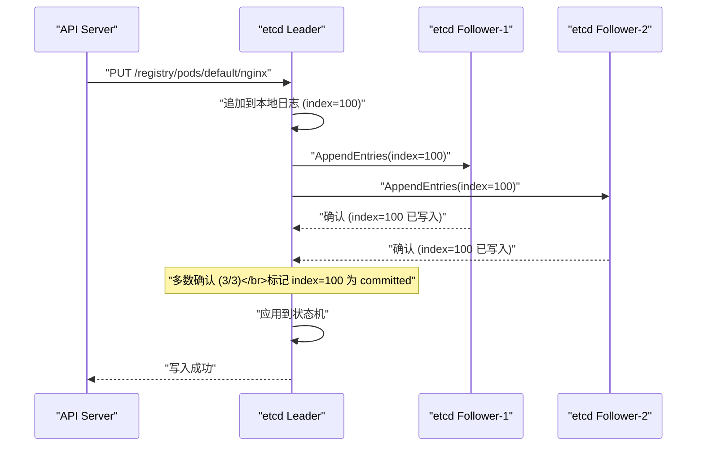
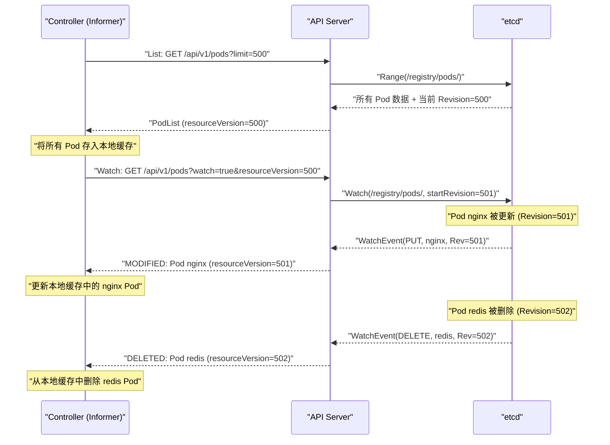

# 06 etcd 与 Kubernetes 的状态存储

**摘要：**

在 [[02 Kubernetes 整体架构]] 中我们确立了一个关键事实：**etcd 是 Kubernetes 集群的唯一真相来源（Single Source of Truth）**——所有的 Pod 定义、Deployment 配置、Service 信息、Secret 数据都存储在 etcd 中，API Server 是 etcd 的唯一客户端。etcd 的健康程度直接决定了整个 K8s 集群的可用性——如果 etcd 不可用，API Server 无法读写任何数据，所有控制器停止工作，kubectl 命令全部超时，新的 Pod 无法创建，故障 Pod 无法自愈。但 etcd 对大多数 K8s 用户来说是一个"黑盒"——它怎么保证数据不丢失？怎么在多节点之间保持一致？K8s 的 Watch 机制和乐观并发控制（ResourceVersion）在 etcd 层面是怎么实现的？本文从 etcd 的核心机制出发，深入剖析 Raft 共识算法如何保证强一致性，MVCC 多版本并发控制如何支撑 K8s 的乐观锁，Watch 机制如何驱动 K8s 的事件驱动架构，最后总结 etcd 在生产环境中的运维要点。

---

## 第 1 章 etcd 是什么

### 1.1 定位与历史

etcd 是一个**分布式、强一致性的键值存储系统**，由 CoreOS 团队在 2013 年开发（后来 CoreOS 被 Red Hat 收购，Red Hat 又被 IBM 收购）。etcd 这个名字来源于 Unix 的 `/etc` 目录（存放系统配置文件）加上 "d"（distributed 的缩写）——意为"分布式的配置存储"。

etcd 最初的设计目标是为 CoreOS 的 Container Linux 提供集群配置的一致性存储，后来被 Kubernetes 选为状态存储后端，从此成为云原生基础设施中最关键的组件之一。2018 年 etcd 从 CoreOS 捐赠给 CNCF，2020 年成为 CNCF 毕业项目。

### 1.2 为什么 Kubernetes 选择 etcd

K8s 的状态存储需要满足以下要求：

**强一致性**：当 API Server 写入一条数据后，任何后续的读取必须能看到这条数据——不能出现"写入成功但读不到"的情况。这是因为 K8s 的控制器依赖 Watch 机制获取最新状态来做决策——如果读到的是旧数据，控制器可能做出错误的决策（如重复创建 Pod）。

**高可用**：存储系统必须能容忍部分节点故障而不丢失数据、不停止服务。K8s 集群的所有状态都在 etcd 中——etcd 的不可用意味着整个集群的不可用。

**Watch 支持**：K8s 的事件驱动架构要求存储系统能高效地通知客户端数据变化。如果没有 Watch，所有控制器只能轮询——在大规模集群中（数万个对象）轮询的开销是不可接受的。

**事务支持**：K8s 需要原子的"比较并交换"（Compare-And-Swap）操作来实现乐观并发控制——"只有当 resourceVersion 等于 X 时才更新"。

etcd 完美满足了这四个要求。它基于 Raft 共识算法保证强一致性和高可用，原生支持 Watch 和事务操作。

### 1.3 etcd 与其他存储系统的对比

| 维度 | etcd | ZooKeeper | Consul | Redis |
| :--- | :--- | :--- | :--- | :--- |
| **共识算法** | Raft | ZAB（类 Paxos）| Raft | 无（主从复制，非强一致）|
| **一致性** | 线性一致性 | 顺序一致性 | 线性一致性 | 最终一致性 |
| **数据模型** | 扁平键值 + 前缀范围查询 | 树形层次结构 | 键值 + 服务发现 | 丰富的数据结构 |
| **Watch** | 基于 revision 的可靠 Watch | 基于 session 的 Watch | 基于 index 的 Watch | Pub/Sub（不可靠）|
| **定位** | 配置存储 / 元数据存储 | 分布式协调 | 服务发现 + KV 存储 | 缓存 / 数据存储 |
| **API** | gRPC + HTTP/JSON | 自定义协议 | HTTP | 自定义协议（RESP）|

K8s 早期（v1.0-v1.1）使用的是 etcd v2，v1.13 起完全迁移到 etcd v3。v3 相比 v2 的核心改进是：从 HTTP/JSON 切换到 gRPC（性能更高）、引入 MVCC（支持历史版本查询和可靠的 Watch）、引入 Lease（用于 TTL 和 Leader Election）。

---

## 第 2 章 Raft 共识算法

### 2.1 分布式共识的核心问题

etcd 运行在多个节点上（通常 3 或 5 个）。一个写入请求到达 etcd 后，必须被"足够多"的节点确认后才算成功——这样即使部分节点故障，数据也不会丢失。但多节点之间如何就"哪些数据已经被确认"达成一致？这就是**分布式共识问题**。

分布式共识的困难在于：节点可能崩溃、网络可能延迟或分区、消息可能丢失或重复。在这些不确定性下，所有正常工作的节点必须对"数据的顺序和内容"达成完全一致的共识——任何不一致都会导致数据分裂（脑裂），破坏系统的正确性。

### 2.2 Raft 的核心思想

**Raft** 是 Diego Ongaro 在 2014 年提出的共识算法，其设计目标是"可理解性"——相比 Paxos 算法更容易理解和实现。Raft 将共识问题分解为三个子问题：

**子问题一：Leader Election（领导者选举）**

Raft 中的节点有三种角色：**Leader**（领导者）、**Follower**（跟随者）、**Candidate**（候选人）。在任何时刻，集群中只有一个 Leader——所有写入请求都由 Leader 处理。

选举流程：

1. 初始状态：所有节点都是 Follower
2. 每个 Follower 维护一个随机超时的选举定时器（通常 150-300ms）
3. 如果一个 Follower 在超时时间内没有收到 Leader 的心跳，它认为 Leader 已经故障，转变为 Candidate
4. Candidate 向所有其他节点发送"投票请求"（RequestVote）
5. 每个节点在一个 **Term（任期）** 内只能投一票（先到先得）
6. 如果 Candidate 获得了多数票（>N/2），它成为新的 Leader
7. 新 Leader 开始向所有节点发送心跳，阻止其他节点发起新的选举

**为什么使用随机超时？** 如果所有 Follower 的超时时间相同，在 Leader 故障时所有 Follower 会同时变为 Candidate 并同时发起选举——可能导致选票分裂（没有人获得多数票）。随机超时确保了大概率只有一个 Follower 最先超时并发起选举，避免了选票分裂。

**子问题二：Log Replication（日志复制）**

Leader 接收客户端的写入请求后，将请求追加到自己的日志（Log）中，然后将日志条目（Log Entry）发送给所有 Follower。当**多数节点**（包括 Leader 自己）都将该条目写入本地日志后，Leader 将该条目标记为 **committed（已提交）**，然后应用到状态机（即 etcd 的键值存储），并响应客户端"写入成功"。



在 3 节点集群中，写入需要至少 2 个节点确认（Leader + 1 个 Follower）。即使 1 个 Follower 暂时不可用（网络分区或崩溃），写入仍然可以成功——这就是"容忍 (N-1)/2 个节点故障"的含义。

**子问题三：Safety（安全性）**

Raft 保证以下安全性质：

- **Election Safety**：在同一个 Term 中最多只有一个 Leader
- **Leader Append-Only**：Leader 只追加日志，不删除或修改已有条目
- **Log Matching**：如果两个节点的日志在某个 index 处的 Term 相同，则该 index 之前的所有条目都完全一致
- **State Machine Safety**：如果一个条目被 committed，所有节点最终都会在同一个 index 处应用同样的条目

这些性质的组合保证了：**所有节点的状态机最终将处于完全一致的状态——无论经历了怎样的故障和恢复。**

### 2.3 etcd 的读写路径

**写入路径（线性一致性写）**：

1. 客户端（API Server）向 etcd Leader 发送写入请求
2. Leader 将请求转化为日志条目，追加到本地日志
3. Leader 通过 Raft 将日志条目复制到 Follower
4. 多数节点确认后，Leader 将条目 commit 并应用到 boltdb（etcd 的底层存储引擎）
5. Leader 响应客户端

**读取路径（线性一致性读）**：

etcd 的默认读取模式是**线性一致性读（Linearizable Read）**——读取必须返回最新的已提交数据。实现方式有两种：

- **ReadIndex**（默认）：Leader 在处理读请求前，先确认自己仍然是 Leader（通过向多数节点发送心跳并收到确认），然后读取本地状态机。这避免了"过期 Leader 返回旧数据"的问题。
- **Serializable Read**：直接读取本地状态机，不确认 Leader 身份。速度更快但可能读到旧数据（在 Leader 切换期间）。K8s 的某些不敏感的读取（如 Watch 的初始 List）可以使用这种模式。

> [!info] 为什么读取也需要共识？
> 考虑网络分区场景：旧 Leader 被隔离在少数分区中，新 Leader 已经在多数分区中当选并接受了新的写入。如果旧 Leader 直接响应读请求，客户端会读到旧数据——违反线性一致性。ReadIndex 机制通过"读前确认 Leader 身份"解决了这个问题。

---

## 第 3 章 MVCC 与 Revision

### 3.1 什么是 MVCC

**MVCC（Multi-Version Concurrency Control，多版本并发控制）** 是 etcd v3 引入的核心机制——每次写入操作不是覆盖旧值，而是创建一个新的版本。旧版本被保留，直到被显式压缩（Compaction）。

etcd 的每次写操作都会产生一个全局递增的 **Revision（修订号）**。这个 Revision 是整个 etcd 集群的全局计数器——不是某个 key 的版本，而是所有写操作的全局序号。

```
操作 1：PUT /a = "hello"    → Revision = 1
操作 2：PUT /b = "world"    → Revision = 2
操作 3：PUT /a = "hi"       → Revision = 3  (key /a 的第 2 个版本)
操作 4：DELETE /b            → Revision = 4  (tombstone)
```

每个 key 维护一个版本链——通过 Revision 可以访问 key 的任意历史版本。

### 3.2 Revision 与 K8s 的 ResourceVersion

**K8s API 对象的 `metadata.resourceVersion` 就是 etcd 的 Revision。** 当 API Server 从 etcd 读取一个对象时，etcd 返回该对象最后一次修改时的 Revision，API Server 将其作为 `resourceVersion` 填入响应中。

这个映射关系是 K8s 乐观并发控制的基础：

```
1. Client 读取 Pod（etcd 返回 Revision=100）→ resourceVersion="100"
2. Client 修改 Pod 并发送更新请求（携带 resourceVersion="100"）
3. API Server 向 etcd 发起事务：
   "如果 key /registry/pods/default/nginx 的当前 Revision == 100，
    则写入新值（产生新的 Revision=101）；否则失败"
4. 如果在步骤 1-3 之间有其他人修改了该 Pod（Revision 变成了 101），
   事务条件不满足，写入失败 → API Server 返回 409 Conflict
```

etcd 的事务（Transaction）原生支持这种"比较并交换"语义——`If(Revision == X) Then(PUT) Else(Abort)`——这就是 K8s 乐观并发控制的底层实现。

### 3.3 Compaction：历史版本清理

MVCC 保留了所有历史版本，但磁盘空间不是无限的。etcd 通过 **Compaction（压缩/紧缩）** 清理旧版本——指定一个 Revision，该 Revision 之前的所有旧版本数据被删除。

K8s 的 API Server 会自动配置 etcd 的 Compaction 策略——默认每 5 分钟压缩一次，保留最近 5 分钟内的历史版本。

> [!warning] Compaction 与 Watch 的关系
> 如果一个 Watch 的 `startRevision` 早于 Compaction 点，etcd 无法提供该 Revision 之后的变更历史——Watch 会收到 `ErrCompacted` 错误。API Server 在收到此错误后，会通知 Informer 重新执行 Full List（重新同步所有数据）。这就是为什么 K8s 的 Watch 有时会"断开并重新同步"——根本原因是 etcd Compaction 导致历史版本被清理。

---

## 第 4 章 Watch 机制

### 4.1 Watch 的工作原理

etcd 的 Watch 允许客户端监听一个 key 或 key 前缀的变化。当被监听的数据发生变化时，etcd 通过 gRPC 流（Streaming）将变更事件推送给客户端。

```
Client → etcd: Watch(key="/registry/pods/default/", startRevision=100)
etcd → Client: WatchEvent{Type=PUT, Key="/registry/pods/default/nginx", Value=..., ModRevision=101}
etcd → Client: WatchEvent{Type=DELETE, Key="/registry/pods/default/redis", ModRevision=102}
etcd → Client: WatchEvent{Type=PUT, Key="/registry/pods/default/nginx", Value=..., ModRevision=105}
...
```

**关键特性**：

**基于 Revision 的可靠性**：Watch 请求携带 `startRevision`——etcd 从该 Revision 之后的第一个变更事件开始推送。如果客户端断线重连，只需从上次收到的最大 Revision + 1 开始 Watch，就不会遗漏任何事件。这与 [[01 Kubernetes 的诞生与设计哲学|Level-triggered]] 设计理念一致——即使 Watch 断开又重连，也能恢复到一致的状态。

**前缀 Watch**：etcd 支持对 key 前缀的 Watch。K8s 利用这一特性——Watch `/registry/pods/default/` 就能监听 `default` Namespace 下所有 Pod 的变化。

**多路复用**：一个 gRPC 连接上可以承载多个 Watch（通过 WatchID 区分），减少连接数。

### 4.2 K8s 的 List-Watch 协议

API Server 在 etcd 的 Watch 之上构建了 K8s 的 **List-Watch 协议**——这是所有控制器获取集群状态的标准方式：



**流程**：

1. **Initial List**：控制器首先执行一次 List 操作，获取所有资源的当前状态和一个 `resourceVersion`
2. **Watch**：然后从该 `resourceVersion` 开始 Watch，获取后续的增量变更
3. **本地缓存**：控制器在内存中维护一份资源的本地缓存——List 填充初始数据，Watch 的增量事件更新缓存

控制器在做协调决策时，**读取的是本地缓存而非 API Server**——这大幅减少了 API Server 和 etcd 的读取压力。在大规模集群中（数万 Pod），如果所有控制器的每次协调都直接查询 API Server，API Server 和 etcd 会被压垮。

### 4.3 Watch Bookmark

在大规模集群中，如果某个资源类型长时间没有变更（如几分钟内没有 Pod 被创建或删除），Watch 连接上不会有任何事件传输。如果此时 etcd 执行了 Compaction，Watch 的 `startRevision` 可能已经被压缩掉了。当控制器重连时，它尝试从一个已被压缩的 Revision 开始 Watch——导致 `ErrCompacted`，必须执行代价昂贵的 Full List。

**Watch Bookmark** 是 K8s 1.15 引入的优化——API Server 定期（默认每 60 秒）在 Watch 流中发送一个 `BOOKMARK` 类型的事件，只包含最新的 `resourceVersion`，不包含数据。控制器收到 Bookmark 后更新自己记录的 `resourceVersion`——即使之后断线重连，也能从一个较新的 Revision 开始 Watch，避免被 Compaction 影响。

---

## 第 5 章 etcd 的存储引擎

### 5.1 boltdb

etcd 使用 **boltdb**（现在是其 fork **bbolt**）作为底层存储引擎。boltdb 是一个嵌入式的 B+ 树键值存储——数据以 B+ 树的形式组织在磁盘上的单个文件中。

boltdb 的特点：

- **B+ 树结构**：支持高效的范围查询（Range Query）——这是 etcd 前缀查询的基础
- **ACID 事务**：支持完整的事务语义——etcd 的 Transaction 直接映射到 boltdb 的事务
- **单写多读**：同一时刻只有一个写事务（通过写锁保证），但可以有多个并发读事务
- **mmap**：使用内存映射文件（mmap）加速读取——操作系统将磁盘文件映射到内存，读取时直接访问内存页

### 5.2 etcd 的数据存储结构

etcd 内部维护两个 B+ 树索引：

**key index（键索引）**：从 key 映射到该 key 的所有 Revision 列表。

```
key="/registry/pods/default/nginx" → [Rev=10(创建), Rev=50(更新), Rev=100(更新)]
key="/registry/pods/default/redis" → [Rev=20(创建), Rev=80(删除)]
```

**backend（后端存储）**：从 Revision 映射到实际的键值数据。

```
Rev=10 → {key="/registry/pods/default/nginx", value=<Pod 的 protobuf 序列化数据>}
Rev=50 → {key="/registry/pods/default/nginx", value=<更新后的 Pod 数据>}
```

查询一个 key 的最新值时，先在 key index 中找到该 key 的最大 Revision，然后在 backend 中查找该 Revision 对应的数据。查询历史版本时，在 key index 中找到指定 Revision 之前的最大 Revision，然后查找对应数据。

### 5.3 Lease 机制

etcd 的 **Lease** 是一种带 TTL（Time-To-Live）的租约机制——客户端创建一个 Lease 并绑定到 key 上，如果客户端在 TTL 到期前没有续租（KeepAlive），Lease 过期，绑定的 key 被自动删除。

K8s 利用 Lease 实现了多个关键功能：

**节点心跳**：每个 kubelet 在 etcd 中维护一个 Lease 对象（`coordination.k8s.io/v1/Lease`），定期续租。如果 kubelet 崩溃或网络不可达，Lease 过期，Node Controller 检测到节点不健康。

**Leader Election**：Controller Manager 和 Scheduler 使用 Lease 进行 Leader 选举——Leader 持续续租一个 Lease，如果 Leader 崩溃，Lease 过期，其他候选者竞争创建新的 Lease 成为 Leader。

**API Server 身份标识**：每个 API Server 实例通过 Lease 注册自己的存在，其他组件可以通过查询 Lease 获知当前有多少个活跃的 API Server 实例。

---

## 第 6 章 etcd 在 K8s 中的容量与性能

### 6.1 etcd 的容量限制

etcd 的默认数据库大小限制是 **2GB**（可配置到最大 8GB）。这个限制看似很小，但对于 K8s 的元数据存储来说通常足够——K8s 存储的是对象的配置信息（YAML/JSON/protobuf），不是应用数据。

一些参考数据：

| 集群规模 | 大致的 etcd 数据量 |
| :--- | :--- |
| 100 个 Pod, 50 个 Service | ~50 MB |
| 1000 个 Pod, 200 个 Service | ~200 MB |
| 5000 个 Pod, 1000 个 Service | ~500 MB - 1 GB |
| 10000+ 个 Pod | 可能需要调大 etcd 配额 |

大量的 ConfigMap、Secret、CRD 资源也会占用 etcd 空间。特别需要注意的是 **Secret** 和大型 **ConfigMap**——一个 1MB 的 ConfigMap 在 etcd 中会占用约 1.5MB（protobuf 序列化 + 元数据开销），如果有 100 个这样的 ConfigMap 就占用了 150MB。

### 6.2 影响 etcd 性能的关键因素

**磁盘延迟**：etcd 是一个写密集型应用——每次 Raft commit 都需要将日志持久化到磁盘（fsync）。磁盘的写入延迟直接决定了 etcd 的写入吞吐量。**生产环境必须使用 SSD**——机械硬盘的 fsync 延迟（5-20ms）会严重拖慢 etcd，SSD 的 fsync 延迟通常在 0.1-1ms。

**网络延迟**：Raft 的写入需要 Leader 与 Follower 之间的往返通信。节点之间的网络延迟应尽可能低——同一数据中心内通常 <1ms，跨可用区 1-5ms，跨 Region >50ms（不推荐跨 Region 部署 etcd）。

**对象大小**：K8s 的 API 对象默认大小限制是 1.5MB（由 API Server 的 `--max-request-bytes` 控制）。大对象会增加 etcd 的存储压力和网络传输开销。应避免在 ConfigMap/Secret 中存储过大的数据。

**Watch 数量**：大量的 Watch 会增加 etcd 的 CPU 和内存开销——每次 key 变更都需要遍历所有匹配的 Watch 并推送事件。在大规模集群中，API Server 可能建立数千个 Watch。

### 6.3 关键指标与告警

| 指标 | 健康值 | 告警阈值 |
| :--- | :--- | :--- |
| **WAL fsync 延迟**（`etcd_disk_wal_fsync_duration_seconds`）| p99 < 10ms | p99 > 25ms |
| **后端 commit 延迟**（`etcd_disk_backend_commit_duration_seconds`）| p99 < 25ms | p99 > 100ms |
| **数据库大小**（`etcd_mvcc_db_total_size_in_bytes`）| < 配额的 80% | > 配额的 80% |
| **Leader 切换频率**（`etcd_server_leader_changes_seen_total`）| 稳定不变 | 短时间内多次切换 |
| **Raft 提案失败率**（`etcd_server_proposals_failed_total`）| 0 | > 0 且持续增长 |
| **活跃 Watch 数量**（`etcd_debugging_mvcc_watcher_total`）| 与集群规模相关 | 异常快速增长 |

---

## 第 7 章 etcd 的运维实践

### 7.1 备份与恢复

etcd 备份是 K8s 集群灾难恢复的**唯一保障**——没有 etcd 备份，集群状态丢失后无法恢复。

```bash
# 创建快照备份
ETCDCTL_API=3 etcdctl snapshot save /backup/etcd-$(date +%Y%m%d-%H%M%S).snap \
  --endpoints=https://127.0.0.1:2379 \
  --cacert=/etc/kubernetes/pki/etcd/ca.crt \
  --cert=/etc/kubernetes/pki/etcd/server.crt \
  --key=/etc/kubernetes/pki/etcd/server.key

# 验证备份文件
etcdctl snapshot status /backup/etcd-20260304-100000.snap --write-out=table
```

**备份策略建议**：

- **频率**：每 30 分钟一次（根据集群变更频率调整）
- **保留**：至少保留最近 7 天的备份
- **存储**：备份文件必须存储在 etcd 节点之外的独立存储上（如对象存储）
- **验证**：定期执行备份恢复演练，确保备份文件可用

### 7.2 碎片整理

etcd 的 boltdb 使用 Copy-on-Write 机制——删除数据后磁盘空间不会立即释放（只是标记为空闲页）。长期运行后，数据库文件中可能有大量空闲页，实际数据只占文件大小的一小部分。

**Defragmentation（碎片整理）** 可以回收空闲空间：

```bash
etcdctl defrag --endpoints=https://127.0.0.1:2379
```

> [!warning] 碎片整理的影响
> 碎片整理是一个**阻塞操作**——执行期间该 etcd 节点不响应读写请求。在 3 节点集群中，应**逐一**对每个节点执行碎片整理（先对 Follower 执行，最后对 Leader 执行），确保集群始终有多数节点可用。

### 7.3 节点数量的选择

| 节点数 | 多数 | 容忍故障数 | 适用场景 |
| :--- | :--- | :--- | :--- |
| 1 | 1 | 0 | 仅开发/测试环境 |
| 3 | 2 | 1 | 大多数生产环境 |
| 5 | 3 | 2 | 对可用性要求极高的场景 |
| 7 | 4 | 3 | 极少使用（写入延迟增加）|

**3 节点是最常见的生产配置**——容忍 1 个节点故障，同时写入只需要 2 个节点确认（延迟较低）。5 节点容忍 2 个故障，但写入需要 3 个节点确认——延迟更高，适合跨可用区部署（3 个可用区各放 1-2 个节点，容忍整个可用区故障）。

**不要使用偶数节点**——4 节点的容错能力与 3 节点相同（都只能容忍 1 个故障），但写入需要 3 个节点确认（延迟更高）。偶数节点没有任何优势。

---

## 第 8 章 总结

本文作为「架构原则与对象设计」专栏的收官，深入剖析了 K8s 的状态存储后端 etcd：

- **Raft 共识**：通过 Leader Election + Log Replication 保证多节点之间的强一致性，写入需要多数节点确认，容忍 (N-1)/2 个节点故障
- **MVCC**：每次写入创建新版本（Revision），不覆盖旧值。K8s 的 `resourceVersion` 就是 etcd 的 Revision，支撑了乐观并发控制
- **Watch**：基于 Revision 的可靠变更推送，是 K8s 事件驱动架构的基础。配合 List-Watch 协议和 Informer 本地缓存，实现高效的状态同步
- **Lease**：带 TTL 的租约机制，支撑了节点心跳和 Leader Election
- **运维要点**：SSD 存储、定期备份、碎片整理、3 或 5 节点部署

至此，「Kubernetes 架构原则与对象设计」专栏的 6 篇文章全部完成。我们从设计哲学出发，经过组件架构、API 对象模型、Label/Selector、工作负载对象，到 etcd 状态存储，建立了对 K8s 整体设计的系统性认知。下一个专栏 [[00 专栏导览|API Server 专栏]] 将深入 K8s 的核心枢纽——API Server 的请求处理管线、认证授权、准入控制和 Informer 框架。

---

## 参考资料

1. Diego Ongaro, John Ousterhout (2014). *In Search of an Understandable Consensus Algorithm*. USENIX ATC'14.
2. etcd Documentation：https://etcd.io/docs/
3. etcd Technical Overview：https://etcd.io/docs/v3.5/learning/
4. Kubernetes Documentation - Operating etcd：https://kubernetes.io/docs/tasks/administer-cluster/configure-upgrade-etcd/
5. CoreOS (2018). *etcd3: A New etcd*. CNCF Webinar.
6. boltdb/bbolt Documentation：https://github.com/etcd-io/bbolt
7. Kubernetes Enhancement Proposal - Watch Bookmark：https://github.com/kubernetes/enhancements/tree/master/keps/sig-api-machinery/956-watch-bookmark
8. Michael Hausenblas, Stefan Schimanski (2019). *Programming Kubernetes*. O'Reilly, Chapter 1 (etcd).

---

> [!note] 思考题
> 1. Operator 模式将运维知识编码为 Controller——自动化有状态应用的部署、扩缩容、备份和恢复。在数据库场景中（如 MySQL Operator），Operator 可以自动完成主从切换、备份调度和版本升级。但 Operator 本身可能有 bug——Operator 的错误操作可能导致数据丢失。你如何测试 Operator 的可靠性？Operator 的'人工审批'机制如何设计？
> 2. OperatorHub.io 和 ArtifactHub 提供了大量社区开发的 Operator。在选择第三方 Operator 时，你最关注什么维度（成熟度、社区活跃度、企业支持、代码质量）？使用第三方 Operator 的风险是什么（如 Operator 停止维护、与 Kubernetes 版本不兼容）？
> 3. Kubebuilder 是 Operator 开发的标准框架——基于 controller-runtime 库。开发一个简单的 Operator（如自动创建配置文件的 Controller）需要多少工作量？Operator SDK 与 Kubebuilder 的区别是什么？在什么场景下你会选择编写 Shell Hook（如 kube-webhook）而非完整的 Operator？
