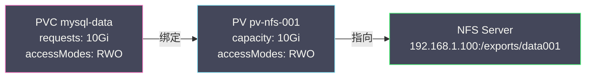
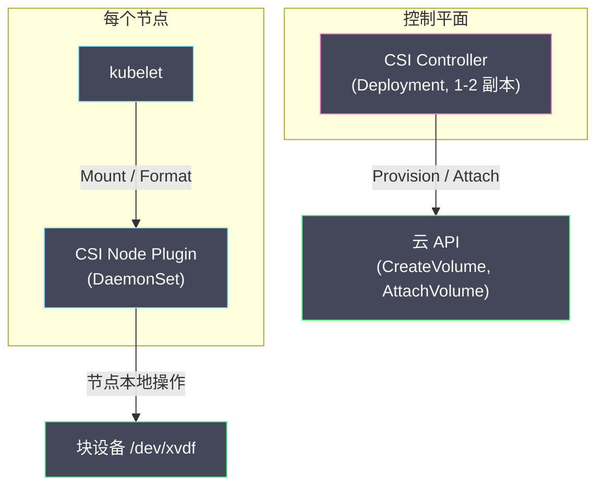

# 01 持久化存储——PV PVC StorageClass 与 CSI

**摘要：**

容器是"短暂的"——容器重启后文件系统恢复为镜像的初始状态，运行时产生的数据全部丢失。对于无状态应用这不是问题，但数据库、消息队列、日志系统等有状态应用**必须**将数据持久化到独立于容器生命周期的存储上。K8s 通过三层抽象解决持久化存储问题：**PersistentVolume（PV）** 代表一块实际的存储资源（如云盘、NFS 卷）、**PersistentVolumeClaim（PVC）** 代表用户对存储的需求声明、**StorageClass** 定义存储的"类别"并实现动态供给——用户创建 PVC 时自动创建 PV 和底层存储。这三层抽象将"存储的供给"（基础设施团队）与"存储的消费"（应用团队）解耦。底层的存储操作通过 **CSI（Container Storage Interface）** 标准接口与各种存储系统对接。本文从 K8s 存储的核心抽象出发，逐层分析 PV/PVC 的绑定模型、StorageClass 的动态供给、Volume 类型的选择、CSI 的工作机制，以及卷快照和存储拓扑感知等高级特性。

---

## 第 1 章 K8s 存储的核心问题

### 1.1 容器存储的短暂性

容器使用 [[04 UnionFS 与容器镜像原理|UnionFS]] 的可写层（upperdir）存储运行时数据。容器重启时可写层被丢弃、用镜像层重新创建——所有运行时写入的文件消失。

```
容器写入 /var/lib/mysql/data.db
  → 数据存储在 UnionFS 可写层
    → 容器重启 → 可写层被清空 → data.db 丢失
```

### 1.2 Volume：挂载外部存储

K8s 的 **Volume** 是解决方案——将一块外部存储挂载到容器的文件系统中。数据写入 Volume 而非可写层——容器重启后 Volume 内容不丢失。

```yaml
spec:
  containers:
    - name: mysql
      volumeMounts:
        - name: data
          mountPath: /var/lib/mysql    # 容器内挂载路径
  volumes:
    - name: data
      emptyDir: {}                      # Volume 类型
```

但 Volume 的定义直接写在 Pod Spec 中——将"使用什么存储"的细节暴露给了应用开发者。开发者不应该关心"存储是 NFS 还是云盘"——他只关心"我需要 10Gi 的存储"。这就是 PV/PVC 抽象的动机。

---

## 第 2 章 PV 与 PVC 的绑定模型

### 2.1 PersistentVolume（PV）

**PV** 是一个**集群级别**的资源对象——代表一块已经存在（或即将被创建）的存储资源。PV 由集群管理员或 StorageClass 动态创建，不属于任何 Namespace。

```yaml
apiVersion: v1
kind: PersistentVolume
metadata:
  name: pv-nfs-001
spec:
  capacity:
    storage: 10Gi                     # 存储容量
  accessModes:
    - ReadWriteOnce                   # 访问模式
  persistentVolumeReclaimPolicy: Retain  # 回收策略
  nfs:
    server: 192.168.1.100
    path: /exports/data001
```

### 2.2 PersistentVolumeClaim（PVC）

**PVC** 是一个 **Namespace 级别**的资源对象——代表用户（应用开发者）对存储的需求声明。PVC 不指定具体的存储实现——只声明"我需要多大、什么访问模式的存储"。

```yaml
apiVersion: v1
kind: PersistentVolumeClaim
metadata:
  name: mysql-data
  namespace: production
spec:
  accessModes:
    - ReadWriteOnce
  resources:
    requests:
      storage: 10Gi
  storageClassName: ""                 # 空字符串 = 不使用 StorageClass
```

### 2.3 绑定过程

PV Controller（运行在 kube-controller-manager 中）负责将 PVC 与 PV 配对绑定：

1. 用户创建 PVC（声明需要 10Gi ReadWriteOnce 的存储）
2. PV Controller 遍历所有未绑定的 PV，找到满足 PVC 要求的 PV：
   - 容量 ≥ PVC 请求（10Gi 的 PVC 可以绑定到 10Gi 或更大的 PV）
   - 访问模式匹配
   - StorageClass 匹配
3. 找到匹配的 PV 后，将 PVC 和 PV 双向绑定（PVC.spec.volumeName = PV.name，PV.spec.claimRef = PVC）
4. 如果没有匹配的 PV，PVC 保持 Pending 状态——直到有合适的 PV 出现



**绑定是一对一的**——一个 PVC 只能绑定一个 PV，一个 PV 只能被一个 PVC 绑定。即使 PV 有 100Gi 而 PVC 只请求 10Gi，绑定后 PV 的剩余 90Gi 无法被其他 PVC 使用。

### 2.4 访问模式

| 模式 | 缩写 | 含义 |
| :--- | :--- | :--- |
| **ReadWriteOnce** | RWO | 单节点读写——卷只能被一个节点挂载为读写 |
| **ReadOnlyMany** | ROX | 多节点只读——卷可以被多个节点挂载为只读 |
| **ReadWriteMany** | RWX | 多节点读写——卷可以被多个节点同时挂载为读写 |
| **ReadWriteOncePod** | RWOP | 单 Pod 读写——卷只能被一个 Pod 挂载（K8s 1.27+）|

**RWO** 是最常见的模式——云盘（AWS EBS、GCE PD）通常只支持 RWO（一次只能挂载到一个节点）。**RWX** 需要网络文件系统（NFS、CephFS、EFS）——允许多个 Pod 同时读写同一个卷。

### 2.5 回收策略

当 PVC 被删除后（不再需要该存储），PV 的处理方式由 `persistentVolumeReclaimPolicy` 决定：

| 策略 | 行为 |
| :--- | :--- |
| **Retain** | PV 保留，变为 Released 状态——管理员手动清理数据后重新使用 |
| **Delete** | PV 和底层存储资源（如云盘）一起被删除——数据不可恢复 |
| **Recycle**（已废弃）| 清空卷数据（`rm -rf /thevolume/*`）后重新可用 |

**生产环境建议**：关键数据使用 **Retain**——防止误删 PVC 导致数据丢失。日志、缓存等可再生数据可使用 **Delete**。

---

## 第 3 章 StorageClass 与动态供给

### 3.1 静态供给的痛点

上面的 PV/PVC 模型是"静态供给"——管理员需要预先创建 PV，用户创建 PVC 后等待配对。在大规模集群中，这意味着管理员需要维护数百个 PV——预估需求、手动创建、清理旧 PV——运维成本极高。

### 3.2 StorageClass 的设计

**StorageClass** 定义了一种"存储类别"——指定底层存储系统的类型（如 AWS EBS gp3、GCE PD SSD、NFS）和配置参数。当用户创建引用 StorageClass 的 PVC 时，K8s 自动调用 StorageClass 关联的 **Provisioner** 创建 PV 和底层存储资源——这就是"动态供给"。

```yaml
apiVersion: storage.k8s.io/v1
kind: StorageClass
metadata:
  name: fast-ssd
provisioner: ebs.csi.aws.com           # CSI 驱动名称
parameters:
  type: gp3                             # AWS EBS 卷类型
  iops: "5000"                          # IOPS
  throughput: "250"                     # 吞吐量 (MiB/s)
reclaimPolicy: Delete                   # 动态创建的 PV 的回收策略
volumeBindingMode: WaitForFirstConsumer # 绑定时机
allowVolumeExpansion: true              # 允许在线扩容
```

用户的 PVC 只需引用 StorageClass 名称：

```yaml
apiVersion: v1
kind: PersistentVolumeClaim
metadata:
  name: mysql-data
spec:
  accessModes:
    - ReadWriteOnce
  storageClassName: fast-ssd          # 引用 StorageClass
  resources:
    requests:
      storage: 50Gi
```

**动态供给流程**：

```
1. 用户创建 PVC (storageClassName: fast-ssd, requests: 50Gi)
2. PV Controller 发现 PVC 引用了 StorageClass
3. PV Controller 调用 StorageClass 的 Provisioner (ebs.csi.aws.com)
4. Provisioner 调用 AWS API 创建一个 50Gi 的 gp3 EBS 卷
5. Provisioner 创建对应的 PV 对象
6. PVC 与新 PV 自动绑定
7. Pod 使用该 PVC → kubelet 通过 CSI 将 EBS 卷挂载到节点
```

### 3.3 volumeBindingMode

| 模式 | 行为 | 适用场景 |
| :--- | :--- | :--- |
| **Immediate**（默认）| PVC 创建后立即供给和绑定 PV | 存储不受拓扑限制（如 NFS）|
| **WaitForFirstConsumer** | 等到 Pod 调度到节点后才供给和绑定 PV | 存储有拓扑限制（如云盘只能在特定可用区挂载）|

**WaitForFirstConsumer 的重要性**：AWS EBS 卷只能在创建它的可用区内挂载。如果使用 Immediate 模式，PV 可能在 us-east-1a 创建，但 Pod 被调度到 us-east-1b——卷无法挂载。WaitForFirstConsumer 确保 PV 在 Pod 被调度的可用区中创建。

### 3.4 卷扩容

`allowVolumeExpansion: true` 的 StorageClass 支持在线扩容——修改 PVC 的 `spec.resources.requests.storage` 即可：

```bash
# 将 PVC 从 50Gi 扩容到 100Gi
kubectl patch pvc mysql-data -p '{"spec":{"resources":{"requests":{"storage":"100Gi"}}}}'
```

扩容过程：CSI 驱动调用云 API 扩大底层卷 → kubelet 在节点上扩展文件系统（如 `resize2fs`）。**只能扩容不能缩容**——缩容可能导致数据丢失。

---

## 第 4 章 Volume 类型

### 4.1 临时卷

| 类型 | 说明 | 生命周期 |
| :--- | :--- | :--- |
| **emptyDir** | Pod 内所有容器共享的临时目录 | 与 Pod 绑定——Pod 删除后数据丢失 |
| **emptyDir (memory)** | 使用 tmpfs（内存文件系统）| 与 Pod 绑定，速度极快但消耗内存 |

```yaml
volumes:
  - name: cache
    emptyDir:
      medium: Memory         # 使用内存
      sizeLimit: 256Mi       # 限制大小
```

**emptyDir 的用途**：
- 同 Pod 多容器之间共享文件（如 Sidecar 收集日志）
- 临时缓存（如构建产物、临时下载文件）
- 不需要任何外部存储的场景

### 4.2 节点本地卷

| 类型 | 说明 | 风险 |
| :--- | :--- | :--- |
| **hostPath** | 挂载节点文件系统的指定路径 | Pod 重调度后数据不跟随、安全风险（可访问节点文件） |
| **local** | 挂载节点上的本地磁盘（通过 PV）| 需要 nodeAffinity 保证 Pod 调度到正确节点 |

> [!warning] hostPath 的安全风险
> hostPath 允许 Pod 访问节点文件系统的任意路径——如果挂载 `/`，容器就能读写节点上的所有文件。生产环境应通过 [[03 多租户隔离与资源治理|Pod Security Standards]] 限制 hostPath 的使用。

### 4.3 网络存储卷

| 类型 | 协议 | 访问模式 | 适用场景 |
| :--- | :--- | :--- | :--- |
| **NFS** | NFSv3/v4 | RWX | 文件共享、传统应用迁移 |
| **CephFS** | Ceph | RWX | 分布式文件系统 |
| **iSCSI** | iSCSI | RWO | 块存储 |

### 4.4 云提供商卷

现代 K8s 集群中，云盘卷通过 **CSI 驱动**管理（不再使用内置的 awsElasticBlockStore / gcePersistentDisk 等类型）：

| 云平台 | CSI 驱动 | 卷类型 |
| :--- | :--- | :--- |
| **AWS** | ebs.csi.aws.com | gp3, io2, st1, sc1 |
| **GCP** | pd.csi.storage.gke.io | pd-standard, pd-ssd, pd-balanced |
| **Azure** | disk.csi.azure.com | Premium_LRS, StandardSSD_LRS |
| **阿里云** | diskplugin.csi.alibabacloud.com | cloud_essd, cloud_ssd |

---

## 第 5 章 CSI——容器存储接口

### 5.1 为什么需要 CSI

早期 K8s 将各种存储驱动（AWS EBS、GCE PD、NFS、Ceph 等）的代码内置在 kubelet 和 kube-controller-manager 中——"in-tree" 驱动。这导致两个问题：

- **发布耦合**：存储驱动的更新必须等待 K8s 发布新版本
- **代码膨胀**：数十种存储驱动的代码占据了 K8s 主仓库大量空间

**CSI** 是一套标准化的 gRPC 接口——存储厂商独立开发和发布 CSI 驱动（以 Pod 形式部署在集群中），K8s 通过 CSI 接口与之交互。

### 5.2 CSI 的三种操作

| 操作 | 负责组件 | 说明 |
| :--- | :--- | :--- |
| **Provision / Delete** | CSI Controller（Deployment）| 创建/删除底层存储资源（如 AWS 的 CreateVolume API）|
| **Attach / Detach** | CSI Controller + kubelet | 将存储卷挂载到节点（如 AWS 的 AttachVolume API）|
| **Mount / Unmount** | kubelet（CSI Node 插件）| 在节点上格式化并挂载到 Pod 的文件路径 |

### 5.3 CSI 驱动的部署架构



**CSI Controller**（Deployment）：处理集群级别的操作——创建/删除卷、将卷 Attach 到节点。

**CSI Node Plugin**（DaemonSet）：处理节点级别的操作——格式化块设备、挂载到 Pod 路径。

---

## 第 6 章 高级特性

### 6.1 卷快照（Volume Snapshot）

K8s 1.20 GA 的 Volume Snapshot 允许对 PVC 的数据创建时间点快照——用于备份或克隆：

```yaml
apiVersion: snapshot.storage.k8s.io/v1
kind: VolumeSnapshot
metadata:
  name: mysql-snapshot-20260304
spec:
  volumeSnapshotClassName: csi-aws-snapshot
  source:
    persistentVolumeClaimName: mysql-data    # 对哪个 PVC 做快照
```

从快照恢复数据——创建新 PVC 并引用快照：

```yaml
apiVersion: v1
kind: PersistentVolumeClaim
metadata:
  name: mysql-data-restored
spec:
  dataSource:
    name: mysql-snapshot-20260304
    kind: VolumeSnapshot
    apiGroup: snapshot.storage.k8s.io
  accessModes:
    - ReadWriteOnce
  resources:
    requests:
      storage: 50Gi
```

### 6.2 卷克隆（Volume Cloning）

直接从一个 PVC 克隆另一个 PVC——不需要先创建快照：

```yaml
spec:
  dataSource:
    name: mysql-data               # 源 PVC
    kind: PersistentVolumeClaim
  accessModes:
    - ReadWriteOnce
  resources:
    requests:
      storage: 50Gi
```

### 6.3 存储拓扑感知

某些存储系统有拓扑约束——例如 AWS EBS 卷只能在创建它的可用区内被挂载。CSI 驱动通过 **CSI Topology** 向 Scheduler 报告存储的拓扑信息，Scheduler 在调度 Pod 时考虑存储拓扑约束——确保 Pod 被调度到能够访问其 PV 的节点。

```
StorageClass: volumeBindingMode=WaitForFirstConsumer
  → Scheduler 先选择节点（如 us-east-1a）
    → 然后在该可用区创建 PV
      → Pod 和 PV 在同一可用区 → 挂载成功
```

---

## 第 7 章 生产实践

### 7.1 StorageClass 的规划

| StorageClass 名称 | 底层存储 | 适用场景 |
| :--- | :--- | :--- |
| **standard** | gp3 / pd-balanced | 一般用途（默认）|
| **fast-ssd** | io2 / pd-ssd | 数据库、高 IOPS 需求 |
| **cold-storage** | st1 / pd-standard | 日志、归档数据 |
| **shared-nfs** | EFS / CephFS | 多 Pod 共享读写（RWX）|

### 7.2 常见问题排查

| 现象 | 可能原因 | 排查方法 |
| :--- | :--- | :--- |
| PVC 一直 Pending | 无匹配 PV / StorageClass 不存在 / Provisioner 未部署 | `kubectl describe pvc` 查看 Events |
| Pod 卡在 ContainerCreating | 卷 Attach 失败 / 格式化失败 | `kubectl describe pod` + `kubectl get volumeattachment` |
| 挂载超时 | CSI 驱动故障 / 云 API 限流 | 检查 CSI Controller 和 Node Plugin 的日志 |
| 数据丢失 | reclaimPolicy=Delete + PVC 被删除 | 关键数据使用 Retain 策略 |

---

## 第 8 章 总结

本文系统分析了 K8s 持久化存储的核心机制：

- **三层抽象**：PV（存储资源）→ PVC（用户需求）→ StorageClass（动态供给），解耦存储供给与消费
- **绑定模型**：PVC 与 PV 一对一绑定，基于容量、访问模式和 StorageClass 匹配
- **动态供给**：StorageClass + CSI Provisioner 自动创建 PV 和底层存储
- **Volume 类型**：emptyDir（临时）、hostPath/local（节点）、NFS/CephFS（网络）、云盘（CSI）
- **CSI 接口**：Provision/Delete（创建卷）、Attach/Detach（挂载到节点）、Mount/Unmount（挂载到 Pod）
- **高级特性**：卷快照、卷克隆、存储拓扑感知、在线扩容

下一篇 [[02 配置管理——ConfigMap Secret 与外部密钥]] 将分析 K8s 中配置和密钥的管理方式。

---

## 参考资料

1. Kubernetes Documentation - Persistent Volumes：https://kubernetes.io/docs/concepts/storage/persistent-volumes/
2. Kubernetes Documentation - Storage Classes：https://kubernetes.io/docs/concepts/storage/storage-classes/
3. Kubernetes Documentation - Container Storage Interface：https://kubernetes.io/docs/concepts/storage/volumes/#csi
4. Kubernetes Documentation - Volume Snapshots：https://kubernetes.io/docs/concepts/storage/volume-snapshots/
5. CSI Spec：https://github.com/container-storage-interface/spec
6. Kubernetes Source Code - pkg/controller/volume：https://github.com/kubernetes/kubernetes/tree/master/pkg/controller/volume
