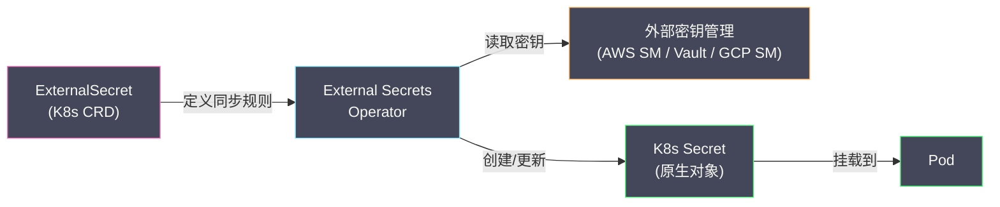

# 02 配置管理——ConfigMap Secret 与外部密钥

**摘要：**

"配置与代码分离"是十二要素应用的核心原则——同一份容器镜像应该能在开发、测试、生产环境中运行，区别仅在于注入的配置不同。K8s 通过 **ConfigMap** 管理非敏感配置（数据库地址、功能开关、日志级别）、通过 **Secret** 管理敏感数据（密码、API Key、TLS 证书）。ConfigMap 和 Secret 以两种方式注入到 Pod 中——**环境变量**和**卷挂载**——各有优劣和适用场景。Secret 在 K8s 中的"安全性"经常被高估——默认情况下 Secret 只是 Base64 编码（不是加密），存储在 etcd 中以明文形式可见。真正的密钥安全需要 **etcd 加密**、**KMS Provider**、以及外部密钥管理系统（HashiCorp Vault、AWS Secrets Manager）的集成。本文从 ConfigMap 和 Secret 的使用方式出发，深入配置变更的热加载问题、Secret 的安全威胁模型，以及 Sealed Secrets / External Secrets Operator / Vault 等外部密钥管理方案。

---

## 第 1 章 ConfigMap

### 1.1 ConfigMap 是什么

**ConfigMap** 是一个 Namespace 级别的 K8s 对象——存储键值对形式的非敏感配置数据。它将配置从容器镜像中解耦——同一个镜像搭配不同的 ConfigMap 即可运行在不同环境中。

```yaml
apiVersion: v1
kind: ConfigMap
metadata:
  name: app-config
  namespace: production
data:
  # 简单键值对
  DATABASE_HOST: "mysql.production.svc.cluster.local"
  LOG_LEVEL: "info"
  FEATURE_FLAG_NEW_UI: "true"
  
  # 整个配置文件
  application.yaml: |
    server:
      port: 8080
    database:
      host: mysql.production.svc.cluster.local
      port: 3306
      name: myapp
    logging:
      level: info
```

ConfigMap 可以存储两种数据：
- **键值对**：适合单个配置项（如环境变量）
- **文件内容**：适合完整的配置文件（如 `application.yaml`、`nginx.conf`）

### 1.2 注入方式一：环境变量

将 ConfigMap 中的键值对注入为容器的环境变量：

```yaml
spec:
  containers:
    - name: app
      env:
        - name: DATABASE_HOST                    # 环境变量名
          valueFrom:
            configMapKeyRef:
              name: app-config                   # ConfigMap 名称
              key: DATABASE_HOST                 # ConfigMap 中的键
        - name: LOG_LEVEL
          valueFrom:
            configMapKeyRef:
              name: app-config
              key: LOG_LEVEL
```

或一次性注入 ConfigMap 的所有键值对：

```yaml
spec:
  containers:
    - name: app
      envFrom:
        - configMapRef:
            name: app-config
```

**环境变量的特点**：
- 简单直接——大多数语言和框架原生支持读取环境变量
- **不可变**——Pod 创建后环境变量不会更新。修改 ConfigMap 后，必须重建 Pod 才能生效
- 适合简单的键值配置（数据库地址、开关、端口号）

### 1.3 注入方式二：卷挂载

将 ConfigMap 挂载为容器文件系统中的一个目录——每个 key 变成一个文件，文件内容是 value：

```yaml
spec:
  containers:
    - name: app
      volumeMounts:
        - name: config-volume
          mountPath: /etc/config          # 挂载路径
  volumes:
    - name: config-volume
      configMap:
        name: app-config
```

挂载后的文件结构：

```
/etc/config/
├── DATABASE_HOST              # 内容: mysql.production.svc.cluster.local
├── LOG_LEVEL                  # 内容: info
├── FEATURE_FLAG_NEW_UI        # 内容: true
└── application.yaml           # 内容: 完整的 YAML 配置文件
```

**卷挂载的特点**：
- 适合完整的配置文件（Nginx 配置、应用配置文件、证书）
- **可热更新**——kubelet 定期（默认约 60 秒）检查 ConfigMap 变更并更新挂载的文件
- 需要应用支持文件变更检测（如 inotify）才能真正实现热加载

### 1.4 两种注入方式的对比

| 维度 | 环境变量 | 卷挂载 |
| :--- | :--- | :--- |
| **数据形式** | 键值对 | 文件 |
| **热更新** | ❌ 不支持（需重建 Pod）| ✅ 支持（kubelet 自动更新文件）|
| **适用场景** | 简单配置项 | 完整配置文件 |
| **应用读取方式** | `os.Getenv("KEY")` | 读取文件内容 |
| **subPath 挂载** | 不适用 | 使用 subPath 时不支持热更新 |

> [!warning] subPath 的陷阱
> 如果使用 `subPath` 挂载 ConfigMap 中的单个文件（如 `subPath: application.yaml`），该文件**不会**被 kubelet 自动更新——这是 K8s 的已知限制。如果需要热更新，应挂载整个 ConfigMap 目录而非单个文件。

---

## 第 2 章 Secret

### 2.1 Secret 与 ConfigMap 的区别

**Secret** 在 API 层面与 ConfigMap 几乎相同——都是键值对存储，都可以通过环境变量或卷挂载注入到 Pod。核心区别在于：

| 维度 | ConfigMap | Secret |
| :--- | :--- | :--- |
| **数据类型** | 非敏感配置 | 敏感数据（密码、证书、Token）|
| **存储编码** | 明文 | Base64 编码（注意：不是加密）|
| **etcd 存储** | 明文 | 可配置加密（EncryptionConfiguration）|
| **RBAC 控制** | 通常较宽松 | 应严格限制谁能读取 |
| **kubectl 输出** | 明文显示 | 默认隐藏 data（需 `-o yaml` 查看）|
| **卷挂载权限** | 默认 0644 | 默认 0644（建议改为 0400）|

### 2.2 Secret 的类型

| 类型 | 用途 |
| :--- | :--- |
| **Opaque**（默认）| 通用密钥——自定义键值对 |
| **kubernetes.io/tls** | TLS 证书——必须包含 `tls.crt` 和 `tls.key` |
| **kubernetes.io/dockerconfigjson** | 镜像仓库认证——包含 Docker registry 凭证 |
| **kubernetes.io/service-account-token** | ServiceAccount Token（Legacy，新版本使用 Bound Token）|
| **kubernetes.io/basic-auth** | HTTP Basic 认证——包含 `username` 和 `password` |

```yaml
apiVersion: v1
kind: Secret
metadata:
  name: db-credentials
type: Opaque
data:
  username: YWRtaW4=          # base64("admin")
  password: cEBzc3cwcmQxMjM=  # base64("p@ssw0rd123")
```

```bash
# 创建 Secret 的便捷方式（自动 Base64 编码）
kubectl create secret generic db-credentials \
  --from-literal=username=admin \
  --from-literal=password='p@ssw0rd123'
```

### 2.3 Secret 注入 Pod

与 ConfigMap 相同的两种方式：

**环境变量**：

```yaml
env:
  - name: DB_PASSWORD
    valueFrom:
      secretKeyRef:
        name: db-credentials
        key: password
```

**卷挂载**：

```yaml
volumeMounts:
  - name: secrets
    mountPath: /etc/secrets
    readOnly: true              # 只读挂载
volumes:
  - name: secrets
    secret:
      secretName: db-credentials
      defaultMode: 0400         # 限制文件权限
```

> [!info] 推荐使用卷挂载而非环境变量
> 环境变量的安全风险更高——进程的环境变量可以通过 `/proc/<pid>/environ` 被同节点的其他进程读取，且容器崩溃时的 core dump 可能包含环境变量。卷挂载的文件权限更易控制，且支持热更新（Secret 轮换时不需要重建 Pod）。

---

## 第 3 章 配置变更的热加载

### 3.1 问题场景

修改 ConfigMap 后，已运行的 Pod 何时感知到变更？

| 注入方式 | 变更传播 |
| :--- | :--- |
| **环境变量** | ❌ 不传播——必须重建 Pod |
| **卷挂载** | ✅ 自动传播——kubelet 定期更新（默认 ~60s + 缓存延迟）|
| **卷挂载 + subPath** | ❌ 不传播——subPath 挂载的文件不更新 |

### 3.2 卷挂载的更新机制

kubelet 通过以下方式更新 ConfigMap/Secret 的卷挂载：

1. kubelet 的 ConfigMap/Secret 缓存定期刷新（`--sync-frequency`，默认 60 秒）
2. kubelet 检测到 ConfigMap/Secret 变更后，更新节点上的挂载文件
3. 更新使用**原子替换**——创建新的临时目录，写入新内容，然后用符号链接切换

实际延迟 = kubelet 缓存 TTL + Watch 传播延迟，通常 **30-120 秒**。

### 3.3 应用层热加载

kubelet 更新文件后，应用进程不一定能自动感知——取决于应用如何读取配置：

| 应用行为 | 是否自动热加载 |
| :--- | :--- |
| 启动时读取一次配置文件 | ❌ 需要重启 |
| 使用 inotify 监听文件变更 | ✅ 自动加载 |
| 每次请求时读取配置文件 | ✅ 自动生效（但性能差）|

**推荐方案**：使用 inotify（或语言框架的文件监听机制）监听配置文件变更，触发配置重载。

对于不支持热加载的应用，可以使用 **Reloader** 等工具——Watch ConfigMap/Secret 变更后自动触发 Deployment 的滚动更新（通过修改 Pod annotation 触发重建）。

### 3.4 Immutable ConfigMap/Secret

K8s 1.21 GA 支持 `immutable: true`——创建后不可修改的 ConfigMap/Secret：

```yaml
apiVersion: v1
kind: ConfigMap
metadata:
  name: app-config-v2
immutable: true              # 创建后不可修改
data:
  LOG_LEVEL: "debug"
```

**优势**：
- **性能优化**：kubelet 不再 Watch 不可变的 ConfigMap/Secret——减少 API Server 的 Watch 负载（大规模集群中效果显著）
- **安全性**：防止误修改导致线上故障
- **版本化**：通过名称后缀（如 `app-config-v2`）实现配置版本管理

---

## 第 4 章 Secret 的安全威胁模型

### 4.1 Base64 不是加密

Secret 的 `data` 字段使用 Base64 编码——这只是一种编码方式（任何人都能解码），不提供任何安全保护。Base64 的目的是让 Secret 能存储二进制数据（如 TLS 证书），不是为了保密。

```bash
# 任何能 kubectl get secret 的人都能解码
echo "cEBzc3cwcmQxMjM=" | base64 -d
# p@ssw0rd123
```

### 4.2 Secret 的攻击面

| 攻击面 | 风险 | 缓解措施 |
| :--- | :--- | :--- |
| **etcd 存储** | etcd 中默认明文存储 Secret | 启用 etcd 加密（EncryptionConfiguration）|
| **API Server 传输** | API 请求可能被拦截 | 强制 HTTPS（默认已启用）|
| **RBAC** | 过宽的权限允许非授权用户读取 Secret | 最小权限原则——限制 Secret 的 get/list/watch |
| **Pod 访问** | 同 Namespace 的 Pod 可能挂载不属于它的 Secret | 使用 [[04 准入控制器深度解析|Admission Webhook]] 限制 |
| **节点存储** | Secret 以明文写入节点的 tmpfs | 限制节点访问权限 |
| **日志泄漏** | 应用日志中打印了 Secret 值 | 代码审查——禁止日志输出敏感数据 |
| **GitOps** | Secret YAML 提交到 Git 仓库 | 使用 Sealed Secrets 或 External Secrets |

### 4.3 etcd 加密

K8s 支持对 etcd 中存储的 Secret 进行加密——通过 API Server 的 `--encryption-provider-config` 配置：

```yaml
apiVersion: apiserver.config.k8s.io/v1
kind: EncryptionConfiguration
resources:
  - resources:
      - secrets
    providers:
      - aescbc:                           # AES-CBC 加密
          keys:
            - name: key1
              secret: <base64-encoded-32-byte-key>
      - identity: {}                      # 未加密的回退（读取旧数据）
```

启用后，新写入的 Secret 在 etcd 中以密文存储——即使直接访问 etcd 也无法读取。但加密密钥本身存储在 API Server 的配置文件中——如果攻击者获得了 API Server 节点的访问权限，仍然可以获取密钥。

### 4.4 KMS Provider

更安全的方案是使用 **KMS（Key Management Service）Provider**——将加密密钥托管在外部 KMS 中（如 AWS KMS、GCP Cloud KMS、Azure Key Vault、HashiCorp Vault）。API Server 通过 KMS 插件请求 KMS 加密/解密数据——加密密钥永远不会以明文形式出现在 K8s 集群中。

```yaml
providers:
  - kms:
      apiVersion: v2
      name: aws-kms
      endpoint: unix:///var/run/kmsplugin/socket.sock
```

---

## 第 5 章 外部密钥管理

### 5.1 为什么需要外部密钥管理

K8s 原生 Secret 的局限：

- **无审计追踪**：谁在什么时候读取了 Secret？无法追踪
- **无自动轮换**：密码过期后需要手动更新 Secret 和重启 Pod
- **无动态密钥**：无法按需生成临时凭证（如数据库的临时用户名/密码）
- **GitOps 不友好**：Secret YAML 包含明文密码，不能提交到 Git

### 5.2 Sealed Secrets

**Sealed Secrets**（Bitnami）解决了 "Secret 不能提交到 Git" 的问题：

1. 集群中部署 Sealed Secrets Controller
2. 使用 `kubeseal` CLI 工具将 Secret 加密为 **SealedSecret** 对象——加密后的 YAML 可以安全地提交到 Git
3. SealedSecret Controller 在集群中解密 SealedSecret 为原生 Secret

```bash
# 加密 Secret
kubeseal --format=yaml < secret.yaml > sealed-secret.yaml
# sealed-secret.yaml 可以安全提交到 Git
```

**局限**：只解决了 Git 存储的问题——不提供审计、轮换、动态密钥等能力。

### 5.3 External Secrets Operator

**External Secrets Operator（ESO）** 将外部密钥管理系统中的密钥同步到 K8s Secret：

```yaml
apiVersion: external-secrets.io/v1beta1
kind: ExternalSecret
metadata:
  name: db-credentials
spec:
  refreshInterval: 1h                    # 每小时同步一次
  secretStoreRef:
    name: aws-secrets-manager
    kind: SecretStore
  target:
    name: db-credentials                 # 生成的 K8s Secret 名称
  data:
    - secretKey: password                # K8s Secret 中的 key
      remoteRef:
        key: production/mysql            # AWS Secrets Manager 中的路径
        property: password               # Secrets Manager 中的字段
```

**工作流程**：



**支持的后端**：AWS Secrets Manager、Google Secret Manager、Azure Key Vault、HashiCorp Vault、CyberArk 等。

**优势**：密钥的"单一真相来源"在外部系统中——K8s Secret 只是缓存副本。密钥轮换只需在外部系统中操作，ESO 自动同步到 K8s。

### 5.4 HashiCorp Vault

**Vault** 是功能最全面的密钥管理系统——提供密钥存储、动态密钥生成、PKI 证书管理、审计日志等。

Vault 与 K8s 的集成方式：

**方式一：Vault Agent Sidecar Injector**

通过 Mutating Webhook 自动向 Pod 注入 Vault Agent Sidecar——Agent 从 Vault 获取密钥并写入共享 Volume，业务容器从 Volume 读取。

```yaml
metadata:
  annotations:
    vault.hashicorp.com/agent-inject: "true"
    vault.hashicorp.com/role: "my-app"
    vault.hashicorp.com/agent-inject-secret-db: "secret/data/production/mysql"
```

**方式二：Vault CSI Provider**

通过 CSI Secret Store Driver 将 Vault 密钥挂载为 Pod 的 Volume——不需要 Sidecar。

**方式三：External Secrets Operator**

通过 ESO 将 Vault 密钥同步为 K8s Secret（见上文）。

### 5.5 方案选型

| 方案 | 复杂度 | 安全级别 | 适用场景 |
| :--- | :--- | :--- | :--- |
| **原生 Secret + etcd 加密** | 低 | 中 | 小型集群、低安全要求 |
| **Sealed Secrets** | 低 | 中 | GitOps 场景、密钥不频繁变更 |
| **External Secrets Operator** | 中 | 高 | 已有外部密钥管理系统的团队 |
| **Vault** | 高 | 最高 | 大型企业、动态密钥、审计合规 |

---

## 第 6 章 生产实践

### 6.1 ConfigMap/Secret 的命名规范

配置版本化——在名称中包含版本或哈希，确保配置变更触发 Pod 滚动更新：

```yaml
# Kustomize 自动为 ConfigMap 名称添加哈希后缀
# app-config → app-config-k5f8h2
configMapGenerator:
  - name: app-config
    files:
      - application.yaml
```

### 6.2 大小限制

ConfigMap 和 Secret 的数据大小**不能超过 1 MiB**——这是 etcd 单个对象的大小限制。如果配置文件很大，应该考虑使用 PVC 挂载或 Init Container 下载。

### 6.3 环境差异管理

使用 [[05 应用交付——Helm Kustomize 与 GitOps|Kustomize]] 的 overlay 机制管理不同环境的配置差异：

```
base/
  configmap.yaml          # 通用配置
  deployment.yaml
overlays/
  dev/
    configmap-patch.yaml  # 开发环境覆盖
  production/
    configmap-patch.yaml  # 生产环境覆盖
```

---

## 第 7 章 总结

本文系统分析了 K8s 的配置和密钥管理：

- **ConfigMap**：非敏感配置——环境变量（不可热更新）和卷挂载（可热更新）两种注入方式
- **Secret**：敏感数据——Base64 编码不是加密，需要 etcd 加密和 KMS Provider 保障存储安全
- **热加载**：卷挂载支持自动更新（~60s 延迟），环境变量和 subPath 不支持，应用需配合 inotify 或 Reloader
- **Immutable ConfigMap/Secret**：不可变配置——减少 Watch 压力，防止误修改
- **外部密钥管理**：Sealed Secrets（Git 安全存储）、External Secrets Operator（同步外部密钥）、Vault（全功能密钥管理）

下一篇 [[03 多租户隔离与资源治理]] 将分析如何在共享集群中实现租户隔离。

---

## 参考资料

1. Kubernetes Documentation - ConfigMaps：https://kubernetes.io/docs/concepts/configuration/configmap/
2. Kubernetes Documentation - Secrets：https://kubernetes.io/docs/concepts/configuration/secret/
3. Kubernetes Documentation - Encrypting Secret Data at Rest：https://kubernetes.io/docs/tasks/administer-cluster/encrypt-data/
4. External Secrets Operator：https://external-secrets.io/
5. Bitnami Sealed Secrets：https://github.com/bitnami-labs/sealed-secrets
6. HashiCorp Vault K8s Integration：https://developer.hashicorp.com/vault/docs/platform/k8s
