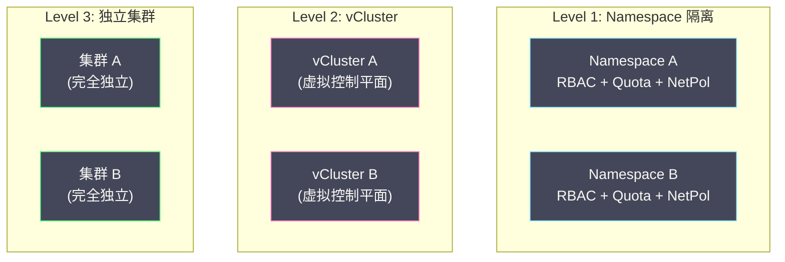

# 03 多租户隔离与资源治理

**摘要：**

一个 K8s 集群往往服务于多个团队、多个项目、甚至多个客户——它们共享同一组节点的计算、存储和网络资源。如果没有隔离机制，一个团队的失控 Pod 可能耗尽整个集群的 CPU，一个有漏洞的应用可能访问其他团队的数据库密码，一个被攻破的容器可能逃逸到宿主机获取集群控制权。**多租户隔离**是生产集群的硬性需求——它回答三个问题：**资源隔离**（你最多能用多少 CPU/Memory）、**网络隔离**（你能跟谁通信）、**安全隔离**（你能做什么危险操作）。K8s 通过 Namespace + ResourceQuota + LimitRange 实现资源治理，通过 NetworkPolicy 实现网络隔离，通过 Pod Security Standards 实现安全隔离。本文逐层分析这些机制的工作原理、配置方式和生产实践。

---

## 第 1 章 Namespace：逻辑隔离的边界

### 1.1 Namespace 的本质

**Namespace** 是 K8s 中**逻辑分组**的基本单元——它不提供任何物理隔离（不像 Linux Namespace 提供进程级隔离），只是将 K8s 对象划分到不同的"命名空间"中，实现**名称隔离**和**权限边界**。

同名的 Service 可以存在于不同的 Namespace 中——`mysql.team-a` 和 `mysql.team-b` 是两个不同的对象。[[03 授权机制——RBAC 深度解析|RBAC]] 可以基于 Namespace 授权——Team A 的成员只能操作 `team-a` Namespace 中的对象。

### 1.2 Namespace 不隔离什么

Namespace 的隔离是**逻辑层面**的——以下维度默认不隔离：

| 维度 | 默认行为 | 隔离手段 |
| :--- | :--- | :--- |
| **网络** | 不同 Namespace 的 Pod 可以互相通信 | NetworkPolicy |
| **计算资源** | 不同 Namespace 的 Pod 共享节点资源 | ResourceQuota + LimitRange |
| **存储** | PV 是集群级别资源，不受 Namespace 限制 | StorageClass + Quota |
| **节点** | Pod 可以调度到任意节点 | NodeSelector / Taint |
| **集群级别资源** | ClusterRole、Node、PV 等不属于任何 Namespace | RBAC 限制 |

### 1.3 Namespace 的规划策略

| 策略 | 说明 | 适用场景 |
| :--- | :--- | :--- |
| **按团队** | `team-frontend`、`team-backend`、`team-data` | 组织结构清晰的公司 |
| **按环境** | `dev`、`staging`、`production` | 单集群多环境（不推荐生产和开发混用）|
| **按项目** | `project-alpha`、`project-beta` | 多项目共享集群 |
| **按租户** | `tenant-company-a`、`tenant-company-b` | SaaS 多租户 |

> [!warning] 避免过度使用 Namespace
> Namespace 不是安全隔离边界——恶意租户可以通过未配置的 NetworkPolicy 访问其他 Namespace 的 Pod。**不信任的租户**应使用独立集群或 vCluster 隔离。Namespace 适合**信任的内部团队**之间的逻辑分组。

---

## 第 2 章 ResourceQuota：资源配额

### 2.1 解决的问题

如果不限制 Namespace 的资源使用，一个团队可能创建大量 Pod 或请求大量 CPU/Memory——耗尽集群资源，导致其他团队的 Pod 无法调度（Pending）。

**ResourceQuota** 在 Namespace 级别设置资源使用上限——限制该 Namespace 中所有 Pod 的资源总和。

### 2.2 计算资源配额

```yaml
apiVersion: v1
kind: ResourceQuota
metadata:
  name: compute-quota
  namespace: team-backend
spec:
  hard:
    requests.cpu: "20"                # 所有 Pod 的 CPU requests 总和不超过 20 核
    requests.memory: 40Gi             # 所有 Pod 的 Memory requests 总和不超过 40Gi
    limits.cpu: "40"                  # 所有 Pod 的 CPU limits 总和不超过 40 核
    limits.memory: 80Gi               # 所有 Pod 的 Memory limits 总和不超过 80Gi
```

当 Namespace 中的资源使用达到 Quota 上限时，新的 Pod 创建会被 [[04 准入控制器深度解析|ResourceQuota 准入控制器]] 拒绝——返回 403 Forbidden。

> [!info] 启用 ResourceQuota 后的强制要求
> 一旦 Namespace 中存在计算资源的 ResourceQuota，该 Namespace 中**每个 Pod 都必须声明 `resources.requests` 和 `resources.limits`**——否则 Pod 创建被拒绝。这是为了确保 Quota 能准确计算资源使用量。配合 LimitRange（下文）可以为未声明资源的 Pod 自动设置默认值。

### 2.3 对象数量配额

除了计算资源，ResourceQuota 还可以限制对象数量——防止一个 Namespace 创建过多对象导致 etcd 和 API Server 压力过大：

```yaml
spec:
  hard:
    pods: "100"                        # 最多 100 个 Pod
    services: "20"                     # 最多 20 个 Service
    configmaps: "50"                   # 最多 50 个 ConfigMap
    secrets: "50"                      # 最多 50 个 Secret
    persistentvolumeclaims: "20"       # 最多 20 个 PVC
    services.loadbalancers: "2"        # 最多 2 个 LoadBalancer Service
    services.nodeports: "5"            # 最多 5 个 NodePort Service
```

### 2.4 存储配额

```yaml
spec:
  hard:
    requests.storage: 500Gi                          # 所有 PVC 的总存储量
    persistentvolumeclaims: "20"                     # PVC 数量
    fast-ssd.storageclass.storage.k8s.io/requests.storage: 200Gi  # 特定 StorageClass 的配额
```

### 2.5 按优先级的配额

可以为不同 [[05 Scheduler 调度流程与算法|PriorityClass]] 的 Pod 设置独立配额——例如限制高优先级 Pod 的数量防止滥用抢占：

```yaml
spec:
  hard:
    pods: "10"
  scopeSelector:
    matchExpressions:
      - scopeName: PriorityClass
        operator: In
        values: ["critical"]          # 只限制 PriorityClass=critical 的 Pod
```

---

## 第 3 章 LimitRange：默认值与约束

### 3.1 LimitRange 的作用

ResourceQuota 限制的是 Namespace 级别的**总量**——它不关心单个 Pod 或容器请求了多少资源。一个容器可以请求 100 核 CPU（只要 Namespace 总量未超限）——这可能导致单个 Pod 占用过多资源。

**LimitRange** 在 Namespace 中为**单个容器/Pod** 设置资源约束——默认值、最小值、最大值：

```yaml
apiVersion: v1
kind: LimitRange
metadata:
  name: container-limits
  namespace: team-backend
spec:
  limits:
    - type: Container
      default:                         # 未声明 limits 的容器使用的默认值
        cpu: "500m"
        memory: 256Mi
      defaultRequest:                  # 未声明 requests 的容器使用的默认值
        cpu: "100m"
        memory: 128Mi
      min:                             # 单个容器的最小资源
        cpu: "50m"
        memory: 64Mi
      max:                             # 单个容器的最大资源
        cpu: "4"
        memory: 4Gi
    - type: Pod
      max:                             # 单个 Pod 所有容器的资源总和上限
        cpu: "8"
        memory: 8Gi
```

### 3.2 LimitRange 与 ResourceQuota 的配合

| 机制 | 控制粒度 | 作用 |
| :--- | :--- | :--- |
| **LimitRange** | 单容器/单 Pod | 设置默认值、限制单个对象的资源范围 |
| **ResourceQuota** | Namespace 总量 | 限制所有对象的资源总和 |

两者配合使用——LimitRange 确保每个容器有合理的资源声明（并提供默认值以满足 Quota 的要求），ResourceQuota 确保 Namespace 的总资源不超限。

---

## 第 4 章 NetworkPolicy：网络隔离

### 4.1 默认行为

K8s 的网络模型要求**所有 Pod 可以互相通信**——不同 Namespace、不同节点上的 Pod 都可以直接通过 Pod IP 访问。这是"扁平网络"的设计——简单但缺乏安全隔离。

### 4.2 NetworkPolicy 的工作原理

**NetworkPolicy** 定义 Pod 级别的网络访问控制规则——指定哪些流量可以进入（Ingress）和离开（Egress）目标 Pod。

```yaml
apiVersion: networking.k8s.io/v1
kind: NetworkPolicy
metadata:
  name: api-policy
  namespace: team-backend
spec:
  podSelector:
    matchLabels:
      app: api                         # 目标 Pod
  policyTypes:
    - Ingress
    - Egress
  ingress:
    - from:
        - namespaceSelector:           # 允许来自 team-frontend Namespace 的流量
            matchLabels:
              name: team-frontend
        - podSelector:                 # 允许来自同 Namespace 中 app=web 的 Pod
            matchLabels:
              app: web
      ports:
        - protocol: TCP
          port: 8080
  egress:
    - to:
        - podSelector:                 # 允许访问同 Namespace 中 app=mysql 的 Pod
            matchLabels:
              app: mysql
      ports:
        - protocol: TCP
          port: 3306
    - to:                              # 允许 DNS 查询
        - namespaceSelector: {}
      ports:
        - protocol: UDP
          port: 53
```

### 4.3 NetworkPolicy 的语义

**关键规则**：

- **无 NetworkPolicy**：Pod 的所有入站和出站流量都被允许（默认开放）
- **有 NetworkPolicy 但无 Ingress 规则**：所有入站流量被拒绝（默认拒绝）
- **有 NetworkPolicy 且有 Ingress 规则**：只有匹配规则的入站流量被允许

**默认拒绝所有流量**——这是最安全的起点：

```yaml
apiVersion: networking.k8s.io/v1
kind: NetworkPolicy
metadata:
  name: default-deny-all
  namespace: team-backend
spec:
  podSelector: {}                      # 匹配 Namespace 中所有 Pod
  policyTypes:
    - Ingress
    - Egress
```

然后逐一添加允许规则——这是"白名单"模式。

### 4.4 CNI 插件的要求

**NetworkPolicy 只是声明——由 CNI 网络插件负责执行。** 不是所有 CNI 插件都支持 NetworkPolicy：

| CNI 插件 | NetworkPolicy 支持 |
| :--- | :--- |
| **Calico** | ✅ 完整支持 + 扩展策略 |
| **Cilium** | ✅ 完整支持 + L7 策略 |
| **Weave Net** | ✅ 支持 |
| **Flannel** | ❌ 不支持 |
| **AWS VPC CNI** | ❌ 需配合 Calico |

> [!warning] Flannel 不支持 NetworkPolicy
> 如果集群使用 Flannel 作为 CNI 插件，创建的 NetworkPolicy 对象不会生效——所有流量仍然畅通。需要安全隔离的集群应使用 Calico 或 Cilium。

---

## 第 5 章 Pod Security Standards

### 5.1 容器安全风险

[[06 容器安全边界与逃逸风险|容器安全专栏]] 分析了容器的安全边界——容器共享宿主机内核，不当的配置可能导致容器逃逸。以下是最危险的 Pod 配置：

| 配置 | 风险 |
| :--- | :--- |
| `privileged: true` | 容器获得宿主机的所有 Linux Capabilities——可以直接操控宿主机 |
| `hostPID: true` | 容器可以看到宿主机上的所有进程 |
| `hostNetwork: true` | 容器使用宿主机的网络栈——可以监听宿主机端口 |
| `hostPath: /` | 容器可以读写宿主机文件系统 |
| `runAsUser: 0` | 容器以 root 用户运行——逃逸后即为宿主机 root |

### 5.2 Pod Security Standards（PSS）

K8s 1.25 GA 的 **Pod Security Standards** 定义了三个安全级别：

| 级别 | 含义 | 限制 |
| :--- | :--- | :--- |
| **Privileged** | 无限制——所有配置都允许 | 适用于系统组件（如 kube-proxy、CSI 驱动）|
| **Baseline** | 最低安全要求——禁止最危险的配置 | 禁止 privileged、hostPID、hostNetwork 等 |
| **Restricted** | 强安全——遵循最佳实践 | 在 Baseline 基础上要求 runAsNonRoot、drop ALL capabilities、只读根文件系统等 |

### 5.3 Pod Security Admission

通过 Namespace 的 Label 启用 PSS 策略：

```yaml
apiVersion: v1
kind: Namespace
metadata:
  name: team-backend
  labels:
    pod-security.kubernetes.io/enforce: restricted     # 拒绝不合规的 Pod
    pod-security.kubernetes.io/warn: restricted        # 警告不合规的 Pod
    pod-security.kubernetes.io/audit: restricted       # 审计不合规的 Pod
```

**三种模式**：

| 模式 | 行为 |
| :--- | :--- |
| **enforce** | 拒绝创建不合规的 Pod（硬约束）|
| **warn** | 允许创建但在 kubectl 输出中显示警告 |
| **audit** | 允许创建但在审计日志中记录 |

**推荐做法**：新 Namespace 使用 `enforce: restricted`；已有 Namespace 先用 `warn: restricted` 评估影响，再逐步升级到 `enforce`。

### 5.4 Restricted 级别的具体要求

```yaml
# 符合 Restricted 级别的 Pod 配置
spec:
  securityContext:
    runAsNonRoot: true                 # 禁止 root 运行
    seccompProfile:
      type: RuntimeDefault             # 启用 seccomp
  containers:
    - name: app
      securityContext:
        allowPrivilegeEscalation: false  # 禁止提权
        capabilities:
          drop:
            - ALL                        # 丢弃所有 Linux Capabilities
        readOnlyRootFilesystem: true     # 只读根文件系统
      resources:
        requests:
          cpu: "100m"
          memory: 128Mi
        limits:
          cpu: "500m"
          memory: 256Mi
```

---

## 第 6 章 多租户架构模式

### 6.1 三种隔离级别



| 模式 | 隔离强度 | 成本 | 适用场景 |
| :--- | :--- | :--- | :--- |
| **Namespace 隔离** | 弱（逻辑隔离）| 低（共享集群）| 内部团队、信任环境 |
| **vCluster** | 中（虚拟控制平面）| 中 | 需要独立 API Server 但共享节点 |
| **独立集群** | 强（物理隔离）| 高 | 不信任租户、合规要求、SaaS 多租户 |

### 6.2 Namespace 级别的完整隔离方案

为每个租户的 Namespace 配置完整的隔离：

1. **RBAC**：每个团队的 ServiceAccount 只能操作自己的 Namespace
2. **ResourceQuota**：限制 CPU/Memory/Storage 总量和对象数量
3. **LimitRange**：设置容器资源的默认值和上限
4. **NetworkPolicy**：默认拒绝所有流量，白名单放行
5. **Pod Security**：enforce restricted 级别
6. **节点隔离**（可选）：通过 [[05 Scheduler 调度流程与算法|Taint/Toleration]] 将不同租户的 Pod 调度到不同节点

### 6.3 vCluster

**vCluster** 在一个宿主集群中运行多个"虚拟集群"——每个 vCluster 有独立的 API Server、Controller Manager 和 etcd（运行在宿主集群的 Pod 中），但共享宿主集群的节点和网络。

**优势**：
- 租户拥有完整的 K8s API——可以创建 CRD、安装 Helm Chart、自定义 RBAC
- 租户之间的 API 对象完全隔离——即使 ClusterRole 也只影响 vCluster 内部
- 资源利用率高——共享节点，不需要独立的控制平面节点

**局限**：
- 网络和节点层面的隔离仍依赖宿主集群的 NetworkPolicy 和 Taint
- 共享内核——容器逃逸仍然是威胁

---

## 第 7 章 总结

本文系统分析了 K8s 多租户隔离和资源治理的各个维度：

- **Namespace**：逻辑分组和权限边界，不提供网络/计算/安全隔离
- **ResourceQuota**：Namespace 级别的资源总量限制——CPU/Memory/Storage/对象数量
- **LimitRange**：单容器/单 Pod 级别的资源约束和默认值
- **NetworkPolicy**：Pod 级别的网络访问控制——白名单模式，需要 CNI 插件支持
- **Pod Security Standards**：三级安全策略（Privileged/Baseline/Restricted），通过 Namespace Label 启用
- **多租户架构**：Namespace 隔离（弱）→ vCluster（中）→ 独立集群（强），根据信任级别选择

下一篇 [[04 集群可观测性与故障排查]] 将分析如何监控集群健康状态和排查常见故障。

---

## 参考资料

1. Kubernetes Documentation - Namespaces：https://kubernetes.io/docs/concepts/overview/working-with-objects/namespaces/
2. Kubernetes Documentation - Resource Quotas：https://kubernetes.io/docs/concepts/policy/resource-quotas/
3. Kubernetes Documentation - Limit Ranges：https://kubernetes.io/docs/concepts/policy/limit-range/
4. Kubernetes Documentation - Network Policies：https://kubernetes.io/docs/concepts/services-networking/network-policies/
5. Kubernetes Documentation - Pod Security Standards：https://kubernetes.io/docs/concepts/security/pod-security-standards/
6. vCluster Documentation：https://www.vcluster.com/docs
7. Kubernetes Multi-tenancy Working Group：https://github.com/kubernetes-sigs/multi-tenancy

---

> [!note] 思考题
> 1. Kubernetes 集群的资源利用率通常在 20-40%——大量资源被 Request 预留但未实际使用。通过'Right-Sizing'（调整 Request/Limit 使其接近实际使用量）可以显著提升利用率。VPA 的 Recommendation 模式可以自动建议合理的 Request 值。但 Right-Sizing 后的安全余量（headroom）应该保留多少？
> 2. Spot/Preemptible 实例的价格是按需实例的 60-90% 折扣——但可能随时被回收。在 Kubernetes 中使用 Spot 实例运行无状态工作负载（如 Web 服务、批处理 Job）——通过 `nodeAffinity` 和 `tolerations` 将非关键 Pod 调度到 Spot 节点。Spot 节点被回收时 Pod 如何优雅迁移？`kube-spot-termination-handler` 的作用是什么？
> 3. Namespace 级别的成本分摊——在多团队共享集群时，如何准确计算每个团队的资源成本？Kubecost 和 OpenCost 通过采集资源使用数据计算 Namespace/Label 级别的成本。但'共享资源'（如 Ingress Controller、监控系统）的成本如何分摊？
