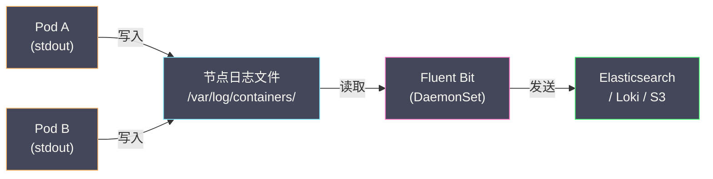
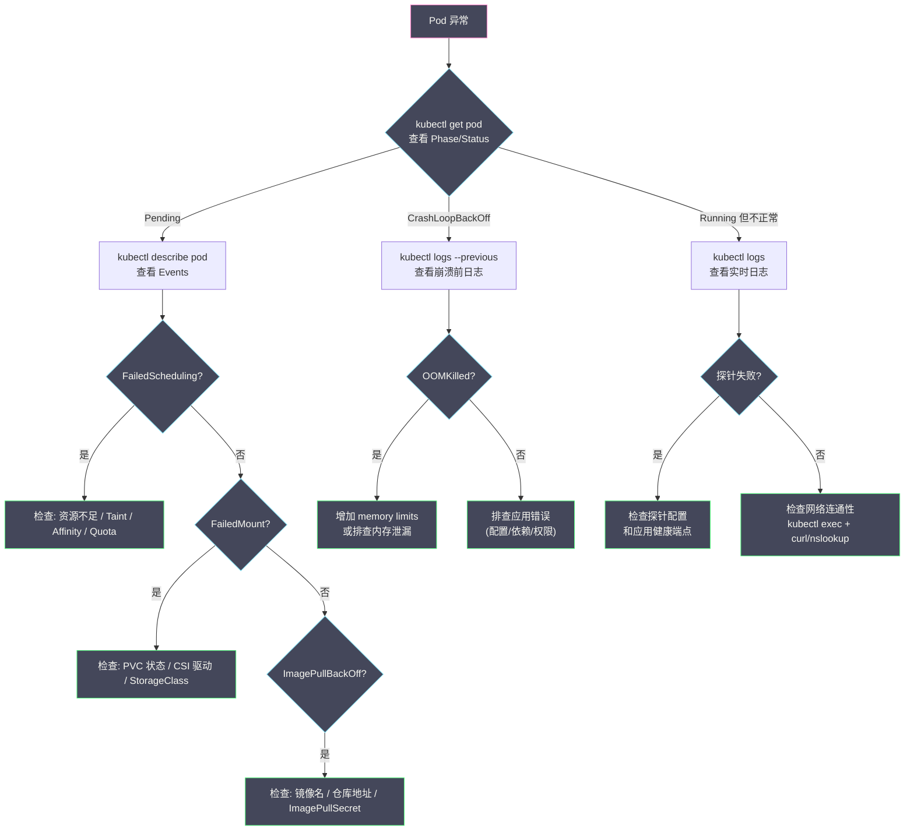

# 04 集群可观测性与故障排查

**摘要：**

一个"能跑"的 K8s 集群和一个"跑好"的 K8s 集群之间的核心差距在于**可观测性**——你能否回答以下问题：集群中哪些节点的 CPU 即将耗尽？某个 Pod 为什么一直 Pending？过去 10 分钟 API Server 的请求延迟是否正常？某次发布后应用的错误率是否上升？K8s 的可观测性建立在三大支柱之上：**指标（Metrics）**——数值型的时间序列数据（CPU 使用率、请求延迟、错误计数）、**日志（Logs）**——应用和系统组件输出的文本记录、**事件（Events）**——K8s 对象生命周期中的关键状态变更。本文从 Metrics Server 和 Prometheus 的指标体系出发，覆盖日志采集架构、K8s Events 的价值与局限，最后提供一套覆盖 Pod/Node/网络常见问题的故障排查 SOP。

---

## 第 1 章 指标体系

### 1.1 Metrics Server——资源指标的基础

**Metrics Server** 是 K8s 的内置指标聚合器——它从每个节点的 kubelet 收集 CPU 和 Memory 的**实时使用量**，通过 API Server 的 Metrics API（`/apis/metrics.k8s.io/v1beta1`）暴露。

Metrics Server 是以下功能的**必要前提**：
- `kubectl top node` / `kubectl top pod`——查看资源使用量
- **HPA（Horizontal Pod Autoscaler）**——基于 CPU/Memory 使用率自动扩缩 Pod
- **VPA（Vertical Pod Autoscaler）**——自动调整 Pod 的 requests/limits

```bash
# 查看节点资源使用
kubectl top node
# NAME       CPU(cores)   CPU%   MEMORY(bytes)   MEMORY%
# worker-1   1250m        31%    4096Mi           51%
# worker-2   3200m        80%    6144Mi           76%   ← CPU 使用率高

# 查看 Pod 资源使用
kubectl top pod -n production
# NAME          CPU(cores)   MEMORY(bytes)
# api-5f8d7c    450m         256Mi
# api-7a2b1e    380m         240Mi
```

**Metrics Server 的局限**：
- 只提供**当前时刻**的 CPU/Memory 指标——不存储历史数据
- 不提供应用级指标（请求延迟、错误率、队列深度）
- 不提供告警能力

### 1.2 Prometheus——生产级监控

**Prometheus** 是云原生生态中事实上的监控标准——由 CNCF 毕业项目。它通过 **Pull 模式**定期从目标（Target）抓取指标，存储为时间序列数据，支持强大的查询语言 **PromQL**。

在 K8s 中，Prometheus 通常通过 **kube-prometheus-stack**（Helm Chart）部署，包含：

| 组件 | 作用 |
| :--- | :--- |
| **Prometheus Server** | 指标抓取、存储和查询 |
| **Alertmanager** | 告警路由和通知（邮件、Slack、PagerDuty）|
| **Grafana** | 可视化仪表盘 |
| **node-exporter** | 节点级指标（CPU、Memory、磁盘、网络）|
| **kube-state-metrics** | K8s 对象状态指标（Pod 数量、Deployment 状态、PVC 状态）|
| **Prometheus Operator** | 通过 CRD 管理 Prometheus 配置 |

### 1.3 ServiceMonitor 与 PodMonitor

Prometheus Operator 通过 **ServiceMonitor** 和 **PodMonitor** CRD 定义抓取目标——不需要手动编辑 Prometheus 配置文件。

```yaml
apiVersion: monitoring.coreos.com/v1
kind: ServiceMonitor
metadata:
  name: api-monitor
  namespace: monitoring
spec:
  selector:
    matchLabels:
      app: api                        # 匹配带有 app=api Label 的 Service
  namespaceSelector:
    matchNames:
      - production
  endpoints:
    - port: metrics                   # Service 中名为 metrics 的端口
      interval: 15s                   # 抓取间隔
      path: /metrics                  # 指标端点路径
```

当 Deployment 创建新 Pod 时，只要 Pod 的 Service 匹配 ServiceMonitor 的 selector，Prometheus 自动发现并开始抓取——无需任何手动操作。

### 1.4 关键监控指标

**节点级别**：

| 指标 | PromQL 示例 | 告警阈值建议 |
| :--- | :--- | :--- |
| CPU 使用率 | `1 - avg(rate(node_cpu_seconds_total{mode="idle"}[5m]))` | > 85% 持续 5 分钟 |
| 内存使用率 | `1 - node_memory_MemAvailable_bytes / node_memory_MemTotal_bytes` | > 90% |
| 磁盘使用率 | `1 - node_filesystem_avail_bytes / node_filesystem_size_bytes` | > 85% |
| 磁盘 I/O 等待 | `rate(node_disk_io_time_seconds_total[5m])` | > 80% |

**K8s 组件级别**：

| 指标 | 来源 | 含义 |
| :--- | :--- | :--- |
| `apiserver_request_duration_seconds` | API Server | API 请求延迟分布 |
| `etcd_server_slow_apply_total` | etcd | etcd 慢写入次数 |
| `scheduler_e2e_scheduling_duration_seconds` | Scheduler | 调度延迟 |
| `workqueue_depth` | Controller Manager | 控制器工作队列深度 |

**应用级别**：

| 指标 | 含义 | 来源 |
| :--- | :--- | :--- |
| `http_requests_total` | HTTP 请求总数（按状态码分）| 应用暴露 |
| `http_request_duration_seconds` | 请求延迟分布 | 应用暴露 |
| `container_cpu_usage_seconds_total` | 容器 CPU 使用量 | cAdvisor (kubelet) |
| `container_memory_working_set_bytes` | 容器内存使用量 | cAdvisor (kubelet) |
| `kube_pod_status_phase` | Pod 的 Phase 分布 | kube-state-metrics |

### 1.5 HPA 与自定义指标

HPA 默认基于 Metrics Server 的 CPU/Memory 指标扩缩。通过 Prometheus Adapter，HPA 可以基于**自定义指标**（如请求延迟、队列深度）扩缩：

```yaml
apiVersion: autoscaling/v2
kind: HorizontalPodAutoscaler
metadata:
  name: api-hpa
spec:
  scaleTargetRef:
    apiVersion: apps/v1
    kind: Deployment
    name: api
  minReplicas: 2
  maxReplicas: 20
  metrics:
    - type: Resource
      resource:
        name: cpu
        target:
          type: Utilization
          averageUtilization: 70          # CPU 使用率超过 70% 时扩容
    - type: Pods
      pods:
        metric:
          name: http_requests_per_second   # 自定义指标：每秒请求数
        target:
          type: AverageValue
          averageValue: "1000"             # 每个 Pod 平均 1000 QPS 时扩容
```

---

## 第 2 章 日志采集

### 2.1 K8s 中的日志架构

容器的标准输出（stdout/stderr）被容器运行时捕获并写入节点的日志文件——通常位于 `/var/log/containers/` 或 `/var/log/pods/`。`kubectl logs` 就是读取这些文件。

K8s 本身**不提供日志聚合和持久化**——节点上的日志文件会被 kubelet 按大小轮转（默认 10Mi × 5 个文件），Pod 删除后日志随之消失。生产环境需要独立的日志采集系统将日志持久化到中央存储。

### 2.2 两种采集架构

**节点级采集（DaemonSet）**：

在每个节点部署一个日志采集 Agent（如 Fluent Bit、Filebeat、Promtail），读取节点上所有容器的日志文件并发送到中央存储。



**优点**：每个节点只运行一个 Agent——资源开销小。
**缺点**：只能采集 stdout/stderr——应用写入文件的日志无法采集。

**Sidecar 采集**：

在每个 Pod 中注入一个日志采集 Sidecar 容器，读取业务容器写入共享 Volume 的日志文件。

**优点**：可以采集任意日志文件——不仅限于 stdout/stderr。
**缺点**：每个 Pod 都多一个容器——资源开销大。

### 2.3 日志存储方案

| 方案 | 特点 | 适用场景 |
| :--- | :--- | :--- |
| **EFK（Elasticsearch + Fluent Bit + Kibana）** | 全文搜索强，但资源消耗大 | 需要复杂日志查询的大型团队 |
| **PLG（Promtail + Loki + Grafana）** | 轻量级，只索引 Label 不索引全文 | 中小规模，已有 Grafana |
| **云服务（CloudWatch / Stackdriver / SLS）** | 免运维，按量计费 | 云上集群 |

> [!note] Loki 的设计哲学
> Loki 借鉴了 Prometheus 的设计——用 Label 索引日志流而非全文索引。查询时先按 Label 过滤（如 `{namespace="production", app="api"}`），再在匹配的日志流中搜索关键词。这使得 Loki 的存储和运行成本远低于 Elasticsearch——但代价是全文搜索性能较弱。

---

## 第 3 章 K8s Events

### 3.1 Events 是什么

**Events** 是 K8s 对象生命周期中的关键状态变更记录——由 kubelet、Scheduler、Controller 等组件生成。

```bash
kubectl get events -n production --sort-by='.lastTimestamp'
# LAST SEEN   TYPE      REASON              OBJECT          MESSAGE
# 2m          Normal    Scheduled           pod/api-abc     Successfully assigned to worker-1
# 2m          Normal    Pulling             pod/api-abc     Pulling image "api:v2"
# 1m          Normal    Pulled              pod/api-abc     Successfully pulled image
# 1m          Normal    Created             pod/api-abc     Created container api
# 1m          Normal    Started             pod/api-abc     Started container api
# 30s         Warning   Unhealthy           pod/api-abc     Readiness probe failed: HTTP 503
# 10s         Warning   BackOff             pod/api-xyz     Back-off restarting failed container
```

### 3.2 Events 的价值

Events 是 **故障排查的第一入口**——当 Pod 异常时，`kubectl describe pod` 底部的 Events 通常能直接告诉你原因：

| Event Reason | 含义 | 可能原因 |
| :--- | :--- | :--- |
| `FailedScheduling` | 调度失败 | 资源不足、Taint 不匹配、亲和性约束 |
| `FailedMount` | Volume 挂载失败 | PVC 未绑定、CSI 驱动故障 |
| `ImagePullBackOff` | 镜像拉取失败 | 镜像名错误、仓库不可达、认证失败 |
| `Unhealthy` | 探针失败 | 应用未就绪或不健康 |
| `OOMKilled` | 内存超限被杀 | memory limit 设置过低 |
| `Evicted` | Pod 被驱逐 | 节点资源压力 |
| `FailedCreate` | 创建 Pod 失败 | ResourceQuota 超限 |

### 3.3 Events 的局限

- **默认只保留 1 小时**：Events 存储在 etcd 中，默认 TTL 为 1 小时——1 小时前的 Events 会被自动清理。如果需要长期保留，需要将 Events 导出到外部存储（如 Elasticsearch）
- **不是告警系统**：Events 只是记录——不主动通知。需要配合 Event Exporter 将关键 Events 转发到告警系统
- **信息有限**：Events 只记录"发生了什么"，不记录"为什么"——深层原因需要查看组件日志

---

## 第 4 章 故障排查 SOP

### 4.1 Pod 异常排查流程



### 4.2 Node 异常排查

**Node NotReady**：

```bash
# 1. 查看节点状态和 Conditions
kubectl describe node worker-2

# 关键 Conditions:
#   Ready=False → kubelet 无法上报心跳
#   MemoryPressure=True → 内存不足
#   DiskPressure=True → 磁盘不足
#   PIDPressure=True → PID 耗尽

# 2. 检查 kubelet 状态
ssh worker-2
systemctl status kubelet
journalctl -u kubelet --since "10 minutes ago"

# 3. 检查节点资源
free -h          # 内存
df -h            # 磁盘
ps aux | wc -l   # 进程数
```

**常见原因**：
- kubelet 进程崩溃或被 OOM Kill
- 节点磁盘满（容器镜像、日志占满磁盘）
- 节点网络不可达（安全组、路由表问题）
- 证书过期（kubelet 与 API Server 的 TLS 证书）

### 4.3 网络问题排查

```bash
# 1. Pod 内部 DNS 解析测试
kubectl exec -it debug-pod -- nslookup mysql.production.svc.cluster.local

# 2. Pod 到 Service 的连通性
kubectl exec -it debug-pod -- curl -v http://api.production.svc.cluster.local:8080/healthz

# 3. Pod 到 Pod 的直接连通性
kubectl exec -it debug-pod -- curl -v http://10.244.1.5:8080/healthz

# 4. 检查 NetworkPolicy 是否阻断了流量
kubectl get networkpolicy -n production

# 5. 检查 kube-proxy 的 iptables/IPVS 规则
ssh worker-1
iptables -t nat -L KUBE-SERVICES | grep <ClusterIP>
# 或
ipvsadm -Ln | grep <ClusterIP>

# 6. 检查 CoreDNS 状态
kubectl -n kube-system logs -l k8s-app=kube-dns
```

### 4.4 常用排查命令速查

| 场景 | 命令 |
| :--- | :--- |
| 查看 Pod 状态 | `kubectl get pod -o wide` |
| 查看 Pod 详情和 Events | `kubectl describe pod <name>` |
| 查看当前日志 | `kubectl logs <pod> -c <container>` |
| 查看上次崩溃的日志 | `kubectl logs <pod> --previous` |
| 实时跟踪日志 | `kubectl logs <pod> -f` |
| 进入容器调试 | `kubectl exec -it <pod> -- /bin/sh` |
| 临时调试容器 | `kubectl debug <pod> -it --image=busybox` |
| 查看资源使用 | `kubectl top pod / kubectl top node` |
| 查看事件 | `kubectl get events --sort-by='.lastTimestamp'` |
| 端口转发 | `kubectl port-forward <pod> 8080:8080` |

### 4.5 kubectl debug（临时容器）

K8s 1.25 GA 的 **Ephemeral Container** 允许向运行中的 Pod 注入临时调试容器——无需重建 Pod 或修改 Deployment。特别适用于使用 distroless 镜像（没有 shell 和调试工具）的生产 Pod。

```bash
# 向运行中的 Pod 注入调试容器
kubectl debug -it api-pod --image=nicolaka/netshoot --target=api

# netshoot 包含 curl, nslookup, tcpdump, ss, ip, strace 等网络调试工具
```

---

## 第 5 章 告警策略

### 5.1 告警分级

| 级别 | 含义 | 响应时间 | 示例 |
| :--- | :--- | :--- | :--- |
| **Critical** | 服务不可用，用户受影响 | 立即 | Pod 全部 CrashLoopBackOff、Node NotReady |
| **Warning** | 即将出现问题，需要关注 | 30 分钟内 | CPU 使用率 > 85%、磁盘使用率 > 85% |
| **Info** | 需要了解但不紧急 | 工作时间处理 | Deployment 滚动更新完成、HPA 扩缩容 |

### 5.2 关键告警规则

```yaml
# Prometheus 告警规则示例
groups:
  - name: kubernetes-pod
    rules:
      - alert: PodCrashLooping
        expr: rate(kube_pod_container_status_restarts_total[15m]) > 0.1
        for: 5m
        labels:
          severity: critical
        annotations:
          summary: "Pod {{ $labels.pod }} 频繁重启"
          
      - alert: PodNotReady
        expr: kube_pod_status_ready{condition="true"} == 0
        for: 10m
        labels:
          severity: warning
        annotations:
          summary: "Pod {{ $labels.pod }} 超过 10 分钟未就绪"

  - name: kubernetes-node
    rules:
      - alert: NodeNotReady
        expr: kube_node_status_condition{condition="Ready", status="true"} == 0
        for: 5m
        labels:
          severity: critical
        annotations:
          summary: "节点 {{ $labels.node }} NotReady"
          
      - alert: NodeHighCPU
        expr: (1 - avg by(instance)(rate(node_cpu_seconds_total{mode="idle"}[5m]))) > 0.85
        for: 10m
        labels:
          severity: warning
        annotations:
          summary: "节点 {{ $labels.instance }} CPU 使用率超过 85%"
```

---

## 第 6 章 总结

本文系统构建了 K8s 集群的可观测性体系和故障排查方法论：

- **指标**：Metrics Server（资源指标，HPA 基础）→ Prometheus（全面监控，PromQL 查询，Alertmanager 告警）→ Grafana（可视化）
- **日志**：节点级 DaemonSet 采集（Fluent Bit）→ 中央存储（Loki / Elasticsearch）→ 查询（Grafana / Kibana）
- **Events**：故障排查的第一入口——`kubectl describe` 查看 Events，默认只保留 1 小时
- **故障排查 SOP**：Pod 异常（Pending → CrashLoopBackOff → Running 但不正常）、Node 异常（NotReady → 检查 kubelet/资源/网络）、网络问题（DNS → Service → Pod 直连）
- **告警策略**：Critical / Warning / Info 三级，基于 Prometheus 规则的自动化告警

下一篇 [[05 应用交付——Helm Kustomize 与 GitOps]] 将分析 K8s 应用的打包和持续交付方案。

---

## 参考资料

1. Kubernetes Documentation - Monitoring Resource Usage：https://kubernetes.io/docs/tasks/debug/debug-cluster/resource-usage-monitoring/
2. Kubernetes Documentation - Debug Pods：https://kubernetes.io/docs/tasks/debug/debug-application/debug-pods/
3. Prometheus Documentation：https://prometheus.io/docs/
4. Grafana Loki Documentation：https://grafana.com/docs/loki/
5. kube-prometheus-stack：https://github.com/prometheus-community/helm-charts/tree/main/charts/kube-prometheus-stack
6. Kubernetes Documentation - Ephemeral Containers：https://kubernetes.io/docs/concepts/workloads/pods/ephemeral-containers/

---

> [!note] 思考题
> 1. Prometheus 的 ServiceMonitor（由 Prometheus Operator 管理）自动发现 Kubernetes Service 并抓取指标。在 1000 Pod 的集群中，Prometheus 采集的时间序列可能达到数百万——存储和查询压力很大。Thanos 或 Cortex 如何实现 Prometheus 的长期存储和水平扩展？它们的架构差异是什么？
> 2. Kubernetes 的'四个黄金信号'：延迟（请求处理时间）、流量（每秒请求数）、错误（失败请求率）和饱和度（资源使用程度）。在设计告警规则时，你如何避免'告警风暴'——一个根因触发数十条告警？告警分级（Critical、Warning、Info）和告警抑制（Inhibition）如何设计？
> 3. Grafana Dashboard 的设计——在 Kubernetes 场景中，你需要哪些层级的 Dashboard（集群概览 → 节点 → Namespace → Pod → Container）？'信息过载'是 Dashboard 设计的常见问题——每个 Dashboard 应该回答什么核心问题？如何避免'什么都展示但什么都看不出来'？
