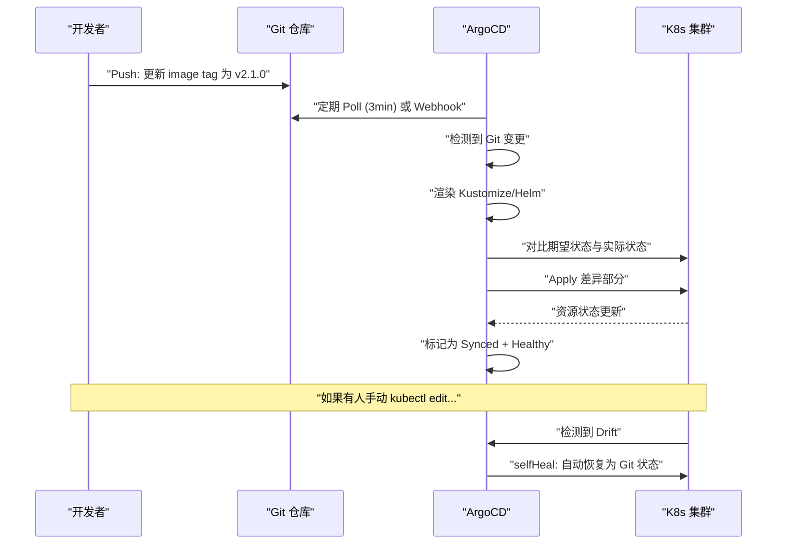
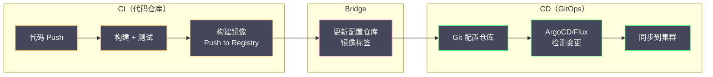

# 05 应用交付——Helm Kustomize 与 GitOps

**摘要：**

一个 K8s 应用通常由多个 YAML 文件组成——Deployment、Service、ConfigMap、Ingress、PVC、NetworkPolicy……手动管理这些 YAML 文件在多环境（开发/测试/生产）、多集群场景下迅速变成噩梦：复制粘贴导致配置漂移，手动 `kubectl apply` 缺乏版本控制和回滚能力，不同环境的差异散落在各处无法追溯。K8s 生态中有两种主流的应用打包与配置管理工具——**Helm**（模板化方案）和 **Kustomize**（叠加式方案），它们解决问题的思路完全不同。在此之上，**GitOps** 理念将 Git 仓库作为集群期望状态的"唯一真相来源"——通过 ArgoCD 或 Flux 持续将 Git 中的声明式配置同步到集群，实现完全自动化的持续交付。本文从 Helm 和 Kustomize 的设计理念与使用方式出发，对比两者的优劣和选型策略，然后深入 GitOps 的工作模型和持续交付流水线设计。

---

## 第 1 章 应用交付的痛点

### 1.1 裸 YAML 的困境

一个典型的微服务需要以下 K8s 资源：

```
my-app/
├── deployment.yaml
├── service.yaml
├── configmap.yaml
├── secret.yaml
├── ingress.yaml
├── hpa.yaml
├── networkpolicy.yaml
└── pdb.yaml
```

这些 YAML 文件在不同环境中需要不同的值——开发环境 1 个副本、生产环境 3 个副本；开发用 `latest` 镜像标签、生产用固定版本；开发不需要 Ingress、生产需要 TLS……

**最原始的做法**：为每个环境复制一套完整的 YAML 目录——`my-app-dev/`、`my-app-staging/`、`my-app-prod/`。问题立刻出现：修改一个共享配置（如 Container Port）需要同时改三个地方——遗漏一个就产生配置漂移。50 个微服务 × 3 个环境 = 150 套 YAML——无法维护。

### 1.2 两种解决思路

**模板化（Helm）**：定义一套 YAML 模板（带 `{{ .Values.xxx }}` 占位符），通过不同的 Values 文件注入不同环境的参数。类似于"函数 + 参数"的关系——模板是函数，Values 是参数。

**叠加式（Kustomize）**：定义一套 base YAML（完整的、可直接 apply 的），然后通过 overlay（补丁）在 base 之上叠加环境差异。类似于"继承 + 覆盖"的关系——base 是父类，overlay 是子类的局部覆盖。

---

## 第 2 章 Helm

### 2.1 Helm 是什么

**Helm** 是 K8s 的"包管理器"——类似于 apt（Debian）或 brew（macOS）。它将一个应用的所有 K8s 资源打包为一个 **Chart**（包），通过 `helm install` 一键部署。

Helm 的三个核心概念：

| 概念 | 说明 |
| :--- | :--- |
| **Chart** | 一个应用的打包格式——包含模板文件、默认值、依赖声明 |
| **Release** | Chart 的一次安装实例——同一个 Chart 可以安装多次，每次是不同的 Release |
| **Values** | Chart 的参数——不同环境传入不同的 Values 文件 |

### 2.2 Chart 的目录结构

```
my-app/
├── Chart.yaml              # Chart 元数据（名称、版本、描述）
├── values.yaml             # 默认参数值
├── templates/              # K8s YAML 模板
│   ├── deployment.yaml
│   ├── service.yaml
│   ├── configmap.yaml
│   ├── ingress.yaml
│   ├── hpa.yaml
│   ├── _helpers.tpl        # 模板辅助函数
│   └── NOTES.txt           # 安装后的提示信息
├── charts/                 # 依赖的子 Chart
└── values/
    ├── dev.yaml            # 开发环境参数
    └── prod.yaml           # 生产环境参数
```

### 2.3 模板语法

Helm 使用 Go 的 `text/template` 语法：

```yaml
# templates/deployment.yaml
apiVersion: apps/v1
kind: Deployment
metadata:
  name: {{ include "my-app.fullname" . }}
  labels:
    {{- include "my-app.labels" . | nindent 4 }}
spec:
  replicas: {{ .Values.replicaCount }}
  selector:
    matchLabels:
      {{- include "my-app.selectorLabels" . | nindent 6 }}
  template:
    spec:
      containers:
        - name: {{ .Chart.Name }}
          image: "{{ .Values.image.repository }}:{{ .Values.image.tag }}"
          ports:
            - containerPort: {{ .Values.service.targetPort }}
          resources:
            {{- toYaml .Values.resources | nindent 12 }}
          {{- if .Values.livenessProbe.enabled }}
          livenessProbe:
            httpGet:
              path: {{ .Values.livenessProbe.path }}
              port: {{ .Values.service.targetPort }}
          {{- end }}
```

```yaml
# values.yaml（默认值）
replicaCount: 1
image:
  repository: my-app
  tag: latest
service:
  type: ClusterIP
  port: 80
  targetPort: 8080
resources:
  requests:
    cpu: 100m
    memory: 128Mi
  limits:
    cpu: 500m
    memory: 256Mi
livenessProbe:
  enabled: true
  path: /healthz
```

```yaml
# values/prod.yaml（生产环境覆盖）
replicaCount: 3
image:
  tag: v2.1.0
resources:
  requests:
    cpu: 500m
    memory: 512Mi
  limits:
    cpu: "2"
    memory: 1Gi
```

### 2.4 Helm 的核心操作

```bash
# 安装 Chart（创建 Release）
helm install my-app ./my-app -f values/prod.yaml -n production

# 升级 Release（更新参数或 Chart 版本）
helm upgrade my-app ./my-app -f values/prod.yaml -n production

# 回滚到上一个版本
helm rollback my-app 1 -n production

# 查看 Release 历史
helm history my-app -n production

# 卸载 Release（删除所有资源）
helm uninstall my-app -n production

# 渲染模板但不安装（调试用）
helm template my-app ./my-app -f values/prod.yaml
```

### 2.5 Helm 的 Release 管理

Helm 将每次 install/upgrade 的 Release 信息（包含渲染后的完整 YAML）存储为 K8s Secret（默认）——这使得 Helm 能够精确地知道"上一次部署了什么"，实现精准回滚和差异对比。

```bash
# Helm Release 的 Secret
kubectl get secret -n production -l owner=helm
# sh.helm.release.v1.my-app.v1
# sh.helm.release.v1.my-app.v2
```

### 2.6 Chart 仓库与依赖

Helm Chart 可以发布到 **Chart 仓库**（HTTP 服务器或 OCI Registry）供团队共享：

```bash
# 添加官方 Chart 仓库
helm repo add bitnami https://charts.bitnami.com/bitnami

# 安装社区 Chart
helm install mysql bitnami/mysql -n production
```

Chart 可以声明对其他 Chart 的**依赖**——例如一个应用的 Chart 依赖 Redis Chart：

```yaml
# Chart.yaml
dependencies:
  - name: redis
    version: 17.x.x
    repository: https://charts.bitnami.com/bitnami
    condition: redis.enabled
```

### 2.7 Helm 的优势与局限

**优势**：
- **参数化能力强**：通过 Values 可以灵活控制几乎所有配置——适合需要高度定制的复杂应用
- **包管理生态**：丰富的社区 Chart（Prometheus、MySQL、Redis、Nginx Ingress 等），开箱即用
- **Release 管理**：内置版本历史和回滚——运维友好
- **依赖管理**：Chart 之间可以声明依赖关系

**局限**：
- **模板复杂度**：Go template 语法晦涩——`{{- if and .Values.ingress.enabled (not (empty .Values.ingress.hosts)) }}` 这类表达式可读性差
- **调试困难**：模板渲染出错时错误信息不直观——需要 `helm template` 逐步排查
- **不可直接 kubectl apply**：模板文件不是有效的 YAML——必须通过 Helm CLI 渲染后才能使用
- **学习曲线**：Go template + Helm 特有的内置对象/函数需要专门学习

---

## 第 3 章 Kustomize

### 3.1 Kustomize 的设计哲学

Kustomize 的核心理念是**"无模板的配置定制"**——base 目录中的 YAML 文件是完整的、可直接 `kubectl apply` 的纯 K8s 资源定义（不含任何模板语法）。环境差异通过 **overlay**（叠加层）以补丁的方式修改 base 中的特定字段。

这意味着：
- 任何人都可以直接阅读和理解 base YAML——不需要学习模板语法
- base YAML 可以直接 `kubectl apply` 部署——不依赖额外工具
- Kustomize 从 K8s 1.14 开始内置在 kubectl 中——`kubectl apply -k` 直接使用

### 3.2 目录结构

```
my-app/
├── base/                           # 基础配置（所有环境共享）
│   ├── kustomization.yaml
│   ├── deployment.yaml
│   ├── service.yaml
│   └── configmap.yaml
├── overlays/
│   ├── dev/                        # 开发环境叠加层
│   │   ├── kustomization.yaml
│   │   └── replica-patch.yaml
│   └── prod/                       # 生产环境叠加层
│       ├── kustomization.yaml
│       ├── replica-patch.yaml
│       └── resource-patch.yaml
```

### 3.3 base 配置

```yaml
# base/kustomization.yaml
apiVersion: kustomize.config.k8s.io/v1beta1
kind: Kustomization
resources:
  - deployment.yaml
  - service.yaml
  - configmap.yaml
commonLabels:
  app: my-app
```

```yaml
# base/deployment.yaml（完整、可直接 apply 的 YAML）
apiVersion: apps/v1
kind: Deployment
metadata:
  name: my-app
spec:
  replicas: 1
  selector:
    matchLabels:
      app: my-app
  template:
    spec:
      containers:
        - name: app
          image: my-app:latest
          ports:
            - containerPort: 8080
          resources:
            requests:
              cpu: 100m
              memory: 128Mi
```

### 3.4 overlay 叠加

```yaml
# overlays/prod/kustomization.yaml
apiVersion: kustomize.config.k8s.io/v1beta1
kind: Kustomization
resources:
  - ../../base                        # 引用 base
namespace: production                  # 所有资源加入 production Namespace
namePrefix: prod-                      # 名称前缀
patches:
  - path: replica-patch.yaml
  - path: resource-patch.yaml
images:
  - name: my-app
    newTag: v2.1.0                     # 替换镜像标签
```

```yaml
# overlays/prod/replica-patch.yaml（Strategic Merge Patch）
apiVersion: apps/v1
kind: Deployment
metadata:
  name: my-app
spec:
  replicas: 3
```

```yaml
# overlays/prod/resource-patch.yaml
apiVersion: apps/v1
kind: Deployment
metadata:
  name: my-app
spec:
  template:
    spec:
      containers:
        - name: app
          resources:
            requests:
              cpu: 500m
              memory: 512Mi
            limits:
              cpu: "2"
              memory: 1Gi
```

```bash
# 预览渲染结果
kubectl kustomize overlays/prod/

# 直接部署
kubectl apply -k overlays/prod/
```

### 3.5 Kustomize 的常用功能

| 功能 | 说明 |
| :--- | :--- |
| **patches** | Strategic Merge Patch 或 JSON Patch 修改资源字段 |
| **images** | 替换镜像名称/标签/摘要 |
| **namespace** | 为所有资源设置 Namespace |
| **namePrefix / nameSuffix** | 为所有资源名称添加前缀/后缀 |
| **commonLabels / commonAnnotations** | 为所有资源添加 Label/Annotation |
| **configMapGenerator** | 从文件或键值对自动生成 ConfigMap（带哈希后缀）|
| **secretGenerator** | 从文件或键值对自动生成 Secret（带哈希后缀）|
| **components** | 可复用的 Kustomize 组件（如 monitoring sidecar）|

> [!info] configMapGenerator 的哈希后缀
> Kustomize 生成的 ConfigMap 名称自动带有内容哈希后缀（如 `app-config-k5f8h2`）——当配置内容变化时哈希变化，Deployment 引用的 ConfigMap 名称随之变化，触发 Pod 滚动更新。这解决了"修改 ConfigMap 后 Pod 不重启"的问题。

### 3.6 Kustomize 的优势与局限

**优势**：
- **零学习曲线**：base YAML 就是纯 K8s 资源——不需要学习模板语法
- **kubectl 内置**：`kubectl apply -k` 无需安装额外工具
- **可读性强**：overlay 只包含差异部分——一目了然
- **GitOps 友好**：所有配置都是声明式的纯 YAML

**局限**：
- **参数化能力弱**：无法做复杂的条件逻辑（if/else/loop）——只能做字段级别的覆盖
- **无包管理**：没有 Chart 仓库的概念——无法像 Helm 那样分享和复用打包好的应用
- **无 Release 管理**：没有版本历史和回滚——回滚需要通过 Git revert
- **补丁局限**：某些复杂的修改（如在列表中间插入元素）用 Patch 很难表达

---

## 第 4 章 Helm vs Kustomize 选型

| 维度 | Helm | Kustomize |
| :--- | :--- | :--- |
| **核心思路** | 模板 + 参数 | 基础 + 叠加补丁 |
| **学习曲线** | 较陡（Go template）| 几乎为零 |
| **参数化能力** | 强（条件、循环、函数）| 弱（字段覆盖）|
| **包管理** | ✅ Chart 仓库 | ❌ |
| **Release 管理** | ✅ 版本历史 + 回滚 | ❌ |
| **kubectl 内置** | ❌ 需要 Helm CLI | ✅ |
| **可读性** | 模板文件可读性差 | base YAML 可读性强 |
| **社区生态** | 丰富（bitnami、prometheus-community）| 较少 |
| **GitOps 兼容** | ✅（ArgoCD 原生支持）| ✅（ArgoCD 原生支持）|

**选型建议**：

- **使用社区中间件**（MySQL、Redis、Prometheus）：用 Helm——社区 Chart 开箱即用
- **自研应用、简单配置差异**：用 Kustomize——overlay 直观、无额外依赖
- **自研应用、复杂参数化需求**：用 Helm——模板的条件逻辑更灵活
- **两者结合**：Helm 渲染模板 → Kustomize 叠加环境差异（`helm template | kustomize`）

---

## 第 5 章 GitOps

### 5.1 什么是 GitOps

**GitOps** 是一种运维理念——将 **Git 仓库**作为集群期望状态的"唯一真相来源"（Single Source of Truth）。集群中运行一个 GitOps Controller（如 ArgoCD 或 Flux），持续监控 Git 仓库的变更，自动将 Git 中的声明式配置同步到 K8s 集群。

**核心原则**：

- **声明式**：所有配置都以声明式 YAML 存储在 Git 中——不使用命令式操作（`kubectl edit`、`kubectl scale`）
- **版本化**：Git 的 commit 历史就是集群配置的版本历史——谁在什么时候改了什么一目了然
- **自动同步**：GitOps Controller 持续将 Git 中的期望状态与集群的实际状态对比——有差异就自动修复（或告警）
- **Pull 模式**：集群内的 Controller 主动从 Git **拉取**配置——不是外部 CI 推送到集群（更安全——不需要给 CI 系统集群访问权限）

### 5.2 Push vs Pull 模式

**传统 CI/CD（Push 模式）**：

```
开发者 push 代码 → CI 构建镜像 → CI 执行 kubectl apply / helm upgrade → 集群
```

问题：
- CI 系统需要集群的 kubeconfig——安全风险
- 手动 `kubectl edit` 的变更不被 Git 记录——配置漂移
- 没有持续监控——如果有人直接修改了集群配置，CI 不会纠正

**GitOps（Pull 模式）**：

```
开发者 push 代码 → CI 构建镜像 → CI 更新 Git 仓库中的镜像标签 → GitOps Controller 检测到变更 → 自动同步到集群
```

优势：
- CI 系统不需要集群权限——只需要 Git 写权限
- 所有变更都经过 Git——PR 审核、commit 记录
- Controller 持续监控——手动修改集群配置会被自动恢复

### 5.3 ArgoCD

**ArgoCD** 是最流行的 GitOps 工具——以 K8s Controller 形式运行在集群中，提供 Web UI、CLI 和 API。

**核心概念**：

| 概念 | 说明 |
| :--- | :--- |
| **Application** | 一个 ArgoCD 应用——关联 Git 仓库路径和目标集群/Namespace |
| **Sync** | 将 Git 中的配置同步到集群——可自动或手动触发 |
| **Health** | 应用的健康状态——所有资源 Healthy 且 Synced |
| **Drift Detection** | 检测集群实际状态与 Git 期望状态的差异 |

```yaml
apiVersion: argoproj.io/v1alpha1
kind: Application
metadata:
  name: my-app
  namespace: argocd
spec:
  project: default
  source:
    repoURL: https://github.com/my-org/k8s-config.git
    targetRevision: main
    path: apps/my-app/overlays/prod        # Kustomize overlay 路径
  destination:
    server: https://kubernetes.default.svc
    namespace: production
  syncPolicy:
    automated:
      prune: true                           # 自动删除 Git 中已移除的资源
      selfHeal: true                        # 自动修复手动修改导致的漂移
    syncOptions:
      - CreateNamespace=true
```

**ArgoCD 的工作流程**：



### 5.4 Flux

**Flux** 是另一个主流 GitOps 工具——由 CNCF 毕业项目。与 ArgoCD 的集中式 UI 不同，Flux 采用更"K8s 原生"的方式——所有配置通过 CRD 管理，没有独立的 Web UI（但可集成 Weave GitOps Dashboard）。

| 维度 | ArgoCD | Flux |
| :--- | :--- | :--- |
| **UI** | 内置 Web UI（功能丰富）| 无内置 UI（CLI + CRD）|
| **多集群** | 单 ArgoCD 管理多集群 | 每个集群独立部署 Flux |
| **配置方式** | Application CRD + Web UI | GitRepository + Kustomization CRD |
| **Helm 支持** | 原生支持 | 原生支持（HelmRelease CRD）|
| **镜像自动更新** | 需要 Argo Image Updater | 内置 Image Automation |
| **成熟度** | 更成熟、社区更大 | CNCF 毕业，稳步增长 |

### 5.5 Git 仓库的组织

**单仓库（Monorepo）**：

```
k8s-config/
├── apps/
│   ├── api/
│   │   ├── base/
│   │   └── overlays/
│   │       ├── dev/
│   │       └── prod/
│   └── web/
│       ├── base/
│       └── overlays/
├── infrastructure/
│   ├── monitoring/
│   ├── ingress/
│   └── cert-manager/
└── clusters/
    ├── dev/
    └── prod/
```

**多仓库**：
- `app-config`：应用配置（Deployment、Service 等）
- `infra-config`：基础设施配置（Prometheus、Ingress Controller 等）
- 每个应用一个仓库

**建议**：小团队用单仓库——简单直观。大团队或多集群用多仓库——权限分离更清晰。

---

## 第 6 章 持续交付流水线设计

### 6.1 完整的 CI/CD + GitOps 流水线



**CI 阶段**（代码仓库触发——GitHub Actions / Jenkins / GitLab CI）：
1. 开发者 Push 代码到应用代码仓库
2. CI 运行单元测试、集成测试
3. CI 构建容器镜像并 Push 到 Registry（带版本标签如 `v2.1.0` 或 commit SHA）

**Bridge 阶段**（连接 CI 和 CD）：
4. CI 更新**配置仓库**中的镜像标签——通过 Git commit（`kustomize edit set image my-app=my-app:v2.1.0`）或 PR

**CD 阶段**（GitOps Controller 自动执行）：
5. ArgoCD/Flux 检测到配置仓库变更
6. 渲染 Kustomize/Helm 配置
7. 对比集群实际状态与期望状态
8. Apply 差异——触发滚动更新

### 6.2 渐进式交付

GitOps 可以与渐进式交付（Progressive Delivery）结合——通过 **Argo Rollouts** 或 **Flagger** 实现金丝雀发布和蓝绿部署：

```yaml
apiVersion: argoproj.io/v1alpha1
kind: Rollout
metadata:
  name: my-app
spec:
  strategy:
    canary:
      steps:
        - setWeight: 10               # 10% 流量到新版本
        - pause: {duration: 5m}       # 观察 5 分钟
        - setWeight: 30
        - pause: {duration: 5m}
        - setWeight: 60
        - pause: {duration: 5m}
        - setWeight: 100              # 全量发布
      analysis:
        templates:
          - templateName: success-rate
        args:
          - name: service-name
            value: my-app
```

---

## 第 7 章 总结

本文系统分析了 K8s 应用交付的三大工具和理念：

- **Helm**：模板化方案——Go template + Values 参数化，内置 Chart 仓库和 Release 管理，适合社区中间件和复杂参数化需求
- **Kustomize**：叠加式方案——纯 YAML base + overlay 补丁，kubectl 内置，零学习曲线，适合自研应用和简单环境差异
- **GitOps**：以 Git 为唯一真相来源——ArgoCD/Flux 持续同步 Git 配置到集群，Pull 模式更安全，自动漂移检测和修复
- **完整流水线**：CI（代码构建+镜像）→ Bridge（更新配置仓库）→ CD（GitOps 自动同步）
- **选型**：社区中间件用 Helm，自研应用用 Kustomize，生产环境用 GitOps 管理交付

下一篇 [[06 集群升级 备份与容灾]] 将分析集群的版本升级策略和灾难恢复方案——作为整个 K8s 系列的收官。

---

## 参考资料

1. Helm Documentation：https://helm.sh/docs/
2. Kustomize Documentation：https://kustomize.io/
3. ArgoCD Documentation：https://argo-cd.readthedocs.io/
4. Flux Documentation：https://fluxcd.io/docs/
5. Argo Rollouts：https://argoproj.github.io/argo-rollouts/
6. Kubernetes Documentation - Managing Resources：https://kubernetes.io/docs/concepts/cluster-administration/manage-deployment/
7. GitOps Working Group：https://opengitops.dev/

---

> [!note] 思考题
> 1. EFK（Elasticsearch + Fluentd/Fluent Bit + Kibana）是传统的 Kubernetes 日志方案。Fluent Bit 作为 DaemonSet 在每个节点收集容器日志（`/var/log/containers/*.log`）并发送到 ES。在每天产生 TB 级日志的集群中，ES 的存储成本可能很高。Loki（Grafana 的日志系统）通过只索引标签（不全文索引）大幅降低了存储成本——但全文搜索能力不如 ES。在什么查询模式下 Loki 足够使用？
> 2. 容器日志的生命周期：容器写 stdout/stderr → 容器运行时（containerd）将日志写入节点文件 → 日志收集器（Fluent Bit）读取并发送到后端。如果容器被重新创建（如 Pod 重启），旧容器的日志文件保留多久？`kubectl logs --previous` 如何查看上一个容器的日志？
> 3. 结构化日志（JSON 格式）vs 非结构化日志（纯文本）。结构化日志可以直接在 ES/Loki 中按字段查询（如 `level: ERROR AND service: payment`）。在推动团队使用结构化日志时，你需要提供什么标准和工具（如日志库的配置模板、日志格式规范）？
