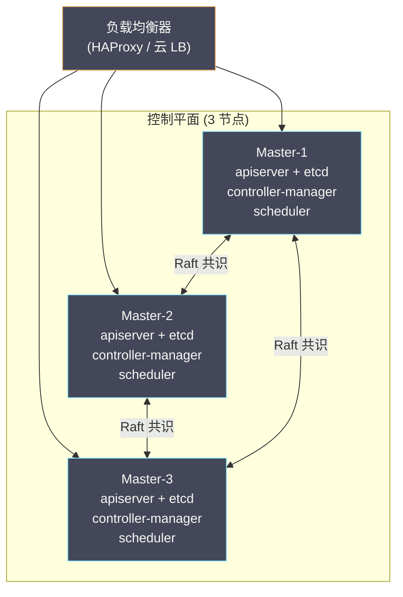

# 06 集群升级 备份与容灾

**摘要：**

K8s 社区每年发布三个 Minor 版本（如 1.29 → 1.30 → 1.31），每个版本的维护周期约 14 个月。不及时升级意味着失去安全补丁和 Bug 修复——但升级本身也充满风险：API 版本被废弃导致现有 YAML 失效、组件版本偏差（Version Skew）导致功能异常、升级过程中控制平面短暂不可用。另一方面，etcd 是集群的"大脑"——所有对象状态存储在这里，etcd 数据丢失等于集群从零开始。生产集群必须有完善的**备份策略**和**灾难恢复预案**。本文从 K8s 的版本策略和升级路径出发，覆盖 kubeadm 升级的完整流程、etcd 备份与恢复、控制平面的高可用架构，以及 Cluster API 对集群生命周期的声明式管理。

---

## 第 1 章 K8s 版本策略

### 1.1 版本号格式

K8s 使用语义化版本号：`v<Major>.<Minor>.<Patch>`

```
v1.30.2
 │  │  └── Patch：Bug 修复、安全补丁（向后兼容）
 │  └───── Minor：新功能、API 变更（可能废弃旧 API）
 └──────── Major：重大不兼容变更（1.x 稳定后极少变化）
```

### 1.2 发布节奏

- **Minor 版本**：每年 3 次（约每 4 个月）——1.30 → 1.31 → 1.32
- **Patch 版本**：每月 1-2 次——安全漏洞修复和 Bug 修复
- **维护周期**：每个 Minor 版本维护约 **14 个月**——之后不再发布 Patch

这意味着：如果集群运行 1.28，而社区已经发布了 1.31，1.28 可能已经 EOL（End of Life）——不再有安全补丁。

### 1.3 Version Skew Policy

K8s 各组件之间有严格的版本偏差限制——不是所有组件都必须运行相同版本：

| 组件对 | 允许偏差 | 说明 |
| :--- | :--- | :--- |
| **kube-apiserver** 多实例之间 | 1 个 Minor 版本 | 滚动升级时允许短暂共存 |
| **kubelet** vs **kube-apiserver** | kubelet 最多低 3 个 Minor 版本 | kubelet 1.28 可以连接 apiserver 1.31 |
| **kube-controller-manager / kube-scheduler** vs **kube-apiserver** | 最多低 1 个 Minor 版本 | 必须先升级 apiserver |
| **kubectl** vs **kube-apiserver** | ±1 个 Minor 版本 | 客户端工具可以略高或略低 |

> [!info] 升级顺序的黄金法则
> **先升级控制平面，再升级工作节点。** 控制平面内部：先升级 etcd → 再升级 kube-apiserver → 最后升级 controller-manager 和 scheduler。工作节点的 kubelet 最后升级——Version Skew Policy 保证了 kubelet 可以在较低版本运行。

### 1.4 API 版本废弃

K8s 的 API 资源有多个版本（如 `v1beta1`、`v1`）。新版本发布时旧 API 版本可能被废弃（deprecated），经过若干版本后被移除（removed）。

例如：`batch/v1beta1` CronJob 在 1.21 被废弃，在 1.25 被移除——如果集群从 1.24 升级到 1.25，使用 `batch/v1beta1` 的 YAML 文件将无法 apply。

**升级前的必要检查**：

```bash
# 检查集群中是否有使用已废弃 API 的资源
kubectl get --raw /metrics | grep apiserver_requested_deprecated_apis

# 使用 pluto 工具扫描
pluto detect-helm -o wide
pluto detect-files -d ./manifests/
```

---

## 第 2 章 集群升级策略

### 2.1 原地升级（In-Place Upgrade）

在现有节点上逐个升级 K8s 组件版本——不替换节点。

**流程**：
1. 升级控制平面节点（逐个）
2. 逐个 cordon + drain 工作节点
3. 升级工作节点的 kubelet 和 kube-proxy
4. uncordon 节点

**优点**：节省资源——不需要额外的节点
**缺点**：升级过程中节点逐个不可用——如果升级失败回滚困难

### 2.2 蓝绿升级（Blue-Green / Node Replacement）

创建一批运行新版本的节点（Green），将工作负载从旧节点（Blue）迁移到新节点，然后删除旧节点。

**流程**：
1. 升级控制平面（原地升级——控制平面通常不好替换）
2. 向集群添加运行新版本 kubelet 的新节点
3. Cordon 旧节点（停止调度新 Pod）
4. Drain 旧节点（迁移现有 Pod 到新节点）
5. 确认所有工作负载在新节点上正常运行
6. 删除旧节点

**优点**：回滚简单——出问题直接 uncordon 旧节点、drain 新节点
**缺点**：临时需要双倍的工作节点——成本更高

### 2.3 托管集群的升级

云托管的 K8s（EKS / GKE / AKS）简化了控制平面升级——一键升级即可：

```bash
# AWS EKS
aws eks update-cluster-version --name my-cluster --kubernetes-version 1.31

# GKE
gcloud container clusters upgrade my-cluster --master --cluster-version 1.31

# AKS
az aks upgrade --name my-cluster --kubernetes-version 1.31
```

工作节点通常通过**节点组轮转**升级——创建新版本的节点组，drain 旧节点组。

---

## 第 3 章 kubeadm 升级实战

### 3.1 升级前准备

```bash
# 1. 查看当前版本
kubectl get nodes
kubeadm version

# 2. 查看可用的升级版本
sudo apt-cache madison kubeadm | head -5

# 3. 检查废弃 API
pluto detect-helm -o wide

# 4. 备份 etcd（最关键的一步）
ETCDCTL_API=3 etcdctl snapshot save /backup/etcd-$(date +%Y%m%d).db \
  --endpoints=https://127.0.0.1:2379 \
  --cacert=/etc/kubernetes/pki/etcd/ca.crt \
  --cert=/etc/kubernetes/pki/etcd/server.crt \
  --key=/etc/kubernetes/pki/etcd/server.key

# 5. 备份 kubeadm 配置
kubectl -n kube-system get cm kubeadm-config -o yaml > /backup/kubeadm-config.yaml
```

### 3.2 升级控制平面

```bash
# 1. 升级 kubeadm 工具
sudo apt-get update
sudo apt-get install -y kubeadm=1.31.0-1.1

# 2. 验证升级计划
sudo kubeadm upgrade plan

# 3. 执行升级（第一个控制平面节点）
sudo kubeadm upgrade apply v1.31.0

# 4. 升级 kubelet 和 kubectl
sudo apt-get install -y kubelet=1.31.0-1.1 kubectl=1.31.0-1.1
sudo systemctl daemon-reload
sudo systemctl restart kubelet

# 5. 其他控制平面节点
sudo kubeadm upgrade node    # 不是 upgrade apply
sudo apt-get install -y kubelet=1.31.0-1.1
sudo systemctl daemon-reload
sudo systemctl restart kubelet
```

### 3.3 升级工作节点

```bash
# 对每个工作节点执行以下步骤

# 1. 在控制平面节点上 cordon + drain 目标节点
kubectl cordon worker-1
kubectl drain worker-1 --ignore-daemonsets --delete-emptydir-data

# 2. SSH 到工作节点
ssh worker-1

# 3. 升级 kubeadm
sudo apt-get update
sudo apt-get install -y kubeadm=1.31.0-1.1

# 4. 升级节点配置
sudo kubeadm upgrade node

# 5. 升级 kubelet
sudo apt-get install -y kubelet=1.31.0-1.1
sudo systemctl daemon-reload
sudo systemctl restart kubelet

# 6. 回到控制平面节点 uncordon
kubectl uncordon worker-1
```

### 3.4 升级验证

```bash
# 确认所有节点版本一致
kubectl get nodes
# NAME       STATUS   ROLES           VERSION
# master-1   Ready    control-plane   v1.31.0
# master-2   Ready    control-plane   v1.31.0
# worker-1   Ready    <none>          v1.31.0
# worker-2   Ready    <none>          v1.31.0

# 确认核心组件正常
kubectl get pods -n kube-system

# 运行一个测试 Pod 确认集群功能正常
kubectl run test --image=busybox --rm -it -- nslookup kubernetes
```

---

## 第 4 章 etcd 备份与恢复

### 4.1 为什么 etcd 备份是第一优先级

[[06 etcd 与 Kubernetes 的状态存储|etcd]] 存储了集群的**所有状态**——Deployment、Service、ConfigMap、Secret、RBAC 规则、CRD 定义……etcd 数据丢失意味着：

- 所有 K8s 对象定义消失——控制平面不知道集群中应该运行什么
- 正在运行的 Pod 不受直接影响（kubelet 会继续维护现有 Pod）——但无法创建/更新/删除任何资源
- 相当于集群"失忆"——需要从备份恢复或从零重建

### 4.2 备份策略

**快照备份**：

```bash
# 创建 etcd 快照
ETCDCTL_API=3 etcdctl snapshot save /backup/etcd-snapshot.db \
  --endpoints=https://127.0.0.1:2379 \
  --cacert=/etc/kubernetes/pki/etcd/ca.crt \
  --cert=/etc/kubernetes/pki/etcd/server.crt \
  --key=/etc/kubernetes/pki/etcd/server.key

# 验证快照完整性
ETCDCTL_API=3 etcdctl snapshot status /backup/etcd-snapshot.db --write-table
```

**备份频率**：

| 场景 | 建议频率 |
| :--- | :--- |
| 生产集群 | 每 1-4 小时一次 |
| 关键操作前（升级、大规模变更）| 手动备份 |
| 开发/测试集群 | 每天一次 |

**备份存储**：

- 备份文件必须存储在 etcd 节点**之外**——如果节点故障，本地备份也丢失
- 推荐：对象存储（S3 / GCS / MinIO）+ 跨区域复制
- 加密存储——etcd 快照包含所有 Secret 的明文数据

### 4.3 从快照恢复

```bash
# 停止 API Server 和 etcd
sudo mv /etc/kubernetes/manifests/kube-apiserver.yaml /tmp/
sudo mv /etc/kubernetes/manifests/etcd.yaml /tmp/

# 恢复快照
ETCDCTL_API=3 etcdctl snapshot restore /backup/etcd-snapshot.db \
  --data-dir=/var/lib/etcd-restored \
  --name=master-1 \
  --initial-cluster=master-1=https://10.0.0.1:2380 \
  --initial-cluster-token=etcd-cluster-1 \
  --initial-advertise-peer-urls=https://10.0.0.1:2380

# 替换 etcd 数据目录
sudo rm -rf /var/lib/etcd
sudo mv /var/lib/etcd-restored /var/lib/etcd
sudo chown -R etcd:etcd /var/lib/etcd

# 恢复 etcd 和 API Server
sudo mv /tmp/etcd.yaml /etc/kubernetes/manifests/
sudo mv /tmp/kube-apiserver.yaml /etc/kubernetes/manifests/

# 验证
kubectl get nodes
kubectl get pods --all-namespaces
```

> [!warning] etcd 恢复的数据一致性
> 从快照恢复后，集群状态回到快照时刻——快照之后创建的资源会"消失"。正在运行的 Pod 不受影响（kubelet 维护本地状态），但控制平面不知道这些 Pod 的存在——可能出现"孤儿" Pod。需要手动清理或等待控制器重新协调。

### 4.4 Velero：应用级备份

**Velero** 是一个更高层次的备份工具——不仅备份 etcd，还可以备份 K8s 资源定义和 PV 数据：

```bash
# 备份整个 Namespace
velero backup create production-backup --include-namespaces production

# 带 PV 快照的备份
velero backup create full-backup --include-namespaces production --snapshot-volumes

# 恢复
velero restore create --from-backup production-backup

# 定期备份
velero schedule create daily-backup --schedule="0 2 * * *" --include-namespaces production
```

**Velero 的优势**：
- 支持**按 Namespace/Label/资源类型**选择性备份——比 etcd 全量快照更灵活
- 支持 **PV 数据备份**（通过 CSI 快照）——etcd 快照不包含 PV 数据
- 支持**跨集群恢复**——将一个集群的资源恢复到另一个集群（集群迁移）

---

## 第 5 章 控制平面高可用

### 5.1 高可用架构

生产集群的控制平面必须高可用——避免单点故障。标准的 HA 架构：



**关键设计**：

- **3 个控制平面节点**——etcd 需要奇数节点实现 Raft 共识（3 节点容忍 1 个故障）
- **负载均衡器**——kubelet 和 kubectl 通过 LB 连接 API Server（不直连单个节点）
- **Leader Election**——controller-manager 和 scheduler 通过 [[06 etcd 与 Kubernetes 的状态存储|etcd 的 Lease]] 进行选主——同时只有一个实例活跃
- **API Server 无状态**——多个实例同时处理请求——LB 轮询即可

### 5.2 Stacked vs External etcd

| 架构 | 说明 | 优劣 |
| :--- | :--- | :--- |
| **Stacked**（堆叠） | etcd 和 API Server 运行在同一节点 | 简单、节省资源；但节点故障同时影响 etcd 和 API Server |
| **External**（外部） | etcd 运行在独立节点 | 故障隔离更好；但需要更多节点（3 etcd + 3 API Server）|

大多数生产集群使用 Stacked 架构（kubeadm 默认）——3 个节点即可实现 HA。超大规模或合规要求高的场景使用 External 架构。

---

## 第 6 章 灾难恢复预案

### 6.1 故障场景与恢复策略

| 场景 | 影响 | 恢复策略 |
| :--- | :--- | :--- |
| **单个工作节点故障** | 该节点上的 Pod 被重新调度 | 自动恢复（控制器重建 Pod）|
| **单个控制平面节点故障** | 集群仍可用（HA 架构）| 修复或替换故障节点 |
| **etcd 少数节点故障** | 集群仍可用（Raft 多数派）| 修复故障节点，etcd 自动同步 |
| **etcd 多数节点故障** | 集群不可用——无法读写 | 从快照恢复 etcd |
| **所有控制平面节点故障** | 集群不可用，但工作负载继续运行 | 重建控制平面 + 恢复 etcd |
| **整个集群丢失** | 完全不可用 | 从 etcd 快照 + Velero 备份重建 |

### 6.2 灾难恢复演练

生产集群应定期（如每季度）进行灾难恢复演练——验证备份的有效性和恢复流程的可行性：

1. **验证 etcd 快照**：从最新快照恢复到测试环境——确认数据完整
2. **模拟节点故障**：关闭一个控制平面节点——确认集群仍可用
3. **模拟 etcd 恢复**：在测试集群中从快照恢复 etcd——确认流程正确
4. **验证 Velero 恢复**：将备份恢复到新集群——确认应用正常运行
5. **记录恢复时间**：评估 RTO（恢复时间目标）是否满足 SLA

### 6.3 多集群容灾

对于高可用要求极高的业务，单集群的 HA 不足够——需要**多集群容灾**：

| 模式 | 说明 | RTO |
| :--- | :--- | :--- |
| **Active-Active** | 多集群同时服务——DNS 或 Global LB 分发流量 | ~0（自动切换）|
| **Active-Standby** | 主集群服务，备集群 warm standby | 分钟级（切换流量）|
| **Active-Passive** | 主集群服务，备集群 cold standby | 小时级（需要启动和恢复）|

---

## 第 7 章 Cluster API

### 7.1 声明式集群管理

**Cluster API（CAPI）** 将 K8s 集群本身作为一个 K8s 资源来管理——用声明式 YAML 定义集群、控制平面、工作节点，通过控制器自动创建和管理底层基础设施（云 VM、网络、LB）。

```yaml
apiVersion: cluster.x-k8s.io/v1beta1
kind: Cluster
metadata:
  name: production
spec:
  clusterNetwork:
    pods:
      cidrBlocks: ["10.244.0.0/16"]
    services:
      cidrBlocks: ["10.96.0.0/12"]
  controlPlaneRef:
    apiVersion: controlplane.cluster.x-k8s.io/v1beta1
    kind: KubeadmControlPlane
    name: production-control-plane
  infrastructureRef:
    apiVersion: infrastructure.cluster.x-k8s.io/v1beta1
    kind: AWSCluster
    name: production
```

### 7.2 CAPI 的价值

| 传统方式 | Cluster API |
| :--- | :--- |
| 手动运行 kubeadm / Terraform | 声明式 YAML + 控制器自动化 |
| 升级需要 SSH 到每个节点 | 修改 YAML 中的版本号，控制器自动滚动升级 |
| 节点扩缩需要手动操作 | 修改 MachineDeployment 的 replicas |
| 多集群管理各不相同 | 统一的 API 管理所有集群 |

Cluster API 特别适合需要管理**大量集群**的场景——如 SaaS 多租户（每个租户一个集群）、边缘计算（数百个边缘集群）。

---

## 第 8 章 总结

本文作为整个 K8s 系列的收官，系统分析了集群生命周期管理的关键环节：

- **版本策略**：每年 3 个 Minor 版本，14 个月维护期，Version Skew Policy 限制组件版本偏差
- **升级策略**：原地升级（节省资源）vs 蓝绿升级（安全回滚），先控制平面后工作节点
- **kubeadm 升级**：备份 etcd → 升级 kubeadm → upgrade apply → 升级 kubelet → drain/uncordon 工作节点
- **etcd 备份**：快照备份（每 1-4 小时）+ 异地存储 + 加密，Velero 提供应用级备份
- **控制平面 HA**：3 节点 Stacked 架构 + LB + Leader Election
- **灾难恢复**：定期演练，验证备份有效性，多集群容灾保障业务连续性
- **Cluster API**：声明式管理集群生命周期——创建、升级、扩缩、删除

至此，整个 **Kubernetes 核心原理系列**（5 个专栏、30 篇文章）全部完成——从容器底层原理（Namespace / Cgroups / UnionFS）到 K8s 架构设计、API Server、控制器与调度器、生命周期与服务发现、生产实践与集群管理，构建了一套从内核到集群、从原理到实践的完整知识体系。

---

## 参考资料

1. Kubernetes Documentation - Upgrading kubeadm clusters：https://kubernetes.io/docs/tasks/administer-cluster/kubeadm/kubeadm-upgrade/
2. Kubernetes Documentation - Operating etcd clusters：https://kubernetes.io/docs/tasks/administer-cluster/configure-upgrade-etcd/
3. Kubernetes Documentation - Version Skew Policy：https://kubernetes.io/releases/version-skew-policy/
4. Kubernetes Deprecation Policy：https://kubernetes.io/docs/reference/using-api/deprecation-policy/
5. Velero Documentation：https://velero.io/docs/
6. Cluster API Documentation：https://cluster-api.sigs.k8s.io/
7. etcd Disaster Recovery：https://etcd.io/docs/latest/op-guide/recovery/

---

> [!note] 思考题
> 1. Pod 的状态流转：Pending → Running → Succeeded/Failed。`Pending` 意味着 Pod 尚未被调度或正在拉取镜像。在排查 Pending Pod 时，`kubectl describe pod` 的 Events 部分通常包含原因——如 `Insufficient cpu`（资源不足）、`FailedScheduling`（调度失败）。你如何系统地排查 Pending 问题（检查资源、亲和性、Taint/Toleration、PVC 绑定）？
> 2. CrashLoopBackOff 是最常见的 Pod 问题——容器反复崩溃并以指数退避重启（10s→20s→40s→...→5min）。排查步骤：`kubectl logs` 查看崩溃日志 → `kubectl describe pod` 查看退出码（OOMKilled=137、应用错误=1）→ `kubectl exec` 进入容器调试。如果容器启动就崩溃（如配置错误），`kubectl exec` 无法使用——你如何修改启动命令进行调试？
> 3. 节点 NotReady 意味着 kubelet 与 API Server 的心跳中断。可能原因：kubelet 进程崩溃、节点网络故障、节点资源耗尽（内存/磁盘）。`kubectl describe node` 的 Conditions 部分显示了 MemoryPressure、DiskPressure 等状态。在节点 NotReady 后，Pod 被驱逐的超时时间是多久（`pod-eviction-timeout` 默认 5 分钟）？
