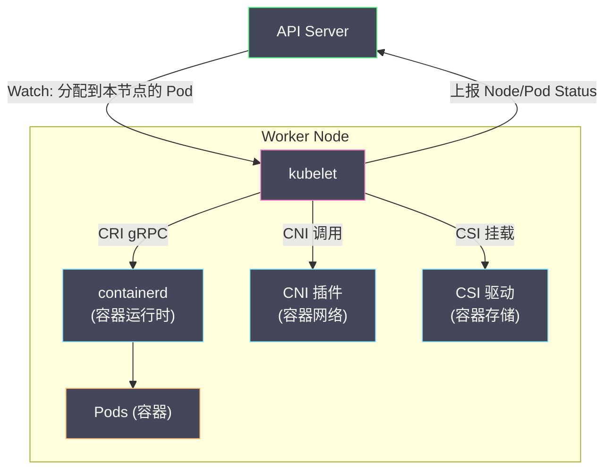
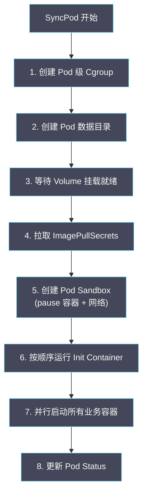
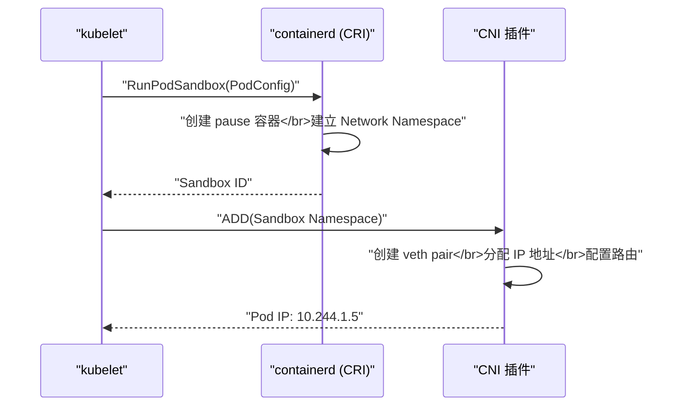

# 01 kubelet 与 Pod 的创建流程

**摘要：**

在前面的专栏中，我们追踪了一个 Pod 从用户提交到被 [[05 Scheduler 调度流程与算法|Scheduler]] 分配节点的全过程。但 Scheduler 只是在 Pod 对象上设置了 `spec.nodeName`——真正将 Pod "变成"运行中的容器的，是节点上的 **kubelet**。kubelet 是 K8s 数据平面的核心组件——它运行在每个节点上，负责 Pod 的完整生命周期管理：从拉取镜像、创建容器、配置网络和存储，到执行健康检查、上报状态、最终清理资源。本文从 kubelet 的内部架构出发，深入 **SyncPod** 流程的每个步骤——Pod Sandbox（pause 容器）的创建、CRI 接口与 containerd 的交互、Volume 挂载、Init Container 的执行——建立对"Pod 是如何被创建出来的"的完整认知。

---

## 第 1 章 kubelet 的整体架构

### 1.1 kubelet 在 K8s 中的位置

kubelet 是 K8s **数据平面**唯一的核心组件——它是 Master 节点（控制平面）的"手臂"，在每个 Worker 节点上执行控制平面下发的指令。



kubelet 与三个关键接口交互：

- **CRI（Container Runtime Interface）**：与容器运行时（如 [[containerd]]）通信，管理容器的生命周期
- **CNI（Container Network Interface）**：配置 Pod 的网络（创建 [[05 容器网络原理|veth pair]]、分配 IP）
- **CSI（Container Storage Interface）**：挂载 Pod 需要的存储卷（PV）

### 1.2 kubelet 的核心模块

kubelet 内部由多个模块协作完成 Pod 管理：

**Pod 数据源（PodConfig）**：kubelet 从三个来源获取需要管理的 Pod：
- **API Server**：通过 [[05 List-Watch 机制与 Informer 框架|Informer]] Watch 分配到本节点的 Pod（最主要的来源）
- **静态 Pod 目录**：读取节点上 `/etc/kubernetes/manifests/` 目录中的 YAML 文件（用于部署控制平面组件——API Server、Controller Manager、Scheduler 自身就是静态 Pod）
- **HTTP URL**：从指定 URL 拉取 Pod 定义（较少使用）

**PodWorker**：每个 Pod 对应一个 PodWorker goroutine——负责该 Pod 的所有生命周期操作（创建、更新、删除）。PodWorker 是串行的——同一个 Pod 的操作不会并发执行。

**PLEG（Pod Lifecycle Event Generator）**：定期（默认每秒）检查容器运行时中的容器状态，与 kubelet 缓存的状态比较，生成"容器启动/停止/失败"等事件。这些事件触发 PodWorker 重新同步 Pod 状态。

**StatusManager**：将 Pod 和 Node 的状态上报给 API Server。状态更新采用批量和防抖机制——不会每次变化都立即上报。

**VolumeManager**：管理 Pod 的 Volume 挂载和卸载——确保 Pod 需要的 Volume 在容器启动前已经就绪。

**ImageManager**：管理容器镜像的拉取和垃圾回收——定期清理不再使用的旧镜像释放磁盘空间。

**Eviction Manager**：监控节点资源压力（内存、磁盘、PID），当资源不足时按优先级驱逐 Pod。

---

## 第 2 章 Pod 从"被调度"到"开始创建"

### 2.1 kubelet 如何发现新 Pod

Scheduler 将 Pod 的 `spec.nodeName` 设为目标节点后，这个变更通过 Watch 被推送到 kubelet 的 Informer。kubelet 的 PodConfig 将新 Pod 加入"期望 Pod 列表"，与当前节点上实际运行的 Pod 比较——发现一个新 Pod 需要创建。

### 2.2 Admission 检查

kubelet 在开始创建 Pod 之前，先进行本地的 **Admission 检查**——确认节点是否有能力运行该 Pod：

| 检查项 | 说明 |
| :--- | :--- |
| **资源充足性** | 节点上的可用 CPU/Memory 是否满足 Pod 的 requests |
| **节点状态** | 节点是否处于 Ready 状态 |
| **PID 限制** | 节点上的 PID 数量是否超过限制 |
| **节点亲和性** | Pod 的 nodeSelector / nodeAffinity 是否与节点匹配（双重检查）|
| **Taint/Toleration** | Pod 是否容忍节点上的 Taint（双重检查）|

如果 Admission 检查失败，kubelet 拒绝该 Pod——更新 Pod 的 status 为 Failed，附带拒绝原因。这是 Scheduler 决策之外的**最后一道防线**——防止因为调度和实际创建之间的时间差（在这段时间内节点状态可能变化）导致的问题。

### 2.3 PodWorker 接管

Admission 通过后，kubelet 为该 Pod 创建（或复用）一个 PodWorker。PodWorker 是 Pod 级别的串行执行器——它负责该 Pod 后续所有的创建、更新和删除操作。

---

## 第 3 章 SyncPod：Pod 创建的核心流程

### 3.1 SyncPod 的步骤总览

SyncPod 是 kubelet 创建或更新 Pod 的核心函数。一个全新 Pod 的 SyncPod 流程：



### 3.2 步骤 1：创建 Pod 级 Cgroup

kubelet 为每个 Pod 创建一个 [[03 Cgroups 资源限制与控制|Cgroup]] 组——Pod 中所有容器共享这个 Cgroup 的资源限制。Pod 的 `resources.requests` 和 `resources.limits` 被翻译为 Cgroup 参数（CPU shares / CPU quota / Memory limit）。

Cgroup 的层次结构：

```
/sys/fs/cgroup/
└── kubepods/                          # kubelet 管理的所有 Pod
    ├── burstable/                     # QoS 为 Burstable 的 Pod
    │   └── pod<uid>/                  # 特定 Pod 的 Cgroup
    │       ├── <container-id-1>/      # 容器 1 的 Cgroup
    │       └── <container-id-2>/      # 容器 2 的 Cgroup
    ├── besteffort/                    # QoS 为 BestEffort 的 Pod
    └── guaranteed/                    # QoS 为 Guaranteed 的 Pod（在某些 Cgroup 驱动下）
```

### 3.3 步骤 2：创建 Pod 数据目录

kubelet 在节点的文件系统上为 Pod 创建工作目录：

```
/var/lib/kubelet/pods/<pod-uid>/
├── volumes/                     # Volume 挂载点
│   └── kubernetes.io~secret/
│       └── default-token-xxxxx/
├── plugins/                     # CSI 插件挂载点
└── etc-hosts                    # 生成的 /etc/hosts 文件
```

### 3.4 步骤 3：等待 Volume 挂载就绪

如果 Pod 声明了 Volume（如 PVC 引用的持久卷、ConfigMap、Secret），VolumeManager 负责在容器启动之前完成挂载。

**Secret 和 ConfigMap**：kubelet 从 API Server 获取 Secret/ConfigMap 的内容，写入 Pod 数据目录中的临时文件系统（tmpfs）。

**PVC（持久卷）**：VolumeManager 调用 CSI 驱动完成：
1. **Attach**：将云磁盘（如 AWS EBS、GCE PD）挂载到节点
2. **Mount**：将块设备格式化（如 ext4）并挂载到 Pod 的 Volume 目录

Volume 挂载可能需要几秒到几十秒（取决于存储后端）——在此期间 Pod 处于 Pending 状态。

### 3.5 步骤 4：拉取 ImagePullSecrets

如果 Pod 需要从私有镜像仓库拉取镜像，kubelet 从 Pod 引用的 ImagePullSecrets（或 ServiceAccount 绑定的 Secret）中获取认证信息。

### 3.6 步骤 5：创建 Pod Sandbox

**Pod Sandbox** 是 Pod 中所有容器共享的基础设施层——它持有 Pod 的 [[02 Linux Namespace 深度解析|Network Namespace]]。在 containerd 的实现中，Pod Sandbox 就是那个著名的 **pause 容器**。

**pause 容器的作用**：

pause 是一个极其简单的容器——它的进程只做一件事：`pause()` 系统调用（永久挂起，不做任何事）。它的存在不是为了运行应用，而是为了**持有 Network Namespace**。

为什么需要 pause 容器？Pod 中的多个容器需要共享同一个网络栈（同一个 IP 地址、同一组端口、同一个 localhost）。如果让业务容器持有 Network Namespace，当该容器重启时 Namespace 会被销毁重建——Pod 的 IP 地址会变化，其他容器的网络也会中断。pause 容器作为"命名空间持有者"——它永远不重启（除非整个 Pod 被重建），业务容器共享它的 Network Namespace。

**创建流程**：

1. kubelet 通过 **CRI** 调用 containerd 的 `RunPodSandbox` API
2. containerd 创建 pause 容器——建立 Network Namespace、IPC Namespace、PID Namespace（如果 `shareProcessNamespace: true`）
3. kubelet 调用 **CNI** 插件为 Pod Sandbox 配置网络——创建 [[05 容器网络原理|veth pair]]、分配 Pod IP 地址、配置路由规则
4. Pod 的 IP 地址确定



### 3.7 步骤 6：运行 Init Container

Init Container 在业务容器之前运行——用于执行初始化操作（如等待数据库就绪、下载配置文件、执行数据库迁移）。

Init Container 的执行规则：
- **严格串行**：按定义顺序逐一执行，前一个成功后才启动下一个
- **必须成功**：如果任何 Init Container 失败（退出码非 0），kubelet 按 `restartPolicy` 重试（通常是重新运行失败的 Init Container）
- **运行至完成**：Init Container 不是长期运行的——它执行完任务后退出，不会一直运行

```yaml
spec:
  initContainers:
    - name: wait-for-db
      image: busybox
      command: ['sh', '-c', 'until nslookup mysql; do echo waiting; sleep 2; done']
    - name: init-schema
      image: my-app:v1
      command: ['migrate', '--source', '/migrations']
  containers:
    - name: app
      image: my-app:v1
```

执行顺序：`wait-for-db` 成功 → `init-schema` 成功 → 启动 `app` 容器。

### 3.8 步骤 7：启动业务容器

所有 Init Container 成功后，kubelet **并行**启动所有业务容器。每个容器的启动流程：

1. **拉取镜像**：根据 `imagePullPolicy`（Always / IfNotPresent / Never）决定是否拉取
2. **创建容器**：通过 CRI 调用 containerd 创建容器——容器共享 Pod Sandbox 的 Network Namespace
3. **启动容器**：执行容器的 `command`（或镜像的 ENTRYPOINT）
4. **执行 postStart Hook**：如果配置了 `lifecycle.postStart`，在容器启动后立即执行（见 [[02 Pod 生命周期深度解析]]）

> [!info] 镜像拉取策略
> - **Always**：每次创建容器都拉取镜像（适用于 `latest` 标签——同名标签可能对应不同镜像）
> - **IfNotPresent**（默认）：本地有镜像则不拉取（适用于带版本号的标签如 `nginx:1.25`）
> - **Never**：从不拉取，本地没有则失败（适用于预加载镜像的场景）
>
> **生产环境应避免使用 `latest` 标签**——它使得部署不可重复（同名标签对应的镜像可能随时变化），且 `Always` 拉取策略增加了启动延迟和对镜像仓库的依赖。

### 3.9 步骤 8：更新 Pod Status

所有容器启动后，kubelet 通过 StatusManager 将 Pod 的最新状态上报给 API Server：

- `status.phase`: Running
- `status.podIP`: 10.244.1.5
- `status.containerStatuses`: 每个容器的状态（Waiting/Running/Terminated）
- `status.conditions`: PodScheduled=True, Initialized=True, ContainersReady=True, Ready=True

---

## 第 4 章 CRI：容器运行时接口

### 4.1 为什么需要 CRI

早期的 K8s 直接调用 Docker API 管理容器——kubelet 中硬编码了 Docker 的调用逻辑。随着其他容器运行时（containerd、CRI-O）的出现，K8s 需要一种**标准化的接口**来与任意容器运行时交互——这就是 CRI。

CRI 是一套 **gRPC 接口**，定义了两类操作：

**ImageService**：镜像管理——拉取、列出、删除镜像

**RuntimeService**：容器运行时管理——创建/启动/停止/删除 Pod Sandbox 和容器

### 4.2 核心 CRI 接口

| 接口 | 说明 |
| :--- | :--- |
| `RunPodSandbox` | 创建 Pod Sandbox（pause 容器 + Namespace）|
| `StopPodSandbox` | 停止 Pod Sandbox |
| `RemovePodSandbox` | 删除 Pod Sandbox |
| `CreateContainer` | 在 Sandbox 中创建容器 |
| `StartContainer` | 启动容器 |
| `StopContainer` | 停止容器 |
| `RemoveContainer` | 删除容器 |
| `ContainerStatus` | 查询容器状态 |
| `ListContainers` | 列出所有容器 |
| `PullImage` | 拉取镜像 |

kubelet 通过 Unix Socket（如 `/run/containerd/containerd.sock`）与容器运行时通信。

### 4.3 containerd 与 runc

**containerd** 是目前最广泛使用的 CRI 兼容运行时。它接收 kubelet 的 CRI 请求，转换为对底层 OCI 运行时（如 [[01 容器的本质——从进程隔离到 OCI 标准|runc]]）的调用：

```
kubelet → (CRI gRPC) → containerd → (OCI) → runc → 创建容器进程
```

containerd 负责镜像管理（拉取、解压、存储）和容器的高级生命周期管理；runc 负责实际的容器进程创建（clone + Namespace + Cgroups）。

---

## 第 5 章 PLEG：容器状态感知

### 5.1 PLEG 的作用

**PLEG（Pod Lifecycle Event Generator）** 是 kubelet 中负责感知容器实际状态的模块。kubelet 不依赖容器运行时的事件推送——而是通过 PLEG **主动轮询**容器状态。

PLEG 的工作循环（默认每秒执行一次）：

1. 调用 CRI 的 `ListContainers` 和 `ListPodSandbox` 获取所有容器的当前状态
2. 与上一次轮询的状态比较
3. 生成差异事件（ContainerStarted / ContainerDied / ContainerRemoved 等）
4. 将事件推送到 kubelet 的事件通道，触发 PodWorker 重新同步 Pod 状态

### 5.2 PLEG 的性能问题

在节点上运行大量 Pod（如 100+）时，PLEG 的每秒轮询可能变慢——因为 `ListContainers` 需要遍历所有容器。如果 PLEG 的一个轮询周期超过 3 分钟，kubelet 认为 PLEG 不健康——Node 的 `Ready` Condition 变为 `False`，Node Controller 可能会驱逐该节点上的 Pod。

**PLEG is not healthy** 是 K8s 运维中常见的问题——通常由以下原因导致：
- 节点上 Pod/容器数量过多
- 容器运行时响应慢（containerd 卡顿）
- 节点磁盘 I/O 高导致容器状态查询慢

K8s 1.26+ 引入了 **Evented PLEG**——基于 CRI 的事件流（而非轮询）感知容器状态变化，大幅降低了 PLEG 的开销。

---

## 第 6 章 静态 Pod

### 6.1 什么是静态 Pod

**静态 Pod** 是由 kubelet 直接管理（而非通过 API Server）的 Pod。kubelet 监控节点上的一个目录（默认 `/etc/kubernetes/manifests/`），该目录中的 YAML 文件会被 kubelet 自动创建为 Pod。

静态 Pod 的典型用途是部署 K8s 控制平面组件本身——在 kubeadm 部署的集群中，API Server、Controller Manager、Scheduler 和 etcd 都是静态 Pod：

```
/etc/kubernetes/manifests/
├── kube-apiserver.yaml
├── kube-controller-manager.yaml
├── kube-scheduler.yaml
└── etcd.yaml
```

### 6.2 静态 Pod 的特殊行为

- kubelet 在 API Server 中创建一个**镜像 Pod（Mirror Pod）**——一个只读的 Pod 对象，用于在 `kubectl get pods` 中显示静态 Pod 的状态
- 静态 Pod 不受 Deployment、ReplicaSet 等控制器管理——删除镜像 Pod 不会影响实际运行的容器
- 删除静态 Pod 只能通过移除节点上的 YAML 文件

### 6.3 为什么控制平面用静态 Pod

这是一个"鸡生蛋"的问题——API Server 还没启动时，无法通过 API Server 创建 Pod。kubelet 的静态 Pod 机制解决了这个自举问题——kubelet 不依赖 API Server 就能创建 Pod，因此可以用来启动 API Server 本身。

---

## 第 7 章 总结

本文建立了对 kubelet 和 Pod 创建流程的完整认知：

- **kubelet 架构**：PodConfig（多来源 Pod 发现）、PodWorker（串行执行器）、PLEG（状态感知）、VolumeManager、ImageManager、StatusManager
- **SyncPod 流程**：创建 Cgroup → 创建数据目录 → 挂载 Volume → 创建 Pod Sandbox（pause 容器 + CNI 网络）→ 运行 Init Container → 启动业务容器 → 更新 Status
- **Pod Sandbox**：pause 容器持有 Network Namespace，业务容器共享——解决了容器重启导致网络中断的问题
- **CRI**：标准化的容器运行时接口，kubelet 通过 gRPC 与 containerd 交互
- **PLEG**：主动轮询容器状态，生成生命周期事件。Evented PLEG 是性能优化方向
- **静态 Pod**：kubelet 直接管理的 Pod，用于自举控制平面组件

下一篇 [[02 Pod 生命周期深度解析]] 将深入 Pod 的状态机——Phase、Container State、Restart Policy 如何协作定义 Pod 的完整生命周期。

---

## 参考资料

1. Kubernetes Documentation - kubelet：https://kubernetes.io/docs/reference/command-line-tools-reference/kubelet/
2. Kubernetes Documentation - Pod Lifecycle：https://kubernetes.io/docs/concepts/workloads/pods/pod-lifecycle/
3. Kubernetes Documentation - Container Runtime Interface：https://kubernetes.io/docs/concepts/architecture/cri/
4. Kubernetes Source Code - pkg/kubelet：https://github.com/kubernetes/kubernetes/tree/master/pkg/kubelet
5. Kubernetes Enhancement Proposal - Evented PLEG：https://github.com/kubernetes/enhancements/tree/master/keps/sig-node/3386-kubelet-evented-pleg
6. Ian Lewis (2017). *The Almighty Pause Container*. https://www.ianlewis.org/en/almighty-pause-container

---

> [!note] 思考题
> 1. Init Container 在主容器之前按顺序执行——用于初始化工作（如等待依赖服务就绪、下载配置文件、修改文件系统权限）。Init Container 共享 Volume 但不共享网络 Namespace（在 Kubernetes 1.28+ 可以共享）。在什么场景下你需要 Init Container 而非在主容器的启动脚本中完成初始化？
> 2. PreStop Hook 在容器被终止前执行——典型用途是优雅关闭（如停止接受新请求、完成正在处理的请求）。但 PreStop 有超时限制（`terminationGracePeriodSeconds` 默认 30 秒）——超时后容器被 SIGKILL 强制杀死。在需要 60 秒以上优雅关闭的场景中（如处理长连接、完成大事务），你如何调整？
> 3. Pod 的终止流程：1) Pod 被标记为 Terminating → 2) PreStop Hook 执行 → 3) SIGTERM 发送给容器 → 4) 等待 `terminationGracePeriodSeconds` → 5) SIGKILL。但同时 Endpoints Controller 从 Service 中移除 Pod IP——这个操作与步骤 1 是并行的。如果 Service 的移除比 Pod 终止慢——正在终止的 Pod 仍然收到新请求。你如何通过 PreStop Hook 中的 `sleep 5` 来等待 Endpoints 更新？
