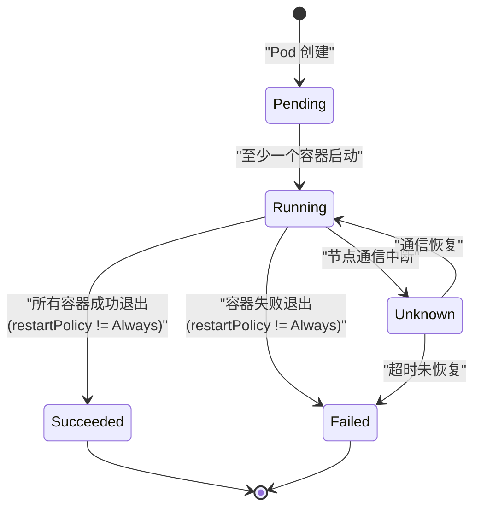
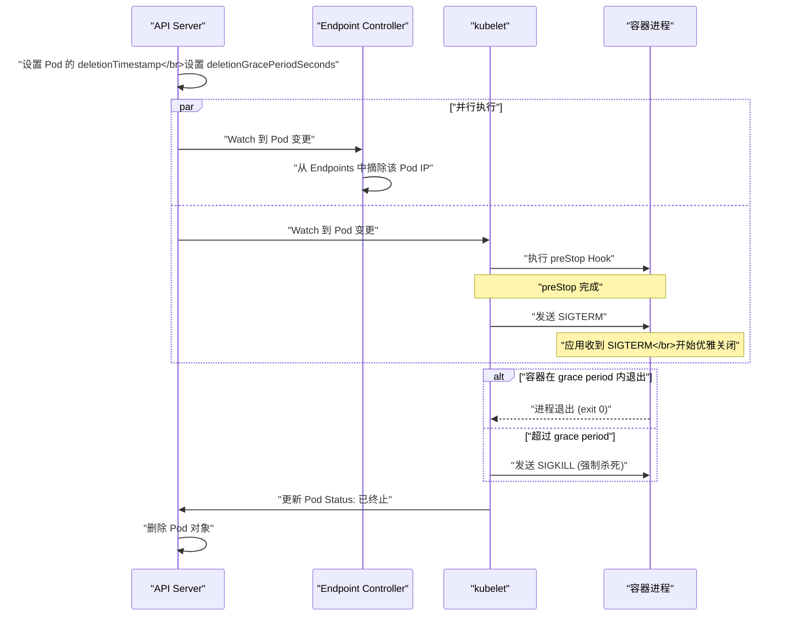

# 02 Pod 生命周期深度解析

**摘要：**

[[01 kubelet 与 Pod 的创建流程|上一篇]]追踪了 Pod 从"被调度"到"容器启动"的创建流程。本文聚焦 Pod 从创建到终止的**完整生命周期状态机**——Pod 的五种 Phase（Pending / Running / Succeeded / Failed / Unknown）、容器的三种状态（Waiting / Running / Terminated）、Pod Conditions 的含义、Init Container 的执行语义、Lifecycle Hook（postStart / preStop）的执行时序、restartPolicy 的三种策略如何影响容器重启行为，以及 QoS Class 如何决定 Pod 在资源压力下的存活优先级。理解这些概念是排查 Pod 异常（CrashLoopBackOff、ImagePullBackOff、Pending）的基础。

---

## 第 1 章 Pod Phase

### 1.1 五种 Phase

Pod 的 `status.phase` 反映 Pod 的宏观生命周期阶段：

| Phase | 含义 | 典型原因 |
| :--- | :--- | :--- |
| **Pending** | Pod 已被 API Server 接受，但尚未在节点上运行 | 等待调度、等待镜像拉取、等待 Volume 挂载 |
| **Running** | Pod 已绑定到节点，至少一个容器正在运行 | 正常运行 |
| **Succeeded** | Pod 中所有容器都已成功终止（退出码 0），且不会重启 | Job 完成 |
| **Failed** | Pod 中至少一个容器以非零退出码终止，且不会重启 | 应用崩溃（restartPolicy=Never）|
| **Unknown** | 无法获取 Pod 状态 | 与节点的通信中断 |

**Phase 是只读的**——由 kubelet 根据容器的实际状态计算得出，用户无法直接修改。

### 1.2 Phase 的状态转换



**关键点**：

- Pod 的 Phase 是 **Running** 只要至少一个容器在运行——即使有其他容器已经崩溃。这意味着 Phase=Running 不等于"Pod 健康"。
- **Succeeded** 和 **Failed** 是终态——一旦进入这两个状态，Pod 不会再变化（除非被删除）。
- 对于 `restartPolicy: Always`（Deployment 的默认值）的 Pod，容器崩溃后会自动重启——Phase 不会变为 Failed，而是保持 Running（因为 kubelet 会重新启动容器）。

### 1.3 Pending 的常见原因

Pending 是开发者最常遇到的"问题状态"——Pod 卡在 Pending 意味着它还没有开始运行。需要通过 `kubectl describe pod` 查看 Events 定位原因：

| 原因 | Events 中的提示 | 解决方法 |
| :--- | :--- | :--- |
| **未调度** | `FailedScheduling: 0/N nodes are available` | 检查节点资源、Taint/Toleration、NodeAffinity |
| **镜像拉取失败** | `Failed to pull image / ImagePullBackOff` | 检查镜像名称、仓库地址、ImagePullSecret |
| **Volume 未就绪** | `AttachVolume.Attach failed / WaitForAttach` | 检查 PVC 状态、StorageClass、CSI 驱动 |
| **资源不足** | `Insufficient cpu / memory` | 调整 Pod 的 requests 或扩容集群 |
| **配额超限** | `exceeded quota` | 调整 [[04 准入控制器深度解析|ResourceQuota]] |

---

## 第 2 章 容器状态

### 2.1 三种容器状态

Pod 的 `status.containerStatuses` 记录了每个容器的状态：

**Waiting**：容器未运行。原因可能是正在拉取镜像（`ContainerCreating`）、等待前置容器完成（Init Container 未完成）、或上一次崩溃后的退避等待（`CrashLoopBackOff`）。

**Running**：容器进程正在运行。包含 `startedAt` 时间戳。

**Terminated**：容器进程已退出。包含 `exitCode`（退出码）、`reason`（如 `Completed`、`Error`、`OOMKilled`）、`startedAt` 和 `finishedAt`。

### 2.2 CrashLoopBackOff

**CrashLoopBackOff** 是 Waiting 状态的一种 reason——表示容器反复崩溃并进入退避等待。这是 K8s 运维中最常见的错误状态。

当容器以非零退出码退出时（且 `restartPolicy` 允许重启），kubelet 会重启容器。但如果容器持续崩溃，kubelet 采用**指数退避**策略延迟重启：

```
第 1 次崩溃: 立即重启
第 2 次崩溃: 等待 10 秒
第 3 次崩溃: 等待 20 秒
第 4 次崩溃: 等待 40 秒
第 5 次崩溃: 等待 80 秒
...
最大等待: 300 秒 (5 分钟)
```

在等待期间，容器状态为 `Waiting: CrashLoopBackOff`。如果容器成功运行超过 10 分钟，退避计数器重置。

**排查步骤**：
1. `kubectl logs <pod> --previous`：查看上一次崩溃前的日志
2. `kubectl describe pod <pod>`：查看 Events 和容器的 `lastState.terminated.exitCode`
3. 常见原因：应用配置错误、依赖服务不可用、内存不足（OOM）、权限问题

### 2.3 OOMKilled

当容器使用的内存超过 `resources.limits.memory` 时，[[03 Cgroups 资源限制与控制|Cgroup 的 OOM Killer]] 会杀死容器进程。容器的终止原因为 `OOMKilled`（exitCode=137）。

```bash
kubectl describe pod my-app
# Containers:
#   app:
#     State:       Waiting
#       Reason:    CrashLoopBackOff
#     Last State:  Terminated
#       Reason:    OOMKilled
#       Exit Code: 137
```

解决方法：增加 `resources.limits.memory`，或排查应用的内存泄漏。

---

## 第 3 章 Pod Conditions

### 3.1 四个核心 Condition

Pod 的 `status.conditions` 提供了比 Phase 更细粒度的状态信息：

| Condition | 含义 | 何时为 True |
| :--- | :--- | :--- |
| **PodScheduled** | Pod 已被调度到节点 | Scheduler 设置了 nodeName |
| **Initialized** | 所有 Init Container 已成功完成 | Init Container 全部退出码 0 |
| **ContainersReady** | 所有业务容器已通过 readinessProbe | 所有容器的 readiness 检查通过 |
| **Ready** | Pod 可以接收流量 | ContainersReady=True 且所有 ReadinessGate 通过 |

**Ready Condition 是 Service 路由流量的依据**——只有 Ready=True 的 Pod 才会被加入 Service 的 Endpoints 列表。这是"[[03 健康检查与就绪探针|就绪探针]]"发挥作用的地方。

### 3.2 ReadinessGate

**ReadinessGate** 允许用户在 Pod Spec 中定义额外的 Condition——Pod 必须同时满足所有 ReadinessGate 才能变为 Ready。这用于需要外部系统确认 Pod 就绪的场景（如负载均衡器完成注册后才允许流量进入）。

```yaml
spec:
  readinessGates:
    - conditionType: "target-health.alb.ingress.k8s.aws/my-target-group"
```

---

## 第 4 章 Init Container

### 4.1 与业务容器的区别

| 维度 | Init Container | 业务容器 |
| :--- | :--- | :--- |
| **执行时机** | 业务容器启动前 | Init Container 全部完成后 |
| **执行方式** | 串行（逐一执行）| 并行（同时启动）|
| **生命周期** | 运行至完成后退出 | 持续运行（或按 restartPolicy 重启）|
| **探针** | 不支持 liveness/readiness/startup Probe | 支持 |
| **资源计算** | 取所有 Init Container 中的最大值 | 取所有业务容器的总和 |

### 4.2 资源计算的特殊规则

Pod 的有效资源请求（effective requests）是以下两者的**最大值**：

```
effective = max(
    sum(所有业务容器的 requests),    // 业务容器同时运行
    max(所有 Init Container 的 requests)  // Init Container 串行运行
)
```

因为 Init Container 串行执行且在业务容器启动前已退出——同一时刻最多只有一个 Init Container 在运行。所以取最大值（而非总和）。

### 4.3 典型用例

**等待依赖就绪**：

```yaml
initContainers:
  - name: wait-for-db
    image: busybox:1.36
    command: ['sh', '-c', 'until nslookup mysql.default.svc.cluster.local; do sleep 2; done']
```

**下载配置或数据**：

```yaml
initContainers:
  - name: download-config
    image: busybox:1.36
    command: ['wget', '-O', '/config/app.conf', 'https://config-server/app.conf']
    volumeMounts:
      - name: config
        mountPath: /config
```

**设置文件权限**：某些应用（如 Elasticsearch）要求特定的文件系统权限。Init Container 以 root 运行设置权限，业务容器以非 root 运行：

```yaml
initContainers:
  - name: fix-permissions
    image: busybox:1.36
    command: ['sh', '-c', 'chown -R 1000:1000 /data']
    securityContext:
      runAsUser: 0
    volumeMounts:
      - name: data
        mountPath: /data
```

### 4.4 Sidecar Container（K8s 1.28+）

K8s 1.28 引入了 **Sidecar Container** 的原生支持——通过在 Init Container 上设置 `restartPolicy: Always`，使其在业务容器运行期间持续运行（而不是执行完就退出）。

```yaml
initContainers:
  - name: log-collector
    image: fluentbit:2.1
    restartPolicy: Always    # Sidecar：在业务容器运行期间持续运行
```

Sidecar Container 的启动顺序在普通 Init Container 之后、业务容器之前——且在 Pod 终止时最后被停止。这解决了之前 Sidecar 模式的痛点：将日志收集器、代理等辅助容器放在 `containers` 中时，它们可能在业务容器之前退出导致日志丢失或网络中断。

---

## 第 5 章 Lifecycle Hook

### 5.1 postStart Hook

**postStart** 在容器启动后**立即**执行——但"立即"不意味着在容器的 ENTRYPOINT 之后。postStart 和 ENTRYPOINT 是**并行执行**的——postStart 不保证在 ENTRYPOINT 之前或之后执行。

```yaml
lifecycle:
  postStart:
    exec:
      command: ["/bin/sh", "-c", "echo 'Container started' >> /var/log/lifecycle.log"]
```

**执行语义**：
- postStart 与容器的 ENTRYPOINT 并行执行
- 如果 postStart 失败（退出码非 0），容器会被杀死并根据 restartPolicy 重启
- postStart 执行期间，容器的状态为 Waiting（不是 Running）——Pod 不会变为 Ready
- postStart 没有超时控制——如果 Hook 挂起，容器会一直处于 Waiting 状态

> [!warning] postStart 的陷阱
> 由于 postStart 和 ENTRYPOINT 并行执行，**不要在 postStart 中做依赖 ENTRYPOINT 已完成的操作**（如等待应用端口开放后注册服务）。正确的做法是使用 readinessProbe 检测应用是否就绪。

### 5.2 preStop Hook

**preStop** 在容器被终止**之前**执行——给应用一个机会执行清理操作（如注销服务注册、完成正在处理的请求、关闭数据库连接）。

```yaml
lifecycle:
  preStop:
    exec:
      command: ["/bin/sh", "-c", "nginx -s quit"]
```

或使用 HTTP 调用：

```yaml
lifecycle:
  preStop:
    httpGet:
      path: /shutdown
      port: 8080
```

**执行时序**（容器终止的完整流程）：

```
1. kubelet 收到删除 Pod 的指令
2. 执行 preStop Hook（如果配置了）
3. preStop 完成后（或超时），发送 SIGTERM 给容器进程
4. 等待容器退出（最多 terminationGracePeriodSeconds 秒）
5. 如果容器在 grace period 内没有退出，发送 SIGKILL 强制杀死
```

> [!info] preStop 与 terminationGracePeriodSeconds 共享时间
> preStop Hook 的执行时间**包含在** `terminationGracePeriodSeconds`（默认 30 秒）内。如果 preStop 执行了 25 秒，容器进程只剩 5 秒响应 SIGTERM。如果 preStop 执行超过 grace period，容器会被直接 SIGKILL。因此需要确保 preStop + 应用优雅关闭时间 < terminationGracePeriodSeconds。

---

## 第 6 章 restartPolicy

### 6.1 三种策略

`spec.restartPolicy` 定义了 Pod 中容器退出后的重启行为：

| 策略 | 行为 | 适用场景 |
| :--- | :--- | :--- |
| **Always**（默认）| 容器退出后总是重启（无论退出码）| Deployment / StatefulSet / DaemonSet |
| **OnFailure** | 只有容器以非零退出码退出时才重启 | Job（失败重试，成功不重启）|
| **Never** | 从不重启 | Job（一次性执行，失败也不重启）|

**restartPolicy 应用于 Pod 中的所有容器**——不能为不同容器设置不同的策略。

### 6.2 restartPolicy 对 Phase 的影响

| restartPolicy | 容器成功退出 | 容器失败退出 |
| :--- | :--- | :--- |
| **Always** | 重启容器，Phase 保持 Running | 重启容器，Phase 保持 Running |
| **OnFailure** | 不重启，所有容器成功 → Phase=Succeeded | 重启容器，Phase 保持 Running |
| **Never** | 不重启，所有容器成功 → Phase=Succeeded | 不重启，Phase=Failed |

这就解释了为什么 Deployment 的 Pod（restartPolicy=Always）几乎永远不会进入 Succeeded 或 Failed Phase——容器总是被重启。

### 6.3 与 Job 的关系

Job 的 Pod 通常使用 `OnFailure` 或 `Never`：

- **OnFailure**：任务失败自动重试（在同一个 Pod 中重启容器）。适用于任务需要保留本地状态的场景。
- **Never**：任务失败后 [[04 DaemonSet Job CronJob 控制器解析|Job Controller]] 创建新 Pod 重试（在可能不同的节点上）。适用于任务不依赖本地状态的场景。

---

## 第 7 章 QoS Class

### 7.1 三种 QoS 等级

K8s 根据 Pod 的资源配置自动为其分配 **QoS Class（Quality of Service 等级）**——决定了在节点资源压力下 Pod 被驱逐的优先级。

| QoS Class | 条件 | 驱逐优先级 |
| :--- | :--- | :--- |
| **Guaranteed** | 所有容器都设置了 requests 和 limits，且 requests = limits | 最后被驱逐 |
| **Burstable** | 至少一个容器设置了 requests 或 limits，但不满足 Guaranteed 条件 | 中等 |
| **BestEffort** | 所有容器都没有设置 requests 和 limits | 最先被驱逐 |

**Guaranteed 示例**：

```yaml
resources:
  requests:
    cpu: "500m"
    memory: "256Mi"
  limits:
    cpu: "500m"       # requests = limits
    memory: "256Mi"   # requests = limits
```

**BestEffort 示例**：

```yaml
# 完全没有 resources 配置
containers:
  - name: app
    image: my-app:v1
```

### 7.2 QoS 与 OOM Score

kubelet 根据 QoS Class 设置容器的 OOM Score Adjustment——Linux 内核在内存不足时按 OOM Score 决定杀死哪个进程：

| QoS Class | OOM Score Adj | 被 OOM Kill 的可能性 |
| :--- | :--- | :--- |
| **Guaranteed** | -997 | 极低（几乎不会被杀）|
| **Burstable** | 2-999（根据内存使用率计算）| 中等 |
| **BestEffort** | 1000 | 最高（最先被杀）|

### 7.3 生产建议

- **关键服务**（数据库、支付系统）：使用 Guaranteed QoS（requests = limits）——确保资源预留和驱逐保护
- **一般服务**（Web 应用、API 服务）：使用 Burstable QoS（设置 requests，limits 可以略大）——允许突发使用空闲资源
- **批处理任务**：可以使用 BestEffort（不设置 resources）——充分利用空闲资源，但接受被驱逐的风险

> [!warning] 避免 BestEffort 用于重要服务
> BestEffort Pod 在资源压力下最先被驱逐——如果重要服务使用 BestEffort QoS，可能在节点内存紧张时被意外杀死。生产环境的所有服务至少应设置 `resources.requests`。

---

## 第 8 章 Pod 终止流程

### 8.1 完整的终止时序

当 Pod 被删除时（用户 `kubectl delete` 或控制器缩容），kubelet 执行以下步骤：



### 8.2 关键的竞态问题

注意上图中的**并行执行**——kubelet 开始终止 Pod 和 Endpoint Controller 摘除 Pod IP 是**同时发生**的。这意味着：

**在 kubelet 发送 SIGTERM 时，Endpoint Controller 可能还没有完成 Pod IP 的摘除**——kube-proxy 还没有更新 iptables 规则——流量仍然会被路由到正在关闭的 Pod。

这是滚动更新期间出现 **502 错误**的根本原因——Pod 正在处理 SIGTERM 关闭进程，但 Service 仍然向它发送请求。解决方案在 [[04 优雅停机与滚动更新的零停机]] 中详细讨论。

---

## 第 9 章 总结

本文系统梳理了 Pod 生命周期的完整状态机：

- **Pod Phase**：Pending → Running → Succeeded/Failed/Unknown，Phase=Running 不等于健康
- **容器状态**：Waiting / Running / Terminated，CrashLoopBackOff 是指数退避重启
- **Pod Conditions**：PodScheduled → Initialized → ContainersReady → Ready，Ready 决定是否接收流量
- **Init Container**：串行执行、运行至完成、资源取最大值；K8s 1.28 Sidecar Container（restartPolicy: Always）
- **Lifecycle Hook**：postStart 与 ENTRYPOINT 并行、preStop 在 SIGTERM 之前执行，共享 terminationGracePeriodSeconds
- **restartPolicy**：Always（永远重启）/ OnFailure（失败重启）/ Never（不重启）
- **QoS Class**：Guaranteed > Burstable > BestEffort，决定驱逐和 OOM Kill 优先级
- **终止流程**：preStop → SIGTERM → grace period → SIGKILL，注意 Endpoint 摘除的竞态

下一篇 [[03 健康检查与就绪探针]] 将深入 Liveness / Readiness / Startup Probe 的工作机制和配置策略。

---

## 参考资料

1. Kubernetes Documentation - Pod Lifecycle：https://kubernetes.io/docs/concepts/workloads/pods/pod-lifecycle/
2. Kubernetes Documentation - Container Lifecycle Hooks：https://kubernetes.io/docs/concepts/containers/container-lifecycle-hooks/
3. Kubernetes Documentation - Init Containers：https://kubernetes.io/docs/concepts/workloads/pods/init-containers/
4. Kubernetes Documentation - Resource QoS：https://kubernetes.io/docs/tasks/configure-pod-container/quality-service-pod/
5. Kubernetes Enhancement Proposal - Sidecar Containers：https://github.com/kubernetes/enhancements/tree/master/keps/sig-node/753-sidecar-containers
6. Kubernetes Source Code - pkg/kubelet/kuberuntime：https://github.com/kubernetes/kubernetes/tree/master/pkg/kubelet/kuberuntime
