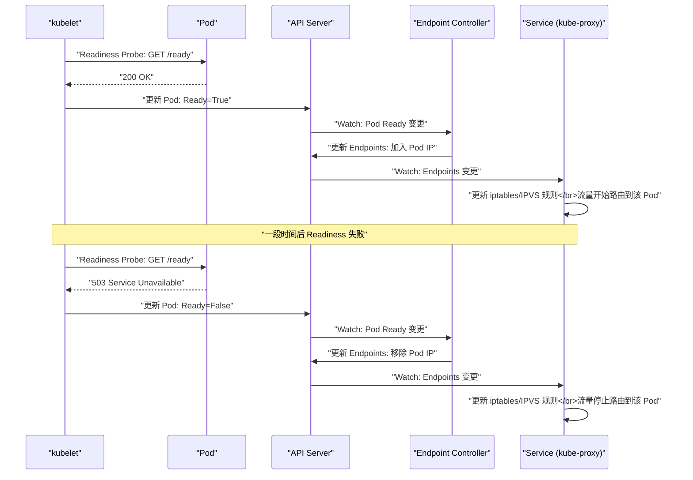

# 03 健康检查与就绪探针

**摘要：**

容器进程在运行并不代表应用在正常服务——进程可能陷入死锁、内存泄漏后响应变慢、或者启动后需要较长时间加载数据才能真正接受请求。K8s 通过三种**探针（Probe）** 机制让 kubelet 感知容器内应用的真实健康状态：**Liveness Probe**（存活探针——应用是否还活着）、**Readiness Probe**（就绪探针——应用是否准备好接收流量）、**Startup Probe**（启动探针——应用是否已完成启动）。三种探针的语义完全不同，混淆或配置不当是生产环境中最常见的"自找麻烦"——错误的 Liveness Probe 会导致 kubelet 反复杀死健康的容器，缺失的 Readiness Probe 会导致流量被路由到未就绪的 Pod。本文从三种探针的语义差异出发，详细分析探针的三种实现方式（HTTP / TCP / Exec）、关键参数的调优策略，以及探针配置不当导致的典型生产事故。

---

## 第 1 章 三种探针的语义

### 1.1 Liveness Probe：应用是否还活着

**语义**：检测容器内的应用是否处于**正常运行**状态。如果 Liveness Probe 连续失败超过阈值，kubelet 认为应用"死了"——**杀死容器并重启**。

**设计目的**：处理应用进入**不可恢复**的异常状态——例如死锁（所有线程被阻塞，无法处理请求）、内存泄漏导致进程假死（进程存在但无法响应）。这些情况下，进程本身不会自动退出（退出码为 0 或非 0），但已经无法正常工作。Liveness Probe 提供了一种"外部力量"来检测并重启这些"僵尸"进程。

**如果不配置 Liveness Probe**：kubelet 只能通过进程是否存在来判断容器是否健康——只要进程没退出，就认为容器正常。死锁的应用进程仍然存在，kubelet 不会重启它——Service 继续向一个"活着但不工作"的容器发送请求。

### 1.2 Readiness Probe：应用是否准备好接收流量

**语义**：检测容器内的应用是否**准备好接收网络流量**。Readiness Probe 通过时，Pod 的 Ready Condition 变为 True，Pod 被加入 Service 的 Endpoints 列表——开始接收流量。Readiness Probe 失败时，Pod 被从 Endpoints 中**摘除**——停止接收新流量（但已有的连接不受影响）。

**设计目的**：处理应用**暂时无法服务**的场景——例如：
- 应用启动后正在加载大型缓存或预热数据（需要 30 秒），期间无法处理请求
- 应用依赖的后端服务（数据库）暂时不可用，应用选择拒绝新请求而非返回错误
- 滚动更新期间，新 Pod 刚启动还没初始化完成

**关键区别**：Readiness Probe 失败**不会重启容器**——只是暂停流量路由。当 Probe 再次通过时，Pod 重新加入 Endpoints——流量恢复。

**如果不配置 Readiness Probe**：kubelet 在容器进程启动后立即认为 Pod Ready——Service 立刻将流量路由到该 Pod。如果应用需要 30 秒启动时间，这 30 秒内的所有请求会收到 Connection Refused 或超时——用户看到错误。

### 1.3 Startup Probe：应用是否已完成启动

**语义**：检测容器内的应用是否**完成了启动过程**。Startup Probe 在容器启动后开始执行，在它**成功之前**，Liveness Probe 和 Readiness Probe 都不会启动。Startup Probe 成功后被禁用，Liveness/Readiness Probe 接管。

**设计目的**：处理**启动时间很长**的应用——例如 Java 应用的 JVM 预热需要 60-120 秒，大型 ML 模型的加载需要几分钟。

**为什么不用 Liveness Probe 的 `initialDelaySeconds` 替代？** 假设应用启动需要 30-120 秒（每次不同）：
- 如果 `initialDelaySeconds=30`：应用还没启动完就被 Liveness Probe 判定为失败，kubelet 杀死容器——反复重启
- 如果 `initialDelaySeconds=120`：每次启动都等 120 秒才开始检查——即使应用 30 秒就启动了，也要白等 90 秒。这 90 秒内如果应用死锁，无人发现

Startup Probe 解决了这个矛盾——它提供了一个**灵活的启动窗口**（`failureThreshold × periodSeconds`），在这个窗口内只检查"是否启动完成"，不触发重启。窗口内任何时刻 Probe 成功，立即切换到 Liveness/Readiness Probe——不浪费时间。

### 1.4 三种探针的对比

| 维度 | Liveness Probe | Readiness Probe | Startup Probe |
| :--- | :--- | :--- | :--- |
| **回答的问题** | 应用是否还活着？ | 应用是否能接收流量？ | 应用是否已启动完成？ |
| **失败后的动作** | 杀死容器并重启 | 从 Endpoints 摘除（不重启）| 杀死容器并重启 |
| **成功后的效果** | 无（保持运行）| 加入 Endpoints 接收流量 | 禁用自身，启动 Liveness/Readiness |
| **执行时机** | Startup Probe 成功后 | Startup Probe 成功后 | 容器启动后立即开始 |
| **生命周期** | 持续执行直到容器终止 | 持续执行直到容器终止 | 成功一次后禁用 |

---

## 第 2 章 探针的三种实现方式

### 2.1 HTTP GET

kubelet 向容器内的指定端口和路径发送 HTTP GET 请求。响应状态码在 200-399 范围内视为成功，其他视为失败。

```yaml
livenessProbe:
  httpGet:
    path: /healthz
    port: 8080
    httpHeaders:            # 可选：自定义 HTTP Header
      - name: X-Custom-Header
        value: probe
  initialDelaySeconds: 5
  periodSeconds: 10
  timeoutSeconds: 3
  failureThreshold: 3
  successThreshold: 1
```

**适用场景**：Web 应用、REST API 服务——几乎所有 HTTP 服务都应使用 HTTP GET 探针。

**最佳实践**：
- `/healthz` 端点应是**轻量级**的——不查数据库、不做复杂计算、不依赖外部服务。只检查"应用进程本身是否正常"
- Liveness 的 `/healthz` 应与 Readiness 的端点**分离**——Liveness 只检查"进程活着"，Readiness 可以检查"依赖就绪"

### 2.2 TCP Socket

kubelet 尝试与容器的指定端口建立 TCP 连接。连接成功视为探测成功，连接失败视为探测失败。

```yaml
readinessProbe:
  tcpSocket:
    port: 3306
  initialDelaySeconds: 10
  periodSeconds: 5
```

**适用场景**：不提供 HTTP 接口的服务——如数据库（MySQL 3306）、缓存（Redis 6379）、消息队列（Kafka 9092）。

**局限性**：TCP 连接成功只能说明"端口在监听"——不代表应用真的能处理请求。例如 MySQL 进程启动后端口就开始监听，但数据库初始化可能还需要几分钟。TCP 探针在这种场景下可能给出误判。

### 2.3 Exec

kubelet 在容器内执行指定命令。命令退出码为 0 视为成功，非 0 视为失败。

```yaml
livenessProbe:
  exec:
    command:
      - cat
      - /tmp/healthy
  initialDelaySeconds: 5
  periodSeconds: 5
```

**适用场景**：需要复杂健康检查逻辑的应用——例如检查特定文件是否存在、运行数据库的 ping 命令、检查证书是否过期。

```yaml
# MySQL 的 Liveness Probe
livenessProbe:
  exec:
    command:
      - mysqladmin
      - ping
      - -u
      - root
      - -p$(MYSQL_ROOT_PASSWORD)
```

**注意事项**：Exec 探针在容器内创建一个新进程——如果命令执行时间较长或频繁执行，会消耗容器的 CPU 和 PID 资源。

### 2.4 gRPC（K8s 1.27+）

kubelet 向容器内的 gRPC 服务发送健康检查请求（遵循 gRPC Health Checking Protocol）。

```yaml
livenessProbe:
  grpc:
    port: 50051
    service: "my.service"    # 可选：指定检查的服务名
```

**适用场景**：gRPC 微服务。

---

## 第 3 章 探针参数详解

### 3.1 关键参数

| 参数 | 默认值 | 含义 |
| :--- | :--- | :--- |
| **initialDelaySeconds** | 0 | 容器启动后等待多少秒才开始执行探针 |
| **periodSeconds** | 10 | 探针的执行间隔（秒）|
| **timeoutSeconds** | 1 | 单次探测的超时时间（秒）|
| **failureThreshold** | 3 | 连续失败多少次才判定为不健康 |
| **successThreshold** | 1 | 连续成功多少次才判定为健康（Liveness 和 Startup 只能为 1）|

### 3.2 参数之间的关系

**从开始检查到判定失败的最长时间** = `initialDelaySeconds` + `failureThreshold × periodSeconds`

例如：`initialDelaySeconds=10, periodSeconds=5, failureThreshold=3`
- 10 秒后开始第一次探测
- 如果连续 3 次失败（每 5 秒一次），总共 10 + 15 = 25 秒后判定失败

**Startup Probe 的启动窗口** = `failureThreshold × periodSeconds`

例如：`failureThreshold=30, periodSeconds=10`
- 启动窗口 = 30 × 10 = 300 秒（5 分钟）
- 应用最多有 5 分钟完成启动，期间 Liveness Probe 不工作

### 3.3 参数调优策略

**Liveness Probe**：

```yaml
# 推荐配置
livenessProbe:
  httpGet:
    path: /healthz
    port: 8080
  initialDelaySeconds: 0      # 配合 Startup Probe 使用时可以为 0
  periodSeconds: 10            # 10 秒检查一次（不要太频繁）
  timeoutSeconds: 3            # 允许 3 秒响应时间
  failureThreshold: 3          # 连续 3 次失败才重启（30 秒）
```

**要点**：
- `periodSeconds` 不要太小（如 1 秒）——频繁探测增加应用负担
- `failureThreshold` 不要为 1——单次超时就重启太敏感，可能因为一次 GC 暂停就杀死健康容器
- `timeoutSeconds` 要大于应用 /healthz 端点的正常响应时间

**Readiness Probe**：

```yaml
# 推荐配置
readinessProbe:
  httpGet:
    path: /ready
    port: 8080
  initialDelaySeconds: 0
  periodSeconds: 5             # 比 Liveness 更频繁（更快感知就绪状态变化）
  timeoutSeconds: 3
  failureThreshold: 3
  successThreshold: 1
```

**要点**：
- `periodSeconds` 可以比 Liveness 更小——更快地感知 Pod 就绪/不就绪的切换
- `successThreshold` 可以大于 1——确保应用稳定就绪后再接收流量（避免"刚启动就接流量又马上崩溃"的震荡）

**Startup Probe**：

```yaml
# 推荐配置（启动时间 30-120 秒的 Java 应用）
startupProbe:
  httpGet:
    path: /healthz
    port: 8080
  periodSeconds: 5
  failureThreshold: 30         # 启动窗口 = 5 × 30 = 150 秒
  timeoutSeconds: 3
```

---

## 第 4 章 探针配置不当的生产事故

### 4.1 事故一：Liveness Probe 杀死慢启动应用

**场景**：Java 应用启动需要 60 秒（JVM 预热 + Spring Context 初始化）。Liveness Probe 配置了 `initialDelaySeconds=10, failureThreshold=3, periodSeconds=5`。

**故障过程**：
1. 容器启动 10 秒后，Liveness Probe 开始检查
2. 应用还在初始化，/healthz 无法响应 → 探测失败
3. 连续 3 次失败（10 + 15 = 25 秒），kubelet 杀死容器
4. 容器重启，同样的情况再次发生 → **CrashLoopBackOff**
5. 应用永远无法启动

**修复**：增加 `initialDelaySeconds` 到 90 秒，或使用 Startup Probe（推荐）。

### 4.2 事故二：Liveness Probe 检查外部依赖

**场景**：Liveness Probe 的 /healthz 端点检查了数据库连接——如果数据库不可达，返回 500。

**故障过程**：
1. 数据库进行 5 分钟的计划维护
2. 所有 Pod 的 Liveness Probe 检测到数据库不可达 → 返回 500
3. kubelet 判定所有 Pod "不健康"，开始**同时重启所有 Pod**
4. 数据库恢复后，所有 Pod 同时启动 → 瞬间产生大量数据库连接 → 数据库再次过载
5. **级联故障**——本来只是数据库短暂维护，变成了全站故障

**根因**：Liveness Probe 不应检查外部依赖——它只应检查"应用进程本身是否正常"。外部依赖不可用时，应用进程本身是健康的（只是无法完成业务逻辑）——此时应该通过 **Readiness Probe** 停止接收流量（而不是重启容器）。

> [!warning] Liveness Probe 的黄金法则
> **Liveness Probe 只检查"进程死了吗？"——不检查外部依赖。**
>
> - ✅ 检查内部状态：死锁检测、内存是否极端不足、关键线程是否存活
> - ❌ 检查数据库连接、检查依赖服务可用性、检查磁盘空间
>
> 外部依赖问题应由 Readiness Probe 处理——从 Endpoints 摘除 Pod，等依赖恢复后自动重新加入。

### 4.3 事故三：缺少 Readiness Probe 导致滚动更新 502

**场景**：Deployment 滚动更新，新 Pod 没有配置 Readiness Probe。

**故障过程**：
1. 新 Pod 的容器进程启动 → kubelet 立即认为 Pod Ready
2. Service 将流量路由到新 Pod
3. 新 Pod 的应用还在初始化（加载配置、预热缓存），无法处理请求
4. 用户收到 **502 Bad Gateway** 或 **Connection Refused**
5. [[02 Deployment 控制器深度解析|Deployment Controller]] 看到新 Pod "Ready"，继续缩旧 RS → 更多旧 Pod 被删除
6. 大量流量涌入还没真正就绪的新 Pod → **服务降级**

**修复**：为 Deployment 的 Pod 配置 Readiness Probe，确保应用真正就绪后才接收流量。

### 4.4 事故四：探针超时太短导致误杀

**场景**：应用在 Full GC 期间（约 2 秒）无法响应 HTTP 请求。Liveness Probe 配置 `timeoutSeconds=1, failureThreshold=1`。

**故障过程**：
1. JVM Full GC 暂停 2 秒
2. Liveness Probe 超时（1 秒）→ 判定失败
3. failureThreshold=1 → 一次失败就重启
4. kubelet 杀死容器 → 正在处理的请求全部失败
5. 容器重启后，同样的 GC 暂停再次触发重启 → **频繁重启**

**修复**：`timeoutSeconds` 应大于应用的最大 GC 暂停时间，`failureThreshold` 应大于 1。

---

## 第 5 章 探针与 Pod 状态的关系

### 5.1 Readiness Probe 与 Endpoints

Readiness Probe 的核心作用是控制 Pod 是否在 Service 的 Endpoints 列表中——即是否接收流量。



### 5.2 Liveness Probe 与容器重启

```
Liveness Probe 失败 (超过 failureThreshold)
  → kubelet 杀死容器
    → 根据 restartPolicy 决定是否重启
      → 如果重启：容器重新创建，Startup Probe 重新开始
      → Pod 的 restartCount +1
```

### 5.3 三种探针的执行时序

```
容器启动
  ↓
Startup Probe 开始执行（Liveness/Readiness 暂不执行）
  ↓ (Startup Probe 成功)
Startup Probe 禁用
Liveness Probe 开始执行
Readiness Probe 开始执行
  ↓ (持续运行)
...
```

---

## 第 6 章 高级话题

### 6.1 探针与 preStop 的交互

容器终止时（收到 SIGTERM），**探针会立即停止执行**——kubelet 不再对正在终止的容器执行 Liveness 或 Readiness 探测。但 Endpoint Controller 从 Endpoints 摘除 Pod 是**异步**的——在 kubelet 停止探针和 Endpoint Controller 完成摘除之间有一个时间窗口，详见 [[04 优雅停机与滚动更新的零停机]]。

### 6.2 Readiness Probe 与 HPA

HPA（Horizontal Pod Autoscaler）在计算 Pod 的资源使用率时，只计算 **Ready 的 Pod**——因为不 Ready 的 Pod 可能还没开始处理请求，它们的低 CPU 使用率不应该被计入平均值（否则会低估实际负载）。

如果 Readiness Probe 配置不当（如频繁在 Ready/NotReady 之间切换），可能导致 HPA 的计算不稳定——Pod 数量频繁扩缩。

### 6.3 不配置任何探针

如果一个容器没有配置任何探针：
- **Liveness**：默认认为容器"一直活着"——只有进程退出才会重启
- **Readiness**：默认在容器 Waiting 状态时 Not Ready，Running 状态时 Ready——即容器进程一启动就认为 Ready
- **Startup**：不存在——Liveness/Readiness 从容器启动后立即开始

对于简单的应用（启动快、无复杂初始化、不会死锁），不配置探针可能没问题。但**生产环境的所有服务至少应配置 Readiness Probe**——确保流量只路由到真正就绪的 Pod。

---

## 第 7 章 总结

本文深入分析了 K8s 的三种探针机制：

- **Liveness Probe**：检测"进程是否还活着"，失败后重启容器。**只检查内部状态，不检查外部依赖**
- **Readiness Probe**：检测"是否能接收流量"，失败后从 Endpoints 摘除。**控制流量路由，不触发重启**
- **Startup Probe**：检测"是否已启动完成"，在成功前屏蔽 Liveness/Readiness。**解决慢启动应用的矛盾**
- **三种实现**：HTTP GET（最常用）、TCP Socket（非 HTTP 服务）、Exec（自定义逻辑）、gRPC
- **参数调优**：failureThreshold 不要为 1、timeoutSeconds 要大于 GC 暂停时间、Startup Probe 的窗口要覆盖最长启动时间
- **黄金法则**：Liveness 不查外部依赖、生产环境必须配 Readiness Probe、配合 Startup Probe 处理慢启动

下一篇 [[04 优雅停机与滚动更新的零停机]] 将分析 Pod 终止时的时序问题——如何确保滚动更新期间零停机。

---

## 参考资料

1. Kubernetes Documentation - Configure Liveness, Readiness and Startup Probes：https://kubernetes.io/docs/tasks/configure-pod-container/configure-liveness-readiness-startup-probes/
2. Kubernetes Documentation - Pod Lifecycle (Probes)：https://kubernetes.io/docs/concepts/workloads/pods/pod-lifecycle/#container-probes
3. Kubernetes Source Code - pkg/kubelet/prober：https://github.com/kubernetes/kubernetes/tree/master/pkg/kubelet/prober
4. Kubernetes Enhancement Proposal - Startup Probe：https://github.com/kubernetes/enhancements/tree/master/keps/sig-node/2238-startup-probe
5. Kubernetes Enhancement Proposal - gRPC Probe：https://github.com/kubernetes/enhancements/tree/master/keps/sig-node/2727-grpc-probe
6. Sandor Szücs (2019). *Liveness Probes are Dangerous*. srcco.de.

---

> [!note] 思考题
> 1. Ingress 定义了 HTTP/HTTPS 路由规则——由 Ingress Controller（如 Nginx Ingress、Traefik）实现。Ingress 的能力有限——不支持 TCP/UDP 路由、不支持复杂的流量管理。Gateway API 作为 Ingress 的演进——引入了 Gateway、HTTPRoute、TCPRoute 等更丰富的资源。在你的集群中是否应该现在就迁移到 Gateway API？
> 2. Ingress Controller 的高可用——通常部署为 Deployment 的多个副本，通过 LoadBalancer Service 或 HostNetwork 暴露。在裸金属集群中（没有云 LB），MetalLB 如何提供 LoadBalancer 类型 Service 的实现？MetalLB 的 L2 模式和 BGP 模式各适合什么网络环境？
> 3. TLS 终止可以在 Ingress Controller 或后端 Service 中执行。在 Ingress Controller 终止 TLS（`tls.secretName`）简化了证书管理。但在需要端到端加密的场景中（如 PCI DSS 合规），TLS 需要在后端 Pod 终止。Ingress 如何配置'TLS 透传'（Passthrough）？
