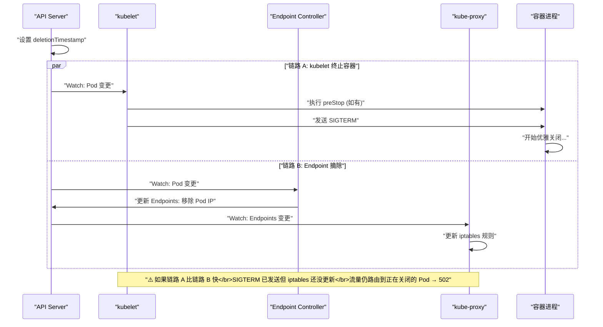

# 04 优雅停机与滚动更新的零停机

**摘要：**

"滚动更新期间用户看到 502"——这是 K8s 运维中最高频的问题之一。[[02 Deployment 控制器深度解析|Deployment]] 的滚动更新看似无缝——新 Pod 启动后旧 Pod 才被终止——但在真实的生产环境中，Pod 终止过程涉及多个异步操作的**竞态**：kubelet 发送 SIGTERM 和 Endpoint Controller 从 Service 后端列表中摘除 Pod IP 是**并行发生**的。如果 SIGTERM 先于 Endpoint 摘除完成，应用进程已经关闭但 kube-proxy 的 iptables 规则还没更新——流量仍然被路由到已关闭的 Pod → 502 错误。本文从 Pod 终止的完整时序出发，逐帧分析这个竞态问题的根因，然后给出"滚动更新零停机"的完整方案——preStop Hook sleep、应用层优雅关闭、terminationGracePeriodSeconds 的配合。

---

## 第 1 章 Pod 终止的完整时序

### 1.1 两条并行的链路

当一个 Pod 被删除时（无论是用户 `kubectl delete`、Deployment 滚动更新缩旧 RS、还是节点驱逐），API Server 设置 Pod 的 `deletionTimestamp`。这个变更通过 Watch 同时被两个组件感知——**kubelet** 和 **Endpoint Controller**——它们各自独立地开始处理：

**链路 A：kubelet 终止容器**

```
1. kubelet Watch 到 Pod 的 deletionTimestamp 被设置
2. kubelet 停止 Liveness/Readiness Probe
3. kubelet 执行 preStop Hook（如果配置了）
4. preStop 完成后，kubelet 发送 SIGTERM 给容器主进程
5. 等待容器退出（最多 terminationGracePeriodSeconds）
6. 如果超时，发送 SIGKILL 强制杀死
7. kubelet 上报 Pod 状态为 Terminated
```

**链路 B：Endpoint Controller 摘除 Pod**

```
1. Endpoint Controller Watch 到 Pod 的 deletionTimestamp 被设置
2. Endpoint Controller 从对应 Service 的 Endpoints 对象中移除该 Pod 的 IP
3. kube-proxy Watch 到 Endpoints 变更
4. kube-proxy 更新本节点的 iptables/IPVS 规则（移除该 Pod IP）
5. 新的流量不再被路由到该 Pod
```

### 1.2 竞态问题的根因

**链路 A 和链路 B 是完全独立、并行执行的**——没有任何同步机制保证"先摘除 Endpoints，再发送 SIGTERM"。



**最坏的时序**：

```
T0: API Server 设置 deletionTimestamp
T1: kubelet 收到 Watch 事件，立即发送 SIGTERM（无 preStop）
T2: 应用收到 SIGTERM，关闭监听端口
T3: Endpoint Controller 才收到 Watch 事件，开始更新 Endpoints
T4: kube-proxy 收到 Endpoints 变更，开始更新 iptables
T5: iptables 规则更新完成——此时流量已经不再路由到该 Pod

在 T2-T5 之间（可能 1-5 秒），流量仍然被路由到已关闭端口的 Pod → 502
```

这个时间窗口虽然很短（通常 1-5 秒），但在高流量场景下，每秒数千个请求中会有一部分命中这个窗口——用户会间歇性地看到 502 错误。

---

## 第 2 章 SIGTERM 信号的传递

### 2.1 SIGTERM 发送给谁

kubelet 通过 CRI 发送 SIGTERM 给容器的 **PID 1 进程**——即容器的主进程（Dockerfile 的 ENTRYPOINT 或 Pod spec 中的 `command`）。

**关键问题**：如果 PID 1 是 shell（如 `/bin/sh -c "java -jar app.jar"`），SIGTERM 被发送给 shell 进程——但 **shell 默认不会将 SIGTERM 转发给子进程**。Java 进程收不到 SIGTERM，无法执行优雅关闭。

```dockerfile
# 错误：shell 作为 PID 1，SIGTERM 不会传递给 java
CMD /bin/sh -c "java -jar app.jar"

# 正确：java 直接作为 PID 1
CMD ["java", "-jar", "app.jar"]
```

或使用 `exec` 替换 shell 进程：

```dockerfile
# 正确：exec 使 java 替换 shell 成为 PID 1
CMD ["/bin/sh", "-c", "exec java -jar app.jar"]
```

### 2.2 应用如何处理 SIGTERM

收到 SIGTERM 后，应用应执行**优雅关闭**：

1. **停止接受新请求**：关闭监听端口或停止从连接池获取新连接
2. **完成正在处理的请求**：等待所有 in-flight 请求处理完成
3. **关闭外部连接**：关闭数据库连接池、消息队列消费者、文件句柄
4. **刷写缓冲区**：将内存中的日志、指标等数据刷写到磁盘或外部系统
5. **退出进程**：以退出码 0 正常退出

不同语言/框架的 SIGTERM 处理方式：

| 框架 | 处理方式 |
| :--- | :--- |
| **Go (net/http)** | `server.Shutdown(ctx)` 优雅关闭 HTTP 服务 |
| **Java (Spring Boot)** | `server.shutdown=graceful` + `spring.lifecycle.timeout-per-shutdown-phase=30s` |
| **Node.js (Express)** | `process.on('SIGTERM', () => { server.close(); })` |
| **Nginx** | `nginx -s quit`（等待 worker 完成当前请求后退出）|
| **Python (Gunicorn)** | 默认处理 SIGTERM——等待 worker 完成后退出 |

---

## 第 3 章 零停机方案

### 3.1 核心思路

要实现零停机，必须确保：**在 Endpoint 从 iptables 规则中被移除之前，应用不要关闭监听端口。**

换句话说——让链路 A（容器终止）**等一等**链路 B（Endpoint 摘除）。具体做法是在 SIGTERM 之前插入一个**延迟**，给 Endpoint Controller 和 kube-proxy 足够的时间完成摘除。

### 3.2 preStop Hook sleep

最简单且最有效的方案——在 preStop Hook 中 sleep 几秒：

```yaml
lifecycle:
  preStop:
    exec:
      command: ["sleep", "5"]
```

**时序变为**：

```
T0: API Server 设置 deletionTimestamp
T1: kubelet 收到 Watch，开始执行 preStop: sleep 5
T2: Endpoint Controller 收到 Watch，开始更新 Endpoints
T3: kube-proxy 更新 iptables 规则完成（通常 1-3 秒）
T5: preStop sleep 结束（5 秒后）
T5: kubelet 发送 SIGTERM
T5: 应用收到 SIGTERM，开始优雅关闭
此时 iptables 已经更新完毕，不再有新流量路由到该 Pod
```

**sleep 时间选择**：

- 最低 3 秒——覆盖 Endpoint Controller + kube-proxy 的处理时间
- 推荐 5-10 秒——留足余量（在大规模集群中 Endpoint 更新可能更慢）
- 不要超过 20 秒——浪费 terminationGracePeriodSeconds 的时间预算

### 3.3 terminationGracePeriodSeconds 的预算分配

`terminationGracePeriodSeconds`（默认 30 秒）是 Pod 终止的**总时间预算**——preStop Hook 执行时间 + SIGTERM 后的优雅关闭时间**必须在这个预算内**。

```
terminationGracePeriodSeconds = preStop 时间 + SIGTERM 优雅关闭时间 + 安全余量

示例：
  preStop sleep: 5 秒
  应用优雅关闭: 15 秒（完成 in-flight 请求）
  安全余量: 10 秒
  → terminationGracePeriodSeconds = 30 秒（默认值够用）

长优雅关闭场景：
  preStop sleep: 10 秒
  应用优雅关闭: 45 秒（大量长连接需要排空）
  安全余量: 5 秒
  → terminationGracePeriodSeconds = 60 秒
```

如果 preStop + 优雅关闭超过了 terminationGracePeriodSeconds，kubelet 会发送 SIGKILL 强制杀死容器——in-flight 请求被中断，数据可能丢失。

> [!warning] preStop 占用 grace period
> preStop Hook 的执行时间从 terminationGracePeriodSeconds 中扣除。如果 preStop sleep 了 25 秒，应用只剩 5 秒处理 SIGTERM 后的优雅关闭。务必合理分配时间预算。

### 3.4 完整的零停机配置

```yaml
apiVersion: apps/v1
kind: Deployment
metadata:
  name: web
spec:
  replicas: 3
  strategy:
    type: RollingUpdate
    rollingUpdate:
      maxSurge: 1
      maxUnavailable: 0          # 零停机：不允许任何 Pod 不可用
  template:
    spec:
      terminationGracePeriodSeconds: 45    # 总时间预算
      containers:
        - name: app
          image: my-app:v2
          ports:
            - containerPort: 8080
          readinessProbe:                   # 确保新 Pod 就绪后才接流量
            httpGet:
              path: /ready
              port: 8080
            initialDelaySeconds: 5
            periodSeconds: 5
          lifecycle:
            preStop:                        # 等 Endpoint 摘除完成
              exec:
                command: ["sleep", "5"]
```

**关键配置项的配合**：

| 配置 | 作用 |
| :--- | :--- |
| `maxUnavailable: 0` | 滚动更新期间不允许缩减可用 Pod 数——新 Pod Ready 后才缩旧 Pod |
| `readinessProbe` | 确保新 Pod 真正就绪后才开始接收流量——避免 502 |
| `preStop: sleep 5` | 旧 Pod 终止前等 5 秒——让 Endpoint 摘除完成后再关闭应用 |
| `terminationGracePeriodSeconds: 45` | 给 preStop (5s) + 应用优雅关闭 (30s+) 留足时间 |

---

## 第 4 章 深入理解 Endpoint 摘除的链路

### 4.1 Endpoint 更新的延迟来源

链路 B 的延迟不仅仅是 Endpoint Controller 的处理时间——它涉及多个组件的串行操作：

```
API Server 设置 deletionTimestamp
  → Watch 事件传播到 Endpoint Controller（延迟 ~100ms）
    → Endpoint Controller 计算新的 Endpoints 列表
      → Endpoint Controller 通过 API Server 更新 Endpoints 对象（延迟 ~100ms）
        → Watch 事件传播到 kube-proxy（延迟 ~100ms）
          → kube-proxy 更新 iptables/IPVS 规则（延迟 ~100ms-1s）
```

**总延迟**：通常 500ms-3s，在大规模集群或高负载下可能达到 5s 以上。

### 4.2 EndpointSlice 的改进

在 Service 后端 Pod 很多（如 1000 个）时，每次 Pod 变更都需要更新整个 Endpoints 对象——序列化和传输大对象导致延迟增加。

**EndpointSlice** 将大 Endpoints 拆分为多个小 Slice（每个最多 100 个端点）——Pod 变更只需更新包含该 Pod 的 Slice，减少了序列化开销和 Watch 事件大小。

但 EndpointSlice 不改变异步摘除的本质——preStop sleep 仍然是必要的。

### 4.3 Ingress Controller 的额外延迟

如果流量经过 Ingress Controller（如 Nginx Ingress），Pod IP 的摘除还需要 Ingress Controller 感知 Endpoints 变更并重载配置——这又增加了一层延迟（Nginx 的 reload 通常需要 1-3 秒）。在这种场景下，preStop sleep 的时间应适当增加到 10 秒。

---

## 第 5 章 应用层的优雅关闭

### 5.1 HTTP 服务的优雅关闭

应用收到 SIGTERM 后的标准流程：

```
1. 停止接受新的 TCP 连接（关闭 listening socket）
2. 等待所有 in-flight 请求完成
3. 关闭空闲连接
4. 退出进程
```

**Go 语言示例**：

```go
// 创建 HTTP 服务
server := &http.Server{Addr: ":8080", Handler: mux}

// 启动服务
go server.ListenAndServe()

// 等待 SIGTERM
quit := make(chan os.Signal, 1)
signal.Notify(quit, syscall.SIGTERM)
<-quit

// 优雅关闭：等待最多 30 秒让 in-flight 请求完成
ctx, cancel := context.WithTimeout(context.Background(), 30*time.Second)
defer cancel()
server.Shutdown(ctx)
```

### 5.2 长连接的处理

**WebSocket** 和 **gRPC 流式连接** 是长连接——它们可能持续数分钟甚至数小时。优雅关闭时不能无限期等待长连接结束。

策略：
- 收到 SIGTERM 后，向客户端发送"即将关闭"的信号（如 WebSocket 的 Close Frame、gRPC 的 GOAWAY）
- 设置一个最大等待时间（如 10 秒），超时后强制关闭连接
- 客户端收到关闭信号后应自动重连到其他 Pod

### 5.3 消息队列消费者的优雅关闭

Kafka / RabbitMQ 消费者收到 SIGTERM 后：

1. 停止从 Broker 拉取新消息
2. 完成当前正在处理的消息
3. 提交 offset / ack 消息
4. 关闭消费者连接
5. 退出

如果不优雅关闭——正在处理的消息未 ack，Broker 会在超时后将消息重新分配给其他消费者——导致**消息重复处理**。

---

## 第 6 章 特殊场景

### 6.1 节点驱逐（Eviction）

节点资源压力（内存不足、磁盘空间不足）触发 Eviction Manager 驱逐 Pod 时，流程与正常删除类似：
- 设置 Pod 的 deletionTimestamp
- 执行 preStop Hook
- 发送 SIGTERM

但 Eviction 可能将 `terminationGracePeriodSeconds` 覆盖为更短的值——在紧急驱逐（hard eviction）场景下，grace period 可能为 0——直接 SIGKILL。

### 6.2 kubectl delete --grace-period=0 --force

`--force --grace-period=0` 跳过优雅终止流程——**不执行 preStop、不发送 SIGTERM、直接删除 Pod 对象**。容器进程可能在 kubelet 收到消息后被 SIGKILL。

这个操作极其危险——应仅在 Pod 所在节点完全不可达（kubelet 已经无法联系）时使用，用于清理 API Server 中的"孤儿" Pod 对象。

### 6.3 多容器 Pod 的终止顺序

Pod 中的多个业务容器**同时**收到 SIGTERM——没有顺序保证。如果容器之间有依赖关系（如 Sidecar 代理依赖主容器），可能出现代理先退出导致主容器的网络请求失败。

K8s 1.28 的 [[02 Pod 生命周期深度解析|Sidecar Container]]（Init Container with `restartPolicy: Always`）解决了这个问题——Sidecar Container 在所有业务容器终止后才被停止。

---

## 第 7 章 零停机 Checklist

以下是实现滚动更新零停机的完整检查清单：

| 检查项 | 配置 | 说明 |
| :--- | :--- | :--- |
| **Readiness Probe** | `readinessProbe.httpGet.path: /ready` | 确保新 Pod 就绪后才接流量 |
| **preStop sleep** | `lifecycle.preStop.exec.command: ["sleep", "5"]` | 等 Endpoint 摘除完成后再终止 |
| **maxUnavailable** | `strategy.rollingUpdate.maxUnavailable: 0` | 不允许同时终止多个旧 Pod |
| **terminationGracePeriodSeconds** | `≥ preStop 时间 + 应用关闭时间` | 给足优雅关闭时间 |
| **SIGTERM 处理** | 应用代码中处理 SIGTERM | 完成 in-flight 请求后退出 |
| **PID 1 问题** | Dockerfile 使用 exec 形式 | 确保 SIGTERM 传递给应用进程 |
| **minReadySeconds** | `spec.minReadySeconds: 10` | 新 Pod Ready 后观察一段时间再继续更新 |

```yaml
# 零停机完整配置模板
apiVersion: apps/v1
kind: Deployment
metadata:
  name: web
spec:
  replicas: 3
  strategy:
    type: RollingUpdate
    rollingUpdate:
      maxSurge: 1
      maxUnavailable: 0
  minReadySeconds: 10
  template:
    spec:
      terminationGracePeriodSeconds: 45
      containers:
        - name: app
          image: my-app:v2
          ports:
            - containerPort: 8080
          readinessProbe:
            httpGet:
              path: /ready
              port: 8080
            initialDelaySeconds: 5
            periodSeconds: 5
            failureThreshold: 3
          startupProbe:
            httpGet:
              path: /healthz
              port: 8080
            periodSeconds: 5
            failureThreshold: 30
          livenessProbe:
            httpGet:
              path: /healthz
              port: 8080
            periodSeconds: 10
            failureThreshold: 3
          lifecycle:
            preStop:
              exec:
                command: ["sleep", "5"]
```

---

## 第 8 章 总结

本文深入分析了 Pod 终止过程中的竞态问题和零停机方案：

- **竞态根因**：kubelet 终止容器（链路 A）和 Endpoint Controller 摘除 Pod IP（链路 B）是并行的，链路 A 可能先于链路 B 完成——导致流量路由到已关闭的 Pod
- **preStop sleep**：在 SIGTERM 之前插入延迟，给 Endpoint 摘除留出时间（推荐 5-10 秒）
- **应用层优雅关闭**：收到 SIGTERM 后停止接受新连接、完成 in-flight 请求、关闭外部资源
- **terminationGracePeriodSeconds**：preStop 时间 + 应用关闭时间的总预算
- **PID 1 问题**：确保 SIGTERM 传递给应用进程（使用 exec 形式的 CMD/ENTRYPOINT）
- **零停机四件套**：Readiness Probe + preStop sleep + maxUnavailable=0 + 应用 SIGTERM 处理

下一篇 [[05 Service 与 kube-proxy 原理]] 将深入 K8s 的服务发现和流量路由机制。

---

## 参考资料

1. Kubernetes Documentation - Termination of Pods：https://kubernetes.io/docs/concepts/workloads/pods/pod-lifecycle/#pod-termination
2. Kubernetes Documentation - Container Lifecycle Hooks：https://kubernetes.io/docs/concepts/containers/container-lifecycle-hooks/
3. Learnk8s - Graceful shutdown：https://learnk8s.io/graceful-shutdown
4. Google Cloud Blog - Kubernetes best practices: terminating with grace：https://cloud.google.com/blog/products/containers-kubernetes/kubernetes-best-practices-terminating-with-grace
5. Kubernetes Source Code - pkg/kubelet/pod_workers.go：https://github.com/kubernetes/kubernetes/blob/master/pkg/kubelet/pod_workers.go
