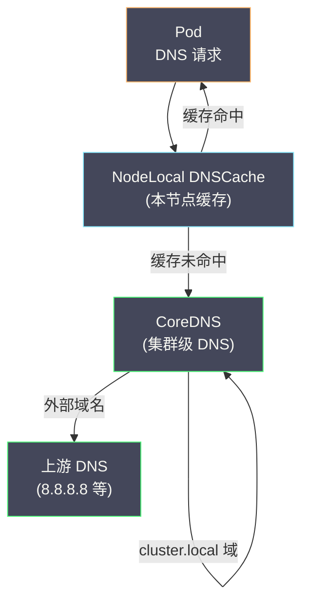
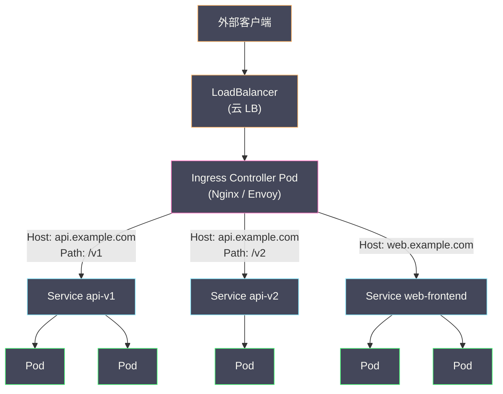
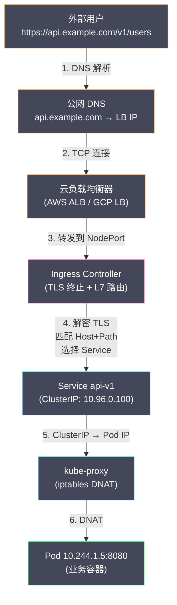

# 06 DNS 服务发现与 Ingress

**摘要：**

[[05 Service 与 kube-proxy 原理|上一篇]]分析了 Service 如何通过 kube-proxy 实现四层（L4）流量转发。但客户端连接 Service 时通常不直接使用 ClusterIP——而是通过 **DNS 名称**（如 `web-api.default.svc.cluster.local`）。将 DNS 名称解析为 ClusterIP 的工作由集群内的 **CoreDNS** 承担。CoreDNS 是 K8s 的默认 DNS 服务器——它 Watch Service 和 EndpointSlice 的变更，自动为每个 Service 创建 DNS 记录。另一方面，Service 只能做四层转发（基于 IP + 端口），无法根据 HTTP Host 头或 URL 路径做路由——这正是 **Ingress** 解决的问题。Ingress 在 Service 之上提供了七层（L7）HTTP 路由——将外部流量根据域名和路径分发到不同的 Service。本文从 CoreDNS 的工作原理出发，覆盖 Service DNS 记录的格式、Pod 的 DNS 策略配置，然后深入 Ingress 的设计模型、Ingress Controller 的工作机制，最后介绍 Gateway API——Ingress 的下一代替代方案。

---

## 第 1 章 K8s 中的 DNS 服务发现

### 1.1 为什么需要 DNS

在 K8s 集群中，Pod 需要通过**名称**而非 IP 地址来访问 Service——原因：

- ClusterIP 是一串无意义的数字（如 `10.96.0.100`），难以记忆和管理
- 代码中硬编码 IP 地址违背了"配置与代码分离"的原则
- 在不同的集群（开发/测试/生产）中，同一个 Service 的 ClusterIP 不同——DNS 名称可以保持一致

K8s 的 DNS 体系让 Pod 中的应用可以像在传统网络中一样通过域名访问服务：

```python
# 应用代码中使用 Service 名称
db = mysql.connect(host="mysql.default.svc.cluster.local", port=3306)

# 简写形式（同 Namespace 内可省略后缀）
db = mysql.connect(host="mysql", port=3306)
```

### 1.2 DNS 记录的格式

K8s DNS 为 Service 创建的记录遵循固定格式：

**普通 Service（ClusterIP 类型）**：

| 记录类型 | 格式 | 解析结果 |
| :--- | :--- | :--- |
| **A 记录** | `<service>.<namespace>.svc.cluster.local` | ClusterIP（如 10.96.0.100）|
| **SRV 记录** | `_<port>._<protocol>.<service>.<namespace>.svc.cluster.local` | 端口和 ClusterIP |

**Headless Service（clusterIP: None）**：

| 记录类型 | 格式 | 解析结果 |
| :--- | :--- | :--- |
| **A 记录** | `<service>.<namespace>.svc.cluster.local` | 所有后端 Pod 的 IP 列表 |
| **A 记录** | `<pod-name>.<service>.<namespace>.svc.cluster.local` | 特定 Pod 的 IP |

**ExternalName Service**：

| 记录类型 | 格式 | 解析结果 |
| :--- | :--- | :--- |
| **CNAME 记录** | `<service>.<namespace>.svc.cluster.local` | `spec.externalName` 的值 |

### 1.3 DNS 名称的简写

Pod 的 `/etc/resolv.conf` 中配置了搜索域（search domain），允许使用简写名称：

```
# Pod 的 /etc/resolv.conf
nameserver 10.96.0.10          # CoreDNS 的 ClusterIP
search default.svc.cluster.local svc.cluster.local cluster.local
options ndots:5
```

**search 域**的工作方式——当 Pod 中的应用解析一个不完全限定的名称时，DNS 客户端按 search 列表追加后缀：

```
应用请求解析 "mysql"：
  尝试 1: mysql.default.svc.cluster.local → 命中 Service
  （如果不命中，继续）
  尝试 2: mysql.svc.cluster.local → 不命中
  尝试 3: mysql.cluster.local → 不命中
  尝试 4: mysql → 作为绝对域名查询
```

**同 Namespace 内**：只用 Service 名称即可——`mysql`
**跨 Namespace**：`mysql.other-namespace` → 追加 `.svc.cluster.local`
**完全限定**：`mysql.other-namespace.svc.cluster.local`

### 1.4 ndots 与外部域名解析的性能问题

`ndots:5` 表示：如果域名中的点号数量少于 5 个，DNS 客户端认为它是"不完全限定的"——会先追加 search 域再查询。

问题是：**外部域名**（如 `api.example.com`）只有 2 个点（< 5），也会被 search 域展开：

```
解析 "api.example.com"：
  尝试 1: api.example.com.default.svc.cluster.local → 不存在
  尝试 2: api.example.com.svc.cluster.local → 不存在
  尝试 3: api.example.com.cluster.local → 不存在
  尝试 4: api.example.com → 命中
```

前 3 次查询完全是浪费——每次都向 CoreDNS 发送请求再得到 NXDOMAIN 响应。在大规模集群中，这些无效查询可能给 CoreDNS 带来显著压力。

**优化方案**：

- **使用 FQDN**：在代码中使用完全限定域名并以点号结尾——`api.example.com.`——DNS 客户端不再追加 search 域
- **降低 ndots**：在 Pod spec 中设置 `dnsConfig.options: [{name: ndots, value: "2"}]`——减少 search 展开的次数
- **NodeLocal DNSCache**：在每个节点上部署 DNS 缓存，缓存 NXDOMAIN 响应

---

## 第 2 章 CoreDNS

### 2.1 CoreDNS 在集群中的部署

CoreDNS 以 **Deployment** 形式部署在 `kube-system` Namespace 中（通常 2 个副本），暴露为一个 ClusterIP Service（通常是 `10.96.0.10`）。kubelet 在创建每个 Pod 时，自动将 CoreDNS 的 ClusterIP 写入 Pod 的 `/etc/resolv.conf`。

```bash
kubectl -n kube-system get deploy coredns
# NAME      READY   UP-TO-DATE   AVAILABLE
# coredns   2/2     2            2

kubectl -n kube-system get svc kube-dns
# NAME       TYPE        CLUSTER-IP   PORT(S)
# kube-dns   ClusterIP   10.96.0.10   53/UDP,53/TCP
```

### 2.2 CoreDNS 的插件化架构

CoreDNS 使用**插件链（Plugin Chain）** 处理 DNS 请求——每个插件负责一个特定功能，请求依次经过所有配置的插件。

```
Corefile（CoreDNS 配置文件）：

.:53 {
    errors                       # 记录错误日志
    health {                     # 健康检查端点
        lameduck 5s
    }
    ready                        # 就绪检查端点
    kubernetes cluster.local in-addr.arpa ip6.arpa {
        pods insecure            # 为 Pod 创建 DNS 记录
        fallthrough in-addr.arpa ip6.arpa
        ttl 30                   # DNS 记录的 TTL
    }
    prometheus :9153             # Prometheus 指标
    forward . /etc/resolv.conf   # 非集群域名转发到上游 DNS
    cache 30                     # 缓存 30 秒
    loop                         # 检测 DNS 循环
    reload                       # 配置文件热加载
    loadbalance                  # DNS 响应中的 A 记录随机排序
}
```

**kubernetes 插件**是核心——它 Watch API Server 中的 Service 和 EndpointSlice 对象，在内存中维护 DNS 记录。当 DNS 请求到来时，直接从内存中查找并返回——不需要每次都查询 API Server。

**forward 插件**处理集群外部的域名解析——将非 `cluster.local` 域的请求转发到节点的上游 DNS 服务器（如云平台的 DNS 或公共 DNS 8.8.8.8）。

### 2.3 CoreDNS 的性能与扩展

CoreDNS 是集群 DNS 解析的**单点**——所有 Pod 的 DNS 请求都发到 CoreDNS。在大规模集群中（数千 Pod、每秒数万次 DNS 查询），CoreDNS 可能成为瓶颈。

**扩展策略**：

**水平扩容**：增加 CoreDNS 的副本数——通常配合 **dns-autoscaler** 根据集群节点数自动调整副本数。

**NodeLocal DNSCache**：在每个节点上部署一个 DNS 缓存代理（以 DaemonSet 运行）——Pod 的 DNS 请求先到本节点的缓存，缓存未命中时才转发到 CoreDNS。这大幅减少了 CoreDNS 的请求量，也减少了跨节点网络的延迟。



---

## 第 3 章 Pod 的 DNS 策略

### 3.1 四种 dnsPolicy

Pod 的 `spec.dnsPolicy` 控制 Pod 如何解析 DNS 名称：

| 策略 | /etc/resolv.conf 内容 | 适用场景 |
| :--- | :--- | :--- |
| **ClusterFirst**（默认）| nameserver=CoreDNS ClusterIP, search=集群搜索域 | 绝大多数 Pod |
| **Default** | 继承节点的 /etc/resolv.conf | 不需要集群 DNS 的 Pod |
| **None** | 空——必须通过 dnsConfig 手动配置 | 完全自定义 DNS |
| **ClusterFirstWithHostNet** | 等同 ClusterFirst，但用于 hostNetwork=true 的 Pod | 使用主机网络的 DaemonSet |

### 3.2 dnsConfig 自定义

`spec.dnsConfig` 允许在 dnsPolicy 的基础上追加或覆盖 DNS 配置：

```yaml
spec:
  dnsPolicy: ClusterFirst
  dnsConfig:
    nameservers:
      - 1.1.1.1              # 追加额外的 nameserver
    searches:
      - my-domain.local       # 追加额外的搜索域
    options:
      - name: ndots
        value: "2"            # 覆盖 ndots 值
```

---

## 第 4 章 Ingress

### 4.1 Service 的局限

[[05 Service 与 kube-proxy 原理|Service]] 在四层（L4）工作——基于 IP 地址和端口转发。一个 NodePort 或 LoadBalancer Service 只能将一个端口映射到一个后端。

如果有多个 HTTP 服务需要通过同一个外部 IP 暴露（如 `api.example.com` 和 `web.example.com`），每个服务需要一个独立的 LoadBalancer——在云上意味着多个 LB 实例和多个外部 IP，成本高且管理复杂。

**Ingress** 在七层（L7）工作——它可以根据 HTTP **Host 头**和 **URL 路径**将流量路由到不同的 Service。多个 HTTP 服务可以共享同一个外部 IP 和 LB。

### 4.2 Ingress 的设计模型

```yaml
apiVersion: networking.k8s.io/v1
kind: Ingress
metadata:
  name: my-ingress
  annotations:
    nginx.ingress.kubernetes.io/rewrite-target: /
spec:
  ingressClassName: nginx          # 使用哪个 Ingress Controller
  tls:
    - hosts:
        - api.example.com
      secretName: api-tls-cert     # TLS 证书
  rules:
    - host: api.example.com
      http:
        paths:
          - path: /v1
            pathType: Prefix
            backend:
              service:
                name: api-v1
                port:
                  number: 80
          - path: /v2
            pathType: Prefix
            backend:
              service:
                name: api-v2
                port:
                  number: 80
    - host: web.example.com
      http:
        paths:
          - path: /
            pathType: Prefix
            backend:
              service:
                name: web-frontend
                port:
                  number: 80
```

**路由规则**：

```
api.example.com/v1/*  → Service api-v1:80
api.example.com/v2/*  → Service api-v2:80
web.example.com/*     → Service web-frontend:80
```

### 4.3 Ingress Controller

**Ingress 对象本身只是一个路由规则的声明**——它不直接处理流量。真正实现流量路由的是 **Ingress Controller**——一个运行在集群中的反向代理（通常基于 Nginx、Envoy 或 HAProxy）。

Ingress Controller 的工作模式：

1. Watch API Server 中的 Ingress 对象和 Service/Endpoints 变更
2. 根据 Ingress 规则生成反向代理配置（如 Nginx 的 server block、upstream）
3. 将配置应用到反向代理（如 reload Nginx）
4. 外部流量进入 Ingress Controller 的 Pod → 根据 Host/Path 路由到对应的 Service 后端



### 4.4 IngressClass

K8s 集群中可以部署多个 Ingress Controller（如一个 Nginx 用于公网流量，一个 Envoy 用于内网流量）。**IngressClass** 用于区分不同的 Ingress Controller——Ingress 对象通过 `spec.ingressClassName` 指定使用哪个 Controller。

```yaml
apiVersion: networking.k8s.io/v1
kind: IngressClass
metadata:
  name: nginx
  annotations:
    ingressclass.kubernetes.io/is-default-class: "true"    # 默认 IngressClass
spec:
  controller: k8s.io/ingress-nginx    # Controller 标识
```

### 4.5 常用 Ingress Controller

| Controller | 底层代理 | 特点 |
| :--- | :--- | :--- |
| **ingress-nginx** | Nginx | 最广泛使用，功能全面，Annotation 配置丰富 |
| **Traefik** | Traefik | 自动 Let's Encrypt、中间件链、Dashboard |
| **Contour** | Envoy | 高性能，原生支持 HTTP/2 和 gRPC |
| **HAProxy Ingress** | HAProxy | 高性能，配置灵活 |
| **AWS ALB Controller** | AWS ALB | 直接使用 AWS Application Load Balancer |
| **Istio Gateway** | Envoy | 服务网格集成 |

### 4.6 TLS 终止

Ingress 支持 **TLS 终止**——HTTPS 流量在 Ingress Controller 处解密，以 HTTP 明文转发到后端 Service。TLS 证书以 K8s Secret 形式存储：

```bash
kubectl create secret tls api-tls-cert \
  --cert=tls.crt \
  --key=tls.key
```

配合 [[06 Operator 模式与自定义控制器|cert-manager]] Operator，可以自动申请和续期 Let's Encrypt 证书——实现全自动的 HTTPS。

---

## 第 5 章 Ingress 的局限与 Gateway API

### 5.1 Ingress 的局限

Ingress API 经过多年使用暴露了设计上的局限：

**功能受限**：Ingress 原生只支持 HTTP/HTTPS 路由——不支持 TCP/UDP 路由、流量分割、请求镜像、Header 操作等高级功能。这些功能依赖 Controller 特定的 Annotation 实现——导致不同 Controller 之间的配置不可移植。

**角色混淆**：Ingress 对象同时包含了"基础设施配置"（TLS 证书、LB 类型）和"应用路由配置"（Host/Path 规则）——在多团队协作中，基础设施团队和应用团队需要操作同一个对象，缺乏权限分离。

**Annotation 泛滥**：高级功能通过 Annotation 配置（如 `nginx.ingress.kubernetes.io/proxy-body-size: 10m`），不同 Controller 的 Annotation 完全不同——学习成本高，迁移困难。

### 5.2 Gateway API

**Gateway API** 是 K8s SIG-Network 设计的**下一代流量路由 API**——旨在替代 Ingress。它解决了 Ingress 的核心局限。

**核心资源**：

| 资源 | 角色 | 说明 |
| :--- | :--- | :--- |
| **GatewayClass** | 基础设施提供者 | 定义 Gateway 实现（类似 IngressClass）|
| **Gateway** | 集群管理员 | 定义监听器（端口、协议、TLS）|
| **HTTPRoute** | 应用开发者 | 定义 HTTP 路由规则（Host/Path → Service）|
| **TCPRoute / TLSRoute / GRPCRoute** | 应用开发者 | 非 HTTP 协议的路由规则 |

```yaml
# 集群管理员创建 Gateway
apiVersion: gateway.networking.k8s.io/v1
kind: Gateway
metadata:
  name: external-gateway
spec:
  gatewayClassName: nginx
  listeners:
    - name: https
      port: 443
      protocol: HTTPS
      tls:
        certificateRefs:
          - name: wildcard-cert
---
# 应用开发者创建 HTTPRoute
apiVersion: gateway.networking.k8s.io/v1
kind: HTTPRoute
metadata:
  name: api-route
spec:
  parentRefs:
    - name: external-gateway       # 绑定到哪个 Gateway
  hostnames:
    - "api.example.com"
  rules:
    - matches:
        - path:
            type: PathPrefix
            value: /v1
      backendRefs:
        - name: api-v1
          port: 80
          weight: 90               # 90% 流量
        - name: api-v2
          port: 80
          weight: 10               # 10% 流量（金丝雀）
```

**Gateway API 的优势**：

- **角色分离**：GatewayClass（基础设施提供者）→ Gateway（集群管理员）→ HTTPRoute（应用开发者），清晰的权限边界
- **原生支持高级功能**：流量分割（weight）、Header 操作、请求镜像、重定向——不需要 Annotation
- **多协议**：TCP/TLS/HTTP/gRPC 都有独立的 Route 资源
- **可移植性**：标准化 API，不同 Controller 实现相同的语义

### 5.3 Ingress 到 Gateway API 的迁移

Gateway API 从 K8s 1.29 开始 GA（HTTPRoute）——正在逐步成为主流。但 Ingress API 不会被移除——它仍然是"足够好"的简单方案。

- **新项目**：建议直接使用 Gateway API
- **已有项目**：可以继续使用 Ingress，逐步迁移到 Gateway API
- **简单场景**：Ingress 更简洁（一个对象搞定）
- **复杂场景**：Gateway API 更强大（流量分割、多协议、角色分离）

---

## 第 6 章 从外部到 Pod 的完整流量路径



**完整路径**：

1. 用户浏览器解析 `api.example.com` → 公网 DNS 返回云 LB 的外部 IP
2. 浏览器与云 LB 建立 TCP 连接
3. 云 LB 将流量转发到 Ingress Controller 的 NodePort（或直接到 Pod）
4. Ingress Controller 解密 TLS，根据 Host（`api.example.com`）和 Path（`/v1`）匹配路由规则，选择目标 Service `api-v1`
5. Ingress Controller 将请求转发到 Service 的 ClusterIP（或直接到 Pod IP，取决于配置）
6. kube-proxy 的 iptables 规则将 ClusterIP DNAT 到后端 Pod IP
7. 请求到达 Pod 中的容器——业务代码处理请求并返回响应

---

## 第 7 章 总结

本文作为「生命周期管理与服务发现」专栏的收官，系统分析了 K8s 的 DNS 服务发现和七层流量路由：

- **CoreDNS**：K8s 的默认 DNS 服务器，Watch Service/EndpointSlice 自动生成 DNS 记录，插件化架构，forward 处理外部域名
- **DNS 记录格式**：`<service>.<namespace>.svc.cluster.local` → ClusterIP（普通 Service）或 Pod IP 列表（Headless Service）
- **ndots 问题**：外部域名被 search 域展开导致无效查询，通过 FQDN 或降低 ndots 优化
- **Pod DNS 策略**：ClusterFirst（默认）、Default、None、ClusterFirstWithHostNet
- **Ingress**：七层 HTTP 路由——根据 Host 和 Path 将流量分发到不同 Service，Ingress Controller（Nginx/Envoy）执行实际转发
- **Gateway API**：Ingress 的下一代替代——角色分离（GatewayClass → Gateway → HTTPRoute）、原生流量分割、多协议支持
- **完整流量路径**：公网 DNS → 云 LB → Ingress Controller（L7）→ Service → kube-proxy（L4）→ Pod

至此，「生命周期管理与服务发现」专栏的 6 篇文章全部完成。我们从 kubelet 的 Pod 创建流程出发，覆盖了 Pod 生命周期、健康检查、优雅停机、Service 和 kube-proxy 的四层转发、CoreDNS 和 Ingress 的七层路由——建立了从 Pod 创建到外部流量到达 Pod 的完整认知。下一个专栏将转向「生产实践与集群管理」。

---

## 参考资料

1. Kubernetes Documentation - DNS for Services and Pods：https://kubernetes.io/docs/concepts/services-networking/dns-pod-service/
2. Kubernetes Documentation - Ingress：https://kubernetes.io/docs/concepts/services-networking/ingress/
3. Kubernetes Documentation - Gateway API：https://gateway-api.sigs.k8s.io/
4. CoreDNS Documentation：https://coredns.io/manual/toc/
5. Kubernetes Enhancement Proposal - Gateway API：https://github.com/kubernetes-sigs/gateway-api
6. Kubernetes Documentation - NodeLocal DNSCache：https://kubernetes.io/docs/tasks/administer-cluster/nodelocaldns/
7. Kubernetes Source Code - CoreDNS kubernetes plugin：https://github.com/coredns/coredns/tree/master/plugin/kubernetes

---

> [!note] 思考题
> 1. 滚动更新（RollingUpdate）是 Deployment 的默认策略——逐步替换旧 Pod。`maxSurge: 25%`（允许临时多出 25% 的 Pod）和 `maxUnavailable: 25%`（允许最多 25% 不可用）控制更新速度。在一个 4 副本的 Deployment 中，默认设置下同时有多少个新旧 Pod 在运行？
> 2. 回滚通过 `kubectl rollout undo deployment/name` 执行——恢复到上一个 ReplicaSet。Kubernetes 默认保留最近 10 个 ReplicaSet（`revisionHistoryLimit`）。但回滚只恢复 Pod Template——不恢复 ConfigMap 或 Secret 的变更。如果故障是由 ConfigMap 变更引起的，`rollout undo` 无法解决。你如何实现'ConfigMap 版本化'（如将 ConfigMap 名称中包含 hash）？
> 3. 蓝绿部署和金丝雀发布不是 Kubernetes 原生支持的——需要通过 Ingress 权重路由或 Argo Rollouts 实现。Argo Rollouts 提供了 `Canary` 和 `BlueGreen` 策略——支持渐进式流量切换和自动回滚（基于 Prometheus 指标）。在什么场景下 Argo Rollouts 比原生 Deployment 更合适？
