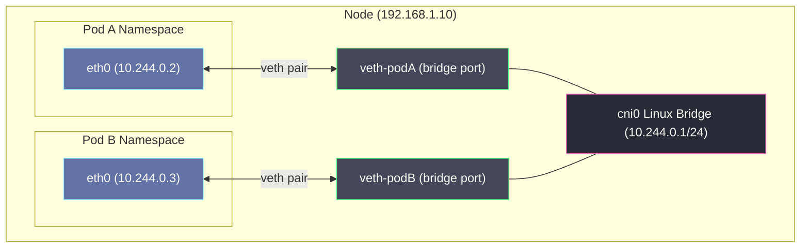
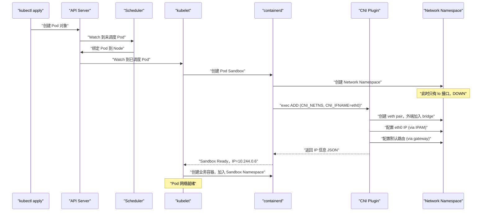

# Kubernetes网络模型——从Linux网络命名空间到Pod IP

## 摘要

Kubernetes 的网络模型建立在 Linux 内核数十年沉淀的网络原语之上。本文从 Linux Network Namespace 的本质出发，逐步推导 veth pair 的工作机制、Linux bridge 的二层转发原理，再到 Kubernetes 网络四大约束的设计哲学，最终解析 CNI 接口的诞生背景。**理解这条推导链，是看懂 Flannel、Calico、Cilium 一切实现差异的前提。** 每一个 Pod 背后都是一个独立的 Network Namespace，每一次跨节点通信都是一次精心设计的包转发旅程。

---

## 第 1 章 为什么你需要理解 Linux 网络栈

### 1.1 从一个让人困惑的问题开始

初学 Kubernetes 的工程师往往很快就能跑起来一个集群，用 `kubectl apply` 部署 Nginx，用 `kubectl exec` 进入容器，用 `curl` 访问 Service。但只要遇到网络故障，一切都会变得棘手：

- Pod 之间为什么 ping 不通？
- 同一个节点上的两个 Pod 通信，流量走的是哪条路径？
- 跨节点的 Pod 通信，数据包经过了哪些网络设备？
- Service 的 ClusterIP 为什么 `ping` 不通，却能 `curl` 访问？
- 为什么换了一个 CNI 插件之后，网络性能变了？

这些问题的答案无法从 Kubernetes 文档中直接找到，因为它们的根因在 Linux 内核的网络实现层面。Kubernetes 本身并不实现网络——它制定了一套约束规范，然后把具体的网络实现交给 CNI 插件去完成。而所有的 CNI 插件，无论是 Flannel、Calico 还是 Cilium，底层都是在操纵同一套 Linux 网络原语：**Network Namespace、veth pair、bridge、iptables、路由表**。

> [!note] 设计哲学
> Kubernetes 网络设计遵循"约束而非实现"的原则：K8s 只规定网络的行为语义（每个 Pod 拥有唯一 IP、Pod 间可直接通信），而将实现完全交给插件生态。这种设计给了社区极大的创新空间，也是为什么同一套 K8s 集群可以运行完全不同架构的 CNI 插件。

### 1.2 本文的推导路径

本文按照"从小到大、从原理到模型"的推导路径展开：

1. **Linux Network Namespace** → 理解容器网络隔离的本质单元
2. **veth pair** → 理解两个隔离网络空间如何"打洞"通信
3. **Linux bridge** → 理解单节点多容器网络的组网方式
4. **ARP 与路由** → 理解 L2/L3 转发的内核机制
5. **Kubernetes 网络四大约束** → 理解 K8s 对网络语义的规定
6. **CNI 接口** → 理解约束如何转化为插件规范

这条推导链是理解所有 CNI 插件的基础。**不理解 Network Namespace，就无法理解为什么每个 Pod 有独立 IP；不理解 veth pair，就无法理解容器如何连接到节点网络；不理解 bridge，就无法理解单节点 Pod 间通信的路径。**

---

## 第 2 章 Linux Network Namespace——容器网络隔离的本质

### 2.1 什么是 Network Namespace

在 Linux 中，一个进程通常与其他进程共享同一套网络资源：同一张网卡（eth0）、同一张路由表、同一组 iptables 规则、同一个端口空间（0-65535）。这意味着，如果两个进程都想监听 80 端口，只有一个能成功——端口是全局共享的资源。

**Network Namespace（网络命名空间）彻底改变了这一局面。** 它是 Linux 内核提供的一种隔离机制，允许将网络资源（网络接口、路由表、iptables 规则、socket、端口空间）划分成相互独立的"视图"，每个 Network Namespace 拥有自己完整的网络栈，就像一台独立的"虚拟机"的网络层。

具体来说，一个 Network Namespace 包含以下独立的资源：

| 资源 | 说明 |
| :--- | :--- |
| **网络接口（Interface）** | 独立的 loopback（lo）和其他网卡，不同 Namespace 的网卡互不可见 |
| **IP 地址** | 每个接口有自己的 IP，不同 Namespace 可以使用相同的 IP 而不冲突 |
| **路由表（Routing Table）** | 独立的 IP 路由决策，不受其他 Namespace 路由影响 |
| **iptables/nftables 规则** | 独立的防火墙和 NAT 规则链 |
| **Socket 与端口空间** | 端口 0-65535 完全独立，两个 Namespace 可同时监听同一端口 |
| **ARP 缓存表** | 独立的 ARP 解析缓存 |
| **conntrack 连接跟踪表** | 独立的 NAT 连接追踪 |

> [!info] 核心概念
> Network Namespace 不是虚拟化——进程仍然运行在同一个 Linux 内核上，共享同一个 CPU、内存调度器。Network Namespace 只是把网络资源的"视图"隔离了。这就是容器比虚拟机轻量的根本原因：它共享内核，只隔离资源视图。

### 2.2 为什么需要 Network Namespace

在没有 Network Namespace 之前，如果你想在一台机器上运行多个相互隔离的应用（比如两个都监听 443 端口的 Web 服务），只能用虚拟机——每个虚拟机有完全独立的内核和网络栈，但代价是每个 VM 需要数百 MB 的内存和数秒的启动时间。

Network Namespace 提供了一条中间路：**在不启动新内核的前提下，创造独立的网络环境。** 这直接成就了容器技术的轻量级特性。Docker 和 Kubernetes 的每个容器/Pod，本质上就是一个独立的 Network Namespace。

不这样做会怎样？如果所有容器共享主机网络（不使用 Network Namespace），那么：
- 所有容器争用同一端口空间，极易冲突
- 一个容器的 iptables 规则会影响所有容器
- 容器可以看到宿主机的所有网络连接，存在严重的安全隐患
- 无法为容器分配独立 IP，只能用端口映射——这是 Docker 早期的做法，但它破坏了"每个服务拥有唯一地址"的网络语义

### 2.3 Network Namespace 的内核实现

在 Linux 内核中，每个进程的 `task_struct`（进程控制块）包含一个指向 `nsproxy` 结构体的指针，`nsproxy` 里保存了该进程所属的各种 Namespace，包括 `net_ns`（指向 `struct net` 结构体）。

`struct net` 是 Network Namespace 在内核中的核心数据结构，它包含：

```c
struct net {
    /* 网络接口链表 */
    struct list_head    dev_base_head;
    /* 路由表 */
    struct fib_table    *ipv4.fib_main;
    /* iptables 规则 */
    struct netns_xt     xt;
    /* loopback 设备 */
    struct net_device   *loopback_dev;
    /* conntrack 连接跟踪 */
    struct netns_ct     ct;
    /* ... */
};
```

当内核处理一个网络操作（如查找路由、匹配 iptables 规则）时，它总是从当前进程的 `task_struct` 出发，找到对应的 `struct net`，然后在这个 Namespace 的资源集合中查找——这就是隔离的本质。**内核代码本身没有改变，只是资源的查找上下文从"全局"变成了"per-namespace"。**

### 2.4 操作 Network Namespace 的三种方式

Linux 提供了三个系统调用来管理 Network Namespace（以及其他 Namespace 类型）：

**`clone()`**：在创建新进程时，通过 `CLONE_NEWNET` 标志为子进程创建全新的 Network Namespace。这是 Docker/containerd 创建容器时使用的主要方式。

**`unshare()`**：将当前进程从共享的 Network Namespace 中分离出来，创建并进入一个新的 Namespace，不创建新进程。

**`setns()`**：将当前进程加入一个已存在的 Network Namespace。这是 `kubectl exec` 进入容器的底层机制——它将你的 shell 进程加入到容器的 Network Namespace 中。

从用户态操作 Network Namespace，最直观的工具是 `ip netns`：

```bash
# 创建一个名为 ns0 的 Network Namespace
ip netns add ns0

# 查看 ns0 中的网络接口（此时只有 lo，且是 DOWN 状态）
ip netns exec ns0 ip link show

# 在 ns0 中执行命令——此时你的进程"看到"的是 ns0 的网络视图
ip netns exec ns0 ip route show
```

创建的 Network Namespace 会在 `/var/run/netns/` 下生成一个文件（实际是 bind mount），通过这个文件描述符可以找到并进入该 Namespace。

> [!warning] 生产避坑
> 容器运行时（containerd/CRI-O）创建的 Network Namespace 路径不在 `/var/run/netns/`，而是在 `/var/run/netns/<pod-netns-id>` 或通过 `/proc/<pid>/ns/net` 引用。如果你要手动排查 Pod 的网络问题，需要用 `nsenter -t <容器PID> -n` 进入对应的网络命名空间，而不是 `ip netns exec`。

### 2.5 一个新 Namespace 刚创建时的状态

理解这个初始状态很重要，因为它解释了 CNI 插件的工作：

当一个新的 Network Namespace 被创建时，它内部只有一个 **loopback 接口（lo）**，且处于 DOWN 状态。没有路由，没有任何外部可达性。这个 Namespace 完全封闭，内部的进程无法与任何外部世界通信。

这就是为什么创建一个容器之后，必须有 CNI 插件介入——CNI 插件的核心工作就是：**把一个孤立的 Network Namespace 和外部世界连接起来。** 连接的手段，就是下一章要讲的 veth pair。

---

## 第 3 章 veth pair——两个隔离空间之间的"虫洞"

### 3.1 什么是 veth pair

现在我们有两个相互隔离的 Network Namespace，它们各自有独立的网络栈，就像两台没有网线的计算机。怎么让它们通信？

答案是 **veth pair（虚拟以太网对，Virtual Ethernet pair）**。

veth pair 是 Linux 内核提供的一种特殊虚拟网络设备，它**成对出现**——一对 veth 设备（veth0 和 veth1）就像一根"虚拟网线"的两端。发送到 veth0 的数据，会直接从 veth1 出来；发送到 veth1 的数据，会直接从 veth0 出来。这种行为本质上就是内核内部的数据包直接转发，没有经过任何真实的网络硬件。

> [!info] 核心概念
> veth pair 的实现极其简单：内核中两个 veth 设备的 `net_device` 结构体互相持有对方的指针。当内核调用一个 veth 设备的发送函数（`ndo_start_xmit`）时，它直接把 skb（socket buffer，数据包）丢给对端设备的接收队列——没有网络协议处理，没有硬件中断，就是内存中的指针追踪和队列操作。这也是 veth pair 性能极高的原因。

### 3.2 veth pair 为什么能跨 Namespace

关键在于：**一对 veth 设备可以分属不同的 Network Namespace。** veth0 在 Namespace A，veth1 在 Namespace B，数据包从 A 的 veth0 发出，直接出现在 B 的 veth1——这就打通了两个隔离的网络世界。

这是违背直觉的：Network Namespace 隔离的是"资源视图"，但 veth pair 是一个跨越这个隔离的"洞"。内核允许这样做，因为 veth pair 本来就是为连接不同 Namespace 而设计的。数据包在内核内部穿越 Namespace 边界时，不会再经过对端 Namespace 的 iptables（的某些 hook），这一特性在 Kubernetes 的 Service 实现中有重要影响。

### 3.3 动手理解：用 veth pair 连接两个 Namespace

下面这个实验完整展示了 veth pair 的工作方式：

```bash
# 1. 创建两个 Network Namespace
ip netns add ns-pod1
ip netns add ns-pod2

# 2. 创建一对 veth 设备
ip link add veth-pod1 type veth peer name veth-pod2

# 3. 将两端分别移入对应的 Namespace
ip link set veth-pod1 netns ns-pod1
ip link set veth-pod2 netns ns-pod2

# 4. 在各自 Namespace 内配置 IP 并启动接口
ip netns exec ns-pod1 ip addr add 10.1.0.1/24 dev veth-pod1
ip netns exec ns-pod1 ip link set veth-pod1 up
ip netns exec ns-pod1 ip link set lo up

ip netns exec ns-pod2 ip addr add 10.1.0.2/24 dev veth-pod2
ip netns exec ns-pod2 ip link set veth-pod2 up
ip netns exec ns-pod2 ip link set lo up

# 5. 验证通信
ip netns exec ns-pod1 ping 10.1.0.2
```

此时 `ping` 是通的。但注意：**这种直接 peer 的 veth pair 只能连接两个 Namespace**——如果你有 100 个 Pod，就需要 50 对 veth pair 两两相连，这显然不可行。

这就引出了下一个问题：如何让**一个节点上的多个 Pod**都能相互通信？答案是 Linux bridge。

### 3.4 veth pair 在 Kubernetes 中的实际体现

在一个运行中的 Kubernetes 节点上，执行 `ip link show` 会看到大量以 `veth` 开头的网络接口：

```
5: vethd3b4a2c8@if3: <BROADCAST,MULTICAST,UP,LOWER_UP> mtu 1450 qdisc noqueue master cni0
6: veth7a9c1f2e@if3: <BROADCAST,MULTICAST,UP,LOWER_UP> mtu 1450 qdisc noqueue master cni0
...
```

每一个 `veth` 接口对应一个 Pod 的 "外端"——另一端（`@if3` 中的 index 3，即 eth0）位于 Pod 的 Network Namespace 内。`master cni0` 说明这个 veth 接口被加入了名为 `cni0` 的 Linux bridge，这正是下一章要讲的内容。

> [!warning] 生产避坑
> 当你在节点上看到大量 `veth` 设备处于 `DOWN` 状态时，很可能是 Pod 已经删除但 CNI 插件的清理逻辑（DEL 操作）没有正确执行，遗留了僵尸 veth 接口。这种情况会消耗 Linux 内核的网络设备配额，在高频创建/删除 Pod 的场景（如 CI/CD）中偶有发生。

---

## 第 4 章 Linux Bridge——单节点多 Pod 的组网核心

### 4.1 Linux Bridge 是什么

Linux Bridge 是 Linux 内核实现的软件二层交换机（L2 Switch）。它工作在 OSI 第二层（数据链路层），根据 **MAC 地址**进行数据帧的转发决策，就像一台真实的以太网交换机，但完全由软件实现，运行在内核中。

在 Kubernetes 的单节点网络中，Linux Bridge 扮演着核心角色：它是所有 Pod 的"接入交换机"——每个 Pod 的 veth 外端都接入到同一个 bridge，bridge 负责在所有连接到它的 veth 设备之间转发数据帧。

### 4.2 Bridge 的工作原理：MAC 地址学习与转发

一个标准以太网交换机的工作原理分三步：

**1. 学习（Learning）**：当一个数据帧从某个端口进入时，交换机记录源 MAC 地址和对应的端口，写入 CAM（Content Addressable Memory）表，即 MAC 地址表。

**2. 转发（Forwarding）**：当一个数据帧到来时，查找目标 MAC 地址。如果找到，从对应端口转发；如果没找到，执行泛洪（Flooding）——向除源端口外的所有端口广播。

**3. 过滤（Filtering）**：如果源端口和目标端口相同，丢弃该帧（避免环路）。

Linux Bridge 实现了完全相同的逻辑。你可以用 `brctl showmacs <bridge>` 或 `bridge fdb show` 查看 bridge 的 MAC 地址表。

### 4.3 Bridge 的内核实现要点

Linux Bridge 在内核中是一个特殊的 `net_device`，但它本身不发送或接收数据——它是一个"调度器"。被加入 bridge 的网络接口称为 **bridge port（桥接端口）**。数据包的处理流程如下：

```
数据包到达 veth-pod1（bridge port）
       ↓
内核的网络收包路径
       ↓
检测到 veth-pod1 有 master（即 cni0 bridge）
       ↓
将数据包交给 bridge 的 rx_handler
       ↓
bridge 查询 MAC 地址表
       ↓
找到目标 MAC → 从对应 port 转发
找不到目标 MAC → 泛洪（发给所有 port）
```

关键点：**一旦一个 veth 接口被加入 bridge 成为 bridge port，该接口自身就不再参与 L3 路由——它的 IP 地址失效，数据包的 L3 处理由 bridge 设备本身（如果配置了 IP）来完成。** 这也是为什么在 Flannel 的 VXLAN 模式中，bridge 设备（cni0）本身配置了 IP（通常是该节点的 Pod 子网网关 IP），用于接收来自 Pod 的跨子网流量。

### 4.4 单节点 Pod 间通信的完整路径

现在把上面的知识综合起来，看一下同一节点上两个 Pod 之间通信的完整数据路径：

```
Pod A (10.244.0.2) ──→ eth0 (veth内端) ──→ veth外端(加入cni0 bridge)
                                                    ↓
                                              cni0 Linux Bridge
                                                    ↓ MAC地址查表
                                              veth外端(加入cni0 bridge) ──→ eth0(veth内端) ──→ Pod B (10.244.0.3)
```

整个过程没有经过任何 L3 路由，也没有 iptables NAT（对于同节点的 Pod-to-Pod 通信）。这是纯二层转发，延迟极低。

用 `tcpdump` 在 cni0 上抓包，你能同时看到两个 Pod 的流量：

```bash
tcpdump -i cni0 -n
```

这也是为什么 cni0（或 cbr0，取决于 CNI 插件）被称为"Pod 网关"——所有同节点 Pod 的流量都经过它。



### 4.5 ARP 在其中的角色

当 Pod A（10.244.0.2）第一次向 Pod B（10.244.0.3）发包时，它需要知道目标 IP 对应的 MAC 地址——这就是 ARP 协议的工作。

Pod A 发送 ARP 广播："谁是 10.244.0.3，请告诉我你的 MAC"。这个 ARP 广播帧通过 Pod A 的 veth pair，到达 cni0 bridge。bridge 不知道目标 MAC（因为这是第一次），执行泛洪，把 ARP 广播发给所有 bridge port，Pod B 收到后回复自己的 MAC 地址。

之后，Pod A 将 Pod B 的 MAC 缓存在自己的 ARP 表中，后续通信直接用这个 MAC 封装以太网帧，bridge 根据 MAC 转发，无需再次 ARP。

> [!warning] 生产避坑
> 在大规模集群中，ARP 广播风暴是一个潜在风险。当一个节点上运行数百个 Pod，bridge 的 MAC 地址表老化时，大量同时进行的 ARP 广播可能占满 bridge 的转发带宽。这是 Calico 选择三层纯路由架构、规避 bridge 的重要原因之一。

---

## 第 5 章 Kubernetes 网络四大约束——设计哲学的起点

### 5.1 约束的来源

Kubernetes 的网络模型不是凭空设计的，它脱胎于 Google 内部的 Borg/Omega 系统多年的生产实践。Kubernetes 的核心贡献者在 2014 年设计网络模型时，面对的核心问题是：**在一个多节点集群中，如何让 Pod 之间的通信尽可能简单、语义清晰？**

他们的答案是：制定一套约束，让网络行为可预期，同时把实现的自由度完全留给底层。这套约束就是著名的 **Kubernetes 网络四大约束（Four Networking Requirements）**。

### 5.2 约束一：每个 Pod 拥有唯一的集群范围 IP

**规定**：集群中每个 Pod 必须拥有一个唯一的 IP 地址，这个 IP 在整个集群范围内是可路由的（即任何节点都能路由到这个 IP）。

**为什么要这样规定？**

在 Docker 早期，容器只有节点上的私有 IP（如 172.17.0.x），外界访问容器必须通过端口映射（DNAT）：先访问宿主机 IP:端口，再 NAT 转发到容器。这带来了严重问题：

1. **端口管理地狱**：每个容器在宿主机上占一个端口，大规模时端口冲突和管理成本极高
2. **服务间通信复杂**：服务 A 想调用服务 B，需要知道 B 所在宿主机的 IP 和端口映射规则，而不是 B 的"身份 IP"
3. **网络拓扑不透明**：调试时，抓包看到的是 DNAT 后的地址，很难追踪真实的通信路径

**每个 Pod 有唯一 IP** 这条约束解决了上述所有问题：每个 Pod 有自己的"网络身份"，就像一台独立的虚拟机，服务发现、负载均衡、网络策略都可以直接基于 Pod IP 操作，语义清晰。

### 5.3 约束二：同一 Pod 内的容器共享同一个 Network Namespace

**规定**：同一个 Pod 中的所有容器共享同一个网络命名空间（即同一个 IP、同一套端口空间、同一张路由表）。

**为什么这样设计？**

Pod 是 Kubernetes 的最小调度单元，代表"一组紧密协作的进程"。同一 Pod 内的容器之间通常有强依赖关系（如 sidecar 模式：主容器 + Envoy Proxy）。让它们共享网络命名空间带来的好处是：

1. **低延迟通信**：同 Pod 内容器通过 `localhost` 通信，走的是内核 loopback，延迟接近零
2. **端口协作**：sidecar 容器可以拦截主容器的端口流量，无需任何 NAT 配置（Istio 就是这样工作的）
3. **生命周期绑定**：网络命名空间随 Pod 的创建/销毁而创建/销毁，不会泄漏

**实现细节**：Kubernetes 在创建 Pod 时，首先启动一个特殊的 **Pause 容器（也叫 infra 容器）**。Pause 容器的唯一作用是持有这个 Pod 的 Network Namespace（以及 IPC Namespace、UTS Namespace）——它的进程是一个什么都不做的 `pause` 程序，只是为了让这个 Namespace 的生命周期与 Pod 绑定。随后，Pod 中所有的业务容器都通过 `setns()` 加入这个 Namespace。

```
Pod 生命周期:
  创建 Pause 容器 → 建立 Network Namespace → CNI 插件配置网络
  ↓
  业务容器 A: setns() 加入 Pause 的 Network Namespace
  业务容器 B: setns() 加入 Pause 的 Network Namespace
  ↓
  A、B 共享同一个 eth0（Pod IP）
```

> [!info] 核心概念
> Pause 容器是 K8s 网络设计中的精妙之处：它让网络命名空间的生命周期与 Pod 解耦——业务容器可以重启，但 Pause 容器不重启，因此 Pod IP 不会因为业务容器重启而改变。这对服务发现的稳定性至关重要。

### 5.4 约束三：Pod 与 Pod 之间可以无 NAT 直接通信

**规定**：任意两个 Pod 之间（无论是否在同一节点上）可以直接用对方的 Pod IP 通信，**不需要 NAT（Network Address Translation）**。

这是三条约束中最难实现的一条，也是催生各种不同 CNI 插件实现方案的根本原因。

**为什么不要 NAT？**

NAT 的本质是修改数据包的源/目的 IP 地址。如果 Pod A（10.244.0.2）向 Pod B（10.244.1.3）发包，中途经过 NAT，Pod B 收到的包的源 IP 可能是 192.168.1.10（Node A 的 IP），而不是 10.244.0.2（Pod A 的 IP）。这带来严重问题：

1. **身份模糊**：Pod B 无法从请求中获取 Pod A 的真实身份
2. **网络策略失效**：NetworkPolicy 基于 Pod IP 匹配流量，NAT 会破坏这种匹配
3. **日志和追踪困难**：日志中看不到真实的访问者 IP
4. **双向通信复杂**：NAT 是有状态的，conntrack 表可能成为性能瓶颈

**"无 NAT 直接通信"的实现挑战**：

在同一节点上，Pod 间通信通过 Linux bridge 完成，天然无 NAT，这一约束自然满足。

**难点在跨节点通信**：Node A 上的 Pod（10.244.0.2）想访问 Node B 上的 Pod（10.244.1.3）。Node A 的路由表里没有 10.244.1.0/24 这个网段的路由（它是 Node B 的 Pod 子网）。数据包到了 Node A 的路由决策点，不知道怎么转发——这就是 CNI 插件需要解决的核心问题。

不同的 CNI 插件用不同的方式解决这个问题：
- **Flannel VXLAN 模式**：封包（将 Pod IP 的包再封一层 UDP），发给目标节点，再解包。有 NAT 吗？没有——封包只是加了外层 header，内层的 Pod IP 原封不动。
- **Calico BGP 模式**：通过 BGP 协议在节点间交换路由，让每个节点的路由表都知道其他节点的 Pod 子网如何路由。完全三层路由，没有封包，也没有 NAT。

### 5.5 约束四：Node 可以访问任意 Pod IP

**规定**：集群中的每个节点，可以直接用 Pod IP 访问任意 Pod，也可以被任意 Pod 访问。

这条约束相对容易实现：节点本身是网络的一等公民，在满足约束三（Pod 间无 NAT 直接通信）的前提下，节点访问 Pod 只是正常的 IP 路由。CNI 插件在配置跨节点路由的同时，自然也保证了节点访问 Pod 的可达性。

### 5.6 约束的完整约束矩阵

| 场景 | 要求 | 实现难度 |
| :--- | :--- | :--- |
| 同 Pod 内容器间 | localhost 互访 | 低（共享 Namespace） |
| 同节点 Pod 间 | 无 NAT，用 Pod IP 直接通信 | 低（Linux bridge） |
| 跨节点 Pod 间 | 无 NAT，用 Pod IP 直接通信 | **高（CNI 插件的核心工作）** |
| Node → Pod | 用 Pod IP 直接访问 | 中（随跨节点路由配置而来） |
| Pod → Node | 用 Node IP 直接访问 | 低（Pod 有路由到宿主机） |

> [!warning] 生产避坑
> Kubernetes 网络约束**不包括** Service 的 ClusterIP 访问——Service 的 ClusterIP 是虚拟 IP，由 kube-proxy（或 eBPF）通过 iptables/IPVS 实现，本质是 DNAT。这就是为什么你可以 curl ClusterIP 但无法 ping ClusterIP——ping 使用 ICMP，ICMP 包不触发 iptables 的 DNAT 规则（DNAT 规则只匹配 TCP/UDP），数据包到达节点后找不到对应的路由，被丢弃。

---

## 第 6 章 CNI——将约束转化为可执行规范

### 6.1 CNI 诞生的背景

2014 年，Kubernetes 刚刚起步，Docker 的生态中出现了各种网络解决方案：Docker 自己的 libnetwork、CoreOS 的 flannel、Weaveworks 的 Weave。每个方案都有自己的接口和配置方式，Kubernetes 没办法同时支持这些方案——除非定义一个标准化的接口。

与此同时，CoreOS 和其他厂商合作，定义了 **CNI（Container Network Interface，容器网络接口）** 规范。CNI 的设计哲学非常克制：**它只定义容器运行时与网络插件之间的交互协议，不规定网络的具体实现。**

> [!info] 核心概念
> CNI 规范只关心三件事：**ADD**（为一个容器/Pod 配置网络）、**DEL**（删除一个容器/Pod 的网络配置）、**CHECK**（检查网络配置是否正确）。如何实现这三个操作，完全由插件自己决定。

### 6.2 CNI 是二进制插件，不是 Daemon

这是很多人对 CNI 的误解。CNI 插件**不是一个常驻进程（daemon）**，而是一个**可执行文件（binary）**。每次需要创建或删除 Pod 的网络配置时，kubelet/containerd 直接 `exec` 调用这个可执行文件，通过环境变量和标准输入传入参数，通过标准输出获取结果。

这种设计的优势：
- 极简——插件不需要维护状态（状态存在 etcd 或本地文件里）
- 插件崩溃不影响已有 Pod 网络（不像 daemon 崩溃后所有 Pod 都失联）
- 调试方便——可以手动 exec 调用插件，模拟 kubelet 的行为

### 6.3 CNI 插件的调用链

当 kubelet 创建一个 Pod 时，实际的调用链如下：

```
kubelet
  → CRI (containerd/CRI-O)
      → 创建 Pause 容器，建立 Network Namespace
      → 调用 CNI 插件（exec /opt/cni/bin/flannel ...）
          → CNI 插件在 Network Namespace 内配置 veth pair
          → 配置 IP 地址（通过 IPAM 子插件）
          → 配置路由规则
          → 返回 JSON 结果给 CRI
      → CRI 返回网络信息给 kubelet
  → kubelet 创建业务容器，加入 Pause 的 Network Namespace
```

CNI 插件通过以下方式接收输入参数：

| 传入方式 | 内容 |
| :--- | :--- |
| **环境变量** `CNI_COMMAND` | ADD / DEL / CHECK |
| **环境变量** `CNI_NETNS` | Network Namespace 的路径（如 `/var/run/netns/xxx`） |
| **环境变量** `CNI_IFNAME` | 要在 Namespace 内创建的接口名（通常是 `eth0`） |
| **环境变量** `CNI_CONTAINERID` | 容器 ID |
| **标准输入（stdin）** | CNI 配置文件的 JSON 内容（含 IPAM 配置） |

CNI 插件执行完毕后，将结果 JSON 写到标准输出：

```json
{
  "cniVersion": "1.0.0",
  "interfaces": [
    {
      "name": "eth0",
      "mac": "0a:58:0a:f4:00:06",
      "sandbox": "/var/run/netns/xxx"
    }
  ],
  "ips": [
    {
      "address": "10.244.0.6/24",
      "gateway": "10.244.0.1",
      "interface": 0
    }
  ],
  "routes": [
    {"dst": "0.0.0.0/0", "gw": "10.244.0.1"}
  ]
}
```

### 6.4 CNI 配置文件的结构

CNI 配置文件存放在 `/etc/cni/net.d/` 目录下，是一个 JSON 文件。以 Flannel 为例：

```json
{
  "name": "cbr0",
  "cniVersion": "0.3.1",
  "plugins": [
    {
      "type": "flannel",
      "delegate": {
        "hairpinMode": true,
        "isDefaultGateway": true
      }
    },
    {
      "type": "portmap",
      "capabilities": {"portMappings": true}
    }
  ]
}
```

这里的 `plugins` 是一个数组——CNI 支持**插件链（Plugin Chain）**，多个插件按顺序执行，前一个插件的输出作为后一个插件的输入。这允许将网络功能组合：主插件负责创建 veth pair 和配置 IP，portmap 插件负责端口映射（HostPort），bandwidth 插件负责流量限速。

### 6.5 IPAM 子插件：谁来分配 IP

CNI 规范中有一类特殊的插件叫 **IPAM（IP Address Management）插件**，专门负责 IP 地址的分配和回收。主 CNI 插件在执行时，会调用 IPAM 子插件来获取 Pod 的 IP。

常见的 IPAM 插件：

| IPAM 插件 | 工作方式 | 适用场景 |
| :--- | :--- | :--- |
| **host-local** | 本地文件记录已分配 IP，每个节点独立管理自己的子网 | Flannel（每节点一个 /24 子网） |
| **dhcp** | 从 DHCP 服务器动态获取 IP | 需要与现有 DHCP 基础设施集成 |
| **calico-ipam** | 通过 Calico 的 IP Pool 动态分配，支持跨节点的 IP 池 | Calico（更灵活的 IP 管理） |
| **whereabouts** | 分布式 IP 管理，支持 IP 范围和排除列表 | 裸机环境的 Multus 多网卡场景 |

> [!note] 设计哲学
> CNI 把 IP 管理解耦成独立的 IPAM 子插件，体现了 Unix 哲学中"单一职责"的精髓。主插件只关心网络连通性（veth pair、路由），IPAM 只关心 IP 分配。这种解耦让 Flannel 可以换用 Calico 的 IPAM，Calico 也可以在不启用 BGP 的情况下使用 host-local。

---

## 第 7 章 综合视角：一个 Pod 创建时的完整网络建立过程

### 7.1 完整的时序流程

现在把本文所有知识点串联起来，完整还原一个 Pod 从创建到网络就绪的全过程：



### 7.2 内核视角的数据结构变化

Pod 创建前后，节点内核数据结构的变化：

**创建前**：
- 节点路由表中只有 cni0（bridge）对应的本地子网路由
- 节点上没有对应 Pod IP 的路由

**创建后（以 Flannel VXLAN 模式为例）**：
- 节点路由表新增：`10.244.0.6/32 dev veth-xxx scope link`（指向 Pod 的 veth 外端）
- `ip link show` 新增一个 veth 设备，且 master 为 cni0
- Pod 的 Network Namespace 内：eth0 有 IP，路由表指向 cni0 作为网关

### 7.3 几个值得思考的问题

**Q1：Pod 重启后 IP 会变吗？**

通常会变，除非使用了 StatefulSet（通过 Headless Service 和 Endpoint 绑定）。Pod IP 由 IPAM 分配，Pod 删除后 IP 被回收，重新创建时分配新 IP。这也是为什么 Service 在 Kubernetes 中是一等公民——Service 提供稳定的访问入口，屏蔽了 Pod IP 的变化。

**Q2：为什么有些节点上会看到 flannel.1 而不是 cni0？**

这取决于 CNI 插件的类型。Flannel 在 VXLAN 模式下会创建一个 `flannel.1` 的 VTEP（VXLAN Tunnel Endpoint）设备，用于跨节点流量的封包/解包。而 `cni0` 是本地 bridge，用于节点内 Pod 的互联。两者都存在，职责不同。

**Q3：Kubernetes 有没有 "默认网络插件"？**

没有。Kubernetes 自身不捆绑任何 CNI 插件。如果你用 kubeadm 初始化一个集群但不安装 CNI 插件，所有 Pod 会停在 `Pending` 状态，原因是没有 CNI 可以完成网络配置。你需要手动安装 Flannel、Calico 或 Cilium 中的一个。

---

## 第 8 章 小结与展望

### 8.1 本文知识脉络

本文从 Linux 内核的最底层原语出发，构建了理解 Kubernetes 网络的完整知识框架：

| 概念 | 本质 | 在 K8s 中的作用 |
| :--- | :--- | :--- |
| **Network Namespace** | 内核网络资源的独立视图 | 每个 Pod 有独立网络栈 |
| **veth pair** | 跨 Namespace 的虚拟网线 | 连接 Pod 与节点网络 |
| **Linux Bridge** | 软件二层交换机 | 单节点 Pod 间流量转发 |
| **ARP** | MAC 地址解析协议 | Pod 首次通信的地址解析 |
| **K8s 网络四约束** | 网络行为语义规范 | CNI 插件必须满足的契约 |
| **CNI** | 容器网络接口规范 | 将约束转化为可执行插件规范 |

### 8.2 后续专栏的预告

理解了本文的基础知识，后续各篇文章的技术选型差异就有了清晰的坐标系：

- **[[02 CNI体系详解——插件规范、调用链与主流实现对比]]**：深入 CNI Spec 的协议细节，以及 Flannel/Calico/Cilium/WeaveNet 在选型维度上的对比矩阵
- **[[03 Flannel深度解析——VXLAN、Host-GW与UDP模式]]**：Flannel 如何用三种不同的封包方式解决跨节点路由问题
- **[[04 Calico深度解析——BGP路由、eBPF数据面与网络策略]]**：Calico 如何用纯三层路由彻底避免封包，以及 BGP 协议在 K8s 中的具体应用
- **[[05 Cilium深度解析——eBPF驱动的下一代网络与可观测性]]**：eBPF 如何颠覆传统的 iptables 模型，实现更高性能和更丰富的可观测性

> [!note] 设计哲学
> Kubernetes 网络的优雅之处在于：它用四条简单约束定义了网络语义，然后把实现完全开放给社区。这种"约定大于配置"的设计，使得同一个 K8s 集群可以无缝切换不同的网络实现方案——从 Flannel 迁移到 Cilium，不需要修改任何应用代码，只需要更换 CNI 插件并重启 Pod。这是基础设施层真正的"可替换性"。

---

*本文是 [[Kubernetes网络原理与插件]] 专栏的第 1 篇。相关前置：[[02 Linux Namespace 深度解析|Docker Namespace]]、[[05 容器网络原理|Docker 容器网络]]。后续专栏：[[01 服务网格概述——从微服务治理痛点到Sidecar模式|服务网格专栏]]*

---

> [!note] 思考题
> 1. Kubernetes 网络模型要求：每个 Pod 有独立 IP、Pod 之间可以直接通信（不需要 NAT）、Node 可以直接与 Pod 通信。CNI 插件负责实现这个模型。Flannel（简单，VXLAN 封装）和 Calico（功能丰富，BGP 路由或 VXLAN）是最常用的 CNI。在什么场景下你需要 Calico 而非 Flannel（如需要 NetworkPolicy、BGP 路由）？
> 2. Pod 的 IP 地址由 CNI 插件从 CIDR 池中分配。如果 Pod CIDR 与节点网络或 Service CIDR 冲突——通信会出问题。在设计集群网络时，你如何规划 Pod CIDR、Service CIDR 和节点网络的地址空间以避免冲突？在 VPC 环境中（如 AWS VPC CNI），Pod 直接使用 VPC IP——这对 IP 地址消耗有什么影响？
> 3. AWS VPC CNI 将 Pod IP 直接分配为 VPC 的 ENI 辅助 IP——Pod 在 VPC 中直接可达（无需 Overlay）。但每个 EC2 实例的 ENI 和 IP 数量有限——这限制了每个节点的 Pod 数量。在 `m5.large`（3 ENI，每个 10 IP）上最多运行多少 Pod？如何通过 ENI prefix delegation 扩展？
