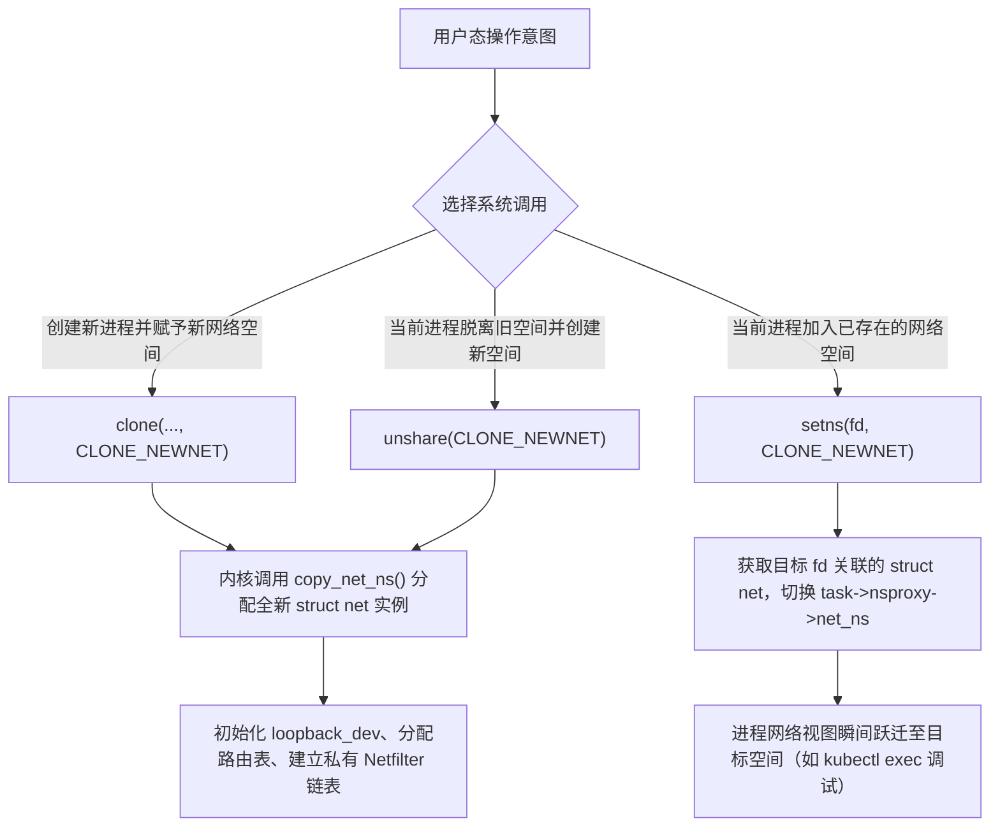
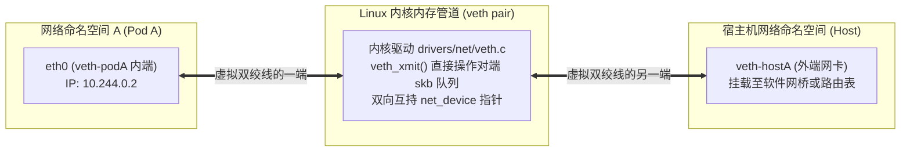
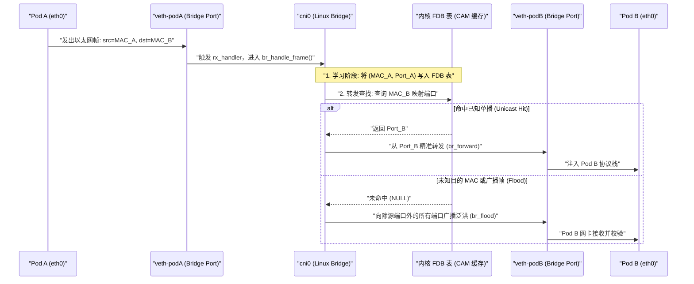
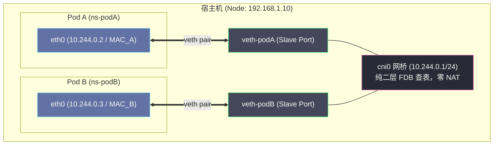
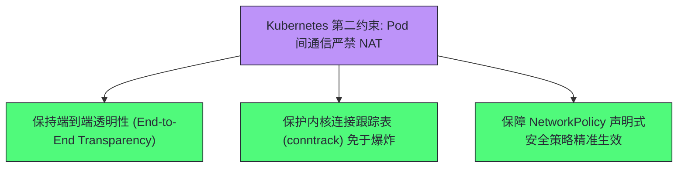
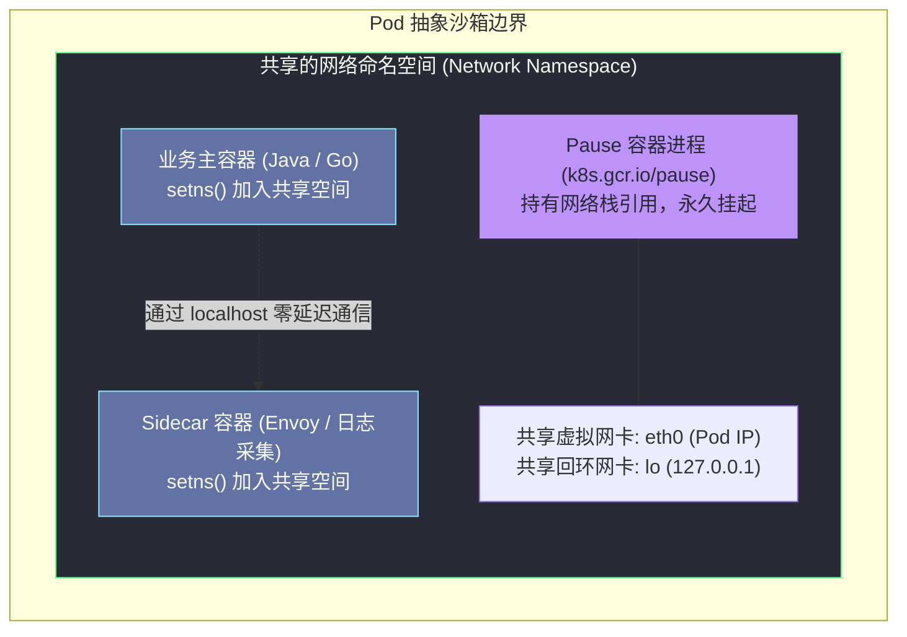
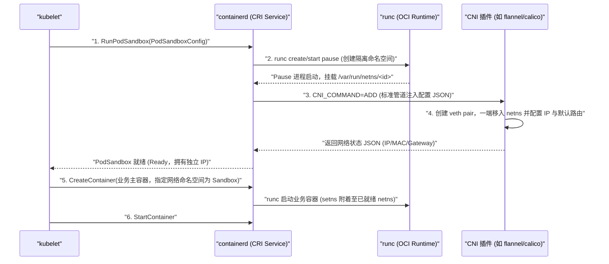
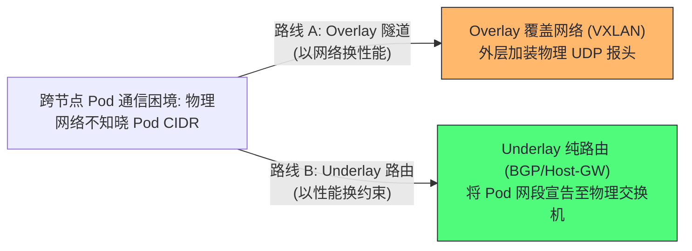
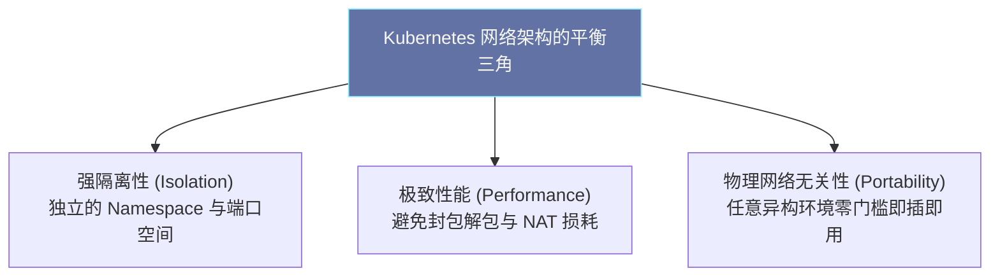

# Kubernetes网络模型——从Linux网络命名空间到Pod IP

**摘要：**

在容器技术初兴之时，跨主机容器互联曾深陷端口映射滥用与地址拓扑割裂的泥潭。Kubernetes 之所以能够确立容器编排的统治地位，其根基正在于确立了"IP-per-Pod"与扁平网络四大核心约束。本文沿着"Linux 内核原语如何支撑分布式容器网络抽象"这条主线，自底向上剖析网络命名空间（Network Namespace）在内核 `struct net` 结构体中的资源视图隔离本质，揭示虚拟以太网设备对（veth pair）在驱动层穿透命名空间的数据重定向机制，拆解 Linux 软件网桥（Linux Bridge）二层转发表学习与 ARP 广播风暴抑制逻辑；进而系统推导 Kubernetes 四大约束背后的反事实权衡与 Pause 容器在网络生命周期解耦中的设计考量，最终阐明 CNI 规范如何将这一系列严格约束转化为可执行的无状态插件契约。本文旨在解答两个核心问题：容器网络究竟是如何在内核中从虚拟孤岛组装为全连通拓扑的，以及为何违反 Kubernetes 四大网络约束必然导致上层分布式系统的架构性坍塌。

---

## 第 1 章 历史锚点：从端口映射的混沌到扁平网络的宪章

### 1.1 2014 年的前夕：Docker 端口映射模式的工程噩梦

要理解 Kubernetes 网络模型为何呈现出今天的形态，我们必须将时间推回至 2014 年容器化革命爆发的前夕。

在 Docker 刚刚风靡全球的早期阶段，工业界在享受容器秒级启动红利的同时，却在多主机组网上面临巨大的工程泥潭。彼时 Docker 默认推荐的互联方案，是一种承袭自传统物理机虚拟化初期的粗暴模式——单机桥接加宿主端口映射（Host Port Mapping，即命令行中常见的 `-p 8080:80`）。在这一机制下，运行在同一宿主机上的容器被挂载到 `docker0` 网桥上，分配形如 `172.17.0.x` 的本地私有 IP；当容器服务需要暴露给外部时，Docker 守护进程通过动态注入宿主机 iptables 的 PREROUTING 规则，执行目的地址转换（Destination Network Address Translation，后文简称 DNAT），将宿主机物理网卡上的端口劫持并重定向至容器内部端口。

这种在单机实验环境下看似轻巧的方案，一旦推向大规模分布式集群，便迅速蜕变为一场运维与架构灾难。

首先显现的是**宿主机端口管理地狱（Port Management Hell）**。在微服务架构愿景中，无状态服务理应能被集群调度器自由分配至任意空闲节点；但当端口成为全局共享且互斥的宿主资源时，调度算法的核心约束被迫从"计算资源余量"滑落为"目标机器的特定端口是否已被占用"。试想一个需要运行数百个实例的高并发 Web 前端，若其固定监听 80 端口，哪怕集群拥有成百上千个 CPU 核心空闲，一台宿主机也只能容纳一个实例运行；若为了规避冲突而退让为动态分配随机端口，服务消费者在发起远程过程调用（Remote Procedure Call，RPC）时，就必须维系一套极其沉重且极易失步的动态端口映射表。

更为致命的是，端口映射在物理层面上**撕裂了网络拓扑的端到端透明性（End-to-End Transparency）**。在经典的 IP 路由理念中，IP 地址不仅是寻址的路标，更是标识实体的第一层逻辑身份。但在 DNAT 的层层篡改下，一个数据包在离开源容器、穿透交换机并抵达目的容器的过程中，其源目的 IP 经历了多次不可逆的重写。当服务 B 接收到来自服务 A 的 HTTP 请求时，其底层 TCP 套接字获取到的对端地址，往往是源端宿主机通过源地址转换（Source Network Address Translation，SNAT）伪装的物理 IP。这种网络身份的模糊性，不仅使得基于客户端 IP 的安全访问控制列表（ACL）完全失效，更使得分布式链路追踪系统在排查丢包时陷入迷雾。

### 1.2 Borg 遗产与声明式网络：Google 为什么将“IP-per-Pod”确立为底线

正当社区在端口映射与动态网关的泥沼中挣扎时，Google 工程师带着内部集群管理系统 Borg 与 Omega 积累十余年的经验介入了战场。

在 Borg 系统的长期演进中，Google 内部也曾经历过应用端口冲突的阵痛，但他们最终确立了一项至关重要的信念：**基础设施的职责是替应用程序屏蔽物理分布的异构与复杂性，而非迫使应用程序为了适应简陋的基础设施去扭曲自身的通信模型**。在传统主机时代，开发者习惯于将每台机器视为独立网络端点，应用进程自由绑定 80 或 443 等标准端口；倘若容器编排平台因为引入进程隔离，反而迫使应用感知自己被调度到了哪个宿主节点的哪个临时映射端口，这种演进无疑是在开历史的倒车。

因此，在 2014 年 Kubernetes 项目立项之初，设计团队极其决绝地确立了 **"IP-per-Pod"（每个 Pod 拥有独立唯一 IP）** 原则。在这一宪章规约下，Pod 而非单个容器成为网络世界的一等公民；集群中每一个 Pod 都分得全局唯一的真实 IP，且任意两个 Pod 之间在默认情况下无需任何地址转换即可直接通过真实 IP 通信。

这一决策将原本属于运维人员的端口治理复杂度在底层网络抽象中一次性消化完毕。对于 Pod 内部的代码而言，外部网络环境与物理机房中的独立服务器毫无二致：Web 容器可以绑定 80 端口，MySQL 也可以绑定 3306 端口，外界只需直接访问对应的 Pod IP 即可完成寻址。这种对经典网络语义的回归，不仅使海量传统企业级应用无需改造即可平滑迁移，更使得服务发现、负载均衡、DNS 解析与网络策略能够基于纯粹而稳定的 IP 地址构建。

### 1.3 本文的推导逻辑：从单机内核原语到分布式网络契约

然而，理念的优雅必须依托坚实的工程实现。在同一台物理宿主机上密集运行着数十个 Pod 时，这些 Pod 共享着宿主机的同一颗 CPU 与同一张物理网卡；整个集群更可能横跨数百台分布在不同可用区的物理节点。在这样高度虚拟化的环境下，Kubernetes 究竟是如何凭空为每一个 Pod 创造出看似独立的真实 IP？这个 IP 又凭借什么机制能够跨越物理边界自由穿梭？

这绝非凭空降临的黑魔法，而是一场在 Linux 内核网络协议栈上持续了数十年的搭积木工程。为了彻底拆解这一精巧系统，本文遵循周志明先生在《凤凰架构》中所倡导的技术溯源路线，自底向上建立推导逻辑：

首先深入 Linux 内核网络栈，探寻 **Network Namespace（网络命名空间）** 在内核数据结构中的资源视图隔离本质；接着剖析 **veth pair（虚拟以太网设备对）** 穿透命名空间的数据包重定向驱动实现；随后在单机尺度分析 **Linux Bridge（软件网桥）** 如何扮演二层交换机并应对 MAC 学习与 ARP 广播风暴；在此基础上，将视角拉升至分布式系统高度，推导 **Kubernetes 网络四大约束** 的反事实设计动机与 **Pause 容器** 的生命周期解耦智慧；最后直面跨节点鸿沟，解析 **CNI（Container Network Interface）** 极简管道规范的诞生动因，并剖析生产中经典的 MTU 错配与内核参数故障。

---


### 1.4 Linux 网络协议栈演进全景：从单体内核到容器网络原语的时间锚点

若要彻底领悟 Kubernetes 网络模型的技术纵深，不妨将视线投射到过去二十余年间 Linux 操作系统在网络虚拟化原语演进上的宏大时间锚点：

| 年份 | 关键内核事件 / 行业里程碑 | 对容器与云原生网络的核心技术意义 |
| :--- | :--- | :--- |
| **1999 年** | Netfilter 架构正式并入 Linux 2.4 内核 | 确立了五大钩子（Hook）机制与 iptables，为单机数据包拦截、防火墙过滤与 NAT 地址转换奠定底层地基。 |
| **2000 年** | Linux 软件网桥（Bridge）代码合并入主线 | 实现了在软件层面模拟 IEEE 802.1D 二层以太网交换机的能力，成为后续单机多容器交换网络的基石。 |
| **2007 年** | 虚拟以太网设备对（veth pair）驱动并入内核 | 创造出能够在不同网络空间之间高速穿透的虚拟导线，解决了跨作用域数据重定向的核心难题。 |
| **2008 年** | Network Namespace 随 Linux 2.6.24 隆重登场 | 彻底终结了单机共享网络单例的历史，实现了每命名空间独占网络设备、路由表与端口空间的视图隔离。 |
| **2013 年** | Docker 正式开源并迅速引爆容器技术革命 | 将 Linux Namespace 与 CGroups 打包为标准化镜像，推动了以 `docker0` 端口映射为主的初代容器组网实践。 |
| **2014 年** | Google 携 Borg 生产经验正式开源 Kubernetes | 彻底摈弃端口映射妥协，颁布"IP-per-Pod"与扁平互联宪法契约，重塑分布式容器网络基本法。 |
| **2015 年** | CoreOS 联合开源社区正式推出 CNI 0.1.0 规范 | 以极简的 Unix 管道哲学定义运行时与网络插件的解耦边界，开启了云原生网络插件的繁荣纪元。 |

透过这组跨越二十余载的时间序列，我们可以清晰地体悟到：Kubernetes 网络模型绝非某种凭空捏造的空中楼阁，它恰如其分地站在了 Linux 内核数十载网络协议栈演进的巨人之肩上。

---

## 第 2 章 Linux Network Namespace——内核隔离原语的底层真相

### 2.1 命名空间的本质：并非虚拟化，而是内核资源视图的“作用域重定向”

在探讨容器网络时，许多工程师容易产生误解，误以为容器内部网络栈是由某种轻量 Hypervisor 虚拟化出的独立硬件镜像。但事实上，容器网络与以 KVM 为代表的硬件虚拟化有着根本区别。在硬件虚拟化中，Hypervisor 必须在软件层模拟真实的芯片组、PCIe 总线与网卡寄存器，带来显著的时延与内存开销；而 Linux 容器所依赖的 **Network Namespace（网络命名空间）**，本质上仅仅是内核对全局网络子系统资源的**视图作用域隔离（Scoped View Isolation）**。

在未启用网络命名空间前，整个 Linux 内核运行着一套统一、全局共享的网络协议栈。全系统所有进程看到的网络接口（如 `eth0`、`lo`）、依赖的路由查找逻辑（FIB 表）、防火墙规则（Netfilter 链表）、连接跟踪状态（conntrack 表）以及 TCP/UDP 端口空间（0 至 65535），在宿主机上都是独一份的全局变量。倘若一个 Nginx 进程占用了 TCP 80 端口，其他进程调用 `bind()` 时便会遭遇 `EADDRINUSE` 错误。

Linux 内核在 2008 年的 2.6.24 版本正式引入 Network Namespace 机制，将网络子系统的核心数据结构从全局单例重构为结构体指针数组，赋予每个命名空间完全自治的资源实例。

| 核心网络资源 | 全局单命名空间状态（传统主机） | 启用 Network Namespace 后的状态（容器化） |
| :--- | :--- | :--- |
| **网络设备接口（net_device）** | 宿主机所有网卡共享，可见性全局唯一 | 每个 Namespace 独占自己的接口列表，互不可见 |
| **本地环回接口（loopback）** | 仅有一个 `127.0.0.1` 环回设备 | 每个 Namespace 拥有完全独立的 `lo` 设备与回环栈 |
| **IP 地址与掩码** | 同一网卡上配置的 IP 全系统可见 | IP 绑定至各 Namespace 内部接口，跨空间 IP 允许相同 |
| **IP 路由表（FIB Table）** | 全局统一维护 `local` 与 `main` 表 | 每个 Namespace 维护完全独立的三层路由转发判定表 |
| **端口空间（Port Allocation）** | 0-65535 端口全机唯一，强互斥 | 0-65535 端口空间完全独立，各 Namespace 可同时监听 80 |
| **防火墙与 NAT 链表** | 全局 iptables / nftables 规则 | 每个 Namespace 拥有独立的 Netfilter 钩子链与规则集合 |
| **连接跟踪（conntrack）** | 全局共享同一张哈希表维护状态 | 独立的连接跟踪表实例，隔离并发连接追踪上限 |
| **ARP 邻居缓存表** | 全局共享同一份 IP-MAC 映射缓存 | 各自维护独立的二层地址解析协议（ARP）解析缓存表 |

> [!info] 核心认知：作用域重定向而非硬件隔离
> 容器内的网络进程依然在宿主机同一颗 CPU 上运行，执行完全相同的内核系统调用。所谓网络隔离，仅仅是因为该进程发起网络操作时，内核通过其上下文指针将其引流至独立的 `struct net` 内存对象中。这印证了操作系统设计中的箴言：**所有问题都可以通过引入一个间接寻址层来解决**。

### 2.2 内核数据结构：剖析 task_struct、nsproxy 与 struct net

要严谨审视这种隔离，我们必须深入内核源码查看进程与网络命名空间的绑定关系。

在 Linux 内核中，任何任务均由 `task_struct` 表达（定义于 `include/linux/sched.h`）。在 `task_struct` 内部，包含着一个指向命名空间代理集合的指针：

```c
struct task_struct {
    /* ... 进程调度与内存描述符 ... */
    struct nsproxy *nsproxy;
    /* ... 凭据、文件系统与信号处理 ... */
};
```

该 `nsproxy`（定义于 `include/linux/nsproxy.h`）汇聚了各类命名空间指针，其中便包含网络命名空间指针 `net_ns`：

```c
struct nsproxy {
    atomic_t count;
    struct uts_namespace *uts_ns;
    struct ipc_namespace *ipc_ns;
    struct mnt_namespace *mnt_ns;
    struct pid_namespace *pid_ns_for_children;
    struct net           *net_ns;  /* 指向当前进程所属的网络命名空间核心实体 */
    struct cgroup_namespace *cgroup_ns;
    struct time_namespace *time_ns;
};
```

顺着指针便能看到内核网络子系统的核心实体——`struct net`（定义于 `include/net/net_namespace.h`）。网络设备链表表头便位于该结构体中：

```c
struct net {
    refcount_t          passive;
    refcount_t          count;
    struct list_head    list;       /* 系统所有 net 命名空间的主链表 */
    struct list_head    dev_base_head; /* 该命名空间下拥有的所有网络接口链表 */
    struct net_device   *loopback_dev; /* 独立的本地环回设备 */
    struct netns_ipv4   ipv4;       /* 独立的 IPv4 路由信息库（FIB）与配置 */
#if IS_ENABLED(CONFIG_IPV6)
    struct netns_ipv6   ipv6;
#endif
#if defined(CONFIG_NF_CONNTRACK)
    struct netns_ct     ct;         /* 独立的 Netfilter 连接跟踪表 */
#endif
    struct netns_xt     xt;         /* 独立的 iptables 实例规则链 */
};
```

当进程在用户态调用 `socket(AF_INET, SOCK_STREAM, 0)` 时，内核系统调用入口首先通过 `current` 宏获取当前 `task_struct`，继而沿着 `current->nsproxy->net_ns` 获取该进程所属的 `struct net`。此后无论是 `bind()` 端口还是 `connect()` 路由查询，操作范围均被死死限制在私有作用域之内。两个不同命名空间的进程即便同时监听 `0.0.0.0:8080`，由于向各自私有的监听哈希表注册条目，彼此完全互不干扰。

### 2.3 三大系统调用：clone(CLONE_NEWNET)、unshare() 与 setns()

在用户空间，Linux 提供了三组精简但功能关键的系统调用，用于控制进程网络命名空间的创建与切换：



1. **`clone(..., CLONE_NEWNET)`**：容器运行时（containerd/CRI-O）创建新容器时调用。内核在 `copy_process()` 流中触发 `copy_net_ns()`，分配全新 `struct net` 实例并初始化独立的设备链表与回环网卡，新进程从诞生起便处于独立网络空间。
2. **`unshare(CLONE_NEWNET)`**：允许正在运行的当前进程主动脱离现存网络命名空间，由内核为其分配新的 `nsproxy` 与 `struct net`，常用于单机隔离沙箱。
3. **`setns(int fd, int nstype)`**：允许进程跃迁加入已存在的命名空间。在 Linux 虚拟文件系统中，每个进程所属的网络命名空间均投影于 `/proc/<pid>/ns/net` 文件。当我们执行 `kubectl exec` 或使用 `nsenter -t <pid> -n` 排障时，底层正是通过打开该文件获取描述符，并调用 `setns(fd, CLONE_NEWNET)` 将调试进程的 `nsproxy->net_ns` 指向目标容器的 `struct net`。

### 2.4 初始命名空间的蛮荒状态：一个只有 DOWN 状态 lo 的绝对孤岛

理解命名空间刚创建时的状态至关重要。我们通过底层命令观察初始命名空间：

```bash
# 创建命名空间并查看内部接口
ip netns add ns-isolated
ip netns exec ns-isolated ip link show
```

输出简洁而冰冷：
```text
1: lo: <LOOPBACK> mtu 65536 qdisc noop state DOWN mode DEFAULT group default qlen 1000
    link/loopback 00:00:00:00:00:00 brd 00:00:00:00:00:00
```

此时空间内除处于关闭（DOWN）状态的回环网卡 `lo` 外别无它物，没有以太网网卡，没有单播 IP，路由表更是空空如也：

```bash
ip netns exec ns-isolated ip route show
# 输出为空
```

若进程此时发起外联，内核三层路由查找失败将直接抛出 `ENETUNREACH`（网络不可达）。这表明：**网络命名空间仅负责隔离，本身不具备自动构建连通性的机制**。它好比一座绝海孤岛，必须依赖外部工具在其与宿主机之间架设计算机网络的通信通道并分配地址，而承担这一任务的第一根导线正是 veth pair。

### 2.5 生产边界与反例：网络命名空间句柄泄漏与 nsenter 调试陷阱

网络命名空间虽轻量，但绝非零成本。内核释放 `struct net` 遵循严格引用计数，要求空间内所有进程退出且没有外部文件描述符持有引用。在频繁拉起短周期批处理作业的集群中，若某些监控 Agent 通过 `open("/proc/<pid>/ns/net")` 获取句柄后未在 Pod 销毁时及时 `close()`，将引发**网络命名空间文件描述符泄漏**。

此时即使 Pod 已被删除，其底层的 `struct net` 内存、路由表与连接跟踪表依然常驻内核。当累积的僵尸网络命名空间达到数万量级时，执行 `ip link` 遍历接口会引发严重的内核全局锁争用，甚至导致宿主机 CPU 瞬时飙升。

此外，使用 `nsenter -t <pid> -n` 进行网络诊断时，进程虽然切换了网络空间，但挂载空间仍停留在宿主机，读取的 `/etc/hosts` 与 `/etc/resolv.conf` 依然是宿主机配置；若过度使用全量切换空间，又往往由于精简镜像内部缺乏排障二进制（如 `tcpdump`、`curl`）而受阻。合理利用宿主机静态编译工具结合精准网络空间附着，是生产调试的基本准则。

---

## 第 3 章 veth pair——击穿命名空间边界的虚拟导线

### 3.1 跨越空间的虫洞：虚拟以太网设备对的成对生成与跨空间迁移

为了打破命名空间的绝壁，Linux 内核提供了 **veth pair（Virtual Ethernet Pair，虚拟以太网设备对）**。

veth 设备在内核中具有**成对孪生属性（Twin Device Property）**。你无法在系统中创建单张孤立的 veth 网卡，每一次创建请求都会生成一对绑定的设备对（如 `veth-a` 与 `veth-b`）。这对设备好比一根虚拟双绞线的两端：从 `veth-a` 注入的数据包，会直接从 `veth-b` 的接收队列中涌现；反之亦然。



veth pair 的核心威力在于**允许跨越命名空间边界迁移**。在默认命名空间创建设备对后，管理员可通过 `ip link set veth-a netns <pod-ns>` 将其中一端移入容器内部并重命名为 `eth0`，而另一端保留在宿主机空间。由此，两个分属不同世界的网络实体被这根内核虚拟导线紧密连通。

### 3.2 内核驱动源码剖析：深入 drivers/net/veth.c 与 veth_xmit()

物理网卡在发送报文时需配置 DMA 环形缓冲区、操作硬件寄存器并通过 PHY 芯片发送；而 veth 驱动（`drivers/net/veth.c`）中完全剥离了硬件逻辑。每个 veth 设备的私有结构体 `veth_priv` 极其精炼：

```c
struct veth_priv {
    struct net_device __rcu *peer;      /* 核心成员：RCU 保护的直连对端网卡指针 */
    atomic64_t              dropped;
    struct bpf_prog         *_xdp_prog; /* 允许挂载的 XDP 高性能数据面程序 */
};
```

当数据包从 `veth-a` 发送时，内核调用其网络设备传输函数 `veth_xmit()`：

```c
static netdev_tx_t veth_xmit(struct sk_buff *skb, struct net_device *dev)
{
    struct veth_priv *priv = netdev_priv(dev);
    struct net_device *rcv;

    /* 1. 借助 RCU 极速抓取对端设备的 net_device 指针 */
    rcv = rcu_dereference(priv->peer);
    if (unlikely(!rcv)) {
        kfree_skb(skb);
        dev->stats.tx_dropped++;
        return NETDEV_TX_OK;
    }

    /* 2. 剥离并重置当前数据包的硬件头部与路由缓存上下文 */
    skb_orphan(skb);
    skb->protocol = eth_type_trans(skb, rcv);

    /* 3. 将接收设备指针直接重置为对端设备，正式完成命名空间跨越 */
    skb->dev = rcv;

    /* 4. 将该 skb 塞入对端设备的接收处理流，触发软中断收包 */
    if (likely(dev_forward_skb(rcv, skb) == NET_RX_SUCCESS)) {
        struct pcpu_dstats *dstats = this_cpu_ptr(dev->dstats);
        u64_stats_update_begin(&dstats->syncp);
        dstats->tx_packets++;
        dstats->tx_bytes += skb->len;
        u64_stats_update_end(&dstats->syncp);
    } else {
        dev->stats.tx_dropped++;
    }

    return NETDEV_TX_OK;
}
```

这里没有硬件层面的重新调制，本质上是对套接字缓冲区 `struct sk_buff`（skb）实施的内存指针重定向。`skb->dev = rcv` 瞬间改写了数据包所属的网络设备上下文，随后被 `dev_forward_skb()` 直接投递至对端协议栈触发软中断收包。这种纯内存移交赋予了 veth pair 极高的吞吐与极低的时延。

### 3.3 生产拓扑印记：宿主机视角下的 veth@ifX 命名规则与 peer_ifindex

在 Kubernetes 节点上执行 `ip link show` 常会看到形如 `veth9c23da1@if3` 的接口：

```text
5: veth9c23da1@if3: <BROADCAST,MULTICAST,UP,LOWER_UP> mtu 1500 qdisc noqueue master cni0 state UP
    link/ether 3e:1a:8b:2d:4f:91 brd ff:ff:ff:ff:ff:ff link-netns cni-8d9b23
```

冒号前的数字 `5` 代表该设备在宿主机上的接口索引（`ifindex`）；`@if3` 则代表其对端在容器内部的 `ifindex` 是 3。在生产排障中，通过以下方式可建立映射：
1. **容器内反查**：在 Pod 内执行 `ip link show eth0`，若显示 `3: eth0@if5`，即可确认宿主机外端网卡 `ifindex` 为 5；
2. **利用 ethtool 查询**：在宿主机执行 `ethtool -S veth9c23da1`，输出中的 `peer_ifindex: 3` 直接指明了对端接口编号，配合命名空间遍历即可完成元数据拓扑锁定。

### 3.4 局限与演进压力：两两互联的 O(N^2) 连线灾难

通过 veth pair，两个容器之间的通信问题得以解决。但在单机多容器场景下，若依赖 veth pair 两两直连，连接 $N$ 个容器需要 $rac{N(N-1)}{2}$ 对虚拟设备。当 $N=100$ 时需要 4950 对 veth pair（9900 个接口），每个容器内部需塞入 99 张网卡与庞大的静态路由，扩容时更是牵一发而动全身。

这一困境与早期计算机局域网如出一辙。解决 $O(N^2)$ 连线灾难的标准答案是引入星型拓扑枢纽——Linux Bridge。

---

## 第 4 章 Linux Bridge——单节点多 Pod 的虚拟交换矩阵

### 4.1 软件二层交换机的实现：struct net_bridge 与端口模型

面对多容器连接膨胀，标准解法是引入集中式星型拓扑：每个 Pod 内部保留单一网卡 `eth0`，其外端全部汇聚插入宿主机的共享"虚拟交换机"端口。在 Linux 内核中，该原语便是 **Linux Bridge（软件网桥）**。

在内核实现层面，`struct net_bridge`（定义于 `net/bridge/br_private.h`）扮演着二层数据链路层实体。当网络接口加入网桥成为从属端口（Slave Port）时，内核通过 `netdev_rx_handler_register()` 注册网桥接收逻辑，短路其原有的三层协议栈入口，数据帧统一由网桥转发函数 `br_handle_frame()` 接管调度。

### 4.2 数据帧处理链路：深入内核 br_handle_frame()、MAC 地址自学习与泛洪

Linux Bridge 复刻了以太网交换机的三大基本动作：**MAC 学习、单播查表转发与未知地址泛洪**。



1. **源地址自学习**：数据帧进入端口后触发 `br_handle_frame()`，网桥提取源 MAC 地址并调用 `br_fdb_update()`，在转发数据库（Forwarding Database，FDB）中记录 `(MAC_A, Port_A)` 映射并刷新超时时间；
2. **目的查找与转发**：网桥检索目的 MAC 地址，若命中 FDB 且目标端口不同于源端口，调用 `br_forward()` 实施单播精准投递；若目的 MAC 未知或为广播地址（`ff:ff:ff:ff:ff:ff`），调用 `br_flood()` 向所有其他端口泛洪复制。

通过 `bridge fdb show dev cni0` 可实时查看 FDB 表项，其内部动态自学习的微型哈希表维系着同节点多容器纯二层转发的秩序。

### 4.3 生成树协议（STP）的取舍：为何容器网桥必须默认关闭 STP

物理网络中接入层交换机强制开启 **STP（Spanning Tree Protocol，生成树协议）** 以防止物理环路引发广播风暴。但在 Kubernetes 容器网桥（如 `cni0`）初始化时，CNI 插件普遍默认将 STP 彻底关闭（设为 `0`）。

取舍依据在于：
首先，单机容器星型拓扑不存在物理环路风险；
更关键的是收敛延迟。根据标准，新端口加入开启 STP 的网桥需经历 **Listening（15 秒）** 与 **Learning（15 秒）** 共 30 秒阻断期。在此期间端口严禁转发业务数据。若开启 STP，容器即使 1 秒启动完毕，也必须无所事事等待 30 秒方能发包，其健康检查探针必将全部超时失败，导致 Pod 陷入 Crash 循环。因此关闭 STP 是软件定义网络以确定性拓扑换取秒级调度的经典权衡。

### 4.4 ARP 广播与二层风暴：同节点容器通信的 ARP 解析时序与 gc_thresh

Pod A（`10.244.0.2`）向同节点 Pod B（`10.244.0.3`）初次通信时，需经过 ARP 解析：
1. Pod A 广播 ARP 请求报文；
2. 数据帧穿过 veth pair 抵达网桥端口，网桥记录源 MAC 并执行全端口泛洪；
3. Pod B 接收并单播应答自身 MAC；
4. Pod A 缓存 ARP 映射并展开正式业务通信。

在高密节点上，高并发短连接业务可能引发 ARP 缓存溢出。Linux 内核管理 IPv4 ARP 表的三组关键参数如下：

```bash
net.ipv4.neigh.default.gc_thresh1 = 128   # 垃圾回收触发下限
net.ipv4.neigh.default.gc_thresh2 = 512   # 软上限：超过此值 5 秒后强制 GC
net.ipv4.neigh.default.gc_thresh3 = 1024  # 硬上限：超过此值直接拒绝分配新邻居项
```

一旦突破 `gc_thresh3`，内核将打印 `neighbor table overflow` 并直接静默丢包，导致建连超时。在生产节点上，通常需将参数调优至 `4096 / 8192 / 16384`。

### 4.5 同节点 Pod 通信全链路图解与抓包验证

同节点内两个 Pod 间通信拓扑如下：




### 4.4 跨越二层与三层的幽灵桥梁：br_netfilter 与 bridge-nf-call-iptables

在单节点容器网络架构中，除了纯粹的二层交换之外，还存在着一个令无数初学者乃至资深运维感到极度困惑的内核机制——**`br_netfilter` 模块与 `net.bridge.bridge-nf-call-iptables` 参数**。

在标准的 TCP/IP 协议栈分层设计中，二层交换与三层路由有着不可逾越的鸿沟：二层网桥只关心以太网帧头部的 MAC 地址，数据帧在 Slave 端口之间的转发完全停留在数据链路层，绝无资格去触碰属于网络层的 Netfilter 防火墙规则链表（如 iptables 的 PREROUTING 与 FORWARD 链）。
但在 Kubernetes 的网络世界里，这一经典分层规则再次被迫做出了妥协。
试想这样一个场景：两个运行在同一宿主机、挂接在同一个 `cni0` 网桥上的 Pod（譬如 Pod A 与 Pod B），它们之间的所有通信都是纯粹的同子网二层直连。如果 Linux Bridge 恪守二层交换的本分，数据包从 `veth-podA` 进来直接被网桥送入 `veth-podB`，那么整个过程将完全绕过宿主机的 Netfilter 钩子。
这会带来什么严重后果？
**后果是 Kubernetes 的 `NetworkPolicy` 与 Service 负载均衡在单机 Pod 间通信中将彻底瘫痪**。因为 NetworkPolicy 的安全隔离规则正是编译为 iptables/ipset 条目部署在宿主机网络栈中的。如果单机二层流量不经过 iptables 检查，那么无论你在 NetworkPolicy 里如何严格声明禁止 Pod A 访问 Pod B，Pod A 都能毫无阻碍地直连 Pod B。

为了解决这一矛盾，Linux 内核引入了 `br_netfilter` 内核模块。当该模块被加载并在宿主机开启 `net.bridge.bridge-nf-call-iptables = 1` 后，网桥代码在二层处理钩子（`NF_BR_PRE_ROUTING`）处施展了一场偷梁换柱的绝技：它强行解构以太网帧内部封装的 IPv4 报头，将二层数据帧强行推入三层 Netfilter 架构的 `NF_INET_PRE_ROUTING` 链中进行过滤和规则匹配，随后在确定放行后再返回二层网桥继续转发。
这种跨越二三层分界线的"作弊"设计，虽被网络纯粹主义者视为破坏分层原则的妥协之举，却以极小的系统代价在单节点二层网络上赋予了 Kubernetes 执行全局声明式安全策略的绝对控制力。

### 4.5 同节点 Pod 通信全链路图解与抓包验证

在 `cni0` 上执行抓包（`tcpdump -i cni0 -nn -e`），可见数据帧头部的 MAC 地址与两个 Pod 内部真实物理网卡一一对应，三层 IP 头毫无 NAT 篡改，享受着局域网交换机般的纯粹与低延迟。

---

## 第 5 章 Kubernetes 网络四大约束——分布式系统的宪法契约

### 5.1 约束一：所有 Pod 拥有唯一且集群可路由的独立 IP

当计算节点扩展至成千上万台时，单机网桥无法承担全网互联使命。Kubernetes 据此制定了四条基础网络约束。

第一条约束要求：**集群中每个 Pod 必须分配全局唯一且全集群可路由寻址的独立 IP**。该约束彻底消除了单机宿主端口对应用调度的束缚，避免了端口碎片化冲突，并使服务发现体系只需维护纯粹的 IP 端点。

### 5.2 约束二：所有 Pod 之间无需 NAT 直接通信

第二条约束要求：**任意两个 Pod 之间无论是否在同节点，默认必须直接通过对方 Pod IP 通信，严禁 NAT 转换**。



杜绝 NAT 的三大核心动因：
1. **源 IP 透明透传**：维持应用层审计、地理识别与风控防刷的原始端点身份；
2. **避免 conntrack 状态爆炸**：NAT 属于内核有状态协议重写，高并发下极易撑爆 `nf_conntrack` 表导致全机丢包；
3. **保障 NetworkPolicy 准确生效**：网络安全策略依赖数据包真实的源 IP 匹配身份标签，NAT 伪装将导致安全防线全面失效。

### 5.3 约束三：所有 Node 可以直接访问集群中所有 Pod

第三条约束要求：**宿主机自身必须能够直接通过 Pod IP 访问集群中任意 Pod，反之亦然**。

kubelet 依靠该能力执行健康检查存活探针（Liveness）与就绪探针（Readiness）；kube-proxy 亦依托宿主网络栈对 Service 流量进行转发，若宿主无法路由 Pod IP，控制面与转发面将失去立足点。

### 5.4 约束四：Pod 看到的自身 IP 与外界看到的 IP 完全一致

第四条约束要求：**Pod 内部看到的自身 IP，必须与外界看到及注册中心记录的 IP 完全一致**。

该约束消除了非对称网络双重地址空间的灾难，确保诸如 Kafka、ZooKeeper、ETCD 等依赖 Gossip 协议或心跳协商自身声明地址的分布式系统能够正常运行。

### 5.5 反事实推导：假若破坏任意一条约束的灾难性后果

| 违反的约束条目 | 假设引入的替代实现方案 | 系统层面必然爆发的连锁灾难 |
| :--- | :--- | :--- |
| **破坏约束一**<br/>（取消唯一 Pod IP） | 倒退回单机宿主端口随机映射模式 | 调度器面临严重端口碎片化死锁；微服务横向扩容受物理端口数量限制。 |
| **破坏约束二**<br/>（允许跨机通信执行 SNAT） | 节点向外发送 Pod 流量时改写为物理宿主 IP | 目标端无法获取真实客户端身份，审计失真；宿主 conntrack 表爆满；NetworkPolicy 失效。 |
| **破坏约束三**<br/>（节点无法直连 Pod IP） | 节点与 Pod 之间强制经过应用反向代理 | kubelet 探针延迟暴增；Prometheus 无法直接抓取 metrics；kube-proxy 复杂度倍增。 |
| **破坏约束四**<br/>（允许 Pod 内外 IP 不一致） | 内部使用私网 IP，外部注册映射后公网 IP | 分布式共识组件选举与心跳失败；基于 mTLS 证书 SAN 校验的握手全面阻断。 |

---


### 5.6 约束落地：内核路由表的条目组织机制

为了让第二约束（Pod 间无需 NAT 直接通信）与第三约束（Node 可直连所有 Pod）落地，宿主机的内核路由表必须严密组织。

在以纯路由或主机网关（Host-GW）模式运行的集群中，每个节点被分配一个子网（譬如 Node-1 分得 `10.244.0.0/24`，Node-2 分得 `10.244.1.0/24`）。每个节点的内核路由表会由 CNI 守护进程注入两类关键规则：

```text
# Node-1 宿主机上的核心路由表项
10.244.0.0/24 dev cni0 proto kernel scope link src 10.244.0.1  # 规则 A: 本地 Pod 子网路由
10.244.1.0/24 via 192.168.1.11 dev eth0                        # 规则 B: 远端 Node-2 的 Pod 子网路由
default via 192.168.1.1 dev eth0                               # 规则 C: 宿主机外部默认网关
```

- **对于发往本地 Pod 的报文**：匹配规则 A，数据包被直接推向 `cni0` 软件网桥，由网桥查询 FDB 表完成二层单播投递；
- **对于发往跨机 Pod 的报文**：匹配规则 B，内核查表获知下一跳为 Node-2 的物理 IP `192.168.1.11`，数据包直接通过物理网卡 `eth0` 射出，其三层源目的 IP 保持原始状态（`10.244.0.2 -> 10.244.1.3`），完全规避了 NAT 重写；
- **对于 Pod 访问互联网外网的报文**：由于目标 IP 无法匹配任何 Pod 子网，报文命中规则 C 被引流出宿主机，并在宿主机的物理网卡处触发基于 iptables 的 SNAT（MASQUERADE），将源 IP 临时替换为宿主机物理 IP 以满足公网路由寻址要求。

这种分流逻辑既满足了集群内部通信的纯粹性，又兼顾了集群向外访问的现实兼容性。

---

## 第 6 章 Pause 容器与 Pod 网络的生命周期编排

### 6.1 进程组与网络栈的解耦：Pause 容器的极简汇编实现

既然以 Pod 为单位分配唯一网络空间，那么谁来充当网络命名空间的法定持有者？

Pod 是一组松耦合的协作进程集合。若将网络空间绑定至主业务容器，一旦主容器因 OOM 崩溃或升级重启，整个命名空间将随之销毁，网卡与 IP 瞬间荡然无存。为此，Kubernetes 引入了 **Pause 容器（Infra 容器）**。



Pause 容器剥离了所有复杂业务逻辑，其核心源码（`pause.c`）极度简短：

```c
#include <signal.h>
#include <stdio.h>
#include <stdlib.h>
#include <sys/types.h>
#include <sys/wait.h>
#include <unistd.h>

static void sigdown(int signo) {
    psignal(signo, "Shutting down, got signal");
    exit(0);
}

static void sigreap(int signo) {
    while (waitpid(-1, NULL, WNOHANG) > 0)
        ;
}

int main() {
    if (signal(SIGINT, sigdown) == SIG_ERR)
        return 1;
    if (signal(SIGTERM, sigdown) == SIG_ERR)
        return 2;
    if (signal(SIGCHLD, sigreap) == SIG_ERR)
        return 3;

    /* 彻底交出 CPU，永久睡眠挂起 */
    for (;;)
        pause();

    return 0;
}
```

镜像大小仅数百 KB，启动后调用 `pause()` 放弃 CPU 调度，并作为 PID 1 进程负责收割孤儿进程，防止僵尸进程泄漏。

### 6.2 容器生命周期的“金字塔”：为何业务容器重启不会引发 Pod IP 漂移

借助 Pause 容器，Kubernetes 实现了分层解耦编排：
1. **基底建立**：kubelet 首先调用运行时拉起 Pause 容器，创建独立的网络命名空间；
2. **网络铺设**：运行时调用 CNI 插件，向该空间打入 veth pair、分配 IP 并配置默认路由；
3. **业务附着**：随后拉起业务容器时，运行时通过 `setns()` 将其加入已就绪的 Pause 命名空间中。

即便业务容器反复崩溃重启，Pause 容器依然驻留，`struct net` 引用计数不为零，Pod IP 与路由网卡不会发生丝毫漂移，上层 Service 与 DNS 记录保持绝对稳定。


### 6.4 CRI 调用链路与 PodSandbox 的装配时序

在现代 Kubernetes 运行时（以 containerd 为例）架构中，Pause 容器与网络的装配是一个由 **CRI（Container Runtime Interface）** 严格编排的微观状态机：



整个过程展现了极为清晰的职责分工：
1. **kubelet** 发起 `RunPodSandbox` gRPC 请求，声明需要创建运行环境；
2. **CRI 运行时** 调用底层的 OCI 规范实现（如 `runc`），以带有 `CLONE_NEWNET` 的标志派生出 Pause 进程，并在宿主机文件系统中固化网络命名空间文件句柄；
3. **CNI 插件** 作为一个独立的外部工具被触发，以毫秒级速度完成网络虚拟导线的焊接与 IP 分配；
4. **业务容器** 随后以附着者的姿态加入，天然继承了所有的网络管道资产。

### 6.3 共享网络栈的利与弊：localhost 极速 IPC 与端口抢占冲突

**收益**：同 Pod 内容器通过 `127.0.0.1` 展开回环通信，不经过外部网桥，微秒级延迟使 Sidecar 模式（如 Envoy 流量劫持）在生产中具备极高的可行性；
**代价**：容器间丧失端口隔离，若业务容器与 Sidecar 均试图绑定 8080 端口将触发冲突，架构团队必须制定规范的端口分配约束。

---

## 第 7 章 跨节点通信的本质困境与 CNI 的诞生

### 7.1 跨节点的鸿沟：Underlay 路由 vs Overlay 隧道的基本矛盾

当 Node-A 上的 Pod-A（`10.244.0.2`）访问 Node-B 上的 Pod-B（`10.244.1.3`）时，数据包抵达 Node-A 物理网卡后进入物理交换机。由于机房物理交换机仅知晓宿主机网段（`192.168.1.0/24`），对私有 Pod CIDR 一无所知，常规路由器将直接丢弃该报文。

为解决跨节点直通问题，工业界演进出两条路线：



- **Overlay 覆盖网络（封包隧道）**：在数据包出宿主机前包裹一层外层 UDP/IP 报头（如 VXLAN），将 Pod 报文作为 Payload。物理网络仅负责搬运外层报文，对物理拓扑零侵入，但面临封解包 CPU 损耗与 MTU 折损；
- **Underlay 纯路由网络**：要求节点同处于二层域（Host-GW）或借助动态路由协议（BGP）将 Pod 路由宣告至机房交换机，数据包原生线速转发，但对物理网络架构有强依赖。

### 7.2 规范与实现的分离：为什么 Kubernetes 坚决委托给 CNI 插件生态

面对公有云 VPC、裸金属物理机以及混合云环境的复杂差异，Kubernetes 坚守职责边界：**不在内核硬编码网络实现，仅制定声明式网络宪章，将实现委托给 CNI 插件生态**。

### 7.3 CNI 的极简主义：Unix 管道哲学在云原生时代的复兴

CNI 规范贯彻了 Unix 极简哲学。插件并非驻留内存的 Daemon，而是存放在 `/opt/cni/bin/` 下的独立可执行二进制程序。运行时与其交互流程清晰：
1. **环境变量传参**：传递 `CNI_COMMAND=ADD/DEL`、`CNI_NETNS`、`CNI_IFNAME=eth0`；
2. **标准输入推配置**：通过 stdin 管道传入 JSON 配置文本；
3. **标准输出收结果**：插件配置内核原语后，通过 stdout 返回分配结果 JSON；
4. **退出码表状态**：返回 `0` 代表成功，非零代表异常。

无状态的管道设计确保插件自身的瞬时异常绝不干扰存量网络，铸就了繁荣的 CNI 生态。

在 CNI 规范中，主网络插件通常并不直接负责具体的 IP 地址分配，而是遵循 Unix 单一职责原则，将这一重任委派给独立的 **IPAM（IP Address Management，IP 地址管理）子插件**。在 Flannel 与基础 Bridge 网络中，最常用的 IPAM 插件便是 **`host-local`**。
`host-local` 的工作机制朴素而高效：flanneld 守护进程首先向集群注册并锁定属于当前节点的唯一子网网段（譬如 `10.244.1.0/24`），随后将其固化在 `/var/lib/cni/networks/<network-name>/` 目录下。当 containerd 调用 CNI ADD 时，主插件调用 `host-local` 二进制；`host-local` 在本地磁盘目录下通过对子网目录加设**跨进程文件锁（`flock`）**，遍历以已分配 IP 命名的租约文本文件（文件内容即为目标容器的 `ContainerID`），顺序寻找下一个未被占用的空闲 IP 并原子创建文件写入租约。整个分配逻辑既不需要依赖任何高延迟的网络 RPC，也不会与其他宿主机发生 IP 分配碰撞。当 Pod 销毁触发 CNI DEL 时，`host-local` 只需删除对应 IP 的文件即可完成资源归还。这种完全下沉到本地文件系统的设计，赋予了 Pod 批量创建时惊人的毫秒级网络就绪响应速度。


---


### 7.4 CNI 标准输入输出协议与 JSON 报文现场还原

为了让读者对 CNI 的管道交互建立直观感知，我们不妨还原一次真实的 CNI `ADD` 调用现场。

当 containerd 准备为某个 PodSandbox 配置网络时，它会通过操作系统管道向 `/opt/cni/bin/bridge` 等插件的标准输入写入如下规范的 JSON 描述文本：

```json
{
  "cniVersion": "1.0.0",
  "name": "k8s-pod-network",
  "type": "bridge",
  "bridge": "cni0",
  "isGateway": true,
  "ipMasq": false,
  "hairpinMode": true,
  "ipam": {
    "type": "host-local",
    "subnet": "10.244.0.0/24",
    "routes": [
      { "dst": "0.0.0.0/0" }
    ]
  }
}
```

插件在读取该配置并完成内核 veth pair 焊合与 IPAM 分配后，通过标准输出（stdout）回传给运行时如下格式的结构体：

```json
{
  "cniVersion": "1.0.0",
  "interfaces": [
    {
      "name": "cni0",
      "mac": "0a:58:0a:f4:00:01"
    },
    {
      "name": "veth9c23da1",
      "mac": "3e:1a:8b:2d:4f:91"
    },
    {
      "name": "eth0",
      "mac": "0a:58:0a:f4:00:06",
      "sandbox": "/var/run/netns/cni-8d9b23-1123"
    }
  ],
  "ips": [
    {
      "version": "4",
      "interface": 2,
      "address": "10.244.0.6/24",
      "gateway": "10.244.0.1"
    }
  ],
  "routes": [
    {
      "dst": "0.0.0.0/0",
      "gw": "10.244.0.1"
    }
  ],
  "dns": {
    "nameservers": ["10.96.0.10"],
    "search": ["default.svc.cluster.local", "svc.cluster.local"]
  }
}
```

容器运行时解析该响应后，便正式知晓 Pod 内部的主网卡名为 `eth0`、分配得到的真实 IP 为 `10.244.0.6`、默认出口网关为 `10.244.0.1`。随后，kubelet 将该 IP 回填至 Pod 对象的 `Status.PodIP` 字段，宣告该 Pod 在网络层正式就绪。整个协议交互完全建立在轻量、无状态的文本数据流之上，展现了 Unix 软件工程的优雅之美。

---

## 第 8 章 生产故障复盘与内核参数调优

### 8.1 陷阱一：宿主机 net.ipv4.ip_forward 被静默篡改导致跨节点流量黑洞

**现象**：同节点 Pod 互访正常，跨节点通信全部超时丢包。
**根因**：Linux 默认作为终端主机而非路由器，若 `net.ipv4.ip_forward = 0`，物理网卡收到的跨机容器流量将被内核静默丢弃。企业安全合规扫描脚本或网络管理器重启常会误刷写此配置。
**规避**：在 `/etc/sysctl.d/99-kubernetes-cri.conf` 中固化并配合监控检查：

```ini
net.ipv4.ip_forward = 1
net.bridge.bridge-nf-call-iptables = 1
```

### 8.2 陷阱二：Path MTU Discovery 失败与 TCP MSS 错配引发的大包断流

**现象**：小包与探测正常，大表单提交或文件拉取时连接永久挂起。
**根因**：物理链路 MTU 通常为 1500 字节。若采用 VXLAN 模式，外层封装增加 50 字节报头，总长度膨胀至 1550 字节。若中间链路阻断 ICMP Fragmentation Needed 报文，PMTUD 机制失效，大包被丢弃形成黑洞。
**规避**：严格调整 Pod 网卡 MTU 为 **1450 字节**，并在出口网卡配置 TCPMSS 自动改写：

```bash
iptables -t mangle -A POSTROUTING -p tcp --tcp-flags SYN,RST SYN -j TCPMSS --clamp-mss-to-pmtu
```

### 8.3 陷阱三：ARP 表项溢出（neighbor table overflow）与内核参数调优

**现象**：业务洪峰期大量 Pod 抛出建连超时，内核日志报警 `neighbor table overflow`。
**规避**：在 `/etc/sysctl.d/99-arp-tuning.conf` 中上调垃圾回收阈值：

```ini
net.ipv4.neigh.default.gc_thresh1 = 4096
net.ipv4.neigh.default.gc_thresh2 = 8192
net.ipv4.neigh.default.gc_thresh3 = 16384
net.ipv4.neigh.default.gc_stale_time = 240
```

### 8.4 陷阱四：僵尸 veth 设备残留与网络设备配额耗尽

**现象**：频繁创建删除 Pod 后，新 Pod 卡死在 `ContainerCreating`，执行 `ip link` 耗时极长。
**根因**：未正常清理的异常 Pod 遗留处于 DOWN 状态的孤儿 veth 接口，霸占 `dev_base_head` 链表并导致 `rtnl_lock` 锁争用。
**规避**：建立节点巡检比对机制，识别已不存在 Sandbox 的游离设备并执行 `ip link delete`。

---


### 8.5 陷阱五：多网卡环境下的 rp_filter 反向路径校验拦截

在很多具备多物理网卡或多网络平面的生产宿主机上（譬如一张物理网卡用于业务流量，另一张网卡用于带外管理或分布式存储），工程师常遭遇的另一个隐蔽问题是**反向路径过滤（Reverse Path Filtering，rp_filter）导致的静默丢包**。

Linux 内核中的 `rp_filter` 机制（RFC 3704）主要用于防范 IP 地址欺骗攻击（IP Spoofing）。其工作原理是：当网卡接收到一个源 IP 为 `SrcIP` 的数据包时，内核在路由表中反向查询去往 `SrcIP` 的最优下一跳路径；如果内核计算出的最优出接口，与当前接收该数据包的入接口不一致（即发生了非对称路由，Asymmetric Routing），内核便会怀疑该数据包是伪造的攻击流量，并直接予以丢弃。

在 Kubernetes 集群中，跨节点 Pod 通信经常伴随着复杂的策略路由、隧道封装或双网卡分流。当一个数据包从物理网卡 `eth0` 接收，但宿主机的默认路由却指向管理网卡 `eth1` 时，若 `rp_filter` 被严格设定为 `1`（Strict Reverse Path，严格模式），内核在反查路由后就会将该数据包无情丢弃。

```bash
# 查看宿主机当前的反向路径过滤配置
sysctl -a | grep rp_filter
```

**规避准则**：
在部署 Kubernetes 节点的网络基线时，应当将所有接口的 `rp_filter` 调整为 **`2`（Loose Reverse Path，宽松模式）** 或在确保安全的隔离专网中关闭。在宽松模式下，只要内核路由表中存在去往源 IP 的任意可达路径（不论出接口为何），数据包便会被正常放行：

```ini
net.ipv4.conf.default.rp_filter = 2
net.ipv4.conf.all.rp_filter = 2
```

---


### 8.6 陷阱六：iptables FORWARD 链默认策略设为 DROP 导致的跨容器丢包

在由传统 Docker 迁移至 containerd 或在新版 Linux 操作系统上初始化集群时，经常有工程师遭遇**同节点或跨节点容器报文在离开网桥后神秘失踪**的现象。

排查该故障的根因在于 Linux 的防火墙策略演进。在早期的 Linux 发行版中，iptables 的 `filter` 表中 `FORWARD` 链的默认策略通常为放行（`ACCEPT`）。但在 Docker 1.13 版本之后，为了增强主机的安全防御，Docker 守护进程在启动时会自动将 `FORWARD` 链的默认策略修改为丢弃（`DROP`）：

```text
Chain FORWARD (policy DROP)
target     prot opt source               destination
```

一旦 `FORWARD` 链默认策略变为 `DROP`，如果宿主机未显式配置针对容器网段的放行规则，那么所有穿过 `cni0` 网桥并意图通过物理网卡转发出去的数据包，在命中内核 Netfilter 的 `FORWARD` 检查点时都会被内核默认策略直接干脆丢弃。

**规避准则**：
在 Kubernetes 节点的安全加固或初始化脚本中，必须显式确保 `FORWARD` 链对容器网段的放行权限，或者将默认策略校准为 `ACCEPT`：

```bash
# 查看当前 FORWARD 链策略
iptables -L FORWARD -n -v

# 显式放行容器相关流量
iptables -P FORWARD ACCEPT
```

同时结合 `net.bridge.bridge-nf-call-iptables = 1`，确保进入网桥的流量能够正确匹配上层放行规则，避免安全策略矫枉过正引发全网通信阻断。

---

## 第 9 章 总结与认知收束

### 9.1 认知升华：Kubernetes 网络是 Linux 内核能力的克制组合

纵观从单机 Network Namespace 到跨节点扁平拓扑的演进，Kubernetes 从未在内核层面发明过专有的通信协议，它所做的是克制抽象与精妙组合：
- 用四大约束构筑声明式网络宪章；
- 借由 Network Namespace 化解端口冲突；
- 依托 veth pair 与 Bridge 在单机复刻星型以太网交换；
- 借由 Pause 容器解耦生命周期；
- 借助极简 CNI 管道将跨机网络托付给开源生态。

### 9.2 核心权衡：在隔离性、性能与拓扑复杂度之间的永恒平衡



- 若追求**物理网络无关性与极简部署**，选 Flannel 等 Overlay 覆盖网络，承担 50 字节 MTU 损耗与少许 CPU 折损；
- 若追求**线速性能与超大规模**，选 Calico 等纯三层路由网络，承担机房交换机配置与路由收敛治理成本；
- 若追求**内核级可观测性与短路通信**，选 Cilium 等 eBPF 方案，承担内核版本依赖与编译验证学习门槛。

因地制宜地进行取舍，才是掌握云原生网络的唯一有效路径。

---

## 参考资料

1. **Linux Kernel Source Code**:
   - `include/linux/nsproxy.h` & `include/net/net_namespace.h` (Network Namespace 核心实现)
   - `drivers/net/veth.c` (Virtual Ethernet Pair 驱动层实现与 `veth_xmit`)
   - `net/bridge/br_input.c` & `net/bridge/br_fdb.c` (Linux Bridge 核心转发与自学习表实现)
2. **IETF RFC 标准规范**:
   - [RFC 826: An Ethernet Address Resolution Protocol (ARP)](https://datatracker.ietf.org/doc/html/rfc826)
   - [RFC 7348: Virtual eXtensible Local Area Network (VXLAN)](https://datatracker.ietf.org/doc/html/rfc7348)
   - [RFC 791: Internet Protocol Specification](https://datatracker.ietf.org/doc/html/rfc791)
3. **CNCF & Kubernetes 官方规约**:
   - [Container Network Interface (CNI) Specification v1.0.0](https://github.com/containernetworking/cni/blob/spec-v1.0.0/SPEC.md)
   - [The Kubernetes Network Model](https://kubernetes.io/docs/concepts/services-networking/)
4. **经典著作**:
   - 周志明. 《凤凰架构：构建可靠的大型分布式系统》. 机械工业出版社, 2021.
   - Abhishek Verma, et al. "Large-scale cluster management at Google with Borg". EuroSys 2015.

---

> [!note] 思考题
> 1. Kubernetes 网络模型的核心约束要求 Pod 与 Pod 之间无论是否处于同一节点，都必须能够在无 NAT 的状态下直接通信。在裸金属集群使用 Calico BGP 纯三层路由模式时，数据包完全不发生封装与 NAT，能够逼近物理线速；但在跨云厂商混合云或多可用区 VPC 子网不互通的场景下，跨子网流量往往不得不回退为 IPIP 或 VXLAN 封装模式。试深入分析：在面对跨子网通信时，封包模式与 NAT 模式在性能损耗、连接跟踪表（conntrack）压力以及端到端源 IP 透传方面，各自存在怎样的深层技术权衡？
> 2. 在探讨 Pod 网络生命周期时，我们剖析了 Pause 容器（Infra 容器）通过持有网络命名空间，实现了业务容器重启时 Pod IP 的零漂移。但随着边缘计算与轻量化容器的发展，业界有人提出应当移除 Pause 容器，改由容器运行时守护进程（如 containerd）直接维护命名空间文件描述符（bind mount）。试思考：如果废弃 Pause 容器，虽然每个 Pod 减少了一个极简进程的开销，但在处理多容器共享 PID 命名空间以及僵尸孤儿进程回收（PID 1 Reaper 职责）时，系统会面临怎样的新挑战？
> 3. 在公有云基础设施（如 AWS EKS 使用的 VPC CNI，或阿里云 ACK 使用的 Terway 插件）中，Pod 不再使用节点内部划定的私有虚拟 CIDR，而是直接通过弹性网卡（Elastic Network Interface，ENI）分配物理 VPC 子网内的真实内网 IP。这种架构彻底消除了所有网桥与封包开销，但同时也带来了一个致命的物理瓶颈：云厂商对单台云服务器所能挂载的 ENI 数量及单个 ENI 上的辅助私网 IP 数量有着严格的物理配额限制。在规划一个需要运行上百个高密 Pod 的节点规格时，你应当如何通过 ENI 前缀委派（Prefix Delegation）技术展开容量评估，以及这一技术对 VPC 子网 IP 消耗速度带来了怎样的负面影响？
