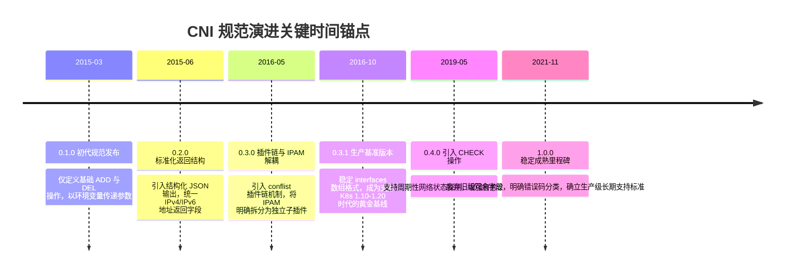
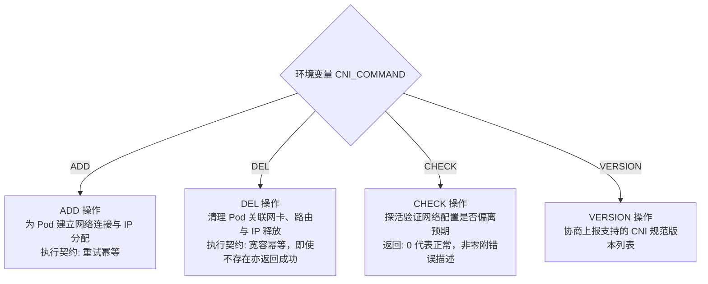
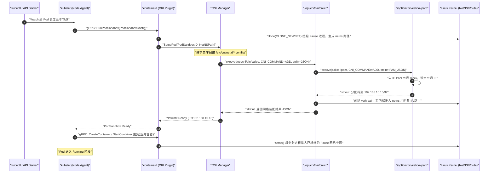
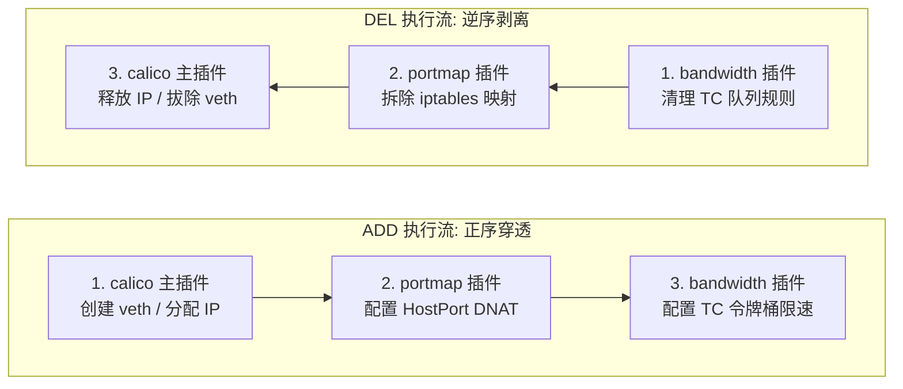
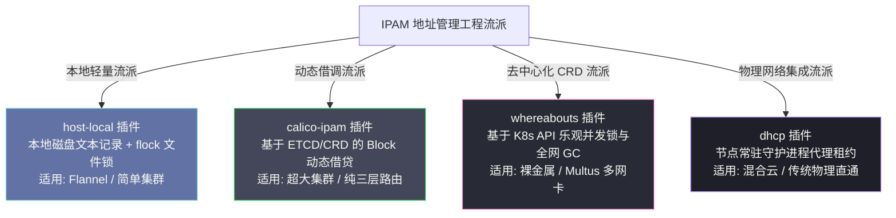
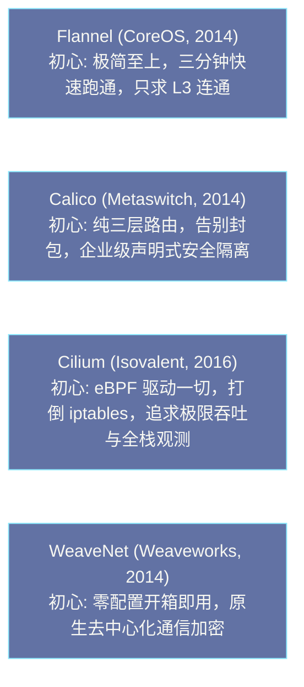
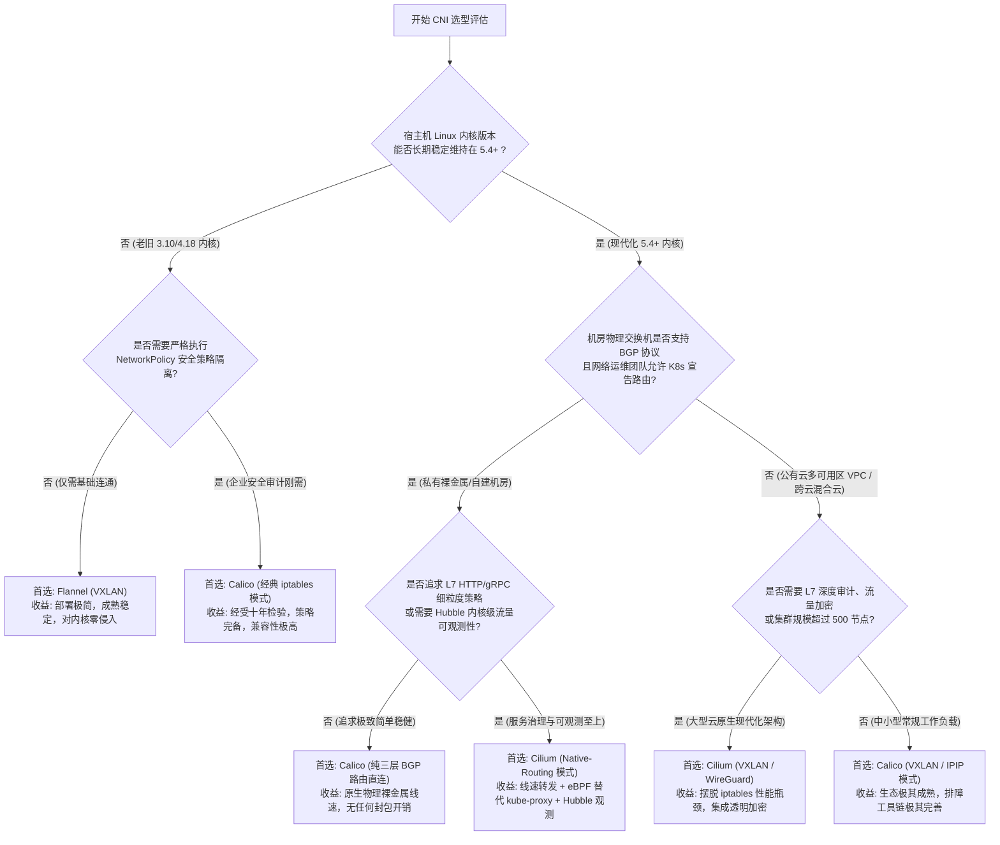
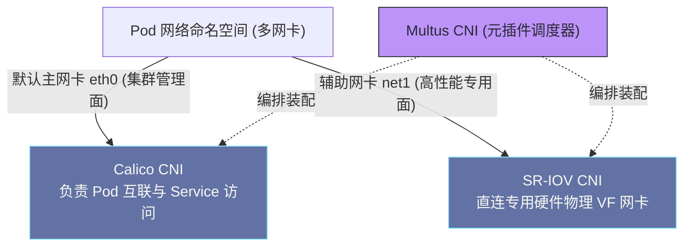

# CNI体系详解——插件规范、调用链与主流实现对比

**摘要：**

容器网络接口（Container Network Interface，后文简称 CNI）是 Kubernetes 繁荣网络生态的立身之本——它以极度克制的抽象，定义了容器运行时与底层网络基础设施之间唯一的交互契约。在 Docker 极力推崇内嵌状态的 CNM 模型的历史关口，Kubernetes 与 CoreOS 毅然选择了拥抱无状态与管道哲学的 CNI 规范，从而彻底解除了编排平台与具体网络驱动之间的深层耦合。本文沿着"标准接口如何支撑异构网络数据面"这一主线，系统剖析 CNI Spec v1.0 协议规范中的四大核心操作（ADD、DEL、CHECK、VERSION）与幂等性保障机制；追踪从 kubelet 发起声明式 Pod 创建到 containerd 经由 CNI Manager 调度插件链的毫秒级执行链路；深度拆解 IPAM 子系统（host-local、calico-ipam、whereabouts）在地址分配与状态维系上的不同流派；最后以技术本质为坐标系，横向对比 Flannel、Calico、Cilium、WeaveNet 四大主流插件在拓扑模型、数据面性能与安全策略上的架构取舍，并构建工业级选型决策树。本文旨在解答两个核心问题：CNI 究竟是如何凭借无状态二进制调用规避运行时单点故障的，以及在大规模生产级集群中应如何依据底层网络拓扑与安全合规要求作出理性的插件选型。

---

## 第 1 章 历史抉择：CNI 与 CNM 的标准之争

### 1.1 2015 年的容器网络战国时代：Docker libnetwork 与第三方插件的割据

要理解 CNI 规范的技术精髓，我们必须将目光重新聚焦于 2015 年前后容器基础设施领域的“标准战国时代”。

彼时，Docker 已经凭借优雅的镜像打包格式与极简的开发者体验席卷全球，正雄心勃勃地试图将其商业版图从单机运行环境扩张至分布式集群调度领域（即后来的 Docker Swarm）。在网络层面，Docker 官方于 2015 年正式发布了名为 **libnetwork** 的网络子系统，并提出了一套极具自身烙印的标准化模型——**CNM（Container Network Model，容器网络模型）**。

在 CNM 的设计哲学中，网络被抽象为三个严密的逻辑实体对象：
1. **Network Sandbox（网络沙箱）**：代表容器内部隔离的网络栈配置（包含独立的网卡接口、路由表以及 DNS 配置），在 Linux 系统中直接映射为一个 Network Namespace；
2. **Endpoint（网络端点）**：代表将沙箱接入网络的挂载点，相当于虚拟以太网的一端，负责维系连接状态与端口属性；
3. **Network（网络网络）**：代表由多个互通端点共同构成的集合，可以是一个二层交换网段，亦可以是一个跨主机的 Overlay 隧道。

CNM 的这套设计在理论上极为完备，带有强烈的面向对象建模风格。但其致命的问题在于：**它被深度绑定在 Docker Daemon（Docker 守护进程）的内部架构之中**。在 CNM 体系下，所有第三方网络驱动（如早期开发的 Weave 或 SocketPlane）都必须作为长期运行的外部守护进程，通过复杂的 HTTP RESTful 插件 API 与 Docker Daemon 进行双向通信；端点（Endpoint）与网络（Network）对象的生命周期状态，被强制持久化存储在 Docker 自身依赖的键值数据库之中。

对于正在迅猛崛起、致力于成为多语言、跨平台数据中心级操作系统的 Kubernetes 而言，CNM 的这种重量级设计带来了一场难以调和的架构冲突：
- 倘若 Kubernetes 采纳 CNM，就意味着其网络控制面必须被死死绑定在 Docker 守护进程的代码实现之上，丧失对底层网络生命周期的细粒度自主调度权；
- 更具现实威胁的是，当时包括 CoreOS、Red Hat 以及 Google 在内的云原生奠基阵营，正在积极推进包括 `rkt` 在内的多元化容器运行时生态，他们绝不可能允许整个开源生态的网络标准被 Docker 一家商业公司的专有守护进程所垄断。

### 1.2 CNI 与 CNM 的哲学分歧：无状态操作流与有状态对象模型的交锋

在这一历史关口，CoreOS 联合 Kubernetes 社区于 2015 年 3 月正式推出了针锋相对的 **CNI（Container Network Interface）规范**。

CNI 与 CNM 表面上是在争夺容器网络的标准化话语权，但深层次上，是两种截然对立的软件工程设计哲学的正面对决：

| 架构对比维度 | CNI（容器网络接口规范） | CNM（容器网络模型规范） |
| :--- | :--- | :--- |
| **主导阵营** | CoreOS、Google、Kubernetes、CNCF | Docker 公司、libnetwork 社区 |
| **核心抽象范式** | **操作原语（Operations）**：以过程流组织行为（ADD / DEL / CHECK） | **对象实体（Entities）**：以状态对象建模（Sandbox / Endpoint / Network） |
| **运行时依赖** | **无状态二进制程序（Executable Binary）**，即用即走，不留常驻进程 | **有状态守护进程（Daemon）**，必须常驻内存并暴露 HTTP 监听端口 |
| **通信交互机制** | **Unix 标准输入输出（stdin/stdout）+ 环境变量** | 基于 Socket 传输的 HTTP / RESTful API 远程调用 |
| **状态存储归属** | **外部解耦**：状态存储在 Kubernetes etcd、节点文件系统或由插件自理 | **内置强绑定**：网络元数据由 Docker 守护进程及其内置 KV 库强制维护 |
| **系统侵入性** | 极低，对容器运行时零代码侵入，纯粹的管道解耦 | 极高，运行时必须实现一套复杂的插件注册与健康状态探测机理 |
| **最终历史命运** | 成为 CNCF 毕业级官方标准，统治 Kubernetes 与现代云原生生态 | 随 Docker Swarm 的退潮而逐渐收缩为 Docker 单机私有实现 |

正如周志明先生在剖析分布式架构演进时所指出的：**在基础架构的核心契约层，越是看似轻量、克制、无状态的极简设计，往往越具备穿越技术周期的强大生命力**。

CNI 彻底摒弃了 CNM 庞大而繁复的对象模型，它不再试图去定义什么是“网络”、什么是“端点”，而是极其清醒地回归到容器网络最底层的本质动作：
当一个容器被拉起时，编排系统究竟需要做什么？
无非是需要有人往这个隔离的命名空间里“添加（ADD）”一张配置好 IP 与路由的网卡；
而当容器被销毁时，又无非是需要有人去“清理（DEL）”掉这张网卡并归还被占用的 IP 地址而已。

既然核心诉求仅仅是这两三个动作，那么为什么还要引入一套充斥着心跳维持、连接重连与分布式对象同步的 HTTP 守护进程？为什么不能直接利用 Unix 世界数十年来最成熟可靠的进程间通信原语——可执行文件结合标准管道来解决问题？

正是这种对 Unix 管道哲学（Do one thing and do it well）的坚定回归，使得 CNI 在轻量化、故障隔离性与生态集成成本上展现出了对 CNM 的绝对优势。当 containerd 与 CRI-O 随着 Kubernetes 废弃 dockershim 而成为工业界事实标准容器运行时之后，CNI 也随之彻底加冕为整个云原生世界无可争议的通用网络接口规范。

### 1.3 CNI 规范的十年演进脉络：从 0.1.0 到 1.0.0 的时间锚点

从 2015 年诞生至今，CNI 规范经历了十余个小版本的平滑迭代与演化，其核心语义始终保持着惊人的向后兼容性与稳定性：



在这份跨越十载的演进序列中，最值得关注的关键节点是 2016 年发布的 **0.3.0 版本**与 2021 年发布的 **1.0.0 版本**。
0.3.0 版本通过引入 **`.conflist`（插件链配置文件）**，打破了过去单个插件包揽一切的局限，使得网络功能的乐高式积木拼装成为可能；而 1.0.0 版本的正式封箱，则标志着云原生网络规范从早期的野蛮探索期全面跨入坚固、稳定、严密的工业化成熟期。

---

## 第 2 章 CNI Spec v1.0：协议规范与交互语义的精确剖析

### 2.1 破除误区：CNI 插件是无状态可执行文件而非持久化守护进程

在日常的集群管理与排障交流中，我们经常能听到这样一种习惯性的说法：“某某节点上的 Calico CNI 挂了”，或者“Flannel CNI 进程占用了过多内存”。这种口语化的表述在工程概念上存在着严重的偏差，极易将初学者引入歧途。

我们必须在认知上做出最严格的物理切分：
**CNI 插件本身绝对不是一个常驻内存的后台守护进程（Daemon）**。
你通过 `systemctl` 找不到一个名为 `cni.service` 的系统服务，在宿主机的 `ps -ef` 进程树中也绝不可能捕捉到一个长期存活的 `flannel` 或 `calico` CNI 进程。真正的 CNI 插件，仅仅是一堆静卧在节点宿主机 `/opt/cni/bin/` 目录下的**标准 ELF 可执行二进制文件（Executable Binary Files）**：

```text
/opt/cni/bin/
├── bridge           # 负责将网络接口接入 Linux Bridge 的二层主插件
├── loopback         # 负责拉起并激活命名空间内 lo 设备的专用插件
├── host-local       # 基于本地文件记录管理单机 IP 分配的 IPAM 插件
├── flannel          # 负责桥接 Flannel 拓扑元数据的主插件
├── calico           # Calico 官方针对 Kubernetes 打造的主网络插件
├── portmap          # 基于 iptables 实现 HostPort 端口映射的元插件
├── bandwidth        # 基于 Linux TC 队列规则实现流量限速的元插件
└── tuning           # 用于微调命名空间内部 sysctl 核心参数的元插件
```

当我们在集群中部署所谓的 Calico 或 Cilium 时，我们通过 DaemonSet 方式运行在每个节点上的常驻 Pod（如 `calico-node` 或 `cilium-agent`），在严格意义上被称为该 CNI 插件的**控制平面代理（Control Plane Agent）**。这些常驻代理的核心工作是负责监听 Kubernetes API Server、同步全网路由状态并在本地编译规则；而容器运行时（containerd/CRI-O）在面对 Pod 的网络生命周期事件时，自始至终所调用的，只有 `/opt/cni/bin/` 目录下的那个短小精悍的 CNI 二进制程序。

这种设计的优雅之处在于实现了极致的**故障隔离（Fault Isolation）**：
即使节点上的常驻控制面 DaemonSet 发生内存溢出崩溃、发生网络分区或者处于版本滚动重启阶段，只要底层存储在 `/opt/cni/bin/` 下的二进制文件完好，容器运行时依然可以正常调用 CNI 二进制拉起或销毁 Pod。已经存在的 Pod 网络完全依赖 Linux 内核的数据结构在流转，绝不会因为控制面组件的瞬时抖动而发生全网断流。

### 2.2 核心操作的精确语义与幂等契约

CNI Spec v1.0 规范为所有合规的网络插件定义了四项最核心的执行原语，由环境变量 `CNI_COMMAND` 明确指定其操作类型：



#### 2.2.1 ADD 操作：为 Pod 建立网络连接
**触发时机**：当容器运行时成功调用内核创建出 Pause 容器，且该沙箱的 Network Namespace 路径已被固化在文件系统之上，但空间内部尚未配置任何可用网络时。

**执行职责**：
1. 打开 `CNI_NETNS` 所指代的网络命名空间文件句柄，在空间内部创建名为 `CNI_IFNAME`（通常固定为 `eth0`）的网卡接口；
2. 调用配置中声明的 IPAM 子插件，为该网卡从专属子网中裁切分配一个合法的 IP 地址与子网掩码；
3. 在命名空间内部注入默认网关与静态路由表项，确保容器流量能够顺利逃逸出本命名空间；
4. 在宿主机侧构建配套的二层网桥接入（Bridge Port）或路由条目（Host Route），打通宿主到达容器的双向寻址能力；
5. **幂等性保障**：在面对分布式系统常见的网络超时重试时，规范严格要求插件对同一个 `(CNI_CONTAINERID, CNI_IFNAME)` 组合具备重试幂等性。倘若由于上次调用响应超时导致运行时重试发起 ADD，插件若检测到底层网卡与 IP 已经配置妥当且参数吻合，必须直接返回成功的网络结构体，而绝不能抛出诸如“网卡已存在”的排他性错误。

#### 2.2.2 DEL 操作：完全清理网络配置
**触发时机**：当 Pod 被用户显式删除、被调度器驱逐（Evicted）或者在执行健康检测失败后的清理销毁阶段。

**执行职责**：
1. 拔除并销毁位于 Pod 命名空间内部的虚拟网卡接口；
2. 调用 IPAM 子插件，原子释放该容器所占用的 IP 地址租约，使其重归可用地址池；
3. 清理宿主机侧为该 Pod 注入的明细路由表项、ARP 静态条目以及关联的 Netfilter / iptables 防火墙规则；
4. **宽容幂等铁律（Permissive Idempotency）**：这是整个 CNI 规范中最具工程警示意义的一条规则。在真实的异常生产场景中，节点可能经历断电重启、磁盘故障或内核强制 Panic，DEL 操作极有可能在 ADD 根本未曾执行、或者在执行到一半便惨遭夭折的环境下被 kubelet 强制调用。规范强制规定：**DEL 插件在面对需要清理的网卡、路由或 IP 资源根本不存在的状况时，必须假定该资源已被成功清理，并直接返回退出码 0**。

> [!warning] 生产避坑：DEL 错误与 Pod 僵死在 Terminating 状态
> 许多自研或未严格遵循 CNI 规范的开源网络插件最臭名昭著的缺陷，正是违反了 DEL 宽容幂等原则。当插件在执行 DEL 时，若因为在本地目录找不到对应的 IP 分配记录便抛出异常退出，容器运行时（如 containerd）便会判定网络清理失败，并将错误抛回给 kubelet。kubelet 遵循声明式重试机制，会无限期地每隔数秒重新触发一次 CNI DEL。此时用户在命令行执行 `kubectl get pods`，便会看到该 Pod 永久卡死在 `Terminating` 状态无法清除。排查此类故障时，如果发现 Pod 长期处于 Terminating 且 `describe` 显示 `CNI failed to delete pod network`，往往正是插件违反了这一幂等底线。

#### 2.2.3 CHECK 操作：网络配置健康诊断
CHECK 操作自 CNI 0.4.0 版本起正式引入。它允许容器运行时在 Pod 的漫长运行生命周期中，主动向下探测其网络配置是否依然完好有效（例如检查网卡链路状态是否为 UP、IP 地址是否被意外解绑、默认路由是否被容器内部误删）。若检测到网络状态与最初 ADD 所建立的期望基线产生漂移，插件通过返回非零状态码提示运行时采取自愈动作。不过在目前的生产实践中，由于周期性执行外部二进制进程会带来显著的 CPU 唤醒与进程派生开销，主流运行时在默认配置下极少开启主动 CHECK 轮询。

#### 2.2.4 VERSION 操作：版本能力握手
这是一种轻量级的握手原语。当运行时以 `CNI_COMMAND=VERSION` 调用插件二进制时，插件仅需通过标准输出回传其所支持的 CNI 规范版本列表（如 `{"cniVersion": "1.0.0", "supportedVersions": ["0.3.1", "0.4.0", "1.0.0"]}`），用于双方在执行实质网络操作前确立协议解析基线。

### 2.3 管道参数与现场报文拆解

CNI 插件与运行时的通信界面被严格划分为两部分：**元数据通过操作系统环境变量注入，实质配置与返回拓扑通过标准输入输出的 JSON 文本流转**。

#### 环境变量参数矩阵
容器运行时在执行 `execve()` 派生 CNI 子进程前，必须在子进程的环境变量空间中注满如下上下文：

| 环境变量键名 | 核心含义与物理约束 | 典型生产示例值 |
| :--- | :--- | :--- |
| `CNI_COMMAND` | 声明当前需要触发的操作类型 | `ADD`、`DEL`、`CHECK`、`VERSION` |
| `CNI_CONTAINERID` | 容器运行时分配的全局唯一容器哈希 ID | `7d8f3b21a89c4e12...` |
| `CNI_NETNS` | 目标网络命名空间在宿主机文件系统的物理路径 | `/var/run/netns/cni-8d9b23-1123` |
| `CNI_IFNAME` | 强制要求插件在容器内部建立的网卡名称 | `eth0`（Kubernetes 标准固定为 eth0） |
| `CNI_PATH` | 插件在执行链式调用时寻找其他二进制的搜索目录 | `/opt/cni/bin` |
| `CNI_ARGS` | Kubernetes 额外透传的声明式元数据（K=V 格式） | `K8S_POD_NAME=nginx;K8S_POD_NAMESPACE=default` |

#### 标准输入（stdin）请求规范报文
在执行 `ADD` 操作时，运行时从 `/etc/cni/net.d/` 读取配置文本并通过标准管道送入：

```json
{
  "cniVersion": "1.0.0",
  "name": "k8s-pod-network",
  "type": "bridge",
  "bridge": "cni0",
  "isGateway": true,
  "hairpinMode": true,
  "ipMasq": false,
  "ipam": {
    "type": "host-local",
    "subnet": "10.244.0.0/24",
    "dataDir": "/var/lib/cni/networks",
    "routes": [
      { "dst": "0.0.0.0/0" }
    ]
  }
}
```

#### 标准输出（stdout）响应规范报文
插件执行成功后，以退出码 0 将如下富结构 JSON 数据打印在 stdout 上，供运行时解析捕获：

```json
{
  "cniVersion": "1.0.0",
  "interfaces": [
    {
      "name": "cni0",
      "mac": "0a:58:0a:f4:00:01"
    },
    {
      "name": "veth9c23da1",
      "mac": "3e:1a:8b:2d:4f:91"
    },
    {
      "name": "eth0",
      "mac": "0a:58:0a:f4:00:06",
      "sandbox": "/var/run/netns/cni-8d9b23-1123"
    }
  ],
  "ips": [
    {
      "interface": 2,
      "address": "10.244.0.6/24",
      "gateway": "10.244.0.1"
    }
  ],
  "routes": [
    {
      "dst": "0.0.0.0/0",
      "gw": "10.244.0.1"
    }
  ],
  "dns": {
    "nameservers": ["10.96.0.10"],
    "search": ["default.svc.cluster.local", "svc.cluster.local"]
  }
}
```

请仔细核验该响应报文中的 `interfaces` 与 `ips` 关联关系：
`ips` 数组中的 `"interface": 2` 是一个以零为基准的索引引用，它明确指出 IP `10.244.0.6` 正好绑定在 `interfaces` 数组中索引为 2 的那个设备（即位于沙箱内部的 `eth0`）之上。这种高度内聚且类型安全的结构定义，使得跨语言的运行时与插件协同变得无比稳健。

---


### 2.4 CNI 错误码规范与运行时恢复语义

在分布式生产环境中，调用外部二进制程序不可避免地会遭遇各类异常。为了防止容器运行时在面对错误输出时只能盲目重试或直接 Panic，CNI Spec v1.0 规范制定了一套标准化的**数值错误码体系（Numeric Error Codes）**。

当 CNI 二进制执行失败并以非零状态码退出时，规范要求插件必须在标准输出（stdout）中打印格式严格的 JSON 错误描述体，而非仅仅在 stderr 乱喷未经格式化的日志文本：

```json
{
  "cniVersion": "1.0.0",
  "code": 11,
  "msg": "Temporary resource contention",
  "details": "Failed to acquire IPAM file lock on /var/lib/cni/networks/k8s-pod-network within 5000ms"
}
```

规范定义的保留核心错误代码矩阵如下：

| 错误代码 (Code) | 官方常量标识 | 核心物理诱因与语义解释 | 容器运行时标准处理策略 |
| :---: | :--- | :--- | :--- |
| **1** | `Incompatible CNI version` | 插件不支持请求中声明的 `cniVersion` 版本 | 快速失败（Fail-Fast），阻止 Pod 启动并上报配置不兼容 |
| **2** | `Unsupported field` | 配置中包含了插件无法理解的必选参数字段 | 快速失败，提示平台管理员检查 CNI 配置文件语法 |
| **3** | `Container unknown` | 目标容器或网络命名空间在系统中已不存在 | **在 DEL 操作中必须被宽容忽略为成功**；在 ADD 中报错 |
| **4** | `Invalid env variables` | `CNI_COMMAND`、`CNI_NETNS` 等必要环境变量缺失 | 快速失败，通常表明容器运行时自身实现存在严重 Bug |
| **5** | `I/O failure` | 磁盘写穿失败、本地命名空间路径打开异常 | 重试三次；若持续失败则标记节点存在硬件级存储故障 |
| **6** | `Decoding failure` | 标准输入送入的 JSON 文本存在语法截断或损坏 | 快速失败，记录日志并拒绝执行 |
| **7** | `Invalid config` | CIDR 网段重叠、默认路由网关不处于子网内 | 快速失败，触发 Pod 进入 `CreateContainerConfigError` |
| **11** | `Try again later` | 临时性文件锁竞争（Lock Contention）或资源被占用 | **指数退避重试（Exponential Backoff Retry）** |

请特别关注 **错误码 11（Try again later）** 与 **错误码 3（Container unknown）**：
错误码 11 是 CNI 协议对现代微服务瞬间突发高并发创建 Pod 时锁争用问题开出的解药。当 `host-local` 插件遭遇文件锁竞争超时，或者 `calico-ipam` 在向 Kubernetes API 申请 Block 时遭遇 etcd 乐观锁冲突（CAS Mismatch），插件返回错误码 11，containerd 的 CNI Manager 捕获后不会立即击穿 Pod 生命周期，而是开启毫秒级的指数退避并重新发起调用，极大提升了弹性伸缩场景下的调度成功率；
而错误码 3 则是 DEL 宽容幂等性的技术试金石。当 kubelet 清理由于节点重启而早已丢失内存目录的孤儿容器时，插件必须识别该场景，不得阻塞清理队列。

---

## 第 3 章 完整调用链：从声明式 Pod 创建到 CNI 二进制执行

### 3.1 毫秒级时序全景图：kubelet、CRI 与 CNI 的协同交响

为了彻底打破将 Kubernetes 网络创建视为某种不可知黑盒的直觉迷思，我们必须顺着系统调用的调用栈，完整还原从用户在终端敲下 `kubectl apply`，到最终一个 Pod 网络接口就绪的微观时序旅程：



这套时序展现了现代云原生基础设施精妙的职责分层：
- **kubelet** 作为节点上的中央调度代理，完全不感知具体的网卡命名与 IP 分配算法，它仅仅通过 gRPC 协议向底层的容器运行时提出声明式诉求：“请为我准备好一个具备隔离网络沙箱的 Pod 环境”；
- **containerd** 扮演着系统调用与规范翻译官的角色，它负责拉起承载命名空间的基石进程，并作为调用发起方维护着整个调用生命周期；
- **CNI 二进制程序** 则作为最前线的特权工兵，进入内核实施手术，在短短几十毫秒的时间窗口内，完成从设备创建、空间跨越、地址分配到路由写入的一整套精密工序。

### 3.2 containerd 中的 CNI Manager 实现机制

在 containerd 内部，真正负责统管 CNI 调用的核心组件是内置的 **CNI Manager**（代码位于 containerd 代码仓库的 `pkg/cri/server/cni` 目录下）。理解 CNI Manager 的内部决策机制，是规避生产环境中多插件配置混乱的关键。

#### 1. 配置文件的扫描与字典序仲裁
当 containerd 节点服务启动时，CNI Manager 会主动监控并扫描 `/etc/cni/net.d/` 目录。当该目录下并存多个以 `.conf`、`.conflist` 或 `.json` 结尾的配置文件时，containerd 遵循一条极其严格且朴素的仲裁逻辑：**按文件名的 ASCII 字典序排序，并无条件选择排序位列第一的文件作为当前激活的默认网络配置**：

```text
/etc/cni/net.d/
├── 05-cilium.conflist       <-- 字典序最高，被 containerd 强制选中作为当前网络
├── 10-flannel.conflist      <-- 被静默忽略
└── 99-loopback.conf         <-- 被静默忽略
```

这种设计要求集群平台运维人员在实施网络方案改造时，必须保持高度的配置纪律性。倘若在将集群从 Flannel 迁移至 Calico 的过程中，仅仅通过 `kubectl apply` 部署了 Calico 的清单，却忘记清理遗留在宿主机磁盘上的 `10-flannel.conflist`，那么一旦两者的命名优先级发生微妙偏差，节点的网络装配行为就会陷入不可预测的混乱状态。

#### 2. 命名空间级别的并发锁保护
在典型的生产业务场景中，一个由 Deployment 控制的应用可能在瞬间触发数千个 Pod 的并发扩容，调度器会在同一个高规格工作节点上并发倾泻几十个 Pod 创建任务。如果多个 CNI 二进制进程在完全无锁的状态下并发对系统网络原语展开读写，极易在 IP 分配与宿主机网桥配置上引发不可调和的数据竞争与内核死锁。

为了防御这种风险，containerd 的 CNI Manager 在调用底层二进制前，会根据目标 Pod 的网络命名空间路径建立精密的内存级并发互斥锁（Mutex），确保针对同一个命名空间的 `ADD` 与 `DEL` 操作始终处于绝对线性的串行化执行流中，杜绝了并发执行时的状态撕裂。

### 3.3 插件链（Plugin Chaining）的洋葱模型

自 CNI 0.3.0 版本起引入的 **插件链（Plugin Chaining）** 机制，是 CNI 规范最具扩展魅力的发明之一。它允许我们将复杂的网络功能，拆解为多个单一职责的微型插件，并像剥洋葱一样将它们串行层叠在一起执行。

一个典型的生产级 [[04 Calico深度解析——BGP路由、eBPF数据面与网络策略|Calico 插件]]链配置文件（`/etc/cni/net.d/10-calico.conflist`）往往呈现如下嵌套形态：

```json
{
  "cniVersion": "1.0.0",
  "name": "k8s-pod-network",
  "plugins": [
    {
      "type": "calico",
      "log_level": "info",
      "datastore_type": "kubernetes",
      "ipam": {
        "type": "calico-ipam"
      }
    },
    {
      "type": "portmap",
      "snat": true,
      "capabilities": {"portMappings": true}
    },
    {
      "type": "bandwidth",
      "capabilities": {"bandwidth": true}
    }
  ]
}
```



在插件链的洋葱模型下，执行流严格遵循如下铁律：
- **执行 ADD 时**：按照 `plugins` 数组所声明的顺序**正序执行**。第一个插件（主网络插件 `calico`）首先完成最厚重的重任——创建网卡并分配 IP，并生成基础响应结构体；随后，该结构体作为 `prevResult`（上一步输出结果）通过标准输入无缝喂给第二个插件 `portmap`；`portmap` 读取上一步分配得到的 Pod IP，在宿主机 Netfilter 中追加针对 HostPort 的端口映射链表，并更新结构体；最后流转至 `bandwidth` 插件，在宿主机网络外端配置 Linux TC（Traffic Control）的 HTB 队列规则实施 egress/ingress 速率限制；
- **执行 DEL 时**：按照数组声明的顺序**严格逆序执行**。系统首先调用 `bandwidth` 拆除限速规则队列，再调用 `portmap` 清理 iptables 防火墙脏数据，最后才调用 `calico` 拔除网卡并归还 IP。这种逆序剥离的设计，确保了依赖链条上层的附加网络功能始终在底层网络管道彻底断开前优雅谢幕。

### 3.4 生产调试技术：手写 JSON 模拟 CNI 调用排障

当生产集群中的节点突发偶发性故障，所有 Pod 频繁卡死在 `ContainerCreating` 阶段，且 `kubectl describe` 仅吐出一句含糊不清的 `networkPlugin cni failed to set up pod` 时，许多运维人员便会束手无策。此时，利用 CNI 的无状态管道特性展开**单机纯手工仿真调试**，便成了直击根因的利器。

我们可以通过如下四步法，在完全脱离 kubelet 与 containerd 的环境下，精准排查插件自身的崩溃缺陷：

```bash
# 1. 在宿主机手动开辟一个干净的测试网络命名空间
ip netns add debug-cni-ns

# 2. 在本地准备一份最精简的标准 CNI 配置文本
cat > /tmp/debug-cni.json << 'EOF'
{
  "cniVersion": "1.0.0",
  "name": "debug-network",
  "type": "bridge",
  "bridge": "cni0",
  "isGateway": true,
  "ipam": {
    "type": "host-local",
    "subnet": "10.244.0.0/24"
  }
}
EOF

# 3. 构造标准环境变量，强行在命令行拉起 CNI 二进制执行 ADD
CNI_COMMAND=ADD CNI_CONTAINERID=debug-container-999 CNI_NETNS=/var/run/netns/debug-cni-ns CNI_IFNAME=eth0 CNI_PATH=/opt/cni/bin /opt/cni/bin/bridge < /tmp/debug-cni.json

# 4. 观察执行退出码与结果输出
echo "Exit Code: $?"
ip netns exec debug-cni-ns ip addr show
```

通过这一手工注入流程，如果底层插件存在动态链接库缺失、文件权限越权、磁盘空间写满或者本地 IPAM 状态损坏等问题，所有的真实 Panic 堆栈与详细错误信息都会直接打印在终端屏幕上。这种极致的透明度，正是系统架构师对基础设施底层掌控力的最高体现。

---

## 第 4 章 IPAM 子系统：IP 地址管理的四种工程流派

### 4.1 职责解耦：主网络插件与 IPAM 插件的单一职责协作

在构建大规模容器网络时，**"数据包如何通达（Connectivity）"** 与 **"给容器发哪张门牌号码（Address Management）"** 是两个在关注点上完全异构的系统问题。主网络插件（如 bridge 或 flannel）的核心使命在于操纵内核网卡驱动与路由转发表，若强行要求它在代码内部再去实现一套复杂的分布式锁、CIDR 子网切分算法以及防冲突出租屋逻辑，势必会让插件的代码体积与维护复杂度发生灾难性的膨胀。

因此，CNI 规范将 IP 地址管理彻底解耦为了独立的 **IPAM（IP Address Management）子插件规范**。主网络插件在其配置文件的 `ipam` 字段中以声明式语法指定具体的 IPAM 驱动类型，并在执行期间直接将子进程派生委托给该 IPAM 二进制程序。纵观过去十年的技术演进，业界沉淀出了四种极具代表性的工程流派：



### 4.2 本地文件系统状态机：host-local 的极简设计与磁盘风险

`host-local` 是 CNI 官方维护的参考实现中最基础、最普及的 IPAM 插件，广泛应用于 Flannel 以及各种基于单机网桥的轻量级集群方案中。

#### 1. 工作机理：以文件系统充当持久化状态机
`host-local` 秉承着绝对的无依赖思想，它完全不需要任何外部的分布式数据库或网络 API，其所有的分配状态全部固化在宿主机的本地磁盘目录 `/var/lib/cni/networks/<network-name>/` 下：

```text
/var/lib/cni/networks/k8s-pod-network/
├── 10.244.0.2           # 文件名即已分配 IP，文件内容即 ContainerID
├── 10.244.0.3
├── 10.244.0.4
└── last_reserved_ip.0   # 内部游标：记录上一次分配结束的末尾 IP
```

当分配新 IP 时，`host-local` 首先对网络名称目录施加跨进程排他性 **文件锁（`flock`）**，随后读取游标文件 `last_reserved_ip`，以顺序轮询算法寻找下一个文件名不存在的空闲 IP，原子创建该文本文件并写入容器 ID，随后推进游标释放文件锁；当执行释放时，直接将对应 IP 的文本文件物理删除（`unlink`）即可。

#### 2. 局限与生产陷阱
虽然 `host-local` 的单机执行耗时低至数毫秒，但其弱点同样鲜明：
- **静态子网割裂**：它要求集群上层必须预先为每个节点划定互不重叠的子网网段（譬如每个节点切分一个 `/24` 掩码段，固定承载 254 个 Pod）。如果某个核心节点承载了大量微型无状态应用导致 IP 迅速耗尽，哪怕相邻节点的地址池还有大量空闲，`host-local` 亦无法在节点间实现动态调配；
- **磁盘 I/O 阻塞风险**：由于每一次 IP 分配和释放都需要同步执行磁盘写穿操作，当宿主机本地磁盘遭遇极其严重的 I/O 瓶颈（如根分区 IO 挂死）时，Pod 创建会因为等待 `flock` 文件锁超时而全量阻塞。

### 4.3 分布式资源池管理：calico-ipam 的 Block 动态借贷机制

面对大型企业级多租户集群，Calico 团队自研了功能远为强大、基于集群全局协调的 **`calico-ipam` 插件**。

#### 1. 核心抽象：IP Pool 与 CIDR Block
`calico-ipam` 不再对每个节点施加僵死固定的静态子网限制，而是引入了动态块分配机制：
- **IP Pool**：在集群范围定义的高层地址空间（通过 CRD `IPPool` 声明，如 `192.168.0.0/16`）；
- **CIDR Block**：Calico 将全局 IP Pool 切割为诸多细粒度的小块（Block，默认掩码为 `/26`，即包含 64 个 IP 地址）。每个节点在启动之初，只会被临时分配一个初始 Block；
- **动态借贷与分配（Block Borrowing）**：当某个节点的业务量激增、原分配的 `/26` 块全部被用尽后，`calico-ipam` 会自动向 Kubernetes API 发起基于原子 CAS（Compare-And-Swap）的事务请求，为该节点动态申领分配一个全新的可用 Block；更强悍的是，如果全网 Block 已经耗尽，它甚至允许节点跨界向其他空闲节点的 Block 临时借调（Borrow）单张具体的 IP 地址使用。

```yaml
apiVersion: projectcalico.org/v3
kind: IPPool
metadata:
  name: production-tier-pool
spec:
  cidr: 10.240.0.0/16
  blockSize: 26             # 每个动态 Block 切分为 /26 (64 个 IP)
  nodeSelector: zone == "east"
  ipipMode: Always
  natOutgoing: true
```

#### 2. 架构收益
`calico-ipam` 的所有分配状态全部持久化在 Kubernetes API Server 的 CRD（或独立 etcd）中，节点彻底摆脱了对本地易损文件系统的依赖。更重要的是，通过配合 BGP 路由协议，节点只需对外宣告自己当前持有的聚合 Block 路由，极大地压缩了机房核心交换机的路由表体积，赋予了超大规模集群弹性伸缩能力。

### 4.4 去中心化与物理集成：whereabouts 与 dhcp 插件

在边缘计算、电信 NFV 以及物理裸金属混合接入场景中，还活跃着两类特殊的 IPAM 方案：

#### 1. `whereabouts`：去中心化平坦地址分配
在某些不能运行 Calico 复杂控制平面的裸金属多网卡（如配合 Multus）环境中，工程师既希望拥有全局 IP 池的管理能力，又渴望摆脱本地单机文件的束缚。**`whereabouts`** 插件应运而生。它直接以 Kubernetes Custom Resource 作为存储介质，巧妙借助 Kubernetes API 的 `ResourceVersion` 乐观并发控制机制来防止并发分配冲突，并自带后台 GC 垃圾回收控制器，定期扫描全网销毁状态的 Pod 并安全清理僵尸租约。

#### 2. `dhcp`：与企业机房网络设施的全面合流
在需要将 Pod IP 直接暴露至企业传统局域网、并接受外部集中式硬件 DHCP 服务器管理的场景下，**`dhcp` 插件** 扮演着协议网桥的角色。由于 CNI 插件执行完毕后进程便会终结，无法维系 DHCP 协议周期性的租约续期心跳，`dhcp` 插件设计了一套代理架构：在节点上常驻运行一个轻量级的 `dhcp daemon`，而每次被 CRI 调用的 CNI 二进制仅需与该本地 Daemon 通信，由本地守护进程代表 Pod 向机房硬件路由器维持 DHCP 租约心跳。

### 4.5 四大 IPAM 方案全景横向对比矩阵

| 评估维度 | host-local | calico-ipam | whereabouts | dhcp |
| :--- | :--- | :--- | :--- | :--- |
| **状态持久化介质** | 本地宿主机文件系统 | Kubernetes CRD / etcd | Kubernetes CRD (资源对象) | 物理/虚拟网络 DHCP Server |
| **跨节点协调能力** | ❌（完全无协调，需静态划分）| ✅（动态 Block 申请与跨机借贷）| ✅（基于 K8s API 乐观并发锁）| ✅（由集中式 DHCP 服务协调）|
| **分配性能耗时** | 极高（约 1-3 毫秒） | 较高（约 20-50 毫秒） | 中等（受 API Server 响应影响） | 较慢（受网络广播与 DHCP 影响）|
| **自动垃圾回收 (GC)** | ❌（无，依赖 DEL 显式删除）| ✅（后台控制器强一致清理） | ✅（定时扫描 Reconcile 回收） | ✅（依据 DHCP 租约超时自然回收）|
| **外部系统依赖** | 零依赖 | 依赖 Kubernetes CRD 或 etcd | 依赖 Kubernetes API Server | 依赖物理机房具备 DHCP 服务设施 |
| **最适生产场景** | 中小型集群、Flannel 经典部署 | 企业级大规模多租户、BGP 路由 | Multus 辅助网卡、高性能离散计算 | 传统虚拟机平迁、混合云固定 IP 接入 |

---

## 第 5 章 主流 CNI 插件多维深度对比与选型决策树

### 5.1 四大主流插件的技术基因与演进出发点

在深入各插件的具体技术实现细节之前，我们必须首先建立一个核心认知：**没有任何一款网络插件是凭空诞生的，它们在设计之初所立下的首要工程目标，从根本上锚定了它们在后续十年演进中的技术基因与取舍边界**。



- **Flannel 的基因是“极简主义的救火队长”**：它的诞生完全是为了解决早期 Kubernetes 上手门槛过高的燃眉之急。因此它坚决放弃了诸如网络隔离策略、传输链路加密等一系列高阶功能，用最克制的代码量实现跨节点的网络铺设；
- **Calico 的基因是“企业级通信基础设施的守正出奇”**：它的团队深具传统电信运营商网络与大规模数据中心运维背景。他们对性能损耗明显的软件封包隧道抱有天然的警惕，立志利用互联网历经考验的 BGP 路由协议与 Linux 原生 iptables/ipset 框架，打造一套性能零折损、安全策略极其周密的工业级方案；
- **Cilium 的基因是“内核技术革命的颠覆先锋”**：它从降生的那一刻起，便认准了传统的 Linux 网络协议栈与 iptables 线性链表在大规模微服务环境下的必然瓶颈，坚决以革命性的 eBPF 技术为唯一核心，将整个 Kubernetes 容器网络的数据转发面直接重构于内核底层；
- **WeaveNet 的基因是“多云异构的极速互联者”**：它主打完全无需任何前置网络拓扑感知的 Mesh 对等网络与内置透明加密，但由于过度依赖用户态封装与商业公司的变故，逐渐退出了超大型生产集群的核心舞台。

### 5.2 数据平面实现路径差异

四大插件在数据包转发路径（Datapath）的物理实现上，展现出了截然不同的演进哲学：

#### 1. Flannel：以软件隧道屏蔽物理异构
Flannel 提供三种经典模式（其源码机制详见下一篇专论）：
- **UDP 模式**：通过 TUN 设备在用户态进程（`flanneld`）中执行封解包。经历了 4 次用户态与内核态上下文切换，性能损耗严重，已彻底退役；
- **VXLAN 模式**：将封解包逻辑彻底下沉至 Linux 内核原生 VTEP 设备（`flannel.1`），在物理以太网报头外侧追加标准 50 字节的 UDP/VXLAN 外层报头，兼顾了跨可用区子网的穿透能力与较为可观的吞吐性能；
- **Host-GW 模式**：完全抛弃隧道封包，直接向宿主机内核写入纯三层静态路由。要求所有节点必须同处于同一物理二层广播域之中。

#### 2. Calico：纯三层路由宣告与双模数据面
Calico 奉行“IP 路由足够解决一切”的信条：
- **BGP 动态路由模式**：每个节点上运行开源路由守护进程 **BIRD**，通过建立 BGP 对等体（Peer），在秒级时间内将本节点管理的 Pod 网段宣告给全集群其他节点或物理 ToR 核心交换机。数据包在跨机通信时完全不改变外层 IP 格式，享受原生物理线速转发；
- **IPIP / VXLAN 跨子网自动降级**：当节点跨越了不同的三层路由网络、物理交换机拒绝学习容器路由时，Calico 允许开启混合模式，在同子网内保持 BGP 直连，跨子网时自动回退为轻量级隧道封包；
- **Felix 策略引擎**：在每个节点上常驻运行 Felix 组件，将声明式的 Kubernetes `NetworkPolicy` 高速编译为紧凑的 Linux `iptables` 规则链结合 `ipset` 高性能哈希集合；近年来更是演进出了基于 eBPF 的全新原生数据面。

#### 3. Cilium：eBPF 驱动的下一代网络革命
Cilium 彻底重构了网络数据面的执行范式（详见专栏第 5 篇）：
- **XDP / TC 双层挂载点**：在网络包进入网卡驱动的最前端（XDP）与协议栈入口处（TC），直接通过 JIT 编译执行的 eBPF 字节码程序接管流量处理；
- **终结 iptables 线性匹配**：将所有的 Service VIP 负载均衡与策略查找，全部置换为内核高效的 **BPF Map（B-Tree / Hash Map）**，将匹配时间复杂度由 $O(N)$ 降至 $O(1)$；
- **完全替代 kube-proxy**：在 Socket 系统调用层（`connect`/`sendmsg`）通过 Hook 直接将目标 Service VIP 篡改为后端实际 Pod IP，实现同节点短路通信的极致零拷贝转发。

### 5.3 跨维度量化对比矩阵

为了给架构师在技术选型时提供清晰客观的坐标系，我们从十个关键维度建立量化综合对比矩阵：

| 选型评估维度 | Flannel | Calico | Cilium | WeaveNet |
| :--- | :---: | :---: | :---: | :---: |
| **极简部署与上手成本** | ⭐⭐⭐⭐⭐（开箱即用） | ⭐⭐⭐（需了解路由原理） | ⭐⭐（依赖较新内核） | ⭐⭐⭐⭐（零配置组网） |
| **网络吞吐与传输延迟** | ⭐⭐⭐（VXLAN 有折损） | ⭐⭐⭐⭐⭐（BGP 原生线速） | ⭐⭐⭐⭐⭐（eBPF 极致优化） | ⭐⭐（用户态转发瓶颈） |
| **原生 NetworkPolicy 支持** | ❌（完全无过滤能力） | ✅（原生精细化 L3/L4 策略） | ✅（支持 L3/L4 及 L7 协议级）| ✅（基础 L3/L4 策略支持）|
| **内置透明传输加密** | ❌（不支持） | ✅（WireGuard 加密集成） | ✅（WireGuard / IPsec 双选） | ✅（内置 NaCl 软件加密） |
| **跨物理三层子网支持** | ✅（VXLAN 隧道原生穿透） | ✅（IPIP/VXLAN 混合回退） | ✅（Overlay 模式或物理路由） | ✅（Mesh 跨云对等互联） |
| **替代 kube-proxy 能力** | ❌（强依赖 kube-proxy） | ✅（支持可选 eBPF 数据面） | ✅（工业级成熟推荐实践） | ❌（强依赖 kube-proxy） |
| **深度可观测性能力** | ⭐（仅基础网络统计） | ⭐⭐⭐（支持 Flow Logs） | ⭐⭐⭐⭐⭐（Hubble 协议级洞察）| ⭐⭐（基础拓扑图） |
| **Linux 内核基线版本要求** | 低（Linux 3.10+ 即可） | 中（推荐 Linux 4.19+） | 高（强烈推荐 Linux 5.4+） | 低（Linux 3.10+） |
| **万级节点大集群扩展力** | ⭐⭐（etcd/路由表膨胀） | ⭐⭐⭐⭐⭐（BGP RR 分级架构）| ⭐⭐⭐⭐⭐（BPF Map 水平扩展） | ⭐（Mesh 拓扑规模瓶颈） |
| **开源社区生态健康度** | ⭐⭐⭐（维护平稳，少新特性） | ⭐⭐⭐⭐⭐（企业级事实标准） | ⭐⭐⭐⭐⭐（CNCF 顶级毕业项目） | ⭐（商业主体解散，归于维护）|

### 5.4 工业级选型决策树

结合上述量化分析，我们为企业级基础设施架构师总结出一套逻辑闭环的选型决策树：



---

## 第 6 章 CNI 高级扩展生态

### 6.1 多网卡需求：Multus CNI 元插件的“主从网卡”架构

在经典的 Kubernetes 网络认知中，每个 Pod 内部固定只有一张以太网卡 `eth0`。但在电信 5G 核心网（NFV）、高性能计算（HPC）以及金融分布式数据库场景下，单一网卡往往无法满足生产要求：业务控制面流量需要与高性能存储（RDMA / Ceph）流量从物理上实施彻底分离。

**Multus CNI**（由 Intel 主导贡献给 CNCF）充当了网络元插件（Meta-Plugin）的执牛耳者。它本身不发明任何网络实现，而是通过扮演“插件调度器”，允许一个 Pod 内部挂载多张物理或虚拟网卡：



通过 Kubernetes 自定义资源 `NetworkAttachmentDefinition`，Multus 使得第一张网卡 `eth0` 作为标准默认网络接入 Calico 或 Flannel，维持集群内部微服务发现与 Pod 通信；同时将第二张网卡 `net1` 以 Macvlan 或 SR-IOV 形式直插外部物理网络，实现了数据面与管理面的物理隔离。

### 6.2 硬件卸载：SR-IOV CNI 与 DPDK 绕过内核协议栈

对于机器学习大模型分布式训练（RDMA / RoCEv2）或高频量化交易系统，哪怕是 veth pair 纳秒级的内存指针重定向开销都是不可容忍的。

**SR-IOV（Single Root I/O Virtualization）CNI** 允许将单张高端物理网卡（PF，Physical Function）虚拟出数十个独立的虚拟功能接口（VF，Virtual Function）。配合 Kubernetes Device Plugin，SR-IOV CNI 能够直接将宿主机 PCI-e 总线上的某个硬件 VF，通过 IOMMU 内存映射直接挂入 Pod 的命名空间中，甚至允许 Pod 内部应用借助 **DPDK（Data Plane Development Kit）** 在用户态直接轮询网卡寄存器收发报文。这种方案彻底绕过了 Linux 内核网络协议栈与任何虚拟交换设备，将容器网络的转发性能推向了物理硬件的物理极限。

### 6.3 跨集群直通：Cilium Cluster Mesh 与 Calico BGP 互联的多集群拓扑

随着混合云与多数据中心容灾的普及，跨越单个 Kubernetes 集群边界的扁平网络互通成为必然。
- **Cilium Cluster Mesh**：借助轻量级控制平面同步多个集群的 Endpoint 元数据，在各个集群的节点之间自动建立统一的 VXLAN 隧道或 WireGuard 加密通信通道，使得集群 A 的 Pod 可以直接向集群 B 的 Pod IP 发起请求，并在数据包出集群时无缝施加跨集群的网络安全策略；
- **Calico 跨集群 BGP 互联**：通过将不同数据中心各个集群的 BIRD 守护进程，统一对接到企业骨干核心路由器（Route Reflector）上，将多个集群的 Pod CIDR 在全局网络层面实现路由宣告，构筑起真正横跨多数据中心的原生三层大平层网络。

---

## 第 7 章 总结与认知收束

### 7.1 认知升华：CNI 的成功证明了“规范越简单，生态越繁荣”

回顾 CNI 与 CNM 那场惊心动魄的标准之争，回顾从极简的 stdin/stdout JSON 报文到如今支撑起万级节点数据中心的波澜壮阔，我们不得不再次由衷赞叹 Unix 哲学与系统架构设计的力量。

正如周志明先生在《凤凰架构》中所总结的：**优秀的规范应当是克制、收敛且高度正交的；它应当在最关键的边界上确立坚固的契约，而将无穷的实现可能毫无保留地留给生态系统**。

CNI 没有去定义复杂的对象状态机，没有强加特定的网络协议，更没有在代码中引入沉重的常驻组件。它仅仅依靠三个基础操作、一组精悍的环境变量与几段简单的 JSON 文本，便化解了容器编排与异构网络设施之间长达数十年的结构性矛盾。正是这种对极简主义的坚守，使得无论是老牌稳健的 Flannel，还是企业级中流砥柱 Calico，亦或是掀起内核技术革命的 Cilium，都能在同一套接口下竞相绽放其技术光芒。

### 7.2 核心权衡：在开箱即用与功能扩展性之间的架构取舍

技术选型的本质就是面对不完美现实时的理性权衡：
- 如果你的团队规模较小、运维资源有限、集群以中小型开发测试为主，那么选择 **Flannel** 能够让你在三分钟内跑通系统，把宝贵的精力投入到上层业务逻辑的构建之中；
- 如果你的系统承载着企业核心交易、节点规模成百上千、对网络策略隔离有着严苛的安全合规要求，那么历经十年工业级生产检验的 **Calico** 永远是你最坚实可靠的避风港；
- 如果你的业务全面迈向微服务与服务网格架构，深陷大规模 iptables 规则链的性能泥潭，渴望极致的网络吞吐与内核级的 L7 观测透明度，那么由 eBPF 驱动的 **Cilium** 无疑代表着通向未来的最佳航标。

理解技术基因，把握架构取舍，因地制宜地为业务选择最合适的轮子，这正是每一位优秀的云原生架构师不可或缺的工程素养。

---

## 参考资料

1. **CNCF & CNI 官方标准规约**:
   - [CNI Specification v1.0.0 (GitHub 官方仓库)](https://github.com/containernetworking/cni/blob/spec-v1.0.0/SPEC.md)
   - [CNI Plugins Reference Implementation (containernetworking/plugins)](https://github.com/containernetworking/plugins)
2. **容器运行时与 CRI 规范**:
   - [containerd Architecture & CNI Manager Source Code](https://github.com/containerd/containerd/tree/main/pkg/cri/server/cni)
   - [Kubernetes CRI (Container Runtime Interface) v1 API Specification](https://kubernetes.io/docs/concepts/architecture/cri/)
3. **主流 CNI 项目官方技术架构**:
   - [Project Calico Architecture & BGP Peering Guide](https://docs.tigera.io/calico/latest/reference/architecture/)
   - [Cilium: eBPF-based Networking, Observability, and Security](https://docs.cilium.io/en/stable/overview/intro/)
   - [Flannel Networking Architecture & Backends](https://github.com/flannel-io/flannel/blob/master/Documentation/backends.md)
4. **经典著作**:
   - 周志明. 《凤凰架构：构建可靠的大型分布式系统》. 机械工业出版社, 2021.

---

> [!note] 思考题
> 1. CNI 规范对 `DEL` 操作强制要求实施宽容幂等性——即当试图清理的网络资源原本便不存在时，插件必须直接返回退出码 0 宣告成功。试深入分析：假若某个第三方 CNI 插件违反了这一规范，在检测到资源不存在时抛出了异常报错，会导致宿主机上的 kubelet 与 containerd 陷入怎样的无限重试恶性死锁？在生产排障中，为什么此类故障会导致 Pod 永久挂起在 `Terminating` 状态？
> 2. 在剖析 CNI Manager 的配置解析时，我们提到当 `/etc/cni/net.d/` 目录下同时存在多个 `.conflist` 配置文件时，运行时完全根据文件名的 ASCII 字典序决定哪个配置生效。试设想在实际生产中将一个存量集群由 Flannel 平滑灰度迁移至 Calico 的实战场景：如果只是单纯通过 DaemonSet 铺设了 Calico 的组件与配置，却未曾显式清理原有的 Flannel 配置文件，可能会引发怎样严重的网络装配不确定性？你将如何设计一套无损的生产 CNI 插件迁移切换方案？
> 3. Cilium 与 Calico 近年来均推出了基于 eBPF 的全新数据面，并声称能够完全替代传统的 `kube-proxy` 组件。试结合 Linux 内核底层处理网络包的机制深入思考：传统 `kube-proxy` 基于 iptables 的实现为何在集群拥有上万个 Service 端点时会遭遇 $O(N)$ 复杂度的性能悬崖？而 eBPF 在 Socket 层直接拦截系统调用的机制，又是如何在物理层面上打破这一瓶颈并实现零额外内核拷贝的？
